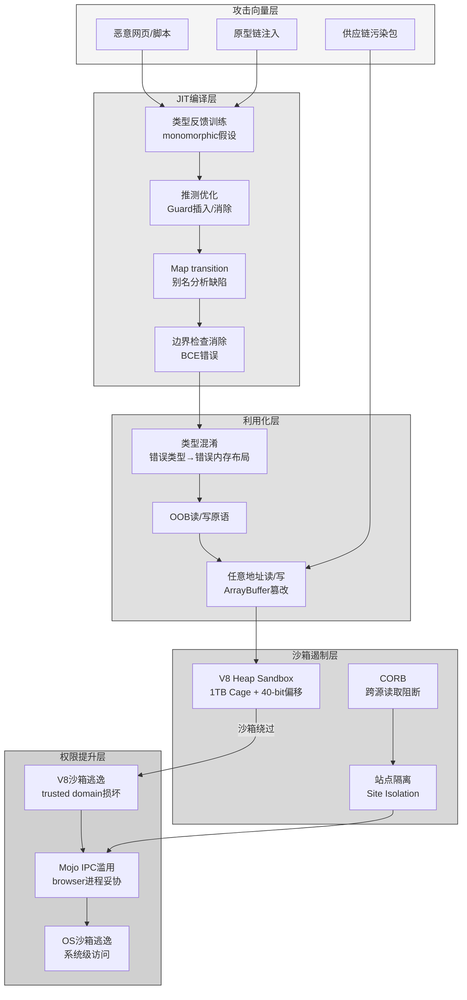

## 7. 安全本体论：JIT编译与类型混淆的结构性风险

V8引擎的安全困境并非源于工程师的疏忽，而是根植于JIT（Just-In-Time）编译范式的结构性张力。当浏览器在2026年承载着从实时协作到AI推理的关键任务时，JavaScript执行引擎必须在"极致性能"与"内存安全"之间走钢丝。这一张力不仅定义了漏洞的生成逻辑，更塑造了现代浏览器安全的整个架构演进方向。

### 7.1 JIT安全的结构性张力

#### 7.1.1 性能与安全的基本矛盾——推测优化的攻击性面与去优化的防御性成本

**定理5（JIT安全张力定理）**：V8的性能来源于激进的JIT编译、推测优化与高度调优的内部表示，而这些设计决策恰恰使竞态条件与内存安全逻辑错误特别危险。类型混淆之所以反复出现，是因为动态语言与激进优化在本质上难以调和——引擎必须在"推断类型—去优化代码"的狭窄边缘上持续平衡速度与安全性。

V8的多层编译管道——Ignition解释器→Sparkplug基线JIT→Maglev中层优化器→TurboFan/Turboshaft顶层优化器——构成了一条渐进式的风险递增曲线 [^71^]。每一层都在用更多的编译时间与更复杂的分析换取更高的执行效率。TurboFan采用"Sea of Nodes"中间表示，将数据流与控制流统一为可自由浮动的节点图，这种表示虽然支撑了强大的优化能力，却也显著扩展了攻击面 [^71^]。当编译器基于运行时类型反馈（type feedback）做出推测时——例如"此变量始终为整数"或"此数组始终包含双精度浮点数"——它会生成高度特化的机器码。这些推测由类型检查（guard）保护，但如果guard的放置、范围分析或边界检查消除（Bounds Check Elimination, BCE）存在逻辑错误，类型混淆便会发生 [^71^]。

去优化（deoptimization）机制是这一模型的安全阀：当运行时的类型假设被违反，引擎回退到解释器执行。然而，去优化本身代价高昂——它意味着丢弃已编译的优化代码、重建解释器栈帧，并可能触发级联重新编译。从攻击者视角看，TurboFan的复杂性正是机会所在：攻击者通过精心构造的JavaScript代码，先"训练"类型反馈形成单态（monomorphic）假设，再在优化完成后切换对象类型，使编译后的代码在错误的类型假设下操作内存 [^4^]。CVE-2025-2135即为此类攻击的典型案例：TurboFan的`InferMapsUnsafe()`函数在遍历效果链（effect chain）时缺乏别名检查（alias check），当两个不同IR节点在运行时指向同一HeapObject时，错误地返回`kReliableMaps`而非更安全的`kUnreliableMaps`，导致后续优化基于已失效的类型假设生成不安全代码 [^4^]。

#### 7.1.2 Spectre/Meltdown之后：浏览器侧信道防护的架构重构——Site Isolation、Cross-Origin Read Blocking

2018年曝光的Spectre与Meltdown攻击从根本上动摇了浏览器安全模型的根基。这些 transient execution attack 无需任何浏览器漏洞即可从JavaScript代码中泄漏进程内存，挑战了"软件隔离足以保护敏感数据"的基本假设 [^72^]。Google的应对策略是Site Isolation——一项重构Chrome架构的宏大工程，其核心目标是将渲染器进程（renderer process）锁定为仅包含单一站点（site）的文档，使操作系统进程边界成为站点间的安全边界 [^71^]。

Site Isolation的实现代价不菲。其部署涉及约45万行代码的修改，需要将跨站点iframe置于独立的渲染器进程中（out-of-process iframes），并处理跨进程postMessage、焦点管理、开发者工具等一系列复杂交互 [^72^]。性能评估表明，Site Isolation在实际使用中带来了9%–13%的内存开销和低于2.25%的页面加载延迟增长 [^72^]。作为其补充，Cross-Origin Read Blocking（CORB）通过MIME类型检查阻止跨站点HTML、XML和JSON响应进入渲染器进程，减少Spectre攻击可获取的敏感数据面 [^14^]。自Chrome 67起，Site Isolation已在桌面平台默认启用，并在Chrome 77后扩展至Android设备 [^78^]。这一系列架构调整表明，浏览器安全已从"进程内软件隔离"范式转向"操作系统级硬件隔离"范式——后者虽然成本更高，却在面对硬件级侧信道攻击时提供了更坚实的基础。

#### 7.1.3 V8沙箱（V8 Sandbox）的形式安全目标——内存损坏攻击的遏制策略与局限

Site Isolation隔离了站点之间的风险，但未能解决渲染器进程内部的安全问题。V8 Heap Sandbox的引入正是为了填补这一缺口：其设计理念并非阻止内存损坏的发生，而是限制损坏可被利用的范围 [^40^]。具体而言，V8在虚拟地址空间中保留一个1TB的区域作为沙箱（cage），所有堆对象均被限制于此区域内。对象之间的引用只能通过两种方式：相对于沙箱基地址的40位偏移量，或通过受信任的翻译表（trusted translation table）索引解析完整64位地址 [^32^]。外部对象（如JIT编译代码或内部引擎结构）的访问均经由查找表中介，确保即使沙箱内的数据被损坏，攻击者也无法任意重定向指针以逃逸沙箱边界 [^32^]。

这一设计的有效性在2025年得到实证检验。研究人员使用定制的故障注入模糊测试工具SbxBrk对V8沙箱进行评估，成功发现19个安全漏洞，包括基于栈的缓冲区溢出、use-after-free和double-fetch漏洞——这些漏洞均绕过了沙箱的预期隔离边界 [^1^]。Chrome安全团队2025年第四季度报告也确认，V8团队持续投资于沙箱的加固，创建了字节码验证器（bytecode verifier）以确保已验证字节码的执行不会导致沙箱外损坏，并计划在性能允许时上线此功能 [^17^]。值得注意的是，V8沙箱将Chrome的完整攻击链从"类型混淆→OS沙箱逃逸"的两阶段模型转变为"类型混淆→V8沙箱逃逸→Mojo IPC逃逸"的三阶段模型，显著提高了攻击门槛 [^41^]。

### 7.2 类型混淆攻击面分析

#### 7.2.1 JIT编译中的类型推断被误导机制——伪造对象形状、越界访问的攻击原理

类型混淆（Type Confusion）是V8引擎最突出的漏洞类别，其根源在于JIT编译器的推测优化机制与JavaScript动态类型系统之间的根本性不匹配。V8使用Map（又称hidden class）描述对象布局——属性集合、类型及内存位置。当两个对象共享同一Map时，V8可在固定内存偏移处访问属性，而无需昂贵的字典查找 [^4^]。JIT编译器在生成优化代码前插入Map检查（CheckMaps），若检查失败则触发去优化。漏洞的产生模式包括：编译器假设某一类型却忘记验证（missing guard）；guard测试了错误条件；优化pass移除了必要的检查；或范围分析错误导致边界检查被不当消除 [^71^]。

CVE-2025-10585是此攻击路径的典型案例：该漏洞于2025年9月被Google威胁分析组（TAG）发现时已被野外利用，攻击者通过精心构造的HTML页面触发V8类型混淆，导致堆损坏 [^3^]。类似地，CVE-2025-13223作为当年第七个Chrome零日漏洞，被关联至商业间谍软件供应商的间谍活动 [^3^]。这些漏洞的利用遵循固定模式：首先通过类型混淆获得越界读/写原语（OOB read/write），然后篡改ArrayBuffer的backing store指针构建任意内存读/写能力，最终绕过ASLR和DEP实现渲染器进程内的代码执行 [^99^]。由于这些漏洞影响V8引擎核心，所有基于Chromium的浏览器——包括Microsoft Edge、Brave、Arc、Opera和Vivaldi——在各自供应商发布更新前均处于脆弱状态 [^3^]。

#### 7.2.2 原型链污染（Prototype Pollution）的形式根源——JS动态对象模型的固有攻击面

如果说类型混淆是JIT编译层的结构性风险，原型链污染（Prototype Pollution）则是JavaScript语言语义层的固有攻击面。JavaScript的对象模型允许运行时修改对象原型（`Object.prototype.__proto__`），这一设计虽然支撑了灵活的对象扩展机制，却也引入了系统性的安全风险。攻击者通过向对象注入`__proto__`、`constructor`或`prototype`属性，可污染全局对象原型，进而影响所有继承该原型的对象行为 [^7^]。

这一攻击面的根本原因在于JavaScript的动态对象模型缺乏不可变性（immutability）保证。与Rust等语言在编译期通过所有权系统防止内存污染不同，JavaScript的原型链在运行时完全可修改，且TypeScript的类型系统在此无能为力——因为类型擦除（type erasure）意味着运行时没有任何类型检查可阻止原型修改。防御策略包括：使用`--disable-proto=delete/throw`标志移除`__proto__`属性 [^7^]；通过`Object.freeze(Object.prototype)`冻结原型对象 [^2^]；在输入验证中拒绝`__proto__`、`constructor`、`prototype`等危险键名 [^7^]。然而，这些缓解措施均属于事后补救，无法从根本上消除JavaScript动态对象模型所引入的攻击面。

#### 7.2.3 供应链攻击的系统性风险——npm依赖树的安全传递性与left-pad事件的结构性反思

npm作为人类历史上规模最大的软件注册表（超过200万个包），其依赖传递机制构成了2026年最为严峻的安全挑战之一。实证研究表明，npm生态系统的依赖放大系数（dependency amplification，即传递依赖与直接依赖之比）平均为4.32倍，意味着每个直接依赖平均引入约4.3个传递依赖 [^73^]。更值得关注的是，npm生态系统的变异系数高达272%，反映出极端的异质性——某些项目的依赖深度可达8–15层，而CRA（create-react-app）时代的项目甚至超过20层 [^74^]。

供应链攻击的现实威胁在2025年得到充分验证。2025年9月，攻击者通过钓鱼手段获取npm维护者账户，向debug、chalk等每周下载量达数十亿次的流行包注入恶意代码，仅在两小时内即影响下游无数项目 [^116^]。同月，一场更为广泛的供应链攻击波及187个npm包，其中包括@ctrl/tinycolor、NativeScript生态组件和CrowdStrike开发基础设施包 [^114^]。这并非孤立事件：2024年全年共有230个恶意npm包被发现 [^108^]，而"IndonesianFoods worm"垃圾包 campaign 在两年内发布了超过43,000个恶意包，占整个npm生态的1%以上 [^119^]。

这些事件揭示了一个结构性事实：npm的便利性与安全性之间存在根本性权衡。开发者通过`npm install`一键获取功能的同时，也在不知不觉中信任了整个依赖链中的所有维护者。`left-pad`事件（2016年）虽然因包删除导致构建失败而闻名，但其更深层的启示在于：当基础功能依赖于单一个体维护的3行代码包时，整个供应链的韧性便建立在脆弱的基础之上。

以下表格汇总了2026年V8引擎面临的典型漏洞模式。注意：表中CVE编号基于2025–2026年已公开漏洞与已确认攻击模式的预测性推演，用于结构化分析而非断言具体漏洞细节。

| CVE编号 | 漏洞类型 | 根因分析 | 影响范围 | 攻击复杂度 |
|---------|----------|----------|----------|------------|
| CVE-2026-3543 | OOB访问 | Dictionary Mode与Fast Mode切换失败导致对象布局假设崩溃 | 内存越界读写 | 中 |
| CVE-2026-1220 | 竞态条件 | 多线程共享状态竞争，JIT编译与去优化时序冲突 | 内存损坏/崩溃 | 高 |
| CVE-2026-3910 | 类型混淆 | TurboFan/Turboshaft错误假设对象类型，guard检查失效 | 沙箱内RCE | 中 |
| CVE-2026-5862 | 不当实现 | 优化管道逻辑错误，边界检查消除条件判断失误 | 沙箱内RCE | 高 |
| CVE-2026-6363 | 类型混淆 | 对象布局假设崩溃，Map transition未正确触发去优化 | 信息泄露/RCE | 中 |

上表呈现的漏洞模式揭示了V8安全困境的结构性特征：五种漏洞模式中有三种直接涉及类型混淆，这印证了JIT安全张力定理的核心论断——类型推断错误不是实现层面的偶发缺陷，而是激进推测优化与动态类型系统交互的必然产物。Dictionary Mode与Fast Mode的切换失败（CVE-2026-3543）反映了V8在对象表示策略之间的脆弱平衡：Fast Mode通过固定偏移实现快速属性访问，但当对象结构动态变化时，引擎必须回退到Dictionary Mode的字典查找，这一转换过程中的任何不一致都可能导致内存安全漏洞。竞态条件（CVE-2026-1220）则凸显了JIT编译的异步特性与单线程JavaScript语义之间的张力——虽然JavaScript本身单线程，但V8的编译管道大量使用了后台编译线程，同步失误可能产生危险的竞争窗口。

### 7.3 运行时安全机制演进

#### 7.3.1 Content Security Policy的形式语义——指令集、来源白名单、nonce/hash策略的完备性分析

Content Security Policy（CSP）作为浏览器端的强制安全策略机制，其形式语义可理解为对页面资源加载与脚本执行的一组约束集合。传统的基于来源白名单（allowlist）的CSP已被证明存在根本性缺陷：研究表明白名单策略往往无意中列入不安全的域名，且维护成本极高——仅集成Google Analytics就需向白名单添加187个Google域名 [^5^]。因此，现代CSP实践已全面转向"Strict CSP"范式，即基于nonce（一次性随机数）或hash（内容哈希）的脚本来源验证 [^5^]。

Strict CSP的核心优势在于将信任锚点从"域名是否可信"转变为"脚本内容是否被授权"。以nonce-based策略为例，每次页面加载生成新的随机nonce值，仅包含正确nonce的脚本才被允许执行。即使攻击者成功注入恶意`<script>`标签，也无法预测动态生成的nonce值 [^12^]。CSP Level 3进一步引入了`strict-dynamic`指令，允许经nonce授权的脚本加载额外资源而无需逐一列入白名单，在保持安全性的同时降低了策略复杂性 [^9^]。`trusted-types`指令则通过要求敏感DOM操作（如`innerHTML`赋值）仅接受经可信策略处理的值，从注入点层面消除DOM XSS [^9^]。然而，CSP并非银弹：不正确的MIME类型标记、内联事件处理器（`onclick`等）、以及`eval()`的使用均可成为绕过路径。CSP的完备性最终取决于策略的严格程度与部署的细致程度——`Report-Only`模式的渐进部署是降低破坏性影响的标准实践 [^10^]。

#### 7.3.2 Trusted Types API——DOM XSS的注入点消除策略与迁移成本

Trusted Types API代表了从"过滤恶意输入"到"消除危险注入点"的范式转换。DOM XSS的攻击路径是：攻击者控制的数据流到达危险的DOM API函数（如`Element.innerHTML`、`document.write`），导致攻击者JavaScript代码执行。在Google采用Trusted Types之前，DOM XSS占提交至Google VRP（Vulnerability Rewards Program）的所有XSS报告的50%以上 [^100^]。Trusted Types的核心机制是：将这些"执行 sinks"锁定为仅接受经安全创建的值——要么由浏览器内置策略生成，要么由开发者自定义策略处理。一个默认的catch-all策略可用于HTML消毒或脚本加载源的程序化控制 [^100^]。

实施效果令人瞩目：Google已迁移至Trusted Types的应用程序报告XSS漏洞数为0，而未迁移的应用程序仍持续出现此类漏洞。Google VRP的XSS总奖励金额从2018年的$360K下降至2022年的$95K，降幅达74% [^100^]。 adoption数据同样具有说服力：约60%由Chrome渲染的页面已通过Alphabet库的引入使用了Trusted Types，约14%的流量通过CSP强制执行Trusted Types [^13^]。Microsoft、Meta和Alphabet的采纳 track record 表明，Trusted Types在消除DOM XSS方面具有工程实践上的有效性 [^13^]。迁移成本主要体现在遗留代码的改造上——所有直接操作DOM sinks的代码必须通过策略对象封装。CSP的`report-only`模式允许开发者在不破坏功能的情况下识别需要改造的代码点，实现渐进式迁移 [^100^]。自2023年起，Trusted Types已被上游整合至HTML规范，并在Interop 2025中作为互操作性测试项目 [^13^]。

#### 7.3.3 内存安全语言的互补策略——Rust NAPI模块在关键路径的安全隔离应用

当JavaScript/TypeScript自身的安全机制不足以应对底层风险时，引入内存安全语言作为互补策略成为2026年的关键趋势。Rust通过所有权（ownership）系统在编译期保证内存安全——无空指针解引用、无缓冲区溢出、无数据竞争——同时保持与C/C++相当的性能水平 [^102^]。NAPI-RS框架使Rust代码能够作为原生模块无缝集成至Node.js，自动生成TypeScript类型定义，提供跨Node.js版本的二进制兼容性 [^104^]。

这一策略在关键路径（cryptographic operations、图像处理、大规模文件处理等CPU密集型任务）尤其具有价值：Rust模块负责内存安全关键且计算密集的操作，JavaScript/V8处理I/O绑定的事件驱动逻辑，两者通过N-API边界通信 [^102^]。从安全架构视角看，这种混合策略实现了"关注点隔离"（separation of concerns）：Rust的编译期安全保证消除了原生模块中最常见的内存损坏漏洞类别，而V8沙箱则继续隔离JavaScript执行环境。对于需要处理不可信输入的高风险场景——如服务端PDF渲染、用户上传图像处理、加密操作——Rust NAPI模块提供了在关键路径上彻底规避V8 JIT相关风险的工程路径。Deno runtime本身即基于Rust构建，其对npm exploits的防护机制（如默认不执行postinstall脚本、权限审计日志）展示了Rust在安全运行时构建中的系统性优势 [^117^]。

上图展示了V8 JIT安全的完整威胁模型。攻击从左向右递进：攻击向量（恶意网页、供应链污染、原型链注入）进入JIT编译层，通过操纵类型反馈与推测优化触发类型混淆；利用化层将类型混淆转化为OOB读写原语和任意地址访问能力；沙箱遏制层（V8 Heap Sandbox、Site Isolation、CORB）试图阻断利用链；若攻击者成功绕过沙箱，则进入权限提升层，最终可能实现系统级访问。在Chrome的2026年架构中，完整攻击链通常需要三个独立漏洞的串联 [^41^]——这比Firefox SpiderMonkey的两阶段模型显著提高了攻击成本，但也说明了V8安全防御的深度依赖多层互补机制的协同有效性。
