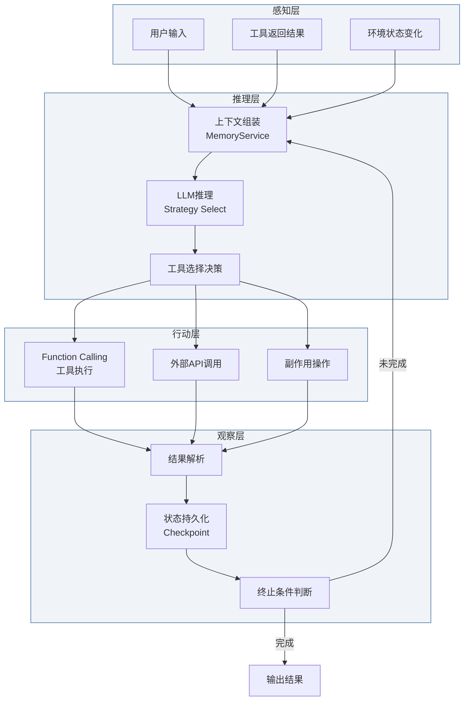

## 8. AI融合与范式转换：Agentic Programming

### 8.1 AI辅助编程对TS/JS生态的范式冲击

#### 8.1.1 大语言模型对类型系统的理解深度

AI编码助手的普及正在重塑TypeScript/JavaScript开发的底层逻辑。GitHub 2024-2025年的综合研究项目——基于SPACE框架对2,000余名开发者进行调查并对95名专业开发者进行对照实验——显示，使用GitHub Copilot的开发者任务完成速度提升55%，平均完成时间从2小时41分钟降至1小时11分钟，成功率从70%提升至78%[^80^]。2025年Stack Overflow开发者调查进一步表明，84%的专业开发者正在使用或计划使用AI工具[^85^]。Google与Microsoft在2025年双双披露，AI生成代码占其新代码的比例已超过20%[^85^]。这些数据勾勒出AI辅助编程从实验走向生产现实的清晰轨迹。

在这一范式转换中，TypeScript的静态类型系统扮演着独特的约束角色。研究表明，94%的LLM编译错误属于类型检查失败[^109^]。TypeScript的结构化类型信息为AI模型提供了明确的生成边界——当函数签名、接口定义和泛型约束作为上下文输入时，模型输出的代码在编译期即可被验证。相比之下，Python的类型提示仅在开发者主动使用mypy/pyright时才能提供同等约束，而运行时的动态性仍为类型违规留下通道。2025年8月，TypeScript以2,636,006名月活跃贡献者和66%的同比增长率首次超越Python成为GitHub上最活跃的语言[^112^]，这一里程碑标志着类型系统在AI时代获得了新的工程权重——它不仅是人类开发者的安全保障，更成为引导LLM生成正确代码的结构化契约。

然而，LLM对类型系统的理解并非完美。实证研究发现，AI在处理复杂泛型约束、条件类型（conditional types）和映射类型（mapped types）等高级TypeScript特性时仍表现出显著误差。模型的类型推断能力呈现出"浅层精确、深层模糊"的梯度特征：对基础接口和函数签名的推断准确率较高，但对涉及类型体操（type gymnastics）的场景则频繁产生幻觉。

#### 8.1.2 AI生成代码的质量谱系

AI生成代码的质量并非均匀分布，而是呈现出明显的可靠性梯度。CodeRabbit对470个开源仓库的拉取请求分析显示，AI生成的PR平均包含10.83个问题，而人类编写的PR为6.45个——AI的问题密度约为人类的1.7倍[^86^]。在问题严重性上，AI生成的PR包含1.4倍的关键问题和1.7倍的主要问题[^90^]。具体而言，AI代码在逻辑正确性错误上是人类的1.75倍，安全问题为1.57倍，性能问题为1.42倍[^90^]。在安全敏感场景中，约40%的AI生成代码含有关键漏洞[^85^]。

| 质量维度 | AI代码相对人类倍数 | 主要表现形式 |
|---------|------------------|------------|
| 逻辑与正确性错误 | 1.75x | 条件判断错误、控制流失误、边界条件遗漏 [^86^] |
| 代码质量与可维护性 | 1.64x | 命名不一致（2x）、格式化问题（2.66x）、可读性（3x）[^90^] |
| 安全问题 | 1.57x | 密码处理不当（1.88x）、XSS漏洞（2.74x）、不安全的反序列化（1.82x）[^90^] |
| 性能问题 | 1.42x | 过度I/O操作（约8x）[^86^] |
| 并发与依赖正确性 | 2.0x | 并发原语误用、依赖排序错误 [^86^] |

这一质量谱系揭示了AI代码生成的核心矛盾：模型在局部语法正确性上表现优异——AI代码的拼写错误仅为人类的56%[^90^]——但在需要跨文件语义一致性和深层逻辑推理的场景中系统性薄弱。大规模实证研究在663个仓库的1,646个提交中识别出28,149个运行时缺陷，其中最频繁的模式是"未定义变量或引用"（23,091例），表明AI生成的代码虽局部正确，却常因缺乏对周围上下文的深度理解而引入运行时错误[^85^]。

#### 8.1.3 类型系统作为人机协作的契约语言

TypeScript的类型系统正在从纯粹的技术工具演化为人机协作的契约语言。强类型上下文对AI生成质量的增强效应体现在三个层面：首先，显式类型声明为LLM提供了精确的生成约束，减少幻觉表面面积；其次，类型签名作为"活文档"使AI工具能够理解跨模块的调用契约；第三，编译期类型检查充当AI输出的自动验证层，在代码运行前捕获类型不匹配。

这一演化催生了从JSDoc注释到Schema-Driven AI调用的范式迁移。传统的JSDoc依赖自然语言描述，其语义模糊性为LLM理解带来歧义空间。而基于Zod等Schema验证库的类型定义——`z.object({ name: z.string(), age: z.number() })`——将人机接口形式化为机器可精确解析的结构[^16^]。当Zod schema与LLM的Function Calling机制结合时，类型系统不仅是代码层面的约束，更成为AI模型输出结构的定义语言：schema通过JSON Schema转换后直接传递给模型，约束解码器（constrained decoder）确保输出100%符合预定义类型结构[^91^]。这种"类型即契约"的模式正在使TypeScript成为AI原生开发的首选基础设施语言。

### 8.2 Agentic Programming架构

#### 8.2.1 AI Agent的软件架构模式

Agentic Programming代表着从"AI辅助编码"到"AI自主执行"的架构跃迁。其核心是感知-推理-行动循环（Perceive-Reason-Act Loop），一种被Anthropic、OpenAI和Google等主流AI平台一致采纳的迭代执行架构[^43^]。在每一轮迭代中，Agent从环境（用户输入、API响应、前次行动结果）感知输入，由LLM进行推理并选择下一步行动，执行工具调用或API请求，将观察结果反馈至下一轮循环，直至任务完成或达到终止条件。

在TypeScript工程实践中，这一架构可被形式化为以下框架：

*图注：Agentic Programming的核心循环架构。感知层收集多模态输入，推理层由LLM进行策略选择与工具决策，行动层执行具体的Function Calling或API调用，观察层解析结果并判断循环终止条件。TypeScript的类型系统贯穿各层，确保工具签名、状态转换和API契约的一致性。*

这一架构框架在TS/JS生态中已有成熟的工程实现。以`reactive-agents-ts`为例，其十阶段执行引擎将Agent循环细分为Bootstrap→Guardrail→Cost Route→Strategy Select→Think→Act→Observe→Verify→Memory Flush→Audit的确定性生命周期，每个阶段均通过TypeScript接口定义输入输出契约，支持before/after/on-error生命周期钩子[^44^]。在生产级系统中，LangGraph（LangChain的状态化编排层，2025年9月晋升至1.0版本）提供了基于状态图（State Graph）的Agent建模，支持持久化检查点、暂停/恢复能力和人机协作模式[^116^]。

#### 8.2.2 工具使用（Tool Use）范式

工具使用是Agentic Programming的基石能力。Function Calling机制允许LLM从预定义的工具集合中选择合适的操作并生成结构化参数。在TypeScript生态中，这一范式通过Zod schema与LLM Function Calling的深度集成实现了类型安全的工具调用：开发者使用Zod定义工具参数结构，`z.infer<typeof schema>`自动生成对应的TypeScript类型，schema的JSON Schema表示则作为工具描述传递给LLM[^16^]。这种"单一Schema定义，双重消费"模式消除了传统API集成中的类型重复问题。

MCP（Model Context Protocol）协议标志着工具使用范式的标准化跃迁。由Anthropic于2024年11月开源发布，MCP在一年内实现了97M+的月均SDK下载量、5,800+发布服务器和300+客户端应用[^46^]。2025年12月，MCP被捐赠给Linux Foundation的Agentic AI Foundation，完成了从单一厂商协议到行业标准治理的关键转变[^46^]。MCP TypeScript SDK作为Anthropic官方维护的核心SDK之一，支持Node.js、Bun和Deno三种运行时，提供Streamable HTTP和stdio传输层，并与Express、Hono等框架通过中间件包实现即插即用集成[^48^]。SDK v2（预计2026年Q1稳定发布）采用Standard Schema规范，兼容Zod v4、Valibot和ArkType等验证库，进一步强化了TypeScript类型系统与AI工具调用的融合深度[^48^]。

MCP协议定义了三种核心原语：Tool（可执行动作）、Resource（只读数据）和Prompt（可复用模板），并通过能力协商（Capability Negotiation）在客户端与服务器握手时确定双方支持的特性集合[^56^]。这一设计使得TS/JS运行时中的任何功能——数据库查询、文件操作、外部API调用——都可以被封装为类型安全的MCP工具，供AI Agent在推理过程中自主调用。

#### 8.2.3 多Agent协作系统

当任务复杂度超越单一Agent的处理能力时，多Agent协作系统成为必要架构选择。当前存在三种主导编排模式[^43^]：**Manager模式**（中央Agent通过工具调用将子任务委派给专业子Agent，OpenAI Agents SDK采用此模式）、**Orchestrator-Worker模式**（主导Agent生成并行工作者Agent进行探索性任务，Anthropic Claude Research使用此模式）和**Handoff模式**（对等Agent之间基于专业领域进行控制转移）。

在TS/JS工程实现中，编排模式（Orchestration）与自主模式（Autonomy）的权衡体现为设计空间的关键维度。编排模式提供确定性的工作流控制——LangGraph的状态图（State Graph）以节点和边明确定义Agent间的转移逻辑，支持人机协作审查点和容错重试机制[^116^]。这种模式适用于需要审计轨迹、合规审查和精确成本控制的企业场景。自主模式则赋予Agent更大的决策自由度——Agent基于环境反馈自主选择工具、调整计划和协作对象——ReAct Agent在此模式下通过推理与行动的交错迭代实现复杂任务分解[^111^]。

从工程实践看，多数生产系统遵循"单Agent先行，多Agent按需扩展"的渐进策略[^43^]。LangChain生态的数据显示，其600+预构建集成和50+向量数据库支持使多Agent系统的构建成本显著降低[^116^]，但调试复杂度随Agent数量呈非线性增长——当多个Agent独立决策时，理解并追踪跨Agent的推理链条需要专门的Observability基础设施（如LangSmith提供的追踪、评估和部署工具）[^113^]。

### 8.3 TS/JS在AI工程化中的定位

#### 8.3.1 JS作为AI应用开发语言的竞争力分析

TypeScript在AI应用开发中的崛起并非对Python的替代，而是对技术栈分层结构的重新定义。GitHub Octoverse 2025报告显示，尽管TypeScript以66%的同比增长率成为平台最活跃语言，Python在AI/ML领域的新仓库创建量仍占约50%[^109^]。两者的竞争力对比需要从分层视角理解：Python统治模型训练层（PyTorch、Hugging Face、scikit-learn），TypeScript则主导应用集成层（LLM SDK、全栈Web开发、AI功能产品化）。

| 工具/框架 | 核心定位 | TS/JS支持度 | 关键特性 | 适用场景 |
|----------|---------|-----------|---------|---------|
| MCP SDK | AI工具协议标准 | 官方一等支持（Node/Bun/Deno） | 5,800+服务器生态，Streamable HTTP传输，OAuth认证 | 企业Agent工具集成 [^48^][^46^] |
| LangChain/LangGraph | LLM应用框架 | Python+TS双SDK，LangGraph生产级编排 | 600+集成，状态图Agent，持久化检查点 | 复杂多步骤AI工作流 [^113^][^116^] |
| Chrome Prompt API | 浏览器内置AI | JS原生API（LanguageModel） | Gemini Nano端侧模型，零服务器成本，隐私保护 | 文本摘要、分类、内容改写 [^92^] |
| Transformers.js | 浏览器端ML推理 | JS库（Hugging Face官方） | ONNX Runtime Web后端，WASM/WebGPU双模式 | 客户端NLP、CV、音频处理 [^108^] |
| ONNX Runtime Web | 跨平台推理引擎 | npm包（onnxruntime-web） | WebGL/WebGPU/WebNN多后端，支持PyTorch/TF导出模型 | 自定义模型浏览器部署 [^50^] |
| Zod + LLM SDK | Schema驱动AI调用 | TS原生（Standard Schema兼容） | 编译期类型推断，JSON Schema自动生成，约束解码集成 | 类型安全的Function Calling [^16^][^91^] |

*表注：JS AI工具生态对比矩阵。MCP SDK在2025年实现指数级增长（97M+月下载），标志着TS/JS从AI消费层向AI基础设施层的渗透。Chrome Prompt API代表了浏览器厂商直接内置AI能力的趋势，使Web应用可在无外部依赖的情况下调用端侧模型。*

上表揭示了一个结构性趋势：TS/JS生态在AI应用层形成了从协议标准（MCP）到框架编排（LangChain/LangGraph）、从浏览器内置API（Prompt API）到端侧推理（Transformers.js/ONNX Runtime）的完整工具链。这种垂直整合能力使TypeScript成为构建AI驱动产品的"默认全栈语言"——前后端共享类型定义，AI SDK调用与业务逻辑在同一类型系统中无缝衔接[^109^]。

#### 8.3.2 WebAI/ONNX Runtime/WASM的浏览器端推理架构

浏览器端AI推理（Edge AI）正从概念验证走向工程化部署。ONNX Runtime Web通过WebAssembly（WASM）实现跨浏览器兼容的CPU推理，同时支持WebGPU和WebNN后端以利用GPU加速[^50^]。Hugging Face的Transformers.js在此基础上提供了与Python transformers库镜像的JavaScript API，使预训练模型的浏览器部署仅需数行代码即可实现文本分类、音频转录和对象检测[^108^]。

浏览器端推理的工程化路径遵循清晰的决策树：WASM提供最大兼容性但受限于CPU性能；WebGPU在支持的硬件上可提供数量级的加速，但其可用性仍取决于浏览器版本、操作系统和GPU驱动质量[^108^]。WebNN作为W3C标准化的浏览器ML API，旨在提供统一的硬件加速接口，但截至2025年底，其算子覆盖不完整且支持仍局限于实验性标志后面[^58^]。实践中，生产级部署需实现WASM→WebGPU→WebNN的优雅降级策略，并考虑模型量化（quantization）以控制下载体积和内存占用。

Chrome内置AI API（Prompt API）代表了另一种边缘AI路径：浏览器直接集成轻量级模型（Gemini Nano），通过标准化的JavaScript API暴露文本摘要、分类和改写能力[^92^]。该API的设计体现了端侧AI的核心约束——`LanguageModel.availability()`方法允许开发者查询模型可用性状态（available/downloadable/downloading/unavailable），`session.tokensLeft`提供剩余上下文预算，而`session.clone()`支持在对话历史过长时进行会话轮换[^92^]。这种将AI能力作为浏览器原生功能的架构选择，意味着未来Web开发者可能像使用`fetch()`或`localStorage`一样自然地调用AI功能，无需管理模型分发和运行时基础设施。

#### 8.3.3 类型系统与AI模型接口的融合前景

TypeScript类型系统与AI模型接口的融合正在从工程实践向语言设计层面深化。当前的演进路径可概括为三代范式：**JSDoc时代**（自然语言描述，语义模糊，模型理解依赖启发式推断）、**Schema时代**（Zod/JSON Schema定义，结构化约束，Function Calling的输入规范）和**类型原生时代**（编译期类型信息直接驱动AI调用契约）。

在Schema时代，TypeScript的"类型即Schema"哲学展现出独特优势。Zod的`z.infer<typeof Schema>`机制实现了运行时验证与编译期类型的单一来源定义[^16^]，当这一schema通过Standard Schema规范与MCP SDK v2集成时，类型系统成为跨越人类代码、AI模型和外部工具的三方契约[^48^]。OpenAI、Anthropic和Google Gemini在2024-2026年间陆续推出的结构化输出（Structured Output）功能，本质上是对这一范式的平台级认可——模型输出通过有限状态机（FSM）约束解码，确保每个token的选择都符合预定义schema的有效路径[^91^]。

展望类型原生时代，一个关键的技术方向是"类型保留编译"（type-preserving compilation）——当前TypeScript的类型擦除机制使运行时无法访问类型信息，这限制了AI模型利用类型系统进行更深层次的推理。若未来出现类型保留的JS子集或WASM编译目标，AI Agent将能在运行时直接查询类型定义以指导工具选择和参数生成，实现从"schema约束"到"类型驱动推理"的跃迁。

### 8.4 范式转换的批判性评估

#### 8.4.1 AI编程的边界条件

Agentic Programming的雄心需要与其实际能力边界对照审视。AI编程在三个领域表现出结构性局限。**创造性设计**——涉及深层架构决策、用户体验设计和创新算法构思的任务——仍高度依赖人类判断力。GitHub的研究表明，架构决策、复杂问题调试和系统设计"仍主要由人类主导"[^80^]。AI模型基于训练数据的模式匹配生成代码，而非从零构建新颖的抽象层次。

**复杂并发系统**是第二个边界。AI生成代码在并发原语使用上的错误率是人类的两倍[^86^]，这源于LLM对共享状态、 happens-before 关系和死锁预防等并发语义的理解停留在语法模式层面，缺乏对执行时序和内存模型的深度推理能力。TypeScript/JavaScript的单线程事件循环模型虽降低了部分并发复杂度，但在涉及Worker Threads、Atomics和共享内存的场景中，AI生成的代码仍需严格的人工审查。

**安全关键系统**构成最严格的适用性限制。研究表明AI生成代码在安全敏感场景中约40%含有关键漏洞[^85^]，XSS漏洞的出现率是人类的2.74倍，不安全对象引用为1.91倍[^90^]。对于金融交易、医疗设备和工业控制等容错率极低的领域，AI生成的代码不能未经形式化验证或严格审计直接部署。AI辅助代码审查虽被称为"形式验证的实用化近似"，但其严格性远不及Coq/Isabelle等证明助手——它捕捉的是常见模式而非逻辑必然性。

此外，AI生成代码的技术债务累积问题不容忽视。大规模实证研究在AI辅助提交的代码中识别出系统性质量问题：逻辑和语义缺陷在所有研究中均占主导地位，表明LLM在深层程序语义推理上持续挣扎[^89^]。随着Google和Microsoft等企业报告AI生成代码占新代码20%+[^85^]，代码库中未经充分验证的AI生成代码的累积效应将成为2026-2027年的核心工程治理挑战。

#### 8.4.2 开发者角色的演化轨迹

AI编程工具的普及正在重构软件开发者的能力模型。GitHub Octoverse 2025研究识别出开发者AI能力成熟的四阶段模型：AI怀疑者（AI Skeptic）→ AI探索者（AI Explorer）→ AI协作者（AI Collaborator）→ AI策略师（AI Strategist）[^87^]。80%的新GitHub开发者在2025年首周即使用Copilot，90%的软件专业人员已采用AI工具（较2023年的76%大幅跃升）[^87^]。

从"代码编写者"到"AI编排者"的转型包含三个维度的心理重构。第一维度是从手工编码到指挥模式（Conductor Mode）的迁移——开发者与AI进行实时交互式协作，如同结对编程，AI从加速器演变为共同作者[^88^]。第二维度是异步编排模式（Orchestrator Mode）——开发者向多个后台Agent分配任务，在隔离的云环境中执行、重试直至完成，随后进行结果审查与集成[^88^]。GitHub Copilot编码Agent在发布后五个月内即被用于合并超过100万个PR[^87^]，表明策略师阶段已非远景而是当下现实。第三维度是能力模型的重新定义——GitHub研究者Eirini Kalliamvakou对22名高级AI用户的访谈发现，他们不再以直接编写代码为主要活动，而是聚焦于"定义意图、引导Agent、消解歧义和验证正确性"[^87^]。

这一转型对工程团队的结构性影响已在劳动力市场显现：2025年7月的数据显示，22-25岁开发者的就业较2022年底下降近20%，而35-49岁开发者的招聘增长9%[^87^]。入门级岗位需求的收缩与资深岗位需求的扩张，反映了"实施商品化、架构价值上升"的市场重估。面试重点从编码练习转向系统设计、规格撰写、代码审查能力和AI委派技能[^87^]。对TypeScript/JavaScript生态而言，这意味着类型系统知识、架构设计能力和AI工具编排技能正在取代语法熟练度，成为核心竞争力指标。未来的"高级开发者"将不再是代码产出量最大的人，而是最能精确表达意图、最严格验证AI输出、最有效协调多Agent系统的人。
