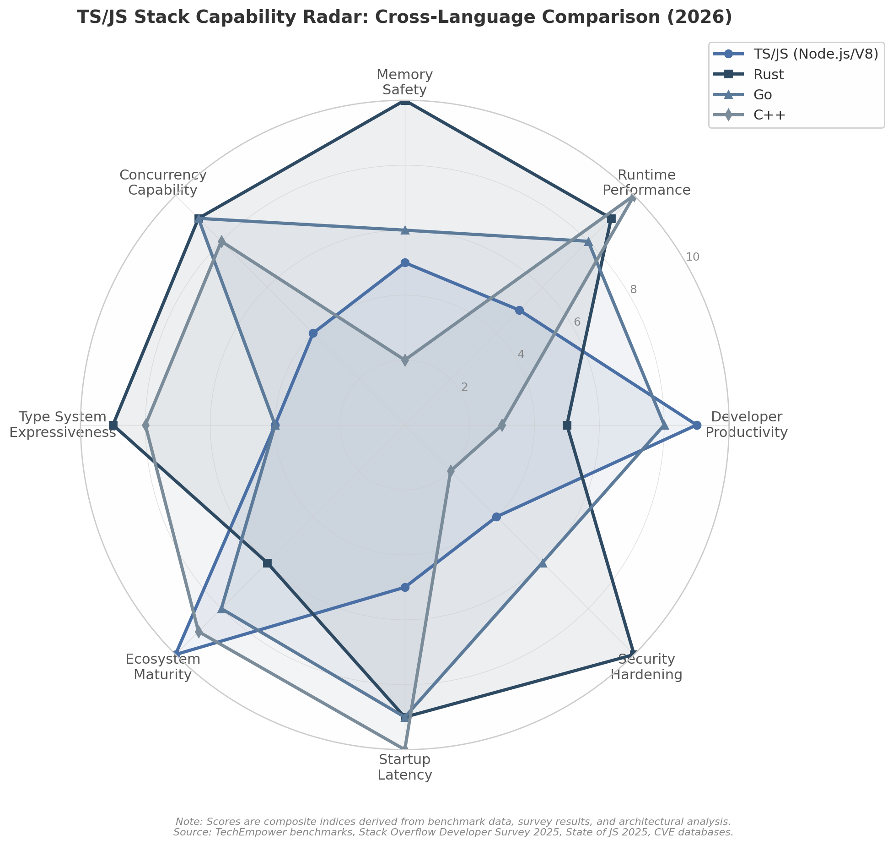

## 9. 批判性综合：TS/JS堆栈的边界、局限与结构性挑战

前述章节从语言形式转化（Ch2）、类型系统认知功能（Ch3）、运行时三体格局（Ch4）、渲染管道（Ch5）、全栈架构经济学（Ch6）、JIT安全张力（Ch7）到AI融合（Ch8），系统论证了TS/JS堆栈在2026年的技术能力与工程优势。然而，任何技术评估若仅呈现其优势而回避根本局限，便沦为推广而非分析。本章以批判性视角审视TS/JS堆栈的五个结构性边界——性能天花板、类型系统理论局限、生态系统结构性挑战、跨栈竞争力比较与演化预判——为技术决策者提供客观的风险-收益评估框架。

### 9.1 性能天花板的结构性分析

#### 9.1.1 单线程事件循环的原生约束

JavaScript的并发模型建立在单线程事件循环之上，这一设计在I/O密集型场景中表现卓越——异步非阻塞I/O使单个线程可并发处理数千个网络连接。然而，当面对CPU密集型任务时，事件循环的局限性暴露无遗：一个持续30秒的同步计算将阻塞所有定时器回调、网络响应和I/O完成事件[^162^]。Node.js Worker Threads提供了突破路径，但其约束显著——每个Worker是一个完整的V8 Isolate，内存开销约10MB，启动成本数十毫秒；相比之下，Go的goroutine起始仅需数KB内存，可轻松承载数千并发任务[^162^]。Worker Threads之间的通信依赖结构化克隆算法（Structured Clone Algorithm），无法序列化函数与闭包，迫使开发者将并发单元设计为独立程序文件而非内联代码块——这一体验更接近编写微服务而非调用并发原语[^162^]。

在CPU核心数持续增长的硬件环境下，JavaScript的并发利用率存在结构性瓶颈。Go程序可在32核机器上启动数十万个goroutine并实现真正的并行计算；而Node.js Worker Threads的数量受限于V8 Isolate的内存 footprint（每个约10MB），在相同硬件上仅能容纳数百个Worker，且线程间通信的序列化开销进一步侵蚀并行收益[^164^]。边缘计算场景中的V8 Isolates虽通过请求级水平扩展实现了并行性，但单个Isolate内部仍是单线程事件循环——这本质上是"避免共享状态"的并发哲学，而非"管理共享状态"的并行计算模型[^85^]。

#### 9.1.2 动态类型运行时开销的不可消除性

V8引擎的四阶段编译管道（Ignition→Sparkplug→Maglev→TurboFan/Turboshaft）通过推测优化将JavaScript执行效率推向接近原生代码的水平[^1^]，但动态类型的运行时开销无法从根本上消除。在TF-IDF与余弦相似度的CPU密集型后端基准测试中，TypeScript/Node.js的吞吐量约为1,200 req/s，而Rust（Actix Web）达3,887 req/s，Go达2,001 req/s——JavaScript的运行时性能约为Rust的31%、Go的60%[^169^]。这一差距的根源在于：V8必须在运行时持续追踪类型反馈（type feedback）、维护Hidden Class过渡链、并在类型假设失效时触发去优化（deoptimization）回退至解释器执行[^1^]。

WebAssembly（WASM）为这一瓶颈提供了补充路径。在图像处理（1920×1080分辨率）基准测试中，WASM（C++/Rust编译）执行时间为42-45ms，而JavaScript需450ms——WASM实现约10倍的加速[^173^]。在数学计算（素数计算）场景中，WASM较JavaScript快5.7倍[^173^]。这些数据量化了JavaScript在计算密集型任务中的性能边界：当算法复杂度超过特定阈值时，将热点路径迁移至WASM或NAPI原生模块不再是可选优化，而是必要的架构决策。

#### 9.1.3 内存管理的GC依赖

V8的垃圾收集器Orinoco采用增量标记（incremental marking）与并发清扫（concurrent sweeping）策略，已将STW（Stop-The-World）暂停时间压缩至毫秒级。然而，增量GC的本质并未改变——垃圾回收仍是与应用程序竞争CPU资源的背景进程，在内存压力高的场景下，GC开销可占处理时间的显著比例。对比研究表明，Go的GC同样消耗约10%的处理时间[^166^]，而Rust的所有权系统完全消除了运行时GC开销，内存管理成本在编译期即被确定。

在实时性场景中，GC的不可预测性构成结构性矛盾。音频工作站、实时交易平台和科学可视化应用要求亚毫秒级的响应确定性，而V8的GC调度策略以吞吐量优先而非延迟确定性优先。虽然V8提供了`--expose-gc`标志与`gc()`函数允许手动触发回收，但这打破了"自动内存管理"的工程契约，将复杂度重新抛回开发者。Rust的手动内存管理（通过所有权系统）和C++的智能指针策略在此类场景中提供了可预测的内存行为——代价是更高的开发复杂度与更陡峭的学习曲线。

### 9.2 类型系统的理论局限

#### 9.2.1 渐近类型化的类型洞（Type Hole）

TypeScript的渐变类型（gradual typing）设计通过`any`/`unknown`/`never`三元组实现了与JavaScript动态生态的无缝互操作，但这一设计引入了类型安全的系统性侵蚀机制。当代码路径中存在`any`类型时，类型检查器实质上被绕过——`any`类型的值可赋值给任何类型，任何操作在其上均被允许，编译器不会发出警告[^179^]。在大型代码库中，`any`的传播具有链式效应：一个模块使用`any`处理外部输入，其调用者接收`any`返回值，类型安全缺陷沿调用链逐级扩散。研究表明，即使代码库整体类型覆盖率高，少数`any"热点"即可显著削弱类型系统的保护效力[^179^]。

`unknown`类型的引入是对`any`问题的部分修正——`unknown`要求使用者在操作前进行类型收窄（type narrowing），但未从根本上消除类型洞。Safe TypeScript研究项目尝试通过运行时类型检查实现"安全的渐近类型化"，在编译后的JavaScript中嵌入残余检查（residual checks），但其性能开销达15%——这一代价在工程实践中难以被广泛接受[^179^]。TypeScript设计团队明确将互操作性（ergonomics）置于类型一致性（soundness）之上，这一选择使TS占据了"实用主义形式化"的独特中间地带（Ch3），但也设定了其类型安全保证的理论上限。

#### 9.2.2 运行时不存在的类型信息

TypeScript的类型擦除（type erasure）机制意味着所有类型注解在编译后完全消失[^177^]。编译后的JavaScript代码中不存在任何类型信息——接口、泛型参数、类型别名均被彻底剥离。这与Rust的monomorphization（为每个泛型实例生成特化代码）和Java的TypeToken（通过反射保留泛型信息）形成鲜明对比[^19^]。

类型擦除的后果是双重的。其一，运行时无法进行基于类型信息的优化或安全检查——当函数接收参数时，无法验证其实际类型是否与声明类型一致，除非显式添加运行时检查逻辑[^172^]。其二，TypeScript无法为动态数据（API响应、用户输入）提供隐式验证——若接口`User`定义了`name: string`和`age: number`，运行时接收到的数据可能是`null`、缺失字段或类型错误的对象，而TypeScript编译器对此无能为力[^184^]。Zod等schema验证库的存在正是对这一局限的工程回应（Ch6），但运行时验证的引入意味着开发者必须维护两套类型定义——编译时的TypeScript类型与运行时的Zod schema——增加了认知负担与同步成本。

#### 9.2.3 表达力天花板

TypeScript的类型系统虽已达到图灵完备（可编写任意复杂度的类型级程序），但在高级类型理论维度存在不可逾越的表达力边界。高阶类型（higher-kinded types，即"类型的类型"的类型参数化）、依赖类型（dependent types，值可出现在类型中的类型系统）和线性类型（linear types，约束资源使用次数的类型系统）在TypeScript中均不可表达。

Rust通过所有权系统实现了线性类型的工程近似——每个值有且仅有一个所有者，所有权转移后原引用失效——从而在编译期防止use-after-free和双重释放[^102^]。Haskell通过高阶类型支持`Functor`/`Monad`等抽象的多态组合。Idris和Coq等语言的依赖类型允许类型直接编码运行时值的约束（如"长度为n的向量"）。TypeScript在这些维度的缺失并非实现疏忽，而是其设计目标的直接映射——为一门动态语言提供"足够好的"静态检查，而非构建完整的定理证明环境。对于需要形式化验证的高安全保障系统（航空、医疗、金融核心），TypeScript的类型系统表达力不足以支撑可证明正确的程序构造。

### 9.3 生态系统的结构性挑战

#### 9.3.1 npm生态的质量长尾

npm作为人类历史上规模最大的软件注册表，截至2026年已突破200万个包[^47^]，其便利性背后隐藏着系统性的质量长尾问题。实证研究表明，npm生态的依赖放大系数（dependency amplification）平均为4.32倍——每个直接依赖平均引入约4.3个传递依赖，某些项目的依赖深度可达8-15层[^73^][^74^]。这意味着`npm install`一个看似无害的包，可能在依赖树深处引入数十个由陌生人维护的代码模块。

2025年的供应链攻击浪潮揭示了这种依赖结构的脆弱性。9月8日，攻击者通过钓鱼手段获取npm维护者账户，向debug、chalk等每周下载量达数十亿次的流行包注入恶意代码[^116^]。同日开始的"Shai-Hulud"蠕虫攻击最终波及500余个包，蠕虫通过窃取开发者凭证自动传播至受害者维护的其他包中[^165^]。11月的新西兰国家网络安全中心警报显示，蠕虫的进化版本开始包含破坏性载荷——当无法连接至攻击者基础设施时，会擦除用户主目录中的所有文件[^163^]。这些事件并非孤立：2024年全年发现230个恶意npm包[^108^]，"IndonesianFoods"垃圾包活动在两年内发布了超过43,000个恶意包，占整个生态的1%以上[^119^]。

npm生态的安全困境根植于其开放发布模型与便利性的根本性权衡。任何拥有npm账户的开发者均可发布包，无需代码审计或身份验证——这一低门槛设计是npm爆炸式增长的前提，也是供应链攻击频发的结构性原因。`left-pad`事件（2016年）早已警示：当基础功能依赖于单一个体维护的11行代码包时，整个供应链的韧性便建立在脆弱基础之上。

#### 9.3.2 工具链的复杂化趋势

JavaScript工具链经历了一条从"零配置"到"配置地狱"的悖论性演进。2025年State of JavaScript调查（约12,000名受访者）显示，Webpack虽被超过86%的开发者使用，却有37%表示不喜欢，仅14%喜欢——"配置噩梦"是最高频的抱怨[^174^]。Vite以84%的使用率和56%的正面评价成为新的社区首选[^174^]，但这种"迁移中的共识"本身引入了新的碎片化——Webpack、Vite、Rspack、Turbopack、esbuild、Parcel共存，每个项目都需要评估工具链选型。

| 工具 | 使用率 | 正面评价率 | 主要痛点 | 技术特征 |
|:-----|:------|:----------|:--------|:--------|
| Webpack 5 | 86% [^174^] | 14% [^174^] | 配置复杂、构建慢、HMR 1.5-3s [^178^] | 全功能bundler，生态成熟（2000+插件） |
| Vite 6 | 84% [^174^] | 56% [^174^] | 插件生态较新、Module Federation支持有限 | ESM原生，HMR <50ms，冷启动<1s [^178^] |
| Turbopack | 29% [^174^] | N/A | 兼容性、稳定性 | Rust重写，Webpack继任者 |
| Rspack | 低 | 中 | 生态建设阶段 | Rust重写，Webpack API兼容 |

*数据来源：State of JavaScript 2025 [^174^]，Tech Insider 2026 [^178^]*

工具链的复杂性不仅体现在bundler层面。TypeScript编译配置（`tsconfig.json`）的模块解析策略（`bundler`/`node16`/`nodenext`）、ESM/CJS双模打包条件导出、source map生成策略、类型声明文件（`.d.ts`）管理等，构成了一个需要专门知识维护的子系统。State of JS 2025调查中，开发者报告的构建工具痛点前五位依次为：配置复杂度（configuration）、性能问题、过度复杂性、Webpack特定问题、ESM与CJS互操作性[^175^]。这种工具链负担在小型项目中尚属可控，但在大型企业级应用中，专门的"构建工程师"角色已成为必要配置。

#### 9.3.3 前端框架的碎片化

前端框架生态在2026年呈现"一超多强"的碎片化格局。Stack Overflow 2025年调查显示React以44.7%的采用率居首，Angular（18.2%）与Vue.js（17.6%）紧随其后，Svelte（7.2%）和Solid.js（1.5%）虽份额较小但满意度极高[^171^]。State of JS 2024的数据更为分化：React使用率82%但留存率75%，Svelte使用率仅26%但留存率88%，Solid使用率9%而留存率高达90%[^171^]。

| 框架 | 使用率(SO 2025) | 满意度(SO 2025 "Admired") | State of JS 2024 留存率 | 技术范式 |
|:-----|:--------------|:-------------------------|:---------------------|:--------|
| React | 44.7% [^171^] | 52.1% [^171^] | 75% [^171^] | 虚拟DOM，Server Components |
| Vue.js | 17.6% [^171^] | 50.9% [^171^] | 87% [^171^] | 响应式系统，编译时优化 |
| Angular | 18.2% [^171^] | 44.7% [^171^] | 54% [^171^] | 全功能框架，依赖注入 |
| Svelte | 7.2% [^171^] | 62.4% [^171^] | 88% [^171^] | 编译器驱动，无虚拟DOM |
| Solid | ~1.5% [^171^] | N/A | 90% [^171^] | 细粒度响应式，无虚拟DOM |

*数据来源：Stack Overflow Developer Survey 2025 [^171^]，State of JS 2024 [^171^]*

这种碎片化的技术决策成本不可低估。每个框架代表一套独立的心智模型——React的Hooks规则与Server Components边界、Vue的组合式API与响应式代理、Svelte的编译时语义、Solid的细粒度信号——团队选定框架后需投入学习成本，而框架间的迁移往往意味着重写而非渐进改造。对技术决策者而言，框架选择的考量维度已从"哪个性能最好"扩展为"团队能否长期维护""招聘市场人才供给是否充足""生态插件是否丰富""框架发展方向是否与组织需求对齐"。React的Server Components架构（Ch6）虽在性能维度具有优势，但其"服务端/客户端组件边界"的概念复杂度对中小型团队构成了非 trivial 的认知负担。

### 9.4 跨栈比较与替代方案评估

#### 9.4.1 TS/JS vs Rust/WASM栈的适用边界对比

*图9-1：TS/JS (Node.js/V8)、Rust、Go、C++在八个维度的能力雷达图。评分基于基准测试数据、开发者调查结果与架构分析的复合指标（1=最低能力，10=最高能力）。TS/JS在开发效率与生态成熟度维度领先，Rust在内存安全与安全加固维度领先，Go在并发能力与启动延迟维度表现均衡，C++在运行时性能与启动延迟维度最优。*

上图以可视化方式呈现了四种语言栈的能力轮廓差异。TS/JS的雷达面积最大但分布极不均匀——在开发效率（9/10）和生态成熟度（10/10）维度占据绝对优势，在并发能力（4/10）、类型表达力（4/10）和安全加固（4/10）维度显著落后。Rust的轮廓接近"安全性能型"，在内存安全（10/10）和安全加固（10/10）维度满分，开发效率（5/10）因陡峭学习曲线而受限。Go的轮廓呈"均衡实用型"，无显著短板亦无极端优势。C++在运行时性能（10/10）和启动延迟（10/10）维度最优，但内存安全（2/10）和安全加固（2/10）的得分揭示了其长期的安全困境。

以下矩阵从七个关键维度对四种语言栈进行结构化对比：

| 维度 | TS/JS (Node.js/V8) | Rust | Go | C++ |
|:-----|:-------------------|:-----|:---|:----|
| **内存安全** | GC（Orinoco，增量标记） | 所有权系统（编译期保证）[^102^] | GC（并发标记） | 手动/智能指针（无原生安全保证） |
| **类型安全** | 编译期（TS）+ 运行时动态 [^177^] | 编译期严格（Sound） | 编译期 + 接口 | 编译期（无运行时检查） |
| **并发模型** | 单线程事件循环 + Worker Threads（~10MB/Isolate）[^162^] | Fearless Concurrency（所有权 + Send/Sync trait） | Goroutines（~数KB/协程）[^162^] | 原生线程 + 异步库 |
| **启动延迟** | 中（V8预热 ~148ms）[^43^] | 低（无运行时） | 低（小运行时） | 极低（无运行时） |
| **运行时体积** | 大（V8 ~55MB内存基准）[^43^] | 小（零运行时开销） | 中（~30MB） | 极小（libc依赖） |
| **CPU密集型性能** | ~1,200 req/s（TF-IDF基准）[^169^] | ~3,887 req/s（2.2x JS）[^169^] | ~2,001 req/s（1.4x JS）[^169^] | 基准 |
| **形式化验证** | 无 | 部分（MIRI， unsafe Rust审计） | 无 | 无 |
| **适用域** | Web/全栈/边缘计算/快速原型 | 系统/基础设施/密码学/高安全 | 云原生/微服务/网络服务 | 系统/游戏/嵌入式/高频交易 |

*数据来源：TechEmpower风格基准测试 [^169^]，运行时基准测试 [^43^]，语言官方文档*

上表揭示了TS/JS与系统级语言之间的根本性权衡。Rust的所有权系统在编译期消除整类内存安全漏洞（空指针解引用、缓冲区溢出、数据竞争），其NAPI-RS框架允许Rust模块无缝集成至Node.js，在关键路径上提供内存安全保证[^104^]。Go的goroutine模型使并发编程的复杂度大幅降低，其HTTP吞吐量在同等硬件上可达Node.js的1.6倍以上[^169^]。C++在极致性能场景（游戏引擎、高频交易、嵌入式系统）仍无可替代，但内存安全问题导致的CVE数量长期居各语言之首。

WASM作为JavaScript的补充而非替代，在浏览器端填补了计算密集型任务的性能缺口。图像处理、密码学操作、科学计算和游戏引擎等场景下，WASM以接近原生95%的性能运行[^173^]，而JavaScript仅能达10%-50%。JSON解析等JavaScript引擎已高度优化的场景反而是JavaScript更快——WASM的线性内存模型与JS引擎的优化数据结构之间存在桥接开销[^173^]。这一"互补而非替代"的关系定义了2026年的工程实践：JavaScript/TypeScript负责I/O绑定逻辑、DOM操作和协调编排，WASM/Rust模块负责CPU密集型热点路径。

#### 9.4.2 TS/JS vs Go/Java后端栈的服务端竞争力分析

在后端服务领域，TS/JS的竞争力评估需从三个维度展开。并发模型方面，Java的虚拟线程（Virtual Threads，Project Loom）和Go的goroutine均提供了比Node.js事件循环+Worker Threads更高效的并行抽象。Java虚拟线程在JVM上可承载数百万个轻量级线程，Go goroutine的调度效率经生产环境验证——两者在CPU密集型服务端工作负载中均展现出优于Node.js的吞吐量表现[^166^]。

类型系统方面，TypeScript的结构类型系统（Ch3）在开发效率上具有优势——无需显式接口声明即可匹配对象字面量，类型推断更智能——但在运行时安全维度，Java的泛型类型擦除（通过TypeToken部分补偿）和Go的接口动态分派均保留了更多运行时类型信息。Zod等库的引入使TS/JS可通过编译时+运行时双重保障弥补这一差距，但维护两套类型定义的工程成本是Go和Java开发者无需承担的。

生态成熟度方面，Node.js/npm生态在前端工具链、构建系统和JavaScript原生库维度具有不可替代的优势。但在企业级后端基础设施——服务网格（Service Mesh）、分布式追踪、APM监控、托管云服务集成——Java（Spring Boot生态）和Go（云原生计算基金会CNCF项目的主力实现语言）的成熟度仍领先。Stack Overflow 2025年调查显示，Node.js以48.7%的使用率稳居Web框架首位[^47^]，但在大型企业级后端架构中，Java和Go的份额在绝对数量上仍占优。

#### 9.4.3 技术栈选择的决策框架

技术栈选择不是寻找"最优语言"，而是在特定约束条件下求解"最适配组合"。以下三维决策矩阵提供了结构化评估框架：

| 决策维度 | 权重因子 | TS/JS最优场景 | 替代方案（Rust/Go/Java）更优场景 |
|:---------|:--------|:-------------|:-------------------------------|
| **场景驱动** | 性能需求、安全需求、实时性需求、计算密度 | 快速原型、I/O密集型API、全栈统一（前后端共享类型与逻辑）、边缘计算、实时协作（WebSocket） | 高吞吐微服务（Go/Java）、内存安全关键系统（Rust）、实时确定性系统（Rust/C++）、大规模数据处理（Java/Spark） |
| **团队能力** | 语言熟练度、并发编程经验、安全开发实践、运维成熟度 | 团队以全栈JS开发者为主、需快速交付MVP、前端团队扩展至后端 | 团队有系统编程背景、需长期维护大型代码库、安全合规要求高（金融/医疗/政府） |
| **长期维护** | 人才供给、生态可持续性、工具链稳定性、安全更新机制 | 生态规模最大（npm 200万+包）、开发者社区最活跃（GitHub 66%增长[^112^]）、AI工具集成最成熟（MCP 97M+月下载[^43^]） | 企业级支持（Java长期LTS）、语言稳定性（Go兼容性承诺）、安全审计基础设施（Rust Sec工作组） |

*表9-1：技术栈选择三维决策矩阵。该矩阵为架构师提供了场景-能力-维护三维权衡的结构化评估框架，决策应基于具体约束条件的加权评分而非通用偏好。*

上表揭示了一个核心结论：TS/JS堆栈在"开发效率×生态规模"的乘积空间内占据绝对优势，但在"性能×安全"的乘积空间内存在结构性天花板。对技术决策者而言，关键问题不是"是否应该使用TypeScript"，而是"在哪里使用TypeScript，在哪里引入互补技术"。2026年的最佳实践趋势是混合架构——Node.js/Bun承载API层与协调逻辑，Rust NAPI模块处理密码学与图像处理等内存安全关键路径，Go或Java微服务负责高吞吐计算密集型服务，WASM模块在浏览器端加速计算热点。这一" polyglot 统一"模式（Ch6）将每种语言部署在其最优适用域，通过类型安全的接口边界（tRPC + Zod + Protocol Buffers）实现跨语言协作，而非强求单一语言栈覆盖所有场景。

这种权衡的艺术——在动态性与静态检查、开发速度与运行效率、生态便利与供应链安全之间持续寻找最优平衡点——是TS/JS堆栈在2026年技术图景中的核心定位。理解这些边界与局限，与理解其能力同等重要：前者指导架构师在何时说"不"，后者指导在何时说"是"。
