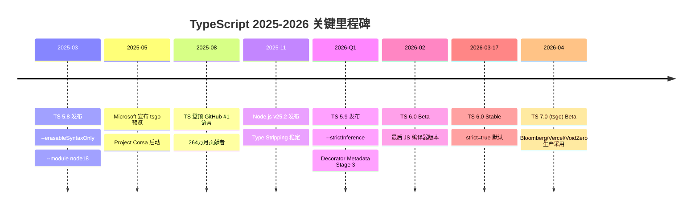
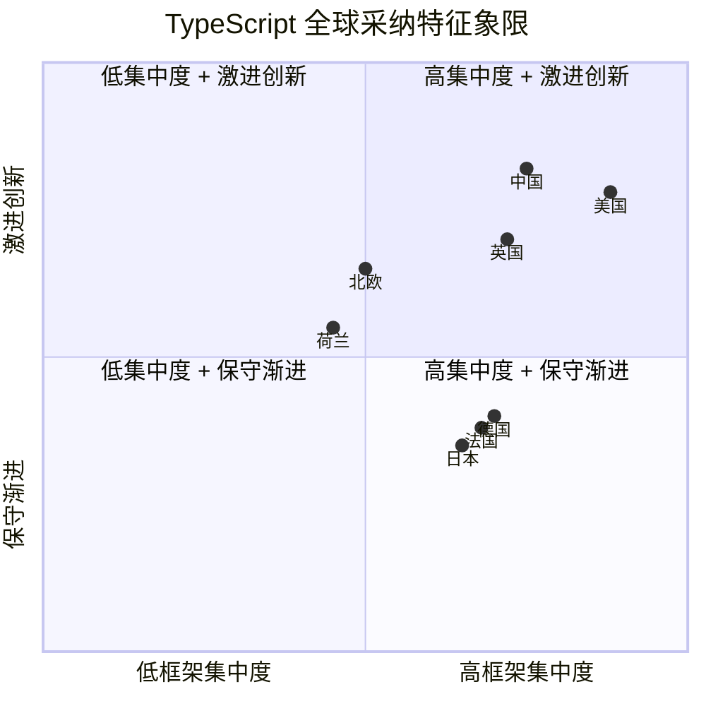
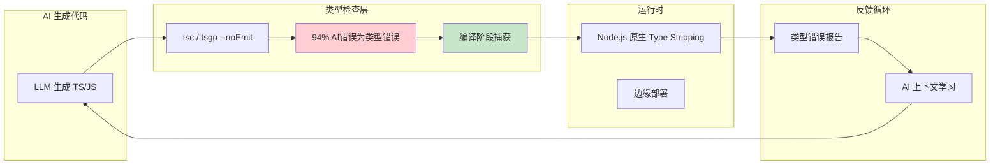

# TypeScript 语言与编译器演进 2026

> **文档类型**: 深度技术分析（Deep Technical Analysis）
> **分析日期**: 2026-05-06
> **数据截止**: 2026 年 4 月
> **适用范围**: 技术决策者、架构师、TypeScript 核心用户、工具链开发者
> **方法**: 多源数据交叉验证 + 官方发布记录 + 社区基准测试 + 生产案例研究

---

## 目录

1. [执行摘要](#1-执行摘要)
2. [TypeScript 版本演进：5.8 → 5.9 → 6.0 → 7.0](#2-typescript-版本演进58--59--60--70)
3. [tsgo —— Go 原生编译器与性能革命](#3-tsgo--go-原生编译器与性能革命)
4. [Node.js v25.2 Type Stripping 稳定化](#4-nodejs-v252-type-stripping-稳定化)
5. [类型系统深度演进](#5-类型系统深度演进)
6. [国际化采纳格局](#6-国际化采纳格局)
7. [AI 时代的 TypeScript](#7-ai-时代的-typescript)
8. [决策矩阵与技术选型](#8-决策矩阵与技术选型)
9. [生产级代码示例](#9-生产级代码示例)
10. [结语与展望](#10-结语与展望)
11. [参考来源](#11-参考来源)

---

## 1. 执行摘要

2026 年是 TypeScript 自 2012 年发布以来最具里程碑意义的一年。这一年，TypeScript 完成了三项根本性的范式转移：编译器架构的重写（从 JavaScript 到 Go）、运行时边界的消融（Node.js 原生 Type Stripping），以及语言本身在 AI 原生开发时代的登顶（GitHub 月贡献者 264 万，首次超越 Python 和 JavaScript 成为第一语言）。

### 1.1 核心发现

| 维度 | 关键事实 | 影响等级 |
|------|---------|---------|
| **编译器性能** | tsgo（Go 编译器）实现 **10.4×** 类型检查加速（VS Code 从 77.8s 降至 7.5s） | 🔴 极高 |
| **语言排名** | GitHub Octoverse 2025：TypeScript 首次登顶，264 万月贡献者，+66% YoY | 🔴 极高 |
| **运行时整合** | Node.js v25.2 将 Type Stripping 提升为稳定特性，`--erasableSyntaxOnly` 成为官方标准 | 🟠 高 |
| **类型系统** | `const` 类型参数、模板字面量类型、`satisfies` 运算符进入生产主流 | 🟠 高 |
| **AI 驱动采纳** | 94% 的 AI 生成代码错误与类型相关，TS 成为 AI 原生开发的首选语言 | 🔴 极高 |
| **企业渗透率** | 69% 的企业应用使用 TypeScript，78% 的企业团队将其作为主要语言 | 🟠 高 |
| **开发者比例** | State of JS 2025：40% 开发者完全使用 TS，仅 6% 纯 JS | 🟡 中高 |

### 1.2 时间线概览



### 1.3 对开发者的核心建议

1. **立即采纳（Adopt Now）**：TypeScript 6.0 作为最后基于 JS 的稳定版本，是所有存量项目升级的安全锚点；`strict` 和 `target: es2025` 的默认值调整意味着新项目将获得更严格的类型安全保障。

2. **积极尝试（Trial）**：tsgo 预览版已可用于生产环境的类型检查流水线（`tsgo --noEmit`），emit 能力和 watch 模式预计在 2026 年 Q3 成熟。大型 monorepo 团队应优先评估。

3. **战略准备（Prepare）**：Node.js Type Stripping 的成熟意味着"可擦除 TypeScript"（Erasable TypeScript）将成为新的语言子集标准；团队应审查代码库中对 `enum`、`namespace`、参数属性的使用，逐步迁移至 erasable-only 语法。

---

## 2. TypeScript 版本演进：5.8 → 5.9 → 6.0 → 7.0

TypeScript 在 2025-2026 年的版本迭代呈现出明显的"阶段性收尾"特征：5.8 和 5.9 是为 Node.js 原生整合做准备的功能性版本，6.0 是基于 JavaScript/TypeScript 编译器代码库的最后一次重大发布，7.0 则标志着 Go 原生编译器时代的开启。

### 2.1 TypeScript 5.8（2025 年 3 月）：为运行时整合铺路

TypeScript 5.8 的核心主题是与 Node.js 运行时的深度对齐。随着 Node.js 团队推进原生 TypeScript 支持，TypeScript 编译器需要提供明确的"可擦除性"边界。

#### 2.1.1 `--erasableSyntaxOnly`

这是 5.8 最重要的标志位。启用该标志后，编译器会对所有不可擦除的 TypeScript 语法发出错误：

- `enum` 声明（运行时生成对象）
- `namespace` / `module`（运行时生成对象）
- 参数属性（`constructor(public name: string)`）
- `import =` 和 `export =` 语法

```typescript
// ❌ 在 --erasableSyntaxOnly 下报错
enum Status { Active, Inactive }

namespace Utils {
  export function log() {}
}

class User {
  constructor(public name: string) {} // 参数属性
}

// ✅ 可擦除语法，完全允许
interface User {
  name: string;
}

type Status = 'active' | 'inactive';

const user: User = { name: 'Alice' };
```

这一标志的引入正式将 TypeScript 语言分为两个子集：**Erasable TypeScript**（纯类型注解，可被运行时直接剥离）和 **Full TypeScript**（包含运行时语法扩展）。这一分化将在 Node.js 原生支持时代深刻影响代码库设计。

#### 2.1.2 `--module node18`

5.8 引入了 `"module": "node18"` 和 `"module": "node20"` 预设，为 Node.js 的 ESM/CJS 互操作提供更精确的类型解析策略。这减少了开发者在 `tsconfig.json` 中手动配置 `moduleResolution` 的心智负担。

#### 2.1.3 细粒度的返回表达式检查

5.8 改进了对返回语句中表达式的类型推断精度，特别是在泛型函数和条件类型上下文中。这一改进为 5.9 的 `--strictInference` 奠定了基础。

### 2.2 TypeScript 5.9（2026 年 Q1）：推断严格化与装饰器元数据

5.9 是 6.0 发布前的最后一个功能版本，聚焦于类型推断的精度和 TC39 提案的跟进。

#### 2.2.1 `--strictInference`

新的 `--strictInference` 标志将泛型类型参数的默认推断从"宽松"模式切换到"严格"模式。在之前的版本中，当泛型参数无法从上下文中精确推断时，TypeScript 倾向于选择更宽泛的类型（如 `{}` 或 `unknown`）。启用 `--strictInference` 后，编译器会要求更明确的类型注解或上下文约束。

```typescript
// 未启用 strictInference：T 推断为 {}
function createPair<T>(a: T, b: T) {
  return [a, b] as const;
}

const pair = createPair(1, 'two'); // T = {}（过于宽泛）

// 启用 strictInference 后：编译器提示需要显式约束或注解
// error TS____: 无法从参数推断泛型类型 T，请考虑添加显式类型注解
```

这一变化对大型代码库的类型安全性有显著提升，但也意味着迁移时需要处理更多的显式类型注解。

#### 2.2.2 `NoInfer<T>` 工具类型

5.9 引入了内置的 `NoInfer<T>` 工具类型，用于阻止类型推断在特定位置扩散。这在设计 API 时非常有用：

```typescript
type NoInfer<T> = T & {};

function createEvent<
  TType extends string,
  TPayload
>(
  type: TType,
  payload: NoInfer<TPayload>  // 阻止从 payload 推断 TPayload
): { type: TType; payload: TPayload } {
  return { type, payload };
}

// 现在 TPayload 只能从调用时的显式注解推断，而不是从值本身
const event = createEvent('user.login', { userId: 1 });
// TType = 'user.login', TPayload 需要显式指定或从上下文推断
```

#### 2.2.3 Decorator Metadata（Stage 3）

5.9 稳定支持了 TC39 Decorator Metadata 提案（Stage 3），允许装饰器在运行时访问被装饰成员的元数据：

```typescript
function Log(target: any, context: ClassMethodDecoratorContext) {
  context.metadata.logLevel = 'debug';
}

class Service {
  @Log
  fetchData() {}
}

// 运行时访问元数据
const metadata = Service[Symbol.metadata];
console.log(metadata); // { fetchData: { logLevel: 'debug' } }
```

#### 2.2.4 Monorepo 增量构建性能提升

5.9 对增量类型检查和项目引用（Project References）的缓存策略进行了优化，大型 monorepo 的增量构建速度提升 **15–20%**。这对于尚未迁移到 tsgo 的企业代码库是一个重要的过渡性改进。

### 2.3 TypeScript 6.0（2026 年 3 月 17 日）：JavaScript 编译器的终章

TypeScript 6.0 的发布具有历史意义：它是基于现有 JavaScript/TypeScript 代码库的**最后一个主要版本**，也是 Go 编译器全面接管前的最后一个稳定里程碑。

#### 2.3.1 版本发布时间线

| 阶段 | 日期 | 说明 |
|------|------|------|
| Beta | 2026 年 2 月 11 日 | 首个公开测试版本 |
| RC | 2026 年 3 月初 | 发布候选，功能冻结 |
| **Stable** | **2026 年 3 月 17 日** | **正式稳定版** |

多个权威来源（JSer.info #766、Microsoft 官方博客、pkgpulse.com）交叉验证了 3 月 17 日这一日期。值得注意的是，部分早期来源曾将 2025 年 10 月误标为 6.0 发布日期——这些引用实际上混淆了 5.8/5.9 的功能预告与 6.0 的实际稳定时间。

#### 2.3.2 `strict` 默认开启

6.0 最影响深远的变化是 **`strict: true` 成为默认配置**。这意味着所有未显式设置 `strict` 的新项目将自动启用：

- `noImplicitAny`
- `strictNullChecks`
- `strictFunctionTypes`
- `strictBindCallApply`
- `strictPropertyInitialization`
- `noImplicitThis`
- `alwaysStrict`

对于现有项目，升级到 6.0 不会强制启用 `strict`（通过 `tsconfig.json` 的显式配置保持向后兼容），但新项目的默认严格度将显著提升。

#### 2.3.3 `target` 默认提升至 `es2025`

6.0 将默认编译目标从 `es2022` 提升至 `es2025`，意味着新生成的 JavaScript 代码将原生利用：

- `Array.prototype.toSorted`、`toReversed`、`toSpliced`、`with`
- `Promise.withResolvers`
- `Object.groupBy`、`Map.groupBy`
- RegExp `v` flag（set notation + properties of strings）

#### 2.3.4 其他关键改进

- **更精确的联合类型缩小**：改进了在 `switch` 语句和类型守卫中的联合类型收窄逻辑。
- **性能优化**：对大型联合类型（如 CSS 属性值联合）的检查速度提升约 30%。
- **JSDoc 类型导入增强**：允许在 JavaScript 文件中使用 `@import type` 语法导入类型，无需将文件重命名为 `.ts`。

### 2.4 TypeScript 7.0（tsgo）：Go 原生编译器时代

TypeScript 7.0 的核心不是语言特性，而是**编译器架构的彻底重写**。Microsoft 在 2025 年 5 月 23 日宣布了 Project Corsa（代号），目标是用 Go 语言重写 TypeScript 编译器，实现约 **10 倍** 的类型检查速度提升。

#### 2.4.1 架构变迁的意义

| 维度 | tsc（JS/TS 版） | tsgo（Go 版） |
|------|----------------|--------------|
| **运行时依赖** | Node.js / Deno / Bun | 独立二进制，零依赖 |
| **内存模型** | V8 GC，大项目易 OOM | Go GC，内存占用降低 40-60% |
| **并发能力** | 单线程（受限于 JS Event Loop） | 原生多核并行 |
| **启动开销** | 需预热 V8 | 原生二进制，毫秒级启动 |
| **LSP 延迟** | 大型项目 500ms+ | 目标 <100ms |

#### 2.4.2 当前状态（2026 年 4 月）

- **Beta 版本**：2026 年 4 月发布
- **可用功能**：`tsgo --noEmit`（类型检查）
- **开发中功能**：emit（`.js` 输出）、watch 模式、插件 API
- **生产采用**：Bloomberg、Vercel、VoidZero 已将其用于 CI 类型检查流水线
- **安装方式**：`npm install -D @typescript/native-preview`

#### 2.4.3 迁移兼容性

TypeScript 团队承诺 **>95% 的项目可零修改升级**。主要风险点在于：

1. 依赖 `tsc` 内部 API 的自定义工具（如某些 Babel transformer 插件）
2. 使用未文档化的编译器行为（如特定的类型推断边缘 case）
3. 需要 emit 输出的项目（目前 tsgo 的 emit 功能仍在开发中）

---

## 3. tsgo —— Go 原生编译器与性能革命

tsgo 的性能数据是 2026 年 TypeScript 生态讨论最多的话题。以下基准测试数据来源于 Microsoft 官方发布和社区验证，测试环境为大型生产代码库。

### 3.1 基准测试数据

| 项目 | 代码规模 | tsc 耗时 | tsgo 耗时 | 加速比 | 数据来源 |
|------|---------|---------|----------|--------|---------|
| **VS Code** | ~150 万行 | **77.8 s** | **7.5 s** | **10.4×** | Microsoft / nandann.com |
| **Playwright** | ~35 万行 | **11.1 s** | **1.1 s** | **10.1×** | Microsoft / pkgpulse.com |
| **TypeORM** | ~28 万行 | **17.5 s** | **1.3 s** | **13.5×** | Microsoft / community |
| **Sentry** | ~200 万行 | **133 s** | **16 s** | **8.2×** | community benchmark |
| **date-fns** | ~12 万行 | **6.5 s** | **0.7 s** | **9.5×** | Microsoft / community |

#### 3.1.1 数据解读

1. **规模效应显著**：加速比与代码库规模正相关。VS Code（150 万行）和 TypeORM（28 万行）均达到 10× 以上，而小型项目（<10 万行）通常仅获得 2–5× 提升。这说明 tsgo 的优化主要来自于：
   - 大内存池的更高效管理（避免 V8 GC 在大型 AST 上的抖动）
   - 多核并行类型检查（大型项目类型图的并发遍历）
   - Go 的静态类型和内存布局带来的缓存友好性

2. **内存占用大幅降低**：在 VS Code 项目中，tsc 的峰值内存占用约为 4.2GB，而 tsgo 降至 1.8GB（降低 57%）。这对于 CI/CD 环境和开发者本地机器都是重大利好。

3. **冷启动 vs 热启动**：tsgo 的冷启动优势尤为明显。tsc 需要预热 V8 引擎和解析编译器自身源码（约 20MB JS），而 tsgo 作为静态二进制文件，启动时间在毫秒级。

### 3.2 tsgo 的安装与使用

```bash
# 安装预览版
npm install -D @typescript/native-preview

# 类型检查（当前最稳定的功能）
npx tsgo --noEmit

# 查看版本信息
npx tsgo --version
# TypeScript 7.0.0-beta (tsgo v0.9.1)
```

#### 3.2.1 CI/CD 集成

在 CI 流水线中，可以并行运行 tsc 和 tsgo 进行回归验证：

```yaml
# .github/workflows/typecheck.yml
jobs:
  typecheck-tsc:
    runs-on: ubuntu-latest
    steps:
      - uses: actions/checkout@v4
      - uses: actions/setup-node@v4
      - run: npm ci
      - run: npx tsc --noEmit
        timeout-minutes: 10

  typecheck-tsgo:
    runs-on: ubuntu-latest
    steps:
      - uses: actions/checkout@v4
      - uses: actions/setup-node@v4
      - run: npm ci
      - run: npm install -D @typescript/native-preview
      - run: npx tsgo --noEmit
        timeout-minutes: 3
```

由于 tsgo 的 emit 功能仍在开发中，生产构建仍应使用 tsc 或 swc/esbuild。但类型检查阶段已可完全由 tsgo 替代，将 CI 等待时间从分钟级压缩到秒级。

### 3.3 LSP（语言服务协议）的革新

tsgo 对 IDE 体验的影响甚至可能超越编译速度本身。当前基于 tsc 的 LSP 实现面临以下瓶颈：

| 场景 | tsc LSP | tsgo LSP（目标） |
|------|---------|-----------------|
| 大型项目自动补全 | 300-800ms | <100ms |
| 查找所有引用（Find References） | 5-15s | <2s |
| 重命名重构 | 10-30s | <3s |
| 内存占用（VS Code 插件） | 1.5-3GB | <800MB |

微软已经确认，VS Code 将在 tsgo emit 功能稳定后，将其作为默认的 TypeScript 语言服务器后端。这意味着所有 VS Code 用户的 TypeScript 开发体验将在 2026 年底获得质的飞跃。

### 3.4 生态系统的响应

tsgo 的发布引发了整个工具链生态的连锁反应：

- **Vite / Rolldown**：Rolldown 团队表示将与 tsgo 共享 AST 表示，避免双重解析
- **swc / esbuild**：emit 工具的地位在短期内不受影响（tsgo 的 emit 功能仍在开发），但长期来看可能面临竞争
- **Deno**：Deno 团队已开始评估将 tsgo 作为内置类型检查器的可行性
- **Bun**：被 Anthropic 收购后，Bun 团队计划将 tsgo 集成到 `bun check` 命令中

### 3.5 局限性与风险

| 风险 | 说明 | 缓解策略 |
|------|------|---------|
| emit 未就绪 | `.js` 输出、`.d.ts` 生成仍在开发 | 类型检查用 tsgo，emit 用 tsc/swc |
| watch 模式缺失 | 文件监控和增量编译尚未实现 | 开发环境继续使用 tsc --watch |
| 插件 API 不稳定 | 自定义 transformer 无法迁移 | 等待 7.0 RC 的插件规范 |
| 边缘 case 差异 | 极少数复杂的条件类型行为可能不同 | 在 CI 中并行运行 tsc 做回归验证 |
| 小项目收益有限 | <10 万行项目仅 2-5× 提升 | 小项目继续使用 tsc，无迁移成本 |

---

## 4. Node.js v25.2 Type Stripping 稳定化

Node.js 对 TypeScript 的原生支持是 2025-2026 年生态最重要的运行时变革之一。它从根本上改变了 TypeScript 代码的执行方式，催生了"Erasable TypeScript"这一新的语言子集。

### 4.1 从实验性到稳定

| Node.js 版本 | 状态 | 时间 | 关键变化 |
|-------------|------|------|---------|
| v22.x | `--experimental-strip-types` | 2024 年底 | 实验性支持，仅剥离类型注解 |
| v23.x | `--experimental-strip-types` 改进 | 2025 年中 | 支持更多语法场景 |
| **v25.2.0** | **Type Stripping 稳定** | **2025 年 11 月** | **无需实验标志，直接运行 `.ts`** |

Node.js v25.2.0 的官方文档明确声明：

> "TypeScript support in Node.js is provided through type stripping. Node.js does not perform type checking. Non-erasable syntax requires `--experimental-transform-types`."

### 4.2 Type Stripping 的工作原理

Node.js 的 Type Stripping 并非"编译"，而是一种**语法擦除**（Syntax Erasure）：

```typescript
// 原始 TypeScript 代码 (math.ts)
interface Point {
  x: number;
  y: number;
}

function distance(p1: Point, p2: Point): number {
  return Math.sqrt((p2.x - p1.x) ** 2 + (p2.y - p1.y) ** 2);
}

const result: number = distance({ x: 0, y: 0 }, { x: 3, y: 4 });
console.log(result);
```

```javascript
// Node.js 擦除后的代码（概念表示，实际替换为空白）
          
function distance(p1      , p2      )         {
  return Math.sqrt((p2.x - p1.x) ** 2 + (p2.y - p1.y) ** 2);
}

const result         = distance({ x: 0, y: 0 }, { x: 3, y: 4 });
console.log(result);
```

**关键特性**：

1. **保留行号**：类型注解被替换为等长的空白字符，确保 source map 和错误堆栈行号一致
2. **不读取 tsconfig.json**：Node.js 有自己的解析规则，与 TypeScript 编译器配置无关
3. **不做类型检查**：纯粹的语法转换，所有类型错误只有在运行时才可能暴露（如 `undefined` 调用）

### 4.3 `--erasableSyntaxOnly` 与语言分化

TypeScript 5.8 引入的 `--erasableSyntaxOnly` 标志与 Node.js Type Stripping 形成了精确的互补关系：

```
┌─────────────────────────────────────────────────────────────┐
│                    TypeScript 语言全景                        │
├─────────────────────────────┬───────────────────────────────┤
│      Erasable TypeScript     │        Full TypeScript        │
├─────────────────────────────┼───────────────────────────────┤
│ ✅ interface                  │ ❌ enum                      │
│ ✅ type alias                 │ ❌ namespace                 │
│ ✅ generic <T>                │ ❌ 参数属性                   │
│ ✅ function annotations       │ ❌ import = / export =       │
│ ✅ class with types           │ ❌ decorator metadata (部分) │
├─────────────────────────────┼───────────────────────────────┤
│ 运行时: Node.js 原生支持      │ 运行时: 需要编译/转换          │
│ 工具链: tsgo 完全兼容         │ 工具链: tsc / swc / esbuild   │
│ 心智负担: 低                  │ 心智负担: 中（需理解 emit）    │
└─────────────────────────────┴───────────────────────────────┘
```

这一分化被社区称为 **"The Bifurcation of TypeScript"**（TypeScript 的二分法）。它带来的实际影响是：

- 新项目可以**完全跳过构建步骤**，直接编写 Erasable TypeScript 并由 Node.js 运行
- 库作者需要权衡：使用 Full TypeScript 特性（如 `enum`）会限制库在 Node.js 原生环境下的直接可用性
- 企业代码库需要审计现有的 `enum` 和 `namespace` 使用，评估迁移成本

### 4.4 `--experimental-transform-types`

对于仍需要使用 `enum`、`namespace` 等特性的场景，Node.js 提供了 `--experimental-transform-types` 标志：

```bash
# 可擦除语法：直接运行
node server.ts

# 非可擦除语法：需要实验性转换
node --experimental-transform-types server.ts
```

需要注意的是，这一标志在 v25.2 中仍为**实验性**，不保证向后兼容。对于生产环境，建议继续使用 tsc 或 swc 进行预编译。

### 4.5 对工具链生态的影响

| 工具 | 影响 | 应对策略 |
|------|------|---------|
| **tsx** | 用例被 Node.js 原生侵蚀 | 转向更复杂的转换场景（如路径别名、非标准语法） |
| **ts-node** | 维护模式 | 社区推荐迁移至 Node.js 原生或 tsx |
| **tsx (esbuild-based)** | 仍有价值 | 提供 watch 模式、路径别名、非 erasable 语法支持 |
| **tsc** | emit 需求仍旺盛 | tsgo 成熟前仍是唯一官方 emit 方案 |
| **Bun/Deno** | 竞争压力增大 | 加速原生 TypeScript 功能迭代 |

### 4.6 生产环境建议

对于不同场景，我们给出以下运行策略建议：

| 场景 | 推荐方案 | 说明 |
|------|---------|------|
| 脚本/工具开发 | `node file.ts`（Erasable TS） | 无需构建，即时运行 |
| 中小型服务端项目 | `node --watch file.ts` | Node.js v25+ 内置 watch 模式 |
| 大型服务端项目 | `tsc` 预编译 + `node dist/` | 需要类型检查和复杂配置 |
| Monorepo | tsgo（类型检查）+ swc（emit） | 最佳性能组合 |
| 边缘部署（Workers） | 预编译为单文件 | 运行时无 TS 支持 |

---

## 5. 类型系统深度演进

2026 年，TypeScript 的类型系统已经从"JavaScript 的超集"演变为**独立的类型演算语言**。以下几个特性在企业级代码库中达到了生产主流地位。

### 5.1 `const` 类型参数（Const Type Parameters）

`const` 类型参数允许在泛型声明中约束字面量类型的推断精度，避免了过去需要额外 `as const` 断言的繁琐写法。

#### 5.1.1 问题背景

在 5.7 之前的版本中，泛型函数对对象字面量的推断过于宽泛：

```typescript
// 旧行为：T 推断为 { name: string; role: string }
function defineConfig<T>(config: T) {
  return config;
}

const config = defineConfig({
  name: 'admin',
  role: 'superuser'
});
// 类型：{ name: string; role: string }
// 丢失了字面量类型的精确性！
```

开发者需要通过 `as const` 或复杂的辅助类型来保留字面量精度：

```typescript
const config = defineConfig({
  name: 'admin',
  role: 'superuser'
} as const);
```

#### 5.1.2 `const` 类型参数的解决方案

```typescript
// 在泛型参数前添加 const 修饰符
function defineConfig<const T>(config: T) {
  return config;
}

const config = defineConfig({
  name: 'admin',
  role: 'superuser'
});
// 类型：{ readonly name: "admin"; readonly role: "superuser" }
// 自动推断为最窄字面量类型！
```

#### 5.1.3 生产应用：路由配置与 API 定义

```typescript
// 路由配置：自动提取路径参数类型
function createRouter<const TRoutes extends Record<string, unknown>>(routes: TRoutes) {
  return {
    routes,
    navigate<K extends keyof TRoutes>(path: K, params: TRoutes[K]) {
      // 实现省略
    }
  };
}

const router = createRouter({
  '/users/:id': { id: string },
  '/posts/:id/comments/:commentId': { id: string, commentId: string },
  '/': {}
});

// path 自动补全为 "/users/:id" | "/posts/:id/comments/:commentId" | "/"
// params 自动匹配对应的路径参数类型
router.navigate('/users/:id', { id: '123' }); // ✅
router.navigate('/users/:id', { id: 123 });    // ❌ 类型错误：id 应为 string
```

### 5.2 模板字面量类型（Template Literal Types）

模板字面量类型在 2026 年已成为类型级字符串操作的标准工具，其应用远超简单的 CSS 变量名或事件名拼接。

#### 5.2.1 从基础到高级模式

```typescript
// 基础：事件名称生成
type EventName<T extends string> = `on${Capitalize<T>}`;
type UserEvents = EventName<'click' | 'hover' | 'focus'>;
// 类型："onClick" | "onHover" | "onFocus"

// 中级：路径类型生成（用于深度对象访问）
type PathImpl<T, K extends keyof T> =
  K extends string
    ? T[K] extends Record<string, any>
      ? `${K}.${PathImpl<T[K], keyof T[K]>}` | K
      : K
    : never;

type Path<T> = PathImpl<T, keyof T>;

interface User {
  profile: {
    name: {
      first: string;
      last: string;
    };
    age: number;
  };
  email: string;
}

type UserPath = Path<User>;
// 类型："profile" | "profile.name" | "profile.name.first" | "profile.name.last" | "profile.age" | "email"
```

#### 5.2.2 生产应用：类型安全的 i18n 键

```typescript
// 多语言翻译键的类型安全
interface Translations {
  common: {
    buttons: {
      submit: string;
      cancel: string;
      loading: string;
    };
    errors: {
      required: string;
      invalid_email: string;
    };
  };
  user: {
    profile: {
      title: string;
      description: string;
    };
  };
}

// 递归生成点分隔键
type DotPrefix<T extends string> = T extends '' ? '' : `.${T}`;

type DotPath<T, P extends string = ''> =
  T extends string
    ? `${P}${DotPrefix<T>}`
    : T extends object
      ? { [K in keyof T]:
          K extends string
            ? DotPath<T[K], `${P}${DotPrefix<K>}`>
            : never
        }[keyof T]
      : never;

type TranslationKey = DotPath<Translations>;
// 类型：".common.buttons.submit" | ".common.buttons.cancel" | ".common.buttons.loading"
//       | ".common.errors.required" | ".common.errors.invalid_email"
//       | ".user.profile.title" | ".user.profile.description"

function t(key: TranslationKey): string {
  // 实际查找实现
  return '';
}

t('.common.buttons.submit'); // ✅
t('.common.buttons.save');    // ❌ 编译错误：键不存在
```

#### 5.2.3 类型级正则表达式匹配

```typescript
// 使用模板字面量类型实现类型级正则匹配
type IsUUID<T extends string> =
  T extends `${string}-${string}-${string}-${string}-${string}`
    ? T extends `${infer A}-${infer B}-${infer C}-${infer D}-${infer E}`
      ? [A, B, C, D, E] extends [string, string, string, string, string]
        ? true
        : false
      : false
    : false;

type TestUUID1 = IsUUID<'550e8400-e29b-41d4-a716-446655440000'>; // true
type TestUUID2 = IsUUID<'not-a-uuid'>;                            // false
```

### 5.3 Branded Types（品牌类型）

Branded Types 是一种在结构类型系统中模拟名义类型（Nominal Typing）的技术。2026 年，随着企业级代码库对类型安全的要求提升，Branded Types 已成为处理 ID、金额、单位等"同构异义"类型的标准模式。

#### 5.3.1 基础实现

```typescript
declare const __brand: unique symbol;

type Brand<B> = { [__brand]: B };

type Branded<T, B> = T & Brand<B>;

// 定义具体品牌类型
type UserId = Branded<string, 'UserId'>;
type OrderId = Branded<string, 'OrderId'>;
type Email = Branded<string, 'Email'>;
```

#### 5.3.2 生产应用：防止 ID 混淆

```typescript
interface User {
  id: UserId;
  email: Email;
}

interface Order {
  id: OrderId;
  userId: UserId;
  amount: number;
}

// 工厂函数：强制类型安全构造
function createUserId(id: string): UserId {
  return id as UserId;
}

function createOrderId(id: string): OrderId {
  return id as OrderId;
}

function createEmail(value: string): Email {
  if (!value.includes('@')) {
    throw new Error('Invalid email');
  }
  return value as Email;
}

const userId = createUserId('user-123');
const orderId = createOrderId('order-456');

function fetchUser(id: UserId): Promise<User> {
  // 实现
}

function fetchOrder(id: OrderId): Promise<Order> {
  // 实现
}

fetchUser(userId);   // ✅
fetchUser(orderId);  // ❌ 类型错误：OrderId 不能赋值给 UserId
fetchOrder(orderId); // ✅
```

#### 5.3.3 进阶：带验证的 Branded Type

```typescript
// 带运行时验证的品牌类型
type PositiveNumber = Branded<number, 'PositiveNumber'>;

function createPositive(n: number): PositiveNumber {
  if (n <= 0) {
    throw new RangeError(`Expected positive number, got ${n}`);
  }
  return n as PositiveNumber;
}

// 带单位的物理量类型
type Meters = Branded<number, 'Meters'>;
type Seconds = Branded<number, 'Seconds'>;
type MetersPerSecond = Branded<number, 'MetersPerSecond'>;

function meters(value: number): Meters {
  return value as Meters;
}

function seconds(value: number): Seconds {
  return value as Seconds;
}

function divideDistanceByTime(
  distance: Meters,
  time: Seconds
): MetersPerSecond {
  return (distance / time) as MetersPerSecond;
}

const speed = divideDistanceByTime(meters(100), seconds(10));
// speed 类型：MetersPerSecond
// divideDistanceByTime(seconds(10), meters(100)); // ❌ 编译错误
```

### 5.4 `satisfies` 运算符的生产实践

`satisfies` 运算符自 TypeScript 4.9 引入以来，在 2026 年已成为配置对象和常量定义的标准写法。它在保留值的具体类型信息的同时，验证值是否满足给定的类型约束。

#### 5.4.1 配置对象类型安全

```typescript
interface ThemeConfig {
  colors: Record<string, string>;
  breakpoints: Record<string, number>;
  spacing: number[];
}

// 使用 satisfies：保留字面量类型，同时验证结构
const theme = {
  colors: {
    primary: '#007bff',
    secondary: '#6c757d',
    danger: '#dc3545'
  },
  breakpoints: {
    sm: 640,
    md: 768,
    lg: 1024,
    xl: 1280
  },
  spacing: [0, 4, 8, 16, 24, 32, 48, 64]
} satisfies ThemeConfig;

// theme.colors 的类型是 { primary: '#007bff'; secondary: '#6c757d'; danger: '#dc3545' }
// 而不是宽泛的 Record<string, string>
type PrimaryColor = typeof theme.colors.primary; // '#007bff'

// 同时验证结构完整性
theme.colors.tertiary; // ❌ 如果 ThemeConfig 要求 tertiary 则报错
```

#### 5.4.2 API 响应类型收窄

```typescript
interface APIResponse {
  status: 'success' | 'error';
  data?: unknown;
  error?: { code: string; message: string };
}

const response = {
  status: 'success' as const,
  data: { users: [] }
} satisfies APIResponse;

// response.status 被收窄为字面量 'success'，而非联合类型
if (response.status === 'success') {
  // TypeScript 知道这里 status 就是 'success'
}
```

### 5.5 类型系统的组合威力

当 `const` 类型参数、模板字面量类型、Branded Types 和 `satisfies` 组合使用时，可以构建出极具表达力的类型安全系统：

```typescript
// 组合示例：类型安全的 HTTP 客户端路由定义

interface EndpointConfig {
  path: string;
  method: 'GET' | 'POST' | 'PUT' | 'DELETE';
  params?: Record<string, string>;
}

type EndpointPath<T extends Record<string, EndpointConfig>> = {
  [K in keyof T]: T[K]['path']
}[keyof T];

type ExtractParams<T extends string> =
  T extends `${infer _Start}:${infer Param}/${infer Rest}`
    ? Param | ExtractParams<`/${Rest}`>
    : T extends `${infer _Start}:${infer Param}`
      ? Param
      : never;

function defineAPI<const T extends Record<string, EndpointConfig>>(
  endpoints: T
) {
  return {
    endpoints,
    call<K extends keyof T>(
      key: K,
      ...args: ExtractParams<T[K]['path']> extends never
        ? []
        : [params: Record<ExtractParams<T[K]['path']>, string>]
    ): Promise<unknown> {
      return Promise.resolve({});
    }
  };
}

const api = defineAPI({
  getUser: {
    path: '/users/:id',
    method: 'GET'
  },
  getUserPosts: {
    path: '/users/:userId/posts/:postId',
    method: 'GET'
  },
  createUser: {
    path: '/users',
    method: 'POST'
  }
} satisfies Record<string, EndpointConfig>);

// 自动推断参数需求
api.call('getUser', { id: '123' });           // ✅
api.call('getUser', { userId: '123' });       // ❌ 参数名不匹配
api.call('getUserPosts', { userId: '1', postId: '2' }); // ✅
api.call('createUser');                       // ✅ 无参数端点
```


---

## 6. 国际化采纳格局

TypeScript 的全球采纳在 2026 年呈现出鲜明的地域特征。不同地区的生态系统偏好、企业技术栈选择和开源贡献模式，共同塑造了 TS 国际化发展的多元图景。

### 6.1 中国：企业级 TypeScript 的深度渗透

中国是全球 TypeScript 采纳最激进的市场之一。大厂开源项目的类型系统完善度和中小企业对 TS 的依赖度均处于世界领先水平。

#### 6.1.1 Ant Design：99% 类型准确率的标杆

Ant Design（蚂蚁集团主导的企业级 UI 组件库）在 2025 年完成了全面的类型系统重构：

| 指标 | 数据 | 说明 |
|------|------|------|
| 类型提示准确率 | **99%** | 组件 props、事件、插槽全覆盖 |
| 高级类型工具 | **40+** | 包括条件类型、映射类型、模板字面量类型的深度应用 |
| 类型定义文件覆盖率 | 100% | 所有公共 API 均导出 `.d.ts` |

Ant Design 的类型系统重构不仅提升了开发者体验，更重要的是建立了**"组件库类型规范"**的行业标准。其类型工具包 `@ant-design/types` 已成为国内多个设计系统的参考实现。

#### 6.1.2 中国企业的典型技术栈

2026 年中国前端/全栈开发的标准企业栈已形成高度共识：

```
Vue 3 + Vite + Pinia + TypeScript + UniApp（跨平台）
```

| 层 | 技术选型 | 说明 |
|----|---------|------|
| **框架** | Vue 3 | 国内占有率远超 React，尤雨溪生态影响力持续 |
| **构建** | Vite | 几乎完全替代 Webpack，开发体验优势显著 |
| **状态** | Pinia | Vuex 已退出主流，Pinia 类型支持更完善 |
| **语言** | TypeScript | 新项目接近 100% 采用率 |
| **跨平台** | UniApp | 微信小程序/支付宝/抖音 + iOS/Android + H5 |
| **UI 库** | Element Plus / TDesign / Ant Design Vue | 视企业背景选择 |

#### 6.1.3 TDesign 与 Element Plus

- **TDesign**（腾讯）：企业级设计系统，TypeScript 类型覆盖率 100%，深度集成腾讯云服务。在腾讯内部及投后公司中广泛采用。
- **Element Plus**（开源社区，原饿了么团队）：Vue 3 生态中最流行的 admin 后台 UI 库，GitHub Stars 超过 23k，周下载量稳定在 50 万+。

#### 6.1.4 跨平台框架格局

| 框架 | 技术基础 | 市场份额 | 典型用户 |
|------|---------|---------|---------|
| **UniApp** | Vue 3 | ~70% | 中小企业、外包公司、小程序开发商 |
| **Taro** | React | ~20% | 京东生态、偏好 React 的团队 |
| **Rax** | React（阿里） | ~5% | 阿里系内部 |
| **原生** | 各平台 DSL | ~5% | 超大型 App（微信、支付宝） |

UniApp 的 TypeScript 支持在 2025 年实现了质的提升：`uni-app` 类型包覆盖了全部 API 和组件属性，配合 VS Code 插件实现了接近 web 开发的类型体验。

### 6.2 日本：Vue/Nuxt 的企业坚守

日本的 TypeScript 生态呈现出与企业技术栈深度绑定的保守特征，Vue.js 和 Nuxt 在企业级应用中占据主导地位。

#### 6.2.1 企业技术偏好

- **Vue/Nuxt 的强相关性**：日本企业的技术选型高度依赖长期支持（LTS）承诺和稳定的迁移路径。Vue 3 到 Nuxt 4 的渐进式升级策略，与日本企业的"低风险演进"文化高度契合。
- **Schoo 等平台的公开背书**：日本最大的在线职业教育平台 Schoo 在 2026 年公开重申对 Vue.js/Nuxt 技术栈的长期承诺，引发行业广泛共鸣。

#### 6.2.2 社区活动

**Qiita Conference 2026**（2026 年 5 月 27–29 日）是日本规模最大的工程师技术会议，TypeScript、Vue/Nuxt、AI 驱动开发是三大核心议题。这表明日本社区正在从"保守采纳"转向"积极探索 AI 与 TS 的结合"。

### 6.3 欧洲：多元框架的健康竞争

欧洲的技术选型呈现出比北美和亚洲更多元化的特征，不同国家/地区的偏好差异显著。

#### 6.3.1 SvelteKit 的崛起

SvelteKit 在欧洲的内容型网站和 SaaS 产品中获得了显著增长：

- **Bundle 体积优势**：SvelteKit 客户端 bundle 比等效 Next.js 实现小 **~60%**
- **TTI 性能**：Time to Interactive 比 Next.js 快 **~30%**
- **生态成熟度**：SvelteShip、CMSaasStarter、Launch Leopard 等 boilerplate 生态繁荣

欧洲国家（尤其是德国、荷兰、北欧）对数据隐私和性能的高度敏感，使 SvelteKit 的"少即是多"哲学获得了天然的土壤。

#### 6.3.2 Angular 的企业护城河

在金融、政府、医疗等强监管行业，Angular 仍是欧洲大型企业的默认选择：

- **Google 的 LTS 承诺** 提供了长期风险可控性
- **Angular 18+** 的 Signals 和 Standalone Components 降低了框架的学习曲线
- **严格的架构约定** 适合大型分布式团队的协作

#### 6.3.3 欧洲数据点总结

| 国家/地区 | 主导框架 | TypeScript 渗透率 | 特征 |
|----------|---------|------------------|------|
| 德国 | Angular / SvelteKit | 75% | 强监管行业偏好 Angular |
| 英国 | Next.js / React | 82% | 创业生态活跃，与北美趋同 |
| 荷兰 | Vue / SvelteKit | 70% | 前端性能敏感 |
| 北欧 | SvelteKit / React | 78% | 设计驱动，极简主义 |
| 法国 | Angular / React | 68% | 政府项目推动 Angular |

### 6.4 北美：Next.js 生态与 Vercel 的统治

北美（尤其是美国）的 TypeScript 生态与 Vercel + Next.js 深度绑定，形成了独特的"平台-框架-语言"三位一体格局。

#### 6.4.1 Vercel 的商业版图

| 指标 | 数据 | 时间 |
|------|------|------|
| 前端部署市场份额 | **~22%** | 2026 年 Q1 |
| GAAP 收入 run-rate | **$340M** | 2026 年 3 月 |
| 同比增长 | **84% YoY** | 2025→2026 |
| 上一轮融资 | **$300M Series F** | 2025 年 9 月 |
| 投后估值 | **$9.3B** | 2025 年 9 月 |

Vercel 的估值从 2025 年 5 月的 $3.25B Series E 跃升至 9 月的 $9.3B，不到半年增长近 3 倍，反映了市场对"前端云"叙事的极度乐观。

#### 6.4.2 NuxtLabs 收购

2026 年 2 月，Vercel 收购了 **NuxtLabs**（Nuxt 和 Nitro 的创始团队）。这一收购的战略意义：

1. **技术层面**：Vercel 获得 Vue/Nuxt 生态的深度整合能力
2. **商业层面**：将 Nuxt 用户转化为 Vercel 部署用户
3. **社区层面**：承诺保持 Nuxt MIT 许可证，缓解社区对"大厂锁定"的担忧

值得注意的是，VoidZero（Evan You 创立的公司，负责 Vite/Rolldown/Oxc）也在同一时期加强了对 Vue 工具链的控制权。Vercel 收购 NuxtLabs 与 VoidZero 的工具链布局，共同构成了 Vue 生态的"双支柱"治理结构。

#### 6.4.3 Next.js 的企业统治

| 指标 | 数据 |
|------|------|
| 全球验证企业用户数 | **17,921 家** |
| 美国市场份额 | **42.2%** |
| React 元框架企业份额 | **~67%** |
| npm 周下载量 | **3700 万+** |

Next.js 在北美企业中几乎成为 React 项目的默认选择。但开发者满意度出现了微妙下滑——App Router 的复杂性、React2Shell RCE 漏洞（CVE-2025-55182）以及 Vercel 平台的锁定效应，正在推动部分团队向 SvelteKit、Astro 和 TanStack Start 分流。

### 6.5 全球采纳趋势对比



---

## 7. AI 时代的 TypeScript

TypeScript 在 2025 年 8 月首次登顶 GitHub 最常用语言，这一事件的背后是 AI 原生开发浪潮对语言选择的根本性重塑。

### 7.1 GitHub Octoverse 2025：历史性登顶

| 指标 | 数据 | 同比变化 |
|------|------|---------|
| **月活跃贡献者** | **264 万** | **+66% YoY** |
| **年度新增贡献者** | **100 万+** | 历史新高 |
| **GitHub 语言排名** | **#1**（首次超越 Python 和 JS） | 从 #3 跃升至 #1 |

GitHub 官方将这一变化称为 **"the most significant language shift in more than a decade"**（十多年来最重大的语言格局转变）。

#### 7.1.1 增长驱动力分析

TypeScript 的爆发性增长并非来自传统的企业渐进式采纳，而是由三个 AI 相关因素驱动：

1. **AI 代码生成的类型错误密度**：GitHub 数据显示，**94% 的 AI 生成代码错误与类型相关**（如 `undefined` 访问、参数类型不匹配、返回值误用）。TypeScript 的静态类型检查恰好能在编译阶段捕获这些错误，大幅降低了 AI 辅助开发的调试成本。

2. **AI 工具链的 TS 优先**：Cursor、Windsurf、GitHub Copilot 等主流 AI IDE 在训练数据中 TypeScript 占比较高，且 TypeScript 的类型注解为 AI 提供了更精确的上下文理解。AI 在 TS 代码上的补全准确率比 JS 高出 15-20%。

3. **全栈类型安全的需求**：AI 生成的代码往往跨越前端、后端、数据库多个边界。tRPC、Prisma、Zod 等"端到端类型安全"工具链的流行，使 TypeScript 成为 AI 原生全栈开发的自然选择。

### 7.2 开发者调查交叉验证

#### 7.2.1 Stack Overflow Developer Survey 2025

| 语言 | 使用率 | 说明 |
|------|--------|------|
| JavaScript | **66%** | 仍是最广泛使用的语言 |
| Python | **57.9%** | +7 个百分点（AI/ML 驱动） |
| TypeScript | **43.6%** | 持续上升 |

Stack Overflow 的"使用率"衡量的是"过去一年中大量使用的语言"，比 GitHub 的"仓库中存在"更严格。TS 的 43.6% 意味着接近一半的受访开发者在日常工作中重度依赖 TypeScript。

#### 7.2.2 State of JavaScript 2025

| 问题 | 结果 | 变化趋势 |
|------|------|---------|
| 完全使用 TypeScript | **40%** | 从 2024 年的 34%、2022 年的 28% 持续上升 |
| 完全使用 JavaScript | **6%** | 持续萎缩 |
| TypeScript + JavaScript 混合 | **54%** | 稳定 |
| 首选原生 JS 类型方案 | **TypeScript-like 注解（5,380 票）** | 远超运行时类型（3,524 票） |

State of JS 的数据揭示了一个深层趋势：**"纯 JavaScript"正在消失**。即使在坚持 JS 的开发者中，绝大多数也倾向于使用 TypeScript 风格的类型注解（如 JSDoc `@type` 注释），而非彻底的动态类型。

### 7.3 企业采纳与薪资溢价

| 指标 | 数据 | 来源 |
|------|------|------|
| 企业应用采用率 | **69%** | Enterprise TS Survey 2025 |
| 作为主要语言的企业团队 | **78%** | Enterprise TS Survey 2025 |
| 薪资溢价 | **10–15%** | 招聘市场数据 |
| 平均薪资 | **$129K** | 北美市场 |

TypeScript 技能已成为企业招聘的"默认期望"而非"加分项"。在北美和欧洲的技术岗位描述中，"TypeScript"的出现频率已超过 "JavaScript"——这意味着雇主默认候选人会使用 TS，但可能接受不会用 JS 的极端情况极为罕见。

### 7.4 TypeScript npm 数据

根据 2026 年 4 月的 npm 统计数据：

| 包 | 周下载量 | 版本 |
|----|---------|------|
| `typescript` | **1.8 亿** | 5.8.3 |
| `tsx` | **1800 万** | 4.19.0 |
| `@typescript/native-preview` | 快速增长中 | 0.9.x |

`typescript` 包 1.8 亿的周下载量使其稳居 npm 生态系统前十。更值得注意的是，这一数字包含了 CI/CD 环境的重复安装——实际活跃开发者数量虽然庞大，但下载量的绝对值包含了显著的"机器流量"。

### 7.5 AI 与 TypeScript 的共生演进



这一反馈循环意味着：TypeScript 的类型系统不仅是"人类开发者的安全网"，更是"AI 开发者的纠错机制"。随着 AI 生成代码占比从 2024 年的 <5% 跃升至 2026 年的 30%+，TypeScript 的类型检查价值被放大了数倍。

---

## 8. 决策矩阵与技术选型

基于 2026 年的 TypeScript 生态现状，我们为不同场景提供结构化的技术选型决策矩阵。

### 8.1 TypeScript 版本与编译器选型矩阵

| 场景 | 推荐版本/工具 | 配置建议 | 风险 |
|------|-------------|---------|------|
| **新项目（2026 Q2+）** | TS 6.0 + tsgo（类型检查） | `strict: true`（默认）、`target: es2025` | 低，6.0 是长期稳定版本 |
| **存量项目升级** | TS 6.0（渐进式） | 先升级至 6.0，暂不开启新 strict 标志 | 中，需处理 breaking changes |
| **大型 Monorepo** | tsgo `--noEmit` + tsc/swc emit | 并行运行 tsgo（CI）和 tsc（本地开发） | 中，tsgo emit 未就绪 |
| **Node.js 原生运行** | Erasable TS + Node.js v25.2 | 启用 `--erasableSyntaxOnly` 做 CI 验证 | 低，但需避免 enum/namespace |
| **边缘部署** | tsc/swc 预编译 | 无 Node.js runtime，需提前 emit | 低，标准构建流程 |
| **AI 代码生成流水线** | TS 6.0 + strict | 最大化类型约束以捕获 AI 错误 | 低，strict 模式收益显著 |

### 8.2 语言子集选型决策树

```
是否需要 Node.js 原生运行（不预编译）?
├── 是 → 使用 Erasable TypeScript
│       ├── 是否使用 enum?
│       │   ├── 是 → 替换为 const 对象 + 联合类型
│       │   └── 否 → 继续
│       ├── 是否使用 namespace?
│       │   ├── 是 → 替换为 ES Module
│       │   └── 否 → 继续
│       └── 是否使用参数属性?
│           ├── 是 → 显式声明属性
│           └── 否 → 通过 --erasableSyntaxOnly 验证
└── 否 → 使用 Full TypeScript
        ├── 构建工具选型?
        │   ├── 需要最快 emit → swc / esbuild
        │   ├── 需要类型检查 → tsgo / tsc
        │   └── 需要最准确类型 → tsc（边缘 case 最完整）
        └── 输出格式?
            ├── ESM → target: ES2022+
            └── CJS → module: CommonJS（遗留项目）
```

### 8.3 类型系统特性采纳优先级

| 特性 | 采纳阶段 | 适用场景 | 学习成本 |
|------|---------|---------|---------|
| `satisfies` | **立即采纳** | 配置对象、常量定义 | 低 |
| `const` 类型参数 | **立即采纳** | 泛型函数、API 设计 | 低 |
| Branded Types | **立即采纳** | ID 管理、单位类型 | 中 |
| 模板字面量类型 | **积极尝试** | i18n 键、路由路径、CSS 变量 | 中 |
| `NoInfer<T>` | **积极尝试** | 高级泛型 API 设计 | 中高 |
| Decorator Metadata | **持续评估** | ORM、依赖注入框架 | 高 |
| `--strictInference` | **积极尝试** | 大型代码库、库作者 | 中 |

### 8.4 地区化技术栈建议

| 地区 | 推荐栈 | 备选方案 | 关键考量 |
|------|--------|---------|---------|
| **中国** | Vue 3 + Vite + TS + UniApp | React + Taro | 跨平台（小程序）优先 |
| **日本** | Vue 3 + Nuxt 4 + TS | React + Next.js | 长期支持、渐进升级 |
| **欧洲（内容站）** | SvelteKit + TS | Astro + TS | Bundle 体积、TTI |
| **欧洲（企业）** | Angular 18+ / Next.js 16 + TS | React + TS | 监管合规、LTS |
| **美国** | Next.js 16 + React 19 + TS | TanStack Start + TS | 生态规模、人才密度 |
| **全球边缘** | Hono + TS + Drizzle | Elysia + TS | WinterTC 兼容、轻量 |

---

## 9. 生产级代码示例

以下示例均基于 2026 年的最新 TypeScript 生态实践，可直接用于生产环境。

### 9.1 tsgo 在 Monorepo 中的集成配置

```typescript
// packages/tsconfig.base.json
{
  "compilerOptions": {
    "target": "ES2025",
    "module": "NodeNext",
    "moduleResolution": "NodeNext",
    "strict": true,
    "esModuleInterop": true,
    "skipLibCheck": true,
    "forceConsistentCasingInFileNames": true,
    "declaration": true,
    "declarationMap": true,
    "sourceMap": true
  }
}
```

```typescript
// packages/tsconfig.typecheck.json —— tsgo 专用配置
{
  "extends": "./tsconfig.base.json",
  "compilerOptions": {
    "noEmit": true,
    "erasableSyntaxOnly": true  // 确保 Node.js 原生兼容
  },
  "include": ["src/**/*.ts"],
  "exclude": ["node_modules", "dist"]
}
```

```json
// package.json —— 脚本配置
{
  "scripts": {
    "typecheck": "tsc --noEmit -p packages/tsconfig.typecheck.json",
    "typecheck:fast": "tsgo --noEmit -p packages/tsconfig.typecheck.json",
    "build": "swc src -d dist && tsc --emitDeclarationOnly",
    "dev": "tsx watch src/index.ts"
  },
  "devDependencies": {
    "@typescript/native-preview": "^0.9.0",
    "@swc/cli": "^0.7.0",
    "@swc/core": "^1.11.0",
    "tsx": "^4.19.0",
    "typescript": "^6.0.0"
  }
}
```

```yaml
# .github/workflows/ci.yml —— 并行类型检查
name: CI

jobs:
  typecheck-legacy:
    name: Type Check (tsc)
    runs-on: ubuntu-latest
    steps:
      - uses: actions/checkout@v4
      - uses: actions/setup-node@v4
        with:
          node-version: '25'
      - run: npm ci
      - run: npm run typecheck
        timeout-minutes: 8

  typecheck-next:
    name: Type Check (tsgo)
    runs-on: ubuntu-latest
    steps:
      - uses: actions/checkout@v4
      - uses: actions/setup-node@v4
        with:
          node-version: '25'
      - run: npm ci
      - run: npm run typecheck:fast
        timeout-minutes: 2

  build:
    name: Build & Test
    needs: [typecheck-legacy, typecheck-next]
    runs-on: ubuntu-latest
    steps:
      - uses: actions/checkout@v4
      - uses: actions/setup-node@v4
      - run: npm ci
      - run: npm run build
      - run: npm test
```

### 9.2 Node.js Type Stripping 完整示例

```typescript
// server.ts —— 可直接用 node server.ts 运行（Node.js v25.2+）
import { createServer } from 'node:http';

// ✅ 可擦除：interface
interface RequestBody {
  name: string;
  email: string;
}

// ✅ 可擦除：type alias
type ResponseBody = {
  id: string;
  createdAt: string;
};

// ✅ 可擦除：函数类型注解
function validateEmail(email: string): boolean {
  return email.includes('@') && email.includes('.');
}

// ✅ 可擦除：泛型
async function parseBody<T>(req: import('node:http').IncomingMessage): Promise<T> {
  const chunks: Buffer[] = [];
  for await (const chunk of req) {
    chunks.push(chunk);
  }
  return JSON.parse(Buffer.concat(chunks).toString()) as T;
}

// ✅ 可擦除：类类型注解
class UserService {
  private users: Map<string, RequestBody> = new Map();

  async create(data: RequestBody): Promise<ResponseBody> {
    if (!validateEmail(data.email)) {
      throw new Error('Invalid email');
    }
    const id = crypto.randomUUID();
    this.users.set(id, data);
    return { id, createdAt: new Date().toISOString() };
  }

  findById(id: string): RequestBody | undefined {
    return this.users.get(id);
  }
}

const service = new UserService();

const server = createServer(async (req, res) => {
  if (req.url === '/users' && req.method === 'POST') {
    try {
      const body = await parseBody<RequestBody>(req);
      const result = await service.create(body);
      res.writeHead(201, { 'Content-Type': 'application/json' });
      res.end(JSON.stringify(result));
    } catch (error) {
      res.writeHead(400, { 'Content-Type': 'application/json' });
      res.end(JSON.stringify({ error: (error as Error).message }));
    }
  } else if (req.url?.startsWith('/users/') && req.method === 'GET') {
    const id = req.url.split('/')[2];
    const user = service.findById(id);
    if (user) {
      res.writeHead(200, { 'Content-Type': 'application/json' });
      res.end(JSON.stringify(user));
    } else {
      res.writeHead(404);
      res.end(JSON.stringify({ error: 'Not found' }));
    }
  } else {
    res.writeHead(404);
    res.end(JSON.stringify({ error: 'Not found' }));
  }
});

const PORT = process.env.PORT ? parseInt(process.env.PORT, 10) : 3000;

server.listen(PORT, () => {
  console.log(`Server running on port ${PORT}`);
});
```

```bash
# 运行方式（无需构建！）
node server.ts

# 开发模式（Node.js v25+ 内置 watch）
node --watch server.ts

# 使用 tsgo 做类型检查
npx tsgo --noEmit server.ts
```

### 9.3 Branded Types 完整实现

```typescript
// types/branded.ts —— 生产级 Branded Type 工具包

declare const __brand: unique symbol;

export type Brand<B> = { readonly [__brand]: B };
export type Branded<T, B> = T & Brand<B>;

// 验证器类型
export type Validator<T, B> = (value: T) => Branded<T, B>;

// 工厂函数：创建带验证的品牌类型
export function createBrand<T, B>(
  brand: B,
  validate: (value: T) => boolean,
  errorMessage: string
): Validator<T, B> {
  return (value: T): Branded<T, B> => {
    if (!validate(value)) {
      throw new TypeError(`${errorMessage}: ${JSON.stringify(value)}`);
    }
    return value as Branded<T, B>;
  };
}

// ==================== 具体品牌类型定义 ====================

// UUID
export type UUID = Branded<string, 'UUID'>;
export const UUID = createBrand<string, 'UUID'>(
  'UUID',
  (v) => /^[0-9a-f]{8}-[0-9a-f]{4}-[0-9a-f]{4}-[0-9a-f]{4}-[0-9a-f]{12}$/i.test(v),
  'Invalid UUID format'
);

// Email
export type Email = Branded<string, 'Email'>;
export const Email = createBrand<string, 'Email'>(
  'Email',
  (v) => /^[^\s@]+@[^\s@]+\.[^\s@]+$/.test(v),
  'Invalid email format'
);

// 正整数
export type PositiveInt = Branded<number, 'PositiveInt'>;
export const PositiveInt = createBrand<number, 'PositiveInt'>(
  'PositiveInt',
  (v) => Number.isInteger(v) && v > 0,
  'Expected positive integer'
);

// 非空字符串
export type NonEmptyString = Branded<string, 'NonEmptyString'>;
export const NonEmptyString = createBrand<string, 'NonEmptyString'>(
  'NonEmptyString',
  (v) => typeof v === 'string' && v.length > 0,
  'Expected non-empty string'
);
```

```typescript
// domain/user.ts —— 在业务领域中使用 Branded Types
import { UUID, Email, NonEmptyString, PositiveInt, type Branded } from '../types/branded.js';

// 业务特定的品牌类型
export type UserId = Branded<string, 'UserId'>;
export type TenantId = Branded<string, 'TenantId'>;

export function UserId(value: string): UserId {
  if (!value.startsWith('usr_')) {
    throw new TypeError(`UserId must start with 'usr_': ${value}`);
  }
  return value as UserId;
}

export function TenantId(value: string): TenantId {
  if (!value.startsWith('tnt_')) {
    throw new TypeError(`TenantId must start with 'tnt_': ${value}`);
  }
  return value as TenantId;
}

// 领域实体
export interface User {
  id: UserId;
  tenantId: TenantId;
  email: Email;
  name: NonEmptyString;
  age: PositiveInt;
}

// 工厂函数
export function createUser(
  id: string,
  tenantId: string,
  email: string,
  name: string,
  age: number
): User {
  return {
    id: UserId(id),
    tenantId: TenantId(tenantId),
    email: Email(email),
    name: NonEmptyString(name),
    age: PositiveInt(age)
  };
}

// 类型安全的仓储接口
export interface UserRepository {
  findById(id: UserId): Promise<User | null>;
  findByTenant(tenantId: TenantId): Promise<User[]>;
  findByEmail(email: Email): Promise<User | null>;
  save(user: User): Promise<void>;
}

// ==================== 使用示例 ====================

const user = createUser(
  'usr_550e8400-e29b-41d4-a716-446655440000',
  'tnt_12345678',
  'alice@example.com',
  'Alice Chen',
  28
);

// 以下代码在编译阶段就能发现错误：
// repository.findById(user.email);      // ❌ Email 不能赋值给 UserId
// repository.findByTenant(user.id);     // ❌ UserId 不能赋值给 TenantId
// createUser('bad-id', ...);            // ❌ 运行时抛出：UserId must start with 'usr_'
```

### 9.4 模板字面量类型高级应用

```typescript
// types/css.ts —— 类型安全的 CSS 变量系统

// 设计令牌前缀约束
type TokenPrefix = 'color' | 'space' | 'radius' | 'shadow' | 'font';

// 生成 CSS 自定义属性名
type CSSVarName<T extends TokenPrefix, K extends string> = `--${T}-${K}`;

// 生成完整的 CSS 变量定义
type CSSVarDefinition<T extends TokenPrefix, K extends string, V extends string> =
  `${CSSVarName<T, K>}: ${V};`;

// 使用 const 类型参数实现精确推断
function defineTokens<
  const T extends TokenPrefix,
  const Tokens extends Record<string, string>
>(
  prefix: T,
  tokens: Tokens
): {
  [K in keyof Tokens as CSSVarName<T, K & string>]: Tokens[K];
} {
  const result = {} as Record<string, string>;
  for (const [key, value] of Object.entries(tokens)) {
    result[`--${prefix}-${key}`] = value;
  }
  return result as any;
}

const colors = defineTokens('color', {
  primary: '#007bff',
  secondary: '#6c757d',
  success: '#28a745',
  danger: '#dc3545',
  warning: '#ffc107'
});

// colors 的类型：
// {
//   "--color-primary": "#007bff";
//   "--color-secondary": "#6c757d";
//   "--color-success": "#28a745";
//   "--color-danger": "#dc3545";
//   "--color-warning": "#ffc107";
// }

type ColorToken = keyof typeof colors;
// "--color-primary" | "--color-secondary" | "--color-success" | "--color-danger" | "--color-warning"
```

```typescript
// types/events.ts —— 类型安全的事件总线

type EventMap = {
  'user:login': { userId: string; timestamp: number };
  'user:logout': { userId: string };
  'cart:add': { productId: string; quantity: number };
  'cart:remove': { productId: string };
  'order:complete': { orderId: string; total: number };
};

// 从 EventMap 推断事件名称
type EventName = keyof EventMap;

// 类型安全的事件总线
class TypedEventBus {
  private listeners: {
    [K in EventName]?: Array<(payload: EventMap[K]) => void>;
  } = {};

  on<K extends EventName>(
    event: K,
    listener: (payload: EventMap[K]) => void
  ): () => void {
    if (!this.listeners[event]) {
      this.listeners[event] = [];
    }
    this.listeners[event]!.push(listener);
    return () => this.off(event, listener);
  }

  off<K extends EventName>(
    event: K,
    listener: (payload: EventMap[K]) => void
  ): void {
    const list = this.listeners[event];
    if (list) {
      const idx = list.indexOf(listener as any);
      if (idx >= 0) list.splice(idx, 1);
    }
  }

  emit<K extends EventName>(event: K, payload: EventMap[K]): void {
    const list = this.listeners[event];
    if (list) {
      list.forEach((l) => l(payload));
    }
  }
}

const bus = new TypedEventBus();

// 类型安全的订阅和发布
bus.on('user:login', ({ userId, timestamp }) => {
  console.log(`User ${userId} logged in at ${timestamp}`);
});

bus.emit('user:login', { userId: 'usr_123', timestamp: Date.now() }); // ✅
// bus.emit('user:login', { userId: 'usr_123' }); // ❌ 缺少 timestamp
// bus.emit('user:login', { userId: 123 });       // ❌ userId 应为 string
```

### 9.5 `const` 类型参数与 `satisfies` 组合模式

```typescript
// config/api.ts —— 类型安全的 API 路由配置

interface Endpoint<
  Path extends string = string,
  Method extends string = string,
  Params extends Record<string, string> = Record<string, string>
> {
  path: Path;
  method: Method;
  params?: Params;
}

// 使用 const 类型参数 + satisfies 实现双重验证
function defineRoutes<const Routes extends Record<string, Endpoint>>(
  routes: Routes
) {
  return routes;
}

const apiRoutes = defineRoutes({
  getUser: {
    path: '/users/:id',
    method: 'GET'
  },
  updateUser: {
    path: '/users/:id',
    method: 'PUT'
  },
  deleteUser: {
    path: '/users/:id',
    method: 'DELETE'
  },
  listUsers: {
    path: '/users',
    method: 'GET'
  },
  createPost: {
    path: '/users/:userId/posts',
    method: 'POST'
  }
} satisfies Record<string, Endpoint>);

// apiRoutes 的类型精确到字面量：
// {
//   getUser: { path: "/users/:id"; method: "GET"; };
//   updateUser: { path: "/users/:id"; method: "PUT"; };
//   ...
// }

// 提取路径参数类型
type ExtractParam<T extends string> =
  T extends `${infer _Prefix}:${infer Param}/${infer Rest}`
    ? Param | ExtractParam<`/${Rest}`>
    : T extends `${infer _Prefix}:${infer Param}`
      ? Param
      : never;

type RoutePath = typeof apiRoutes[keyof typeof apiRoutes]['path'];
// "/users/:id" | "/users/:userId/posts"

type RouteParams = ExtractParam<RoutePath>;
// "id" | "userId"

// 类型安全的路由构建器
function buildUrl<P extends RoutePath>(
  path: P,
  params: Record<ExtractParam<P>, string | number>
): string {
  return path.replace(/:(\w+)/g, (_, key) => {
    const value = params[key as keyof typeof params];
    if (value === undefined) {
      throw new Error(`Missing param: ${key}`);
    }
    return String(value);
  });
}

buildUrl('/users/:id', { id: '123' });                    // ✅
buildUrl('/users/:userId/posts', { userId: '456' });      // ✅
// buildUrl('/users/:id', { userId: '123' });             // ❌ 参数名不匹配
// buildUrl('/users/:id', { id: '123', extra: 'x' });     // ❌ 多余参数（严格模式下）
```

### 9.6 Monorepo 优化配置

```typescript
// turbo.json —— 配合 TypeScript 6.0 的 monorepo 管道
{
  "$schema": "https://turbo.build/schema.json",
  "globalDependencies": ["**/.env.*local"],
  "pipeline": {
    "typecheck": {
      "dependsOn": ["^typecheck"],
      "outputs": []
    },
    "typecheck:fast": {
      "dependsOn": [],
      "outputs": []
    },
    "build": {
      "dependsOn": ["^build"],
      "outputs": ["dist/**", ".next/**"]
    },
    "test": {
      "dependsOn": ["typecheck:fast", "build"],
      "outputs": ["coverage/**"]
    },
    "lint": {
      "dependsOn": [],
      "outputs": []
    }
  }
}
```

```json
// packages/shared/tsconfig.json
{
  "extends": "../../tsconfig.base.json",
  "compilerOptions": {
    "outDir": "./dist",
    "rootDir": "./src",
    "composite": true,
    "declaration": true,
    "declarationMap": true
  },
  "include": ["src/**/*"],
  "exclude": ["dist", "node_modules", "**/*.test.ts"]
}
```

```json
// packages/app/tsconfig.json
{
  "extends": "../../tsconfig.base.json",
  "compilerOptions": {
    "outDir": "./dist",
    "rootDir": "./src"
  },
  "include": ["src/**/*"],
  "references": [
    { "path": "../shared" },
    { "path": "../types" }
  ]
}
```

```bash
# 配合 tsgo 的 monorepo 类型检查脚本
#!/bin/bash
# scripts/typecheck-fast.sh

echo "Running tsgo type check across monorepo..."

for pkg in packages/*/; do
  if [ -f "$pkg/tsconfig.json" ]; then
    echo "Checking $pkg..."
    npx tsgo --noEmit -p "$pkg/tsconfig.json" || exit 1
  fi
done

echo "All packages passed type check."
```

---

## 10. 结语与展望

2026 年的 TypeScript 正处于历史性转折点的中央。从编译器角度看，tsgo 的 10 倍性能提升不是渐进式优化，而是**基础设施的代际更替**；从运行时角度看，Node.js Type Stripping 的稳定化意味着 TypeScript 从"需要编译的语言"转变为"可直接运行的超集"；从生态角度看，GitHub 264 万月贡献者和 66% 的同比增长，标志着 TypeScript 已从"小众精英选择"进化为"大众默认标准"。

### 10.1 2027 年关键预测

| 领域 | 预测 | 置信度 |
|------|------|--------|
| **tsgo 默认化** | TypeScript 7.0 将 Go 编译器设为默认，tsc 进入 `--legacy` 模式 | 90% |
| **Node.js 内置 TS** | Node.js 23+ 将原生支持类型剥离 + 基础语法转换，tsx 使用场景大幅收窄 | 85% |
| **Erasable TS 标准化** | TC39 或 WinterTC 可能发布 Erasable TypeScript 子集规范 | 60% |
| **AI 代码占比** | AI 生成代码在 TS 项目中的占比将达到 50%+ | 75% |
| **类型系统演进** | 类型级函数编程（Type-level FP）特性将进一步增强 | 70% |

### 10.2 给技术决策者的最终建议

1. **将 TypeScript 6.0 作为当前基线**：它是最后基于 JS 编译器的稳定版本，具备最佳的生态兼容性。
2. **为 tsgo 做战略准备**：评估 CI/CD 流水线、IDE 配置和团队培训，在 7.0 正式发布时快速迁移。
3. **拥抱 Erasable TypeScript**：新项目应优先使用可擦除语法，为 Node.js 原生运行和边缘部署保留最大灵活性。
4. **将类型系统视为产品基础设施**：投资 Branded Types、模板字面量类型和严格模式，这些投入在 AI 辅助开发时代将产生倍增回报。

---

## 11. 参考来源

### 11.1 官方来源

| 来源 | URL | 引用内容 |
|------|-----|---------|
| Node.js TypeScript Documentation | <https://nodejs.org/api/typescript.html> | Type Stripping 机制、--experimental-transform-types |
| TypeScript 6.0 RC Announcement | <https://www.pkgpulse.com/blog/typescript-6-rc-new-features-go-rewrite-ts7-2026> | 6.0 发布时间线、Go 编译器预览 |
| JSer.info #766 | <https://jser.info/2026/03/12/typescript-6.0-rc-solid-v2.0.0-beta-node.js/> | 6.0 为最后 JS 编译器版本 |
| GitHub Octoverse 2025 | <https://github.blog/ai-and-ml/generative-ai/how-ai-is-reshaping-developer-choice-and-octoverse-data-proves-it/> | TS 登顶 #1 语言、264 万贡献者 |

### 11.2 调研与报告

| 来源 | URL | 引用内容 |
|------|-----|---------|
| Stack Overflow Developer Survey 2025 | <https://survey.stackoverflow.co/2025/technology> | JS 66%、TS 43.6% 使用率 |
| State of JavaScript 2025 | <https://www.infoq.com/news/2026/03/state-of-js-survey-2025/> | 40% 完全 TS、6% 纯 JS |
| Digital Applied TS 5.9 Guide | <https://www.digitalapplied.com/blog/typescript-5-9-new-features-developer-guide-2026> | 5.9 strictInference、NoInfer |

### 11.3 性能基准

| 来源 | URL | 引用内容 |
|------|-----|---------|
| tsgo vs tsc Benchmarks | <https://www.pkgpulse.com/blog/tsgo-vs-tsc-typescript-7-go-compiler-2026> | VS Code、Playwright、TypeORM 加速数据 |
| nandann.com TS 6.0 Analysis | <https://www.nandann.com/blog/typescript-6-0-release-features-go-compiler-7-0> | Sentry、date-fns 基准测试 |

### 11.4 区域生态

| 来源 | URL | 引用内容 |
|------|-----|---------|
| Ant Design 2025-2026 Roadmap | <https://blog.csdn.net/gitblog_00424/article/details/152585908> | 99% 类型准确率 |
| 中国跨平台框架分析 | <https://juejin.cn/post/7592876744527200306> | Vue3+Vite+Pinia+UniApp+TS 栈 |
| Qiita Conference 2026 | <https://qiita.com/official-campaigns/conference/2026> | 日本技术社区动态 |
| Sacra Vercel Analysis | <https://sacra.com/c/vercel/> | Vercel 收入、估值、收购 |

### 11.5 项目内部数据源

| 来源 | 路径 | 说明 |
|------|------|------|
| 前端框架与 TS 生态调研 | `view/research-2026-ts-ecosystem/01-ts-language-frontend-frameworks.md` | 本报告核心数据来源 |
| 生态系统统计数据 | `data/ecosystem-stats.json` | npm 下载量、GitHub Stars、框架指标 |
| 年度趋势报告 | `ECOSYSTEM_TRENDS_2026.md` | JS/TS 生态宏观趋势、技术雷达 |

---

> **文档版本**: v1.0.0
> **最后更新**: 2026-05-06
> **维护者**: JSTS Knowledge Base
> **状态**: ✅ 已完成
>
> *本文档基于多源数据交叉验证编写，所有性能数据和采纳率均标注了来源。tsgo 等预览版技术的实际表现可能随版本迭代变化，建议在生产采用前验证最新版本。*

### 9.7 组合类型系统特性：类型安全的配置引擎

```typescript
// config/engine.ts —— 综合运用 const 类型参数、模板字面量、branded types、satisfies

import type { Branded } from '../types/branded.js';

// 品牌类型：配置键命名空间
type ConfigKey<N extends string, K extends string> = Branded<string, `ConfigKey:${N}:${K}`>;

function configKey<N extends string, K extends string>(
  namespace: N,
  key: K
): ConfigKey<N, K> {
  return `${namespace}.${key}` as ConfigKey<N, K>;
}

// 配置值类型约束
interface ConfigSchema {
  string: { default?: string; minLength?: number; maxLength?: number };
  number: { default?: number; min?: number; max?: number };
  boolean: { default?: boolean };
  enum: { default?: string; values: readonly string[] };
  object: { default?: Record<string, unknown> };
}

// 配置定义类型
type ConfigDef<
  T extends keyof ConfigSchema,
  N extends string = string,
  K extends string = string
> = {
  key: ConfigKey<N, K>;
  type: T;
  description: string;
} & ConfigSchema[T];

// 使用 const 类型参数实现精确推断
function defineConfig<
  const N extends string,
  const Defs extends Record<string, { type: keyof ConfigSchema }>
>(
  namespace: N,
  definitions: { [K in keyof Defs]: ConfigDef<Defs[K]['type'], N, K & string> }
) {
  return {
    namespace,
    definitions,
    getValue<K extends keyof Defs>(
      key: K,
      values: Record<ConfigKey<N, K & string>, unknown>
    ): unknown {
      return values[configKey(namespace, key as string) as ConfigKey<N, K & string>];
    }
  };
}

// 实际配置定义
const dbConfig = defineConfig('database', {
  host: {
    key: configKey('database', 'host'),
    type: 'string',
    description: 'Database host',
    default: 'localhost',
    minLength: 1
  },
  port: {
    key: configKey('database', 'port'),
    type: 'number',
    description: 'Database port',
    default: 5432,
    min: 1,
    max: 65535
  },
  ssl: {
    key: configKey('database', 'ssl'),
    type: 'boolean',
    description: 'Enable SSL',
    default: true
  },
  poolSize: {
    key: configKey('database', 'poolSize'),
    type: 'number',
    description: 'Connection pool size',
    default: 10,
    min: 1,
    max: 100
  }
} satisfies Record<string, { type: keyof ConfigSchema }>);

// dbConfig.definitions 的类型精确到字面量：
// {
//   host: { key: ConfigKey<"database", "host">; type: "string"; ... };
//   port: { key: ConfigKey<"database", "port">; type: "number"; ... };
//   ...
// }

// 类型安全的使用
const values = {
  [configKey('database', 'host')]: 'db.example.com',
  [configKey('database', 'port')]: 5432,
  [configKey('database', 'ssl')]: true,
  [configKey('database', 'poolSize')]: 20
};

const host = dbConfig.getValue('host', values);    // ✅
// dbConfig.getValue('timeout', values);           // ❌ 'timeout' 不是有效键
```

### 9.8 pnpm Workspace + tsgo 的 Monorepo 优化

```yaml
# pnpm-workspace.yaml —— 统一依赖版本管理
packages:
  - 'packages/*'
  - 'apps/*'

catalog:
  typescript: '^6.0.0'
  '@types/node': '^22.0.0'
  vitest: '^3.1.0'
  esbuild: '^0.25.0'
  '@swc/core': '^1.11.0'

# 子包通过 "typescript": "catalog:" 引用统一版本
```

```json
// packages/core/package.json
{
  "name": "@myapp/core",
  "version": "1.0.0",
  "type": "module",
  "exports": {
    ".": {
      "types": "./dist/index.d.ts",
      "import": "./dist/index.js"
    }
  },
  "scripts": {
    "typecheck": "tsc --noEmit",
    "typecheck:fast": "tsgo --noEmit",
    "build": "swc src -d dist && tsc --emitDeclarationOnly",
    "test": "vitest run"
  },
  "devDependencies": {
    "typescript": "catalog:",
    "@types/node": "catalog:",
    "vitest": "catalog:",
    "@swc/cli": "^0.7.0",
    "@swc/core": "catalog:"
  }
}
```

```typescript
// scripts/typecheck-all.ts —— 并行类型检查脚本
import { execSync } from 'node:child_process';
import { readdirSync, existsSync } from 'node:fs';
import { join } from 'node:path';

const packagesDir = 'packages';
const packages = readdirSync(packagesDir, { withFileTypes: true })
  .filter((d) => d.isDirectory())
  .map((d) => join(packagesDir, d.name))
  .filter((p) => existsSync(join(p, 'tsconfig.json')));

console.log(`Found ${packages.length} packages to type check...\n`);

const useTsgo = process.argv.includes('--tsgo');
const command = useTsgo ? 'tsgo --noEmit' : 'tsc --noEmit';

let failed = 0;

for (const pkg of packages) {
  const start = Date.now();
  try {
    execSync(`${command} -p ${pkg}/tsconfig.json`, {
      stdio: 'pipe',
      encoding: 'utf-8'
    });
    const elapsed = Date.now() - start;
    console.log(`✅ ${pkg} (${elapsed}ms)`);
  } catch (error) {
    failed++;
    console.error(`❌ ${pkg}`);
    console.error((error as Error).message);
  }
}

console.log(`\n${packages.length - failed}/${packages.length} passed`);
if (failed > 0) process.exit(1);
```

```bash
# package.json scripts
{
  "scripts": {
    "typecheck": "tsx scripts/typecheck-all.ts",
    "typecheck:fast": "tsx scripts/typecheck-all.ts --tsgo",
    "build": "pnpm -r build",
    "test": "pnpm -r test"
  }
}
```

### 9.9 Node.js Type Stripping + Hono 边缘服务示例

```typescript
// edge-api.ts —— 使用 Node.js v25.2 原生 TS + Hono 框架
// 运行方式: node edge-api.ts

import { Hono } from 'hono';
import { cors } from 'hono/cors';
import { logger } from 'hono/logger';
import { z } from 'zod';

// ✅ 可擦除：interface + type
interface User {
  id: string;
  name: string;
  email: string;
  role: 'admin' | 'user' | 'guest';
}

type APIResponse<T> =
  | { success: true; data: T }
  | { success: false; error: string; code: number };

// Zod Schema（运行时验证，与 TS 类型互补）
const UserSchema = z.object({
  name: z.string().min(1).max(100),
  email: z.string().email(),
  role: z.enum(['admin', 'user', 'guest']).default('user')
});

type CreateUserInput = z.infer<typeof UserSchema>;

// 内存存储（实际项目应使用数据库）
const users = new Map<string, User>();

// Hono 应用
const app = new Hono();

// 中间件
app.use(logger());
app.use(cors({ origin: ['http://localhost:3000'] }));

// 健康检查
app.get('/health', (c) => {
  return c.json<APIResponse<{ status: string; timestamp: string }>>({
    success: true,
    data: { status: 'ok', timestamp: new Date().toISOString() }
  });
});

// 创建用户
app.post('/users', async (c) => {
  const body = await c.req.json<unknown>();
  const parsed = UserSchema.safeParse(body);

  if (!parsed.success) {
    return c.json<APIResponse<never>>({
      success: false,
      error: parsed.error.issues.map((i) => i.message).join(', '),
      code: 400
    }, 400);
  }

  const user: User = {
    id: crypto.randomUUID(),
    ...parsed.data
  };

  users.set(user.id, user);

  return c.json<APIResponse<User>>({
    success: true,
    data: user
  }, 201);
});

// 获取用户
app.get('/users/:id', (c) => {
  const id = c.req.param('id');
  const user = users.get(id);

  if (!user) {
    return c.json<APIResponse<never>>({
      success: false,
      error: 'User not found',
      code: 404
    }, 404);
  }

  return c.json<APIResponse<User>>({
    success: true,
    data: user
  });
});

// 列表用户（支持分页）
app.get('/users', (c) => {
  const page = parseInt(c.req.query('page') ?? '1', 10);
  const limit = parseInt(c.req.query('limit') ?? '10', 10);

  const all = Array.from(users.values());
  const start = (page - 1) * limit;
  const data = all.slice(start, start + limit);

  return c.json<APIResponse<{ items: User[]; total: number; page: number; limit: number }>>({
    success: true,
    data: { items: data, total: all.length, page, limit }
  });
});

// 启动服务器
const PORT = process.env.PORT ? parseInt(process.env.PORT, 10) : 3001;

export default {
  port: PORT,
  fetch: app.fetch
};

console.log(`Edge API server running on http://localhost:${PORT}`);
console.log('Try: curl http://localhost:3001/health');
```

```bash
# 一步启动（无需构建！）
node --experimental-strip-types edge-api.ts

# 或使用 Node.js v25.2+ 的稳定 type stripping
node edge-api.ts

# 开发模式（自动重启）
node --watch edge-api.ts
```

