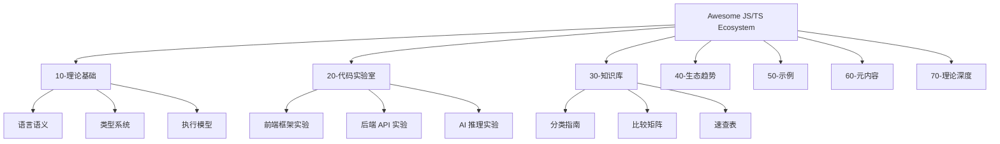

# 关于本站

## 项目简介

**Awesome JS/TS Ecosystem** 是一个精心策划的 JavaScript/TypeScript 生态系统资源列表与学习知识体系，旨在构建互联网上最全面的 TS/JS 技术知识库。

### 核心使命

- 🎯 **降低学习门槛**：帮助开发者快速了解主流框架和工具的特点与适用场景
- 📊 **辅助技术决策**：提供多维度的工具对比与选型指南
- 🚀 **跟踪生态演进**：掌握前端生态的最新动态与趋势
- 💡 **沉淀最佳实践**：学习业界推荐的开发模式与工程规范
- 🔗 **建立知识网络**：通过交叉引用构建可导航的知识图谱

## 项目数据

截至 2026 年 5 月：

| 指标 | 数值 |
|------|------|
| Markdown 文档 | **802** 篇 |
| 总内容量 | **15.33 MB** |
| HTML 输出页 | **496** 页 |
| 分类专题 | **20+** 旗舰专题 |
| 代码实验室 | **25+** 个实验 |
| 速查表 | **5** 份 |
| 比较矩阵 | **7** 份 |
| 理论专题 | **17+** 个 |

## 内容体系

### 📦 P0 — 前端核心

| 分类 | 说明 |
|------|------|
| 🖥️ Frontend Frameworks | React, Vue, Angular, Svelte, Solid |
| 🎨 UI Component Libraries | shadcn/ui, Ant Design, MUI, Chakra |
| ⚡ Build Tools | Vite, Webpack, Rollup, esbuild, SWC |
| 📊 Data Visualization | D3.js, ECharts, Chart.js, Three.js |
| 🗂️ State Management | Zustand, Redux, Jotai, Pinia, Signals |
| 🛣️ Routing | React Router, TanStack Router, Vue Router |

### 🛠️ P1 — 工程化与质量

| 分类 | 说明 |
|------|------|
| 🎭 SSR / Meta Frameworks | Next.js, Nuxt, Remix, Astro, SvelteKit |
| 📝 Form Handling | React Hook Form, Formik, TanStack Form |
| ✅ Validation | Zod, Yup, Joi, Valibot |
| 🎨 Styling | Tailwind CSS, Styled Components, CSS-in-JS |
| 🧪 Testing | Vitest, Jest, Playwright, Cypress |
| 🛠️ Linting | ESLint, Prettier, Biome, Oxc |

### 🔧 P2 — 后端与基础设施

| 分类 | 说明 |
|------|------|
| 🗄️ ORM / Database | Prisma, Drizzle, TypeORM, Kysely |
| 🔐 Backend Frameworks | Express, Fastify, NestJS, Hono, Elysia |
| 🏗️ Monorepo Tools | Turborepo, Nx, pnpm workspaces, Lage |
| 📦 Package Managers | npm, pnpm, yarn, Bun |
| 🐳 DevOps & Deployment | Docker, GitHub Actions, Vercel, Netlify |

### 🔬 P3 — 前沿探索

| 分类 | 说明 |
|------|------|
| 🤖 AI & LLM | LangChain, Vercel AI SDK, Transformers.js |
| 🔗 WebAssembly | Rust/WASM, AssemblyScript, jco |
| 📡 Edge Computing | Cloudflare Workers, Deno Deploy, Vercel Edge |
| 🦀 Rust Toolchain | NAPI-RS, napi-rs, wasm-bindgen |

## 内容质量标准

所有收录内容需满足以下质量基线：

| 标准 | 说明 |
|------|------|
| ⭐ 数据驱动 | GitHub Stars > 1000（特殊优秀项目除外） |
| 🔄 活跃维护 | 最近 6 个月内有更新 |
| 📘 TypeScript | 原生支持或提供完善的类型定义 |
| ✅ 生产验证 | 有实际生产环境使用案例或企业采用 |
| 📄 文档完整 | 具备基本的使用文档和 API 参考 |
| 🧪 测试覆盖 | 具有合理的测试覆盖率 |

## 标签体系

### TypeScript 支持度

| 标签 | 含义 |
|------|------|
| 🟢 原生 | 原生 TypeScript 支持，类型定义完善 |
| 🟡 类型完善 | 社区类型定义完善，维护活跃 |
| 🔴 弱类型 | 类型支持较弱或缺失 |

### 维护活跃度

| 标签 | 含义 |
|------|------|
| ⭐⭐⭐ | 非常活跃，核心团队全职维护 |
| ⭐⭐ | 活跃，社区贡献稳定 |
| ⭐ | 维护中，更新频率较低 |
| 🪦 | 归档或不再维护 |

## 数据来源

本站数据参考自以下权威来源：

- [GitHub Stars](https://github.com) — 开源项目统计数据
- [State of JS 2024](https://stateofjs.com) — JavaScript 生态开发者调查
- [JavaScript Rising Stars](https://risingstars.js.org) — 年度新星项目
- [npm Trends](https://npmtrends.com) — npm 下载趋势对比
- [Stack Overflow Survey](https://survey.stackoverflow.co) — 开发者偏好调查
- [GitHub Octoverse](https://octoverse.github.com) — GitHub 年度开源报告

## 内容结构

## 路线图

| 阶段 | 目标 | 状态 |
|------|------|------|
| P0 基础构建 | 完成 800+ 文档页面的基础结构 | ✅ 已完成 |
| P1 质量提升 | 零构建错误、消除死链与高亮警告 | ✅ 已完成 |
| P2 深度充实 | 速查表、研究报告、模板库内容扩充 | 🔄 进行中 |
| P3 智能增强 | 交互式图表、搜索优化、AI 问答集成 | 📋 计划中 |
| P4 社区驱动 | 开放贡献工作流、自动化内容审核 | 📋 计划中 |

## 参与贡献

欢迎提交 Issue 或 PR 参与贡献！请遵循以下流程：

1. 阅读 [贡献指南](../CONTRIBUTING.md) 了解详细规范
2. 在 [Issues](https://github.com/AdaMartin18010/JavaScriptTypeScript/issues) 中搜索是否已有相关讨论
3. 提交 Issue 描述问题或建议
4. Fork 仓库并创建功能分支
5. 提交 PR 并确保通过 CI 检查

### 贡献者

感谢所有为本项目做出贡献的开发者。

## 许可证

本项目采用 [MIT 许可证](https://github.com/AdaMartin18010/JavaScriptTypeScript/blob/main/LICENSE) 开源。

---

  如果觉得这个项目有帮助，请在 GitHub 上 ⭐ Star 支持一下！

