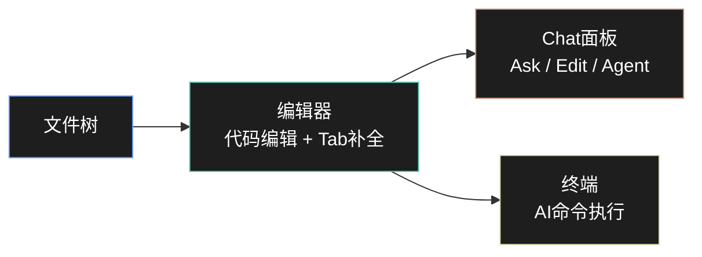
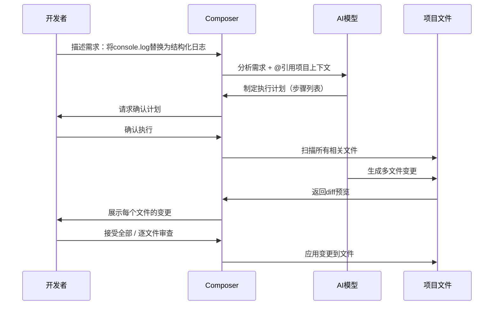

# Cursor深度工作流

> 最后更新: 2026-05-02 | 预计阅读: 45 min | 难度: 🌿 中级
>
> Cursor是2024-2026年增长最快的AI编码工具，将VS Code与深度AI集成，提供从代码补全到自主Agent的完整工作流。

---

## 📸 界面概览



Cursor基于VS Code构建，保留所有VS Code生态（扩展、主题、快捷键），同时深度集成AI能力：

```
┌─────────────────────────────────────────────────────────────┐
│ 文件树 │  编辑器（代码 + Tab补全提示）   │ Chat面板        │
│        │                               │                 │
│        │  function calculateTotal(     │ ┌─────────────┐ │
│        │  ▌ items: CartItem[]          │ │ 用户提问    │ │
│        │  ▌): number {                 │ ├─────────────┤ │
│        │  ▌  // AI建议的补全代码       │ │ AI回答...   │ │
│        │  ▌  const total = items...    │ │             │ │
│        │                               │ │ [应用修改]  │ │
│        │  [Tab] 接受  [Esc] 取消       │ └─────────────┘ │
│        │                               │                 │
├────────┴───────────────────────────────┴─────────────────┤
│ 终端（支持AI命令执行）                                      │
└─────────────────────────────────────────────────────────────┘
```

---

## 🎯 四大核心模式

### 1. Tab补全（Tab Completion）

Cursor的Tab补全是目前业界响应速度最快、上下文理解最深的代码补全。

**Tab补全执行流程**：

1. **注释输入**：开发者在函数体上方输入描述性注释，如 `// 计算购物车总价，含税费和折扣`
2. **灰色提示**：Cursor在光标位置下方显示灰色幽灵文本，预测完整的函数实现（包含变量声明、计算逻辑、返回值）
3. **Tab接受**：开发者按 `Tab` 键，灰色文本变为正式代码，插入到编辑器中
4. **连续补全**：继续按 `Tab` 可接受后续多行补全，直到函数完整实现

**核心特性**：

| 特性 | 说明 | 快捷键 |
|------|------|--------|
| **单行补全** | 基于当前行上下文预测下一行 | `Tab` |
| **多行补全** | 预测整个代码块（函数体、类） | `Tab`（连续按） |
| **智能重写** | 根据新输入自动重写后续代码 | `Ctrl+K` 编辑中 |
| **光标预测** | 自动建议下一个光标位置 | `Tab` 跳转 |
| **跨文件感知** | 补全考虑项目中其他文件的类型定义 | 自动 |

**Tab补全最佳实践**：

```typescript
// ✅ 好的做法：用注释表达意图，让AI补全实现
// 验证用户输入的邮箱格式，返回标准化的邮箱地址或null
function normalizeEmail(input: string): string | null {
  // 按Tab，AI会补全：trim、正则验证、toLowerCase等
}

// ✅ 好的做法：先写类型和签名，AI补全实现
interface User {
  id: string;
  name: string;
  email: string;
  createdAt: Date;
}

// 将User转换为JSON序列化格式，处理Date为ISO字符串
function serializeUser(user: User): Record<string, unknown> {
  // 按Tab补全...
}

// ❌ 避免：过于模糊的上下文
function process(data: any) {
  // 上下文不足，AI难以给出精准补全
}
```

**多光标与预测跳转**：

```typescript
// 场景：批量重命名对象属性
const users = [
  { first_name: 'Alice', last_name: 'Smith' },
  { first_name: 'Bob', last_name: 'Jones' },
];

// 输入 firstName 后，Cursor预测下一个光标位置在 last_name
// 按 Tab 跳转到下一个位置继续编辑
const users = [
  { firstName: 'Alice', lastName: 'Smith' },
  { firstName: 'Bob', lastName: 'Jones' },
];
```

---

### 2. Chat面板（Ask / Edit / Agent）

Cursor Chat提供三种模式，对应不同的交互深度：

| 模式 | 用途 | 修改范围 | 风险 |
|------|------|----------|------|
| **Ask** | 询问、解释、学习 | 只读，不修改代码 | 无 |
| **Edit** | 单文件修改 | 当前文件 | 低 |
| **Agent** | 多文件任务执行 | 整个项目 | 中 |

**Ask模式示例**：

```markdown
用户: @src/auth/jwt.ts 解释这个文件的token验证逻辑

AI: 这个文件实现了JWT token的验证和刷新机制：
1. `verifyToken`: 使用jose库验证token签名和过期时间
2. `refreshToken`: 验证refresh token后签发新的access token
3. 安全特性：
   - 使用RS256非对称加密
   - token绑定设备指纹
   - refresh token轮转机制

潜在风险：第45行没有验证issuer字段，建议添加。
```

**Edit模式示例**：

```markdown
用户: 在 @src/utils/validation.ts 中添加手机号验证函数，
     支持中国大陆和国际格式

AI: [展示diff]
+ export function validatePhone(phone: string): boolean {
+   const cnRegex = /^1[3-9]\d{9}$/;
+   const intlRegex = /^\+[1-9]\d{1,14}$/;
+   return cnRegex.test(phone) || intlRegex.test(phone);
+ }

[应用修改] [放弃]
```

**Agent模式示例**：

```markdown
用户: 实现用户注册功能，包含：
     1. 邮箱验证（发送验证码）
     2. 密码强度检查
     3. 防止重复注册
     使用现有的 @src/db/schema.ts 中的users表

AI: 我将为您实现用户注册功能，计划如下：
1. 创建 @src/auth/register.ts 处理注册逻辑
2. 创建 @src/auth/email.ts 处理邮件发送
3. 更新 @src/api/routes.ts 添加注册路由
4. 创建测试文件 @src/auth/register.test.ts

[开始执行] → [文件变更预览] → [终端命令执行] → [测试运行]
```

---

### 3. Composer（多文件编辑）

Composer是Cursor最强大的功能，支持跨文件、多步骤的复杂任务。



**Composer使用流程**：

```
1. 打开Composer（Ctrl+I 或 Cmd+I）
2. 描述任务（自然语言 + @引用文件）
3. AI制定计划并请求确认
4. 确认后AI执行多文件编辑
5. 审查每个文件的变更
6. 接受全部 / 逐文件接受 / 放弃
```

**Composer最佳实践**：

**任务描述模板**：

```markdown
任务：[具体功能描述]

范围：
- 修改 @src/components/
- 使用 @src/types/ui.ts 中的类型定义
- 不要修改 @src/lib/api/ 下的文件

规范：
- 使用 React 19 Server Components 模式
- 所有props使用 interface 定义
- 错误处理使用 Error Boundary
- 添加对应的单元测试
```

**复杂任务分解**：

```markdown
❌ 避免："重构整个项目"

✅ 推荐：
"第一步：将 @src/services/user.ts 中的回调函数改为 async/await"
"第二步：更新所有调用 userService 的文件以适配新接口"
"第三步：添加类型安全的错误处理"
```

---

### 4. Agent模式（自主执行）

Cursor Agent可以自主执行终端命令、读写文件、运行测试。

**Agent能力边界**：

| 能力 | 说明 | 需要确认 |
|------|------|----------|
| 文件读写 | 读取项目文件、创建新文件、修改现有文件 | 首次/危险操作 |
| 终端命令 | 运行npm、git、测试命令等 | 是（默认） |
| 代码搜索 | 使用grep-like搜索定位代码 | 否 |
| 网页浏览 | 搜索文档、API参考 | 否 |
| MCP工具 | 调用配置的MCP Server | 是 |

**配置Agent权限**：

```json
// .cursor/settings.json
{
  "cursor.ai.autoRun": false,      // 默认不自动执行终端命令
  "cursor.ai.allowGitCommands": true,
  "cursor.ai.allowNpmInstall": true,
  "cursor.ai.maxAutoFiles": 10     // 自动模式最大修改文件数
}
```

---

## ⚙️ 项目级配置

### .cursorrules 文件

在项目根目录创建 `.cursorrules`，定义AI行为准则：

```markdown
# Cursor Rules - 项目AI行为规范

## 技术栈
- TypeScript 5.8+ (strict mode)
- React 19 + Next.js 15 App Router
- Tailwind CSS v4
- Prisma ORM + PostgreSQL
- Vitest + Playwright

## 编码规范
1. 所有导出函数必须有JSDoc注释
2. 优先使用 `const` 和箭头函数
3. 异步函数返回类型必须显式声明 Promise<T>
4. 不使用 `any`，使用 `unknown` + 类型守卫
5. 组件props使用解构 + interface 定义

## 文件组织
- 组件放在 `src/components/` 按功能分组
- 工具函数放在 `src/lib/` 按领域分组
- 类型定义放在 `src/types/` 或就近的 `.types.ts`
- 测试文件与源文件同目录，命名 `*.test.ts`

## 禁止事项
- 不要生成测试数据中的真实个人信息
- 不要修改 `.env` 或配置文件
- 不要删除没有备份的代码
- 不要在生产代码中使用 `console.log`

## 安全要求
- 所有用户输入必须验证（Zod schema）
- SQL查询必须使用参数化（Prisma自动）
- 敏感操作需要审计日志
```

### Project Context（项目上下文）

Cursor自动索引整个代码库，但可以通过以下方式增强理解：

**1. `@` 引用系统**：

```markdown
# 引用文件
@src/auth/login.ts          # 引用特定文件
@src/types/*.ts             # 引用多个文件（glob）

# 引用符号
@AuthService.login          # 引用特定函数/类
@User                      # 引用类型定义

# 引用文档
@docs:react-19             # 引用React 19官方文档
@docs:prisma              # 引用Prisma文档

# 引用Git
@git:HEAD~5               # 引用最近5个commit的变更
@git:main...feature       # 引用分支差异
```

**2. Notepad（长期记忆）**：

在Cursor设置中创建Notepad，存储项目级知识：

```markdown
# 项目架构决策
- 使用Repository模式封装数据访问
- 所有API响应使用 { data, error } 统一格式
- 前端状态管理使用Zustand，不用Redux

# 常见模式
## API调用
const result = await api.users.list();
if (result.error) return handleError(result.error);
return result.data;

## 错误处理
使用 neverthrow 的 Result 类型，不用 try/catch
```

---

## 📝 Prompt模板（Cursor专用）

### 模板1：功能实现

```markdown
请在 @src/features/ 下实现 [功能名称]。

需求：
1. [具体需求1]
2. [具体需求2]
3. [具体需求3]

参考：
- 数据结构定义见 @src/types/feature.ts
- API调用模式参考 @src/lib/api/client.ts
- 已有类似实现： @src/features/existing/

要求：
- 包含类型定义、实现、测试
- 使用现有的错误处理模式
- 添加到路由配置 @src/app/routes.ts
```

### 模板2：代码审查

```markdown
请审查 @src/ 下的代码，重点关注：

1. 类型安全：是否有隐式any、类型断言滥用
2. 错误处理：是否处理了所有异常路径
3. 性能：是否有N+1查询、不必要的重渲染
4. 安全：是否有XSS、注入风险
5. 测试：核心逻辑是否有测试覆盖

输出格式：
- 🔴 严重问题（必须修复）
- 🟡 警告（建议修复）
- 🟢 建议（可选优化）
```

### 模板3：重构任务

```markdown
请重构 @src/services/legacy/ 目录下的代码：

目标：
1. 将回调风格改为 async/await
2. 提取重复逻辑到共享工具函数
3. 添加类型安全（替换any）

约束：
- 保持所有现有测试通过
- 不修改public API签名
- 先重构一个文件给我看，确认后再继续
```

### 模板4：调试辅助

```markdown
我在 @src/components/DataTable.tsx 遇到一个bug：

现象：[描述bug现象]
重现步骤：
1. [步骤1]
2. [步骤2]
3. [步骤3]

已尝试：
- [尝试过的解决方案1]
- [尝试过的解决方案2]

相关代码：
```tsx
// 粘贴关键代码
```

请帮我：

1. 分析可能的原因
2. 提供修复方案
3. 解释为什么这个修复有效

```

---

## 🎓 高级技巧

### 技巧1：差异对比编辑

使用 `@` 引用当前文件和修改后的期望状态：

```markdown
当前实现： @src/utils/date.ts

请改为使用 dayjs 替代原生Date，要求：
- 保持所有函数签名不变
- 添加时区支持（UTC+8）
- 性能不劣于当前实现
```

### 技巧2：批量生成测试

```markdown
为 @src/services/user.ts 中的所有导出函数生成测试：

要求：
- 使用 Vitest + 内置mock
- 覆盖成功路径和错误路径
- 使用工厂函数生成测试数据
- 测试文件名与源文件同目录
```

### 技巧3：文档生成

```markdown
为 @src/api/ 下的所有路由生成API文档：

格式：Markdown表格
包含：Endpoint、Method、Request、Response、Error Codes
参考： @src/types/api.ts 中的类型定义
```

---

## 🔧 常见问题与解决

| 问题 | 原因 | 解决 |
|------|------|------|
| Tab补全不准确 | 上下文不足 | 添加更多类型定义和注释 |
| Chat回答太泛 | Prompt不够具体 | 使用模板，添加约束条件 |
| Agent修改过多 | 任务描述太宽泛 | 缩小范围，分步骤执行 |
| 索引不完整 | 大项目或新文件 | 手动 `@` 引用相关文件 |
| 补全太慢 | 网络或模型负载 | 切换到本地模型或错峰使用 |

---

## 参考资源

- [Cursor官方文档](https://docs.cursor.com)
- [Cursor论坛](https://forum.cursor.com)
- [Cursor价格与计划](https://cursor.com/pricing)
- [Awesome Cursor Rules](https://github.com/PatrickJS/awesome-cursorrules) — 社区规则集

> 最后更新: 2026-05-02 | 状态: ✅ 已创建 | 对齐: AI辅助编码工作流专题
