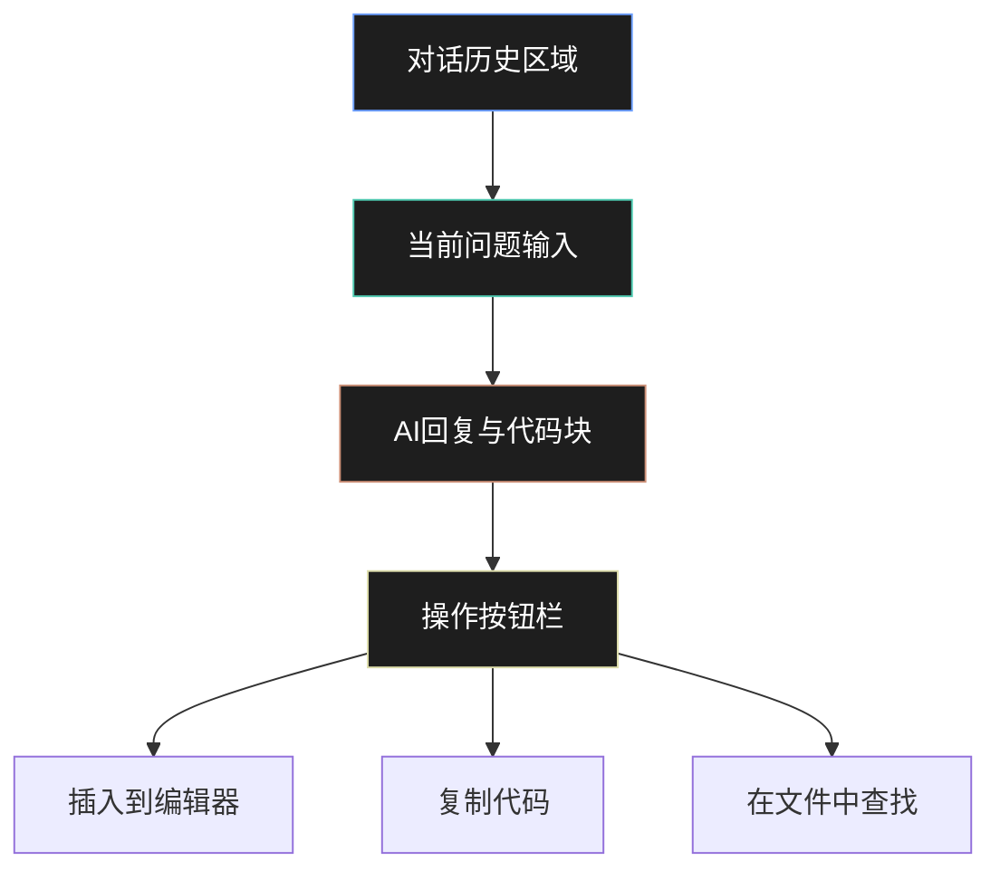

# GitHub Copilot工作流

> 最后更新: 2026-05-02 | 预计阅读: 35 min | 难度: 🌿 中级
>
> GitHub Copilot是市面上用户基数最大的AI编码工具，深度集成于VS Code、JetBrains、Vim/Neovim等主流IDE，2026年已演进为支持Agent模式的完整AI编码平台。

---

## 📸 界面概览

**Inline补全UI状态说明**：

Copilot在编辑器中以**灰色幽灵文本**形式展示补全建议，与已有代码形成明显视觉区分：

| 状态 | 视觉表现 | 交互方式 |
|------|----------|----------|
| **建议显示** | 光标后显示灰色斜体文本 | 自然停顿0.5-1秒后自动触发 |
| **接受补全** | 灰色文本变为正常代码颜色 | 按 `Tab` 键接受当前建议 |
| **取消补全** | 灰色文本消失 | 按 `Esc` 键或继续输入 |
| **多行补全** | 灰色区域覆盖整个代码块 | 按 `Tab` 接受全部，`Alt+]` 查看替代方案 |



Copilot提供四种主要交互界面：

```
┌─────────────────────────────────────────────────────────────┐
│ 编辑器（Inline补全）                                         │
│                                                             │
│ function calculateTotal(items: CartItem[]): number {        │
│   const subtotal = items.reduce((sum, item) => {            │
│     return sum + item.price * item.quantity;                │
│   }, 0);                                                    │
│   │ const taxRate = 0.08;          ← 灰色补全提示          │
│   │ const tax = subtotal * taxRate;                        │
│   │ return subtotal + tax;                                 │
│   [Tab] 接受  [Esc] 取消                                   │
│ }                                                           │
├─────────────────────────────────────────────────────────────┤
│ Chat面板                                                    │
│ ┌─────────────────────────────────────────────────────────┐ │
│ │ 用户: 解释这个函数的复杂度                                │ │
│ │                                                         │ │
│ │ Copilot: 这是一个O(n)复杂度的函数...                    │ │
│ │ • 使用reduce遍历数组                                    │ │
│ │ • 每次迭代执行常数时间操作                              │ │
│ │ • 空间复杂度O(1)                                        │ │
│ │                                                         │ │
│ │ [插入到编辑器] [复制] [在文件中查找]                     │ │
│ └─────────────────────────────────────────────────────────┘ │
└─────────────────────────────────────────────────────────────┘
```

---

## 🎯 四大工作模式

### 1. Inline补全（Ghost Text）

Copilot的核心能力，在输入时实时显示灰色补全建议。

**触发机制**：

| 场景 | 触发方式 | 效果 |
|------|----------|------|
| 自然停顿 | 停止输入0.5-1秒 | 自动显示补全 |
| 注释驱动 | 输入描述性注释 | 基于注释生成代码 |
| 函数签名 | 输入函数声明 | 补全函数体 |
| 模式识别 | 重复性代码 | 建议循环/批量操作 |
| 测试驱动 | 输入describe/it | 生成测试用例 |

**Inline补全最佳实践**：

```typescript
// ✅ 注释驱动：描述意图比直接写代码更有效
// 计算购物车总价，包含税费和折扣
// 税费率为8%，折扣根据会员等级计算
// 返回格式化后的价格字符串（如 "$123.45"）
function formatTotal(cart: Cart, memberLevel: MemberLevel): string {
  // Copilot会基于注释生成完整实现
}

// ✅ 类型先行：完整类型定义引导精准补全
interface Order {
  id: string;
  items: Array<{ productId: string; quantity: number; unitPrice: number }>;
  discountCode?: string;
  shippingAddress: Address;
}

function processOrder(order: Order): Promise<Receipt> {
  // 基于Order类型，Copilot能生成更准确的处理逻辑
}

// ✅ 示例驱动：提供示例输出引导补全风格
// 示例: slugify("Hello World!") => "hello-world"
// 示例: slugify("TypeScript 2026") => "typescript-2026"
function slugify(input: string): string {
  // Copilot会匹配示例风格
}

// ❌ 避免：过于模糊或缺乏上下文
function doStuff(x: any): any {
  // 上下文不足，补全质量差
}
```

**快捷键**：

| 操作 | Windows/Linux | macOS |
|------|---------------|-------|
| 接受补全 | `Tab` | `Tab` |
| 拒绝补全 | `Esc` | `Esc` |
| 查看下一个建议 | `Alt + ]` | `Option + ]` |
| 查看上一个建议 | `Alt + [` | `Option + [` |
| 打开Copilot面板 | `Ctrl + Enter` | `Cmd + Enter` |
| 触发内联聊天 | `Ctrl + I` | `Cmd + I` |

---

### 2. Copilot Chat（对话式AI）

VS Code侧边栏的Chat面板，支持多轮对话和代码引用。

**Chat命令**：

| 命令 | 用途 | 示例 |
|------|------|------|
| `/explain` | 解释选中代码 | `/explain 为什么这里用闭包？` |
| `/fix` | 修复代码问题 | `/fix 处理这个空指针风险` |
| `/tests` | 生成测试 | `/tests 为这个函数生成边界测试` |
| `/doc` | 生成文档 | `/doc 添加JSDoc注释` |
| `/simplify` | 简化代码 | `/simplify 用更简洁的方式重写` |
| `/help` | 查看可用命令 | `/help` |

**变量引用**：

```markdown
#file:src/utils/date.ts        # 引用文件
#selection                     # 引用当前选中代码
#editor                        # 引用整个编辑器内容
#terminalSelection             # 引用终端选中内容
#gitChanges                    # 引用Git变更
```

**Chat使用示例**：

```markdown
用户: /explain #selection

Copilot: 这段代码使用了策略模式（Strategy Pattern）：
1. `PaymentStrategy` 接口定义统一的操作契约
2. `CreditCardStrategy` 和 `PayPalStrategy` 实现具体逻辑
3. `PaymentContext` 在运行时动态选择策略

优点：易于扩展新支付方式，符合开闭原则。
风险：当前实现缺少错误处理，建议添加try/catch。
```

---

### 3. Copilot Workspace（多文件编辑）

Copilot Workspace支持跨文件理解和编辑，类似于Cursor的Composer。

**Workspace核心能力**：

- **自然语言规划**：用自然语言描述需求，AI生成执行计划
- **多文件变更**：一次任务涉及多个文件的修改
- **预览与审查**：在执行前预览所有变更
- **PR集成**：直接在GitHub PR中使用，基于review comment修改

**Workspace使用流程**：

```
1. 在GitHub Issue或PR中打开Workspace
2. 描述需求（自然语言）
3. AI分析代码库，制定计划
4. 审查计划，确认或调整
5. AI执行变更，生成diff
6. 审查每个文件的变更
7. 创建PR或直接推送
```

**Workspace示例**：

```markdown
需求: "为所有API端点添加速率限制"

AI计划:
1. 安装 express-rate-limit 依赖
2. 创建 src/middleware/rateLimit.ts
3. 在 src/app.ts 中应用全局速率限制
4. 为认证端点配置更严格的限制
5. 添加测试验证速率限制行为

变更预览:
  M package.json
  M package-lock.json
  A src/middleware/rateLimit.ts
  M src/app.ts
  A src/middleware/rateLimit.test.ts

[审查变更] → [调整] → [提交]
```

---

### 4. Copilot Agent模式

2025年底推出的Agent模式，让Copilot可以自主执行多步骤任务。

**Agent Mode执行流程**：

1. **任务输入**：在Copilot Chat中输入 `/agent`  followed by 任务描述，如 `添加用户角色权限系统`
2. **计划生成**：AI分析代码库，制定多步骤执行计划（文件修改清单、依赖安装、测试策略）
3. **逐步执行**：AI按顺序执行每个步骤：
   - 读取相关文件获取上下文
   - 生成代码变更
   - 执行终端命令（如 `npm install`）
4. **验证反馈**：自动运行测试或类型检查，确认变更正确性
5. **审查确认**：开发者审查所有变更diff，选择接受、修改或放弃

**Agent模式能力**：

| 能力 | 说明 | 需要确认 |
|------|------|----------|
| 文件读写 | 读取和修改项目文件 | 是（可配置） |
| 终端命令 | 执行npm、git、测试等 | 是 |
| 代码搜索 | 在代码库中搜索 | 否 |
| 网页浏览 | 查看文档 | 否 |
| 工具调用 | 使用VS Code扩展API | 是 |

**启用Agent模式**：

```bash
# VS Code设置
"github.copilot.advanced": {
  "agent.enabled": true,
  "agent.autoApprove": false  # 默认需要确认
}

# 在Chat中切换模式
> /agent 实现JWT认证中间件
```

**Agent模式最佳实践**：

```markdown
✅ 明确任务边界：
"在 src/middleware/ 下添加JWT验证中间件，
不要修改现有的session认证逻辑"

✅ 分步骤验证：
"第一步：创建中间件文件
确认后再继续下一步"

✅ 指定验收标准：
"实现后运行 npm test 确保所有测试通过"

❌ 避免模糊指令：
"优化一下代码"
```

---

## ⚙️ 配置与个性化

### VS Code设置

```json
// settings.json
{
  "github.copilot.enable": {
    "*": true,
    "markdown": true,
    "plaintext": false
  },
  "github.copilot.inlineSuggest.enable": true,
  "github.copilot.nextEditSuggestions.enabled": true,
  "github.copilot.chat.localeOverride": "zh-CN",
  "github.copilot.advanced": {
    "debounceDelay": 150,
    "maxContextLines": 200
  },
  // 代码风格训练
  "github.copilot.codeGeneration.useInstructionFiles": true
}
```

### 指令文件（Instruction Files）

在项目根目录创建 `.github/copilot-instructions.md`，训练Copilot理解项目规范：

```markdown
# Copilot Instructions

## 项目概述
这是一个基于 Next.js 15 的全栈TypeScript应用。

## 编码规范
- 使用函数组件和Hooks
- 所有props使用 interface 定义
- 异步函数必须处理错误
- 使用 try/catch + 自定义错误类
- 不使用 `any` 类型

## 导入规范
- 第三方库 → 空行 → 项目内部模块 → 空行 → 相对路径
- 示例：
  ```typescript
  import { useState } from 'react';
  import { z } from 'zod';

  import { api } from '@/lib/api';
  import { useAuth } from '@/hooks/useAuth';

  import { UserCard } from './UserCard';
  ```

## 错误处理模式

```typescript
try {
  const result = await apiCall();
  return result;
} catch (error) {
  if (error instanceof AppError) {
    logger.error('业务错误', { code: error.code });
    throw error;
  }
  logger.error('未知错误', { error });
  throw new AppError('INTERNAL_ERROR', '操作失败');
}
```

## 测试规范

- 使用 Vitest + React Testing Library
- 测试文件名：`*.test.ts`
- 每个测试必须独立，不依赖执行顺序

```

### 代码引用训练

Copilot会自动学习项目中的代码模式。可以通过以下方式增强：

```bash
# 打开相似代码文件，让Copilot学习模式
# Copilot会分析打开的文件作为上下文

# 使用 .copilotignore 排除不希望学习的文件
# .copilotignore
generated/
*.min.js
dist/
```

---

## 📝 Prompt模板（Copilot专用）

### 模板1：代码生成

```markdown
在 [文件路径] 中实现 [功能]。

上下文：
- 相关类型定义: [类型文件]
- 类似实现参考: [参考文件]

要求：
- 使用 [技术/模式]
- 处理 [边界情况]
- 包含 [错误处理/日志]
- 符合项目编码规范
```

### 模板2：重构优化

```markdown
重构 [文件/代码块]，目标：
1. [目标1：提高可读性/性能]
2. [目标2：类型安全]

约束：
- 不修改函数签名
- 保持现有测试通过
- 使用项目中已有的工具函数

代码：
```[代码]```
```

### 模板3：测试生成

```markdown
为以下代码生成完整测试：

```[代码]```

要求：
- 测试框架: Vitest
- 覆盖: 成功路径 + 所有错误路径
- 使用工厂函数生成测试数据
- Mock外部依赖
- 测试文件放在同目录
```

### 模板4：文档生成

```markdown
为 [模块/文件] 生成文档：

格式: Markdown
包含:
- 功能概述
- API列表（函数、参数、返回值）
- 使用示例
- 注意事项

参考类型定义: [类型文件]
```

---

## 🎓 高级技巧

### 技巧1：Copilot + GitHub PR工作流

```
1. 创建Issue描述需求
2. 在Issue中打开Copilot Workspace
3. 让AI生成实现计划
4. 审查并调整计划
5. AI执行，生成变更
6. 审查diff，创建PR
7. PR中继续用Copilot修复review comment
```

### 技巧2：团队协作配置

**组织级配置**（GitHub Copilot Business/Enterprise）：

```yaml
# .github/copilot-organization-instructions.md
# 组织级别的Copilot规范

## 安全要求
- 不允许生成包含密钥、密码的代码
- 所有用户输入必须验证
- 数据库查询必须使用参数化

## 性能要求
- 前端组件必须支持代码分割
- API响应时间目标 < 200ms
- 数据库查询必须 Explain 验证

## 合规要求
- 所有代码必须有审计日志
- 符合 SOC2 类型II要求
- GDPR数据处理合规
```

### 技巧3：提高补全准确率

```typescript
// ✅ 策略1：提供足够上下文
// 在文件顶部定义类型
interface Config {
  timeout: number;
  retries: number;
  backoff: 'linear' | 'exponential';
}

// 然后Copilot在补全时会使用Config类型
function createClient(config: Config) {
  // 补全会使用config.timeout等属性
}

// ✅ 策略2：使用具体示例
// 实现一个函数，将以下输入转换为输出：
// Input:  [{name: "Alice", age: 30}, {name: "Bob", age: 25}]
// Output: {Alice: 30, Bob: 25}
function arrayToObject(users: User[]): Record<string, number> {
  // Copilot会匹配示例模式
}

// ✅ 策略3：渐进式补全
// 不要等AI一次性生成全部，分步接受
const users = await fetchUsers();      // Tab接受
const activeUsers = users.filter(      // Tab接受
  u => u.status === 'active'           // Tab接受
);
```

---

## ⚖️ 工具对比：Copilot vs Cursor vs Claude Code

| 维度 | **GitHub Copilot** | **Cursor** | **Claude Code** |
|------|:------------------:|:----------:|:---------------:|
| **用户基数** | 350万+ | 快速增长 | 早期采用者 |
| **IDE支持** | VS Code, JetBrains, Vim, Neovim | VS Code only | 终端 |
| **代码补全** | ⭐⭐⭐⭐⭐ 最强 | ⭐⭐⭐⭐ 强 | ❌ 无 |
| **Chat能力** | ⭐⭐⭐⭐ 强 | ⭐⭐⭐⭐⭐ 最强 | ⭐⭐⭐⭐ 强 |
| **Agent能力** | ⭐⭐⭐ 中 | ⭐⭐⭐⭐ 强 | ⭐⭐⭐⭐⭐ 最强 |
| **团队协作** | ⭐⭐⭐⭐⭐ Enterprise | ⭐⭐ 弱 | ⭐⭐ 弱 |
| **价格** | $10-19/月 | $20/月 | API按量 |
| **企业安全** | ⭐⭐⭐⭐⭐ SOX/SOC2 | ⭐⭐⭐ 基础 | ⭐⭐ 基础 |
| **学习曲线** | 低 | 中 | 低 |

**Copilot独特优势**：

1. **IDE生态最广**：支持几乎所有主流IDE和编辑器
2. **企业合规最强**：SOX、SOC2、GDPR合规，审计日志完善
3. **GitHub原生集成**：Issue→PR→Review全链路AI辅助
4. **团队知识共享**：组织级指令文件，统一编码规范
5. **性价比最高**：Individual版仅$10/月

**Copilot劣势**：

1. Agent模式较新，能力不如Cursor/Claude Code成熟
2. 上下文窗口相对较小（128K vs 200K）
3. 无终端级系统访问能力

---

## 🏢 企业版特性

### Copilot Business ($19/月/用户)

- 组织级策略管理
- 公共代码过滤（避免GPL污染）
- 审计日志
- 简单的用户管理

### Copilot Enterprise ($39/月/用户)

- 私有代码库索引（企业知识库）
- 自定义模型微调
- 高级安全与合规
- 详细使用分析
- SSO和SCIM

### 企业配置示例

```yaml
# .github/copilot-enterprise-config.yml
organization:
  code_references:
    public_code:
      block_suggestions: true  # 阻止与公共代码匹配的补全

  knowledge_bases:
    - name: "internal-framework"
      repositories:
        - "org/internal-sdk"
        - "org/shared-components"

  policies:
    - name: "no-hardcoded-secrets"
      pattern: "(password|secret|token)\s*=\s*['\"][^'\"]+['\"]"
      action: block

    - name: "require-error-handling"
      pattern: "async function.*\{[^}]*\}(?!.*catch)"
      action: warn
```

---

## 🔧 常见问题与解决

| 问题 | 原因 | 解决 |
|------|------|------|
| 补全不出现 | 网络延迟/未激活 | 检查Copilot状态图标，等待激活 |
| 补全质量差 | 上下文不足 | 添加类型定义和注释 |
| Chat回答不相关 | 未引用正确上下文 | 使用 `#file` 或 `#selection` |
| Agent执行失败 | 权限不足 | 检查autoApprove设置 |
| 企业代码泄露担忧 | 公共代码匹配 | 启用public code过滤 |
| 多语言支持差 | 训练数据偏差 | 在注释中指定语言/框架 |
| 与现有扩展冲突 | 快捷键重叠 | 修改快捷键绑定 |

---

## 参考资源

- [GitHub Copilot官方文档](https://docs.github.com/en/copilot)
- [Copilot in VS Code](https://code.visualstudio.com/docs/copilot/overview)
- [Copilot Workspace](https://github.com/features/copilot/workspaces)
- [Copilot定价](https://github.com/features/copilot/plans)
- [Copilot Trust Center](https://github.com/trust-center/copilot)（安全与隐私）

> 最后更新: 2026-05-02 | 状态: ✅ 已创建 | 对齐: AI辅助编码工作流专题
