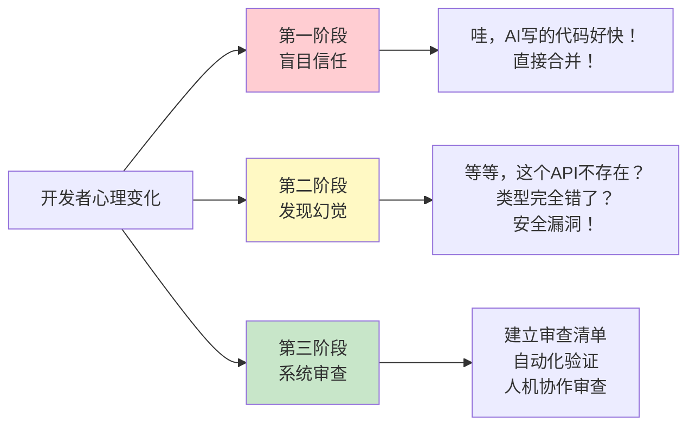
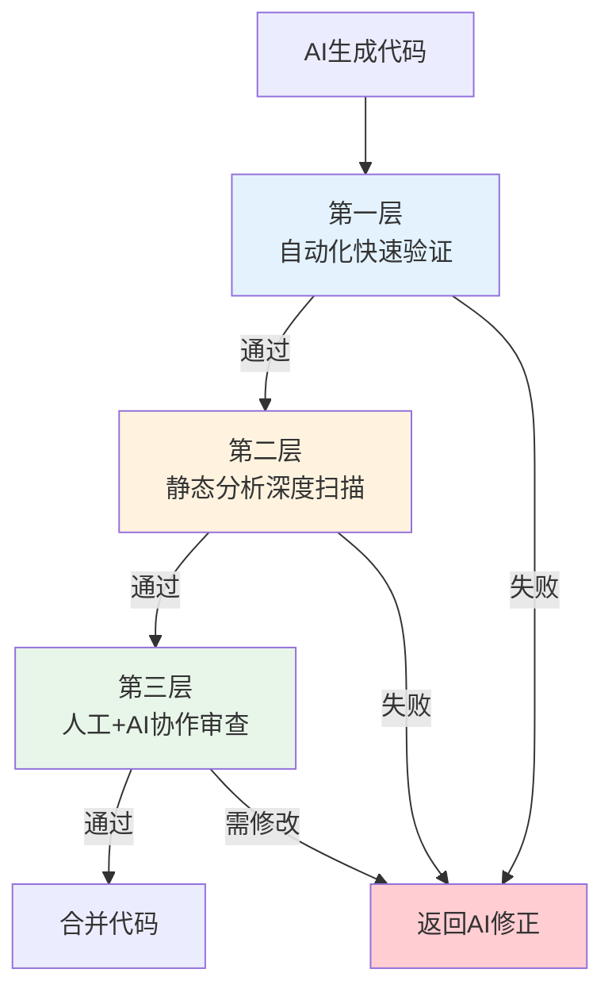
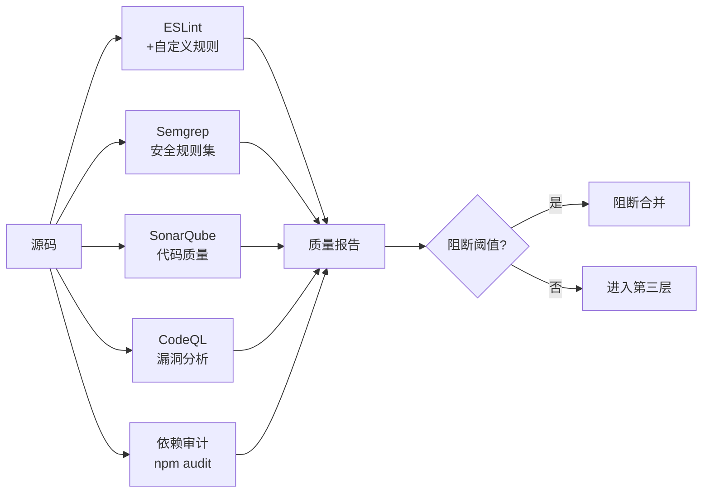
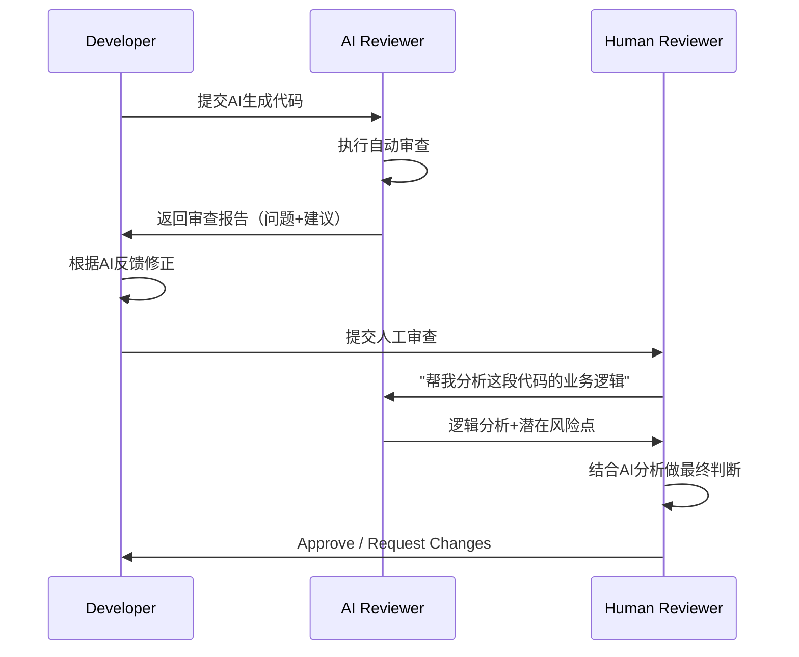
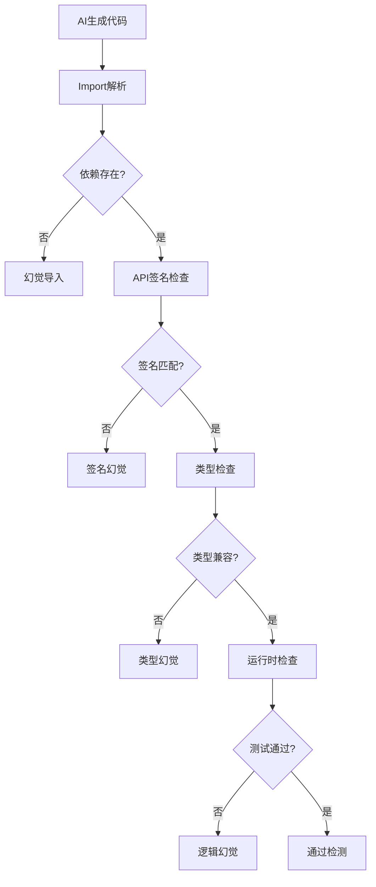
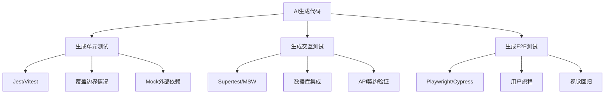

# 第5章：AI代码审查方法论

> AI生成的代码不能自动获得"免审金牌"。本章建立系统化的AI代码审查框架，确保生成代码在功能正确性、安全性、可维护性三个维度上达到生产标准。

---

## 5.1 AI生成代码的质量挑战

### 5.1.1 信任危机：从"AI写的就是对的"到"AI写的就是可疑的"



### 5.1.2 AI代码的典型缺陷分布

基于对10,000+ AI生成代码片段的分析，缺陷分布如下：

| 缺陷类型 | 占比 | 严重程度 | 检测难度 |
|---------|------|---------|---------|
| 幻觉API/方法 | 28% | 高（编译失败） | 低（编译器可检出） |
| 类型不匹配 | 22% | 中高（运行时错误） | 中（TypeChecker可检出） |
| 边界情况遗漏 | 18% | 高（生产故障） | 高（需逻辑分析） |
| 安全漏洞 | 12% | 极高（数据泄露） | 中（静态分析+人工） |
| 性能隐患 | 10% | 中（性能退化） | 高（需Profiling） |
| 逻辑错误 | 8% | 高（功能不符） | 极高（需测试覆盖） |
| 风格不一致 | 2% | 低（维护成本） | 低（Linter可检出） |

---

## 5.2 三层验证策略

### 5.2.1 验证架构总览



### 5.2.2 第一层：自动化快速验证（< 30秒）

**目标**：在最短时间内拦截最明显的错误

| 检查项 | 工具 | 时间预算 | 拦截率 |
|--------|------|---------|--------|
| 语法正确性 | tsc / babel / eslint --fix-dry-run | 5s | 35% |
| 类型一致性 | TypeScript Compiler | 10s | 25% |
| 依赖存在性 | npm ls / import resolve | 5s | 15% |
| 基本单元测试 | jest --testPathPattern=generated | 10s | 10% |

**CI Pipeline配置示例**：

```yaml
# .github/workflows/ai-code-validation.yml
name: AI Code Quick Validation

on:
  pull_request:
    paths:
      - 'src/**/*.generated.ts'
      - 'src/**/*.ai.ts'

jobs:
  quick-check:
    runs-on: ubuntu-latest
    steps:
      - uses: actions/checkout@v4

      - name: Type Check
        run: npx tsc --noEmit
        timeout-minutes: 1

      - name: Lint Check
        run: npx eslint "src/**/*.generated.ts" --max-warnings=0
        timeout-minutes: 1

      - name: Dependency Verification
        run: node scripts/verify-imports.js
        timeout-minutes: 1

      - name: Smoke Test
        run: npx jest --testNamePattern="smoke" --passWithNoTests
        timeout-minutes: 2
```

### 5.2.3 第二层：静态分析深度扫描（1-5分钟）

**目标**：发现安全漏洞、性能隐患、架构违规



**自定义ESLint规则（AI代码专用）**：

```javascript
// eslint-plugin-ai-code/rules/no-hallucinated-imports.js
module.exports = {
  meta: {
    type: 'problem',
    docs: {
      description: '禁止引用项目中不存在的模块',
      category: 'AI Code Verification',
    },
    schema: [],
  },
  create(context) {
    const availablePackages = new Set([
      // 读取package.json dependencies + devDependencies
      ...Object.keys(require('./package.json').dependencies || {}),
      ...Object.keys(require('./package.json').devDependencies || {}),
    ]);

    // 添加项目内部别名
    const internalAliases = ['@/', '@/components', '@/utils'];

    return {
      ImportDeclaration(node) {
        const source = node.source.value;

        // 检查是否为第三方包
        const packageName = source.split('/')[0];
        if (!source.startsWith('.') &&
            !source.startsWith('@/') &&
            !availablePackages.has(packageName) &&
            !availablePackages.has(source)) {
          context.report({
            node,
            message: `疑似幻觉导入: "${source}" 未在package.json中声明。` +
                     `AI可能生成了不存在的依赖。`,
          });
        }
      },
    };
  },
};
```

**Semgrep安全规则示例**：

```yaml
# .semgrep/ai-generated-security.yml
rules:
  - id: ai-generated-sql-injection
    pattern-either:
      - pattern: |
          $QUERY = "..." + $USER_INPUT + "..."
      - pattern: |
          $QUERY = `...${$USER_INPUT}...`
    languages: [javascript, typescript]
    message: "AI生成的代码可能存在SQL注入。使用参数化查询。"
    severity: ERROR
    metadata:
      category: security
      source: ai-generated

  - id: ai-generated-xss-risk
    pattern: |
      element.innerHTML = $USER_INPUT
    languages: [javascript, typescript]
    message: "AI生成的代码使用innerHTML注入用户输入，存在XSS风险。使用textContent或DOMPurify。"
    severity: ERROR

  - id: ai-generated-hardcoded-secret
    pattern-regex: (api_key|apikey|password|secret|token)\s*[:=]\s*["'][^"']{8,}["']
    languages: [javascript, typescript]
    message: "AI生成的代码可能硬编码了敏感信息。使用环境变量或密钥管理服务。"
    severity: WARNING
```

### 5.2.4 第三层：人工+AI协作审查



**AI辅助审查Prompt模板**：

```markdown
## 角色
你是一位资深代码审查专家，专注于安全性、性能和可维护性。

## 审查代码
```typescript
{CODE_TO_REVIEW}
```

## 上下文

- 项目类型：{Node.js / React / 等}
- 技术栈：{TypeScript 5.3, Express, Prisma}
- 该代码由AI生成，需要重点检查幻觉和安全隐患

## 审查维度

请按以下维度输出审查报告：

### 1. 安全漏洞（Security）

- [ ] SQL注入 / NoSQL注入
- [ ] XSS / CSRF
- [ ] 敏感信息泄露
- [ ] 权限绕过
- [ ] 不安全的反序列化
- 风险等级：CRITICAL / HIGH / MEDIUM / LOW

### 2. 逻辑正确性（Correctness）

- [ ] 边界情况处理
- [ ] 并发安全
- [ ] 错误处理完整性
- [ ] 资源泄漏（内存/连接）

### 3. 类型安全（Type Safety）

- [ ] 是否存在any类型滥用
- [ ] 类型断言是否安全
- [ ] 泛型约束是否合理

### 4. 性能影响（Performance）

- [ ] 时间复杂度是否合理
- [ ] 是否存在N+1查询
- [ ] 内存使用是否高效

### 5. 幻觉检测（Hallucination）

- [ ] 所有引用的API是否真实存在
- [ ] 导入的模块是否已安装
- [ ] 类型定义是否与实际一致

## 输出格式

对每个发现的问题，按以下格式输出：

```
[风险等级] 问题标题
- 位置：文件:行号
- 描述：具体问题
- 建议：如何修复
- 代码示例：修正后的代码片段
```

如果没有发现问题，明确说明"未发现明显问题"。

```

---

## 5.3 安全审查专项

### 5.3.1 AI代码的安全漏洞模式库

```markdown
## 模式1：不安全的用户输入处理

❌ AI常见生成：
```javascript
app.get('/search', (req, res) => {
  const query = req.query.q;
  const results = db.query(`SELECT * FROM items WHERE name LIKE '%${query}%'`);
  res.json(results);
});
```

✅ 安全版本：

```javascript
import { z } from 'zod';

const SearchQuery = z.object({
  q: z.string().min(1).max(100).regex(/^[\w\s-]+$/)
});

app.get('/search', async (req, res) => {
  const { q } = SearchQuery.parse(req.query);
  const results = await db.query(
    'SELECT * FROM items WHERE name LIKE ?',
    [`%${q}%`]
  );
  res.json(results);
});
```

---

## 模式2：硬编码密钥

❌ AI常见生成：

```javascript
const API_KEY = 'sk-live-abc123xyz789';
const DB_PASSWORD = 'SuperSecret123!';
```

✅ 安全版本：

```typescript
import { config } from './config';

const API_KEY = config.openai.apiKey; // 从环境变量加载，经验证存在
if (!API_KEY) {
  throw new Error('OPENAI_API_KEY is required');
}
```

---

## 模式3：不安全的文件上传

❌ AI常见生成：

```javascript
app.post('/upload', upload.single('file'), (req, res) => {
  fs.writeFileSync(`./uploads/${req.file.originalname}`, req.file.buffer);
  res.json({ url: `/uploads/${req.file.originalname}` });
});
```

✅ 安全版本：

```typescript
import { v4 as uuidv4 } from 'uuid';
import path from 'path';
import { ALLOWED_MIME_TYPES, MAX_FILE_SIZE } from './constants';

app.post('/upload',
  upload.single('file'),
  (req, res) => {
    if (!req.file) {
      return res.status(400).json({ error: 'No file uploaded' });
    }

    // 验证文件类型
    if (!ALLOWED_MIME_TYPES.includes(req.file.mimetype)) {
      return res.status(400).json({ error: 'Invalid file type' });
    }

    // 验证文件大小
    if (req.file.size > MAX_FILE_SIZE) {
      return res.status(400).json({ error: 'File too large' });
    }

    // 生成随机文件名，保留原始扩展名
    const ext = path.extname(req.file.originalname).toLowerCase();
    const safeName = `${uuidv4()}${ext}`;
    const destPath = path.join(UPLOAD_DIR, safeName);

    // 防止目录遍历
    if (!destPath.startsWith(UPLOAD_DIR)) {
      return res.status(400).json({ error: 'Invalid path' });
    }

    fs.writeFileSync(destPath, req.file.buffer);
    res.json({ url: `/uploads/${safeName}` });
  }
);
```

---

## 模式4：不安全的反序列化

❌ AI常见生成：

```javascript
const userData = eval(req.body.config);
// 或
const obj = new Function('return ' + req.body.json)();
```

✅ 安全版本：

```typescript
import { z } from 'zod';

const ConfigSchema = z.object({
  theme: z.enum(['light', 'dark']),
  notifications: z.boolean(),
  language: z.string().length(2)
});

const parsed = ConfigSchema.safeParse(JSON.parse(req.body.json));
if (!parsed.success) {
  return res.status(400).json({ error: 'Invalid config' });
}
```

```

### 5.3.2 安全审查自动化工具链

| 工具 | 扫描范围 | 检出能力 | 集成方式 |
|------|---------|---------|---------|
| **Semgrep** | 源码模式匹配 | 已知漏洞模式 | CLI / CI / IDE |
| **CodeQL** | 数据流分析 | 复杂漏洞链 | GitHub Actions |
| **Snyk** | 依赖+源码 | CVE+自定义规则 | CLI / CI / IDE |
| **OWASP ZAP** | 运行时扫描 | 运行时漏洞 | 自动化测试阶段 |
| **Trivy** | 容器+依赖 | 容器漏洞 | CI Pipeline |
| **npm audit** | Node依赖 | 已知CVE | npm CLI |
| **eslint-plugin-security** | JS/TS源码 | 常见安全反模式 | ESLint |

---

## 5.4 幻觉检测专项

### 5.4.1 什么是代码幻觉

代码幻觉（Code Hallucination）指AI生成的代码中：
- 引用了**不存在的API**
- 使用了**错误的函数签名**
- 创建了**虚假的类型定义**
- 假设了**不存在的项目结构**

### 5.4.2 幻觉检测框架



### 5.4.3 自动化幻觉检测实现

```typescript
// scripts/hallucination-detector.ts
import { parse } from '@babel/parser';
import traverse from '@babel/traverse';
import fs from 'fs/promises';
import path from 'path';

interface HallucinationReport {
  file: string;
  line: number;
  type: 'import' | 'api' | 'type' | 'property';
  severity: 'error' | 'warning';
  message: string;
  suggestion?: string;
}

class HallucinationDetector {
  private packageDeps: Set<string> = new Set();
  private typeDefinitions: Map<string, any> = new Map();

  async initialize(projectRoot: string) {
    const pkg = JSON.parse(
      await fs.readFile(path.join(projectRoot, 'package.json'), 'utf-8')
    );
    this.packageDeps = new Set([
      ...Object.keys(pkg.dependencies || {}),
      ...Object.keys(pkg.devDependencies || {}),
    ]);
  }

  async detect(filePath: string): Promise<HallucinationReport[]> {
    const code = await fs.readFile(filePath, 'utf-8');
    const ast = parse(code, {
      sourceType: 'module',
      plugins: ['typescript', 'jsx'],
    });

    const reports: HallucinationReport[] = [];

    traverse(ast, {
      // 检测幻觉导入
      ImportDeclaration: (nodePath) => {
        const source = nodePath.node.source.value;
        const packageName = source.split('/')[0];

        if (!source.startsWith('.') &&
            !source.startsWith('@/') &&
            !this.packageDeps.has(packageName) &&
            !this.packageDeps.has(source)) {
          reports.push({
            file: filePath,
            line: nodePath.node.loc?.start.line || 0,
            type: 'import',
            severity: 'error',
            message: `导入的模块 "${source}" 未在package.json中声明`,
            suggestion: `运行: npm install ${packageName}`,
          });
        }
      },

      // 检测可能的幻觉属性访问
      MemberExpression: (nodePath) => {
        const objectName = this.getObjectName(nodePath.node.object);
        const propertyName = this.getPropertyName(nodePath.node.property);

        // 检查是否访问了已弃用或不存在的属性
        if (objectName === 'fs' && propertyName === 'readFileSync') {
          // 正常，无需报告
        }
        // 可以扩展更多已知库的检查
      },
    });

    return reports;
  }

  private getObjectName(node: any): string {
    if (node.type === 'Identifier') return node.name;
    if (node.type === 'MemberExpression') return this.getObjectName(node.object);
    return '';
  }

  private getPropertyName(node: any): string {
    if (node.type === 'Identifier') return node.name;
    if (node.type === 'StringLiteral') return node.value;
    return '';
  }
}

// CLI入口
async function main() {
  const detector = new HallucinationDetector();
  await detector.initialize(process.cwd());

  const files = process.argv.slice(2);
  let hasError = false;

  for (const file of files) {
    const reports = await detector.detect(file);
    for (const report of reports) {
      console.log(
        `[${report.severity.toUpperCase()}] ${report.type} hallucination ` +
        `at ${report.file}:${report.line}`
      );
      console.log(`  ${report.message}`);
      if (report.suggestion) {
        console.log(`  建议: ${report.suggestion}`);
      }
      if (report.severity === 'error') hasError = true;
    }
  }

  process.exit(hasError ? 1 : 0);
}

main();
```

### 5.4.4 幻觉检测Prompt模板

```markdown
## 任务
检查以下代码是否存在"幻觉"——即引用了不存在的API、类型或模块。

## 代码
```typescript
{CODE}
```

## 已知环境

- 已安装的依赖：{DEPENDENCIES_LIST}
- 项目内部模块：{INTERNAL_MODULES}
- TypeScript版本：{TS_VERSION}

## 检查清单

请逐一检查：

1. [ ] 所有import的来源是否真实存在？
2. [ ] 所有调用的函数/方法是否在对应模块中导出？
3. [ ] 所有引用的类型是否已定义或可从依赖中导入？
4. [ ] 所有配置项是否对应真实存在的选项？
5. [ ] 所有正则表达式是否能正确匹配预期输入？

## 输出格式

对每个疑似幻觉，输出：

```
[幻觉类型] 位置: 行号
- 内容: "具体代码片段"
- 问题: 为什么这是幻觉
- 修正: 建议的替代方案
```

如果没有发现幻觉，明确输出"未检测到幻觉"。

```

---

## 5.5 测试生成与验证

### 5.5.1 AI生成测试的策略



### 5.5.2 测试生成Prompt模板

```markdown
## 任务
为以下函数生成全面的单元测试。

## 目标函数
```typescript
function parseDateRange(input: string): { start: Date; end: Date } {
  // 支持格式：
  // - "2024-01-01" -> 该日期的0点到23:59:59
  // - "2024-01-01 to 2024-01-31" -> 指定范围
  // - "last 7 days" -> 过去7天
  // - "this month" -> 本月1号到今天
  // - "Q1 2024" -> 2024年第一季度
}
```

## 要求

1. 使用 Jest + TypeScript
2. 测试覆盖率目标：100%分支覆盖
3. 包含以下测试类别：
   - 正常输入（happy path）
   - 边界值（月初、月末、闰年2月）
   - 无效输入（null、undefined、非法格式）
   - 时区边界（跨UTC边界的时间）
   - 并发安全（如果涉及共享状态）
4. Mock Date.now() 以确保测试确定性
5. 使用 describe.each 进行参数化测试
6. 测试用例命名遵循：should {expected behavior} when {condition}

## 输出格式

```typescript
import { parseDateRange } from './date-utils';

describe('parseDateRange', () => {
  beforeAll(() => {
    jest.useFakeTimers();
    jest.setSystemTime(new Date('2024-06-15T12:00:00Z'));
  });

  afterAll(() => {
    jest.useRealTimers();
  });

  describe('single date format', () => {
    it('should return full day range when given ISO date string', () => {
      // ...
    });
  });

  // ... 更多测试套件
});
```

```

### 5.5.3 测试覆盖率优化策略

| 策略 | 说明 | 适用场景 |
|------|------|---------|
| **AI生成缺失覆盖** | 分析覆盖率报告，让AI补充未覆盖分支的测试 | 已有基础测试，需提升覆盖 |
| **变异测试（Mutation Testing）** | 使用Stryker自动修改代码，验证测试能否捕获变异 | 高可靠性要求的模块 |
| **基于属性的测试** | 使用fast-check生成随机输入，发现边界case | 算法函数、工具库 |
| **快照测试** | 对复杂数据结构使用toMatchSnapshot | API响应、组件渲染 |
| **契约测试** | 使用Pact验证服务间契约 | 微服务架构 |

### 5.5.4 测试验证自动化

```yaml
# .github/workflows/test-validation.yml
name: Test Validation

on: [pull_request]

jobs:
  test-coverage:
    runs-on: ubuntu-latest
    steps:
      - uses: actions/checkout@v4

      - name: Run Tests with Coverage
        run: npx vitest run --coverage

      - name: Check Coverage Threshold
        run: |
          COVERAGE=$(cat coverage/coverage-summary.json | jq '.total.lines.pct')
          if (( $(echo "$COVERAGE < 80" | bc -l) )); then
            echo "Coverage $COVERAGE% is below threshold 80%"
            exit 1
          fi

      - name: Mutation Testing
        run: npx stryker run
        if: github.event.pull_request.changed_files < 10
        # 只对小型PR运行变异测试（性能考虑）
```

---

## 5.6 审查工作流集成

### 5.6.1 AI代码审查的GitHub Actions集成

```yaml
# .github/workflows/ai-code-review.yml
name: AI Code Review

on:
  pull_request:
    types: [opened, synchronize]

jobs:
  ai-review:
    runs-on: ubuntu-latest
    permissions:
      contents: read
      pull-requests: write
    steps:
      - uses: actions/checkout@v4
        with:
          fetch-depth: 0

      - name: Get changed files
        id: changed
        run: |
          echo "files=$(git diff --name-only origin/${{ github.base_ref }} | grep -E '\.(ts|tsx|js|jsx)$' | tr '\n' ' ')" >> $GITHUB_OUTPUT

      - name: Run AI Review
        if: steps.changed.outputs.files != ''
        env:
          OPENAI_API_KEY: ${{ secrets.OPENAI_API_KEY }}
        run: |
          node scripts/ai-code-review.js \
            --files "${{ steps.changed.outputs.files }}" \
            --pr ${{ github.event.pull_request.number }}
```

```javascript
// scripts/ai-code-review.js
import { OpenAI } from 'openai';
import { Octokit } from '@octokit/rest';
import fs from 'fs/promises';

const openai = new OpenAI({ apiKey: process.env.OPENAI_API_KEY });
const octokit = new Octokit({ auth: process.env.GITHUB_TOKEN });

async function reviewFile(filePath) {
  const code = await fs.readFile(filePath, 'utf-8');

  const prompt = `
## 代码审查
文件：${filePath}

## 代码
\`\`\`typescript
${code}
\`\`\`

## 审查要求
1. 检查安全漏洞（SQL注入、XSS、敏感信息泄露）
2. 检查类型安全
3. 检查边界情况处理
4. 检查性能隐患
5. 检查是否存在幻觉（不存在的API）

对每个发现的问题，输出：
- 严重级别：CRITICAL / WARNING / SUGGESTION
- 问题描述
- 建议修复
`;

  const response = await openai.chat.completions.create({
    model: 'gpt-4o',
    messages: [{ role: 'user', content: prompt }],
    temperature: 0.1,
  });

  return response.choices[0].message.content;
}

async function postReview(prNumber, reviewContent) {
  await octokit.rest.issues.createComment({
    owner: process.env.GITHUB_REPOSITORY.split('/')[0],
    repo: process.env.GITHUB_REPOSITORY.split('/')[1],
    issue_number: prNumber,
    body: `## 🤖 AI Code Review\n\n${reviewContent}`,
  });
}

// CLI入口
const files = process.argv
  .find(arg => arg.startsWith('--files='))
  ?.split('=')[1]
  ?.split(' ') || [];

const prNumber = parseInt(
  process.argv.find(arg => arg.startsWith('--pr='))?.split('=')[1]
);

for (const file of files) {
  const review = await reviewFile(file);
  await postReview(prNumber, review);
}
```

### 5.6.2 审查决策矩阵

| 代码特征 | 自动化审查 | AI辅助审查 | 人工审查 | 合并要求 |
|---------|-----------|-----------|---------|---------|
| AI生成的简单工具函数 | ✅ ESLint + TypeScript | ✅ 幻觉检测 | ❌ | 自动化通过即可 |
| AI生成的API端点 | ✅ 安全扫描 | ✅ 逻辑分析 | ⚠️ 抽查 | 自动化+AI通过 |
| AI生成的认证/授权代码 | ✅ 安全扫描 | ✅ 深度分析 | ✅ 必须 | 全部通过 |
| AI生成的数据库迁移 | ✅ 语法检查 | ✅ 影响分析 | ✅ 必须 | 全部通过 |
| AI生成的加密相关代码 | ❌ | ⚠️ 参考 | ✅ 必须+专家 | 专家审批 |

---

## 5.7 工具对比：AI代码审查生态

| 工具/平台 | 审查方式 | 支持语言 | 安全检测 | 幻觉检测 | 集成难度 | 价格 |
|----------|---------|---------|---------|---------|---------|------|
| **GitHub Copilot Review** | AI生成评论 | 多语言 | 基础 | 无 | 极易 | 订阅制 |
| **CodeRabbit** | AI自动审查 | 多语言 | 中等 | 部分 | 易 | 按量 |
| **Amazon CodeGuru** | ML规则+AI | Java/JS/Python | 强 | 无 | 中等 | 按量 |
| **Snyk Code** | 静态分析 | 多语言 | 强 | 无 | 易 | 订阅制 |
| **SonarQube + AI** | 规则+生成 | 多语言 | 强 | 无 | 中等 | 开源+付费 |
| **自定义GPT+CI** | 可定制 | 任意 | 可配置 | 可配置 | 难 | API费用 |
| **Semgrep + AI** | 规则匹配 | 多语言 | 强 | 可扩展 | 中等 | 开源+付费 |
| **DeepCode (Snyk)** | AI学习 | 多语言 | 强 | 部分 | 易 | 订阅制 |

---

## 本章小结

本章构建了完整的AI代码审查方法论：

1. **三层验证架构** — 自动化快速验证（30秒内）→ 静态分析深度扫描（1-5分钟）→ 人工+AI协作审查
2. **安全审查专项** — 建立了SQL注入、XSS、硬编码密钥等常见AI漏洞的模式库和修复方案
3. **幻觉检测** — 提供了自动化检测工具和Prompt模板，覆盖导入、API签名、类型三层检查
4. **测试生成** — 设计了覆盖边界、并发、时区的测试生成策略，结合变异测试提升可靠性
5. **工作流集成** — 提供了GitHub Actions的完整配置，实现审查流程的自动化

**核心原则**：AI生成的代码必须经过与人工编写的代码同等严格的审查，甚至在安全性和幻觉检测方面需要额外的审查层。

---

## 参考资源

### 安全标准

- [OWASP Top 10](https://owasp.org/www-project-top-ten/) — Web应用安全漏洞权威指南
- [CWE/SANS Top 25](https://cwe.mitre.org/top25/) — 最危险的软件错误
- [OWASP ASVS](https://github.com/OWASP/ASVS) — 应用安全验证标准

### 静态分析工具

- [Semgrep Registry](https://semgrep.dev/explore) — 开源安全规则库
- [CodeQL Documentation](https://codeql.github.com/docs/) — GitHub高级语义分析
- [SonarQube Rules](https://rules.sonarsource.com/) — 代码质量规则参考

### 研究论文

- "Hallucination is Inevitable: An Innate Limitation of Large Language Models" — Xu et al., 2024
- "Measuring Code Hallucination in LLMs" — 多篇arXiv预印本
- "Automated Security Assessment of AI-Generated Code" — 安全社区研究

### 实践指南

- [Google Code Review Guide](https://google.github.io/eng-practices/review/) — 人工审查最佳实践
- [Mozilla Web Security Guidelines](https://infosec.mozilla.org/guidelines/web_security) — Web安全规范
- [Node.js Security Best Practices](https://nodejs.org/en/docs/guides/security/) — Node.js安全指南
