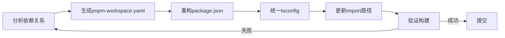
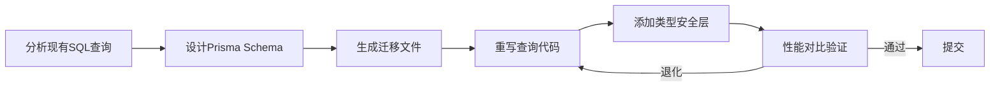

# AI辅助重构工作流

> **核心问题**: 如何让AI安全、高效地参与大规模代码重构？

## 1. 重构前的准备

### 1.1 代码基线建立

在开始AI辅助重构前，必须建立可验证的基线：

```bash
# 建立类型检查基线
npx tsc --noEmit > baseline-types.txt

# 建立测试覆盖率基线
npx vitest run --coverage > baseline-coverage.txt

# 建立lint基线
npx eslint . --format json > baseline-lint.json
```

### 1.2 重构范围界定

使用AI分析重构影响范围：

```markdown
请分析以下重构任务的影响范围：

目标：将项目从 Svelte 4 迁移到 Svelte 5（Runes模式）
项目规模：约 200 个 .svelte 文件，50 个 .ts 文件

请输出：
1. 需要修改的文件清单（按优先级排序）
2. 每个文件的预估修改复杂度（简单/中等/复杂）
3. 潜在的 breaking changes 风险点
4. 推荐的迁移顺序（分批策略）
```

## 2. AI重构策略

### 2.1 渐进式重构模式

**策略一：文件级原子重构**

```typescript
// 重构前：Svelte 4 Store
import { writable } from 'svelte/store';
export const count = writable(0);

// 重构后：Svelte 5 Runes
// +page.svelte
let count = $state(0);
```

AI执行步骤：

1. 识别所有Store使用点
2. 确定状态作用域（组件级/页面级/全局）
3. 生成对应的 `$state`/`$derived`/`$effect` 代码
4. 验证类型一致性

**策略二：API契约保持重构**

```typescript
// 重构约束：保持公共API不变
// 内部实现可以改变，但导出接口必须兼容

// Before: 内部使用回调
export function fetchUser(id: string, callback: (user: User) => void): void;

// After: 内部使用async/await，但对外仍支持回调
export function fetchUser(id: string, callback?: (user: User) => void): Promise<User>;
```

### 2.2 类型安全保持

**关键原则**：重构过程中类型检查必须始终通过。

```bash
# 增量类型检查脚本
#!/bin/bash
set -e

FILES=$(git diff --name-only HEAD | grep -E '\.(ts|svelte)$')

for file in $FILES; do
  echo "Checking types for: $file"
  npx svelte-check --tsconfig ./tsconfig.json --input "$file"
done
```

**AI类型检查提示词**：

```markdown
请重构以下代码，并确保：
1. 所有变量都有明确的类型注解
2. 函数返回值类型不变或更精确
3. 不使用 any 类型
4. 保持原有接口契约

如果可能引入类型错误，请先说明风险再执行。
```

## 3. 大规模重构实战

### 3.1  monorepo 迁移案例

**场景**：将5个独立npm包合并为pnpm workspace monorepo。

**AI执行流程**：



**步骤一：依赖分析**

```bash
# 生成依赖图
npx dependency-cruiser --init
npx dependency-cruiser --output-type json src > dependency-graph.json

# AI分析：识别循环依赖、未使用依赖、版本冲突
```

**步骤二：统一配置**

```yaml
# pnpm-workspace.yaml
packages:
  - 'packages/*'
  - 'apps/*'

# 统一tsconfig基座
# packages/tsconfig/base.json
{
  "compilerOptions": {
    "strict": true,
    "esModuleInterop": true,
    "skipLibCheck": true
  }
}
```

### 3.2 框架迁移案例

**场景**：Vue 2 Options API → Vue 3 Composition API 迁移。

**迁移映射表**：

| Vue 2 (Options API) | Vue 3 (Composition API) | 复杂度 |
|---------------------|------------------------|--------|
| `data()` | `ref()`/`reactive()` | 低 |
| `computed` | `computed()` | 低 |
| `watch` | `watch()`/`watchEffect()` | 中 |
| `methods` | 普通函数 | 低 |
| `lifecycle hooks` | `onMounted()`等 | 低 |
| `mixins` | `composables` | 高 |
| `this.$refs` | `template ref` | 中 |
| `this.$emit` | `defineEmits()` | 低 |

**AI迁移提示词模板**：

```markdown
请将以下 Vue 2 组件迁移为 Vue 3 Composition API + <script setup> 语法。

要求：
1. 使用 TypeScript 类型注解
2. 将可复用逻辑提取为 composable
3. 保持原有功能不变
4. 使用 Vue 3 的响应式 API（ref/reactive/computed）
5. 添加适当的注释说明变更原因

原始代码：
[粘贴Vue 2组件代码]
```

## 4. 重构验证

### 4.1 自动化验证管道

```yaml
# .github/workflows/refactor-validation.yml
name: Refactor Validation
on: [pull_request]
jobs:
  validate:
    runs-on: ubuntu-latest
    steps:
      - uses: actions/checkout@v4

      - name: Type Check
        run: npx tsc --noEmit

      - name: Lint
        run: npx eslint . --max-warnings 0

      - name: Test
        run: npx vitest run

      - name: Bundle Size Check
        run: npx bundlesize

      - name: API Diff
        run: npx api-extractor run --local
```

### 4.2 行为一致性验证

**快照测试保护重构**：

```typescript
// 重构前后组件输出快照对比
import { render } from '@testing-library/svelte';
import { expect, test } from 'vitest';

 test('Component output unchanged after refactor', () => {
  const { container } = render(MyComponent, { props: { name: 'Test' } });
  expect(container.innerHTML).toMatchSnapshot();
});
```

## 5. 更多重构实战案例

### 5.1 React 类组件 → 函数组件 + Hooks 迁移

**迁移映射表**：

| React Class | React Function + Hooks | 复杂度 |
|-------------|----------------------|--------|
| `this.state` | `useState` | 低 |
| `this.setState` | `setState` 函数 | 低 |
| `componentDidMount` | `useEffect(() => {}, [])` | 低 |
| `componentDidUpdate` | `useEffect(() => {}, [deps])` | 中 |
| `componentWillUnmount` | `useEffect` return cleanup | 低 |
| `shouldComponentUpdate` | `React.memo` + `useMemo` | 中 |
| `getDerivedStateFromProps` | `useEffect` / 重新设计 | 高 |
| `this.context` | `useContext` | 低 |
| `ref` callback | `useRef` + `useImperativeHandle` | 中 |

**AI迁移提示词模板**：

```markdown
请将以下 React 类组件迁移为函数组件 + Hooks。

要求：
1. 使用 TypeScript 类型注解
2. 将状态逻辑提取为自定义 Hook（如果复杂）
3. 保持原有功能不变
4. 使用函数组件最佳实践（memo、callback优化）
5. 添加适当的注释说明变更原因

原始代码：
[粘贴React类组件代码]
```

### 5.2 Express → Fastify 框架迁移

**API层迁移映射**：

| Express | Fastify | 备注 |
|---------|---------|------|
| `app.get('/path', handler)` | `app.get('/path', handler)` | 类似 |
| `req.body` | `request.body` | 需显式注册 `@fastify/formbody` |
| `res.json(data)` | `reply.send(data)` | 自动序列化 |
| `app.use(middleware)` | `app.addHook('onRequest', hook)` | 钩子系统 |
| `next(err)` | `reply.send(err)` / 错误处理器 | 内置错误处理 |
| `app.listen(port)` | `app.listen({ port })` | 返回Promise |

**AI迁移提示词**：

```markdown
请将以下 Express 路由处理器迁移到 Fastify。

要求：
1. 使用 Fastify 4.x 的 TypeScript 类型
2. 利用 Fastify 的 schema 验证替代手动验证
3. 使用 Fastify 的钩子替代中间件
4. 保持API响应格式完全一致
5. 添加请求/响应的 JSON Schema 定义

原始代码：
[粘贴Express代码]
```

### 5.3 数据库迁移：Raw SQL → ORM 迁移

**场景**：将项目从原始SQL查询迁移到Prisma ORM。

**AI执行流程**：



**迁移示例**：

```typescript
// Before: Raw SQL
async function getUserWithOrders(userId: string) {
  const [users] = await db.query(
    `SELECT u.*, o.id as order_id, o.total
     FROM users u
     LEFT JOIN orders o ON u.id = o.user_id
     WHERE u.id = ?`,
    [userId]
  );
  return users;
}

// After: Prisma
async function getUserWithOrders(userId: string) {
  return prisma.user.findUnique({
    where: { id: userId },
    include: {
      orders: {
        select: { id: true, total: true }
      }
    }
  });
}
```

### 5.4 Monorepo 拆分与依赖治理

**详细迁移步骤**：

```markdown
【步骤一：依赖分析与分类】

请分析以下项目的依赖关系，并按以下分类输出：
1. 共享依赖（多个包共用）→ 提升到 root
2. 开发依赖（仅构建/测试使用）→ 移到 devDependencies
3. 未使用依赖 → 标记删除
4. 版本冲突依赖 → 统一版本建议

package.json 列表：
[粘贴各包的 package.json]

【步骤二：生成 pnpm-workspace.yaml】
```yaml
packages:
  - 'packages/*'
  - 'apps/*'
  - 'tools/*'
```

【步骤三：生成统一 tsconfig 继承链】

```json
// packages/tsconfig/base.json
{
  "compilerOptions": {
    "strict": true,
    "esModuleInterop": true,
    "skipLibCheck": true,
    "forceConsistentCasingInFileNames": true
  }
}

// packages/tsconfig/react.json
{
  "extends": "./base.json",
  "compilerOptions": {
    "jsx": "react-jsx",
    "lib": ["dom", "dom.iterable", "es2022"]
  }
}

// packages/tsconfig/node.json
{
  "extends": "./base.json",
  "compilerOptions": {
    "lib": ["es2022"],
    "target": "es2022"
  }
}
```

【步骤四：生成 changeset 配置】

```json
{
  "$schema": "https://unpkg.com/@changesets/config@2.3.1/schema.json",
  "changelog": "@changesets/cli/changelog",
  "commit": false,
  "fixed": [],
  "linked": [],
  "access": "restricted",
  "baseBranch": "main",
  "updateInternalDependencies": "patch",
  "ignore": []
}
```

```

### 5.5 性能重构：同步 → 异步流处理

**场景**：将大文件同步处理改为异步流处理。

```typescript
// Before: 同步处理，内存占用高
function processLargeFile(filePath: string) {
  const data = fs.readFileSync(filePath, 'utf-8');
  const lines = data.split('\n');
  const results = lines.map(line => transform(line));
  fs.writeFileSync('output.json', JSON.stringify(results));
}

// After: 异步流处理
import { createReadStream, createWriteStream } from 'fs';
import { createInterface } from 'readline';
import { Transform } from 'stream';

async function processLargeFileStream(filePath: string) {
  const readStream = createReadStream(filePath, { encoding: 'utf-8' });
  const rl = createInterface({ input: readStream });
  const writeStream = createWriteStream('output.json');

  writeStream.write('[');
  let first = true;

  for await (const line of rl) {
    if (!first) writeStream.write(',');
    writeStream.write(JSON.stringify(transform(line)));
    first = false;
  }

  writeStream.write(']');
  writeStream.end();
}
```

## 6. AI辅助架构演进

### 6.1 从单体到微前端的重构

```markdown
请帮我设计从单体应用迁移到微前端架构的方案：

当前状态：
- 单仓库，约 500 个组件
- 使用 React + React Router
- 所有页面在同一个 bundle 中

目标状态：
- Module Federation 微前端
- 按业务域拆分为 5 个子应用
- 共享组件库

请输出：
1. 拆分策略（按路由/按业务域）
2. Module Federation 配置
3. 共享依赖版本管理方案
4. 渐进式迁移路线图
```

### 6.2 从 REST 到 GraphQL 的渐进迁移

**迁移策略**：

```markdown
【第一阶段：并行运行】
- 保留现有 REST API
- 新增 GraphQL 层作为 BFF（Backend for Frontend）
- 使用 Apollo Server 的 RESTDataSource 代理现有接口

【第二阶段：逐步替换】
- 新功能直接实现为 GraphQL resolver
- 逐步将高频 REST 端点迁移为 GraphQL field
- 使用 Apollo Federation 拆分 schema

【第三阶段：REST 退役】
- 移除 Apollo RESTDataSource
- 保留少量公共 REST API（第三方集成）
```

### 6.3 从 CSR 到 SSR/SSG 的迁移

**Next.js 迁移映射**：

| 模式 | 适用场景 | 实现方式 |
|------|---------|----------|
| SSR | 用户个性化内容 | `getServerSideProps` / `await fetch` in Server Component |
| SSG | 营销页面、文档 | `generateStaticParams` |
| ISR | 频繁更新但可容忍延迟 | `revalidate = 60` |
| CSR | 高度交互的后台管理 | `'use client'` directive |

## 7. 重构风险管理

### 7.1 风险矩阵

| 风险类型 | 检测方法 | 缓解策略 | 自动化工具 |
|----------|----------|----------|-----------|
| 类型回归 | `tsc --noEmit` | CI强制类型检查 | GitHub Actions |
| 行为变更 | 快照测试 | 重构前后快照对比 | Vitest Snapshot |
| 性能退化 | Lighthouse CI | 性能预算阈值 | Lighthouse |
| Bundle 膨胀 | `bundlesize` | 大小门禁 | bundlesize |
| API破坏 | API Extractor | 公共API变更检测 | @microsoft/api-extractor |
| 安全漏洞 | Semgrep | 静态安全扫描 | Semgrep |
| 依赖冲突 | `pnpm audit` | 定期更新策略 | Dependabot |
| 内存泄漏 | Heap Snapshot | 重构前后内存对比 | Chrome DevTools |

### 7.2 回滚策略

```markdown
【重构前准备】
1. 创建功能分支：git checkout -b refactor/migrate-to-svelte5
2. 设置特性开关：
   ```typescript
   const USE_SVELTE5 = process.env.ENABLE_SVELTE5 === 'true';
   ```

1. 准备数据库迁移脚本（如有schema变更）

【重构中】

1. 每个模块重构后立即验证
2. 使用 git commit --amend 保持提交历史清晰
3. 每完成一个模块运行完整测试套件

【重构后验证】

1. 灰度发布（5% → 25% → 100%）
2. 监控错误率和性能指标
3. 准备一键回滚脚本

```

### 7.3 重构代码审查清单

```markdown
【重构审查清单】

□ 类型检查
  - tsc --noEmit 无错误
  - 无新增的 any 类型
  - 公共接口类型未变更（或已更新文档）

□ 测试覆盖
  - 所有修改的代码都有测试覆盖
  - 快照测试通过（如有）
  - 集成测试通过

□ 性能基线
  - Bundle 大小变化 < 5%
  - 首屏加载时间变化 < 10%
  - 内存占用变化 < 10%

□ 兼容性
  - 浏览器支持矩阵未变
  - Node.js 版本要求未变
  - 第三方 API 调用未变

□ 文档
  - API 文档已更新
  - README 已更新（如有 breaking change）
  - 变更日志已记录
```

| 风险类型 | 检测方法 | 缓解策略 |
|----------|----------|----------|
| 类型回归 | `tsc --noEmit` | CI强制类型检查 |
| 行为变更 | 快照测试 | 重构前后快照对比 |
| 性能退化 | Lighthouse CI | 性能预算阈值 |
|  Bundle 膨胀 | `bundlesize` | 大小门禁 |
| API破坏 | API Extractor | 公共API变更检测 |

## 总结

- **基线先行**：重构前建立可验证的类型/测试/性能基线
- **渐进式推进**：小步快跑，每次重构后即时验证
- **AI辅助而非替代**：AI生成初稿，人工审查关键路径
- **类型安全是底线**：任何重构都不能破坏TypeScript类型检查
- **行为一致性**：功能不变是重构的第一原则

## 参考资源

- [Refactoring GitHub Repo](https://github.com/refactoring) 📚
- [TypeScript Compiler API](https://github.com/microsoft/TypeScript/wiki/Using-the-Compiler-API) 🔧
- [ts-morph](https://ts-morph.com/) — TypeScript AST操作库 🛠️
- [jscodeshift](https://github.com/facebook/jscodeshift) — JavaScript代码转换工具 🔧
- [Stryker Mutator](https://stryker-mutator.io/) — 突变测试 🧪

> 最后更新: 2026-05-02
