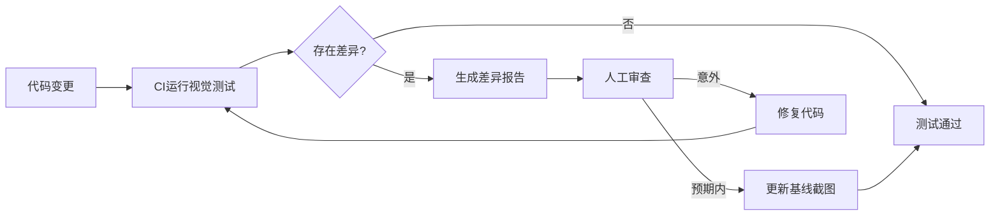

# AI生成测试策略

> **核心问题**: 如何让AI生成高质量、可维护的测试代码？

## 1. 测试生成范式

### 1.1 基于实现的测试生成

AI分析源代码自动生成测试：

```typescript
// 被测代码
export function calculateDiscount(price: number, userType: 'regular' | 'vip'): number {
  if (price < 0) throw new Error('Price must be positive');
  if (userType === 'vip') return price * 0.8;
  return price >= 100 ? price * 0.95 : price;
}

// AI生成的测试
import { describe, it, expect } from 'vitest';
import { calculateDiscount } from './discount';

describe('calculateDiscount', () => {
  it('should throw error for negative price', () => {
    expect(() => calculateDiscount(-10, 'regular')).toThrow('Price must be positive');
  });

  it('should apply VIP discount (20% off)', () => {
    expect(calculateDiscount(100, 'vip')).toBe(80);
  });

  it('should apply regular discount (5% off) for price >= 100', () => {
    expect(calculateDiscount(100, 'regular')).toBe(95);
  });

  it('should not apply discount for regular user with price < 100', () => {
    expect(calculateDiscount(50, 'regular')).toBe(50);
  });
});
```

**AI测试生成提示词**：

```markdown
请为以下函数生成完整的单元测试（使用 Vitest）：

要求：
1. 覆盖所有分支路径（if/else/switch/try-catch）
2. 包含边界值测试（空值、极大值、负值）
3. 测试异常抛出场景
4. 使用描述性的测试名称
5. 测试代码要简洁可读

函数代码：
[粘贴代码]
```

### 1.2 基于行为的测试生成（BDD）

```markdown
请根据以下用户故事生成BDD风格的测试：

用户故事：
作为用户，我希望能够使用优惠券，
以便在结账时获得折扣。

验收标准：
1. 有效优惠券应减免对应金额
2. 过期优惠券应提示错误
3. 已使用优惠券应提示错误
4. 优惠券不能叠加使用

请生成 Gherkin 语法 + 对应的测试代码。
```

**生成的Gherkin + 测试**：

```gherkin
Feature: Coupon Application
  Scenario: Apply valid coupon
    Given the user has a valid coupon "SAVE20"
    When the user applies the coupon to a $100 order
    Then the final amount should be $80

  Scenario: Apply expired coupon
    Given the user has an expired coupon "OLD2024"
    When the user applies the coupon
    Then an error "Coupon expired" should be displayed
```

```typescript
// 对应的Playwright E2E测试
import { test, expect } from '@playwright/test';

test('Apply valid coupon', async ({ page }) => {
  await page.goto('/checkout');
  await page.fill('[data-testid="coupon-input"]', 'SAVE20');
  await page.click('[data-testid="apply-coupon"]');
  await expect(page.locator('[data-testid="final-amount"]')).toHaveText('$80.00');
});
```

## 2. 测试覆盖策略

### 2.1 分层测试金字塔

```
        /\
       /  \     E2E (Playwright) — 少量，关键路径
      /____\      ~5% 覆盖率
     /      \
    /        \  Integration — API/组件集成
   /__________\   ~20% 覆盖率
  /            \
 /              \ Unit — 函数/工具/业务逻辑
/________________\  ~75% 覆盖率
```

**AI分层测试生成策略**：

| 层级 | AI角色 | 生成重点 | 人工审查点 |
|------|--------|----------|-----------|
| Unit | 主力生成 | 纯函数、工具类、reducer | 边界条件、mock合理性 |
| Integration | 辅助生成 | API测试、数据库交互 | 测试隔离、状态清理 |
| E2E | 框架生成 | 关键用户流程 | 选择器稳定性、等待策略 |

### 2.2 覆盖率驱动的测试补充

```bash
# 生成覆盖率报告
npx vitest run --coverage

# AI分析未覆盖代码并生成补充测试
# 输入：coverage/lcov-report 中的未覆盖行
# 输出：针对未覆盖分支的测试用例
```

**AI覆盖率提升提示词**：

```markdown
以下代码的当前测试覆盖率为 65%。
未覆盖的分支是：
- 第 42 行：if (user === null) return guestUser;
- 第 58 行：catch (DatabaseError e) { ... }
- 第 71-75 行：switch 的 default 分支

请为这三个未覆盖区域各生成一个测试用例。
```

## 3. 框架特定测试生成

### 3.1 Svelte组件测试

```typescript
// AI生成的Svelte组件测试
import { render, screen, fireEvent } from '@testing-library/svelte';
import { describe, it, expect, vi } from 'vitest';
import Counter from './Counter.svelte';

describe('Counter', () => {
  it('renders initial count', () => {
    render(Counter, { props: { initial: 5 } });
    expect(screen.getByText('Count: 5')).toBeInTheDocument();
  });

  it('increments on button click', async () => {
    render(Counter);
    const button = screen.getByRole('button', { name: /increment/i });
    await fireEvent.click(button);
    expect(screen.getByText('Count: 1')).toBeInTheDocument();
  });

  it('calls onChange callback', async () => {
    const onChange = vi.fn();
    render(Counter, { props: { onChange } });
    await fireEvent.click(screen.getByRole('button'));
    expect(onChange).toHaveBeenCalledWith(1);
  });
});
```

### 3.2 API测试生成

```typescript
// AI从OpenAPI/Swagger生成的API测试
import { describe, it, expect } from 'vitest';

describe('GET /api/users/:id', () => {
  it('returns user for valid id', async () => {
    const response = await fetch('/api/users/123');
    expect(response.status).toBe(200);
    const data = await response.json();
    expect(data).toMatchObject({
      id: expect.any(String),
      name: expect.any(String),
      email: expect.stringMatching(/@/)
    });
  });

  it('returns 404 for non-existent user', async () => {
    const response = await fetch('/api/users/99999');
    expect(response.status).toBe(404);
  });

  it('returns 400 for invalid id format', async () => {
    const response = await fetch('/api/users/invalid');
    expect(response.status).toBe(400);
  });
});
```

## 4. 测试质量保障

### 4.1 测试代码审查清单

AI生成测试后，使用以下清单审查：

| 检查项 | 标准 | 自动化工具 |
|--------|------|-----------|
| 独立性 | 测试之间无状态依赖 | eslint-plugin-vitest |
| 确定性 | 相同输入始终相同输出 | 无随机数/时间 |
| 可读性 |  Arrange-Act-Assert 结构 | 代码审查 |
| 速度 | 单元测试 < 100ms | vitest --reporter=verbose |
| 维护性 | 测试名称描述行为 | lint规则 |

### 4.2 突变测试（Mutation Testing）

```bash
# 使用Stryker评估测试质量
npm install -D @stryker-mutator/core
npx stryker run
```

**突变测试原理**：

- 自动修改源代码（如 `>` 改为 `>=`）
- 运行测试套件
- 如果测试仍通过 → 测试有缺陷
- 目标：突变存活率 < 15%

## 5. E2E测试自动化

### 5.1 Playwright AI助手

```typescript
// AI生成的Playwright Page Object Model
export class CheckoutPage {
  constructor(private page: Page) {}

  async applyCoupon(code: string) {
    await this.page.fill('[data-testid="coupon-input"]', code);
    await this.page.click('[data-testid="apply-coupon"]');
  }

  async getFinalAmount(): Promise<string> {
    return this.page.locator('[data-testid="final-amount"]').textContent();
  }

  async expectError(message: string) {
    await expect(this.page.locator('[data-testid="error-message"]')).toHaveText(message);
  }
}
```

### 5.2 E2E测试生成策略

**基于用户旅程的E2E生成**：

```markdown
请为以下用户旅程生成Playwright E2E测试：

【用户旅程：电商结账】
1. 用户浏览商品列表
2. 点击商品进入详情页
3. 选择规格（颜色/尺寸）
4. 添加到购物车
5. 进入购物车确认
6. 填写收货地址
7. 选择支付方式
8. 确认订单
9. 查看订单确认页

【要求】
- 使用 Page Object Model 模式
- 每个步骤包含断言
- 处理异步加载（waitFor）
- 测试数据使用测试账户
- 每个测试独立（setup/teardown）
```

**生成的完整E2E测试**：

```typescript
import { test, expect } from '@playwright/test';
import { ProductPage } from './pages/ProductPage';
import { CartPage } from './pages/CartPage';
import { CheckoutPage } from './pages/CheckoutPage';

test.describe('Checkout Flow', () => {
  test('complete purchase journey', async ({ page }) => {
    const productPage = new ProductPage(page);
    const cartPage = new CartPage(page);
    const checkoutPage = new CheckoutPage(page);

    // Step 1: Browse and select product
    await productPage.goto('/products/sneaker-123');
    await productPage.selectColor('black');
    await productPage.selectSize('42');
    await productPage.addToCart();
    await expect(productPage.toast).toHaveText('Added to cart');

    // Step 2: Review cart
    await cartPage.goto();
    await expect(cartPage.items).toHaveCount(1);
    await expect(cartPage.total).toContainText('$129.00');
    await cartPage.proceedToCheckout();

    // Step 3: Fill shipping
    await checkoutPage.fillShippingAddress({
      name: 'Test User',
      street: '123 Test St',
      city: 'Test City',
      zipCode: '123456'
    });

    // Step 4: Payment and confirmation
    await checkoutPage.selectPaymentMethod('credit-card');
    await checkoutPage.fillCardDetails({
      number: '4242424242424242',
      expiry: '12/25',
      cvc: '123'
    });
    await checkoutPage.placeOrder();

    // Step 5: Confirmation
    await expect(page).toHaveURL(/\/order\/confirmed/);
    await expect(checkoutPage.confirmationMessage).toHaveText('Order placed successfully!');
  });

  test('empty cart cannot checkout', async ({ page }) => {
    const cartPage = new CartPage(page);
    await cartPage.goto();
    await expect(cartPage.checkoutButton).toBeDisabled();
  });
});
```

### 5.3 跨浏览器测试矩阵

| 浏览器 | 分辨率 | 优先级 | 测试范围 |
|--------|--------|--------|----------|
| Chromium | 1920×1080 | P0 | 全部测试 |
| Chromium | 375×812 | P0 | 关键路径 |
| Firefox | 1920×1080 | P1 | 关键路径 |
| WebKit | 1920×1080 | P1 | 关键路径 |
| WebKit | 375×812 | P2 |  smoke 测试 |

```typescript
// playwright.config.ts
export default defineConfig({
  projects: [
    { name: 'chromium-desktop', use: { browserName: 'chromium', viewport: { width: 1920, height: 1080 } } },
    { name: 'chromium-mobile', use: { browserName: 'chromium', viewport: { width: 375, height: 812 } } },
    { name: 'firefox', use: { browserName: 'firefox' } },
    { name: 'webkit', use: { browserName: 'webkit' } },
  ]
});
```

## 6. 视觉回归测试

### 6.1 Playwright 视觉测试

```typescript
// AI辅助的视觉测试
import { test, expect } from '@playwright/test';

test.describe('Visual Regression', () => {
  test('homepage visual regression', async ({ page }) => {
    await page.goto('/');
    await expect(page).toHaveScreenshot('homepage.png', {
      threshold: 0.2,
      maxDiffPixels: 100
    });
  });

  test('dark mode toggle', async ({ page }) => {
    await page.goto('/');
    await page.click('[data-testid="theme-toggle"]');
    await expect(page).toHaveScreenshot('homepage-dark.png');
  });

  test('responsive breakpoints', async ({ page }) => {
    await page.goto('/dashboard');

    await page.setViewportSize({ width: 1920, height: 1080 });
    await expect(page).toHaveScreenshot('dashboard-desktop.png');

    await page.setViewportSize({ width: 768, height: 1024 });
    await expect(page).toHaveScreenshot('dashboard-tablet.png');

    await page.setViewportSize({ width: 375, height: 812 });
    await expect(page).toHaveScreenshot('dashboard-mobile.png');
  });
});
```

### 6.2 视觉测试策略

```markdown
【视觉测试分层】

Level 1 - 组件级（Storybook + Chromatic）
- 每个UI组件的所有变体
- 交互状态（hover, focus, disabled）
- 主题变体（light/dark/high-contrast）

Level 2 - 页面级（Playwright）
- 关键页面完整截图
- 响应式断点测试
- 长页面滚动截图

Level 3 - 流程级（Playwright）
- 多步骤流程的中间状态
- 动态内容加载完成状态
- 错误状态页面
```

### 6.3 视觉差异审查工作流



## 7. 突变测试（Mutation Testing）

### 7.1 Stryker 配置与实践

```bash
# 安装
npm install -D @stryker-mutator/core @stryker-mutator/vitest-runner

# 配置 stryker.config.mjs
export default {
  testRunner: 'vitest',
  vitest: {
    configFile: 'vitest.config.ts',
  },
  reporters: ['html', 'clear-text', 'progress'],
  mutate: [
    'src/**/*.ts',
    '!src/**/*.test.ts',
    '!src/**/*.spec.ts',
    '!src/**/__tests__/**'
  ],
  thresholds: {
    high: 80,
    low: 60,
    break: 50  // 低于50%突变存活率则构建失败
  }
};
```

### 7.2 突变算子详解

| 算子类型 | 示例 | 说明 |
|----------|------|------|
| 算术运算 | `a + b` → `a - b` | 测试是否覆盖不同运算路径 |
| 逻辑运算 | `a && b` → `a \|\| b` | 验证条件分支覆盖 |
| 边界值 | `>` → `>=` | 检测边界条件测试 |
| 返回值 | `return true` → `return false` | 验证返回值断言 |
| 数组操作 | `.push(x)` → `.pop()` | 验证数组操作测试 |
| 方法调用 | `fn()` → 空语句 | 验证副作用测试 |

### 7.3 突变测试实战示例

```typescript
// 被测代码
export function canVote(age: number, isCitizen: boolean): boolean {
  return age >= 18 && isCitizen;
}

// AI生成的测试（初始）
describe('canVote', () => {
  it('returns true for adult citizen', () => {
    expect(canVote(18, true)).toBe(true);
  });
});
```

**突变测试结果**：

- `age >= 18` → `age > 18`：存活（缺少边界测试）
- `&&` → `||`：存活（缺少非公民测试）
- `true` → `false`：存活（缺少非成年测试）

**改进后的测试**：

```typescript
describe('canVote', () => {
  it('returns true for adult citizen', () => {
    expect(canVote(18, true)).toBe(true);
    expect(canVote(25, true)).toBe(true);
  });

  it('returns false for minor citizen', () => {
    expect(canVote(17, true)).toBe(false);
    expect(canVote(0, true)).toBe(false);
  });

  it('returns false for adult non-citizen', () => {
    expect(canVote(18, false)).toBe(false);
    expect(canVote(30, false)).toBe(false);
  });

  it('returns false for minor non-citizen', () => {
    expect(canVote(17, false)).toBe(false);
  });
});
```

**改进后突变存活率**：0%（所有突变都被检测）

### 7.4 突变测试集成到CI

```yaml
# .github/workflows/mutation-test.yml
name: Mutation Testing
on:
  schedule:
    - cron: '0 2 * * 1'  # 每周一凌晨2点
  workflow_dispatch:

jobs:
  mutation:
    runs-on: ubuntu-latest
    steps:
      - uses: actions/checkout@v4
      - uses: actions/setup-node@v4
      - run: npm ci
      - run: npx stryker run
      - uses: actions/upload-artifact@v4
        with:
          name: mutation-report
          path: reports/mutation/
```

## 8. 组件测试与测试数据管理

### 8.1 Svelte组件测试深度示例

```typescript
// AI生成的Svelte组件测试（完整版）
import { render, screen, fireEvent, waitFor } from '@testing-library/svelte';
import { describe, it, expect, vi, beforeEach } from 'vitest';
import UserProfile from './UserProfile.svelte';

describe('UserProfile', () => {
  const mockUser = {
    id: '123',
    name: 'Test User',
    email: 'test@example.com',
    avatar: 'https://example.com/avatar.png'
  };

  it('renders user information correctly', () => {
    render(UserProfile, { props: { user: mockUser } });

    expect(screen.getByText('Test User')).toBeInTheDocument();
    expect(screen.getByText('test@example.com')).toBeInTheDocument();
    expect(screen.getByAltText('Test User avatar')).toHaveAttribute('src', mockUser.avatar);
  });

  it('handles missing avatar gracefully', () => {
    render(UserProfile, { props: { user: { ...mockUser, avatar: null } } });
    expect(screen.getByTestId('default-avatar')).toBeInTheDocument();
  });

  it('emits edit event when edit button clicked', async () => {
    const onEdit = vi.fn();
    render(UserProfile, { props: { user: mockUser, onEdit } });

    await fireEvent.click(screen.getByRole('button', { name: /edit/i }));
    expect(onEdit).toHaveBeenCalledWith(mockUser.id);
  });

  it('displays loading skeleton when user is null', () => {
    render(UserProfile, { props: { user: null } });
    expect(screen.getByTestId('profile-skeleton')).toBeInTheDocument();
  });

  it('is accessible', async () => {
    render(UserProfile, { props: { user: mockUser } });
    const profile = screen.getByRole('article');
    expect(profile).toHaveAttribute('aria-label', 'User profile');
  });
});
```

### 8.2 测试数据工厂模式

```typescript
// factories/user.ts
import { faker } from '@faker-js/faker';

interface UserFactoryOptions {
  overrides?: Partial<User>;
}

export function createUser(options: UserFactoryOptions = {}): User {
  return {
    id: faker.string.uuid(),
    name: faker.person.fullName(),
    email: faker.internet.email(),
    avatar: faker.image.avatar(),
    role: faker.helpers.arrayElement(['admin', 'user', 'guest']),
    createdAt: faker.date.past(),
    ...options.overrides
  };
}

export function createUsers(count: number, options?: UserFactoryOptions): User[] {
  return Array.from({ length: count }, () => createUser(options));
}

// 使用示例
describe('UserList', () => {
  it('renders multiple users', () => {
    const users = createUsers(5, { overrides: { role: 'user' } });
    render(UserList, { props: { users } });
    expect(screen.getAllByRole('listitem')).toHaveLength(5);
  });
});
```

### 8.3 Mock策略与最佳实践

```typescript
// vitest.setup.ts
import { vi } from 'vitest';

// 全局Mock
global.fetch = vi.fn();

// 模块Mock
vi.mock('$lib/db', () => ({
  db: {
    selectFrom: vi.fn(() => ({
      where: vi.fn(() => ({
        selectAll: vi.fn(() => ({
          executeTakeFirst: vi.fn()
        }))
      }))
    }))
  }
}));

// 时钟控制
vi.useFakeTimers();
```

## 9. 测试维护自动化

### 6.1 测试代码重构

```markdown
请重构以下测试，使其：
1. 使用参数化测试减少重复
2. 提取公共setup到beforeEach
3. 使用更精确的选择器
4. 添加缺失的边界测试

原始测试代码：
[粘贴代码]
```

### 6.2 过期测试检测

```bash
# 检测长时间未运行的测试
# 检测被skip的测试
npx vitest run --reporter=json | jq '.tests[] | select(.mode=="skip")'
```

## 总结

- **AI适合生成**：样板测试、边界条件、重复模式
- **人工必须审查**：业务逻辑理解、测试意图、mock合理性
- **测试质量指标**：覆盖率、突变存活率、执行速度
- **分层策略**：Unit为主(75%)、Integration次之(20%)、E2E保底(5%)

## 参考资源

- [Vitest](https://vitest.dev/) 🧪
- [Playwright](https://playwright.dev/) 🎭
- [Testing Library](https://testing-library.com/) 📚
- [Stryker Mutator](https://stryker-mutator.io/) 🧬
- [Pact](https://pact.io/) — 契约测试 🤝

> 最后更新: 2026-05-02
