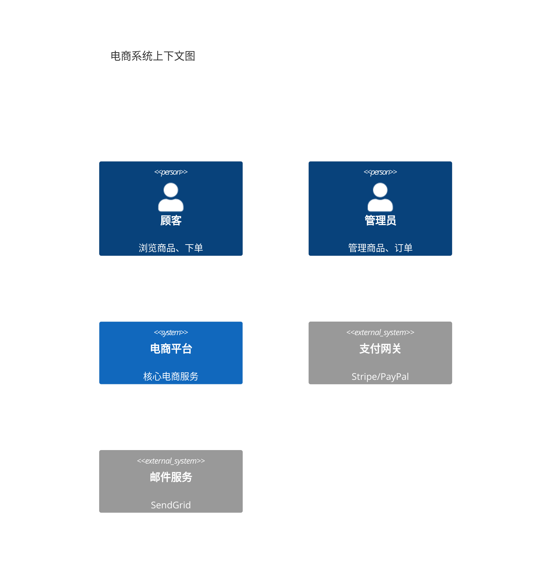
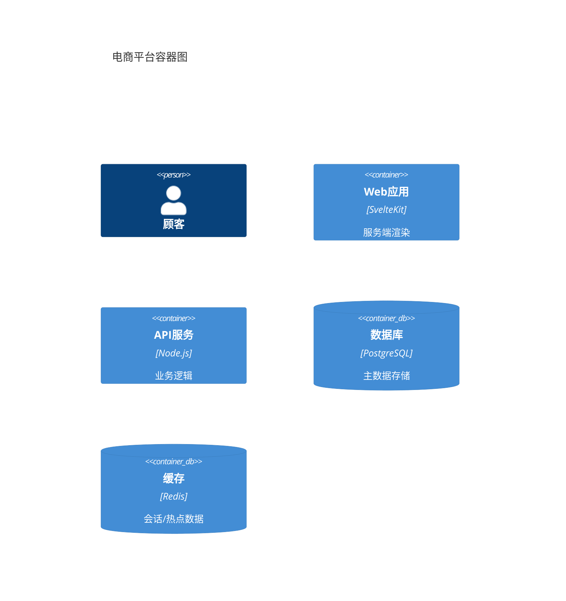
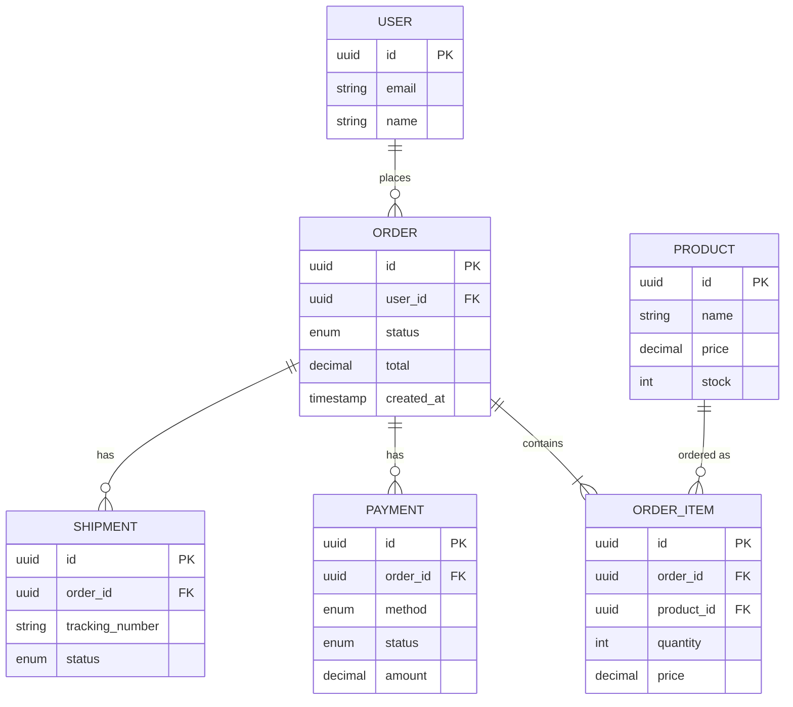
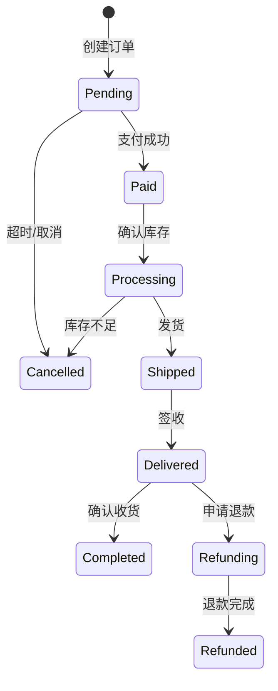
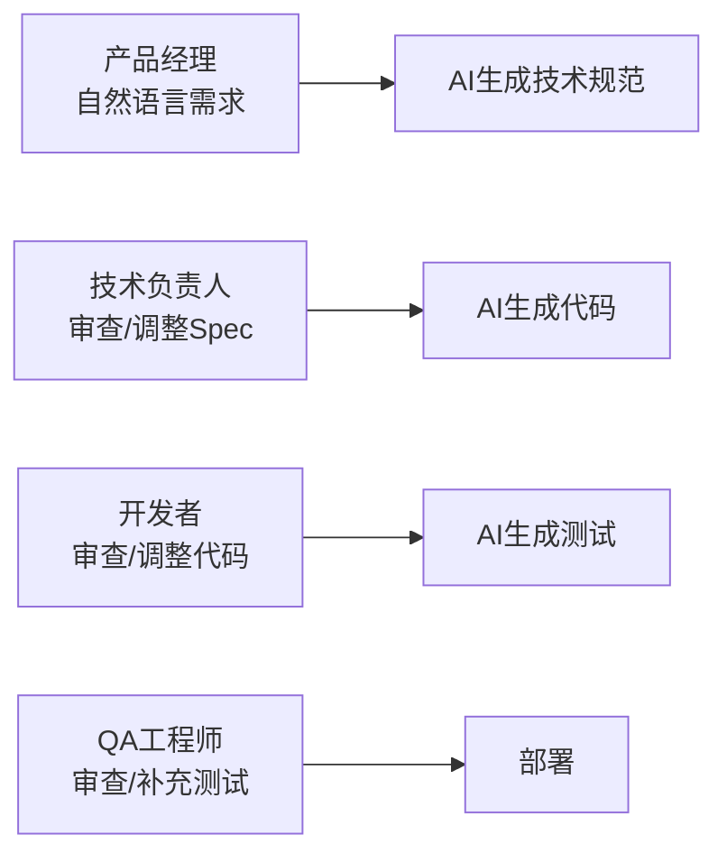

# AI原生开发范式

> **核心问题**: 当AI可以生成大部分代码时，开发者的角色和流程如何演变？

## 1. Vibe Coding

### 1.1 什么是Vibe Coding

**Vibe Coding**（氛围编码）是由Andrej Karpathy提出的概念：开发者用自然语言描述意图，AI生成代码，开发者专注于"氛围"（高层意图和创意）而非语法细节。

```
传统开发：
开发者 → 手写代码 → 调试 → 重构

Vibe Coding：
开发者 → 自然语言描述 → AI生成 → 审查/调整 → 验证
```

### 1.2 Vibe Coding工作流

**步骤一：意图描述**

```markdown
我想创建一个待办事项应用，要求：
1. 使用 Svelte 5 + SvelteKit
2. 支持添加/完成/删除任务
3. 数据持久化到 localStorage
4. 响应式设计，支持移动端
5. 有过渡动画效果

请生成完整的项目结构和核心代码。
```

**步骤二：AI生成**

AI生成：

- 项目骨架（package.json、路由结构）
- 组件代码（TodoList、TodoItem、AddForm）
- 状态管理（$state、$derived、$effect）
- 样式（Tailwind CSS）
- 动画（Svelte transitions）

**步骤三：审查与迭代**

```markdown
代码看起来不错，但我想做几个调整：
1. 添加任务优先级（高/中/低）
2. 支持拖拽排序
3. 添加筛选功能（全部/未完成/已完成）

请基于现有代码进行增量修改。
```

### 1.3 Vibe Coding的最佳实践

| 实践 | 说明 | 工具 |
|------|------|------|
| 意图优先 | 先描述"做什么"，再问"怎么做" | Cursor Composer |
| 迭代式生成 | 小步快跑，每次生成后验证 | Claude Code |
| 版本控制 | 每个AI生成步骤都commit | Git |
| 人工审查 | 关键逻辑必须人工检查 | PR Review |
| 测试驱动 | 先生成测试，再生成实现 | AI Test Gen |

## 2. Spec-driven Development

### 2.1 从代码到规范

**传统流程**：需求 → 设计 → 编码 → 测试

**Spec-driven流程**：

```
自然语言需求
      ↓
AI生成技术规范 (Spec)
      ↓
人工审查/调整 Spec
      ↓
AI根据Spec生成代码
      ↓
AI根据Spec生成测试
      ↓
验证通过 → 提交
```

### 2.2 技术规范模板

```markdown
# 功能规范：用户认证模块

## 概述
实现基于JWT的用户认证系统。

## API接口

### POST /api/auth/login
- 请求：{ email: string, password: string }
- 响应：{ token: string, user: User }
- 错误：401（凭证无效）、429（频率限制）

### POST /api/auth/register
- 请求：{ email: string, password: string, name: string }
- 响应：{ token: string, user: User }
- 错误：409（邮箱已存在）、400（密码强度不足）

## 数据库Schema
```sql
CREATE TABLE users (
  id UUID PRIMARY KEY DEFAULT gen_random_uuid(),
  email VARCHAR(255) UNIQUE NOT NULL,
  password_hash VARCHAR(255) NOT NULL,
  name VARCHAR(100) NOT NULL,
  created_at TIMESTAMP DEFAULT NOW()
);
```

## 安全要求

- 密码使用 bcrypt 哈希（cost factor 12）
- JWT过期时间：access token 15分钟，refresh token 7天
- 密码最小长度：8字符，需包含大小写和数字

```

**AI从规范生成代码**：

```bash
# 将spec.md传给AI
claude code "请根据 spec.md 生成完整的实现代码，使用 SvelteKit + Lucia auth"
```

## 3. AI-First架构设计

### 3.1 架构决策的AI辅助

```markdown
请帮我设计一个电商系统的技术架构：

约束条件：
- 日活用户：10万
- 峰值QPS：5000
- 预算：每月<$1000基础设施
- 团队：3名全栈开发者

请输出：
1. 推荐的技术栈（前端/后端/数据库/缓存/CDN）
2. 系统架构图（Mermaid）
3. 数据流设计
4. 部署拓扑
5. 成本估算
```

### 3.2 AI生成架构文档

```markdown
# 系统架构文档

## 上下文图


## 容器图



```

## 4. 提示词工程 for 开发

### 4.1 代码生成提示词模板

```markdown
# 角色
你是一名资深的 [技术栈] 开发者，擅长 [领域]。

# 任务
请实现以下功能：
[功能描述]

# 约束
- 使用 [技术栈版本]
- 遵循 [编码规范]
- 包含完整的类型注解
- 包含 JSDoc 注释
- 包含错误处理

# 输出格式
1. 文件清单
2. 每个文件的完整代码
3. 测试用例
4. 使用示例
```

### 4.2 代码审查提示词模板

```markdown
请审查以下代码，关注：
1. 安全性（SQL注入、XSS、CSRF）
2. 性能（N+1查询、内存泄漏）
3. 可维护性（复杂度、命名）
4. TypeScript类型安全性

对每处问题：
- 标注严重级别（严重/警告/建议）
- 说明原因
- 提供修复代码

代码：
[粘贴代码]
```

## 5. Vibe Coding 完整案例

### 5.1 从0到1构建CMS系统

**Round 1 - 初始意图**：

```markdown
我想构建一个支持Markdown的内容管理系统，要求：
1. 使用 SvelteKit + TypeScript
2. 支持文章 CRUD
3. 使用 SQLite + Drizzle ORM
4. 支持Markdown实时预览
5. 简单的分类标签系统
6. 暗色模式UI
7. 响应式设计

请生成完整的项目结构和核心代码。
```

**AI生成**：

- 项目骨架（`package.json`、`svelte.config.js`、`vite.config.ts`）
- 数据库Schema（Drizzle定义）
- 路由结构（`+page.svelte`、`+page.server.ts`、`+server.ts`）
- Markdown编辑器组件（基于 `marked` + `DOMPurify`）
- 基础样式（Tailwind CSS）

**Round 2 - 增量迭代**：

```markdown
很好！现在请添加以下功能：
1. 文章草稿/发布状态
2. 文章搜索（全文搜索，使用SQLite FTS5）
3. 图片上传（保存到本地文件系统）
4. 简单的访客统计
5. RSS feed 生成
```

**Round 3 - 优化**：

```markdown
请优化以下方面：
1. 添加加载状态和错误处理
2. 实现乐观更新（Optimistic UI）
3. 添加SEO meta标签
4. 生成Open Graph图片
5. 添加缓存策略（HTTP缓存 + SvelteKit缓存）
```

### 5.2 Vibe Coding 最佳实践清单

```markdown
【会话管理】
□ 每轮对话聚焦单一功能点
□ 提供具体的业务规则（"当X发生时，执行Y"）
□ 明确技术约束（"必须使用Z库，不能用W库"）
□ 每轮迭代后验证，再进入下一轮

【代码审查】
□ AI生成后立即运行类型检查
□ 检查是否有幻觉API（不存在的函数/属性）
□ 验证安全边界（XSS、注入防护）
□ 确保错误处理覆盖所有分支

【版本控制】
□ 每个功能迭代后 git commit
□ 使用语义化提交信息
□ 保留AI生成的中间版本（便于回滚）
```

## 6. Spec-driven Development 深度示例

### 6.1 完整技术规范示例

```markdown
# 功能规范：电商订单系统

## 1. 概述
实现完整的订单生命周期管理，包括购物车、结算、支付、发货、售后。

## 2. 领域模型



## 3. 状态机



## 4. API 接口

### POST /api/orders

- 请求：`{ items: [{ productId, quantity }], address: {...} }`
- 响应：`{ order: Order, paymentUrl: string }`
- 错误：400（参数错误）、409（库存不足）、422（地址无效）

### GET /api/orders/:id

- 认证：需要
- 响应：`Order & { items: OrderItem[], payments: Payment[], shipments: Shipment[] }`
- 权限：只能查看自己的订单

### PATCH /api/orders/:id/status

- 请求：`{ status: OrderStatus, reason?: string }`
- 权限：管理员可修改任意状态，用户只能取消Pending订单

## 5. 业务规则

1. **库存扣减**：订单创建时预扣库存，支付成功后确认扣减，取消时释放。
2. **价格锁定**：订单创建时锁定商品价格，后续价格变动不影响已创建订单。
3. **超时取消**：Pending状态超过30分钟自动取消。
4. **并发控制**：同一商品同时被多人下单时，先支付者得。

## 6. 性能要求

- 订单创建：P99 < 200ms
- 订单查询：P99 < 50ms
- 支持并发：1000 TPS

## 7. 安全要求

- 支付接口要求HTTPS + HMAC签名
- 敏感数据（信用卡）不存储，使用支付网关token
- 订单号使用不可猜测的UUID
- 管理员操作记录审计日志

```

### 6.2 从Spec到代码的AI工作流

```markdown
【第一阶段：生成类型定义】
claude code "根据 spec.md 生成完整的 TypeScript 类型定义，
包括：领域类型、API请求/响应类型、枚举定义、
 branded types（OrderId、ProductId等）"

【第二阶段：生成数据库Schema】
claude code "根据 spec.md 和已生成的类型，
生成 Drizzle ORM 的 schema.ts 和 migration 脚本"

【第三阶段：生成API路由】
claude code "根据 spec.md 和已有的类型/schema，
生成 SvelteKit 的 +server.ts 路由处理器，
包含：输入验证（Zod）、权限检查、业务逻辑、错误处理"

【第四阶段：生成前端页面】
claude code "根据 spec.md 和已有的API类型，
生成 Svelte 页面组件：订单列表、订单详情、创建订单表单"

【第五阶段：生成测试】
claude code "根据 spec.md 和已有代码，
生成完整的测试套件：单元测试、集成测试、状态机测试"
```

## 7. AI-First 架构设计

### 7.1 架构决策的AI辅助

```markdown
请帮我设计一个电商系统的技术架构：

约束条件：
- 日活用户：10万
- 峰值QPS：5000
- 预算：每月<$1000基础设施
- 团队：3名全栈开发者

请输出：
1. 推荐的技术栈（前端/后端/数据库/缓存/CDN）
2. 系统架构图（Mermaid）
3. 数据流设计
4. 部署拓扑
5. 成本估算
```

### 7.2 AI生成架构决策记录（ADR）

```markdown
# ADR-001: 选择SQLite作为主要数据库

## 背景
项目需要一个关系型数据库，团队规模小，预算有限。

## 考虑的选项

| 方案 | 优点 | 缺点 | 月成本 |
|------|------|------|--------|
| PostgreSQL (RDS) | 功能丰富、生产验证 | 运维复杂、成本高 | $15+ |
| SQLite + Litestream | 零运维、极低成本 | 单节点、功能较少 | $1 |
| PlanetScale (MySQL) | 无服务器、自动扩缩容 | 供应商锁定 | $29+ |

## 决策
选择 SQLite + Litestream 进行连续备份到S3。

## 原因
1. 当前阶段读写量远低于SQLite性能上限（>100K TPS）
2. Litestream提供Point-in-time恢复
3. 未来可无缝迁移到PostgreSQL（Drizzle ORM抽象）

## 影响
- 无法进行复杂的多连接查询优化
- 需要设计好读写分离策略（读副本通过Litestream实现）
```

## 8. 团队协作中的AI原生开发

### 8.1 角色分工



### 8.2 代码审查AI辅助

```markdown
请审查以下PR，重点关注：
1. 是否遵循项目中的Spec规范
2. 是否有与Spec不一致的实现
3. 边界条件是否覆盖完整
4. 是否有潜在的性能问题

PR diff：
[粘贴diff]

Spec相关章节：
[粘贴Spec]
```

### 8.3 知识库维护

```markdown
【项目知识库结构】

/specs/
├── README.md           # 规范总览
├── adr/                # 架构决策记录
├── api/                # API规范（OpenAPI）
├── database/           # 数据库Schema文档
└── ui/                 # UI组件规范

/prompts/
├── component.md        # 组件生成模板
├── api.md              # API生成模板
├── test.md             # 测试生成模板
└── refactor.md         # 重构提示模板

使用方式：
1. 新功能开发前，先查阅 /specs 确认规范
2. 从 /prompts 选择对应模板填充
3. AI生成后对照Spec验证
4. 更新Spec以反映新的设计决策
```

## 9. 2026年开发新范式对比

| 范式 | 核心思想 | 适用场景 | 工具代表 | 学习曲线 |
|------|----------|----------|----------|----------|
| **传统编码** | 手写全部代码 | 关键基础设施 | IDE | 高 |
| **AI辅助编码** | AI补全+人工审查 | 日常开发 | Copilot | 低 |
| **Vibe Coding** | 自然语言驱动 | 原型/MVP | Cursor Composer | 中 |
| **Spec-driven** | 规范优先 | 团队项目 | Claude Code | 中 |
| **AI-First架构** | AI设计架构 | 系统初始化 | ChatGPT/Gemini | 低 |
| **Agent Coding** | AI自主迭代 | 标准化任务 | Devin / OpenAI Codex | 高 |

## 10. 风险与限制

### 10.1 已知风险

| 风险 | 说明 | 缓解策略 | 检测方法 |
|------|------|----------|----------|
| 幻觉代码 | AI生成看似正确但实际错误的代码 | 强制测试覆盖 | 单元测试 + 类型检查 |
| 安全漏洞 | AI可能生成不安全的代码 | 安全审查清单 | Semgrep + CodeQL |
| 知识产权 | 训练数据可能包含GPL代码 | 代码溯源检查 | FOSSA / Snyk |
| 技能退化 | 过度依赖AI导致基础能力退化 | 定期手写练习 | 代码审查 |
| 上下文限制 | 大项目超出AI上下文窗口 | 模块化拆分 | 文件大小监控 |
| 规范漂移 | AI生成代码与Spec不一致 | Spec即契约 | 自动化Spec验证 |
| 过度工程 | AI倾向于复杂方案 | 明确约束（"最简单的方案"） | 代码复杂度检查 |

### 10.2 适用边界

**AI不适合**：

- 安全关键系统（医疗、航空、金融交易核心）
- 核心算法（加密、共识算法、压缩算法）
- 性能极致优化（游戏引擎、高频交易）
- 创新性架构设计（无先例可学习）
- 涉及法律合规的代码（隐私法规、行业标准）

**AI适合**：

- 样板代码生成（CRUD、表单、列表页）
- 测试用例生成（边界条件、异常情况）
- 文档编写（API文档、README、注释）
- 代码审查辅助（风格、常见错误）
- 重构建议（模式识别、简化代码）
- 国际化翻译（UI文案、错误消息）
- 正则表达式生成（基于自然语言描述）

## 总结

- **Vibe Coding** 是2026年最热门的开发范式，但需配合严格的验证流程
- **Spec-driven** 适合团队协作，规范即契约，减少沟通成本
- **AI-First架构** 加速系统初始化，但架构师仍需最终决策
- **迭代式生成** 比一次性生成更可靠，每轮验证后再推进
- **核心原则**：AI加速但不替代，人类负责创意、质量和最终决策

## 参考资源

- [Andrej Karpathy - Vibe Coding](https://twitter.com/karpathy) 🎵
- [Cursor Composer](https://cursor.com/) 🎹
- [Claude Code](https://docs.anthropic.com/en/docs/agents-and-tools/claude-code/overview) 🤖
- [Spec-driven Development Guide](https://spec-driven.dev/) 📐
- [AI-Native Development Patterns](https://github.com/ai-native-dev) 🧠
- [OpenAI Codex](https://openai.com/index/introducing-codex/) 💻

> 最后更新: 2026-05-02
