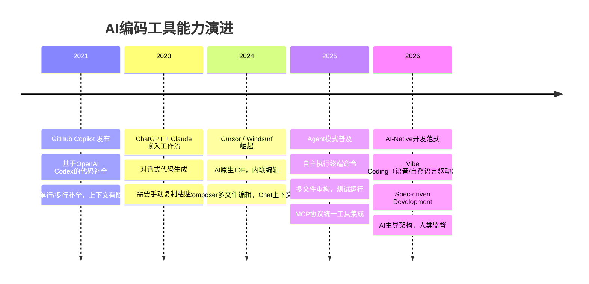
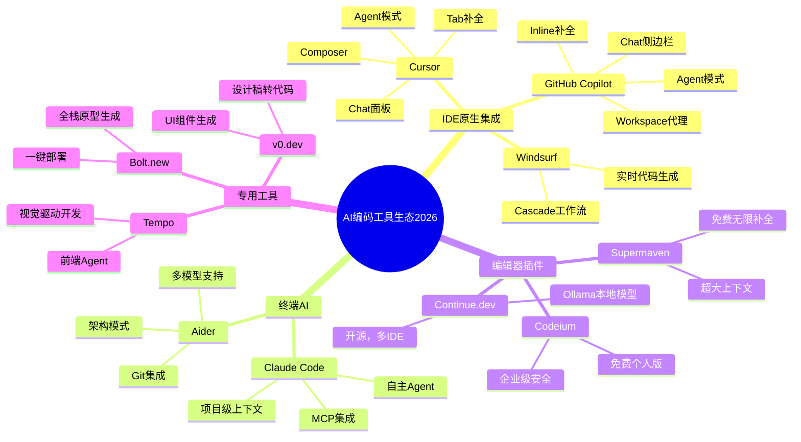

# AI辅助编码工作流完全指南

> 最后更新: 2026-05-02 | 状态: 🔥 行业转型期 | 预计阅读: 15 min
>
> 2026年，AI已从"代码补全"进化为"自主Agent"。本专题系统梳理AI辅助编码的完整工作流，覆盖工具深度使用、Prompt工程、代码审查、重构、测试生成及AI原生开发范式。

---

## 📊 AI编码革命：数据与趋势

### 2026年关键数据

| 指标 | 2024 | 2025 | 2026 | 变化 |
|------|------|------|------|------|
| AI生成代码占比 | 12% | 29% | **~45%** | +16% YoY |
| 开发者使用AI工具比例 | 62% | 85% | **~93%** | +8% |
| Cursor用户增长率 | — | +400% | **+180%** | 持续爆发 |
| Claude Code采纳率 | — | 8% | **~22%** | +14% |
| GitHub Copilot付费用户 | 130万 | 200万+ | **~350万** | +75% |

> 数据来源：GitHub Octoverse 2025、Stack Overflow Developer Survey 2025、各工具官方发布数据综合估算

### 从补全到Agent：能力演进



---

## 🗺️ 工具全景图



---

## ⚡ 三大核心工具快速对比

| 维度 | **Cursor** | **Claude Code** | **GitHub Copilot** |
|------|:----------:|:---------------:|:------------------:|
| **定位** | AI原生IDE | 终端AI Agent | IDE智能插件 |
| **核心模型** | Claude 3.7 / GPT-4o | Claude 3.7 Sonnet | GPT-4o / Claude 3.5 |
| **上下文窗口** | 200K tokens | 200K tokens | 128K tokens |
| **Agent能力** | ✅ 强（Composer+终端） | ✅ 最强（全系统访问） | ✅ 中（Workspace Agent） |
| **代码补全** | ✅ Tab（极快） | ❌ 无 | ✅ 最强（Inline） |
| **MCP支持** | ✅ 内置 | ✅ 原生集成 | ✅ 实验性 |
| **价格** | $20/月 Pro | $20/月 API | $10/月 Individual |
| **最佳场景** | 全栈开发、大型重构 | 复杂任务、系统级操作 | 日常编码、团队协作 |
| **学习曲线** | 中 | 低（终端用户友好） | 低 |

### 场景化选型决策树

```
你的主要工作场景？
├── 日常编码 + 已有IDE习惯
│   └── → GitHub Copilot（最低切换成本）
├── 大型重构 / 多文件编辑
│   └── → Cursor Composer（可视化+AI深度集成）
├── 系统级任务 / 终端操作频繁
│   └── → Claude Code（终端Agent最强）
├── 快速原型 / 从零构建
│   └── → Cursor 或 v0.dev + Cursor
├── 企业安全要求严格
│   └── → GitHub Copilot Enterprise（合规+审计）
└── 预算敏感 / 免费方案
    └── → Continue.dev + Ollama 或 Supermaven
```

---

## 📑 专题目录

| 章节 | 主题 | 核心内容 | 难度 | 预计时间 |
|------|------|----------|:----:|:--------:|
| [01 - Cursor深度工作流](./01-cursor-workflow.md) | Cursor全模式实战 | Composer、Tab、Chat、Agent模式、Rules配置、Project Context | 🌿 | 45 min |
| [02 - Claude Code工作流](./02-claude-code.md) | 终端AI Agent | 安装配置、项目级上下文、MCP集成、自主Agent模式、最佳实践 | 🌿 | 40 min |
| [03 - GitHub Copilot工作流](./03-github-copilot.md) | IDE智能插件 | Inline/Chat/Workspace/Agent模式、Prompt技巧、企业版 | 🌿 | 35 min |
| **04 - 代码生成Prompt工程** | Prompt Engineering | 结构化Prompt、Few-shot、Chain-of-Thought、上下文管理 | 🌳 | 50 min |
| **05 - AI代码审查方法论** | AI Code Review | 生成代码验证策略、安全审查、测试生成、审查Prompt模板 | 🌳 | 40 min |
| **06 - AI辅助重构工作流** | AI Refactoring | 大规模重构、类型安全保持、渐进式迁移、架构升级 | 🌳 | 45 min |
| **07 - AI生成测试** | AI Testing | 单元测试、集成测试、E2E测试生成策略、覆盖率优化 | 🌿 | 35 min |
| **08 - AI原生开发范式** | AI-Native Dev | Vibe Coding、Spec-driven Development、AI架构师模式 | 🔥 | 30 min |

> 📝 章节04-08为规划中内容，将逐步完善。

---

## 🎯 核心工作流模式

### 模式一：补全驱动（Completion-Driven）

适合日常编码场景，AI根据上下文实时建议代码。

```
开发者输入 → AI分析上下文 → Tab接受 / 继续输入 → 循环
```

**代表工具**：GitHub Copilot Inline、Cursor Tab、Supermaven

**关键技巧**：

- 用注释表达意图（比直接写代码更有效）
- 保持文件顶部有清晰的类型定义和导入
- 函数签名先行，让AI补全实现

### 模式二：对话驱动（Chat-Driven）

适合理解代码、调试、学习新API。

```
选中代码 / 打开文件 → 提问 / 指令 → AI分析 → 解释 / 修改建议 → 应用修改
```

**代表工具**：Cursor Chat、Copilot Chat、Claude Code

**关键技巧**：

- 使用 `@` 引用符号、文件、文档
- 明确指定输出格式（"用TypeScript实现"、"添加错误处理"）
- 多轮对话细化需求

### 模式三：Agent驱动（Agent-Driven）

适合复杂任务：多文件重构、功能实现、Bug修复。

```
自然语言描述任务 → AI制定计划 → 自主执行（编辑+终端+测试）→ 人类审查 → 迭代
```

**代表工具**：Cursor Composer、Claude Code、Copilot Agent Mode

**关键技巧**：

- 任务描述要具体（"添加用户认证" → "使用JWT实现登录API，包含refresh token机制"）
- 设置明确的边界（"不要修改数据库Schema"）
- 使用 `.cursorrules` / `CLAUDE.md` 定义项目规范

### 模式四：规范驱动（Spec-Driven）

适合从零构建功能或系统。

```
编写技术规格书 → AI生成实现 → 审查与迭代 → 生成测试 → 集成验证
```

**代表工具**：Claude Code + 结构化Prompt、Cursor Composer + PRD

---

## 🛠️ 通用最佳实践

### 1. 项目级AI配置

创建项目根目录的AI规则文件，确保AI理解项目规范：

**`.cursorrules`**（Cursor）：

```markdown
# 项目规范
- 使用 TypeScript 5.8+ 严格模式
- 前端使用 React 19 + Tailwind CSS
- API 使用 Hono + Zod 验证
- 所有函数必须有返回类型注解
- 错误处理使用 Result 模式，不用 try/catch
- 测试使用 Vitest，覆盖率要求 80%+
```

**`CLAUDE.md`**（Claude Code）：

```markdown
# 项目上下文
这是一个全栈 TypeScript 项目，使用以下技术栈：
- 前端: Next.js 15 App Router + React 19 + Tailwind CSS
- 后端: tRPC + Prisma + PostgreSQL
- 部署: Vercel + Docker

编码规范：
1. 优先使用函数组件和 Hooks
2. 数据库查询必须包含类型安全的 Prisma 调用
3. API 端点必须验证输入（Zod schema）
4. 敏感操作需要审计日志
```

### 2. 上下文管理策略

| 策略 | 适用场景 | 工具支持 |
|------|----------|----------|
| **文件引用** | 查看/修改特定文件 | `@file` (Cursor), `/file` (Copilot) |
| **符号引用** | 引用函数/类型/变量 | `@symbol` (Cursor), `#symbol` (Copilot) |
| **代码块** | 引用代码片段 | 选中后提问（通用） |
| **整个代码库** | 项目级理解 | 自动索引（Cursor, Claude Code） |
| **外部文档** | 引用API文档 | `@docs` (Cursor), `@github` (Copilot) |
| **Git历史** | 理解变更上下文 | `@git` (Cursor) |

### 3. Prompt模板速查

**生成代码模板**：

```markdown
请实现一个 [功能描述]，要求：
1. 使用 [技术栈/语言]
2. 包含 [具体需求点]
3. 处理 [边界情况]
4. 添加 [错误处理/日志/测试]
5. 遵循 [项目规范引用]
```

**重构代码模板**：

```markdown
请重构以下代码，目标：
1. [重构目标：提高可读性/性能/类型安全]
2. 保持原有行为不变
3. [附加约束：不使用XX库/保持兼容性]

代码：
```[代码片段]```
```

**审查代码模板**：

```markdown
请审查以下代码，关注：
1. 安全漏洞（注入、XSS、越权）
2. 类型安全
3. 性能瓶颈
4. 可测试性
5. 是否符合 [项目规范]

代码：
```[代码片段]```
```

**解释代码模板**：

```markdown
请解释这段代码的工作原理：
1. 整体逻辑流程
2. 关键设计决策
3. 潜在风险点
4. 改进建议

代码：
```[代码片段]```
```

---

## 📸 截图/录屏占位说明

> 以下占位符需要在后续内容完善时替换为实际截图或录屏。

| 占位符ID | 描述 | 建议格式 |
|----------|------|----------|
| `IMG-001` | Cursor IDE界面全景：侧边栏Chat、中间编辑器、底部终端 | PNG, 1920x1080 |
| `GIF-001` | Cursor Tab补全演示：输入注释→Tab接受→自动补全函数体 | GIF/MP4, 10s |
| `GIF-002` | Cursor Composer多文件编辑演示：描述需求→AI生成多文件变更 | GIF/MP4, 30s |
| `IMG-002` | Claude Code终端界面：命令行交互、文件浏览、任务执行 | PNG, 1920x1080 |
| `GIF-003` | Claude Code自主Agent演示："实现用户认证"→自动创建多文件 | GIF/MP4, 45s |
| `IMG-003` | GitHub Copilot在VS Code中的Inline补全提示 | PNG, 1920x1080 |
| `IMG-004` | Copilot Chat面板：多轮对话、代码引用、应用修改 | PNG, 1920x1080 |
| `GIF-004` | Copilot Agent Mode演示：任务描述→计划→执行→测试 | GIF/MP4, 60s |
| `IMG-005` | 工具对比矩阵的可视化信息图 | PNG, 1200x800 |
| `GIF-005` | MCP工具调用流程：AI→MCP Server→外部工具→返回结果 | GIF/MP4, 15s |

---

## 🔗 相关资源

| 资源 | 链接 | 说明 |
|------|------|------|
| **AI-Native开发指南** | [/guide/ai-native-development](/guide/ai-native-development) | AI SDK生态、RAG架构、Agent框架、MCP实战 |
| **MCP完全指南** | [/guide/mcp-guide](/guide/mcp-guide) | Model Context Protocol规范与实现 |
| **AI工具对比矩阵** | [/comparison-matrices/ai-tools-compare](/comparison-matrices/ai-tools-compare) | 多维度量化对比 |
| **TypeScript高级模式** | [/guide/typescript-advanced-patterns](/guide/typescript-advanced-patterns) | 类型安全编码基础 |
| **测试策略指南** | [/guide/testing-strategy-guide](/guide/testing-strategy-guide) | 单元/集成/E2E测试最佳实践 |

---

## 📚 权威数据来源

| 来源 | 类型 | 可靠性 | 说明 |
|------|------|:------:|------|
| [Cursor Docs](https://docs.cursor.com) | 官方文档 | ⭐⭐⭐⭐⭐ | Cursor官方文档，涵盖所有功能和工作流 |
| [Claude Code Docs](https://docs.anthropic.com/en/docs/agents-and-tools/claude-code) | 官方文档 | ⭐⭐⭐⭐⭐ | Anthropic官方Claude Code文档 |
| [GitHub Copilot Docs](https://docs.github.com/en/copilot) | 官方文档 | ⭐⭐⭐⭐⭐ | GitHub官方Copilot文档 |
| [GitHub Octoverse](https://github.com/octoverse) | 行业报告 | ⭐⭐⭐⭐⭐ | 年度开发者生态报告 |
| [Stack Overflow Survey](https://stackoverflow.com/insights) | 开发者调查 | ⭐⭐⭐⭐⭐ | 全球最大开发者年度调查 |
| [MCP Spec](https://modelcontextprotocol.io) | 开放标准 | ⭐⭐⭐⭐⭐ | Model Context Protocol官方规范 |

---

## 延伸阅读

- **[AI 原生开发理论研究](../30-knowledge-base/30.8-research/tsjs-stack-panorama-2026/AI_NATIVE_DEVELOPMENT_THEORY.md)** — LLM辅助编程、代码生成模型与智能IDE的形式化分析，为专题中的 [Cursor深度工作流](./01-cursor-workflow.md)、[Claude Code工作流](./02-claude-code.md) 和 [Prompt工程](./04-prompt-engineering-for-code.md) 提供认知科学基础。
- **[MCP 协议深度解析](../30-knowledge-base/30.8-research/tsjs-stack-panorama-2026/MCP_PROTOCOL_ANALYSIS.md)** — Model Context Protocol的架构设计、工具发现与上下文管理的形式化规范，直接支撑 [08 AI原生开发](./08-ai-native-development.md) 的实现指导。

## 总结

- 本专题覆盖2026年AI辅助编码的完整工作流，从工具使用到方法论，从Prompt工程到AI原生开发范式
- 三大核心工具（Cursor、Claude Code、GitHub Copilot）各有优势场景，选型应基于工作流特点而非单纯功能对比
- AI编码的本质是"人机协作"：人类负责意图、架构和审查，AI负责实现、重构和验证
- 掌握Prompt工程和项目级上下文管理，是提升AI编码效率的关键
- 持续追踪AI工具演进，保持工作流的最佳实践更新

> 💡 **快速入口**: [Cursor深度工作流](./01-cursor-workflow.md) · [Claude Code工作流](./02-claude-code.md) · [GitHub Copilot工作流](./03-github-copilot.md)
>
> 最后更新: 2026-05-02 | 专题总计: 8+章节规划中 | 状态: 🚧 前三章已创建
>
> 维护者: JSTS技术社区 | 协议: CC BY-SA 4.0
