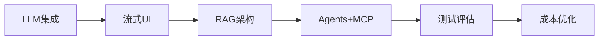

# 🤖 AI-Native Development 深度专题

> 从「调用 API」到「AI 原生架构」—— LLM 集成、RAG、Agent、MCP 协议的 TypeScript 全栈实践。

## 什么是 AI-Native Development？

不是「在应用里加一个聊天框」，而是**以 LLM 能力为核心重新设计软件架构**：

| 传统应用 | AI-Native 应用 |
|---------|---------------|
| 确定性逻辑 | 概率性推理 + 确定性兜底 |
| 结构化输入 | 自然语言理解 |
| 固定工作流 | 动态 Agent 决策 |
| 代码生成数据 | LLM 生成内容 |

## 学习路径

### Phase 1: LLM 集成基础

- [01. AI-Native 开发范式](./01-ai-native-fundamentals)
- [02. LLM 集成模式](./02-llm-integration-patterns)

### Phase 2: 交互与架构

- [03. AI 流式 UI 实现](./03-ai-streaming-ui)
- [04. RAG 架构实战](./04-rag-architecture)

### Phase 3: Agent 与生态

- [05. Agents 与 MCP 协议](./05-agents-and-mcp)
- [06. AI 测试与评估](./06-ai-testing-evaluation)

### Phase 4: 生产化

- [07. 成本优化策略](./07-cost-optimization)
- [08. 安全与 Prompt Injection](./08-security-prompt-injection)

## 核心技术栈

| 层级 | 技术 |
|------|------|
| **SDK** | Vercel AI SDK, LangChain, LlamaIndex |
| **模型** | OpenAI GPT-4, Claude, Gemini, Llama |
| **RAG** | Pinecone, Weaviate, pgvector |
| **Agent** | LangGraph, AutoGen, MCP |
| **部署** | Vercel AI SDK + Edge Runtime |

## 与其他专题的关系

- [React + Next.js App Router](../react-nextjs-app-router/) — AI 流式 UI 集成
- [Edge Runtime](../edge-runtime/) — 边缘 AI 推理
- [数据库层](../database-layer/) — Vector DB 与 pgvector

## 相关专题

| 专题 | 关联点 |
|------|--------|
| [React + Next.js App Router](../react-nextjs-app-router/) | [AI 流式 UI](../ai-native-development/03-ai-streaming-ui.md)、Vercel AI SDK |
| [数据库层与 ORM](../database-layer/) | RAG 架构：Vector DB + pgvector |
| [Edge Runtime](../edge-runtime/) | 边缘 AI 推理：低延迟 LLM 代理部署 |
| [移动端跨平台](../mobile-cross-platform/) | 端侧 AI 推理：Core ML / TensorFlow Lite 集成 |
| [WebAssembly](../webassembly/) | 端侧 AI 推理：TensorFlow.js Wasm 后端、ONNX Runtime |
| [测试工程](../testing-engineering/) | AI 辅助测试生成与 LLM-as-Judge 评估 |
| [性能工程](../performance-engineering/) | AI 推理延迟优化、流式响应与 Token 吞吐量 |
| [应用设计](../application-design/) | AI 原生应用架构、RAG 模式与 Agent 编排 |

## 参考资源

- [Vercel AI SDK](https://sdk.vercel.ai/)
- [LangChain JS](https://js.langchain.com/)
- [Model Context Protocol](https://modelcontextprotocol.io/)
- [AI Engineering (Chip Huyen)](https://www.oreilly.com/library/view/ai-engineering/9781098166298/)
