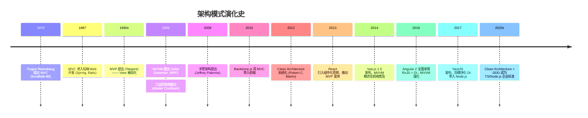
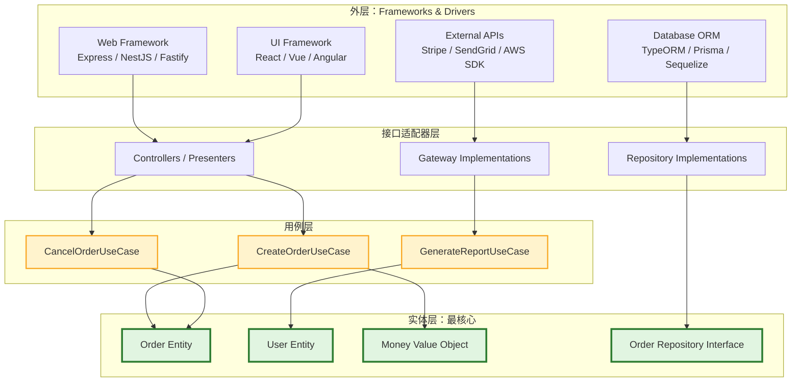
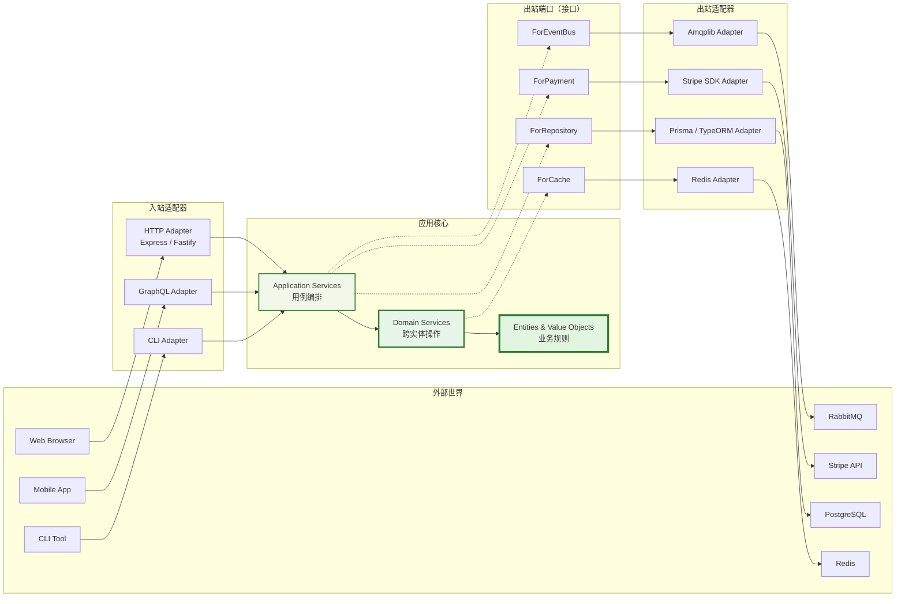

# 架构模式总览：从MVC到六边形

## 引言

软件架构模式（Architectural Pattern）是系统在最高抽象级别上的结构化模板，它定义了子系统的职责划分、交互协议以及依赖方向。
与聚焦于特定代码局部结构的设计模式（Design Pattern）不同，架构模式回答的是"系统如何被划分为有意义的整体单元"这一根本性问题。
从1979年Trygve Reenskaug在Smalltalk-80中提出MVC至今，架构模式经历了从表现层分离到依赖倒置、从分层到端口适配器的深刻演化。
理解这些模式的形式化定义、历史语境与适用边界，是构建可维护、可演化软件系统的先决条件。

在现代JavaScript/TypeScript生态中，架构模式并非遥远的理论概念，而是直接决定了项目目录结构、模块边界、测试策略与团队协作方式的工程现实。
Vue的响应式系统如何体现MVVM的本质？NestJS的模块体系与Clean Architecture的分层有何对应关系？
六边形架构在Node.js服务中如何实现？本文将从理论严格表述与工程实践映射两条轨道并行推进，为这些问题提供系统性的解答。

## 理论严格表述

### 架构模式的定义与分类

架构模式是"在特定环境下对软件系统组织结构的一种通用解决方案"（Buschmann et al., 1996）。它通过预定义的一组子系统、职责分配与交互规则，为设计者提供可复用的结构蓝图。从分类学视角，架构模式可按其关注的核心维度划分为三类：

1. **表现层模式（Presentation Patterns）**：关注用户界面与业务逻辑的分离方式，包括MVC、MVP、MVVM等。这类模式的核心矛盾在于"谁拥有状态"与"谁负责同步"。
2. **业务层模式（Business Logic Patterns）**：关注领域逻辑的封装与组织，包括Transaction Script、Domain Model、Table Module以及领域驱动设计（DDD）中的战术模式。
3. **系统级结构模式（System Structure Patterns）**：关注整个应用或系统的宏观组织，包括分层架构（Layered Architecture）、微内核（Microkernel）、管道-过滤器（Pipes and Filters）以及本文重点讨论的六边形架构与Clean Architecture。

这种分类并非绝对互斥。例如，Clean Architecture同时涉及系统分层与业务逻辑组织；DDD的战略设计则跨越了业务层与系统结构的边界。但在教学与工程实践中，上述分类提供了有效的认知框架。

### MVC的原始定义与演化

**Model-View-Controller（MVC）** 最早由Trygve Reenskaug于1979年在Xerox PARC工作期间为Smalltalk-80系统设计。在其原始论文中，Reenskaug将MVC描述为一种"用户心智模型与计算机模型之间的映射机制"（Reenskaug, 1979）。三个组件的严格定义如下：

- **Model（模型）**：代表应用领域知识，封装了数据结构与业务规则。Model不依赖于View或Controller，它通过Observer模式向View通知状态变更。
- **View（视图）**：负责Model的可视化呈现。View从Model读取数据，但不直接修改Model；当Model发生变化时，View通过Observer机制自动更新。
- **Controller（控制器）**：负责解释用户的输入（鼠标点击、键盘输入等），并将其转换为对Model或View的操作指令。Controller是用户与系统之间的中介。

在Smalltalk-80的原始实现中，三者关系具有严格的约束：View观察Model，Controller操作Model，但Model对View和Controller保持无知。这一设计的关键洞察在于"关注点分离"（Separation of Concerns）：表现逻辑、业务逻辑与输入处理应被解耦，使得同一Model可被多个View共享，而同一View也可在不同Controller策略下复用。

然而，MVC在向后端Web开发（如Spring MVC、Ruby on Rails、Django）与前端框架（如Backbone.js、AngularJS 1.x）传播的过程中发生了显著的语义漂移。在后端语境中，Controller往往演变为"请求路由器+业务协调器"，而View退化为模板引擎；在前端语境中，由于浏览器事件模型的复杂性，Controller的职责常被框架隐含或重新分配。这种演化催生了MVC的多个变体。

### MVP与MVVM的变体

**Model-View-Presenter（MVP）** 由Taligent公司在1990年代提出，其核心动机是解决MVC中View与Model之间的直接耦合问题。在MVP中：

- **Presenter** 取代了Controller的核心角色，成为View与Model之间的唯一中介。
- **View** 不再直接观察Model，而是通过接口与Presenter通信。View被"被动化"（Passive View），仅负责渲染，所有业务逻辑与状态管理均由Presenter承担。
- View与Presenter之间通常是1:1关系，Presenter通过View的接口进行驱动。

MVP的严格版本（Passive View）将View削减为纯粹的渲染层，所有用户输入事件都委托给Presenter处理。这种结构的优点是View极其简单、易于单元测试（只需Mock View接口即可测试Presenter逻辑），缺点是Presenter可能因承担过多职责而膨胀为"上帝类"。

**Model-View-ViewModel（MVVM）** 由Microsoft的John Gossman于2005年提出，最初用于WPF（Windows Presentation Foundation）的数据绑定系统。MVVM的关键创新在于引入**ViewModel**作为View的抽象：

- **ViewModel** 是View的状态与行为的纯代码表示。它通过双向数据绑定（Two-Way Data Binding）与View同步，使得开发者无需手动操作DOM即可实现UI更新。
- ViewModel持有Model的引用，并将Model的原始数据转换为View友好的格式（如将日期对象格式化为字符串）。
- View通过声明式绑定（Declarative Binding）声明其与ViewModel的依赖关系，框架自动处理同步逻辑。

MVVM的本质是将MVP中Presenter的命令式驱动（"调用View.setText()"）替换为声明式绑定（"View自动反映ViewModel的状态变化"）。这一模式在前端框架中得到了广泛应用，尤其是在Vue.js、Angular与Knockout.js中。

### 分层架构与依赖规则

**分层架构（Layered Architecture）** 是最古老、最广泛应用的架构模式之一，其思想可追溯至Dijkstra 1968年关于THE多道程序系统的经典论文。分层的核心原则是：**每一层仅对其下层有依赖，而对其上层保持无知**。信息在层之间自上而下传递（控制流），而数据则可双向流动。

典型的三层架构包括：

- **表现层（Presentation Layer）**：处理用户交互与界面渲染。
- **业务逻辑层（Business Logic Layer / Domain Layer）**：封装领域规则与业务流程。
- **数据访问层（Data Access Layer / Infrastructure Layer）**：处理持久化、网络通信与外部系统集成。

依赖规则（Dependency Rule）是分层的生命线。在严格分层（Strict Layering）中，第N层只能直接调用第N-1层；在松散分层（Relaxed Layering）中，第N层可以跳过中间层直接调用更底层，但这会削弱架构的封装性与可替换性。Buschmann等人在《Pattern-Oriented Software Architecture》中强调："违反依赖规则的分层架构，本质上是一个没有架构的系统。"

### 端口与适配器：六边形架构

**六边形架构（Hexagonal Architecture）** 由Alistair Cockburn于2005年提出，其正式名称为"端口与适配器"（Ports and Adapters）。Cockburn的核心论点是：传统分层架构将"表现层在顶、数据层在底"的隐喻固化为物理依赖方向，导致业务逻辑被迫依赖于框架、数据库与UI技术。六边形架构通过反转这一关系，使**应用程序的核心逻辑（Application Core）成为依赖关系的中心**。

在六边形架构中，系统被划分为：

- **Application Core**：包含应用的所有业务逻辑、领域模型与用例（Use Cases）。Core不依赖于任何外部技术。
- **Ports（端口）**：由Core定义的接口，声明了Core需要外部世界提供什么服务（如持久化、消息发送、用户通知）以及Core向外部世界暴露什么能力（如REST API、CLI命令）。
- **Adapters（适配器）**：外部技术的具体实现。例如，数据库适配器实现Core定义的Repository端口，HTTP适配器将REST请求转换为Core可理解的用例调用。

六边形架构的依赖方向是**由外向内**：Adapter依赖于Port（由Core定义），Core不依赖于Adapter。这实际上就是依赖倒置原则（DIP）在架构层面的应用。Cockburn用六边形而非传统的层级图来表示这一结构，意在强调："没有顶层或底层，只有内部与外部。"

### 洋葱架构与Clean Architecture

**洋葱架构（Onion Architecture）** 由Jeffrey Palermo于2008年提出，是六边形架构思想的进一步发展。Palermo将系统表示为同心圆结构：

- **Domain Model** 位于最核心，包含实体、值对象与领域服务。
- **Domain Services** 围绕核心，协调多个实体完成跨聚合操作。
- **Application Services** 位于更外层，实现具体的用例（Use Cases）。
- **Infrastructure（UI、Database、Tests等）** 位于最外层。

依赖规则极其严格：**内层不能依赖于外层**。外层可以通过接口（抽象）依赖于内层，但内层对任何外层技术保持绝对无知。

**Clean Architecture** 由Robert C. Martin（Uncle Bob）于2012年系统化提出，是上述思想的集大成者。Martin在《Clean Architecture: A Craftsman's Guide to Software Structure and Design》中将架构表示为四层同心圆：

1. **Entities（实体层）**：封装企业级的业务规则。这些规则不依赖于任何应用细节，可在不同应用间复用。
2. **Use Cases（用例层）**：包含应用特定的业务规则，编排实体之间的交互以实现具体的用户场景。
3. **Interface Adapters（接口适配器层）**：将用例层的数据格式转换为外部代理（如数据库、Web框架、UI）可接受的格式。MVC中的Presenter、ViewModel、Controller均属于此层。
4. **Frameworks & Drivers（框架与驱动层）**：包含数据库、Web框架、外部设备等具体实现。这是最不稳定、最易变化的层。

Martin提出的**依赖规则**（The Dependency Rule）是Clean Architecture的唯一绝对约束：

> "Source code dependencies must point only inward, toward higher-level policies."
> （源代码依赖关系只能指向内部，指向更高层的策略。）

这意味着外层可以引用内层，但内层绝不能引用外层；内层也不能依赖于任何框架、库或外部工具——即使这些工具非常流行或"标准"。在JavaScript/TypeScript项目中，这意味着实体层不能`import`任何ORM、HTTP客户端或UI框架。

## 工程实践映射

### 前端中的MVC：Backbone.js的历史角色

Backbone.js（2010年发布）是早期前端MVC框架的代表。在Backbone中，三者映射为：

- **Model**：`Backbone.Model`，封装数据与业务规则，通过事件系统触发变更通知。
- **View**：`Backbone.View`，负责DOM渲染与事件委托，直接监听Model的变化并更新UI。
- **Controller**：Backbone没有显式的Controller类，其职责由Router（`Backbone.Router`）和部分View的事件处理逻辑共同承担。

Backbone的架构体现了经典MVC的核心思想——Model驱动View更新——但也暴露了MVC在前端的局限性。由于View直接监听Model，复杂UI中的事件链往往难以追踪；View与Model之间的多对多关系容易导致"更新风暴"。这些问题推动了MVVM模式的兴起。

```javascript
// Backbone.js 风格的 MVC 示例
const Todo = Backbone.Model.extend({
  defaults: { title: '', completed: false },
  toggle() {
    this.save({ completed: !this.get('completed') });
  }
});

const TodoView = Backbone.View.extend({
  initialize() {
    // View 直接监听 Model 变化 —— 经典 MVC 的 Observer 模式
    this.listenTo(this.model, 'change', this.render);
  },
  events: {
    'click .toggle': 'toggleCompleted'
  },
  toggleCompleted() {
    this.model.toggle();
  },
  render() {
    this.$el.html(`<input class="toggle" type="checkbox" ${this.model.get('completed') ? 'checked' : ''}>`);
    return this;
  }
});
```

值得注意的是，Backbone.js中的View实际上承担了部分Controller的职责（事件处理），而真正的渲染逻辑又内嵌在View中。这种角色模糊是MVC在前端演化的典型特征。

### 前端中的MVVM：Vue与Angular的数据绑定

Vue.js 3.x 是MVVM模式的现代典范。在Vue中：

- **Model**：通常是原始的数据对象或状态管理库（如Pinia、Vuex）中的状态。
- **ViewModel**：由Vue的响应式系统（`ref()`、`reactive()`、Computed Properties）自动生成的代理对象。ViewModel将Model的数据转换为可直接绑定到模板的格式。
- **View**：声明式的模板（`template`），通过指令（`v-bind`、`v-model`、`v-for`）与ViewModel建立绑定关系。

```vue
<script setup lang="ts">
// ViewModel 层：响应式状态与计算属性
import { ref, computed } from 'vue';

const firstName = ref('Alice');
const lastName = ref('Smith');

// computed 属性是 ViewModel 对 Model 数据的转换
const fullName = computed(() => `${firstName.value} ${lastName.value}`);

function updateName(newFirst: string) {
  firstName.value = newFirst; // 修改 Model，View 自动更新
}
</script>

<template>
  <!-- View 层：声明式绑定到 ViewModel -->
  <div>
    <p>`<input>` 通过 `v-model` 实现双向绑定</p>
    <input v-model="firstName" />
    <input v-model="lastName" />
    <p>Full Name: {{ fullName }}</p>
  </div>
</template>
```

Vue的编译器将`<template>`中的声明式绑定转换为对响应式对象的订阅。当`firstName`或`lastName`变化时，依赖它们的DOM节点自动更新——这完全消除了手动DOM操作的需求。Angular通过Zones.js与变更检测（Change Detection）机制实现了类似效果，而React的Hooks虽然采用了不同的实现策略，但`useState`与`useEffect`的组合在概念上仍可视为ViewModel模式的函数式变体。

### MVP在前端中的映射：早期React

React早期（v0.x - v15.x）的组件模型在一定程度上可解读为MVP的变体。在严格的MVP中，View是被动的，由Presenter驱动。React的"无状态函数组件"（Stateless Functional Components）在配合Redux的容器/展示组件模式（Container/Presentational Pattern）时，呈现出了类似结构：

- **Container Component（容器组件）**：承担Presenter角色，订阅Redux Store（Model），通过Props将数据与回调传递给展示组件。
- **Presentational Component（展示组件）**：承担被动View角色，仅负责根据Props渲染UI，不直接访问状态或业务逻辑。

```tsx
// Container / Presenter：负责业务逻辑与数据获取
const UserListContainer: React.FC = () => {
  const [users, setUsers] = useState<User[]>([]);

  useEffect(() => {
    fetchUsers().then(setUsers); // 与 Model（API）交互
  }, []);

  const handleDelete = (id: string) => {
    deleteUser(id).then(() => setUsers(prev => prev.filter(u => u.id !== id)));
  };

  // 将数据和回调注入被动 View
  return `<UserListView>` users={users} onDelete={handleDelete} />;
};

// Presentational / Passive View：纯渲染逻辑
interface UserListViewProps {
  users: User[];
  onDelete: (id: string) => void;
}

const UserListView: React.FC<UserListViewProps> = ({ users, onDelete }) => (
  `<ul>`
    {users.map(user => (
      `<li key={user.id}>`
        {user.name}
        `<button onClick={() => onDelete(user.id)}>`Delete`</button>`
      `</li>`
    ))}
  `</ul>`
);
```

随着React Hooks的引入，容器/展示组件模式逐渐式微，因为`useState`、`useReducer`、`useContext`使得任何组件都能方便地管理状态。但从架构视角，Hooks并没有消除MVP的思想——它只是将Presenter逻辑从单独的组件中"打散"到了多个自定义Hook中。

### 后端中的分层架构：Controller → Service → DAO

在后端Node.js/TS项目中，经典的三层架构表现为：

1. **Controller层（Presentation Layer）**：接收HTTP请求，进行参数校验，调用Service层，返回HTTP响应。在Express中体现为路由处理器；在NestJS中体现为标记`@Controller()`的类。
2. **Service层（Business Logic Layer）**：封装核心业务逻辑。Service层协调多个Repository调用，处理事务边界，实现领域规则。这是系统的"大脑"。
3. **Repository/DAO层（Data Access Layer）**：负责数据持久化。Repository抽象了数据库访问细节，使Service层无需关心使用的是PostgreSQL、MongoDB还是内存存储。

```typescript
// NestJS 风格的三层架构示例

// 1. Controller：表现层，处理 HTTP 语义
@Controller('orders')
export class OrderController {
  constructor(private readonly orderService: OrderService) {}

  @Post()
  async createOrder(@Body() dto: CreateOrderDto) {
    const order = await this.orderService.create(dto);
    return { id: order.id, status: order.status };
  }
}

// 2. Service：业务逻辑层，编排领域操作
@Injectable()
export class OrderService {
  constructor(
    private readonly orderRepo: OrderRepository,
    private readonly inventoryService: InventoryService,
    private readonly eventBus: EventBus,
  ) {}

  async create(dto: CreateOrderDto): Promise<Order> {
    // 业务规则：库存检查
    const available = await this.inventoryService.checkStock(dto.productId, dto.quantity);
    if (!available) {
      throw new InsufficientStockException();
    }

    const order = Order.create(dto); // 领域实体创建
    await this.orderRepo.save(order);

    // 发布领域事件
    this.eventBus.publish(new OrderCreatedEvent(order.id, order.totalAmount));

    return order;
  }
}

// 3. Repository：数据访问层，抽象持久化细节
@Injectable()
export class OrderRepository {
  constructor(@InjectRepository(OrderEntity) private readonly ormRepo: Repository<OrderEntity>) {}

  async save(order: Order): Promise<void> {
    const entity = this.toEntity(order);
    await this.ormRepo.save(entity);
  }

  private toEntity(order: Order): OrderEntity {
    // 领域对象 -> ORM 实体的映射
    return { ... };
  }
}
```

这种三层结构的优势在于职责清晰、易于测试（可为Service注入Mock Repository），但其风险在于Service层可能退化为"事务脚本"（Transaction Script），即一组过程式代码而非真正的领域模型。当业务逻辑高度复杂时，需要引入领域驱动设计（DDD）来深化分层。

### NestJS的模块化架构

NestJS的模块系统（Module System）天然支持Clean Architecture的思想。一个NestJS模块通过`@Module()`装饰器声明其`controllers`、`providers`（Service、Repository等）与`imports`（依赖的其他模块）。这实现了：

- **高内聚**：模块将相关功能封装在独立单元中。
- **显式依赖**：模块之间的依赖通过`imports`显式声明，避免了隐式的全局耦合。
- **可替换性**：通过依赖注入容器，接口（抽象类或Token）可被不同实现动态替换。

在Clean Architecture的语境下，NestJS模块可组织为：

- `domain`模块：包含Entities与Repository接口（Ports）。
- `application`模块：包含Use Cases（Service实现）。
- `infrastructure`模块：包含ORM实体、Controller、外部API客户端（Adapters）。

### TS项目中的Clean Architecture实践

在TypeScript项目中实施Clean Architecture，关键在于利用TS的类型系统与模块边界来强制执行依赖规则。一个典型的目录结构如下：

```
src/
├── domain/                    # 最内层：Entities，零外部依赖
│   ├── entities/
│   │   └── order.ts           # 纯 TS 类/接口，不 import 任何框架
│   ├── value-objects/
│   │   └── money.ts
│   └── repositories/
│       └── order.repository.interface.ts  # Port（接口）
│
├── application/               # 用例层
│   ├── use-cases/
│   │   └── create-order.use-case.ts
│   └── dto/
│       └── create-order.dto.ts
│
├── interface-adapters/        # 接口适配器层
│   ├── controllers/
│   │   └── order.controller.ts   # NestJS/Express Controller
│   ├── presenters/
│   │   └── order.presenter.ts    # 数据格式化
│   └── repositories/
│       └── order.repository.ts   # ORM 实现（Adapter）
│
└── frameworks/                # 最外层：框架配置
    ├── nestjs/
    │   └── app.module.ts
    ├── database/
    │   └── typeorm.config.ts
    └── main.ts
```

依赖规则的TS实现技巧：

1. **使用路径别名（Path Alias）与ESLint规则**：通过`eslint-plugin-import`的`no-restricted-paths`规则，禁止`domain/`目录中的文件`import`外层模块。
2. **接口隔离**：Repository以接口形式定义在`domain/`中，实现放在`interface-adapters/`或`frameworks/`中。
3. **依赖注入**：通过NestJS的DI容器或手动实现的Service Locator，在内层通过接口引用外层实现。

```typescript
// domain/repositories/order.repository.interface.ts
// 零框架依赖，纯 TypeScript 接口
export interface IOrderRepository {
  findById(id: OrderId): Promise<Order | null>;
  save(order: Order): Promise<void>;
}

// application/use-cases/create-order.use-case.ts
// 仅依赖 domain 层，不依赖任何 ORM 或框架
export class CreateOrderUseCase {
  constructor(
    private readonly orderRepo: IOrderRepository,  // 通过接口注入
    private readonly inventoryService: IInventoryService,
  ) {}

  async execute(dto: CreateOrderDto): Promise<Order> {
    const order = Order.create({ ...dto });
    await this.orderRepo.save(order);
    return order;
  }
}

// interface-adapters/repositories/typeorm-order.repository.ts
// 实现层，依赖具体 ORM（TypeORM / Prisma）
import { Injectable } from '@nestjs/common';
import { Repository } from 'typeorm';

@Injectable()
export class TypeOrmOrderRepository implements IOrderRepository {
  constructor(
    @InjectRepository(OrderOrmEntity) private readonly ormRepo: Repository<OrderOrmEntity>
  ) {}

  async findById(id: OrderId): Promise<Order | null> {
    const entity = await this.ormRepo.findOne({ where: { id: id.value } });
    return entity ? this.toDomain(entity) : null;
  }

  async save(order: Order): Promise<void> {
    const entity = this.toOrmEntity(order);
    await this.ormRepo.save(entity);
  }

  private toDomain(entity: OrderOrmEntity): Order { /* ... */ }
  private toOrmEntity(order: Order): OrderOrmEntity { /* ... */ }
}
```

### 六边形架构在Node.js中的实现

六边形架构在Node.js服务中的实施，核心在于将"端口"显式建模为TypeScript接口，将"适配器"建模为实现这些接口的具体类。与Clean Architecture的目录组织不同，六边形架构更强调"以应用为核心"的视角。

```
src/
├── core/                      # 六边形的内部
│   ├── domain/                # 实体、值对象
│   ├── ports/                 # 端口 = 接口定义
│   │   ├── incoming/          # 入站端口（驱动端口）：系统提供的能力
│   │   │   └── create-order.port.ts
│   │   └── outgoing/          # 出站端口（被驱动端口）：系统需要的外部服务
│   │       ├── for-inventory.ts
│   │       ├── for-payment.ts
│   │       └── for-repository.ts
│   └── services/              # 应用服务，实现入站端口
│       └── create-order.service.ts
│
├── adapters/
│   ├── in/                    # 入站适配器：将外部输入转换为内部调用
│   │   ├── http/
│   │   │   └── order.controller.ts
│   │   └── cli/
│   │       └── create-order.command.ts
│   └── out/                   # 出站适配器：将内部调用转换为外部协议
│       ├── persistence/
│       │   └── prisma-order.adapter.ts
│       ├── payment/
│       │   └── stripe.adapter.ts
│       └── messaging/
│           └── rabbitmq-event.adapter.ts
│
└── config/                    # 适配器组装与依赖注入配置
    └── container.ts
```

```typescript
// core/ports/outgoing/for-repository.ts
export interface ForRepository {
  save(order: Order): Promise<void>;
  findById(id: OrderId): Promise<Order | null>;
}

// core/ports/incoming/create-order.port.ts
export interface CreateOrderPort {
  execute(command: CreateOrderCommand): Promise<OrderResult>;
}

// core/services/create-order.service.ts
export class CreateOrderService implements CreateOrderPort {
  constructor(
    private readonly repository: ForRepository,     // 出站端口
    private readonly inventory: ForInventory,         // 出站端口
    private readonly eventPublisher: ForEventPublishing, // 出站端口
  ) {}

  async execute(command: CreateOrderCommand): Promise<OrderResult> {
    // 纯业务逻辑，对 HTTP、数据库、消息队列零认知
    if (!await this.inventory.isAvailable(command.productId, command.qty)) {
      return OrderResult.failure('INSUFFICIENT_STOCK');
    }
    const order = Order.create(command);
    await this.repository.save(order);
    await this.eventPublisher.publish(new OrderCreatedEvent(order));
    return OrderResult.success(order);
  }
}
```

六边形架构在Node.js中的关键优势是**可测试性**。由于核心业务逻辑仅依赖于接口（端口），单元测试可以用内存适配器（In-Memory Adapters）完全替代真实的数据库、消息队列与外部API。这使得测试运行极快、环境搭建极简，且无需Mock框架。

```typescript
// 测试中使用内存适配器，无需数据库
class InMemoryOrderRepository implements ForRepository {
  private orders: Map<string, Order> = new Map();

  async save(order: Order): Promise<void> {
    this.orders.set(order.id.value, order);
  }

  async findById(id: OrderId): Promise<Order | null> {
    return this.orders.get(id.value) ?? null;
  }
}

// 纯内存测试，零 I/O，毫秒级执行
describe('CreateOrderService', () => {
  it('should reject order when stock is insufficient', async () => {
    const service = new CreateOrderService(
      new InMemoryOrderRepository(),
      { isAvailable: async () => false }, // Mock 库存适配器
      { publish: async () => {} },        // Mock 事件适配器
    );
    const result = await service.execute({ productId: 'p1', qty: 100 });
    expect(result.isFailure()).toBe(true);
  });
});
```

### 对比：哪种架构适合哪种项目规模

架构模式的选择不是品位问题，而是约束满足问题。以下决策矩阵可作为工程选择的参考：

| 项目特征 | 推荐模式 | 理由 |
|---------|---------|------|
| 小型CRUD应用（< 5K行） | 三层分层架构 | 简单直接，过度设计成本高于收益 |
| 中型业务应用（5K-50K行） | 分层 + DDD战术模式 | 需要领域模型管理复杂度，但无需极端解耦 |
| 大型SaaS/企业应用（> 50K行） | Clean Architecture / 六边形架构 | 多团队并行开发，框架/数据库频繁更换，测试覆盖要求高 |
| 高变更频率的领域逻辑 | 六边形架构 | 适配器隔离了外部变化，Core保持稳定 |
| 前端SPA（中等复杂度） | MVVM（Vue/Angular） | 响应式绑定显著提升开发效率 |
| 前端复杂交互系统 | MVP变体 + 状态管理 | Presenter逻辑可集中测试，View保持简单 |
| 微服务系统 | Clean Architecture + DDD战略设计 | 限界上下文（Bounded Context）指导服务边界划分 |

需要强调的是，上述模式并非互斥。一个大型系统可能在全局采用Clean Architecture，而在前端子系统中使用MVVM，在批处理模块中使用分层架构。架构设计是**多尺度**（Multi-Scale）的：系统级架构、应用级架构与模块级架构可以采用不同的模式，只要每一层内部的依赖规则被严格遵守。

## Mermaid 图表

### 图1：架构模式演化脉络图



### 图2：Clean Architecture 依赖规则示意图



### 图3：六边形架构结构图



### 图4：MVC vs MVP vs MVVM 职责对比

```mermaid
graph TB
    subgraph "MVC（Smalltalk-80 原始定义）"
        M1[Model<br/>业务逻辑 + 数据]
        V1[View<br/>观察 Model 变化]
        C1[Controller<br/>处理输入，修改 Model]
        M1 -- "Observer 通知更新" --> V1
        C1 -- "修改" --> M1
        V1 -- "接收用户事件，委托给" --> C1
    end

    subgraph "MVP（Passive View）"
        M2[Model]
        V2[View<br/>纯渲染，完全被动]
        P2[Presenter<br/>持有 View 接口，驱动 UI]
        M2 -- "被 Presenter 读取" --> P2
        P2 -- "调用接口方法" --> V2
        V2 -- "所有事件转发" --> P2
    end

    subgraph "MVVM（Vue / Angular / WPF）"
        M3[Model]
        VM3[ViewModel<br/>响应式状态 + 计算属性]
        V3[View<br/>声明式模板绑定]
        M3 -- "数据引用" --> VM3
        VM3 -- "双向数据绑定" --> V3
        V3 -- "用户输入自动同步" --> VM3
    end
```



## 理论要点总结

1. **架构模式是系统级结构模板，而非代码级技巧**。MVC、分层架构、Clean Architecture等模式定义的是子系统的边界与交互规则，其目标是在复杂度增长时维持系统的可理解性与可修改性。

2. **依赖规则是所有架构模式的共同底线**。无论是分层的"上层依赖下层"、Clean Architecture的"向内依赖"，还是六边形架构的"外依赖内"，其核心都是通过控制依赖方向来隔离变化。违反依赖规则的架构，其结构优势将迅速丧失。

3. **MVC的本质是Observer模式驱动的状态同步**。原始MVC中View通过Observer监听Model，这一机制在Backbone.js中直接体现，在Vue的响应式系统中则被编译器与Proxy机制自动化。理解这一本质有助于区分真正的MVC与借用了MVC名词的变体。

4. **MVVM通过声明式绑定消除了命令式DOM操作**。ViewModel作为View的纯代码抽象，通过双向绑定实现自动同步。这一模式在前端框架中的普及，标志着UI开发从"指令式"向"反应式"（Reactive）的范式转移。

5. **六边形架构与Clean Architecture是同一思想的不同表达**。两者均强调业务核心对外部技术的独立性，通过接口（端口/抽象）隔离外部变化。在TypeScript项目中，这体现为`domain/`目录中的接口定义与外层目录中的具体实现。

6. **架构模式的选择应基于项目规模与变更特征，而非个人偏好**。小型CRUD应用使用Clean Architecture可能构成过度工程；大型SaaS系统使用简单三层架构则可能导致技术债务爆炸。理性的架构决策需要在"足够简单"与"足够灵活"之间取得平衡。

7. **前端与后端的架构模式正在趋同**。MVVM、DI（依赖注入）、模块化等原先后端的架构概念已深度融入前端框架；而后端的Clean Architecture、DDD等模式也为前端状态管理与领域建模提供了新的视角。全栈TypeScript开发使得跨端的架构统一成为可能。

## 参考资源

1. **Reenskaug, T. (1979)**. *Models-Views-Controllers*. Xerox PARC Technical Note. 原始MVC论文，定义了Model、View、Controller的语义与Observer更新机制。在线资源：[http://heim.ifi.uio.no/~trygver/themes/mvc/mvc-index.html](http://heim.ifi.uio.no/~trygver/themes/mvc/mvc-index.html)

2. **Buschmann, F., Meunier, R., Rohnert, H., Sommerlad, P., & Stal, M. (1996)**. *Pattern-Oriented Software Architecture, Volume 1: A System of Patterns*. John Wiley & Sons. 软件架构模式的经典教材，系统阐述了分层架构、管道-过滤器、微内核等模式的结构、变体与适用场景。

3. **Martin, R. C. (2017)**. *Clean Architecture: A Craftsman's Guide to Software Structure and Design*. Prentice Hall. Clean Architecture的权威著作，详细论述了依赖规则、实体层设计、用例层组织以及框架隔离策略。

4. **Cockburn, A. (2005)**. *Hexagonal Architecture*. Alistair Cockburn的个人网站论文。六边形架构的原始文献，阐述了"端口与适配器"的核心思想以及为何传统分层图的"上下"隐喻具有误导性。

5. **Fowler, M. (2002)**. *Patterns of Enterprise Application Architecture*. Addison-Wesley. 企业应用架构模式的综合参考，涵盖了Transaction Script、Domain Model、Table Module、Repository、Unit of Work等大量与架构设计密切相关的模式。
