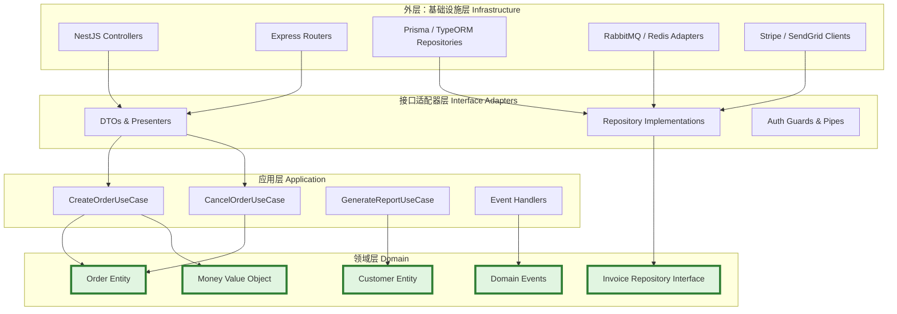
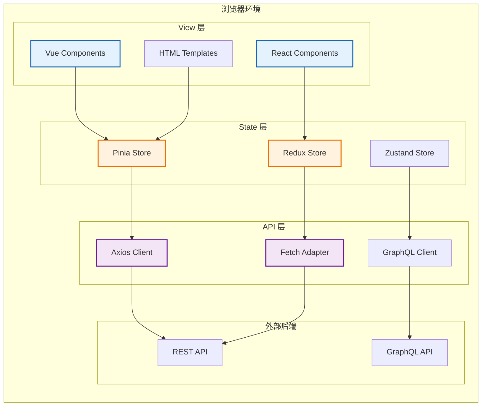
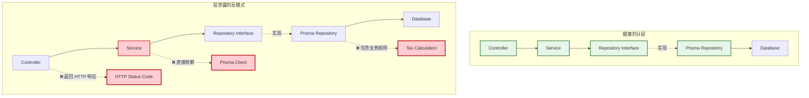

# 分层架构：经典与变体

## 引言

分层架构（Layered Architecture）是软件工程史上最具持久生命力的架构模式之一。从Dijkstra 1968年在THE多道程序系统中引入层次化设计思想，到现代企业应用中的Controller-Service-Repository三层结构，分层模式始终以其直观性与实用性占据着架构设计的主流地位。然而，正是这种"直观性"常常导致其被误用：开发者容易识别层的存在，却难以维持层之间的契约与依赖规则；容易复制目录结构，却难以防止层泄露（Layer Leakage）的侵蚀。

分层架构的核心挑战不在于"如何划分层"，而在于"如何维持层的完整性"。一旦依赖规则被打破——表现层直接访问数据库、业务逻辑层依赖HTTP请求对象、数据访问层返回领域实体——分层架构就退化为一种虚假的目录组织，其带来的复杂度甚至会高于不分层。本文从形式化定义出发，系统论述严格分层与松散分层的语义差异、跨层调用的规则与例外、分层架构的可测试性理论，并深入映射到前端与后端的TypeScript工程实践中。

## 理论严格表述

### 分层架构的形式化定义

分层架构可被形式化地定义为一个三元组 `L = (S, I, D)`，其中：

- `S = {L₁, L₂, ..., Lₙ}` 是层的有限集合，每个层 `Lᵢ` 是一组组件（模块、类、函数）的集合。
- `I = {(Lᵢ, Lⱼ) | i < j}` 是层间接口的集合，定义了上层 `Lⱼ` 可以如何调用下层 `Lᵢ`。
- `D ⊆ S × S` 是依赖关系的二元关系，满足 `D(Lⱼ, Lᵢ) ⇒ j > i`（上层依赖下层）。

在这个形式化框架下，分层架构的关键约束是：**控制流与依赖关系只能单向向下流动**。数据可以在层之间双向流动（如查询结果从数据层返回表现层），但源代码级别的`import`、`require`或符号引用只能遵循自上而下的方向。

Buschmann等人在《Pattern-Oriented Software Architecture》中将分层架构的优势归纳为四点：

1. **复用性（Reusability）**：下层服务可被多个上层组件共享。
2. **可替换性（Substitutability）**：只要接口契约不变，下层的具体实现可以被替换。
3. **可测试性（Testability）**：层边界是自然的Mock点，可以隔离测试各层逻辑。
4. **标准化（Standardization）**：层提供了封装复杂性的抽象级别，使得团队可以基于共同假设进行并行开发。

### 严格分层 vs 松散分层

分层架构存在两种变体：**严格分层（Strict Layering）** 与 **松散分层（Relaxed Layering）**。

在**严格分层**中，第 `N` 层只能直接调用第 `N-1` 层，不允许跳过中间层。例如，表现层不能直接调用数据访问层，而必须通过业务逻辑层中转。这种结构的优点是：

- 每层只需理解直接相邻层的接口，认知负载低。
- 中间层可以实施横切关注点（如事务、权限校验、日志）。
- 变更的波及范围被严格限制在相邻层内。

缺点是性能开销：所有数据访问请求都必须经过业务逻辑层的转发，即使某些场景下业务逻辑层仅充当"透传管道"。

在**松散分层**中，第 `N` 层可以调用任何更下层（`Lᵢ`，其中 `i < N`）。这种结构提高了执行效率，允许表现层直接获取原始数据用于展示，但同时也带来了风险：

- 表现层可能直接依赖数据访问层的实现细节，破坏了可替换性。
- 业务逻辑层被"短路"，导致领域规则被绕过。
- 跨越多层的调用链使得变更影响分析变得困难。

在工程实践中，严格分层与松散分层的选择是一种权衡。Eric Evans在《Domain-Driven Design》中建议：在领域层（Domain Layer）之上采用松散分层以提高灵活性，但在领域层之下（基础设施层）采用严格分层以保护领域模型的纯粹性。这一原则在TypeScript项目中体现为：Service层可直接调用Repository，但Controller不应在Service方法之外直接访问Repository。

### 层的数量与职责划分

分层架构并非固定为三层。根据系统复杂度与领域特征，层的数量可以调整：

**两层架构（2-Tier）**：

- 客户端层（表现 + 部分业务逻辑）
- 服务器层（数据库 + 部分业务逻辑）
两层架构常见于早期桌面应用或简单CRUD系统。其缺点是业务逻辑被分割在客户端与服务器两端，导致重复实现与一致性风险。

**三层架构（3-Tier）**：

- 表现层（Presentation Layer）
- 业务逻辑层（Business Logic Layer / Application Layer）
- 数据访问层（Data Access Layer / Infrastructure Layer）
这是企业应用的标准结构。在Web应用中，表现层对应前端或API Controller，业务逻辑层对应Service，数据访问层对应Repository/DAO。

**N层架构（N-Tier）**：
当系统复杂度增加时，业务逻辑层可被进一步细分为：

- 应用层（Application Layer）：编排用例、协调领域对象。
- 领域层（Domain Layer）：封装业务规则、实体、值对象。
- 基础设施层（Infrastructure Layer）：持久化、消息、外部API。
这就是Clean Architecture与洋葱架构中的多层结构。此时"层"的数量取决于抽象级别的粒度，而非物理部署单元的数量。

### 跨层调用的规则与例外

尽管依赖规则原则上禁止反向依赖（下层依赖上层），但在实际系统中存在一些合理的例外模式：

1. **回调与观察者模式（Observer / Callback）**：下层通过接口或事件机制向上层通知状态变化。例如，数据库连接池通过事件通知上层连接状态。关键在于：下层依赖的是上层的**接口**（抽象），而非具体实现。

2. **依赖注入容器（Dependency Injection Container）**：在运行时，DI容器将下层实现注入到上层中。从静态依赖视角，上层仅依赖于接口；运行时对象图由容器组装。这实际上并未违反依赖规则，只是将依赖解析推迟到运行时。

3. **领域事件（Domain Event）**：领域层通过发布事件来解耦对应用层或基础设施层的直接依赖。事件总线作为中间媒介，使得领域层无需知道谁是事件的消费者。

4. **共享内核（Shared Kernel）**：在多层系统中，某些基础类型（如`Money`、`DateRange`、`Result<T,E>`）被所有层共享。这形成了事实上的"第0层"——所有层都依赖的基础层。在TypeScript中，这通常对应`shared/`或`core/types/`目录。

这些例外模式的共同点是：**它们通过引入抽象（接口、事件、容器）来打破直接的物理依赖，从而维持依赖规则的形式化有效性**。

### 分层架构的可测试性理论

分层架构的可测试性源于其**层边界的隔离性**。每一层仅通过预定义接口与相邻层交互，这意味着：

- **单元测试**：可以独立测试某一层，通过Mock或Stub替换其下层依赖。例如，测试Service层时，可使用内存Repository替代真实数据库。
- **集成测试**：可以测试相邻两层的交互，验证接口契约的正确实现。
- **契约测试**：可以验证下层实现是否满足上层期望的接口语义，特别适用于微服务之间的分层关系。

Mock层边界的理论基础是Liskov替换原则（LSP）：如果下层的Mock实现与真实实现满足相同的接口契约，则上层的测试结论对真实实现同样成立。在TypeScript中，这意味着Repository接口的定义必须足够精确，使得内存实现与数据库实现行为一致。

### 分层与微服务的关系

分层架构与微服务架构并非互斥，而是作用于不同抽象级别。分层关注的是**单个应用内部的组织结构**，微服务关注的是**多个应用之间的部署与通信边界**。一个微服务内部通常采用分层架构组织代码；而一个单体应用内部也可能按微服务思想划分模块（Modular Monolith）。

关键的区别在于**变更边界**：在分层架构中，层的边界是代码级别的；在微服务中，服务的边界是部署与数据级别的。当某一层的变化频率显著高于其他层时，可能预示着该层应被独立为服务。例如，当表现层需要独立的发布周期与伸缩策略时，将其拆分为独立的BFF（Backend for Frontend）服务是合理的选择。

## 工程实践映射

### 经典的三层架构：Presentation → Business → Data

在Node.js/TypeScript后端项目中，经典三层架构的映射如下：

**表现层（Presentation Layer）**：
表现层负责接收外部请求、进行输入校验、将请求转换为应用层可理解的DTO，并将应用层返回的结果序列化为响应格式（通常是JSON）。在HTTP语境中，这一层对应Web框架的路由处理器或Controller。

表现层的关键原则是"薄"（Thin）：它不应包含任何业务逻辑。决策逻辑（如"如果用户是VIP则返回额外字段"）应属于业务逻辑层，而非Controller中的`if`语句。表现层的职责仅限于：

- 协议转换（HTTP ↔ 内部方法调用）
- 输入校验（通过DTO或Schema验证）
- 输出格式化（通过Presenter或Serializer）
- 横切关注点（日志、指标、认证中间件）

```typescript
// 表现层示例：NestJS Controller
@Controller('invoices')
export class InvoiceController {
  constructor(
    private readonly createInvoiceUseCase: CreateInvoiceUseCase,
    private readonly invoicePresenter: InvoicePresenter,
  ) {}

  @Post()
  async create(
    @Body() dto: CreateInvoiceDto,     // 输入校验由 ValidationPipe 处理
    @CurrentUser() user: UserPayload,
  ): Promise<InvoiceResponseDto> {
    // Controller 仅负责调用用例，无业务逻辑
    const invoice = await this.createInvoiceUseCase.execute({
      ...dto,
      issuerId: user.id,
    });

    // 通过 Presenter 格式化输出
    return this.invoicePresenter.toResponse(invoice);
  }
}
```

**业务逻辑层（Business Logic Layer）**：
这是系统的核心，封装了所有领域规则与业务流程。在企业应用中，这一层通常被称为"Service层"，但在DDD语境中，它可能进一步划分为Application Service（用例编排）与Domain Service（领域规则）。

业务逻辑层的关键特征是：它对表现层与数据访问层均保持无知。它不直接操作HTTP响应对象，不执行SQL查询，也不了解数据库事务的具体实现。它通过依赖注入的接口（Repository接口、外部服务接口）与下层交互。

```typescript
// 业务逻辑层示例：Application Service + Domain Service
@Injectable()
export class CreateInvoiceUseCase {
  constructor(
    private readonly invoiceRepo: IInvoiceRepository,
    private readonly taxService: ITaxService,
    private readonly customerRepo: ICustomerRepository,
    private readonly eventBus: IEventBus,
  ) {}

  async execute(command: CreateInvoiceCommand): Promise<Invoice> {
    // 领域规则：客户必须存在
    const customer = await this.customerRepo.findById(command.customerId);
    if (!customer) {
      throw new DomainException('CUSTOMER_NOT_FOUND');
    }

    // 领域规则：税额计算属于业务逻辑，不在 Controller 中计算
    const taxRate = await this.taxService.getRate(customer.taxRegion);
    const invoice = Invoice.create({
      ...command,
      taxRate,
      issuedAt: new Date(),
    });

    // 持久化通过接口委托给 Repository
    await this.invoiceRepo.save(invoice);

    // 发布领域事件
    await this.eventBus.publish(new InvoiceCreatedEvent(invoice.id));

    return invoice;
  }
}
```

**数据访问层（Data Access Layer）**：
数据访问层负责与持久化存储、消息队列、外部API等基础设施交互。在Clean Architecture语境中，这属于最外层；在经典三层架构中，它是系统的"基底"。

Repository模式是数据访问层的核心抽象。Repository对业务逻辑层暴露领域对象（Entities），并在内部处理对象-关系映射（ORM）、查询优化、缓存策略等技术细节。业务逻辑层看到的Repository是一个纯接口：

```typescript
// 数据访问层：Repository 接口（定义在 domain/ 或 shared/ 中）
export interface IInvoiceRepository {
  findById(id: InvoiceId): Promise<Invoice | null>;
  findByCustomerId(customerId: CustomerId): Promise<Invoice[]>;
  save(invoice: Invoice): Promise<void>;
  delete(id: InvoiceId): Promise<void>;
}

// 数据访问层：Repository 实现（位于 infrastructure/ 中）
@Injectable()
export class PrismaInvoiceRepository implements IInvoiceRepository {
  constructor(private readonly prisma: PrismaService) {}

  async findById(id: InvoiceId): Promise<Invoice | null> {
    const record = await this.prisma.invoice.findUnique({
      where: { id: id.value },
      include: { items: true, customer: true },
    });
    return record ? this.toDomain(record) : null;
  }

  async save(invoice: Invoice): Promise<void> {
    const data = this.toPrisma(invoice);
    await this.prisma.invoice.upsert({
      where: { id: invoice.id.value },
      create: data,
      update: data,
    });
  }

  private toDomain(record: PrismaInvoice): Invoice {
    // ORM 记录 -> 领域对象的映射
    return Invoice.reconstitute({ ... });
  }

  private toPrisma(invoice: Invoice): Prisma.InvoiceUncheckedCreateInput {
    // 领域对象 -> ORM 记录的映射
    return { ... };
  }
}
```

### 前端的分层：View → State → API

前端应用虽然运行在浏览器中，但同样可以从分层视角进行结构化分析。一个现代前端应用（以Vue 3 + Pinia + Axios为例）的分层映射如下：

**View层（表现层）**：
Vue的`<template>`、组件的`render`函数或JSX构成了View层。这一层负责将状态渲染为DOM，并捕获用户交互事件。在分层架构中，View层应是"被动的"——它不直接发起API请求，不直接修改全局状态，而是通过绑定将事件委托给State层。

```vue
<script setup lang="ts">
// View 层：仅负责声明式渲染与事件转发
import { useCartStore } from '@/stores/cart';

const cart = useCartStore();

function handleCheckout() {
  // 不直接调用 API，而是委托给 State 层（Store）
  cart.checkout();
}
</script>

<template>
  `<div class="cart">`
    `<ul>`
      `<li v-for="item in cart.items" :key="item.id">`
        {{ item.name }} - {{ item.price }}
      `</li>`
    `</ul>`
    `<button @click="handleCheckout" :disabled="cart.isLoading">`
      Checkout ({{ cart.totalAmount }})
    `</button>`
  `</div>`
</template>
```

**State层（业务逻辑层）**：
在前端语境中，State层由状态管理库（Pinia、Vuex、Redux、Zustand等）或自定义的Service/Store类承担。这一层封装了前端的业务逻辑：购物车计算、表单校验规则、用户权限判断等。

State层的关键设计决策是：它是否应直接调用API？在严格分层中，State层应通过API层（Adapter）获取数据，自身不直接依赖`axios`或`fetch`。但在实际工程中，为减少抽象层次，许多项目允许State层直接调用API客户端——这构成了一种实用的松散分层。

```typescript
// State 层：Pinia Store 作为业务逻辑层
import { defineStore } from 'pinia';
import { cartApi } from '@/api/cart';   // API 层适配器

export const useCartStore = defineStore('cart', {
  state: () => ({
    items: [] as CartItem[],
    isLoading: false,
  }),

  getters: {
    totalAmount: (state) => state.items.reduce((sum, item) => sum + item.price, 0),
    itemCount: (state) => state.items.length,
  },

  actions: {
    async addItem(product: Product) {
      // 前端业务规则：购物车最多 99 件商品
      if (this.itemCount >= 99) {
        throw new CartError('CART_FULL');
      }

      const newItem = CartItem.create(product);
      this.items.push(newItem);

      // 通过 API 层同步到服务端
      await cartApi.addItem(product.id);
    },

    async checkout() {
      this.isLoading = true;
      try {
        // 委托给 API 层执行支付流程
        const result = await cartApi.checkout(this.items);
        this.items = []; // 清空本地状态
        return result;
      } finally {
        this.isLoading = false;
      }
    },
  },
});
```

**API层（数据访问层）**：
API层封装了与后端服务的通信细节。在TypeScript前端项目中，这一层通常包含：

- Axios实例配置（BaseURL、拦截器、超时设置）
- 按领域划分的API客户端（`cartApi`、`userApi`、`orderApi`）
- 请求/响应DTO的类型定义
- 错误处理与重试策略

```typescript
// API 层：封装 HTTP 通信细节
import axios from 'axios';

const apiClient = axios.create({
  baseURL: import.meta.env.VITE_API_BASE_URL,
  timeout: 10000,
});

// 请求拦截器：附加认证令牌
apiClient.interceptors.request.use((config) => {
  const token = localStorage.getItem('token');
  if (token) {
    config.headers.Authorization = `Bearer ${token}`;
  }
  return config;
});

// 响应拦截器：统一错误处理
apiClient.interceptors.response.use(
  (response) => response,
  (error) => {
    if (error.response?.status === 401) {
      // 全局认证失败处理
      window.location.href = '/login';
    }
    return Promise.reject(error);
  },
);

export const cartApi = {
  async addItem(productId: string): Promise<void> {
    await apiClient.post('/cart/items', { productId });
  },

  async checkout(items: CartItem[]): Promise<CheckoutResult> {
    const { data } = await apiClient.post('/cart/checkout', { items });
    return data;
  },

  async getCart(): Promise<CartItem[]> {
    const { data } = await apiClient.get('/cart');
    return data.items;
  },
};
```

前端分层的常见陷阱是将API调用直接内嵌在组件中（如Vue的`<script setup>`中直接写`axios.get`），或在模板中直接引用全局状态。严格的分层要求组件仅依赖注入的Props或局部的Store实例，这显著提高了组件的可复用性与可测试性。

### TS项目的目录结构分层

在TypeScript全栈或后端项目中，目录结构是分层架构最直观的体现。以下是一个遵循严格分层原则的典型目录结构：

```
src/
├── shared/                        # 跨层共享内核
│   ├── types/
│   │   └── result.ts              # Result<T,E> 类型
│   ├── exceptions/
│   │   └── domain-exception.ts
│   └── utils/
│       └── guard.ts
│
├── domain/                        # 领域层：核心业务规则
│   ├── entities/
│   │   ├── invoice.ts             # Invoice 实体
│   │   └── customer.ts            # Customer 实体
│   ├── value-objects/
│   │   ├── money.ts               # Money 值对象
│   │   └── invoice-id.ts          // InvoiceId 值对象
│   ├── repositories/
│   │   ├── invoice.repository.ts  # Repository 接口（端口）
│   │   └── customer.repository.ts
│   ├── services/
│   │   └── tax-calculator.ts      # 领域服务
│   └── events/
│       └── invoice-created.event.ts
│
├── application/                   # 应用层：用例编排
│   ├── use-cases/
│   │   ├── create-invoice/
│   │   │   ├── create-invoice.command.ts
│   │   │   ├── create-invoice.handler.ts
│   │   │   └── create-invoice.dto.ts
│   │   └── cancel-invoice/
│   │       └── ...
│   ├── dto/
│   │   └── pagination.dto.ts
│   └── interfaces/
│       └── event-publisher.ts     # 应用层需要的接口
│
├── infrastructure/                # 基础设施层：技术实现
│   ├── persistence/
│   │   ├── prisma/
│   │   │   └── schema.prisma
│   │   └── repositories/
│   │       ├── prisma-invoice.repository.ts
│   │       └── prisma-customer.repository.ts
│   ├── http/
│   │   ├── controllers/
│   │   │   └── invoice.controller.ts
│   │   ├── presenters/
│   │   │   └── invoice.presenter.ts
│   │   ├── filters/
│   │   │   └── exception.filter.ts
│   │   └── guards/
│   │       └── auth.guard.ts
│   ├── messaging/
│   │   └── rabbitmq-event-publisher.ts
│   └── config/
│       └── database.config.ts
│
└── main.ts                        # 应用入口：组装所有层
```

**依赖规则检查**：
在上述结构中，关键依赖规则可通过目录约束来强制执行：

- `domain/` 不依赖 `application/`、`infrastructure/` 或 `shared/` 中的框架代码。
- `application/` 可依赖 `domain/` 与 `shared/`，但不依赖 `infrastructure/`。
- `infrastructure/` 可依赖所有内层，但不能被内层直接引用（仅通过接口）。

在TypeScript中，可通过`tsconfig.json`的路径别名配合ESLint的`no-restricted-paths`规则来实现编译期的依赖方向检查：

```json
// tsconfig.json
{
  "compilerOptions": {
    "baseUrl": ".",
    "paths": {
      "@domain/*": ["src/domain/*"],
      "@application/*": ["src/application/*"],
      "@infrastructure/*": ["src/infrastructure/*"],
      "@shared/*": ["src/shared/*"]
    }
  }
}
```

```javascript
// .eslintrc.js —— 强制依赖方向
module.exports = {
  rules: {
    'no-restricted-imports': ['error', {
      paths: [
        {
          name: '@infrastructure/persistence/prisma',
          message: 'Domain layer must not import infrastructure implementations. Use repository interfaces instead.',
        },
      ],
      patterns: [
        {
          group: ['@infrastructure/*'],
          message: 'Domain and Application layers must not depend on Infrastructure.',
        },
      ],
    }],
  },
};
```

### 依赖注入在分层架构中的作用

依赖注入（Dependency Injection, DI）是实现分层架构依赖规则的关键机制。在没有DI的情况下，上层组件需要通过`new`关键字直接实例化下层组件，这导致：

- 上层代码硬编码了下层的具体类名，违反了依赖倒置原则。
- 单元测试难以替换下层实现，必须依赖真实的数据库或外部服务。
- 配置信息（如数据库连接字符串）需要穿透多层才能到达数据访问层。

DI通过" Hollywood Principle "（"Don't call us, we'll call you"）解决了这些问题：组件声明其依赖（通常通过构造函数参数），而由外部容器在运行时注入具体的实现。

在TypeScript/NestJS生态中，DI的实现方式包括：

1. **构造函数注入（Constructor Injection）**：
   NestJS默认的DI方式，通过TypeScript的装饰器元数据自动解析依赖。

2. **接口注入与Token**：
   由于TypeScript的类型擦除，运行时无法直接识别接口。NestJS使用`@Inject(Token)`或Provider的`provide`属性来绑定接口与实现。

```typescript
// 定义 Injection Token
export const INVOICE_REPOSITORY = Symbol('INVOICE_REPOSITORY');

// 在模块中绑定接口与实现
@Module({
  providers: [
    {
      provide: INVOICE_REPOSITORY,
      useClass: PrismaInvoiceRepository,
    },
  ],
})
export class InvoiceModule {}

// 在 Service 中通过 Token 注入接口
@Injectable()
export class CreateInvoiceUseCase {
  constructor(
    @Inject(INVOICE_REPOSITORY)
    private readonly invoiceRepo: IInvoiceRepository,
  ) {}
}
```

1. **手动DI容器**：
   在不使用NestJS的轻量级项目中，可以手动实现DI容器：

```typescript
// 简单的手动 DI 容器
class Container {
  private registry = new Map<symbol, any>();

  register<T>(token: symbol, implementation: T): void {
    this.registry.set(token, implementation);
  }

  resolve<T>(token: symbol): T {
    const instance = this.registry.get(token);
    if (!instance) {
      throw new Error(`No provider registered for token: ${token.toString()}`);
    }
    return instance;
  }
}

// 应用启动时组装（Composition Root）
const container = new Container();
container.register(INVOICE_REPOSITORY, new PrismaInvoiceRepository(prisma));
container.register(EVENT_BUS, new RabbitMqEventPublisher(connection));

const createInvoiceUseCase = new CreateInvoiceUseCase(
  container.resolve(INVOICE_REPOSITORY),
  container.resolve(EVENT_BUS),
);
```

DI的价值不仅在于解耦，更在于**组合根（Composition Root）**的集中化：所有层的组装逻辑被收敛到应用的单一入口点（如`main.ts`），使得系统的依赖关系图可以被整体审视与修改。

### 层间DTO（Data Transfer Object）的设计

DTO是层之间数据传输的载体，其设计质量直接影响分层的清晰度。一个常见的反模式是将ORM实体（如Prisma生成的类型、TypeORM实体类）直接穿透多层传递到表现层。这会导致：

- 表现层被迫依赖ORM的字段命名、关系结构甚至实现细节。
- 数据库Schema的变更直接波及API契约，破坏向后兼容性。
- 敏感字段（如密码哈希、内部状态）意外暴露给客户端。

正确的DTO设计应遵循"**每层有自己的数据模型**"原则：

```typescript
// 1. 领域层：领域对象，包含业务行为
class Invoice {
  private constructor(
    public readonly id: InvoiceId,
    public readonly customerId: CustomerId,
    public readonly items: InvoiceItem[],
    public readonly taxAmount: Money,
    public readonly totalAmount: Money,
    public readonly status: InvoiceStatus,
  ) {}

  static create(props: CreateInvoiceProps): Invoice { /* ... */ }
  cancel(): void { /* 领域规则：已支付的订单不能取消 */ }
}

// 2. 应用层：Command / Query DTO，用于用例输入输出
interface CreateInvoiceCommand {
  customerId: string;
  items: { productId: string; quantity: number; unitPrice: number }[];
  taxRegion: string;
}

// 3. 表现层：API Request / Response DTO
class CreateInvoiceRequestDto {
  @IsUUID() customerId: string;
  @ValidateNested({ each: true }) @Type(() => InvoiceItemDto) items: InvoiceItemDto[];
  @IsString() taxRegion: string;
}

class InvoiceResponseDto {
  id: string;
  customerId: string;
  items: InvoiceItemResponseDto[];
  totalAmount: string;  // 格式化为 "¥1,234.56"
  status: string;
  createdAt: string;    // ISO 8601 格式
}

// 4. 基础设施层：ORM 实体 / 数据库记录
interface InvoiceRecord {
  id: string;
  customer_id: string;
  tax_amount_cents: number;
  total_amount_cents: number;
  status: string;
  created_at: Date;
}
```

**对象映射（Object Mapping）** 是分层架构中的必要开销。虽然自动映射工具（如`class-transformer`、`@automapper`）可以减少样板代码，但显式的映射逻辑具有重要价值：它迫使开发者思考"这一层真正需要什么数据"，从而防止数据泄露与过度获取。

### 跨层事件的发布-订阅模式

在严格分层架构中，上层对下层的调用是直接的（同步方法调用），但下层向上层的通知需要特殊处理。**发布-订阅（Pub-Sub）事件模式**是实现跨层通信的标准机制，特别适用于以下场景：

- 领域层需要通知应用层某个业务事件已发生（如"订单已创建"），但领域层不应依赖应用层的具体实现。
- 应用层需要触发基础设施层的异步操作（如发送邮件、更新搜索索引），但应用层不应直接依赖SMTP客户端或Elasticsearch SDK。
- 多个上层组件需要响应同一个下层事件（如"用户注册成功"触发 welcome 邮件、分析日志、推荐系统更新）。

事件总线作为中间层，解耦了发布者与订阅者：

```typescript
// domain/events/domain-event.ts
export abstract class DomainEvent {
  public readonly occurredOn: Date;
  public readonly eventId: string;

  constructor() {
    this.occurredOn = new Date();
    this.eventId = crypto.randomUUID();
  }
}

export class OrderCreatedEvent extends DomainEvent {
  constructor(
    public readonly orderId: string,
    public readonly customerId: string,
    public readonly totalAmount: number,
  ) {
    super();
  }
}

// application/ports/event-publisher.port.ts
export interface IEventPublisher {
  publish(event: DomainEvent): Promise<void>;
}

// application/event-handlers/send-welcome-email.handler.ts
@Injectable()
export class SendWelcomeEmailHandler {
  constructor(private readonly emailService: IEmailService) {}

  @OnEvent('order.created')
  async handle(event: OrderCreatedEvent): Promise<void> {
    if (event.totalAmount > 1000) {
      await this.emailService.sendPremiumCustomerWelcome(event.customerId);
    }
  }
}

// infrastructure/messaging/in-memory-event-bus.ts
@Injectable()
export class InMemoryEventBus implements IEventPublisher {
  private handlers = new Map<string, Array<(event: DomainEvent) => Promise<void>>>();

  subscribe(eventName: string, handler: (event: DomainEvent) => Promise<void>): void {
    const existing = this.handlers.get(eventName) ?? [];
    existing.push(handler);
    this.handlers.set(eventName, existing);
  }

  async publish(event: DomainEvent): Promise<void> {
    const handlers = this.handlers.get(event.constructor.name) ?? [];
    await Promise.all(handlers.map(h => h(event)));
  }
}
```

在NestJS中，`@nestjs/event-emitter`模块提供了内置的事件发布-订阅支持，其底层实现本质上就是上述模式的工程化封装。

### 反模式：层泄露（Layer Leakage）

层泄露是分层架构最危险的腐化形式，它悄无声息地破坏着依赖规则。常见的层泄露形式包括：

**1. 表现层泄露（Presentation Leakage）**：
业务逻辑层或数据访问层直接返回表现层特定的格式（如HTML字符串、React组件、HTTP状态码）。

```typescript
// ❌ 反模式：Service 返回 HTTP 相关的响应对象
class BadOrderService {
  async createOrder(dto: CreateOrderDto) {
    try {
      const order = await this.repo.save(dto);
      return { statusCode: 201, body: order };  // 泄露 HTTP 语义到业务层
    } catch (e) {
      return { statusCode: 400, body: { error: e.message } };
    }
  }
}
```

**2. 数据访问层泄露（Persistence Leakage）**：
业务逻辑层直接操作ORM实体或SQL查询构建器，将持久化细节渗透到领域规则中。

```typescript
// ❌ 反模式：领域逻辑中直接使用 Prisma 查询
class BadInvoiceService {
  constructor(private prisma: PrismaClient) {}  // 领域层依赖具体 ORM

  async getOverdueInvoices() {
    // 业务逻辑与 SQL/Prisma API 混合
    return this.prisma.invoice.findMany({
      where: {
        dueDate: { lt: new Date() },
        status: { not: 'PAID' },
      },
      include: { customer: true },
    });
  }
}
```

**3. 框架泄露（Framework Leakage）**：
领域层或应用层直接依赖Web框架、测试框架或UI框架的API。

```typescript
// ❌ 反模式：领域实体依赖 NestJS 装饰器
import { Injectable } from '@nestjs/common';  // 框架泄露到领域层

@Injectable()  // 领域实体不应由框架实例化
export class Invoice {
  // ...
}
```

**4. 跨层DTO共享**：
使用同一个DTO类在表现层与数据访问层之间传递数据，导致字段命名、校验规则与序列化逻辑纠缠不清。

防止层泄露的工程实践包括：

- **编译期检查**：通过ESLint规则禁止特定目录`import`外层模块。
- **代码审查清单**：在PR审查中检查"是否有ORM类型进入Service参数"、"是否有HTTP状态码出现在非Controller文件中"。
- **架构测试**：使用`dependency-cruiser`或`arch-unit-ts`等工具自动验证依赖方向。
- **模块边界**：在大型项目中，将各层拆分为独立的npm workspace或子项目，通过package.json的依赖声明强制执行分层。

```typescript
// ✅ 正确：各层使用独立的 DTO，通过显式映射隔离
// 表现层 DTO
class CreateInvoiceHttpDto { /* 校验装饰器、OpenAPI 注解 */ }

// 应用层 Command
class CreateInvoiceCommand { /* 干净的 JS 对象，无框架依赖 */ }

// 领域层参数
interface CreateInvoiceProps { /* 领域所需的精确字段 */ }

// 映射逻辑位于层边界
function toCommand(dto: CreateInvoiceHttpDto): CreateInvoiceCommand {
  return { /* 转换 */ };
}
```

## Mermaid 图表

### 图1：严格分层 vs 松散分层对比

```mermaid
graph TB
    subgraph "严格分层 Strict Layering"
        S1[Presentation Layer] --> S2[Business Logic Layer]
        S2 --> S3[Data Access Layer]
        S3 --> S4[Database / External APIs]

        style S1 fill:#e3f2fd,stroke:#1565c0,stroke-width:2px
        style S2 fill:#e8f5e9,stroke:#2e7d32,stroke-width:2px
        style S3 fill:#fff3e0,stroke:#ef6c00,stroke-width:2px
    end

    subgraph "松散分层 Relaxed Layering"
        R1[Presentation Layer]
        R2[Business Logic Layer]
        R3[Data Access Layer]
        R4[Database / External APIs]

        R1 --> R2
        R2 --> R3
        R3 --> R4
        R1 -. "允许跨层调用" .-> R3

        style R1 fill:#e3f2fd,stroke:#1565c0,stroke-width:2px
        style R2 fill:#e8f5e9,stroke:#2e7d32,stroke-width:2px
        style R3 fill:#fff3e0,stroke:#ef6c00,stroke-width:2px
        style R1 -.-> R3 stroke:#d32f2f,stroke-dasharray: 5 5
    end
```

### 图2：TypeScript 项目中的四层分层结构



### 图3：前端 View-State-API 分层架构



### 图4：层泄露反模式检测图



## 理论要点总结

1. **分层架构的形式化定义是三元组 `(S, I, D)`**，其中依赖关系 `D` 的单向性是架构有效性的充要条件。一旦依赖方向发生反向流动，分层架构即退化为名义上的目录结构。

2. **严格分层与松散分层的差异在于跨层调用的许可范围**。严格分层通过限制调用链长度来降低认知复杂度与变更波及范围；松散分层通过允许短路来提升执行效率。Evans建议领域层之下采用严格分层以保护领域纯粹性。

3. **层间通信的合法例外模式包括回调/观察者、依赖注入、领域事件与共享内核**。这些模式的共性在于通过抽象（接口、事件总线、通用类型）维持依赖规则的形式有效性，而非直接引用具体实现。

4. **可测试性是分层的核心收益**。层边界天然构成Mock点，使得单元测试可以在隔离环境中验证各层逻辑。内存Repository、Fake事件总线等测试替身（Test Doubles）是这一策略的工程实现。

5. **前端应用同样适用分层思想**。View-State-API三层分别对应表现层、业务逻辑层与数据访问层。将API调用直接嵌入组件是常见的前端反模式，应通过Store/Service层进行隔离。

6. **DTO的层隔离是防止层泄露的关键防线**。每层应有独立的数据模型，对象映射虽然增加了样板代码，但换来了层边界的清晰与系统的长期可维护性。

7. **层泄露的检测需要工具支持**。ESLint的`no-restricted-paths`、dependency-cruiser的架构规则、以及代码审查中的分层检查清单，是维持架构完整性的必要工程实践。

## 参考资源

1. **Dijkstra, E. W. (1968)**. *The Structure of the T.H.E. Multiprogramming System*. Communications of the ACM, 11(5), 341-346. 分层设计思想的奠基之作，首次系统阐述了通过层次化结构管理系统复杂性的方法。

2. **Buschmann, F., Meunier, R., Rohnert, H., Sommerlad, P., & Stal, M. (1996)**. *Pattern-Oriented Software Architecture, Volume 1: A System of Patterns*. John Wiley & Sons. 分层架构模式的权威参考，详细论述了严格分层、松散分层、层数量决策以及分层与其他架构模式的关系。

3. **Evans, E. (2003)**. *Domain-Driven Design: Tackling Complexity in the Heart of Software*. Addison-Wesley. DDD经典著作，在分层架构语境下提出了用户界面层、应用层、领域层与基础设施层的四层划分，以及反腐蚀层（Anti-Corruption Layer）在跨系统集成中的作用。

4. **Martin, R. C. (2017)**. *Clean Architecture: A Craftsman's Guide to Software Structure and Design*. Prentice Hall. 详细论述了依赖规则、接口隔离、以及如何在分层架构中保护领域层免受框架污染的工程策略。

5. **Fowler, M. (2002)**. *Patterns of Enterprise Application Architecture*. Addison-Wesley. 提供了Transaction Script、Domain Model、Table Module、Data Mapper、Repository等大量与分层架构密切相关的模式参考，以及Service Layer与Repository模式的标准实现。
