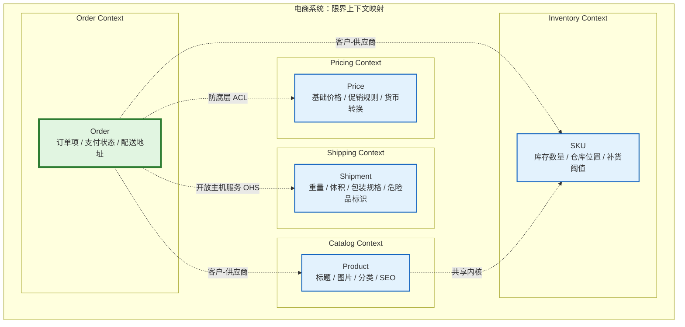
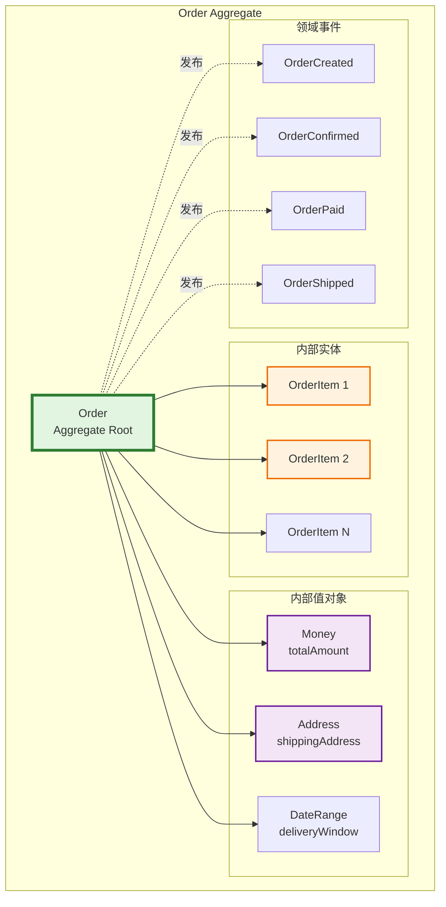
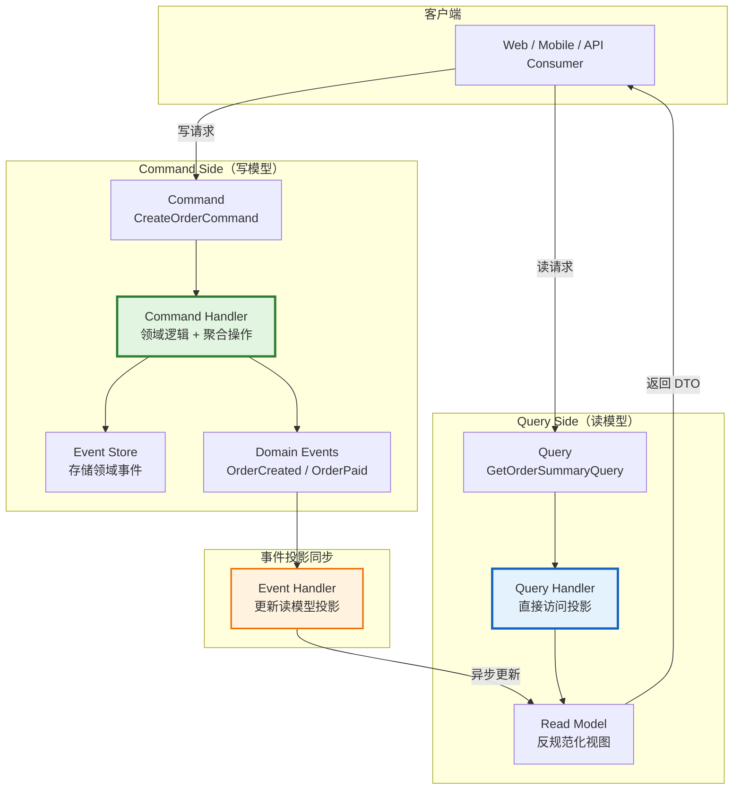
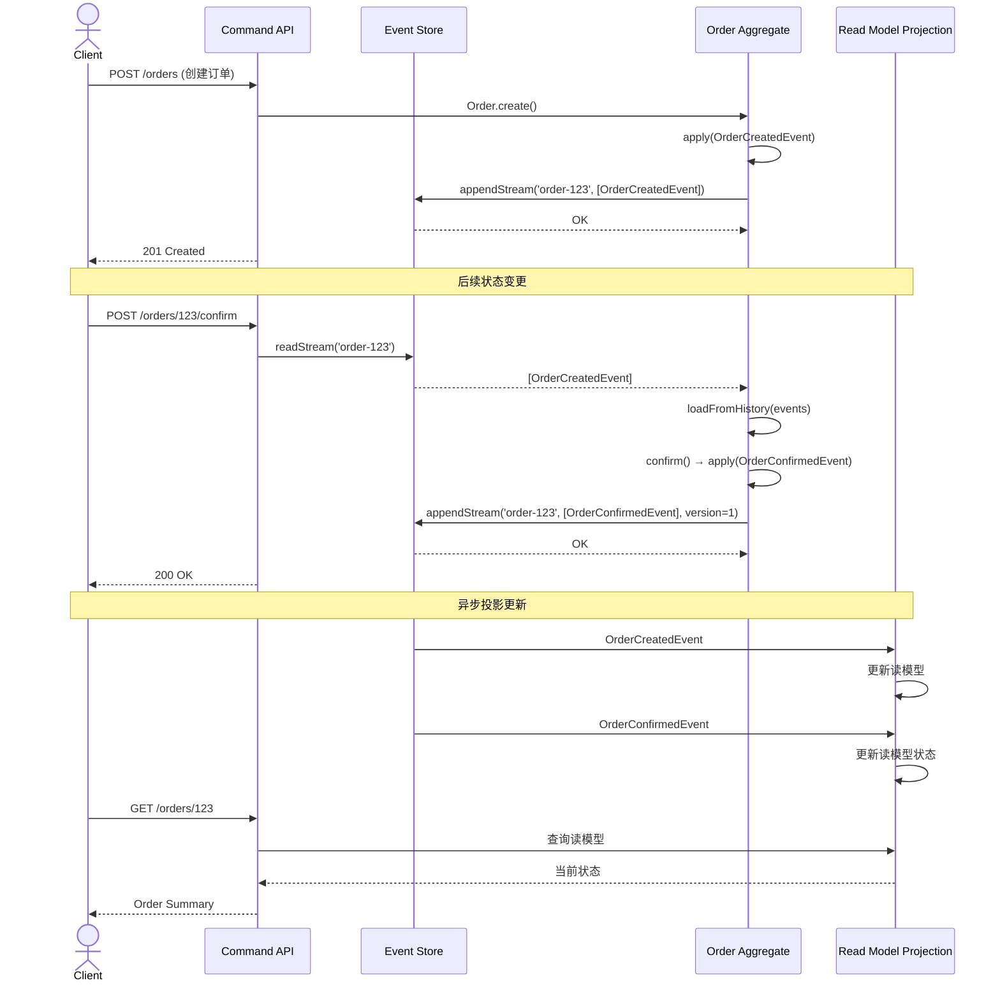
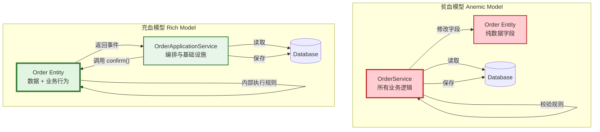

# 领域驱动设计：战略与战术模式

## 引言

软件系统的复杂度主要来源于两个方面：技术复杂度（Technical Complexity）与领域复杂度（Domain Complexity）。框架选择、数据库优化、并发处理等技术问题固然具有挑战性，但它们往往是"已解决的难题"——有大量文档、工具与最佳实践可供参考。相比之下，业务领域的内在复杂性（保险精算规则、供应链调度逻辑、金融合规要求）才是大多数软件项目失败或陷入技术债务泥潭的根本原因。

领域驱动设计（Domain-Driven Design, DDD）由Eric Evans于2003年系统化提出，其核心论点是：**软件设计应以领域模型为中心，而非以技术框架或数据模型为中心**。DDD不是一组编码技巧，而是一种以业务领域为核心的软件构建哲学。它将设计活动划分为两个互补的维度：

- **战略设计（Strategic Design）**：回答"系统应被划分为哪些有意义的边界"，关注限界上下文、上下文映射、子域划分与通用语言的建立。
- **战术设计（Tactical Design）**：回答"在每个边界内部，领域逻辑应如何被建模"，关注实体、值对象、聚合、领域服务、仓储、工厂与领域事件的具体构造。

在JavaScript/TypeScript生态中，DDD的实践具有特殊意义。TypeScript的结构化类型系统为值对象、实体ID与领域事件的类型安全提供了坚实基础；NestJS的模块化体系与依赖注入容器天然支持DDD的模块组织；Node.js的事件驱动模型则为领域事件与CQRS的实现提供了轻量级的运行时环境。本文将从理论严格表述与工程实践映射两条轨道，系统阐述DDD在TS项目中的应用。

## 理论严格表述

### 战略设计：限界上下文与上下文映射

**限界上下文（Bounded Context）** 是DDD战略设计中的核心概念。Evans将其定义为"一个特定的模型被应用的显式边界"。在同一个限界上下文中，领域术语具有单一、一致的含义；跨越该边界时，同一术语可能具有不同的语义。

例如，在电商系统中，"Product"这个词在以下上下文中具有不同的含义：

- **目录上下文（Catalog Context）**：Product是可供销售的商品描述，包含标题、图片、分类、SEO元数据。
- **库存上下文（Inventory Context）**：Product是可管理的库存单元（SKU），包含库存数量、仓库位置、补货阈值。
- **定价上下文（Pricing Context）**：Product是具有价格历史的定价对象，包含基础价格、促销规则、货币转换逻辑。
- **物流上下文（Shipping Context）**：Product是需要计算重量与体积的运输对象，包含包装规格、危险品标识。

如果强行将这些不同的"Product"概念统一到一个单一的模型中，结果将是一个臃肿、矛盾、难以维护的"上帝对象"。限界上下文通过承认语义的边界性，为每个概念在其适用范围内提供了清晰、内聚的定义。

**上下文映射（Context Map）** 描述了限界上下文之间的关系。Evans定义了多种集成模式：

1. **合作关系（Partnership）**：两个上下文团队紧密协作，通过临时协商解决接口变更。适用于同一组织内的紧密协作团队。
2. **共享内核（Shared Kernel）**：两个上下文共享一部分模型与代码，但对共享部分的修改需要双方同意。这是一种高耦合但高效的集成方式。
3. **客户-供应商（Customer-Supplier）**：供应商上下文优先满足客户的需求，客户上下文通过协商影响供应商的路线图。
4. **遵奉者（Conformist）**：客户上下文完全接受供应商上下文的模型，不做任何适配。适用于供应商是外部系统或无法影响其设计的场景。
5. **防腐层（Anti-Corruption Layer, ACL）**：客户上下文在边界处建立翻译层，将供应商的模型转换为自己的模型。ACL是保护领域模型免受外部污染的关键机制。
6. **开放主机服务（Open Host Service, OHS）**：供应商上下文通过一组明确定义的协议（通常是REST API或消息契约）向多个客户暴露服务。
7. **发布语言（Published Language, PL）**：OHS所使用的标准化数据交换格式，如XML Schema、Protobuf定义、OpenAPI规范。

### 通用语言与子域

**通用语言（Ubiquitous Language）** 是DDD中最具实践影响力的概念。它指的是开发团队与领域专家（业务分析师、产品经理、运营人员）共同使用的、精确的、无歧义的语言。通用语言不是"业务术语的技术翻译"，而是双方共同创造、共同维护的活的词汇表。

通用语言的实践形式包括：

- 类名、方法名、变量名直接使用业务术语（如`Invoice.overdue()`而非`Invoice.isPastDue()`，如果业务方使用"overdue"一词）。
- 需求文档、测试用例、代码注释使用同一套术语。
- 在团队会议室中张贴"术语表"（Glossary），明确每个术语的定义与适用范围。

**子域（Subdomain）** 是对业务领域的逻辑划分，与限界上下文存在密切但非一一对应的关系。Evans将子域分为三类：

- **核心子域（Core Domain）**：企业的竞争优势所在，包含最复杂的业务逻辑与最高的投资回报率。软件团队应在此投入最优秀的工程师与最大的设计精力。
- **支撑子域（Supporting Subdomain）**：业务必需但非差异化的领域。可以使用成熟的现成解决方案或外包开发，但仍需定制化集成。
- **通用子域（Generic Subdomain）**：所有企业都需要的通用能力（如身份认证、审计日志、通知服务）。应优先采用商业现成软件（COTS）或开源方案，避免重复造轮子。

战略设计的决策过程是：先识别子域，再为每个子域定义限界上下文，最后通过上下文映射确定集成策略。

### 战术设计：实体与值对象

**实体（Entity）** 是领域中具有连续性与标识性的对象。两个实体即使所有属性值相同，只要标识不同，就是不同的对象。例如，两张完全相同的100元发票（相同金额、相同客户、相同日期），如果发票号码不同，就是两个独立的实体。

实体的标识（Identity）通常由系统自动生成（UUID、自增ID、雪花算法ID），而非由属性组合推导。实体的生命周期跨越多个系统操作，其状态可以持续变更，但标识保持不变。

**值对象（Value Object）** 则是由属性值定义的对象，没有概念上的标识。两个值对象如果所有属性相等，则被认为是同一个值。例如，`Money { amount: 100, currency: 'USD' }` 与另一个`Money { amount: 100, currency: 'USD' }` 是完全可互换的。

值对象的关键特征：

- **不可变性（Immutability）**：值对象创建后不可修改。如需变更，创建新的值对象实例。
- **无副作用（Side-Effect Free）**：值对象的方法不修改系统状态，只返回新的值。
- **自我验证（Self-Validation）**：值对象在构造时验证其不变量（Invariants），确保非法状态不可表示。

实体与值对象的区分是DDD建模的首要决策。一个常见的设计错误是将所有领域对象都建模为实体，导致系统充斥着无意义的标识管理与并发冲突。正确的做法是：**优先将概念建模为值对象，只有在需要跟踪其生命周期或区分个体身份时，才提升为实体**。

### 聚合与聚合根

**聚合（Aggregate）** 是一组相关对象的集群，被视为一个单一的数据修改单元。每个聚合都有一个**聚合根（Aggregate Root）**，它是聚合中唯一允许被外部引用的实体。聚合根控制着聚合内部对象的一致性规则与生命周期。

聚合的设计遵循以下规则：

- **事务边界**：一个事务只能修改一个聚合。这确保了聚合内部的一致性，但聚合之间的一致性需要通过领域事件与最终一致性来实现。
- **引用规则**：外部对象只能持有聚合根的引用，不能直接引用聚合内部的实体或值对象。如果需要访问内部对象，必须通过聚合根的方法。
- **删除规则**：删除聚合根将级联删除聚合内的所有对象。

例如，在订单系统中，`Order`是聚合根，`OrderItem`是聚合内部的实体，`Money`是值对象。外部系统（如支付服务）不能直接修改`OrderItem`的数量，而必须通过`Order.addItem()`或`Order.removeItem()`方法，由`Order`聚合根来维护内部一致性。

聚合的粒度是DDD设计中最困难的决策之一。聚合过大导致事务冲突频繁、并发性能下降；聚合过小则导致领域逻辑分散、跨聚合操作复杂。Evans建议："将聚合设计得尽可能小，仅在存在强一致性需求时才将对象纳入同一聚合。"

### 领域服务、仓储与工厂

**领域服务（Domain Service）** 封装了不属于任何单个实体或值对象的业务逻辑。当一个操作涉及多个领域对象，或其逻辑本质上是领域概念而非技术实现时，应将其建模为领域服务。

例如，"将资金从一个账户转移到另一个账户"这一操作涉及两个`Account`实体，且转账逻辑（如余额校验、汇率转换、手续费计算）是核心领域规则，因此应建模为`TransferService`，而非`Account.transferTo()`方法。

领域服务与应用服务（Application Service）的区别至关重要：

- **领域服务**：包含领域规则，对用例编排无知，可复用于多个用例。
- **应用服务**：编排用例流程，协调领域服务、实体与基础设施，不包含业务规则。

**仓储（Repository）** 是对聚合持久化的抽象。它为应用层提供聚合的查询与存储接口，同时屏蔽底层数据库技术（SQL、NoSQL、内存存储）的差异。仓储的接口定义在领域层，实现在基础设施层，这是依赖倒置原则的典型应用。

**工厂（Factory）** 负责复杂聚合的创建逻辑。当聚合的构造涉及多个步骤、不变量验证或关联对象的初始化时，将这些逻辑封装在工厂中，而非散布在客户端代码或构造函数中。工厂可以是独立的`Factory`类，也可以是聚合根上的静态工厂方法。

### 领域事件与最终一致性

**领域事件（Domain Event）** 是对领域中发生的有意义的事实的记录。它以过去时命名（如`OrderCreated`、`PaymentReceived`、`InventoryReserved`），表示已经发生且不可改变的业务事实。

领域事件在DDD中承担着双重角色：

- **解耦机制**：允许聚合之间通过事件而非直接调用来通信，维持聚合的独立性。
- **审计与追溯**：领域事件序列构成了系统状态的完整历史记录，是Event Sourcing的基础。

领域事件的一致性是一个关键的理论问题。由于一个事务只能修改一个聚合，当业务操作涉及多个聚合时，必须通过**最终一致性（Eventual Consistency）** 来保证跨聚合的状态同步。具体流程如下：

1. 事务A修改聚合A并发布领域事件E。
2. 事务A提交。
3. 事件E被投递到消息总线或事件存储。
4. 事务B消费事件E，修改聚合B。
5. 事务B提交。

在步骤3与步骤4之间，系统处于暂时不一致状态（聚合A已更新，聚合B尚未更新）。这种不一致是可接受的，只要它最终被解决，且业务上允许短暂的延迟。如果业务要求强一致性（如银行转账），则应将相关对象纳入同一聚合，或使用分布式事务（Saga模式）来协调。

### CQRS在DDD中的角色

**命令查询职责分离（Command Query Responsibility Segregation, CQRS）** 是一种与DDD天然契合的架构模式。CQRS的核心洞察来自Bertrand Meyer的"命令查询分离原则"（CQS）：一个方法要么是执行动作的命令（修改状态），要么是返回数据的查询（不修改状态），不应两者兼具。

在系统级别应用这一原则，就得到了CQRS：

- **命令端（Command Side）**：处理写操作（创建、更新、删除），通过领域模型执行业务规则，将变更以领域事件形式发布。
- **查询端（Query Side）**：处理读操作，绕过领域模型，直接通过优化的数据投影（Projection）返回数据。

CQRS与DDD的结合点在于：

- 命令端使用完整的DDD战术模式（聚合、领域服务、仓储）来保证写操作的业务正确性。
- 查询端使用扁平的DTO或专门的读模型（Read Model），针对查询场景进行优化（如物化视图、Elasticsearch索引、Redis缓存）。
- 命令端产生的领域事件被用来异步更新查询端的数据投影，实现读写模型的同步。

CQRS不是银弹。它增加了系统的复杂度（需要维护两套模型、处理事件延迟、处理读写不一致），仅在以下场景下具有显著收益：

- 读操作与写操作的频率差异极大（如读:写 = 100:1）。
- 读模型与写模型的结构差异显著（如写模型是规范化的聚合，读模型是反规范化的报表视图）。
- 需要为不同客户端提供定制化的查询接口（如BFF模式）。

## 工程实践映射

### 在TS项目中实现DDD：类型系统支持

TypeScript的结构化类型系统与类型推断能力，为DDD战术设计提供了卓越的语言级支持。

**值对象的TypeScript实现**：
值对象的不可变性与自我验证特性，可以通过TS的`readonly`属性与私有构造函数来实现。

```typescript
// 值对象：Money
export class Money {
  // readonly 确保不可变性
  public readonly amount: number;
  public readonly currency: string;

  private constructor(amount: number, currency: string) {
    this.amount = amount;
    this.currency = currency;
  }

  // 工厂方法：集中构造逻辑与验证
  public static create(amount: number, currency: string): Result<Money, string> {
    if (amount < 0) {
      return Result.failure('Amount must be non-negative');
    }
    if (!currency || currency.length !== 3) {
      return Result.failure('Currency must be a 3-letter ISO code');
    }
    return Result.success(new Money(amount, currency));
  }

  // 无副作用的运算：返回新实例
  public add(other: Money): Result<Money, string> {
    if (this.currency !== other.currency) {
      return Result.failure('Cannot add money with different currencies');
    }
    return Money.create(this.amount + other.amount, this.currency);
  }

  public multiply(factor: number): Result<Money, string> {
    return Money.create(this.amount * factor, this.currency);
  }

  public equals(other: Money): boolean {
    return this.amount === other.amount && this.currency === other.currency;
  }

  public toString(): string {
    return `${this.currency} ${(this.amount / 100).toFixed(2)}`;
  }
}

// Result 类型：函数式错误处理
type Result<T, E> =
  | { kind: 'success'; value: T }
  | { kind: 'failure'; error: E };

namespace Result {
  export function success<T>(value: T): Result<T, never> {
    return { kind: 'success', value };
  }
  export function failure<E>(error: E): Result<never, E> {
    return { kind: 'failure', error };
  }
}
```

**实体ID的品牌化类型（Branded Types）**：
为了防止不同类型的ID被错误互换（如将`OrderId`传给需要`CustomerId`的参数），可以使用TS的品牌化类型模式：

```typescript
// 品牌化类型：编译期区分不同 ID 类型
declare const __brand: unique symbol;
type Brand<B> = { [__brand]: B };
type Branded<T, B> = T & Brand<B>;

export type OrderId = Branded<string, 'OrderId'>;
export type CustomerId = Branded<string, 'CustomerId'>;
export type ProductId = Branded<string, 'ProductId'>;

export function createOrderId(value: string): OrderId {
  if (!/^[0-9a-f]{8}-/.test(value)) {
    throw new Error('Invalid OrderId format');
  }
  return value as OrderId;
}

// 使用示例
function findOrder(id: OrderId): Promise<Order> { /* ... */ }
function findCustomer(id: CustomerId): Promise<Customer> { /* ... */ }

const orderId = createOrderId('550e8400-e29b-41d4-a716-446655440000');
const customerId = createCustomerId('550e8400-e29b-41d4-a716-446655440001');

findOrder(orderId);       // ✅ 编译通过
findOrder(customerId);    // ❌ TypeScript 编译错误：类型不兼容
```

**实体的TypeScript实现**：

```typescript
export class Order {
  // 实体由标识定义
  public readonly id: OrderId;
  public readonly customerId: CustomerId;
  private _items: OrderItem[];
  private _status: OrderStatus;
  private _totalAmount: Money;
  private _createdAt: Date;

  private constructor(
    id: OrderId,
    customerId: CustomerId,
    items: OrderItem[],
    status: OrderStatus,
    totalAmount: Money,
    createdAt: Date,
  ) {
    this.id = id;
    this.customerId = customerId;
    this._items = items;
    this._status = status;
    this._totalAmount = totalAmount;
    this._createdAt = createdAt;
  }

  // 工厂方法：创建新订单
  public static create(
    customerId: CustomerId,
    items: OrderItem[],
  ): Result<Order, string> {
    if (items.length === 0) {
      return Result.failure('Order must contain at least one item');
    }

    const totalResult = items.reduce((sum, item) => {
      if (sum.kind === 'failure') return sum;
      const itemTotal = item.price.multiply(item.quantity);
      if (itemTotal.kind === 'failure') return itemTotal;
      return sum.value.add(itemTotal.value);
    }, Result.success(Money.create(0, items[0].price.currency).value!));

    if (totalResult.kind === 'failure') {
      return Result.failure(totalResult.error);
    }

    return Result.success(new Order(
      createOrderId(crypto.randomUUID()),
      customerId,
      items,
      OrderStatus.PENDING,
      totalResult.value,
      new Date(),
    ));
  }

  // 领域行为：添加项目（聚合根维护内部一致性）
  public addItem(item: OrderItem): Result<void, string> {
    if (this._status !== OrderStatus.PENDING) {
      return Result.failure('Cannot modify a non-pending order');
    }
    this._items.push(item);
    // 重新计算总额
    // ...
    return Result.success(undefined);
  }

  // 领域行为：确认订单
  public confirm(): Result<DomainEvent[], string> {
    if (this._status !== OrderStatus.PENDING) {
      return Result.failure('Only pending orders can be confirmed');
    }
    this._status = OrderStatus.CONFIRMED;
    return Result.success([new OrderConfirmedEvent(this.id, this._totalAmount)]);
  }

  // 领域行为：支付订单
  public pay(payment: Payment): Result<DomainEvent[], string> {
    if (this._status !== OrderStatus.CONFIRMED) {
      return Result.failure('Only confirmed orders can be paid');
    }
    if (!this._totalAmount.equals(payment.amount)) {
      return Result.failure('Payment amount does not match order total');
    }
    this._status = OrderStatus.PAID;
    return Result.success([
      new OrderPaidEvent(this.id, payment.amount, payment.transactionId),
    ]);
  }

  // Getter 暴露状态（只读）
  get items(): ReadonlyArray<OrderItem> { return this._items; }
  get status(): OrderStatus { return this._status; }
  get totalAmount(): Money { return this._totalAmount; }
}
```

### NestJS的DDD模块组织

NestJS的模块系统天然适合DDD的限界上下文组织。每个限界上下文可被建模为一个NestJS模块（或模块组），内部包含该上下文的所有领域对象、应用服务与适配器。

```
src/
├── contexts/                          # 限界上下文层
│   ├── billing/                       # 计费上下文
│   │   ├── domain/
│   │   │   ├── entities/
│   │   │   │   └── invoice.ts
│   │   │   ├── value-objects/
│   │   │   │   ├── money.ts
│   │   │   │   └── tax-rate.ts
│   │   │   ├── repositories/
│   │   │   │   └── invoice.repository.interface.ts
│   │   │   ├── events/
│   │   │   │   └── invoice-created.event.ts
│   │   │   └── services/
│   │   │       └── tax-calculator.domain-service.ts
│   │   ├── application/
│   │   │   ├── commands/
│   │   │   │   ├── create-invoice/
│   │   │   │   │   ├── create-invoice.command.ts
│   │   │   │   │   └── create-invoice.handler.ts
│   │   │   │   └── send-invoice/
│   │   │   │       └── ...
│   │   │   ├── queries/
│   │   │   │   └── get-invoice-by-id/
│   │   │   │       ├── get-invoice.query.ts
│   │   │   │       └── get-invoice.handler.ts
│   │   │   └── dto/
│   │   │       └── invoice.dto.ts
│   │   ├── infrastructure/
│   │   │   ├── persistence/
│   │   │   │   └── prisma-invoice.repository.ts
│   │   │   ├── http/
│   │   │   │   └── invoice.controller.ts
│   │   │   └── messaging/
│   │   │       └── invoice-event.publisher.ts
│   │   └── billing.module.ts         # NestJS 模块定义
│   │
│   ├── catalog/                       # 商品目录上下文
│   │   └── ...
│   │
│   └── shipping/                      # 物流上下文
│       └── ...
│
├── shared/                            # 共享内核
│   ├── kernel/
│   │   ├── domain/
│   │   │   ├── entity.base.ts
│   │   │   ├── value-object.base.ts
│   │   │   ├── aggregate-root.base.ts
│   │   │   └── domain-event.base.ts
│   │   └── infrastructure/
│   │       └── event-store/
│   │           └── event-store.port.ts
│   └── shared.module.ts
│
└── app.module.ts                      # 应用根模块：组装所有上下文
```

```typescript
// billing.module.ts —— 限界上下文的 NestJS 模块定义
@Module({
  imports: [
    CqrsModule,                       // 启用 CQRS 支持
    TypeOrmModule.forFeature([InvoiceOrmEntity]),
  ],
  controllers: [InvoiceController],
  providers: [
    // 应用层：命令与查询处理器
    CreateInvoiceHandler,
    SendInvoiceHandler,
    GetInvoiceHandler,

    // 领域层：领域服务
    TaxCalculatorDomainService,

    // 基础设施层：仓储实现
    {
      provide: INVOICE_REPOSITORY,
      useClass: PrismaInvoiceRepository,
    },
    {
      provide: EVENT_PUBLISHER,
      useClass: RabbitMqEventPublisher,
    },
  ],
  exports: [
    // 向其他上下文暴露的能力
    INVOICE_REPOSITORY,
  ],
})
export class BillingModule {}
```

NestJS的`@nestjs/cqrs`模块提供了命令总线（CommandBus）、查询总线（QueryBus）与事件总线（EventBus）的实现，使得CQRS模式在NestJS中的落地极为顺畅。命令处理器（CommandHandler）对应应用层的用例编排，查询处理器（QueryHandler）对应读模型的数据获取，事件处理器（EventHandler）则响应跨聚合或跨上下文的领域事件。

### 前端中的DDD应用

DDD传统上被视为后端架构模式，但其核心思想——限界上下文、通用语言、领域建模——在前端同样适用，尤其是在复杂业务系统（如ERP、CRM、金融交易终端）中。

**BFF层的领域建模**：
在微前端或BFF（Backend for Frontend）架构中，前端专属的后端服务可以承担轻量级的领域建模职责。BFF层的领域模型不必与后端核心领域的模型完全一致，而应针对前端的具体需求进行裁剪与聚合。

```typescript
// BFF 层的领域模型：针对仪表板场景优化的聚合
class DashboardSummary {
  private constructor(
    public readonly userId: string,
    public readonly totalRevenue: Money,
    public readonly pendingOrders: number,
    public readonly recentActivities: Activity[],
    public readonly alerts: Alert[],
  ) {}

  // 工厂方法：从多个后端服务的响应中聚合
  static async create(
    userId: string,
    orderService: OrderServiceClient,
    paymentService: PaymentServiceClient,
    notificationService: NotificationServiceClient,
  ): Promise<DashboardSummary> {
    const [orders, payments, notifications] = await Promise.all([
      orderService.getRecentOrders(userId),
      paymentService.getRevenueSummary(userId),
      notificationService.getActiveAlerts(userId),
    ]);

    return new DashboardSummary(
      userId,
      Money.from(payments.totalRevenue),
      orders.filter(o => o.status === 'PENDING').length,
      orders.map(o => Activity.fromOrder(o)),
      notifications.map(n => Alert.fromNotification(n)),
    );
  }
}
```

**状态管理的领域划分**：
在Pinia或Redux中，Store可以按照限界上下文进行划分，而非按照技术功能（如"userStore"、"apiStore"）。每个Store封装了特定上下文的领域逻辑与状态转换规则。

```typescript
// 按限界上下文划分的 Pinia Store
export const useTradingStore = defineStore('trading', {
  state: (): TradingState => ({
    positions: [],
    orders: [],
    marketData: new Map(),
  }),

  getters: {
    // 领域计算：盈亏计算属于交易领域的业务规则
    totalPnL: (state): Money => {
      return state.positions.reduce((sum, pos) => {
        const currentPrice = state.marketData.get(pos.symbol);
        if (!currentPrice) return sum;
        const pnl = pos.calculatePnL(currentPrice);
        return sum.add(pnl); // 假设 Money.add 已处理
      }, Money.zero('USD'));
    },

    // 领域过滤：活跃持仓的定义由业务规则决定
    activePositions: (state) => state.positions.filter(p => p.isOpen),
  },

  actions: {
    // 领域行为：开仓必须满足保证金规则
    openPosition(command: OpenPositionCommand): Result<void, string> {
      const marginRequired = command.calculateMarginRequirement();
      if (this.availableMargin.lessThan(marginRequired)) {
        return Result.failure('INSUFFICIENT_MARGIN');
      }

      const position = Position.open(command);
      this.positions.push(position);
      this.availableMargin = this.availableMargin.subtract(marginRequired);

      return Result.success(undefined);
    },
  },
});
```

### Event Sourcing与DDD的结合

**事件溯源（Event Sourcing）** 是一种持久化策略：不存储对象的当前状态，而是存储导致该状态变化的全部领域事件序列。系统的当前状态可以通过重放（Replay）所有事件来重建。

Event Sourcing与DDD具有天然的协同关系：

- **领域事件作为唯一真相源**：DDD中的领域事件被提升为系统的核心持久化单元。
- **聚合重建**：聚合根通过从事件存储中读取自身的事件流并顺序应用来恢复状态。
- **时间旅行调试**：由于完整历史被保留，可以重建任意时间点的系统状态。
- **审计合规**：金融领域与医疗领域的合规要求往往强制保留完整变更历史，Event Sourcing自动满足这一需求。

```typescript
// 事件溯源聚合根基类
abstract class EventSourcedAggregate {
  private _uncommittedEvents: DomainEvent[] = [];
  private _version: number = 0;

  // 应用内部事件（不发布到总线）
  protected apply(event: DomainEvent): void {
    this.when(event);           // 调用事件处理器更新状态
    this._uncommittedEvents.push(event);
    this._version++;
  }

  // 由子类实现：根据事件类型更新状态
  protected abstract when(event: DomainEvent): void;

  // 从事件流重建聚合
  loadFromHistory(events: DomainEvent[]): void {
    for (const event of events) {
      this.when(event);
      this._version++;
    }
  }

  get uncommittedEvents(): ReadonlyArray<DomainEvent> {
    return this._uncommittedEvents;
  }

  get version(): number {
    return this._version;
  }

  markCommitted(): void {
    this._uncommittedEvents = [];
  }
}

// 事件溯源的 Order 聚合
export class Order extends EventSourcedAggregate {
  private _id: OrderId | null = null;
  private _customerId: CustomerId | null = null;
  private _items: OrderItem[] = [];
  private _status: OrderStatus = OrderStatus.PENDING;
  private _totalAmount: Money | null = null;

  // 工厂方法：通过创建事件生成新聚合
  static create(customerId: CustomerId, items: OrderItem[]): Order {
    const order = new Order();
    order.apply(new OrderCreatedEvent(
      createOrderId(crypto.randomUUID()),
      customerId,
      items,
      items.reduce((sum, item) => sum + item.price.amount * item.quantity, 0),
      'USD',
    ));
    return order;
  }

  // 事件处理器：根据事件类型更新内部状态
  protected when(event: DomainEvent): void {
    if (event instanceof OrderCreatedEvent) {
      this._id = createOrderId(event.orderId);
      this._customerId = createCustomerId(event.customerId);
      this._items = event.items;
      this._status = OrderStatus.PENDING;
      this._totalAmount = Money.create(event.totalAmount, event.currency).value!;
    } else if (event instanceof OrderConfirmedEvent) {
      this._status = OrderStatus.CONFIRMED;
    } else if (event instanceof OrderPaidEvent) {
      this._status = OrderStatus.PAID;
    }
  }

  // 领域命令：确认订单
  confirm(): void {
    if (this._status !== OrderStatus.PENDING) {
      throw new DomainException('Only pending orders can be confirmed');
    }
    this.apply(new OrderConfirmedEvent(this._id!.value, this._totalAmount!.amount));
  }

  get id(): OrderId { return this._id!; }
  get status(): OrderStatus { return this._status; }
}
```

事件溯源的仓储实现与传统仓储有本质区别：它不保存聚合的当前状态，而是保存事件流，并在加载时通过`loadFromHistory`重建聚合。

```typescript
@Injectable()
export class EventSourcedOrderRepository implements IOrderRepository {
  constructor(private readonly eventStore: EventStore) {}

  async findById(id: OrderId): Promise<Order | null> {
    const events = await this.eventStore.readStream(`order-${id.value}`);
    if (events.length === 0) return null;

    const order = new Order();
    order.loadFromHistory(events);
    return order;
  }

  async save(order: Order): Promise<void> {
    const uncommitted = order.uncommittedEvents;
    if (uncommitted.length === 0) return;

    await this.eventStore.append(`order-${order.id.value}`, uncommitted, order.version);
    order.markCommitted();
  }
}
```

### CQRS在DDD中的实现

在NestJS中实现CQRS，通常使用`@nestjs/cqrs`模块提供的总线系统：

```typescript
// ========== Command Side（写模型 / 领域模型）==========

// 命令：意图的显式表达
export class CreateOrderCommand {
  constructor(
    public readonly customerId: string,
    public readonly items: { productId: string; quantity: number }[],
    public readonly shippingAddress: string,
  ) {}
}

// 命令处理器：编排用例，调用领域模型
@CommandHandler(CreateOrderCommand)
export class CreateOrderHandler implements ICommandHandler<CreateOrderCommand> {
  constructor(
    @Inject(ORDER_REPOSITORY) private readonly orderRepo: IOrderRepository,
    private readonly eventBus: EventBus,
  ) {}

  async execute(command: CreateOrderCommand): Promise<void> {
    const items = command.items.map(i => OrderItem.create(i.productId, i.quantity).value!);
    const orderResult = Order.create(
      createCustomerId(command.customerId),
      items,
    );

    if (orderResult.kind === 'failure') {
      throw new BadRequestException(orderResult.error);
    }

    await this.orderRepo.save(orderResult.value);

    // 发布领域事件
    this.eventBus.publishAll(orderResult.value.uncommittedEvents ?? []);
  }
}

// ========== Query Side（读模型 / 投影）==========

// 查询：明确的读取意图
export class GetOrderSummaryQuery {
  constructor(public readonly orderId: string) {}
}

// 查询处理器：直接访问优化的读模型
@QueryHandler(GetOrderSummaryQuery)
export class GetOrderSummaryHandler implements IQueryHandler<GetOrderSummaryQuery> {
  constructor(private readonly prisma: PrismaService) {}

  async execute(query: GetOrderSummaryQuery): Promise<OrderSummaryDto> {
    // 直接查询反规范化的读模型，绕过领域聚合
    const raw = await this.prisma.orderView.findUnique({
      where: { id: query.orderId },
      select: {
        id: true,
        customerName: true,
        totalAmount: true,
        status: true,
        itemCount: true,
        createdAt: true,
      },
    });

    if (!raw) throw new NotFoundException();

    return {
      ...raw,
      totalAmount: Money.fromCents(raw.totalAmount).toString(),
      createdAt: raw.createdAt.toISOString(),
    };
  }
}

// ========== 事件处理器：同步读模型 ==========

@EventsHandler(OrderCreatedEvent)
export class OrderCreatedProjectionHandler implements IEventHandler<OrderCreatedEvent> {
  constructor(private readonly prisma: PrismaService) {}

  async handle(event: OrderCreatedEvent): Promise<void> {
    // 将领域事件投影到读模型
    await this.prisma.orderView.create({
      data: {
        id: event.orderId,
        customerName: event.customerName,
        totalAmount: event.totalAmountCents,
        status: 'PENDING',
        itemCount: event.items.length,
        createdAt: event.occurredOn,
      },
    });
  }
}

// ========== Controller：分别路由命令与查询 ==========

@Controller('orders')
export class OrderController {
  constructor(
    private readonly commandBus: CommandBus,
    private readonly queryBus: QueryBus,
  ) {}

  @Post()
  async create(@Body() dto: CreateOrderDto) {
    await this.commandBus.execute(new CreateOrderCommand(
      dto.customerId,
      dto.items,
      dto.shippingAddress,
    ));
    return { success: true };
  }

  @Get(':id/summary')
  async getSummary(@Param('id') id: string) {
    return this.queryBus.execute(new GetOrderSummaryQuery(id));
  }
}
```

### 贫血模型 vs 充血模型

贫血模型（Anemic Domain Model）与充血模型（Rich Domain Model）是领域建模中两种对立的风格，Martin Fowler将前者称为"反模式"。

**贫血模型**：

- 领域对象（Entity / VO）仅包含数据字段（Getter/Setter），不包含业务行为。
- 业务逻辑被放置在Service层中，以过程式代码操作领域对象。
- 领域对象沦为"数据结构"，失去了封装业务规则的能力。

```typescript
// 贫血模型：Order 只是数据容器
class AnemicOrder {
  id: string;
  customerId: string;
  items: OrderItem[];
  status: OrderStatus;
  totalAmount: number;
}

// 业务逻辑散落在 Service 中
class OrderService {
  async confirmOrder(orderId: string) {
    const order = await this.repo.findById(orderId);
    if (order.status !== OrderStatus.PENDING) {
      throw new Error('Cannot confirm');
    }
    order.status = OrderStatus.CONFIRMED;  // 直接修改内部状态
    await this.repo.save(order);
    await this.eventBus.publish(new OrderConfirmedEvent(orderId));
  }
}
```

**充血模型**：

- 领域对象封装数据与行为，业务规则内聚在实体或值对象中。
- Service层仅负责跨实体编排与基础设施协调，不包含领域规则。
- 领域对象通过方法暴露有意的行为，禁止直接修改内部状态。

```typescript
// 充血模型：Order 封装了自身的行为与不变量
class RichOrder {
  private _status: OrderStatus;
  // ...

  confirm(): Result<DomainEvent[], string> {
    if (this._status !== OrderStatus.PENDING) {
      return Result.failure('Only pending orders can be confirmed');
    }
    this._status = OrderStatus.CONFIRMED;
    return Result.success([new OrderConfirmedEvent(this.id)]);
  }
}

// Service 仅负责编排
class OrderApplicationService {
  async confirmOrder(orderId: string) {
    const order = await this.repo.findById(orderId);
    const result = order.confirm();  // 领域规则由 Order 自身执行
    if (result.kind === 'failure') throw new BadRequestException(result.error);
    await this.repo.save(order);
    await this.eventBus.publishAll(result.value);
  }
}
```

贫血模型在简单CRUD系统中工作良好，且与许多ORM（如ActiveRecord模式）天然契合。但当业务逻辑复杂时，贫血模型导致Service层膨胀、业务规则散落各处、领域概念被技术细节淹没。充血模型虽然增加了设计复杂度与代码量，但在复杂领域中能够更好地表达业务语义、维护不变量、支持重构。

在TypeScript项目中，由于语言天然支持类与访问控制（`private`、`protected`），实现充血模型比在某些动态语言中更为顺畅。

### DDD在微服务中的边界划分

DDD的战略设计为微服务划分提供了系统化的方法论。微服务的边界不应基于技术因素（如"所有数据库操作放在一个服务"），而应基于领域因素（限界上下文）。

**映射规则**：

- **理想情况**：一个限界上下文对应一个微服务。这确保了服务内部的高内聚与语义一致性。
- **实际情况**：当限界上下文过小时，可将多个相关的限界上下文合并为一个服务（Modular Monolith），待规模增长后再拆分。
- **核心子域优先**：优先为核心子域建立独立的微服务，支撑子域与通用子域可共享服务或采用SaaS方案。

**跨服务通信**：

- **同步通信**：REST API、gRPC用于实时性要求高的场景。需配合熔断、重试与超时策略。
- **异步通信**：消息队列（RabbitMQ、Kafka、SQS）用于最终一致性场景，通过领域事件驱动跨服务状态同步。
- **Saga模式**：对于需要跨服务事务的业务流程，使用Saga编排（Orchestration）或协调（Choreography）模式来保证最终一致性。

```typescript
// Saga 编排示例：订单处理 Saga
@Injectable()
export class OrderProcessingSaga {
  constructor(
    private readonly commandBus: CommandBus,
    private readonly eventBus: EventBus,
  ) {}

  async start(orderId: string): Promise<void> {
    try {
      // Step 1: 预留库存
      await this.commandBus.execute(new ReserveInventoryCommand(orderId));

      // Step 2: 处理支付
      await this.commandBus.execute(new ProcessPaymentCommand(orderId));

      // Step 3: 创建物流单
      await this.commandBus.execute(new CreateShipmentCommand(orderId));

      // Step 4: 确认订单
      await this.commandBus.execute(new ConfirmOrderCommand(orderId));
    } catch (error) {
      // 补偿操作：回滚已完成步骤
      await this.compensate(orderId);
      throw error;
    }
  }

  private async compensate(orderId: string): Promise<void> {
    await this.commandBus.execute(new ReleaseInventoryCommand(orderId));
    await this.commandBus.execute(new CancelPaymentCommand(orderId));
  }
}
```

## Mermaid 图表

### 图1：DDD战略设计——限界上下文与上下文映射



### 图2：DDD战术设计——聚合内部结构



### 图3：CQRS架构下的命令流与查询流分离



### 图4：Event Sourcing 事件溯源状态重建流程



### 图5：贫血模型 vs 充血模型对比



## 理论要点总结

1. **DDD的核心是以领域模型为中心的设计哲学**。战略设计回答"系统的边界在哪里"，战术设计回答"边界内部的逻辑如何表达"。两者缺一不可：没有战略设计，战术模式将陷入局部优化；没有战术设计，战略边界将是空洞的划分。

2. **限界上下文是对语义一致性的保护**。同一业务术语在不同上下文中具有不同含义，强行统一将导致"上帝对象"与概念污染。上下文映射（特别是防腐层ACL）是保护领域模型免受外部系统侵蚀的关键机制。

3. **实体与值对象的区分是建模的首要决策**。实体由标识定义，值对象由属性定义；优先使用值对象，仅在需要跟踪生命周期或区分个体时才使用实体。这一原则防止了系统中标识管理的过度膨胀。

4. **聚合是事务边界与一致性边界**。一个事务只能修改一个聚合，聚合之间通过领域事件实现最终一致性。聚合的粒度应尽可能小，仅在存在强不变量需求时才将对象纳入同一聚合。

5. **CQRS通过分离读写模型来优化不同访问模式**。命令端使用完整的DDD模型保证业务正确性，查询端使用反规范化的投影优化读取性能。CQRS增加了系统复杂度，仅在读写比例悬殊或模型结构差异显著时才值得采用。

6. **Event Sourcing将领域事件提升为唯一真相源**。它不仅提供了完整的历史审计能力，还与DDD的领域事件概念天然契合。但Event Sourcing对团队技能、工具链与运维能力要求较高，不应盲目采用。

7. **贫血模型与充血模型的选择取决于领域复杂度**。简单CRUD场景下贫血模型足够且高效；复杂业务领域下充血模型能更好地封装规则、维护不变量、表达通用语言。TypeScript的类系统与访问控制为充血模型的实现提供了良好支持。

8. **微服务的边界应由限界上下文指导，而非技术因素**。核心子域应优先获得独立的服务边界，通用子域应采用现成方案。跨服务的最终一致性通过Saga模式与异步事件来实现。

## 参考资源

1. **Evans, E. (2003)**. *Domain-Driven Design: Tackling Complexity in the Heart of Software*. Addison-Wesley. DDD的开山之作，系统阐述了战略设计（限界上下文、通用语言、子域）与战术设计（实体、值对象、聚合、仓储、领域服务、领域事件）的完整框架。

2. **Vernon, V. (2013)**. *Implementing Domain-Driven Design*. Addison-Wesley. DDD的工程实现指南，深入讨论了限界上下文的实现策略、CQRS与Event Sourcing的落地、以及聚合设计的具体准则。适合有实际项目经验的开发者阅读。

3. **Millett, S., & Tune, N. (2015)**. *Patterns, Principles, and Practices of Domain-Driven Design*. Wrox. 从模式视角系统整理了DDD的战术模式与战略模式，提供了大量.NET/Java的代码示例，其原则同样适用于TypeScript项目。

4. **Fowler, M. (2003)**. *Anemic Domain Model*. Martin Fowler的博客文章。深刻剖析了贫血模型的成因、表现与危害，论证了为什么将行为封装在领域对象中是面向对象设计的核心原则。

5. **Young, G. (2010)**. *CQRS, Task Based UIs, Event Sourcing agh!*. Greg Young的博客文章与演讲。CQRS与Event Sourcing模式的主要推广者之一，该文澄清了CQRS的常见误解，阐述了命令与查询分离在复杂系统中的设计价值。
