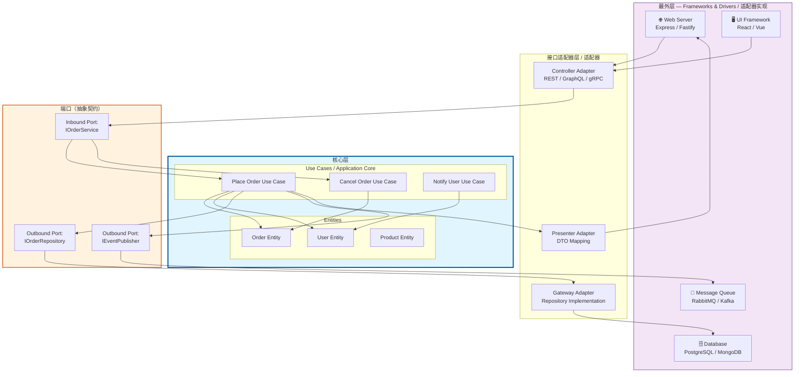
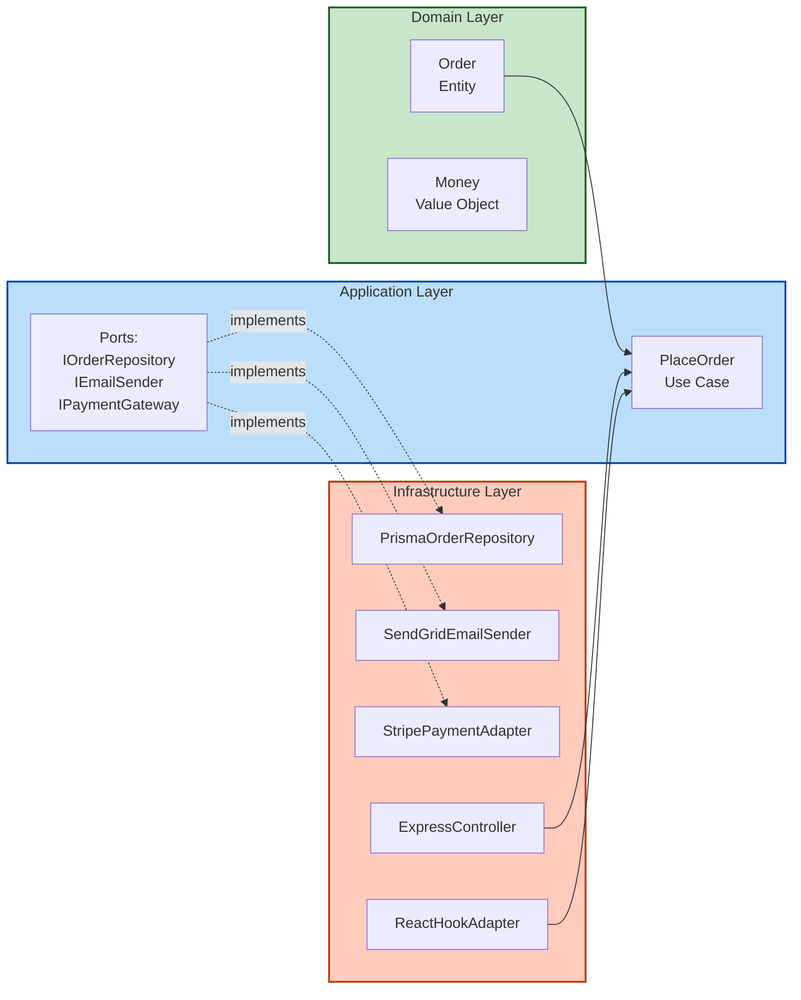

# 整洁架构与六边形架构

## 引言

软件架构的终极目标并非绘制精美的框图，而是**在项目的整个生命周期内，以最低的成本持续交付业务价值**。随着系统规模的增长，业务逻辑与技术实现之间的纠缠往往成为变更的最大阻力——修改一个数据库字段可能导致前端多处崩溃，更换一个 HTTP 框架可能迫使我们重写核心业务规则。这种脆弱性的根源在于**依赖方向的失控**：高层策略被低层细节所束缚。

Robert C. Martin 提出的 **Clean Architecture（整洁架构）** 与 Alistair Cockburn 提出的 **Hexagonal Architecture（六边形架构/端口与适配器架构）** 正是为了解决这个问题而诞生的。二者从不同角度描述了同一种深层结构：通过严格的边界划分与依赖规则，将业务核心从外部框架、UI、数据库等技术细节中解放出来。它们不是互相排斥的替代方案，而是同一组设计原则在**不同抽象粒度**上的表述——Clean Architecture 给出了分层的拓扑结构，而六边形架构则强调了系统与外部世界的交互契约。

在 JavaScript/TypeScript 生态中，由于语言的动态特性和前端框架的快速演进，开发者往往更容易陷入"框架驱动设计"的陷阱。本文将从理论严格表述出发，结合 Node.js、NestJS 以及前端 React 项目的工程实践，深入探讨这两种架构范式的形式化定义、等价性证明，以及它们在 TypeScript 类型系统中的具体实现路径。

---

## 理论严格表述

### Clean Architecture 的同心圆模型

Clean Architecture 将软件系统组织为一系列同心圆，每一层代表不同抽象级别的软件结构。从中心向外，分别是：

1. **Entities（实体层）**：封装企业级的业务规则。实体可以是带有方法的对象，也可以是一组数据结构与函数的集合。它们对任何外部变化都一无所知，不依赖于框架、UI 或数据库。
2. **Use Cases（用例层/交互器层）**：包含应用特定的业务规则。它编排 Entities 的流转，实现具体的应用场景（如"下单"、"转账"）。Use Cases 层只依赖于 Entities 层。
3. **Interface Adapters（接口适配器层）**：将用例层的数据格式转换为外部代理（如数据库、Web、UI）所需的格式，反之亦然。这一层包含了控制器（Controllers）、展示器（Presenters）、网关（Gateways）等组件。
4. **Frameworks & Drivers（框架与驱动层）**：最外层，包含具体的框架、工具、数据库、Web 服务器等。这一层是"细节"的所在地，所有变更都应尽量限制在这一层内。

```
┌─────────────────────────────────────────┐
│     Frameworks & Drivers (外层)         │
│   (Web, UI, DB, External Interfaces)    │
│  ┌───────────────────────────────────┐  │
│  │   Interface Adapters              │  │
│  │  (Controllers, Presenters,        │  │
│  │   Gateways)                       │  │
│  │  ┌─────────────────────────────┐  │  │
│  │  │   Use Cases                 │  │  │
│  │  │  (Application Business      │  │  │
│  │  │   Rules)                    │  │  │
│  │  │  ┌───────────────────────┐  │  │  │
│  │  │  │   Entities            │  │  │  │
│  │  │  │ (Enterprise Business   │  │  │  │
│  │  │  │  Rules)               │  │  │  │
│  │  │  └───────────────────────┘  │  │  │
│  │  └─────────────────────────────┘  │  │
│  └───────────────────────────────────┘  │
└─────────────────────────────────────────┘
```

### 依赖规则（Dependency Rule）

Clean Architecture 的核心法则——**依赖规则**——可以形式化表述为：

> **源代码中的依赖关系（import、use、reference）必须始终指向内部，指向更高抽象层次的层。内层不应知道外层的存在。**

这意味着：

- Entities 不依赖于任何其他层
- Use Cases 只依赖于 Entities
- Interface Adapters 依赖于 Use Cases 和 Entities
- Frameworks & Drivers 依赖于内层，但内层绝不依赖外层

这条规则确保了当外层发生变化（如从 Express 迁移到 Fastify，或从 PostgreSQL 切换到 MongoDB）时，内层的业务逻辑保持完整。依赖方向向内收敛，形成了对业务核心的**保护性屏障**。

### 六边形架构的端口与适配器

Alistair Cockburn 的六边形架构（Hexagonal Architecture）采用不同的隐喻来描述同一现象。系统被表示为一个**六边形**（任意边数的多边形，六边形只是为了便于绘图），位于中心的是**应用程序核心**（Application Core）。

六边形的每一条边代表一个**端口（Port）**：端口是应用程序核心与外部世界交互的抽象契约，定义了"核心期望什么"以及"核心提供什么"。端口是纯粹的概念接口，不包含任何技术实现。

连接到端口的是**适配器（Adapter）**：适配器是端口的具体实现，负责将外部技术细节（如 HTTP 请求、数据库查询、消息队列消息）转换为应用程序核心能够理解的格式，或将核心的输出转换为目标技术所需的格式。

端口分为两类：

- **入站端口（Inbound/Driving Ports）**：定义外部如何驱动应用程序（如"用户注册服务接口"）。
- **出站端口（Outbound/Driven Ports）**：定义应用程序如何驱动外部资源（如"用户仓储接口"）。

### 两种架构的等价性

从范畴论（Category Theory）的视角看，Clean Architecture 与六边形架构描述的是**同构的软件结构**：

| Clean Architecture | 六边形架构 | 对应关系 |
|---|---|---|
| Entities + Use Cases | Application Core | 业务核心，包含领域逻辑与应用编排 |
| Interface Adapters | Adapters | 转换层，处理数据格式与协议映射 |
| Frameworks & Drivers | External Actors | 具体的技术实现与外部系统 |
| 依赖规则向内 | 端口定义向内，适配器实现向外 | 依赖方向一致 |

形式化地说，如果我们将每一层/端口视为一个范畴（Category），层间依赖视为函子（Functor），那么两种架构都构成了**有向无环图（DAG）**，其拓扑排序保证了从外层到内层的可达性不存在反向路径。Clean Architecture 更强调**纵向的分层抽象**，而六边形架构更强调**横向的交互契约**。在实践中，二者往往混合使用：用 Clean Architecture 定义层，用六边形架构定义层与层之间的端口。

### 架构的测试友好性

依赖规则带来的一个直接好处是**可测试性的质变**：

- **Entities 层**：可在没有任何框架的情况下进行纯单元测试。由于不依赖外部库，测试启动时间极短，执行速度极快。
- **Use Cases 层**：可通过为出站端口提供**测试替身（Test Doubles，如 Mock、Stub）**进行隔离测试。例如，测试"下单用例"时，无需连接真实数据库，只需实现一个内存中的仓储适配器即可。
- **Interface Adapters 层**：可单独测试数据转换逻辑，验证 DTO（Data Transfer Object）与领域模型之间的映射是否正确。
- **Frameworks & Drivers 层**：通过集成测试验证适配器与真实外部系统的集成，但由于核心业务已在内部验证，集成测试的数量可以显著减少。

这种分层测试策略遵循了测试金字塔原则：大量快速的单元测试覆盖核心业务，少量慢速的集成测试验证边界，端到端测试仅用于关键路径的确认。

---

## 工程实践映射

### 在 TypeScript/Node.js 项目中实现 Clean Architecture

在 TypeScript 项目中实践 Clean Architecture，目录结构是第一眼可见的架构宣言。以下是一个典型的 Node.js 项目目录布局：

```
src/
├── domain/                    # Entities 层 —— 企业级业务规则
│   ├── entities/
│   │   ├── user.ts            # 用户实体：包含业务规则验证
│   │   └── order.ts           # 订单实体：计算总价、状态流转
│   ├── value-objects/
│   │   ├── email.ts           # Email 值对象：格式验证
│   │   └── money.ts           # Money 值对象：货币计算
│   └── errors/
│       └── domain-error.ts    # 领域错误基类
│
├── application/               # Use Cases 层 —— 应用特定业务规则
│   ├── ports/
│   │   ├── incoming/          # 入站端口（驱动端口）
│   │   │   ├── user-service.ts
│   │   │   └── order-service.ts
│   │   └── outgoing/          # 出站端口（被驱动端口）
│   │       ├── user-repository.ts
│   │       ├── order-repository.ts
│   │       └── event-publisher.ts
│   ├── use-cases/
│   │   ├── create-user.ts
│   │   ├── place-order.ts
│   │   └── cancel-order.ts
│   └── dto/
│       ├── create-user-request.ts
│       └── order-response.ts
│
├── infrastructure/            # Interface Adapters + Frameworks & Drivers
│   ├── web/
│   │   ├── controllers/
│   │   │   └── user-controller.ts    # HTTP 适配器
│   │   └── presenters/
│   │       └── order-presenter.ts    # 响应格式化
│   ├── persistence/
│   │   ├── prisma/
│   │   │   ├── prisma-user-repository.ts  # Prisma 适配器
│   │   │   └── prisma-order-repository.ts
│   │   └── in-memory/
│   │       └── in-memory-user-repository.ts  # 测试适配器
│   └── messaging/
│       └── redis-event-publisher.ts  # Redis 适配器
│
└── main.ts                    # 组合根（Composition Root）：依赖注入
```

**依赖方向 enforcement** 在 TypeScript 中可以通过多种机制实现：

1. **TypeScript 路径别名与 ESLint 规则**：配置 `eslint-plugin-import` 或 `eslint-plugin-boundaries`，禁止内层目录导入外层模块。例如，禁止 `domain/` 目录下的文件导入 `application/` 或 `infrastructure/` 的模块。

2. **模块边界检查**：使用 `dependency-cruiser` 等工具在 CI 流程中验证依赖图。以下是一个 `dependency-cruiser` 配置片段：

```javascript
module.exports = {
  forbidden: [
    {
      name: 'domain-should-not-import-outer-layers',
      comment: 'Domain layer must not depend on application or infrastructure',
      severity: 'error',
      from: { path: '^src/domain' },
      to: { path: '^src/(application|infrastructure)' }
    },
    {
      name: 'application-should-not-import-infrastructure',
      comment: 'Application layer must not depend on infrastructure',
      severity: 'error',
      from: { path: '^src/application' },
      to: { path: '^src/infrastructure' }
    }
  ]
};
```

1. **私有包与 Monorepo**：在大型项目中，将每层拆分为独立的 npm 包（`@myapp/domain`、`@myapp/application`、`@myapp/infrastructure`），通过 `package.json` 的 `dependencies` 显式声明层间依赖。TypeScript 项目引用（Project References）进一步加强了编译期的边界检查。

### NestJS 与 Clean Architecture 的结合

NestJS 是一个基于 TypeScript 的渐进式 Node.js 框架，其内置的模块化系统与依赖注入（DI）容器为 Clean Architecture 提供了良好的实现基础。然而，NestJS 的默认项目结构（按技术角色划分：`controllers/`、`services/`、`modules/`）与 Clean Architecture 的按层划分存在张力。要将二者结合，需要显式地重新组织代码：

```typescript
// src/domain/entities/user.entity.ts
export class User {
  private constructor(
    public readonly id: string,
    public readonly email: string,
    public readonly name: string
  ) {}

  static create(email: string, name: string): User {
    if (!email.includes('@')) {
      throw new Error('Invalid email format');
    }
    return new User(crypto.randomUUID(), email, name);
  }
}

// src/application/ports/outgoing/user-repository.port.ts
export interface IUserRepository {
  findById(id: string): Promise<User | null>;
  save(user: User): Promise<void>;
}

// src/application/use-cases/create-user.use-case.ts
export class CreateUserUseCase {
  constructor(private readonly userRepository: IUserRepository) {}

  async execute(dto: CreateUserDto): Promise<User> {
    const user = User.create(dto.email, dto.name);
    await this.userRepository.save(user);
    return user;
  }
}

// src/infrastructure/persistence/prisma-user.repository.ts
@Injectable()
export class PrismaUserRepository implements IUserRepository {
  constructor(private readonly prisma: PrismaService) {}

  async findById(id: string): Promise<User | null> {
    const record = await this.prisma.user.findUnique({ where: { id } });
    return record ? new User(record.id, record.email, record.name) : null;
  }

  async save(user: User): Promise<void> {
    await this.prisma.user.create({
      data: { id: user.id, email: user.email, name: user.name }
    });
  }
}

// src/infrastructure/web/user.controller.ts
@Controller('users')
export class UserController {
  constructor(private readonly createUserUseCase: CreateUserUseCase) {}

  @Post()
  async create(@Body() dto: CreateUserDto) {
    const user = await this.createUserUseCase.execute(dto);
    return { id: user.id, email: user.email, name: user.name };
  }
}
```

在 NestJS 中实践 Clean Architecture 的关键点：

- **不要直接将 `@Injectable()` 服务当作 Use Case**。NestJS 的 Service 往往同时包含业务逻辑与框架耦合，应将核心业务提取到 `application/use-cases/` 中。
- **利用 NestJS 的 Provider 系统实现端口注入**。通过 `providers` 数组将接口（端口）映射到具体实现（适配器）：

```typescript
// src/infrastructure/infrastructure.module.ts
@Module({
  providers: [
    { provide: 'USER_REPOSITORY', useClass: PrismaUserRepository },
    { provide: 'EVENT_PUBLISHER', useClass: RedisEventPublisher },
  ],
  exports: ['USER_REPOSITORY', 'EVENT_PUBLISHER'],
})
export class InfrastructureModule {}
```

- **保持模块的层间边界**。`DomainModule` 只导出实体和值对象，`ApplicationModule` 导入 `DomainModule` 并导出 Use Cases，`InfrastructureModule` 导入 `ApplicationModule` 并提供适配器实现。

### 前端项目中的 Clean Architecture 应用

在前端领域（尤其是 React 生态）应用 Clean Architecture 是一个充满挑战的议题。前端代码天然与 UI 框架紧密耦合，而 UI 本身就是一种"框架层"。然而，业务逻辑的复杂性增长使得"将所有状态放在组件中"的做法难以为继。

一种实践方式是将 Clean Architecture 垂直切片到前端：

```
src/
├── domain/              # 纯 TypeScript，不依赖 React
│   ├── entities/
│   │   └── cart.ts      # 购物车实体：计算总价、优惠券规则
│   └── value-objects/
│       └── price.ts
├── application/
│   ├── ports/
│   │   ├── incoming/
│   │   │   └── cart-service.ts
│   │   └── outgoing/
│   │       ├── cart-repository.ts
│   │       └── product-client.ts
│   └── use-cases/
│       ├── add-to-cart.ts
│       └── apply-coupon.ts
├── infrastructure/
│   ├── api/
│   │   └── http-product-client.ts   # Axios/Fetch 适配器
│   ├── storage/
│   │   └── local-storage-cart-repo.ts
│   └── react/
│       ├── hooks/
│       │   └── use-cart.ts          # 连接 Use Case 与 React 生命周期
│       └── components/
│           └── cart-component.tsx   # 纯展示组件
```

**React + Clean Architecture 的挑战**：

1. **状态管理的定位**：React 的 `useState`、`useReducer` 或外部状态管理库（Zustand、Redux Toolkit）应被放置在哪个层？理想情况下，状态存储适配器位于 `infrastructure/` 中，而状态访问接口（端口）位于 `application/ports/outgoing/` 中。然而，React 的钩子（Hooks）语义与端口的抽象之间存在阻抗失配——钩子具有组件生命周期耦合性。

2. **组件与用例的映射**：一个常见反模式是在组件中直接调用 Use Case：

```typescript
// 反模式：组件直接依赖 Use Case 的具体实现
function CartComponent() {
  const addToCart = new AddToCartUseCase(new HttpProductClient());
  // ...
}
```

正确做法是通过依赖注入或 Context/Provider 模式将端口注入组件：

```typescript
// 推荐：通过端口抽象注入
interface ICartService {
  addToCart(productId: string, quantity: number): Promise<void>;
}

function CartComponent({ cartService }: { cartService: ICartService }) {
  const handleAdd = async (productId: string) => {
    await cartService.addToCart(productId, 1);
  };
}
```

1. **前端"框架即一切"的现实**：在 Next.js 或 Remix 这类全栈框架中，服务端逻辑与客户端逻辑交织，`page.tsx` 或 `loader` 函数往往同时承担控制器、服务与仓储的角色。在这种环境下，Clean Architecture 的严格分层需要被**务实性地裁剪**——将核心业务规则（价格计算、权限校验、数据聚合逻辑）提取到 `domain/` 中，而框架特定的代码（`loader`、`action`、`getServerSideProps`）保留在框架层。

### 六边形架构在 API 层的设计

六边形架构的最大优势在于**同一业务核心可以通过不同的端口暴露给不同的消费者**。这在 API 层设计中体现得尤为明显。

假设我们有一个"订单管理"核心，需要同时支持 REST、GraphQL 和 gRPC 三种访问方式：

```typescript
// application/ports/incoming/order-service.port.ts
export interface IOrderService {
  createOrder(userId: string, items: OrderItem[]): Promise<Order>;
  getOrder(orderId: string): Promise<Order | null>;
  cancelOrder(orderId: string): Promise<void>;
}

// application/use-cases/order.use-case.ts
export class OrderUseCase implements IOrderService {
  constructor(
    private readonly orderRepository: IOrderRepository,
    private readonly inventoryClient: IInventoryClient,
    private readonly eventPublisher: IEventPublisher
  ) {}

  async createOrder(userId: string, items: OrderItem[]): Promise<Order> {
    // 业务逻辑：检查库存、计算价格、创建订单、发布事件
  }
  // ...
}
```

**REST 端口适配器**：

```typescript
// infrastructure/web/rest/order.controller.ts
@Controller('orders')
export class RestOrderAdapter {
  constructor(private readonly orderService: IOrderService) {}

  @Post()
  async create(@Body() dto: CreateOrderRestDto) {
    const order = await this.orderService.createOrder(dto.userId, dto.items);
    return RestOrderPresenter.toResponse(order);
  }

  @Get(':id')
  async getOne(@Param('id') id: string) {
    const order = await this.orderService.getOrder(id);
    if (!order) throw new NotFoundException();
    return RestOrderPresenter.toResponse(order);
  }
}
```

**GraphQL 端口适配器**：

```typescript
// infrastructure/web/graphql/order.resolver.ts
@Resolver()
export class GraphQLOrderAdapter {
  constructor(private readonly orderService: IOrderService) {}

  @Mutation(() => OrderGraphQLType)
  async createOrder(
    @Args('input') input: CreateOrderGraphQLInput
  ) {
    const order = await this.orderService.createOrder(
      input.userId,
      GraphQLMapper.toDomainItems(input.items)
    );
    return GraphQLMapper.toGraphQLType(order);
  }
}
```

**gRPC 端口适配器**：

```typescript
// infrastructure/web/grpc/order.grpc-server.ts
@GrpcService('OrderService')
export class GrpcOrderAdapter implements OrderServiceController {
  constructor(private readonly orderService: IOrderService) {}

  async createOrder(request: CreateOrderGrpcRequest): Promise<OrderGrpcResponse> {
    const order = await this.orderService.createOrder(
      request.userId,
      GrpcMapper.toDomainItems(request.items)
    );
    return GrpcMapper.toGrpcResponse(order);
  }
}
```

三种适配器共享同一个 `IOrderService` 端口，确保了**业务逻辑的单点真实（Single Source of Truth）**。当业务规则变更时，只需修改 Use Case 层，三种 API 风格自动保持一致。

### 依赖反转原则（DIP）在 TypeScript 中的实现

依赖反转原则（Dependency Inversion Principle）是 Clean Architecture 与六边形架构的**底层力学基础**。其核心表述为：

> a. 高层模块不应依赖低层模块，二者都应依赖抽象。
> b. 抽象不应依赖细节，细节应依赖抽象。

在 TypeScript 中，抽象主要通过**接口（Interface）**和**抽象类（Abstract Class）**实现。

**接口方式**（推荐，更灵活）：

```typescript
// 抽象（端口）
export interface IEmailSender {
  send(to: string, subject: string, body: string): Promise<void>;
}

// 高层模块（Use Case）
export class NotifyUserUseCase {
  constructor(private readonly emailSender: IEmailSender) {}

  async execute(userId: string, message: string): Promise<void> {
    const user = await this.userRepo.findById(userId);
    await this.emailSender.send(user.email, 'Notification', message);
  }
}

// 低层模块（适配器）
export class SendGridEmailSender implements IEmailSender {
  async send(to: string, subject: string, body: string): Promise<void> {
    // 调用 SendGrid API
  }
}

// 组合根
const emailSender: IEmailSender = new SendGridEmailSender();
const useCase = new NotifyUserUseCase(emailSender);
```

**抽象类方式**（适用于需要共享部分实现的场景）：

```typescript
export abstract class EmailSender {
  abstract send(to: string, subject: string, body: string): Promise<void>;

  protected validateEmail(email: string): boolean {
    return email.includes('@');
  }
}

export class SmtpEmailSender extends EmailSender {
  async send(to: string, subject: string, body: string): Promise<void> {
    if (!this.validateEmail(to)) throw new Error('Invalid email');
    // SMTP 发送逻辑
  }
}
```

在 TypeScript 中，由于编译后的 JavaScript 不具有原生接口的运行时表示，接口在编译期被擦除（erased）。这在某些依赖注入框架中需要额外配置（如使用 Symbol 或字符串令牌区分接口）。NestJS 通过 `@Inject('TOKEN')` 装饰器解决了这个问题：

```typescript
const EMAIL_SENDER = Symbol('EMAIL_SENDER');

@Injectable()
export class NotifyUserUseCase {
  constructor(@Inject(EMAIL_SENDER) private readonly emailSender: IEmailSender) {}
}
```

### 对比：Clean Architecture vs 传统分层架构

在传统的三层架构（Presentation → Business → Data Access）中，虽然也存在"层"的概念，但依赖方向往往是**自上而下**的：Business 层直接调用 Data Access 层的具体类，Presentation 层直接实例化 Business 层的具体服务。这导致了以下问题：

| 维度 | 传统分层架构 | Clean Architecture / 六边形架构 |
|---|---|---|
| **依赖方向** | 高层依赖低层具体实现 | 依赖抽象，方向向内 |
| **可测试性** | 需要 Mock 框架或数据库 | 纯内存测试即可覆盖核心业务 |
| **框架耦合** | 业务逻辑嵌入框架代码 | 框架是可替换的外层细节 |
| **变更成本** | 换数据库需修改业务层 | 仅替换适配器实现 |
| **前端适用性** | 难以映射到前端组件模型 | 可通过端口映射到 UI 层 |
| **团队分工** | 按技术角色分（前端/后端/DBA） | 按业务能力分（垂直切片） |

传统分层架构在小型项目或技术栈长期稳定的场景下仍然有效，但随着 TypeScript 全栈开发的普及（同一团队同时维护前后端），按业务能力划分的垂直切片与 Clean Architecture 的结合更能适应快速迭代的需求。

---

## Mermaid 图表

### 图表 1：Clean Architecture 与六边形架构的对应关系



### 图表 2：TypeScript 项目中的依赖方向与端口实现



---

## 理论要点总结

1. **Clean Architecture 的同心圆模型**将系统从内到外划分为 Entities、Use Cases、Interface Adapters 与 Frameworks & Drivers 四层，核心法则是**依赖只能向内**——内层对外层一无所知。

2. **六边形架构**通过**端口（Ports）**定义应用程序核心与外部世界的交互契约，通过**适配器（Adapters）**将技术细节与核心业务解耦。入站端口由外部驱动，出站端口驱动外部资源。

3. **两种架构形式等价**。Clean Architecture 更强调纵向的分层抽象，六边形架构更强调横向的交互契约；在实践中，通常以 Clean Architecture 组织目录结构，以六边形架构定义层间接口。

4. **TypeScript 中的依赖反转**通过接口/抽象类实现。结合 NestJS 的 DI 容器、ESLint 的边界检查规则、以及 `dependency-cruiser` 等工具，可以在编译期和运行时双重保障依赖方向的正确性。

5. **前端应用 Clean Architecture 面临特殊挑战**，因为 UI 框架本身就是"框架层"。务实的做法是将业务核心（计算、校验、状态流转）提取到 `domain/` 层，通过自定义 Hooks 或 Provider 模式将端口注入组件，避免在 JSX 中直接实例化 Use Case。

6. **六边形架构在 API 层的优势**体现为同一业务核心可同时暴露 REST、GraphQL、gRPC 等多种协议，每种协议仅需实现对应的适配器，业务逻辑保持单点真实。

---

## 参考资源

1. **Robert C. Martin**, *Clean Architecture: A Craftsman's Guide to Software Structure and Design*. Prentice Hall, 2017. —— 整洁架构的权威论述，详细阐述了同心圆模型、依赖规则以及跨框架的业务逻辑隔离策略。

2. **Alistair Cockburn**, "Hexagonal Architecture", *c2.com Wiki*, 2005. —— 六边形架构的原始定义，提出了端口与适配器的核心隐喻，强调"让应用程序平等地服务于用户、程序、自动化测试或批处理脚本"。

3. **Robert C. Martin**, *Agile Software Development: Principles, Patterns, and Practices*. Prentice Hall, 2002. —— 包含 SOLID 原则的完整阐述，其中依赖反转原则（DIP）是 Clean Architecture 与六边形架构的共同力学基础。

4. **Michael Feathers**, *Working Effectively with Legacy Code*. Prentice Hall, 2004. —— 尽管聚焦于遗留代码，但书中关于"接缝（Seams）"与"测试驱动的依赖解耦"技术，为在既有 TypeScript 项目中引入 Clean Architecture 提供了实操指南。

5. **Vladimir Khorikov**, "Unit Testing Principles, Practices, and Patterns", Manning Publications, 2020. —— 深入探讨了依赖反转与测试替身在单元测试中的系统应用，与 Clean Architecture 的测试策略高度契合。
