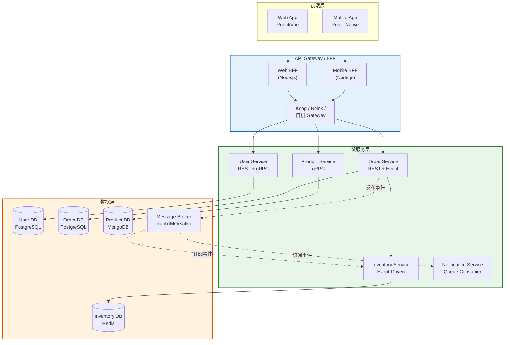
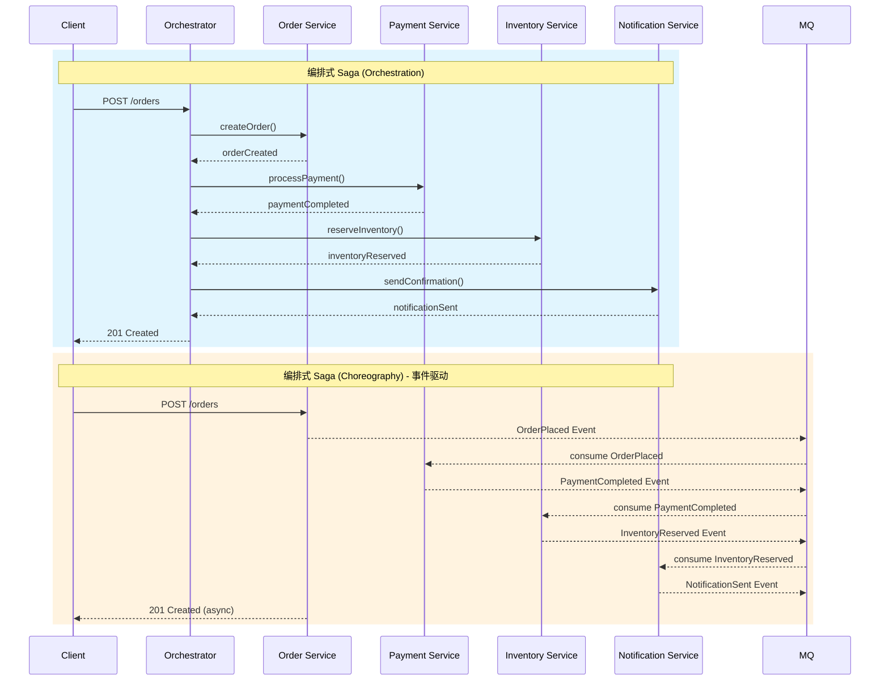
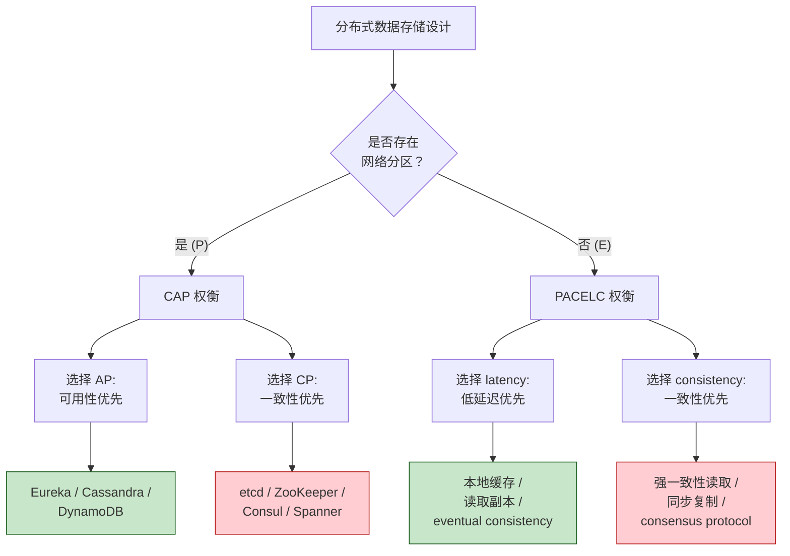

# 微服务设计：拆分与集成

## 引言

微服务架构（Microservices Architecture）在过去十年间从前沿概念演变为行业标准，又在某种程度上成为被滥用的"银弹"。
一个令人警醒的现象是：许多团队在没有充分理解分布式系统复杂性的情况下，将原本运行良好的单体应用拆分为数十个微服务，最终陷入了"分布式单体（Distributed Monolith）"的泥潭——服务之间通过网络紧密耦合，部署独立性丧失，调试复杂度呈指数级上升。

微服务的真正价值不在于"小"，而在于**独立演化的能力**。
每个服务应是一个围绕特定业务能力构建的自治单元，拥有自己的数据存储、部署管道和团队所有权。
然而，自治性并非免费午餐：它带来了网络延迟、数据一致性、服务发现、故障隔离等一系列分布式系统固有的挑战。

本文将从理论严格表述出发，深入剖析微服务的边界条件、拆分策略、分布式系统定理（CAP 与 PACELC），以及同步/异步通信模式的形式化定义。
随后，我们将映射到 TypeScript/Node.js 生态的工程实践：从 NestJS 微服务到前端 BFF 模式，从 tRPC 的类型安全到 Kubernetes 的容器编排，并系统梳理微服务设计中的反模式与规避策略。

---

## 理论严格表述

### 微服务的定义与边界条件

微服务的定义存在多种表述，但其核心特征可归纳为以下**边界条件**：

1. **松耦合（Loose Coupling）**：服务之间通过定义良好的接口通信，一个服务的内部实现变更不应影响其他服务。接口的稳定性是松耦合的关键度量。

2. **高内聚（High Cohesion）**：服务内部的逻辑围绕单一业务能力紧密组织。识别高内聚边界的方法是追问："如果这个业务能力的需求变化，有多少服务需要随之修改？"理想答案是"一个"。

3. **独立部署（Independent Deployability）**：每个服务可以独立于其他服务构建、测试和部署到生产环境。这意味着服务之间不存在编译时依赖，运行时依赖通过版本化的服务契约管理。

4. **拥有自己的数据（Database per Service）**：每个服务管理自己的数据存储，不允许其他服务直接访问其数据库。数据所有权是服务自治性的最后防线。

5. **团队所有权（Team Ownership）**：服务与团队之间存在长期稳定的对应关系（康威定律）。团队对服务的整个生命周期负责，从需求分析到运维监控。

这些边界条件共同构成了微服务的**形式化判定标准**。如果一个所谓的"服务"不满足独立部署或数据私有性，那么它本质上只是分布式部署的模块，而非真正的微服务。

### 服务拆分的理论

服务拆分是微服务设计中最具挑战性的决策。错误的拆分比不拆分代价更高。以下是三种经典的拆分理论：

**按业务能力拆分（Decomposition by Business Capability）**

业务能力（Business Capability）是企业为创造价值而做的事情，如"订单管理"、"库存管理"、"用户管理"。按业务能力拆分是最直观、最稳定的策略，因为业务能力相对于技术实现变化较慢。

形式化地，设企业业务能力集合为 `B = {b₁, b₂, ..., bₙ}`，每个业务能力 `bᵢ` 对应一个服务 `Sᵢ`。服务 `Sᵢ` 的接口 `I(Sᵢ)` 应完整覆盖 `bᵢ` 的所有外部可见操作。如果存在业务能力 `bⱼ` 的操作需要同时修改 `Sᵢ` 和 `Sₖ`，则拆分可能不够清晰。

**按领域子域拆分（Decomposition by Subdomain）**

Eric Evans 的领域驱动设计（DDD）提供了另一种拆分依据：限界上下文（Bounded Context）。子域（Subdomain）是问题域的自然划分，每个限界上下文内部拥有一致的领域模型和通用语言（Ubiquitous Language）。

按子域拆分的优势在于它处理了**概念多态性**——同一个现实概念在不同上下文中具有不同含义。例如：

- 在"销售上下文"中，"客户"是购买产品的实体
- 在"售后上下文"中，"客户"是需要提供支持的实体
- 在"物流上下文"中，"客户"是包裹的收件人

如果将这些含义混合在一个服务中，模型将变得臃肿且冲突频繁。按子域拆分允许每个服务拥有独立的"客户"模型，通过上下文映射（Context Map）定义它们之间的关系。

**按事务边界拆分（Decomposition by Transaction Boundary）**

事务一致性是微服务拆分的重要约束。如果一个业务操作需要跨多个服务保持强一致性（ACID），那么这些服务可能不应被拆分开。事务边界反映了业务的原子性需求。

然而，完全按事务边界拆分可能导致服务粒度过大。实践中，通常采用**最终一致性（Eventual Consistency）**来放宽事务要求：通过 Saga 模式或事件驱动架构，将跨服务的操作分解为一系列本地事务，通过补偿机制处理失败场景。

### 分布式系统的 CAP 定理与 PACELC 定理

**CAP 定理**（Brewer, 2000）是分布式系统理论的基石。它指出，对于一个分布式数据存储，在出现网络分区（Partition）时，不可能同时满足一致性（Consistency）和可用性（Availability），只能二者择其一：

- **一致性（C）**：每次读取都能获得最新的写入结果，或收到错误。
- **可用性（A）**：每个请求都能在有限时间内收到非错误的响应，但不保证是最新数据。
- **分区容错性（P）**：系统在出现网络分区时仍能继续运行。

CAP 定理的形式化证明基于一个简单的场景：两个节点之间的网络中断，客户端向其中一个节点写入数据，同时从另一个节点读取。如果系统选择一致性，则读取操作必须等待或失败（牺牲可用性）；如果系统选择可用性，则读取可能返回旧数据（牺牲一致性）。

**PACELC 定理**（Abadi, 2010）扩展了 CAP，指出即使没有网络分区，也存在延迟（Latency）与一致性（Consistency）的权衡：

> 如果存在分区（P），必须在可用性（A）和一致性（C）之间选择；否则（E，即 Else），必须在延迟（L）和一致性（C）之间选择。

在微服务设计中，PACELC 更具指导意义：

- **AP 系统**（如 Cassandra、Eureka）：优先可用性，适合配置信息、用户会话等对一致性要求不高的场景。
- **CP 系统**（如 etcd、ZooKeeper、Consul）：优先一致性，适合服务发现、分布式锁、配置中心等场景。
- **延迟-一致性权衡**：读取本地缓存（低延迟、弱一致性）vs. 读取远程主库（高延迟、强一致性）。

### 微服务间通信模式

微服务之间的通信模式可分为三大类：

**同步 RPC（Remote Procedure Call）**

客户端发送请求并阻塞等待响应。HTTP/REST、gRPC 都属于此类。同步通信的优势是简单直观、调试方便；劣势是引入运行时耦合——被调用服务的延迟或故障会直接传递给调用方，形成级联故障（Cascading Failure）的风险。

形式化地，同步 RPC 构成了调用图中的**有向边**，如果图中存在环，则可能形成分布式死锁。

**异步消息（Asynchronous Messaging）**

客户端将消息发送到消息代理（Message Broker），不等待处理结果。消息代理负责将消息路由到一个或多个消费者。RabbitMQ、AWS SQS、Azure Service Bus 属于此类。

异步通信解耦了生产者和消费者的时间维度，但引入了消息丢失、重复消费、顺序保证等新问题。消息代理本身成为系统的关键依赖（Single Point of Failure 风险）。

**事件驱动（Event-Driven）**

事件驱动是异步消息的一种特殊形式，强调**状态变更的通知**而非命令的传递。服务在业务状态发生变化时发布事件（如 `OrderPlaced`、`PaymentCompleted`），其他感兴趣的服务订阅并响应这些事件。

事件驱动的核心优势在于进一步降低了耦合度：发布者不知道谁在处理事件，也不知道处理结果。这种"观察者模式"的分布式版本支持更灵活的系统演化——新服务可以订阅已有事件而无需修改发布者。

### Saga 模式与分布式事务

在微服务架构中，跨服务的业务操作无法使用传统的两阶段提交（2PC）来保证 ACID，因为 2PC 要求所有参与者在提交阶段保持资源锁定，这会严重损害服务的自治性和可用性。

**Saga 模式**提供了一种替代方案：将长事务分解为一系列本地事务，每个本地事务完成后发布事件触发下一个本地事务。如果某个步骤失败，执行**补偿事务（Compensating Transaction）**来回滚已完成步骤的效果。

Saga 有两种编排方式：

- **编排式 Saga（Choreography）**：每个服务完成本地事务后发布事件，其他服务监听事件并自主决定下一步操作。没有中央协调器，通信通过事件总线进行。优势是松耦合、易于扩展；劣势是全局流程难以追踪，事件链的语义隐式分布在各服务中。

- **编排式 Saga（Orchestration）**：存在一个中央协调器（Saga Orchestrator），负责按顺序调用各服务的本地事务，并在失败时触发补偿。优势是流程显式定义、易于监控和调试；劣势是协调器成为潜在的单点耦合。

### 服务发现与注册的理论

在动态环境中，服务实例的 IP 地址和端口不断变化（自动扩缩容、故障恢复、滚动更新）。服务发现解决的是"消费者如何定位提供者"的问题。

服务发现有两种模式：

- **客户端发现（Client-Side Discovery）**：客户端直接查询服务注册表（如 Eureka、Consul），获取可用实例列表并执行负载均衡。优势是无中间代理、延迟低；劣势是客户端需要集成发现逻辑，语言栈受限。

- **服务端发现（Server-Side Discovery）**：客户端请求发送到一个固定的路由器（如 API Gateway、Load Balancer），由路由器查询注册表并转发请求。优势是客户端无感知、支持异构语言；劣势是增加网络跳数，路由器成为瓶颈。

服务注册分为：

- **自注册（Self-Registration）**：服务启动时主动向注册表注册，关闭时注销。简单但要求服务集成注册逻辑。
- **第三方注册（Third-Party Registration）**：由外部进程（如 Kubernetes 的 Controller、Registrator）监控服务状态并代为注册。服务本身无需感知注册表的存在。

---

## 工程实践映射

### Node.js 微服务的技术栈

在 TypeScript/Node.js 生态中，构建微服务的主流技术栈包括：

**NestJS 微服务**

NestJS 原生支持微服务架构，提供多种传输层适配器：

```typescript
// 微服务提供者（TCP 传输层）
@Controller()
export class MathController {
  @MessagePattern({ cmd: 'sum' })
  async accumulate(data: number[]): Promise<number> {
    return data.reduce((a, b) => a + b, 0);
  }
}

// main.ts —— 微服务入口
const app = await NestFactory.createMicroservice<MicroserviceOptions>(
  AppModule,
  {
    transport: Transport.TCP,
    options: { host: '0.0.0.0', port: 3001 },
  },
);
await app.listen();
```

NestJS 还支持 Redis、RabbitMQ、Kafka、MQTT、gRPC 等传输层，允许不同服务使用不同的通信机制，同时保持一致的编程模型。

**Express/Fastify + 服务网格**

对于偏好轻量级框架的团队，可以使用 Express 或 Fastify 构建单个服务，将服务发现、负载均衡、熔断、可观测性等横切关注点交给**服务网格（Service Mesh）**处理。Istio、Linkerd、Consul Connect 是主流的服务网格方案，它们通过 Sidecar 代理（如 Envoy）拦截服务间的所有网络通信，在不修改应用代码的情况下提供 mTLS、流量管理、遥测等功能。

```yaml
# Istio VirtualService 示例：金丝雀发布
apiVersion: networking.istio.io/v1beta1
kind: VirtualService
metadata:
  name: order-service
spec:
  hosts:
    - order-service
  http:
    - route:
        - destination:
            host: order-service
            subset: v1
          weight: 90
        - destination:
            host: order-service
            subset: v2
          weight: 10
```

### 前端 BFF（Backend for Frontend）模式

BFF 模式由 Sam Newman 提出，旨在解决前端直接调用多个后端微服务带来的问题：过度获取数据、多次网络往返、客户端逻辑复杂化。

BFF 是一个面向特定前端平台（如 Web、iOS、Android）的后端服务层，负责聚合多个下游微服务的调用，为前端提供定制化的 API：

```
┌─────────┐     ┌─────────────┐     ┌─────────────┐
│  Web    │────▶│  Web BFF    │────▶│  User Svc   │
│  App    │     │  (Node.js)  │     │  (REST)     │
└─────────┘     │             │────▶│  Order Svc  │
                │             │     │  (gRPC)     │
┌─────────┐     │             │────▶│  Product    │
│ Mobile  │────▶│ Mobile BFF  │     │  Svc (REST) │
│  App    │     │  (Node.js)  │     └─────────────┘
└─────────┘     └─────────────┘
```

在 TypeScript 全栈项目中，BFF 层可以与前端共享类型定义，实现端到端的类型安全：

```typescript
// shared/types/order.ts —— 前后端共享
export interface OrderSummary {
  id: string;
  total: Money;
  itemCount: number;
  status: OrderStatus;
}

// bff/src/aggregators/order-aggregator.ts
export class OrderAggregator {
  constructor(
    private readonly orderClient: OrderServiceClient,
    private readonly productClient: ProductServiceClient
  ) {}

  async getOrderSummary(orderId: string): Promise<OrderSummary> {
    const [order, products] = await Promise.all([
      this.orderClient.getOrder(orderId),
      this.productClient.getProductsByOrder(orderId),
    ]);
    return {
      id: order.id,
      total: calculateTotal(order, products),
      itemCount: products.length,
      status: order.status,
    };
  }
}
```

### API Gateway 的设计

API Gateway 是微服务架构的统一入口，负责请求路由、认证授权、限流熔断、协议转换、请求/响应转换等功能。

**开源方案**：

- **Kong**：基于 OpenResty（Nginx + Lua）的高性能网关，支持插件生态（认证、日志、转换、监控）。
- **Traefik**：云原生网关，原生支持 Kubernetes Ingress、服务发现、自动证书管理。
- **Envoy**：C++ 编写的高性能代理，常用于服务网格的数据平面，也可作为独立网关。

**自研网关**：在 TypeScript 生态中，可以使用 NestJS 或 Fastify 构建轻量级网关：

```typescript
// gateway/src/app.module.ts
@Module({
  imports: [
    ClientsModule.register([
      { name: 'USER_SERVICE', transport: Transport.TCP, options: { host: 'user-svc', port: 3001 } },
      { name: 'ORDER_SERVICE', transport: Transport.TCP, options: { host: 'order-svc', port: 3002 } },
    ]),
  ],
  controllers: [GatewayController],
})
export class AppModule {}

// gateway/src/gateway.controller.ts
@Controller()
export class GatewayController {
  constructor(
    @Inject('USER_SERVICE') private userClient: ClientProxy,
    @Inject('ORDER_SERVICE') private orderClient: ClientProxy,
  ) {}

  @Get('users/:id/orders')
  async getUserOrders(@Param('id') userId: string) {
    const orders = await firstValueFrom(
      this.orderClient.send({ cmd: 'getUserOrders' }, userId)
    );
    return orders;
  }
}
```

自研网关的优势是深度定制化（如与内部认证系统、审计日志集成），劣势是需要自行维护高可用、性能优化和安全补丁。

### 微前端与微服务的对应关系

微前端（Micro-Frontends）是将前端应用拆分为独立部署的单元，与微服务在后端形成镜像结构。二者的对应关系如下：

| 维度 | 微服务 | 微前端 |
|---|---|---|
| **拆分依据** | 业务能力/子域 | 页面/功能域 |
| **独立部署** | 服务容器独立发布 | 前端 bundle 独立发布 |
| **团队所有权** | 垂直团队（全栈） | 前端自治团队 |
| **通信机制** | HTTP/gRPC/消息队列 | 事件总线（CustomEvent）、Shared State |
| **集成方式** | API Gateway | 容器应用（Shell App）、Module Federation |

在 TypeScript 生态中，Webpack 5 的 **Module Federation** 是实现微前端的主流技术：

```typescript
// shell-app/webpack.config.js
const { ModuleFederationPlugin } = require('webpack').container;

module.exports = {
  plugins: [
    new ModuleFederationPlugin({
      remotes: {
        orderMf: 'order_mf@https://order-mf.example.com/remoteEntry.js',
        productMf: 'product_mf@https://product-mf.example.com/remoteEntry.js',
      },
      shared: ['react', 'react-dom', 'typescript'],
    }),
  ],
};
```

然而，微前端与微服务一样存在反模式。**微前端不应成为逃避代码共享的借口**——如果一个"微前端"需要频繁与其他前端共享状态和同步路由，那么它可能只是一个过度拆分的组件。

### 服务间通信的 TypeScript 类型安全

微服务架构中最隐蔽的风险之一是**接口契约的漂移**。当服务 A 修改了 API 契约而服务 B 的客户端代码未同步更新时，运行时错误在所难免。TypeScript 生态提供了多种保障跨服务类型安全的方案：

**tRPC**

tRPC 允许在 Node.js 服务中定义路由器，并自动生成类型安全的客户端。它要求调用方和被调用方都是 TypeScript 项目：

```typescript
// server/src/routers/order.ts
export const orderRouter = router({
  getById: publicProcedure
    .input(z.object({ id: z.string().uuid() }))
    .query(async ({ input }) => {
      return await orderService.findById(input.id);
    }),
  create: publicProcedure
    .input(z.object({ userId: z.string(), items: z.array(orderItemSchema) }))
    .mutation(async ({ input }) => {
      return await orderService.create(input.userId, input.items);
    }),
});

export type OrderRouter = typeof orderRouter;

// client/src/trpc-client.ts
import { createTRPCProxyClient, httpBatchLink } from '@trpc/client';
import type { OrderRouter } from '@myapp/server';

const client = createTRPCProxyClient<OrderRouter>({
  links: [httpBatchLink({ url: 'http://order-svc:3000/trpc' })],
});

// 完全类型安全：TypeScript 会在编译期检查参数和返回值
const order = await client.getById.query({ id: 'uuid-here' });
```

**OpenAPI 生成**

对于异构语言环境，可以使用 OpenAPI（Swagger）规范定义接口，并通过代码生成工具生成 TypeScript 客户端：

```bash
# 使用 openapi-generator 生成 TypeScript Axios 客户端
openapi-generator-cli generate \
  -i https://order-svc/swagger.json \
  -g typescript-axios \
  -o src/clients/order-api
```

NestJS 内置的 `@nestjs/swagger` 模块可以自动从装饰器和 DTO 生成 OpenAPI 规范，确保文档、服务端实现和客户端代码三者同步。

### 容器化与编排

容器化是微服务独立部署的技术基础。**Docker** 将服务及其依赖打包为可移植的镜像，消除了"在我机器上可以运行"的问题。

```dockerfile
# Dockerfile —— Node.js 微服务
FROM node:20-alpine AS builder
WORKDIR /app
COPY package*.json tsconfig.json ./
RUN npm ci
COPY src ./src
RUN npm run build

FROM node:20-alpine AS production
WORKDIR /app
COPY --from=builder /app/dist ./dist
COPY --from=builder /app/node_modules ./node_modules
COPY package.json ./
EXPOSE 3000
CMD ["node", "dist/main.js"]
```

**Kubernetes** 是当前最主流的容器编排平台，为微服务提供了：

- **服务发现与负载均衡**：通过 Service 资源为 Pod 提供稳定的 DNS 名称和内部负载均衡。
- **自动扩缩容**：HorizontalPodAutoscaler 根据 CPU、内存或自定义指标自动调整 Pod 副本数。
- **自愈能力**：当 Pod 失败时，Deployment 控制器自动重新调度。
- **配置与密钥管理**：ConfigMap 和 Secret 将配置与镜像分离。
- **滚动更新与回滚**：零停机部署，支持一键回滚到上一个版本。

```yaml
# k8s-deployment.yaml
apiVersion: apps/v1
kind: Deployment
metadata:
  name: order-service
spec:
  replicas: 3
  selector:
    matchLabels:
      app: order-service
  template:
    metadata:
      labels:
        app: order-service
    spec:
      containers:
        - name: order-service
          image: myregistry/order-service:v1.2.3
          ports:
            - containerPort: 3000
          envFrom:
            - configMapRef:
                name: order-service-config
---
apiVersion: v1
kind: Service
metadata:
  name: order-service
spec:
  selector:
    app: order-service
  ports:
    - port: 80
      targetPort: 3000
```

### 微服务的反模式

识别反模式与遵循最佳实践同等重要。以下是微服务设计中最常见的陷阱：

**分布式单体（Distributed Monolith）**

表面上系统由多个服务组成，但服务之间高度耦合，无法独立部署。典型症状：

- 所有服务必须同时部署，否则系统无法正常工作
- 服务间存在数据库共享（绕过服务接口直接访问其他服务的数据库）
- 服务间存在编译时依赖（共享库的版本锁定所有服务）

**过度拆分（Over-Engineering）**

将一个本来内聚的业务能力拆分为多个服务，导致服务间通信开销超过业务逻辑本身。判断标准：如果一个服务的 API 只有一个或两个端点，且 CRUD 操作占 90% 以上，它可能只是一个远程数据表。

**共享数据库反模式**

多个服务共享同一个数据库 schema，通过数据库触发器或外键实现跨服务协作。这破坏了服务自治性和数据封装，使得数据库 schema 的变更成为全系统范围的协调任务。

**链式调用（Distributed Death Star）**

服务 A 调用服务 B，服务 B 调用服务 C，服务 C 调用服务 D... 形成深度调用链。任何一个节点的延迟或故障都会放大到整个链路。解决方法是引入异步事件或 BFF 层进行调用扁平化。

**缺乏可观测性（Flying Blind）**

微服务将故障定位的复杂度从代码级别提升到了网络级别。如果没有分布式追踪（Distributed Tracing）、集中式日志（Centralized Logging）和指标监控（Metrics），排查跨服务问题将是一场噩梦。OpenTelemetry、Jaeger、Prometheus + Grafana 是 TypeScript/Node.js 生态中的标准可观测性栈。

---

## Mermaid 图表

### 图表 1：微服务通信模式与类型安全栈



### 图表 2：Saga 模式 —— 编排式与编排式对比



### 图表 3：CAP 定理与 PACELC 定理的决策空间



---

## 理论要点总结

1. **微服务的边界条件**包括松耦合、高内聚、独立部署、数据私有性和团队所有权。不满足这些条件的服务只是分布式部署的模块。

2. **服务拆分**应按业务能力（最稳定）、领域子域（处理概念多态性）或事务边界（保证操作原子性）进行。错误的拆分比不拆分代价更高。

3. **CAP 定理**指出网络分区下一致性与可用性不可兼得；**PACELC 定理**进一步指出即使没有分区，延迟与一致性也存在权衡。微服务设计需要根据业务场景显式做出这些选择。

4. **同步 RPC** 简单直观但引入运行时耦合；**异步消息** 解耦时间维度但增加复杂性；**事件驱动** 最大程度降低耦合，支持灵活的系统演化。

5. **Saga 模式** 将分布式事务分解为本地事务序列，通过补偿回滚。编排式 Saga 提供显式流程控制，编排式 Saga 提供最大松耦合，二者各有适用场景。

6. **TypeScript 类型安全** 可通过 tRPC（同构 TS 项目）或 OpenAPI 代码生成（异构环境）实现，确保跨服务接口契约的编译期验证。

7. **微服务反模式** —— 分布式单体、过度拆分、共享数据库、链式调用、缺乏可观测性 —— 是实践中最大的风险源，需要在架构评审中持续警惕。

---

## 参考资源

1. **Sam Newman**, *Building Microservices: Designing Fine-Grained Systems*, 2nd Edition, O'Reilly Media, 2021. —— 微服务领域的权威指南，全面覆盖了服务拆分、集成模式、部署、测试和组织结构调整。

2. **Martin Fowler**, "Microservices", *martinfowler.com*, 2014. —— 微服务架构的奠基性文章，提出了"围绕业务能力组织服务"、"智能端点与哑管道"等核心原则。

3. **Chris Richardson**, *Microservices Patterns: With examples in Java*, Manning Publications, 2018. —— 系统整理了微服务设计模式，包括 Saga、API Gateway、CQRS、Event Sourcing 等，尽管示例为 Java，但模式语言完全适用于 TypeScript/Node.js 生态。

4. **Eric Brewer**, "Towards Robust Distributed Systems", *Proceedings of the 19th Annual ACM Symposium on Principles of Distributed Computing (PODC)*, 2000. —— CAP 定理的原始提出，是理解分布式系统权衡的理论起点。

5. **Daniel J. Abadi**, "Consistency Tradeoffs in Modern Distributed Database System Design", *IEEE Computer*, 2012. —— PACELC 定理的提出，扩展了 CAP 框架，对现代数据库系统的分类与选型具有指导意义。
