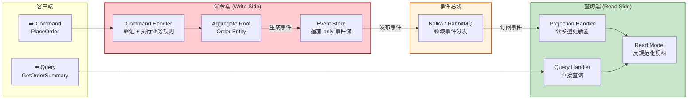
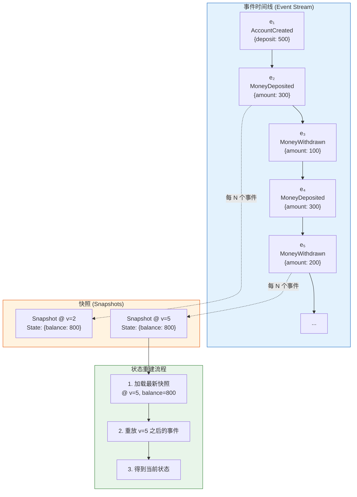
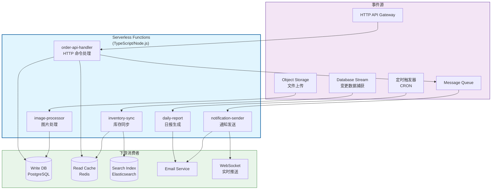

# 事件驱动架构：EDA 与 CQRS

## 引言

在软件系统中，**时间**往往是最被忽视的维度。传统的请求-响应模型将系统视为状态的静态快照，忽略了状态是如何随时间演化的。然而，业务的本质恰恰是时序性的：订单被创建、支付被确认、库存被扣减——每一个动作都是一个发生在特定时间点的**事件（Event）**，而系统的当前状态不过是这些事件累积投影的结果。

事件驱动架构（Event-Driven Architecture, EDA）将事件提升为一等公民，通过事件的发布、传播与消费来组织系统行为。与事件驱动紧密相关的两个模式——**CQRS（Command Query Responsibility Segregation）**和**Event Sourcing（事件溯源）**——分别从读写分离和状态持久化的角度，提供了处理复杂领域模型的强大工具。

然而，EDA 并非没有代价。事件的异步性、最终一致性、顺序保证、重复消费等问题，为系统设计和调试带来了显著挑战。在 TypeScript/JavaScript 生态中，从 Node.js 的 `EventEmitter` 到分布式消息队列（Kafka、RabbitMQ），从 Redux 的 action-reducer 到 Serverless 的事件触发器，事件驱动已经渗透到栈的每一层。本文将从形式化定义出发，结合全栈 TypeScript 实践，系统阐述 EDA、CQRS 与 Event Sourcing 的理论基础与工程映射。

---

## 理论严格表述

### 事件驱动架构的形式化定义

事件驱动架构可以用一个三元组 `EDA = (P, B, C)` 形式化描述：

- **P（Producers）**：事件生产者，是系统中产生领域事件的源。生产者对事件如何被消费一无所知，体现了松耦合的本质。
- **B（Event Bus）**：事件总线，负责事件的传输、路由与持久化。事件总线可以是内存中的发布-订阅通道，也可以是分布式的消息代理。
- **C（Consumers）**：事件消费者，订阅特定类型的事件并执行响应逻辑。消费者之间通常相互独立，可以并行处理事件。

事件的定义必须满足以下性质：

1. **不可变性（Immutability）**：事件一旦发生，其内容不可更改。如果对某个事件的描述需要修正，应发布一个后续事件（如 `OrderCorrected`）而非修改原事件。
2. **时序性（Temporality）**：每个事件携带时间戳，事件之间存在偏序关系（Partial Order）。在分布式系统中，绝对的全局时序往往不可行，通常采用逻辑时钟（Lamport Timestamps、Vector Clocks）或事件溯源中的序列号来追踪因果关系。
3. **自描述性（Self-Describing）**：事件应包含足够的信息以便消费者独立理解其语义，而不必查询外部系统。例如，`OrderPlaced` 事件应包含订单的完整信息，而不仅仅是订单 ID。

### CQRS：命令与查询职责分离

CQRS 的核心洞察源于一个简单的事实：**读取数据的方式与写入数据的方式往往截然不同**。

在传统的 CRUD 系统中，同一个数据模型（如关系数据库表）既服务于命令操作（创建、更新、删除），也服务于查询操作（读取、搜索、聚合）。随着查询复杂度的增长，为了支持高效的读取，我们不得不在写入模型上添加索引、视图、反规范化字段，这反过来又增加了写入的复杂性和一致性维护成本。

CQRS 将这一矛盾显式化，提出**将命令模型（Write Model）与查询模型（Read Model）彻底分离**：

- **命令端（Command Side）**：处理改变系统状态的意图。命令是意图的表达（如 `PlaceOrder`），而非直接的数据修改。命令端负责验证、执行业务规则、更新写模型，并发布事件通知查询端。
- **查询端（Query Side）**：处理数据的读取请求。查询模型针对读取效率进行优化，可以是关系数据库的物化视图、文档数据库的集合、搜索引擎的索引，甚至是内存中的缓存结构。查询端不直接修改数据，仅通过订阅命令端发布的事件来同步状态。

```
┌─────────────────────────────────────────────────────────────┐
│                      客户端请求                              │
└──────────────┬──────────────────────────────┬───────────────┘
               │                              │
        Command Side                   Query Side
               │                              │
    ┌──────────▼──────────┐      ┌───────────▼────────────┐
    │   Command Handler   │      │   Query Handler        │
    │  (验证 + 业务规则)   │      │  (直接读取优化模型)     │
    └──────────┬──────────┘      └───────────┬────────────┘
               │                              │
    ┌──────────▼──────────┐      ┌───────────▼────────────┐
    │   Write Model       │      │   Read Model           │
    │  (规范化、事务性)    │      │  (反规范化、索引优化)   │
    │  e.g. PostgreSQL    │      │  e.g. Elasticsearch,   │
    │       (3NF)         │      │        MongoDB         │
    └──────────┬──────────┘      └────────────────────────┘
               │
    ┌──────────▼──────────┐
    │   Event Publisher   │
    │  (Domain Events)    │
    └──────────┬──────────┘
               │ 发布事件
    ┌──────────▼──────────┐
    │   Event Bus         │
    └──────────┬──────────┘
               │ 订阅事件
    ┌──────────▼──────────┐
    │   Projection        │
    │  (读模型更新器)      │
    └─────────────────────┘
```

CQRS 并不意味着每个系统都需要两套数据库。它的价值在于**解除了读写之间的设计耦合**：命令端可以专注于领域模型的完整性和一致性，查询端可以针对具体的使用场景进行激进的性能优化。

### Event Sourcing：事件溯源的时序模型

Event Sourcing 是 CQRS 的亲密伙伴，它将 CQRS 中的事件持久化提升为系统的**唯一真相来源（Source of Truth）**。

在传统系统中，我们存储的是状态的当前快照。例如，一个银行账户的余额存储为 `balance: 1000`。而在 Event Sourcing 中，我们存储的是导致当前状态的所有历史事件：

```
[AccountCreated { initialDeposit: 500 }]
[MoneyDeposited { amount: 300 }]
[MoneyWithdrawn { amount: 100 }]
[MoneyDeposited { amount: 300 }]
```

当前余额 `1000` 不是存储的，而是通过**重放（Replay）**所有事件计算得出的。这种时序模型具有以下性质：

- **完整审计性**：系统的每一个状态变更都有完整的历史记录，天然满足合规审计要求。
- **时序查询能力**：可以重建系统在过去任意时间点的状态（"上个月末账户余额是多少？"）。
- **补偿与修正**：如果发现某个业务规则被错误执行，可以通过插入补偿事件来修正，而不必修改历史。

Event Sourcing 的形式化模型是一个**事件流（Event Stream）**，它是一个严格递增的、不可变的、追加-only 的序列：

```
Stream: Event[]
∀ i, j ∈ ℕ, i < j ⇒ timestamp(eᵢ) ≤ timestamp(eⱼ)
State(t) = foldl(apply, initialState, events[0..t])
```

其中 `apply` 是一个纯函数，给定当前状态和事件，返回新状态。由于 `apply` 是纯函数，事件重放是确定性的、无副作用的，这为测试和调试提供了巨大便利。

为了优化重放性能，Event Sourcing 系统通常引入**快照（Snapshot）**机制：每隔 N 个事件存储一次状态的完整快照，重放时从最近的快照开始，仅应用后续事件。

### 事件的一致性模型

在分布式事件系统中，事件消费者面临三种一致性保证：

**At-Most-Once（最多一次）**

事件可能被成功处理一次，也可能丢失。实现简单（fire-and-forget），但可靠性最低。适用于对丢失不敏感的指标上报、日志等场景。

**At-Least-Once（至少一次）**

事件保证被成功处理，但可能由于网络超时或消费者崩溃导致重复处理。这是大多数消息队列（RabbitMQ、Kafka、SQS）的默认语义。消费者需要实现**幂等性（Idempotency）**：即使同一事件被处理多次，系统状态也只变更一次。

幂等性可以通过唯一事件 ID 的去重表、乐观锁版本号、或业务键的天然唯一性来实现：

```typescript
// 幂等消费示例
async function handleOrderPlaced(event: OrderPlacedEvent): Promise<void> {
  const existing = await processedEventRepo.findById(event.id);
  if (existing) {
    return; // 已处理，跳过
  }

  await db.transaction(async (trx) => {
    await orderRepo.create(event.order, trx);
    await processedEventRepo.markAsProcessed(event.id, trx);
  });
}
```

**Exactly-Once（精确一次）**

事件被保证只处理一次，既不丢失也不重复。这是最难实现的语义，因为网络和节点故障使得"确认收到"与"实际处理"之间存在不确定性窗口。

Kafka 通过幂等生产者（Idempotent Producer）和事务 API 提供了"精确一次"的近似实现：将事件生产和状态更新包裹在同一个事务中。然而，从端到端的角度看，如果消费者的处理逻辑包含外部副作用（如发送邮件），"精确一次"在理论上是不可能的——这是一个分布式系统的基本限制（与 Two Generals Problem 等价）。

### Saga 模式：编排式 vs 编排式

Saga 模式在事件驱动架构中体现得尤为明显。当 Saga 与 EDA 结合时，每个 Saga 步骤的完成触发一个领域事件，该事件驱动下一个步骤的执行或前一个步骤的补偿。

**编排式 Saga（Choreography-Based Saga in EDA）**：

- `OrderService` 发布 `OrderPlaced` 事件
- `PaymentService` 订阅并处理，成功后发布 `PaymentProcessed`
- `InventoryService` 订阅 `PaymentProcessed`，扣减库存后发布 `InventoryReserved`
- `ShippingService` 订阅 `InventoryReserved`，创建物流单
- 任何步骤失败时，发布对应的补偿事件（如 `PaymentFailed`），触发上游补偿

**编排式 Saga（Orchestration-Based Saga in EDA）**：

- `SagaOrchestrator` 是一个状态机，监听所有 Saga 相关事件
- 当 `OrderPlaced` 到达时，Orchestrator 命令 `PaymentService` 执行支付
- 收到 `PaymentProcessed` 后，Orchestrator 命令 `InventoryService` 扣减库存
- Orchestrator 维护 Saga 的全局状态，负责在失败时按正确顺序触发补偿

在事件驱动语境下，编排式 Saga 更加自然，因为 Saga 协调器本身也是一个事件消费者和命令发布者。

---

## 工程实践映射

### Node.js 中的事件驱动实现

Node.js 的内核基于事件循环（Event Loop），事件驱动是其 DNA。在应用层，我们有多种实现事件驱动架构的选择：

**EventEmitter（内存级事件）**

Node.js 原生的 `EventEmitter` 适用于单进程内的事件分发：

```typescript
import { EventEmitter } from 'events';

interface OrderPlacedEvent {
  orderId: string;
  userId: string;
  total: number;
  items: Array<{ productId: string; quantity: number }>;
}

class OrderDomainEvents extends EventEmitter {
  emitOrderPlaced(event: OrderPlacedEvent): void {
    this.emit('order:placed', event);
  }
}

const events = new OrderDomainEvents();

// 订阅者 1：发送邮件通知
events.on('order:placed', async (e) => {
  await emailService.sendOrderConfirmation(e.userId, e.orderId);
});

// 订阅者 2：更新库存投影
events.on('order:placed', async (e) => {
  for (const item of e.items) {
    await inventoryProjection.decrement(item.productId, item.quantity);
  }
});

// 发布事件
events.emitOrderPlaced({
  orderId: 'ord-123',
  userId: 'usr-456',
  total: 199.99,
  items: [{ productId: 'prd-789', quantity: 2 }],
});
```

`EventEmitter` 的局限在于事件随进程终止而丢失，且不支持跨进程/跨服务的事件分发。它适合作为**进程内领域事件**的传递机制，在六边形架构中充当轻量级的事件总线。

**Redis Pub/Sub（轻量级分布式事件）**

Redis 的发布-订阅机制提供了跨进程的事件广播，但消息不持久化：

```typescript
import { createClient } from 'redis';

const publisher = createClient({ url: 'redis://localhost:6379' });
const subscriber = publisher.duplicate();

await subscriber.subscribe('order:placed', (message) => {
  const event = JSON.parse(message);
  console.log('Received order:', event.orderId);
});

await publisher.publish('order:placed', JSON.stringify({
  orderId: 'ord-123',
  userId: 'usr-456',
}));
```

Redis Pub/Sub 适合实时通知、在线状态广播等对可靠性要求不高的场景。如果需要消息持久化，应使用 Redis Streams。

**RabbitMQ（可靠消息队列）**

RabbitMQ 提供了丰富的消息路由模式（direct、topic、fanout、headers）和可靠性保证（持久化、确认、死信队列）：

```typescript
import amqp from 'amqplib';

const connection = await amqp.connect('amqp://localhost');
const channel = await connection.createChannel();

await channel.assertExchange('orders', 'topic', { durable: true });
await channel.assertQueue('inventory-service:order-placed', { durable: true });
await channel.bindQueue('inventory-service:order-placed', 'orders', 'order.placed');

// 消费者
channel.consume('inventory-service:order-placed', async (msg) => {
  if (!msg) return;
  const event = JSON.parse(msg.content.toString());
  try {
    await handleOrderPlaced(event);
    channel.ack(msg);
  } catch (err) {
    channel.nack(msg, false, false); // 拒绝并送入死信队列
  }
});

// 生产者
channel.publish('orders', 'order.placed', Buffer.from(JSON.stringify(event)));
```

**Kafka（高吞吐量事件流）**

Kafka 是一个分布式事件流平台，将事件组织为**主题（Topic）**的分区（Partition）序列。与消息队列不同，Kafka 中的事件被持久化一段时间（默认 7 天），消费者可以回溯重放：

```typescript
import { Kafka } from 'kafkajs';

const kafka = new Kafka({ clientId: 'inventory-service', brokers: ['kafka:9092'] });
const consumer = kafka.consumer({ groupId: 'inventory-consumer-group' });

await consumer.connect();
await consumer.subscribe({ topic: 'order-placed', fromBeginning: false });

await consumer.run({
  eachMessage: async ({ topic, partition, message }) => {
    const event = JSON.parse(message.value!.toString());
    await handleOrderPlaced(event);
    // Kafka 自动提交 offset（可配置为手动提交以精确控制进度）
  },
});
```

Kafka 的分区机制保证了**分区内的事件顺序**，但不同分区之间的事件顺序不保证。如果业务要求全局顺序（如一个用户的所有订单事件必须有序处理），需要将用户 ID 作为分区键（Partition Key）。

### 前端中的事件驱动

前端开发本质上也是事件驱动的：用户点击、表单提交、网络响应、定时器触发——这些都是事件。在状态管理层面，事件驱动模式有着深刻体现。

**Redux 的 Action → Reducer 模型**

Redux 可以被看作前端领域的事件溯源简化版：

```typescript
// Action（事件）
interface AddToCartAction {
  type: 'cart/itemAdded';
  payload: { productId: string; quantity: number };
}

interface RemoveFromCartAction {
  type: 'cart/itemRemoved';
  payload: { productId: string };
}

type CartAction = AddToCartAction | RemoveFromCartAction;

// State（聚合后的当前状态）
interface CartState {
  items: Array<{ productId: string; quantity: number }>;
}

// Reducer（apply 函数）
function cartReducer(state: CartState, action: CartAction): CartState {
  switch (action.type) {
    case 'cart/itemAdded':
      return {
        items: [...state.items, action.payload],
      };
    case 'cart/itemRemoved':
      return {
        items: state.items.filter(i => i.productId !== action.payload.productId),
      };
    default:
      return state;
  }
}
```

Redux 的事件（Action）是不可变的、带有类型的、自描述的——这与后端领域事件的设计原则一致。Redux DevTools 甚至支持**时间旅行调试（Time-Travel Debugging）**，这正是事件溯源的时序模型在前端的映射。

**Event Bus 模式**

在 Vue 2 生态中，`EventBus` 是一种轻量级的组件间通信模式（通过空的 Vue 实例）。在 Vue 3 中，由于组合式 API 的引入，更推荐使用 provide/inject 或状态管理库。React 中则可以通过自定义事件总线实现跨组件的松散耦合通信：

```typescript
// 类型安全的事件总线
type EventMap = {
  'user:login': { userId: string; name: string };
  'user:logout': { userId: string };
  'cart:updated': { itemCount: number };
};

class TypedEventBus {
  private emitter = new EventEmitter();

  emit<K extends keyof EventMap>(event: K, data: EventMap[K]): void {
    this.emitter.emit(event as string, data);
  }

  on<K extends keyof EventMap>(event: K, handler: (data: EventMap[K]) => void): void {
    this.emitter.on(event as string, handler);
  }

  off<K extends keyof EventMap>(event: K, handler: (data: EventMap[K]) => void): void {
    this.emitter.off(event as string, handler);
  }
}

export const eventBus = new TypedEventBus();
```

### CQRS 在 TypeScript 项目中的实现

CQRS 的实现涉及命令端、查询端、事件总线和投影（Projection）四个部分。

**命令端（Write Side）**：

```typescript
// domain/events/order-events.ts
export class OrderPlacedEvent {
  constructor(
    public readonly orderId: string,
    public readonly userId: string,
    public readonly items: OrderItem[],
    public readonly total: Money,
    public readonly occurredAt: Date
  ) {}
}

// application/commands/place-order.command.ts
export interface PlaceOrderCommand {
  userId: string;
  items: Array<{ productId: string; quantity: number }>;
}

export class PlaceOrderHandler {
  constructor(
    private readonly orderRepo: OrderWriteRepository,
    private readonly eventBus: DomainEventBus
  ) {}

  async execute(cmd: PlaceOrderCommand): Promise<string> {
    const orderId = crypto.randomUUID();
    const items = await this.resolveItems(cmd.items);
    const total = calculateTotal(items);

    const order = Order.create(orderId, cmd.userId, items, total);
    await this.orderRepo.save(order);

    await this.eventBus.publish(new OrderPlacedEvent(
      orderId, cmd.userId, items, total, new Date()
    ));

    return orderId;
  }
}
```

**查询端（Read Side）与投影（Projection）**：

```typescript
// read-models/order-summary.ts
export interface OrderSummary {
  orderId: string;
  userName: string;
  itemCount: number;
  totalAmount: number;
  status: string;
  placedAt: Date;
}

// projections/order-projection.ts
export class OrderProjection {
  constructor(private readonly readDb: ReadDatabase) {}

  async onOrderPlaced(event: OrderPlacedEvent): Promise<void> {
    const user = await this.readDb.users.findById(event.userId);
    await this.readDb.orderSummaries.insert({
      orderId: event.orderId,
      userName: user?.name ?? 'Unknown',
      itemCount: event.items.length,
      totalAmount: event.total.amount,
      status: 'placed',
      placedAt: event.occurredAt,
    });
  }

  async onOrderShipped(event: OrderShippedEvent): Promise<void> {
    await this.readDb.orderSummaries.update(event.orderId, {
      status: 'shipped',
      shippedAt: event.occurredAt,
    });
  }
}

// read-models/order-queries.ts
export class OrderQueries {
  constructor(private readonly readDb: ReadDatabase) {}

  async getRecentOrders(limit: number): Promise<OrderSummary[]> {
    return this.readDb.orderSummaries
      .find()
      .sort({ placedAt: -1 })
      .limit(limit)
      .toArray();
  }

  async searchOrdersByUser(userName: string): Promise<OrderSummary[]> {
    return this.readDb.orderSummaries
      .find({ userName: { $regex: userName, $options: 'i' } })
      .toArray();
  }
}
```

在这个设计中，写模型使用规范化的 PostgreSQL 存储，保证事务完整性；读模型使用 MongoDB 的集合，针对查询模式进行了反规范化优化。两个模型通过事件总线保持最终一致性。

### Event Sourcing 的实现

Event Sourcing 的核心组件包括事件存储（Event Store）、聚合根（Aggregate Root）重建和快照机制。

**事件存储**：

```typescript
interface StoredEvent {
  streamId: string;       // 聚合根 ID，如订单 ID
  streamType: string;     // 聚合类型，如 "Order"
  version: number;        // 聚合内的序列号
  eventType: string;      // 事件类型
  eventData: unknown;     // 事件载荷
  metadata: {
    correlationId: string;
    causationId: string;
    occurredAt: Date;
  };
}

class EventStore {
  constructor(private readonly db: PostgreSQLClient) {}

  async appendEvents(streamId: string, expectedVersion: number, events: DomainEvent[]): Promise<void> {
    await this.db.transaction(async (trx) => {
      // 乐观并发控制：检查当前版本
      const current = await trx.query(
        'SELECT MAX(version) as v FROM events WHERE stream_id = $1',
        [streamId]
      );
      const currentVersion = current.rows[0]?.v ?? 0;
      if (currentVersion !== expectedVersion) {
        throw new ConcurrencyException(`Expected version ${expectedVersion}, found ${currentVersion}`);
      }

      for (let i = 0; i < events.length; i++) {
        await trx.query(
          `INSERT INTO events (stream_id, stream_type, version, event_type, event_data, metadata)
           VALUES ($1, $2, $3, $4, $5, $6)`,
          [
            streamId,
            events[i].streamType,
            expectedVersion + i + 1,
            events[i].type,
            JSON.stringify(events[i].data),
            JSON.stringify(events[i].metadata),
          ]
        );
      }
    });
  }

  async getEvents(streamId: string, fromVersion = 0): Promise<StoredEvent[]> {
    const result = await this.db.query(
      `SELECT * FROM events
       WHERE stream_id = $1 AND version > $2
       ORDER BY version ASC`,
      [streamId, fromVersion]
    );
    return result.rows.map(row => ({
      streamId: row.stream_id,
      streamType: row.stream_type,
      version: row.version,
      eventType: row.event_type,
      eventData: JSON.parse(row.event_data),
      metadata: JSON.parse(row.metadata),
    }));
  }
}
```

**聚合根重建**：

```typescript
class OrderAggregate {
  private events: DomainEvent[] = [];
  private state: OrderState = OrderState.initial();

  static reconstitute(eventStore: EventStore, orderId: string): Promise<OrderAggregate> {
    const aggregate = new OrderAggregate();
    const storedEvents = await eventStore.getEvents(orderId);
    for (const e of storedEvents) {
      aggregate.applyEvent(e);
    }
    return aggregate;
  }

  private applyEvent(event: DomainEvent): void {
    switch (event.type) {
      case 'OrderPlaced':
        this.state = { ...this.state, status: 'placed', items: event.data.items };
        break;
      case 'OrderPaid':
        this.state = { ...this.state, status: 'paid' };
        break;
      case 'OrderShipped':
        this.state = { ...this.state, status: 'shipped' };
        break;
    }
    this.events.push(event);
  }

  placeOrder(userId: string, items: OrderItem[]): void {
    if (this.state.status !== 'initial') {
      throw new Error('Order already placed');
    }
    const event = new OrderPlacedEvent(this.state.id, userId, items, calculateTotal(items));
    this.applyEvent(event);
  }

  async commit(eventStore: EventStore): Promise<void> {
    const uncommitted = this.events.filter(e => !e.committed);
    await eventStore.appendEvents(this.state.id, this.state.version, uncommitted);
    uncommitted.forEach(e => { e.committed = true; });
  }
}
```

**快照机制**：

```typescript
class SnapshotStore {
  constructor(private readonly db: PostgreSQLClient) {}

  async saveSnapshot(streamId: string, version: number, state: OrderState): Promise<void> {
    await this.db.query(
      `INSERT INTO snapshots (stream_id, version, state, created_at)
       VALUES ($1, $2, $3, NOW())
       ON CONFLICT (stream_id) DO UPDATE
       SET version = EXCLUDED.version, state = EXCLUDED.state, created_at = EXCLUDED.created_at`,
      [streamId, version, JSON.stringify(state)]
    );
  }

  async getLatestSnapshot(streamId: string): Promise<{ version: number; state: OrderState } | null> {
    const result = await this.db.query(
      'SELECT version, state FROM snapshots WHERE stream_id = $1 ORDER BY version DESC LIMIT 1',
      [streamId]
    );
    if (result.rows.length === 0) return null;
    return {
      version: result.rows[0].version,
      state: JSON.parse(result.rows[0].state),
    };
  }
}

// 优化后的重建流程
async function reconstituteWithSnapshot(orderId: string): Promise<OrderAggregate> {
  const snapshot = await snapshotStore.getLatestSnapshot(orderId);
  const aggregate = new OrderAggregate();

  if (snapshot) {
    aggregate.state = snapshot.state;
    const events = await eventStore.getEvents(orderId, snapshot.version);
    for (const e of events) aggregate.applyEvent(e);
  } else {
    const events = await eventStore.getEvents(orderId);
    for (const e of events) aggregate.applyEvent(e);
  }

  return aggregate;
}
```

### 前端状态管理中的 CQRS 启发

尽管前端通常不处理分布式一致性问题，但 CQRS 的"读写分离"思想对前端状态管理有深刻启发。

在大型 React 应用中，常见的反模式是将所有状态放入一个全局 Store，并通过同一个 Reducer 处理所有读写。这导致：

- 写路径的逻辑（表单验证、API 调用、错误处理）与读路径的逻辑（筛选、排序、分页、格式化）纠缠在一起
- 全局 Store 的任意变更可能触发大量无关组件的重新渲染

一种受 CQRS 启发的重构策略：

```typescript
// 命令端：负责状态变更的意图和副作用
function useCartCommands() {
  const queryClient = useQueryClient();

  const addItem = useMutation({
    mutationFn: (item: CartItem) => cartApi.addItem(item),
    onSuccess: () => {
      queryClient.invalidateQueries({ queryKey: ['cart'] });
      eventBus.emit('cart:updated', { itemCount: queryClient.getQueryData(['cart'])?.items.length ?? 0 });
    },
  });

  return { addItem: addItem.mutate };
}

// 查询端：负责读取优化后的视图
function useCartSummary() {
  return useQuery({
    queryKey: ['cart', 'summary'],
    queryFn: () => cartApi.getSummary(),
    select: (data) => ({
      ...data,
      formattedTotal: formatCurrency(data.total, data.currency),
      isFreeShipping: data.total > 50,
    }),
  });
}

// 组件中分离使用
function CartButton() {
  const { data } = useCartSummary();
  return <button>Cart ({data?.itemCount ?? 0})</button>;
}

function ProductCard({ product }: { product: Product }) {
  const { addItem } = useCartCommands();
  return <button onClick={() => addItem({ productId: product.id, quantity: 1 })}>Add</button>;
}
```

在这个设计中，`useCartCommands` 是命令端，处理副作用和缓存失效；`useCartSummary` 是查询端，通过 `select` 选项对原始数据进行转换和优化。两者共享底层缓存（如 TanStack Query），但在逻辑上完全分离。

### EDA 与 Serverless 的结合

Serverless 架构（以 AWS Lambda、Cloud Functions、Azure Functions 为代表）与事件驱动架构天然契合。在 Serverless 模型中，函数是事件处理器，事件源（Event Source）触发函数执行。

**常见触发模式**：

```typescript
// AWS Lambda + API Gateway (HTTP 事件)
export const handler = async (event: APIGatewayProxyEvent): Promise<APIGatewayProxyResult> => {
  const order = JSON.parse(event.body!);
  await processOrder(order);
  return { statusCode: 200, body: JSON.stringify({ orderId: order.id }) };
};

// AWS Lambda + SQS (队列事件)
export const handler = async (event: SQSEvent): Promise<SQSBatchResponse> => {
  const failedIds: string[] = [];

  for (const record of event.Records) {
    try {
      const orderEvent = JSON.parse(record.body);
      await handleOrderPlaced(orderEvent);
    } catch (err) {
      failedIds.push(record.messageId);
    }
  }

  return {
    batchItemFailures: failedIds.map(id => ({ itemIdentifier: id })),
  };
};

// AWS Lambda + EventBridge (事件总线事件)
export const handler = async (event: EventBridgeEvent<'OrderPlaced', OrderPlacedEvent>) => {
  await updateAnalyticsDashboard(event.detail);
};
```

Serverless 与 EDA 结合的优势：

- **自动扩缩容**：函数实例根据事件流量自动扩展，无需预置服务器。
- **按调用付费**：仅在事件处理时计费，空闲时零成本。
- **天然事件映射**：云提供商将各种来源（数据库变更、文件上传、定时任务、消息队列）统一映射为事件，触发函数。

挑战同样显著：

- **冷启动延迟**：函数首次调用或扩缩容时的初始化延迟可能影响实时性要求高的场景。
- **状态管理**：函数本身是无状态的，状态必须外置到数据库或缓存中，增加了架构复杂度。
- **调试困难**：分布式追踪（如 AWS X-Ray、OpenTelemetry）成为必需，否则跨函数的问题定位极其困难。
- **供应商锁定**：事件源绑定和函数运行时深度耦合特定云平台，迁移成本高昂。

---

## Mermaid 图表

### 图表 1：CQRS 与 Event Sourcing 的完整数据流



### 图表 2：事件溯源的时序模型与快照机制



### 图表 3：Serverless EDA 架构 —— 多云事件触发器映射



---

## 理论要点总结

1. **事件驱动架构** 可形式化为 `EDA = (P, B, C)`，事件必须满足不可变性、时序性和自描述性。事件总线解耦了生产者与消费者，支持系统的灵活演化。

2. **CQRS** 将命令模型与查询模型分离，解除了读写路径之间的设计耦合。命令端专注于业务规则和事务完整性，查询端针对具体场景进行读取优化。两个模型通过事件保持最终一致性。

3. **Event Sourcing** 将事件流作为系统的唯一真相来源，当前状态通过事件重放计算得出。它提供了完整的审计轨迹、时序查询能力和确定性调试，但需要快照机制来优化重放性能。

4. **事件一致性模型** 中，At-Least-Once 是分布式系统的实用默认，要求消费者实现幂等性；Exactly-Once 在存在外部副作用时理论上不可实现，只能近似。

5. **TypeScript 生态中的 EDA** 涵盖内存级 `EventEmitter`、Redis Pub/Sub、RabbitMQ、Kafka 等多个层次。前端 Redux 的 Action-Reducer 模型是事件溯源思想在前端的映射。

6. **Serverless 与 EDA 天然契合**，函数作为事件处理器，自动扩缩容并按调用付费。但冷启动、状态外置和供应商锁定是需要权衡的挑战。

---

## 参考资源

1. **Gregor Hohpe & Bobby Woolf**, *Enterprise Integration Patterns: Designing, Building, and Deploying Messaging Solutions*. Addison-Wesley, 2003. —— 消息集成模式的权威目录，涵盖了发布-订阅、消息路由、死信队列、幂等接收器等 EDA 基础设施的核心模式。

2. **Greg Young**, "CQRS Documents", *cqrs.nu*, 2010. —— CQRS 模式的系统性阐述，详细讨论了命令与查询分离的动机、实现方式以及与 Event Sourcing 的结合。

3. **Martin Fowler**, "Event Sourcing", *martinfowler.com*, 2005. —— 事件溯源的奠基性文章，阐述了将事件作为唯一真相来源的核心思想、优势与挑战，以及快照和外部查询等优化策略。

4. **Chris Richardson**, *Microservices Patterns: With examples in Java*. Manning Publications, 2018. —— 包含 Saga 模式、CQRS、Event Sourcing 在微服务架构中的完整实现路径，以及事务消息和幂等消费者等关键模式。

5. **Martin Kleppmann**, *Designing Data-Intensive Applications: The Big Ideas Behind Reliable, Scalable, and Maintainable Systems*. O'Reilly Media, 2017. —— 深入探讨了分布式系统中的事件流处理、一致性模型、数据复制和分区容错，是理解 EDA 底层原理的必读之作。
