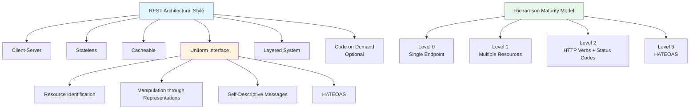
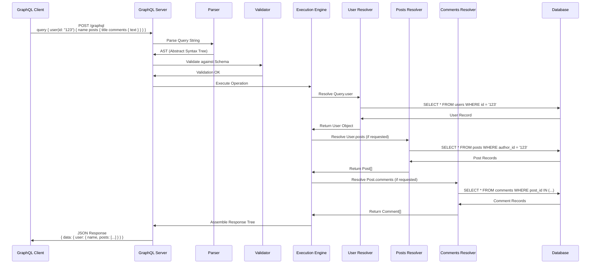
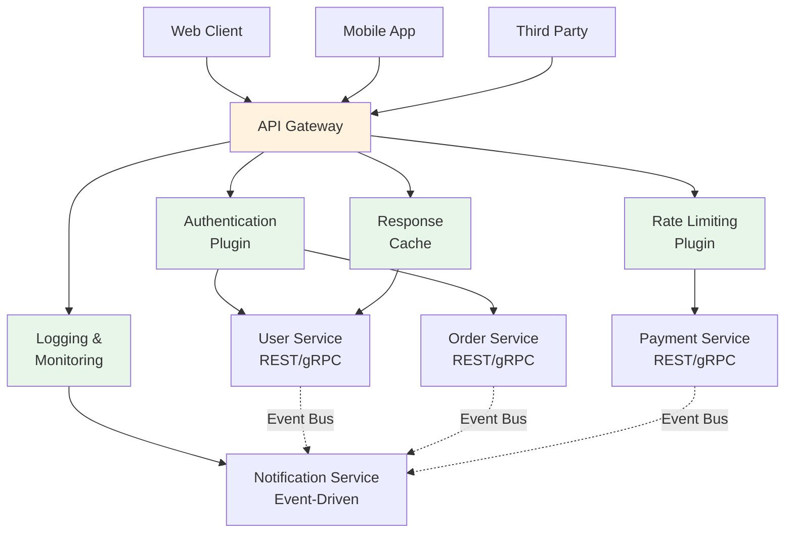

# API设计模式：REST/GraphQL/gRPC

## 引言

应用程序接口（Application Programming Interface, API）是现代软件系统的神经系统，负责在不同组件、服务与客户端之间传递语义完整的数据与控制指令。API设计不仅是技术实现问题，更是系统架构的核心决策——它决定了系统的可演化性（evolvability）、可维护性（maintainability）以及跨团队契约的清晰程度。

从20世纪90年代的CORBA/SOAP到21世纪初REST的崛起，再到2010年代GraphQL对查询范式的重塑，以及gRPC在高性能微服务中的普及，API设计经历了多次范式转换。每种风格背后都有深刻的理论基础和明确的适用边界。本文从形式化分类出发，深入剖析REST的架构约束、GraphQL的类型系统与查询语言形式化、gRPC的IDL与RPC语义，并在工程实践层面展示TypeScript/JavaScript生态中的具体实现路径。

理解这三种风格的本质差异，有助于架构师在特定场景下做出理性选择，而非盲目追随技术潮流。

## 理论严格表述

### API风格的形式化分类

API风格可以从多个维度进行形式化分类。根据通信范式，可分为请求-响应（Request-Response）、发布-订阅（Publish-Subscribe）和流式（Streaming）；根据契约定义方式，可分为契约优先（Contract-First）与代码优先（Code-First）；根据序列化格式，可分为文本型（JSON/XML/YAML）与二进制型（Protobuf/MessagePack/Avro）。

REST、GraphQL与gRPC均属于请求-响应范式，但它们在资源抽象、类型系统和传输机制上存在根本差异。下表从形式化视角对比三者：

| 维度 | REST | GraphQL | gRPC |
|------|------|---------|------|
| 核心抽象 | 资源（Resource） | 类型系统与查询 | 服务方法与消息 |
| 接口契约 | 隐式（约定俗成） | 显式Schema | 显式Protobuf IDL |
| 类型系统 | 无内置类型系统 | 强类型GraphQL Schema | 强类型Protobuf |
| 查询能力 | 固定端点，有限查询参数 | 灵活查询，客户端驱动 | 固定RPC方法签名 |
| 序列化 | JSON/XML（文本） | JSON（文本） | Protobuf（二进制） |
| 传输协议 | HTTP/1.1, HTTP/2 | HTTP/1.1, HTTP/2 | HTTP/2 |
| 流式支持 | Server-Sent Events, WebSocket | Subscription（WebSocket） | 原生双向流 |
| 浏览器支持 | 原生支持 | 原生支持 | 需gRPC-Web代理 |

### REST的六约束与Resource-Oriented Architecture

REST（Representational State Transfer）由Roy Fielding在其2000年博士论文中提出，并非一种协议或标准，而是一种架构风格（architectural style）。RESTful系统的核心是将系统的所有功能抽象为**资源**（Resource），并通过统一的接口进行操作。

Fielding定义了REST的六大约束：

1. **客户端-服务器（Client-Server）**：关注点分离，客户端负责用户界面与交互，服务器负责数据存储与业务逻辑。这一约束允许两者独立演化。

2. **无状态（Stateless）**：服务器不保存客户端的会话状态。每个请求必须包含服务器理解该请求所需的全部信息。无状态约束提升了系统的可见性（visibility）、可靠性（reliability）与可伸缩性（scalability），但可能增加网络开销。

3. **可缓存（Cacheable）**：响应必须显式或隐式地定义自身是否可缓存。缓存约束旨在消除部分交互，提升网络效率与客户端性能。

4. **统一接口（Uniform Interface）**：REST的核心约束，包含四个子约束：
   - **资源标识（Resource Identification）**：每个资源通过URI唯一标识
   - **通过表征操作资源（Manipulation of Resources through Representations）**：客户端持有资源的表征（如JSON/XML），包含足够信息以修改或删除资源
   - **自描述消息（Self-Descriptive Messages）**：每条消息包含足够信息以描述如何处理该消息
   - **超媒体作为应用状态引擎（HATEOAS）**：客户端通过服务器返回的超媒体链接动态发现状态转移路径

5. **分层系统（Layered System）**：客户端通常无法区分它是直接连接到终端服务器还是连接到中间层（如负载均衡器、缓存代理、网关）。分层约束提升了系统的可伸缩性与安全性。

6. **按需代码（Code on Demand，可选）**：服务器可以临时扩展或定制客户端的功能，通过传输可执行代码（如JavaScript applet）实现。这是唯一可选的约束。

**Richardson成熟度模型**（Richardson Maturity Model）将RESTful API的成熟度分为四个等级：

- **Level 0**：使用单一端点与单一方法（如POST /doEverything）
- **Level 1**：引入资源概念，使用多个URI（如POST /users/123, POST /orders/456）
- **Level 2**：使用HTTP动词表达操作语义（GET、POST、PUT、DELETE等），并正确使用HTTP状态码
- **Level 3**：引入HATEOAS，响应中包含指向相关资源的链接，客户端通过链接导航而非硬编码URI

Resource-Oriented Architecture（ROA）是REST风格的具体实践框架，强调将系统建模为一组资源的集合，每个资源具有唯一的URI、统一的接口和可交换的表征。

### GraphQL的类型系统与查询语言形式化

GraphQL由Facebook于2012年开发、2015年开源，其核心创新在于将**查询语言**与**类型系统**紧密结合。与REST的"端点驱动"不同，GraphQL采用"类型驱动"的设计哲学。

GraphQL Schema定义了API的类型图（Type Graph），包含以下核心类型构造：

- **标量类型（Scalar Types）**：`Int`、`Float`、`String`、`Boolean`、`ID`，以及自定义标量
- **对象类型（Object Types）**：具有命名字段和类型的复合类型，如`type User { id: ID! name: String! email: String }`
- **枚举类型（Enum Types）**：有限取值集合，如`enum Status { ACTIVE INACTIVE }`
- **接口（Interfaces）**：抽象类型，定义对象类型必须实现的字段契约
- **联合类型（Union Types）**：表示一个字段可以是多种对象类型之一，如`union SearchResult = User | Post | Comment`
- **输入类型（Input Types）**：专门用于突变（Mutation）参数传递的复杂输入结构

GraphQL的类型系统构成了一个**有向图**（Directed Graph），其中对象类型为节点，字段引用为边。查询语言则是一种**图遍历语言**（Graph Traversal Language），客户端通过在类型图上进行深度优先遍历，精确指定所需的数据子图。

GraphQL查询的形式化语法可以表示为：

```
Document ::= Definition+
Definition ::= OperationDefinition | FragmentDefinition
OperationDefinition ::= SelectionSet | OperationType Name? VariableDefinitions? Directives? SelectionSet
OperationType ::= 'query' | 'mutation' | 'subscription'
SelectionSet ::= '{' Selection+ '}'
Selection ::= Field | FragmentSpread | InlineFragment
Field ::= Alias? Name Arguments? Directives? SelectionSet?
```

GraphQL的执行引擎遵循**Resolver模式**：每个字段对应一个Resolver函数，该函数负责返回该字段的值。执行过程采用**广度优先策略**，从根类型（Query/Mutation/Subscription）开始，逐层解析每个字段，形成**响应树**（Response Tree），其形状与查询树一一对应。

GraphQL的**内省机制**（Introspection）允许客户端在运行时查询Schema的元数据，这为工具链（如代码生成、类型安全客户端、IDE自动补全）提供了坚实基础。

### gRPC的IDL与RPC语义

gRPC由Google于2015年开源，基于HTTP/2协议和Protocol Buffers（Protobuf）序列化框架，是一种高性能、语言无关的RPC框架。

gRPC的核心是**接口定义语言（IDL）**——Protocol Buffers。`.proto`文件定义了服务接口和消息类型：

```protobuf
syntax = "proto3";

service UserService {
  rpc GetUser(GetUserRequest) returns (User);
  rpc ListUsers(ListUsersRequest) returns (stream User);
  rpc CreateUsers(stream CreateUserRequest) returns (UserList);
  rpc Chat(stream ChatMessage) returns (stream ChatMessage);
}

message GetUserRequest {
  string id = 1;
}

message User {
  string id = 1;
  string name = 2;
  string email = 3;
}
```

Protobuf的类型系统包括：标量类型（`double`, `float`, `int32`, `int64`, `uint32`, `uint64`, `sint32`, `sint64`, `fixed32`, `fixed64`, `sfixed32`, `sfixed64`, `bool`, `string`, `bytes`）、枚举类型、消息类型（嵌套结构）、以及`map`和`repeated`集合类型。

gRPC定义了四种服务方法类型：

1. **Unary RPC**：客户端发送单个请求，服务器返回单个响应（最常用模式）
2. **Server Streaming RPC**：客户端发送单个请求，服务器返回流式响应序列
3. **Client Streaming RPC**：客户端发送流式请求序列，服务器返回单个响应
4. **Bidirectional Streaming RPC**：客户端与服务器之间建立全双工流，双方可独立发送消息序列

gRPC的语义建立在HTTP/2的流控制与多路复用之上。每个RPC调用映射为一个HTTP/2流，请求消息序列化为Protobuf二进制格式后作为请求体发送。gRPC使用自定义的`grpc-status`和`grpc-message`头部传递RPC级别的状态信息，而非依赖HTTP状态码（尽管底层仍使用HTTP/2的200 OK表示传输成功）。

### 三种风格的表达能力对比

从**表达能力**（Expressiveness）与**约束强度**（Constraint Strength）的视角，三种风格呈现出不同的设计哲学：

REST通过严格的约束（尤其是统一接口与无状态约束）换取系统的可伸缩性与可演化性，但牺牲了部分查询灵活性——客户端无法在一次请求中获取跨资源的任意数据子集，必须通过多次请求或设计专门的聚合端点。

GraphQL通过类型系统与查询语言的灵活性，赋予客户端精确指定数据需求的能力，消除了过度获取（Over-fetching）与获取不足（Under-fetching）问题。但这种灵活性是有代价的：查询的复杂度分析（Complexity Analysis）与深度限制成为生产环境的必需；缓存策略比REST更为复杂，因为每个查询可能是唯一的；且N+1查询问题需要通过DataLoader等模式缓解。

gRPC通过强类型IDL和高效的二进制序列化，在性能与类型安全方面达到最优。但其协议原生不支持浏览器（需gRPC-Web桥接），且缺乏人类可读的调试接口，开发者体验相对较弱。

### API版本化策略的理论

API演化是长期维护中不可避免的挑战。版本化策略的理论基础在于**向后兼容性**（Backward Compatibility）与**向前兼容性**（Forward Compatibility）的形式化定义：

- **向后兼容**：新版本的消费者仍能正确消费旧版本的数据
- **向前兼容**：旧版本的消费者能忽略新版本新增的字段而不报错

主要的版本化策略包括：

1. **URI版本化**（如`/v1/users`, `/v2/users`）：简单直观，但违反了REST的"资源标识不应随时间改变"原则
2. **请求头版本化**（如`Accept: application/vnd.api.v2+json`）：保持URI稳定，但增加了客户端复杂度
3. **查询参数版本化**（如`?api-version=2`）：折中方案，但可能污染缓存键
4. **无版本化，纯向后兼容演化**：最理想但最难实现，要求所有变更严格遵循兼容性规则（仅添加可选字段、不删除字段、不改变已有字段语义）

GraphQL通过Schema演化机制（弃用字段`@deprecated`、添加新字段、不改变已有字段）倡导无版本化策略。gRPC通过Protobuf的字段编号机制天然支持向后兼容（新增字段使用新编号，旧客户端忽略未知字段）与向前兼容（旧字段保留编号，新客户端可读取）。

## 工程实践映射

### RESTful API的TypeScript实现

在TypeScript/JavaScript生态中，Express、NestJS与Fastify是三种主流的RESTful框架选择，它们在路由设计、类型安全与架构模式上各有侧重。

**Express**作为最成熟的Node.js框架，采用极简中间件模型。类型安全可通过`@types/express`与手动定义接口实现：

```typescript
import express, { Request, Response } from 'express';

interface CreateUserDto {
  name: string;
  email: string;
}

interface User {
  id: string;
  name: string;
  email: string;
  createdAt: Date;
}

const app = express();
app.use(express.json());

// RESTful路由设计：资源URI + HTTP动词 + 状态码
app.post('/users', (req: Request<{}, {}, CreateUserDto>, res: Response<User | { error: string }>) => {
  const { name, email } = req.body;

  if (!name || !email) {
    return res.status(400).json({ error: 'Name and email are required' });
  }

  const user: User = {
    id: crypto.randomUUID(),
    name,
    email,
    createdAt: new Date()
  };

  // 201 Created 表示资源创建成功
  res.status(201).location(`/users/${user.id}`).json(user);
});

app.get('/users/:id', (req: Request<{ id: string }>, res: Response<User | { error: string }>) => {
  const { id } = req.params;
  // 查询逻辑...
  const user = findUserById(id);

  if (!user) {
    // 404 Not Found 明确表示资源不存在
    return res.status(404).json({ error: 'User not found' });
  }

  res.status(200).json(user);
});

app.delete('/users/:id', (req: Request<{ id: string }>, res: Response<void>) => {
  const { id } = req.params;
  deleteUser(id);
  // 204 No Content 表示删除成功，响应体为空
  res.status(204).send();
});
```

**NestJS**提供了更结构化的架构，通过装饰器、模块与依赖注入实现企业级RESTful API：

```typescript
import { Controller, Get, Post, Delete, Body, Param, HttpStatus, HttpCode } from '@nestjs/common';
import { ApiTags, ApiOperation, ApiResponse } from '@nestjs/swagger';

class CreateUserDto {
  name!: string;
  email!: string;
}

class UserEntity {
  id!: string;
  name!: string;
  email!: string;
  createdAt!: Date;
}

@ApiTags('users')
@Controller('users')
export class UserController {
  constructor(private readonly userService: UserService) {}

  @Post()
  @HttpCode(HttpStatus.CREATED)
  @ApiOperation({ summary: 'Create a new user' })
  @ApiResponse({ status: 201, description: 'User created', type: UserEntity })
  async create(@Body() dto: CreateUserDto): Promise<UserEntity> {
    return this.userService.create(dto);
  }

  @Get(':id')
  @ApiOperation({ summary: 'Get user by ID' })
  @ApiResponse({ status: 200, description: 'User found', type: UserEntity })
  @ApiResponse({ status: 404, description: 'User not found' })
  async findOne(@Param('id') id: string): Promise<UserEntity> {
    return this.userService.findById(id);
  }

  @Delete(':id')
  @HttpCode(HttpStatus.NO_CONTENT)
  @ApiOperation({ summary: 'Delete user' })
  async remove(@Param('id') id: string): Promise<void> {
    await this.userService.delete(id);
  }
}
```

**Fastify**以高性能著称，其Schema验证与序列化机制在编译时优化，显著提升吞吐量：

```typescript
import fastify from 'fastify';

const app = fastify({ logger: true });

// Fastify的JSON Schema同时用于验证、序列化与Swagger生成
const createUserSchema = {
  body: {
    type: 'object',
    required: ['name', 'email'],
    properties: {
      name: { type: 'string', minLength: 1 },
      email: { type: 'string', format: 'email' }
    }
  },
  response: {
    201: {
      type: 'object',
      properties: {
        id: { type: 'string' },
        name: { type: 'string' },
        email: { type: 'string' },
        createdAt: { type: 'string', format: 'date-time' }
      }
    }
  }
};

app.post('/users', { schema: createUserSchema }, async (request, reply) => {
  const { name, email } = request.body as { name: string; email: string };
  const user = await createUser({ name, email });
  reply.status(201).send(user);
});
```

### GraphQL的Schema设计与Resolver实现

在Node.js生态中，Apollo Server与GraphQL Yoga是两种主流的GraphQL服务器实现。

**Schema-First设计**强调先定义GraphQL Schema，再实现Resolver：

```typescript
// schema.graphql
type Query {
  user(id: ID!): User
  users(filter: UserFilter, pagination: PaginationInput): UserConnection!
}

type Mutation {
  createUser(input: CreateUserInput!): CreateUserPayload!
  updateUser(id: ID!, input: UpdateUserInput!): UpdateUserPayload!
}

type User {
  id: ID!
  name: String!
  email: String!
  posts: [Post!]!  # 字段级查询，客户端可选择是否获取
  createdAt: DateTime!
}

type Post {
  id: ID!
  title: String!
  content: String!
  author: User!
}

input UserFilter {
  nameContains: String
  emailDomain: String
}

input PaginationInput {
  first: Int
  after: String
}

type UserConnection {
  edges: [UserEdge!]!
  pageInfo: PageInfo!
}

type UserEdge {
  node: User!
  cursor: String!
}

type PageInfo {
  hasNextPage: Boolean!
  endCursor: String
}
```

**Apollo Server实现**：

```typescript
import { ApolloServer } from '@apollo/server';
import { startStandaloneServer } from '@apollo/server/standalone';

const typeDefs = `#graphql
  type Query {
    user(id: ID!): User
  }
  type User {
    id: ID!
    name: String!
    email: String!
    posts: [Post!]!
  }
  type Post {
    id: ID!
    title: String!
  }
`;

// Resolver映射：每个字段对应一个解析函数
const resolvers = {
  Query: {
    user: async (_: unknown, { id }: { id: string }, context: Context) => {
      return context.dataSources.userAPI.getUserById(id);
    }
  },
  User: {
    // 字段级Resolver：仅在客户端请求posts字段时执行
    posts: async (parent: User, _: unknown, context: Context) => {
      return context.dataSources.postAPI.getPostsByAuthorId(parent.id);
    }
  }
};

const server = new ApolloServer({
  typeDefs,
  resolvers,
  introspection: process.env.NODE_ENV !== 'production'
});
```

**N+1问题与DataLoader**：GraphQL的字段级Resolver在查询嵌套对象时可能导致N+1查询问题。DataLoader通过批量加载与记忆化解决此问题：

```typescript
import DataLoader from 'dataloader';

// 按ID批量加载用户，自动合并同一事件循环中的独立请求
const userLoader = new DataLoader<string, User>(async (userIds) => {
  const users = await db.user.findMany({
    where: { id: { in: [...userIds] } }
  });
  // 按输入顺序返回结果
  const userMap = new Map(users.map(u => [u.id, u]));
  return userIds.map(id => userMap.get(id) ?? new Error(`User ${id} not found`));
});

const resolvers = {
  User: {
    posts: async (parent: User, _: unknown, context: Context) => {
      // 使用DataLoader而非直接查询数据库
      return context.loaders.postByAuthorId.load(parent.id);
    }
  }
};
```

**GraphQL Yoga**作为更轻量、更现代的替代方案，原生支持HTTP/2、文件上传、订阅与SSE：

```typescript
import { createYoga } from 'graphql-yoga';
import { createServer } from 'node:http';

const yoga = createYoga({
  schema, // 由@graphql-tools/schema等工具构建
  maskedErrors: {
    maskError(error) {
      // 生产环境隐藏内部错误细节
      return new Error('Internal server error');
    }
  },
  plugins: [
    useDepthLimit({ maxDepth: 10 }), // 防止深层嵌套攻击
    useComplexityLimit({ maxComplexity: 1000 }) // 防止复杂查询攻击
  ]
});

const server = createServer(yoga);
server.listen(4000);
```

### gRPC-Web在浏览器中的实现

gRPC原生基于HTTP/2的 trailers 与二进制帧，浏览器环境无法直接访问这些底层特性。gRPC-Web通过在浏览器与gRPC服务之间引入**代理层**（Envoy、Nginx或内置的gRPC-Web拦截器）解决此问题。

**服务定义（.proto）**：

```protobuf
syntax = "proto3";

package user;

service UserService {
  rpc GetUser(GetUserRequest) returns (User);
  rpc ListUsers(ListUsersRequest) returns (stream User);
}

message GetUserRequest {
  string id = 1;
}

message ListUsersRequest {
  int32 page_size = 1;
  string page_token = 2;
}

message User {
  string id = 1;
  string name = 2;
  string email = 3;
}
```

**Node.js服务端（@grpc/grpc-js + @grpc/proto-loader）**：

```typescript
import * as grpc from '@grpc/grpc-js';
import * as protoLoader from '@grpc/proto-loader';
import path from 'path';

const PROTO_PATH = path.join(__dirname, 'user.proto');
const packageDefinition = protoLoader.loadSync(PROTO_PATH, {
  keepCase: true,
  longs: String,
  enums: String,
  defaults: true,
  oneofs: true
});

const userProto = grpc.loadPackageDefinition(packageDefinition).user as any;

const users = new Map<string, { id: string; name: string; email: string }>();

function getUser(call: grpc.ServerUnaryCall<any, any>, callback: grpc.sendUnaryData<any>) {
  const user = users.get(call.request.id);
  if (user) {
    callback(null, user);
  } else {
    callback({ code: grpc.status.NOT_FOUND, message: 'User not found' } as grpc.ServiceError, null);
  }
}

function listUsers(call: grpc.ServerWritableStream<any, any>) {
  const pageSize = call.request.page_size || 10;
  const values = Array.from(users.values()).slice(0, pageSize);
  values.forEach(user => call.write(user));
  call.end();
}

const server = new grpc.Server();
server.addService(userProto.UserService.service, { getUser, listUsers });
server.bindAsync('0.0.0.0:50051', grpc.ServerCredentials.createInsecure(), () => {
  server.start();
});
```

**TypeScript客户端（gRPC-Web）**：

```typescript
import { UserServiceClient } from './generated/user_grpc_web_pb';
import { GetUserRequest, ListUsersRequest, User } from './generated/user_pb';

const client = new UserServiceClient('http://localhost:8080'); // 指向Envoy代理

// Unary调用
const request = new GetUserRequest();
request.setId('user-123');

client.getUser(request, {}, (err, response: User) => {
  if (err) {
    console.error('gRPC error:', err);
    return;
  }
  console.log('User:', response.getName(), response.getEmail());
});

// Server Streaming调用
const listRequest = new ListUsersRequest();
listRequest.setPageSize(10);

const stream = client.listUsers(listRequest, {});
stream.on('data', (user: User) => {
  console.log('Streaming user:', user.getName());
});
stream.on('error', (err) => {
  console.error('Stream error:', err);
});
stream.on('end', () => {
  console.log('Stream ended');
});
```

### OpenAPI/Swagger的文档驱动开发

OpenAPI Specification（前身为Swagger）为RESTful API提供了机器可读的契约格式。文档驱动开发（Documentation-Driven Development）强调先编写OpenAPI文档，再生成代码与测试。

```yaml
# openapi.yaml
openapi: 3.0.3
info:
  title: User Service API
  version: 1.0.0
paths:
  /users:
    post:
      summary: Create a new user
      requestBody:
        required: true
        content:
          application/json:
            schema:
              $ref: '#/components/schemas/CreateUserDto'
      responses:
        '201':
          description: User created
          content:
            application/json:
              schema:
                $ref: '#/components/schemas/User'
    get:
      summary: List users
      parameters:
        - name: page
          in: query
          schema:
            type: integer
            default: 1
        - name: limit
          in: query
          schema:
            type: integer
            default: 20
      responses:
        '200':
          description: List of users
          content:
            application/json:
              schema:
                $ref: '#/components/schemas/UserList'

components:
  schemas:
    CreateUserDto:
      type: object
      required: [name, email]
      properties:
        name:
          type: string
          minLength: 1
        email:
          type: string
          format: email
    User:
      type: object
      properties:
        id:
          type: string
          format: uuid
        name:
          type: string
        email:
          type: string
        createdAt:
          type: string
          format: date-time
    UserList:
      type: object
      properties:
        data:
          type: array
          items:
            $ref: '#/components/schemas/User'
        total:
          type: integer
```

TypeScript生态中，`openapi-typescript`可从OpenAPI文档生成类型定义，`@openapi-codegen/cli`可生成完整的客户端SDK：

```bash
# 生成TypeScript类型
npx openapi-typescript openapi.yaml -o src/types/api.ts

# 生成Fetch客户端
npx @openapi-codegen/cli generate --spec openapi.yaml --generator TypeScriptFetch --output src/client
```

### tRPC的类型安全API设计

tRPC（TypeScript RPC）是近年来崛起的类型安全RPC框架，它利用TypeScript的类型系统在编译时保证客户端与服务器端API契约的一致性，无需代码生成或Schema定义。

```typescript
// server/trpc.ts
import { initTRPC } from '@trpc/server';
import { z } from 'zod';

const t = initTRPC.create();

export const router = t.router;
export const publicProcedure = t.procedure;

// server/routers/user.ts
export const userRouter = router({
  // 查询过程（Query）
  getById: publicProcedure
    .input(z.object({ id: z.string().uuid() }))
    .query(async ({ input, ctx }) => {
      return ctx.db.user.findUnique({ where: { id: input.id } });
    }),

  // 变更过程（Mutation）
  create: publicProcedure
    .input(z.object({
      name: z.string().min(1),
      email: z.string().email()
    }))
    .mutation(async ({ input, ctx }) => {
      return ctx.db.user.create({ data: input });
    })
});

// server/app.ts
import { userRouter } from './routers/user';

export const appRouter = router({
  user: userRouter
});

export type AppRouter = typeof appRouter;
```

客户端通过tRPC的类型推导，在编译时获得完整的类型安全与自动补全：

```typescript
// client/trpc.ts
import { createTRPCReact } from '@trpc/react-query';
import type { AppRouter } from '../server/app';

export const trpc = createTRPCReact<AppRouter>();

// client/components/UserProfile.tsx
function UserProfile({ userId }: { userId: string }) {
  // user的类型自动从服务器端推导：{ id: string; name: string; email: string; ... } | null
  const { data: user } = trpc.user.getById.useQuery({ id: userId });

  const createUser = trpc.user.create.useMutation({
    onSuccess: () => {
      // 成功后自动使相关查询失效并重新获取
      utils.user.getById.invalidate();
    }
  });

  return (
    <div>
      <h1>{user?.name}</h1>
      <p>{user?.email}</p>
    </div>
  );
}
```

tRPC的核心价值在于**端到端类型安全**（End-to-End Type Safety）：修改服务器端Procedure的输入或输出类型，客户端代码会立即在编译时报错，无需运行测试或同步Schema文件。这显著降低了API演化过程中的契约破坏风险。

### API网关模式

在微服务架构中，API网关（API Gateway）作为客户端与后端服务之间的统一入口，承担请求路由、协议转换、认证授权、限流熔断、缓存与日志聚合等横切关注点。

**Kong**作为开源API网关，基于OpenResty（Nginx + LuaJIT）实现高性能代理，支持插件生态：

```yaml
# kong.yml - declarative configuration
_format_version: "3.0"
services:
  - name: user-service
    url: http://user-service:3000
    routes:
      - name: user-routes
        paths:
          - /api/users
    plugins:
      - name: rate-limiting
        config:
          minute: 100
      - name: key-auth
      - name: cors
        config:
          origins: ["https://app.example.com"]

  - name: order-service
    url: http://order-service:3000
    routes:
      - name: order-routes
        paths:
          - /api/orders
    plugins:
      - name: jwt
      - name: rate-limiting
        config:
          minute: 50
```

**AWS API Gateway**提供托管式服务，支持REST API、HTTP API与WebSocket API三种类型。通过OpenAPI导入、Lambda代理集成与VPC链接，可实现与AWS生态的深度整合。

在TypeScript生态中，`@vendia/serverless-express`或`serverless-http`可将Express/NestJS应用封装为Lambda函数，通过API Gateway暴露：

```typescript
import serverlessExpress from '@vendia/serverless-express';
import { NestFactory } from '@nestjs/core';
import { ExpressAdapter } from '@nestjs/platform-express';
import { AppModule } from './app.module';

let cachedServer: ReturnType<typeof serverlessExpress>;

async function bootstrap(): Promise<ReturnType<typeof serverlessExpress>> {
  const expressApp = require('express')();
  const adapter = new ExpressAdapter(expressApp);
  const app = await NestFactory.create(AppModule, adapter);
  app.enableCors();
  await app.init();
  return serverlessExpress({ app: expressApp });
}

export const handler = async (event: any, context: any) => {
  if (!cachedServer) {
    cachedServer = await bootstrap();
  }
  return cachedServer(event, context);
};
```

### 何时选REST vs GraphQL vs gRPC

选择API风格应基于团队能力、性能需求、客户端多样性与系统演化预期进行理性决策：

**选择REST的场景**：

- 团队熟悉HTTP语义与RESTful设计原则
- API面向广泛的第三方开发者，需要简单的调试与探索体验
- 需要利用HTTP缓存基础设施（CDN、浏览器缓存、代理缓存）
- 系统资源关系简单，不存在复杂的嵌套查询需求
- 需要与现有Web基础设施（负载均衡、WAF、日志分析）无缝集成

**选择GraphQL的场景**：

- 前端需求多变，需要灵活的数据获取能力（如移动App与Web端的数据需求差异大）
- 存在复杂的对象图查询，REST会导致过度获取或大量级联请求
- 团队有能力实施查询复杂度分析、深度限制与性能监控
- 强类型Schema与内省机制对工具链（代码生成、IDE支持）有高要求
- 聚合多个微服务的数据到一个统一Schema（Schema Stitching/Federation）

**选择gRPC的场景**：

- 服务间通信对性能极度敏感（低延迟、高吞吐）
- 系统主要为内部微服务，不直接暴露给浏览器端
- 需要强类型契约与多语言支持（Go、Java、C++、Python、TypeScript等）
- 需要流式通信（双向流、服务器流、客户端流）
- 团队具备Protocol Buffers与HTTP/2的运维能力

**混合架构**也是常见实践：内部服务间使用gRPC，对外暴露使用REST或GraphQL；或核心服务使用gRPC，BFF（Backend for Frontend）层使用GraphQL聚合数据。

## Mermaid 图表

### 图表1：REST架构约束层次模型



### 图表2：GraphQL查询执行与Resolver解析流程



### 图表3：三种API风格的架构对比

```mermaid
graph LR
    subgraph REST["REST (Resource-Oriented)"]
        R1[GET /users/123] --> R2[GET /users/123/posts]
        R2 --> R3[GET /posts/456/comments]
        R4[PUT /users/123] --> R5[DELETE /users/123]
    end

    subgraph GraphQL["GraphQL (Type-Driven)"]
        G1[Single Endpoint /graphql] --> G2[Query specifies exact shape]
        G2 --> G3[{ user(id) { name posts { title } } }]
        G3 --> G4[Response mirrors Query]
    end

    subgraph gRPC["gRPC (Service-Oriented)"]
        P1[user.GetUser] --> P2[user.ListUsers stream]
        P2 --> P3[order.CreateOrder]
        P3 --> P4[chat.Bidirectional stream]
    end

    C[Client Application] --> REST
    C --> GraphQL
    C --> gRPC

    style REST fill:#e3f2fd
    style GraphQL fill:#fce4ec
    style gRPC fill:#e8f5e9
```

### 图表4：API网关模式在微服务架构中的位置



## 理论要点总结

1. **REST是一种架构风格而非协议**。Fielding提出的六大约束（客户端-服务器、无状态、可缓存、统一接口、分层系统、按需代码）构成了RESTful系统的理论基础。Richardson成熟度模型提供了从RPC到完整REST的演进路径，达到Level 3（HATEOAS）的API才能实现真正的RESTful超媒体驱动。

2. **GraphQL的核心创新是类型系统与查询语言的结合**。客户端通过声明式查询精确获取所需数据，消除了REST中的过度获取与获取不足问题。但GraphQL引入了新的复杂度：查询复杂度分析、N+1查询问题、缓存策略复杂化，需要专门的工程实践来应对。

3. **gRPC通过强类型IDL与二进制序列化实现高性能服务间通信**。Protocol Buffers的类型系统与四种RPC方法类型（Unary、Server Streaming、Client Streaming、Bidirectional Streaming）为微服务架构提供了强大的通信原语。gRPC-Web通过代理层将gRPC能力扩展到浏览器环境。

4. **API版本化应优先选择向后兼容的无版本化策略**。GraphQL的Schema演化与Protobuf的字段编号机制天然支持向后兼容。当必须引入破坏性变更时，URI版本化与请求头版本化是工程实践中最常用的两种策略。

5. **tRPC代表了类型安全API设计的新范式**。通过利用TypeScript的类型系统在编译时保证端到端契约一致性，tRPC消除了传统API开发中的Schema同步与代码生成步骤，显著提升了开发效率与契约可靠性。

6. **API网关是微服务架构的横切关注点聚合器**。无论选择REST、GraphQL还是gRPC，API网关都承担着路由、认证、限流、缓存与协议转换等关键职责。Kong、Envoy与云托管网关（AWS API Gateway、Azure API Management）提供了不同层面的解决方案。

7. **技术选择应基于场景而非流行度**。REST适合公开API与简单资源操作，GraphQL适合复杂查询与多变的前端需求，gRPC适合高性能内部服务通信。混合架构在实践中日益普遍，通过BFF层与网关组合不同风格的优势。

## 参考资源

1. Fielding, Roy Thomas. *Architectural Styles and the Design of Network-based Software Architectures*. Doctoral dissertation, University of California, Irvine, 2000. [https://www.ics.uci.edu/~fielding/pubs/dissertation/top.htm](https://www.ics.uci.edu/~fielding/pubs/dissertation/top.htm)

2. GraphQL Specification. *GraphQL: A query language for APIs*. GraphQL Foundation, 2023. [https://spec.graphql.org/](https://spec.graphql.org/)

3. Richardson, Leonard. *Richardson Maturity Model*. QCon London 2010. [https://martinfowler.com/articles/richardsonMaturityModel.html](https://martinfowler.com/articles/richardsonMaturityModel.html)

4. gRPC Authors. *gRPC: A high performance, open-source universal RPC framework*. [https://grpc.io/docs/](https://grpc.io/docs/)

5. API Stylebook. *REST, GraphQL and gRPC Comparison*. [https://apistylebook.com/](https://apistylebook.com/)

6. Microsoft. *API Design Best Practices*. Microsoft Learn, 2024. [https://learn.microsoft.com/en-us/azure/architecture/best-practices/api-design](https://learn.microsoft.com/en-us/azure/architecture/best-practices/api-design)

7. OpenAPI Initiative. *OpenAPI Specification v3.1.0*. [https://spec.openapis.org/oas/v3.1.0](https://spec.openapis.org/oas/v3.1.0)

8. tRPC Authors. *tRPC Documentation: End-to-end typesafe APIs made easy*. [https://trpc.io/docs](https://trpc.io/docs)
