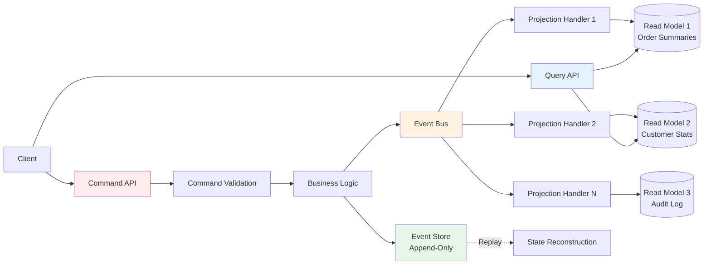
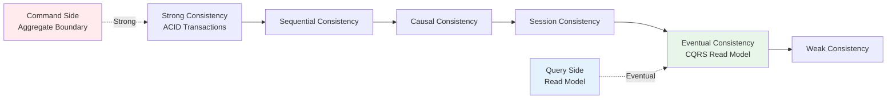
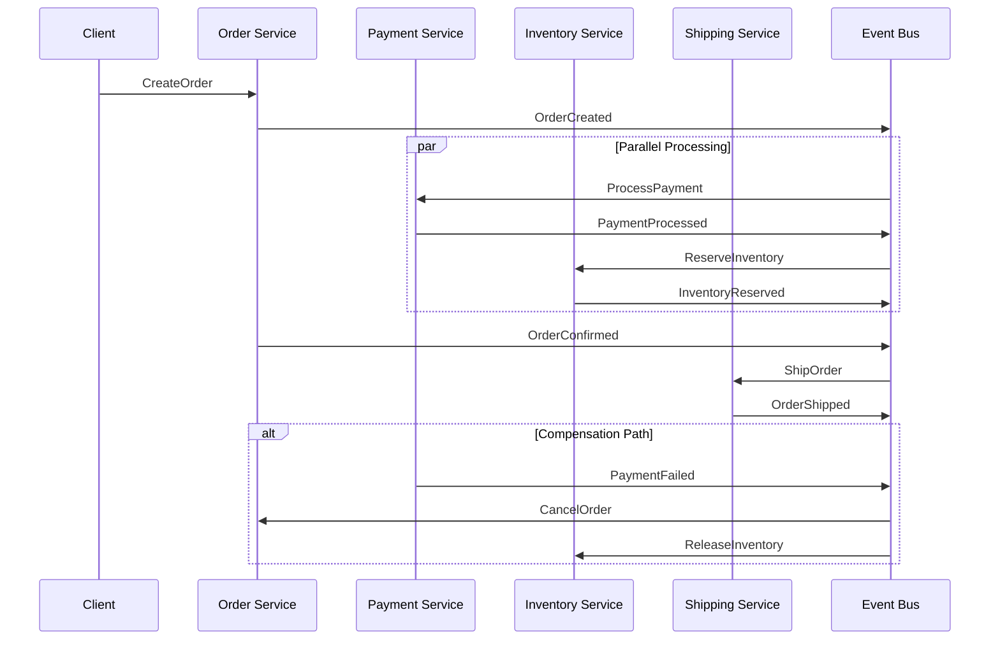

# 数据管理模式：CQRS/Event Sourcing

## 引言

数据是现代应用系统的核心资产，但"如何存储、读取与演化数据"这一问题没有普适答案。
传统CRUD（Create, Read, Update, Delete）模式以单一数据模型同时服务读写操作，在简单场景下表现优异，
但随着系统复杂度、访问规模与一致性要求的提升，
其局限性日益凸显：读写争用导致性能瓶颈、领域逻辑与技术实现深度耦合、数据变更历史不可追溯、以及横向扩展时的一致性困境。

命令查询职责分离（Command Query Responsibility Segregation, CQRS）与事件溯源（Event Sourcing）作为两种互补的架构模式，从不同维度回应了上述挑战。
CQRS通过读写模型的分离，优化各自的数据结构以匹配访问模式；
Event Sourcing通过将系统状态存储为不可变事件序列，赋予数据完整的历史维度与审计能力。
两者结合，构成了现代分布式系统中数据管理的高阶范式。

本文从形式化理论出发，深入探讨CQRS的命令模型与查询模型分离原理、Event Sourcing的时序一致性保证、投影与物化视图的构建机制，并在Node.js/TypeScript生态中展示具体的工程实现路径。

## 理论严格表述

### 数据管理的架构模式分类

数据管理的架构模式可以从**数据模型数量**、**一致性模型**、**存储抽象**三个维度进行分类：

| 维度 | 单模型CRUD | CQRS | CQRS + Event Sourcing |
|------|-----------|------|----------------------|
| 数据模型 | 单一模型服务读写 | 读模型与写模型分离 | 写模型=事件流，读模型=投影 |
| 一致性 | 强一致性为主 | 最终一致性 | 最终一致性 |
| 存储抽象 | 当前状态存储 | 当前状态+查询优化存储 | 事件日志+物化视图 |
| 历史追溯 | 需额外审计表 | 需额外审计表 | 原生支持 |
| 复杂度 | 低 | 中 | 高 |

### CQRS的读写分离理论基础

CQRS的核心思想源于Bertrand Meyer提出的**命令查询分离原则**（Command Query Separation, CQS）：一个方法要么是执行动作的**命令**（Command，产生副作用，不返回值），要么是返回数据的**查询**（Query，无副作用，返回结果），但不应两者兼具。

CQRS将这一原则从方法级别扩展到**架构级别**：系统的写操作（命令）与读操作（查询）使用不同的数据模型、存储介质甚至服务实例。

**命令模型（Command Model / Write Model）**针对写操作优化，其数据结构紧密贴合领域模型（Domain Model）与业务规则验证需求。
命令模型通常采用聚合根（Aggregate Root）模式，确保业务不变量（Business Invariants）在事务边界内的一致性。
每个命令对应一个明确的业务意图，如`CreateOrderCommand`、`ShipOrderCommand`、`CancelOrderCommand`，而非通用的`UpdateOrder`操作。

**查询模型（Query Model / Read Model）**针对读操作优化，其数据结构直接面向用户界面的展示需求。
查询模型通常采用反规范化（Denormalized）结构，将多表关联预计算为扁平化视图，消除运行时JOIN操作。
例如，订单列表页可能需要同时展示订单摘要、客户名称与最新状态——在CQRS中，这些数据可在命令处理阶段预先聚合到读模型的`OrderSummary`文档中。

命令与查询之间的同步机制是CQRS的关键设计决策，主要有三种策略：

1. **同一数据库，不同Schema**：命令模型与查询模型共享数据库实例，但使用不同的表或集合。通过数据库事务保证即时一致性，但读写仍可能争用资源。

2. **不同数据库，同步复制**：命令模型写入操作型数据库（如PostgreSQL、MongoDB），查询模型读取分析型数据库（如Elasticsearch、ClickHouse、Read Replica）。通过数据库复制机制或应用层双写实现同步。

3. **事件驱动异步投影**：命令模型处理命令后发布领域事件（Domain Event），查询模型通过订阅事件流异步更新自身状态。
   最终一致性，但读写完全解耦，扩展性最优。

### Event Sourcing的时序一致性

Event Sourcing将系统的状态变更记录为一系列**不可变事件**（Immutable Events），而非直接更新当前状态。
系统的当前状态可通过**重放（Replay）**所有历史事件推导得出。
这一模式与会计簿记中的复式记账法异曲同工：不直接修改账户余额，而是追加每一笔交易记录，余额通过累加交易记录计算得出。

Event Sourcing的核心形式化定义包含以下要素：

- **事件（Event）**：表示领域中的某个事实（Fact），已经发生且不可改变。事件命名应采用过去时态，如`OrderCreated`、`PaymentReceived`、`OrderShipped`。
- **事件流（Event Stream）**：特定聚合实例的所有相关事件的有序序列。每个事件流具有唯一标识（通常为聚合ID），事件在流内具有严格单调递增的序列号或时间戳。
- **状态推导函数（State Reduction Function）**：`State = fold(apply, initialState, events)`，即通过将`apply`函数依次应用于初始状态和事件序列，计算出当前状态。
- **追加存储（Append-Only Store）**：事件存储仅支持追加操作，不支持删除或修改已有事件。这是保证审计追踪与历史一致性的根本。

Event Sourcing的时序一致性建立在以下理论保证之上：

- **不可变性保证（Immutability Guarantee）**：事件一旦写入不可更改，消除了更新异常与并发写入冲突
- **全序保证（Total Order Guarantee）**：同一聚合的事件流具有确定的全序关系，重放结果始终一致
- **因果一致性（Causal Consistency）**：如果事件B的产生依赖于事件A的结果，则事件A在事件流中必须出现在事件B之前

**快照（Snapshot）**机制用于优化状态重建性能。
当事件流过长时，系统定期保存聚合状态的快照。
重建状态时，只需加载最近的快照并重放后续事件，而非从头重放全部历史。
快照的数学表达为：`State(t) = Snapshot(t_s) + fold(apply, Snapshot(t_s), Events(t_s, t])`。

**投影（Projection）**是将事件流转换为查询优化视图的过程。投影可以是同步的（在命令事务内更新）或异步的（通过事件处理器后台更新）。
投影本质上是一个**状态机**，其转换函数由领域事件驱动。

### Materialized View的模式

物化视图（Materialized View）是数据库领域的一个经典概念，在CQRS/Event Sourcing架构中被赋予了新的角色。
物化视图是查询结果的预计算副本，存储在专用存储中以加速读取。

在Event Sourcing上下文中，物化视图的构建遵循**事件驱动更新**模式：

```
Event Stream → Projection Handler → Read Model Store (Materialized View)
```

物化视图的设计需要考虑以下约束：

- **单一职责**：每个物化视图服务特定的查询场景，避免通用化设计
- **可重建性**：物化视图必须能够从事件流完全重建，因为它是派生数据而非权威数据源
- **最终一致性窗口**：物化视图与命令模型之间存在短暂的不一致窗口，客户端必须能够处理此情况
- **并发控制**：多个投影处理器可能同时更新同一视图，需要适当的乐观锁或幂等性保证

### 数据一致性的谱系

数据一致性不是二元的"一致/不一致"，而是一个连续谱系：

- **强一致性（Strong Consistency）**：任何读取操作都返回最近一次写入的结果。传统关系型数据库通过ACID事务提供此保证，但在分布式系统中代价高昂。

- **顺序一致性（Sequential Consistency）**：所有操作以某种全局顺序执行，每个进程看到的顺序与该全局顺序一致。

- **因果一致性（Causal Consistency）**：因果相关的操作对所有观察者呈现一致的顺序，无因果关系的操作顺序可不同。

- **会话一致性（Session Consistency）**：同一客户端会话内的读取保证一致性，不同会话间可能不一致。

- **最终一致性（Eventual Consistency）**：若无新写入，所有副本最终收敛到相同值。CQRS/Event Sourcing通常采用此模型，其收敛时间取决于网络延迟与处理器吞吐量。

- **弱一致性（Weak Consistency）**：不保证读取返回最新写入，读取可能返回任意历史值。

CQRS/Event Sourcing架构通常在读模型上采用最终一致性，在命令模型的聚合边界内保持强一致性（通过单聚合事务保证）。

### CAP定理在数据管理中的体现

CAP定理（Brewer, 2000）指出分布式系统无法同时满足一致性（Consistency）、可用性（Availability）与分区容错性（Partition Tolerance）。在CQRS/Event Sourcing架构中，这一权衡体现为：

- **命令端（Write Side）**：优先保证**CP**（Consistency + Partition Tolerance）。聚合根的命令处理必须在一致性边界内完成，分区发生时宁可拒绝命令也不破坏业务不变量。

- **查询端（Read Side）**：优先保证**AP**（Availability + Partition Tolerance）。读模型可以容忍短暂的不一致，但必须始终可响应查询请求。

- **事件总线**：作为命令端与查询端之间的桥梁，事件总线本身也面临CAP权衡。Kafka、Pulsar等系统通过可配置的复制因子与ACK策略，允许开发者在C与A之间动态调整。

## 工程实践映射

### Node.js中的Event Sourcing实现

在Node.js生态中，Event Sourcing的实现可选择专用事件存储（EventStoreDB）或基于通用数据库自研实现。

**EventStoreDB**是专为Event Sourcing设计的数据库，提供原生的事件流、投影与订阅机制：

```typescript
import { EventStoreDBClient, jsonEvent, FORWARDS, START } from '@eventstore/db-client';

const client = EventStoreDBClient.connectionString('esdb://localhost:2113?tls=false');

// 领域事件定义
interface OrderCreatedEvent {
  type: 'OrderCreated';
  data: {
    orderId: string;
    customerId: string;
    items: Array<{ productId: string; quantity: number; price: number }>;
    createdAt: string;
  };
}

interface PaymentReceivedEvent {
  type: 'PaymentReceived';
  data: {
    orderId: string;
    amount: number;
    paidAt: string;
  };
}

interface OrderShippedEvent {
  type: 'OrderShipped';
  data: {
    orderId: string;
    trackingNumber: string;
    shippedAt: string;
  };
}

type OrderEvent = OrderCreatedEvent | PaymentReceivedEvent | OrderShippedEvent;

// 聚合状态
interface OrderState {
  orderId: string;
  customerId: string;
  items: Array<{ productId: string; quantity: number; price: number }>;
  totalAmount: number;
  paidAmount: number;
  status: 'pending' | 'paid' | 'shipped';
  trackingNumber?: string;
}

// 状态推导函数（Reducer）
function applyEvent(state: OrderState | null, event: OrderEvent): OrderState {
  switch (event.type) {
    case 'OrderCreated':
      return {
        orderId: event.data.orderId,
        customerId: event.data.customerId,
        items: event.data.items,
        totalAmount: event.data.items.reduce((sum, item) => sum + item.price * item.quantity, 0),
        paidAmount: 0,
        status: 'pending'
      };
    case 'PaymentReceived':
      if (!state) throw new Error('Order not found');
      const newPaidAmount = state.paidAmount + event.data.amount;
      return {
        ...state,
        paidAmount: newPaidAmount,
        status: newPaidAmount >= state.totalAmount ? 'paid' : state.status
      };
    case 'OrderShipped':
      if (!state) throw new Error('Order not found');
      return {
        ...state,
        status: 'shipped',
        trackingNumber: event.data.trackingNumber
      };
    default:
      return state!;
  }
}

// 追加事件到事件流
async function appendEvent(orderId: string, event: OrderEvent): Promise<void> {
  const serializedEvent = jsonEvent({
    type: event.type,
    data: event.data
  });

  await client.appendToStream(`order-${orderId}`, [serializedEvent]);
}

// 从事件流重建状态
async function rebuildState(orderId: string): Promise<OrderState | null> {
  const events = client.readStream<OrderEvent>(`order-${orderId}`, {
    direction: FORWARDS,
    fromRevision: START
  });

  let state: OrderState | null = null;
  for await (const event of events) {
    state = applyEvent(state, event as unknown as OrderEvent);
  }

  return state;
}

// 使用快照优化重建
async function getOrderState(orderId: string): Promise<OrderState | null> {
  // 1. 尝试加载最新快照
  const snapshot = await loadSnapshot(orderId);
  const fromRevision = snapshot ? snapshot.revision : START;
  const initialState = snapshot ? snapshot.state : null;

  // 2. 从快照点重放后续事件
  const events = client.readStream<OrderEvent>(`order-${orderId}`, {
    direction: FORWARDS,
    fromRevision
  });

  let state = initialState;
  let lastRevision: bigint | undefined;
  for await (const event of events) {
    state = applyEvent(state, event as unknown as OrderEvent);
    lastRevision = event.revision;
  }

  // 3. 如果事件数量超过阈值，保存新快照
  if (lastRevision !== undefined && shouldSnapshot(snapshot, lastRevision)) {
    await saveSnapshot(orderId, state!, lastRevision);
  }

  return state;
}
```

**自研事件存储（PostgreSQL实现）**：对于不需要EventStoreDB全部特性的场景，可利用PostgreSQL的JSONB与乐观锁实现轻量级事件存储：

```typescript
import { Pool } from 'pg';

const pool = new Pool({ connectionString: process.env.DATABASE_URL });

interface StoredEvent {
  stream_id: string;
  stream_type: string;
  event_type: string;
  event_version: number;
  payload: unknown;
  metadata: unknown;
  occurred_at: Date;
  sequence_number: bigint;
}

async function appendToStream(
  streamId: string,
  streamType: string,
  expectedVersion: number,
  events: Array<{ type: string; payload: unknown; metadata?: unknown }>
): Promise<void> {
  const client = await pool.connect();

  try {
    await client.query('BEGIN');

    // 乐观并发控制：检查当前版本
    const versionResult = await client.query(
      'SELECT COALESCE(MAX(event_version), 0) as current_version FROM events WHERE stream_id = $1',
      [streamId]
    );
    const currentVersion = parseInt(versionResult.rows[0].current_version, 10);

    if (currentVersion !== expectedVersion) {
      throw new Error(`Concurrency conflict: expected ${expectedVersion}, found ${currentVersion}`);
    }

    // 批量追加事件
    for (let i = 0; i < events.length; i++) {
      await client.query(
        `INSERT INTO events (stream_id, stream_type, event_type, event_version, payload, metadata, occurred_at)
         VALUES ($1, $2, $3, $4, $5, $6, NOW())`,
        [
          streamId,
          streamType,
          events[i].type,
          expectedVersion + i + 1,
          JSON.stringify(events[i].payload),
          JSON.stringify(events[i].metadata || {})
        ]
      );
    }

    await client.query('COMMIT');
  } catch (err) {
    await client.query('ROLLBACK');
    throw err;
  } finally {
    client.release();
  }
}

// 事件表Schema
/*
CREATE TABLE events (
  sequence_number BIGSERIAL PRIMARY KEY,
  stream_id VARCHAR(255) NOT NULL,
  stream_type VARCHAR(100) NOT NULL,
  event_type VARCHAR(100) NOT NULL,
  event_version INTEGER NOT NULL,
  payload JSONB NOT NULL,
  metadata JSONB DEFAULT '{}',
  occurred_at TIMESTAMPTZ NOT NULL DEFAULT NOW(),
  UNIQUE(stream_id, event_version)
);

CREATE INDEX idx_events_stream ON events(stream_id, event_version);
CREATE INDEX idx_events_type ON events(event_type, occurred_at);
*/
```

### CQRS在NestJS中的实现

NestJS的模块化架构与依赖注入机制为CQRS实现提供了天然的支持。`@nestjs/cqrs`包提供了命令总线、事件总线、查询总线与Saga的基础设施。

**命令端实现**：

```typescript
import { CommandHandler, ICommandHandler, EventBus } from '@nestjs/cqrs';
import { Injectable } from '@nestjs/common';

// 命令定义
export class CreateOrderCommand {
  constructor(
    public readonly orderId: string,
    public readonly customerId: string,
    public readonly items: Array<{ productId: string; quantity: number; price: number }>
  ) {}
}

// 命令处理器
@CommandHandler(CreateOrderCommand)
export class CreateOrderHandler implements ICommandHandler<CreateOrderCommand> {
  constructor(
    private readonly eventStore: EventStoreService,
    private readonly eventBus: EventBus
  ) {}

  async execute(command: CreateOrderCommand): Promise<void> {
    const { orderId, customerId, items } = command;

    // 1. 加载聚合当前状态
    const existingState = await this.eventStore.getOrderState(orderId);
    if (existingState) {
      throw new Error(`Order ${orderId} already exists`);
    }

    // 2. 执行业务逻辑验证
    if (items.length === 0) {
      throw new Error('Order must contain at least one item');
    }

    // 3. 生成领域事件
    const event = new OrderCreatedEvent({
      orderId,
      customerId,
      items,
      createdAt: new Date().toISOString()
    });

    // 4. 追加事件到事件存储
    await this.eventStore.appendEvent(orderId, 0, event);

    // 5. 发布事件到事件总线（供投影处理器订阅）
    this.eventBus.publish(event);
  }
}
```

**查询端实现**：

```typescript
import { IQueryHandler, QueryHandler } from '@nestjs/cqrs';
import { InjectRepository } from '@nestjs/typeorm';
import { Repository } from 'typeorm';

// 查询定义
export class GetOrderByIdQuery {
  constructor(public readonly orderId: string) {}
}

export class GetOrderListQuery {
  constructor(
    public readonly customerId?: string,
    public readonly status?: string,
    public readonly page: number = 1,
    public readonly limit: number = 20
  ) {}
}

// 读模型实体（反规范化设计，直接服务查询需求）
@Entity('order_summaries')
export class OrderSummary {
  @PrimaryColumn('uuid')
  orderId!: string;

  @Column('uuid')
  customerId!: string;

  @Column('varchar')
  customerName!: string;  // 反规范化：避免JOIN

  @Column('decimal', { precision: 10, scale: 2 })
  totalAmount!: number;

  @Column('varchar')
  status!: string;

  @Column('int')
  itemCount!: number;

  @Column('timestamp')
  createdAt!: Date;

  @Column('timestamp', { nullable: true })
  shippedAt?: Date;
}

@QueryHandler(GetOrderByIdQuery)
export class GetOrderByIdHandler implements IQueryHandler<GetOrderByIdQuery> {
  constructor(
    @InjectRepository(OrderSummary)
    private readonly orderSummaryRepo: Repository<OrderSummary>
  ) {}

  async execute(query: GetOrderByIdQuery): Promise<OrderSummary | null> {
    return this.orderSummaryRepo.findOne({
      where: { orderId: query.orderId }
    });
  }
}

@QueryHandler(GetOrderListQuery)
export class GetOrderListHandler implements IQueryHandler<GetOrderListQuery> {
  constructor(
    @InjectRepository(OrderSummary)
    private readonly orderSummaryRepo: Repository<OrderSummary>
  ) {}

  async execute(query: GetOrderListQuery): Promise<{ data: OrderSummary[]; total: number }> {
    const qb = this.orderSummaryRepo.createQueryBuilder('o');

    if (query.customerId) {
      qb.andWhere('o.customerId = :customerId', { customerId: query.customerId });
    }

    if (query.status) {
      qb.andWhere('o.status = :status', { status: query.status });
    }

    const [data, total] = await qb
      .orderBy('o.createdAt', 'DESC')
      .skip((query.page - 1) * query.limit)
      .take(query.limit)
      .getManyAndCount();

    return { data, total };
  }
}
```

**投影处理器（Event Handler）**：

```typescript
import { EventsHandler, IEventHandler } from '@nestjs/cqrs';
import { InjectRepository } from '@nestjs/typeorm';
import { Repository } from 'typeorm';

@EventsHandler(OrderCreatedEvent)
export class OrderCreatedProjection implements IEventHandler<OrderCreatedEvent> {
  constructor(
    @InjectRepository(OrderSummary)
    private readonly orderSummaryRepo: Repository<OrderSummary>,
    private readonly customerService: CustomerService
  ) {}

  async handle(event: OrderCreatedEvent): Promise<void> {
    // 反规范化：查询客户名称以构建读模型
    const customer = await this.customerService.getById(event.data.customerId);

    const summary = this.orderSummaryRepo.create({
      orderId: event.data.orderId,
      customerId: event.data.customerId,
      customerName: customer.name,
      totalAmount: event.data.items.reduce((sum, item) => sum + item.price * item.quantity, 0),
      status: 'pending',
      itemCount: event.data.items.length,
      createdAt: new Date(event.data.createdAt)
    });

    await this.orderSummaryRepo.save(summary);
  }
}

@EventsHandler(PaymentReceivedEvent)
export class PaymentReceivedProjection implements IEventHandler<PaymentReceivedEvent> {
  constructor(
    @InjectRepository(OrderSummary)
    private readonly orderSummaryRepo: Repository<OrderSummary>
  ) {}

  async handle(event: PaymentReceivedEvent): Promise<void> {
    const summary = await this.orderSummaryRepo.findOne({
      where: { orderId: event.data.orderId }
    });

    if (!summary) return; // 幂等性：如果读模型尚未创建，跳过

    // 注意：实际实现中可能需要跟踪已处理的支付以避免重复计算
    // 这里简化处理，假设事件是幂等的
    if (event.data.amount >= summary.totalAmount) {
      summary.status = 'paid';
    }

    await this.orderSummaryRepo.save(summary);
  }
}
```

**Saga（长事务协调）**：在分布式场景中，跨越多个聚合的业务流程需要Saga模式协调：

```typescript
import { Saga, ofType } from '@nestjs/cqrs';
import { Observable } from 'rxjs';
import { map, mergeMap } from 'rxjs/operators';

@Injectable()
export class OrderSaga {
  constructor(
    private readonly commandBus: CommandBus,
    private readonly paymentService: PaymentService
  ) {}

  @Saga()
  orderCreated = (events$: Observable<any>): Observable<ICommand> => {
    return events$.pipe(
      ofType(OrderCreatedEvent),
      mergeMap((event) =>
        this.paymentService.createPaymentIntent({
          orderId: event.data.orderId,
          amount: event.data.items.reduce((sum, item) => sum + item.price * item.quantity, 0)
        }).then(() => new ProcessPaymentCommand(event.data.orderId))
      )
    );
  };

  @Saga()
  paymentFailed = (events$: Observable<any>): Observable<ICommand> => {
    return events$.pipe(
      ofType(PaymentFailedEvent),
      map((event) => new CancelOrderCommand(event.data.orderId, 'Payment failed'))
    );
  };
}
```

### 前端状态管理中的Event Sourcing启发

前端状态管理库Redux的设计哲学深受Event Sourcing启发。Redux的`action`本质上是领域事件，`reducer`是状态推导函数，`store`是事件日志的应用结果。

```typescript
// Redux中的Event Sourcing映射

// Action = Domain Event
interface TodoAddedAction {
  type: 'TODO_ADDED';
  payload: { id: string; text: string; createdAt: number };
}

interface TodoToggledAction {
  type: 'TODO_TOGGLED';
  payload: { id: string };
}

interface TodoRemovedAction {
  type: 'TODO_REMOVED';
  payload: { id: string };
}

type TodoAction = TodoAddedAction | TodoToggledAction | TodoRemovedAction;

// State = Derived from Event Log
interface TodoState {
  items: Array<{ id: string; text: string; completed: boolean; createdAt: number }>;
}

// Reducer = State Reduction Function
function todoReducer(state: TodoState = { items: [] }, action: TodoAction): TodoState {
  switch (action.type) {
    case 'TODO_ADDED':
      return {
        items: [...state.items, { ...action.payload, completed: false }]
      };
    case 'TODO_TOGGLED':
      return {
        items: state.items.map(item =>
          item.id === action.payload.id ? { ...item, completed: !item.completed } : item
        )
      };
    case 'TODO_REMOVED':
      return {
        items: state.items.filter(item => item.id !== action.payload.id)
      };
    default:
      return state;
  }
}

// Redux DevTools中的Time-Travel Debugging本质上是Event Replay
// 开发者可以回退到任意历史Action，重新计算状态
```

Redux Toolkit与Zustand等现代库进一步简化了这种模式，但核心不变：**状态是事件的派生，而非直接修改的目标**。

### Prisma/TypeORM在CQRS中的角色

在CQRS架构中，ORM工具的职责被明确划分：TypeORM/Prisma在命令端服务于领域模型的持久化，在读模型端服务于查询优化视图的映射。

**命令端的Prisma使用**：

```typescript
import { PrismaClient } from '@prisma/client';

const prisma = new PrismaClient();

// Prisma Schema（命令模型）
/*
model Event {
  sequenceNumber BigInt   @id @default(autoincrement())
  streamId       String   @map("stream_id")
  streamType     String   @map("stream_type")
  eventType      String   @map("event_type")
  eventVersion   Int      @map("event_version")
  payload        Json
  metadata       Json     @default("{}")
  occurredAt     DateTime @default(now()) @map("occurred_at")

  @@unique([streamId, eventVersion])
  @@index([streamId, eventVersion])
  @@index([eventType, occurredAt])
  @@map("events")
}
*/

async function appendEvent(
  streamId: string,
  eventType: string,
  payload: unknown,
  expectedVersion: number
): Promise<void> {
  await prisma.$transaction(async (tx) => {
    const currentVersion = await tx.event.aggregate({
      where: { streamId },
      _max: { eventVersion: true }
    });

    if ((currentVersion._max.eventVersion || 0) !== expectedVersion) {
      throw new Error('Concurrency conflict');
    }

    await tx.event.create({
      data: {
        streamId,
        streamType: 'order',
        eventType,
        eventVersion: expectedVersion + 1,
        payload: payload as Prisma.JsonObject,
        metadata: {}
      }
    });
  });
}
```

**读模型的Prisma使用**：读模型通常采用更扁平化的Schema设计，避免关系JOIN，并添加针对性的索引：

```typescript
// 读模型Prisma Schema
/*
model OrderSummary {
  orderId      String   @id @map("order_id")
  customerId   String   @map("customer_id")
  customerName String   @map("customer_name")
  totalAmount  Decimal  @map("total_amount") @db.Decimal(10, 2)
  status       String
  itemCount    Int      @map("item_count")
  createdAt    DateTime @map("created_at")
  shippedAt    DateTime? @map("shipped_at")

  @@index([customerId, createdAt])
  @@index([status, createdAt])
  @@map("order_summaries")
}
*/
```

### 缓存策略

在CQRS架构中，缓存策略需要区分命令端与查询端的不同需求：

**Cache-Aside（旁路缓存）**：最常用的缓存模式，查询端先检查缓存，未命中则查询数据库并回填缓存。

```typescript
import { Redis } from 'ioredis';

const redis = new Redis(process.env.REDIS_URL);

class OrderQueryService {
  constructor(
    private readonly orderSummaryRepo: Repository<OrderSummary>,
    private readonly redis: Redis
  ) {}

  async getOrderById(orderId: string): Promise<OrderSummary | null> {
    const cacheKey = `order:${orderId}`;

    // 1. 尝试从缓存读取
    const cached = await this.redis.get(cacheKey);
    if (cached) {
      return JSON.parse(cached);
    }

    // 2. 缓存未命中，查询数据库
    const order = await this.orderSummaryRepo.findOne({ where: { orderId } });
    if (!order) return null;

    // 3. 回填缓存（设置TTL）
    await this.redis.setex(cacheKey, 300, JSON.stringify(order));

    return order;
  }
}

// 投影处理器负责使缓存失效
@EventsHandler(OrderShippedEvent)
export class OrderShippedCacheInvalidator implements IEventHandler<OrderShippedEvent> {
  constructor(private readonly redis: Redis) {}

  async handle(event: OrderShippedEvent): Promise<void> {
    await this.redis.del(`order:${event.data.orderId}`);
    // 也可以选择性更新缓存而非删除
  }
}
```

**Read-Through（读穿透）**：缓存库（如Redis with Redisson、Hazelcast）自动处理缓存未命中的数据库查询逻辑，应用代码只与缓存交互。

**Write-Through（写穿透）**：写操作同时更新缓存与数据库，保证缓存一致性但增加写延迟。在CQRS中，通常在投影处理器中同时更新读模型与缓存，实现类似效果。

### 数据同步模式

CQRS架构中命令端与查询端的数据同步有三种主要模式：

**双写（Dual Write）**：在同一事务中同时更新命令存储与查询存储。简单但风险高：如果查询存储更新失败，回滚命令存储可能导致复杂的一致性问题。

```typescript
// 不推荐的双写模式
async function createOrder(command: CreateOrderCommand): Promise<void> {
  await prisma.$transaction(async (tx) => {
    // 1. 追加事件到命令存储
    await tx.event.create({ data: { /* ... */ } });

    // 2. 同步更新读模型
    // 风险：如果读模型Schema变化，可能破坏事务
    await tx.orderSummary.create({ data: { /* ... */ } });
  });
}
```

**变更数据捕获（Change Data Capture, CDC）**：通过监听数据库的变更日志（如PostgreSQL WAL、MySQL Binlog）捕获写操作，异步更新读模型。Debezium是流行的开源CDC平台：

```typescript
// Debezium配置示例（JSON）
/*
{
  "name": "order-connector",
  "config": {
    "connector.class": "io.debezium.connector.postgresql.PostgresConnector",
    "database.hostname": "postgres",
    "database.port": "5432",
    "database.user": "debezium",
    "database.password": "dbz",
    "database.dbname": "orders",
    "database.server.name": "dbserver1",
    "table.include.list": "public.events",
    "plugin.name": "pgoutput"
  }
}
*/

// 消费Debezium事件更新读模型
import { Kafka } from 'kafkajs';

const kafka = new Kafka({ brokers: ['localhost:9092'] });
const consumer = kafka.consumer({ groupId: 'order-projections' });

async function startProjectionConsumer(): Promise<void> {
  await consumer.connect();
  await consumer.subscribe({ topic: 'dbserver1.public.events' });

  await consumer.run({
    eachMessage: async ({ message }) => {
      const changeEvent = JSON.parse(message.value!.toString());

      if (changeEvent.op === 'c') { // create
        const event = changeEvent.after.payload;
        await handleDomainEvent(event);
      }
    }
  });
}
```

**事件驱动同步（推荐）**：命令处理完成后发布领域事件，专门的投影处理器订阅事件并更新读模型。这是CQRS与Event Sourcing结合时的标准实践，已在NestJS示例中展示。

## Mermaid 图表

### 图表1：CQRS架构中的命令流与查询流分离



### 图表2：Event Sourcing中的状态推导与快照机制

```mermaid
graph TD
    subgraph EventStream["Event Stream (Append-Only)"]
        E1[Event 1<br/>OrderCreated]
        E2[Event 2<br/>ItemAdded]
        E3[Event 3<br/>PaymentReceived]
        E4[Event 4<br/>OrderShipped]
        E5[Event 5<br/>DeliveryConfirmed]
        E6[Event 6<br/>...]
    end

    SN[Snapshot<br/>State at Event 3] --> E4

    E1 --> E2 --> E3 --> E4 --> E5 --> E6

    F1[fold apply<br/>initialState [E1,E2,E3]] --> S1[State v3]
    SN --> S1

    S1 --> F2[fold apply<br/>State v3 [E4,E5,E6]]
    E4 --> F2
    E5 --> F2
    E6 --> F2

    F2 --> SF[Current State]

    style EventStream fill:#e8f5e9
    style SN fill:#fff3e0
    style SF fill:#e3f2fd
```

### 图表3：数据一致性谱系与CQRS位置



### 图表4：Saga模式中的长事务协调



## 理论要点总结

1. **CQRS不是万能药，而是针对特定问题的架构策略**。当读写比例严重失衡、查询模式多变且复杂、或需要不同团队独立优化读写端时，CQRS才能发挥最大价值。对于简单CRUD应用，引入CQRS只会增加不必要的复杂度。

2. **命令模型与查询模型的分离本质是对数据模型的解耦**。命令模型忠于领域逻辑与业务规则，查询模型忠于用户界面的展示需求。两者可以（也应该）使用不同的存储技术、索引策略与一致性模型。

3. **Event Sourcing将数据视为事件序列而非当前状态**。这一视角转变带来了原生审计能力、状态时间旅行与调试优势，但也要求团队具备处理事件Schema演化、快照管理与投影重建的运维能力。

4. **最终一致性是CQRS/Event Sourcing的默认假设，而非缺陷**。架构师需要与产品经理协作，明确定义一致性窗口的可接受范围（如"订单创建后1秒内出现在列表中"），并在用户界面中设计相应的状态反馈机制（如乐观更新、进度指示器）。

5. **投影处理器必须具备幂等性与容错性**。同一事件可能被投递多次（至少一次语义），投影逻辑必须能够安全处理重复事件。同时，投影处理器应具备死信队列（Dead Letter Queue）与重试机制，避免单点故障影响整个系统。

6. **前端状态管理中的Redux/Zustand模式是Event Sourcing思想的简化应用**。理解这一对应关系有助于前端开发者快速掌握后端Event Sourcing的核心概念，反之亦然。

7. **数据同步策略的选择取决于运维复杂度与一致性要求的权衡**。双写简单但脆弱，CDC解耦但需要额外基础设施，事件驱动是CQRS+Event Sourcing的最自然选择。生产环境中应优先选择CDC或事件驱动，避免双写。

## 参考资源

1. Young, Greg. *CQRS Documents*. 2010. [https://cqrs.files.wordpress.com/2010/11/cqrs_documents.pdf](https://cqrs.files.wordpress.com/2010/11/cqrs_documents.pdf)

2. Fowler, Martin. *Event Sourcing*. martinfowler.com, 2005. [https://martinfowler.com/eaaDev/EventSourcing.html](https://martinfowler.com/eaaDev/EventSourcing.html)

3. Hohpe, Gregor, and Bobby Woolf. *Enterprise Integration Patterns: Designing, Building, and Deploying Messaging Solutions*. Addison-Wesley Professional, 2003.

4. Kleppmann, Martin. *Designing Data-Intensive Applications: The Big Ideas Behind Reliable, Scalable, and Maintainable Systems*. O'Reilly Media, 2017.

5. Microsoft. *CQRS Pattern*. Microsoft Azure Architecture Center. [https://learn.microsoft.com/en-us/azure/architecture/patterns/cqrs](https://learn.microsoft.com/en-us/azure/architecture/patterns/cqrs)

6. Event Store. *EventStoreDB Documentation*. [https://developers.eventstore.com/](https://developers.eventstore.com/)

7. Debezium. *Debezium Documentation*. [https://debezium.io/documentation/](https://debezium.io/documentation/)

8. NestJS. *CQRS in NestJS*. [https://docs.nestjs.com/recipes/cqrs](https://docs.nestjs.com/recipes/cqrs)
