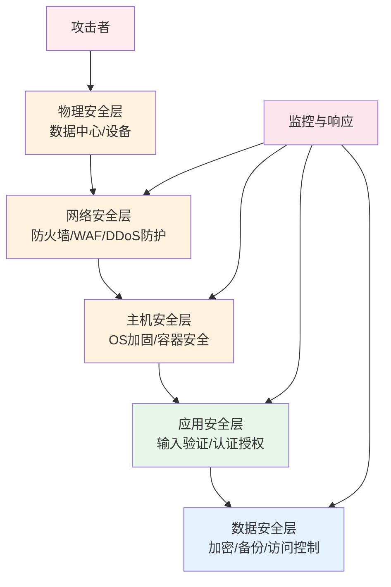
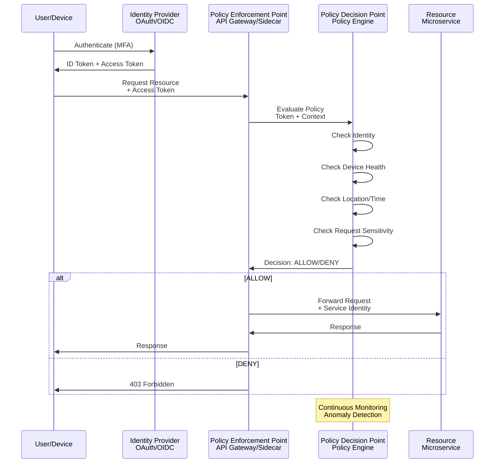
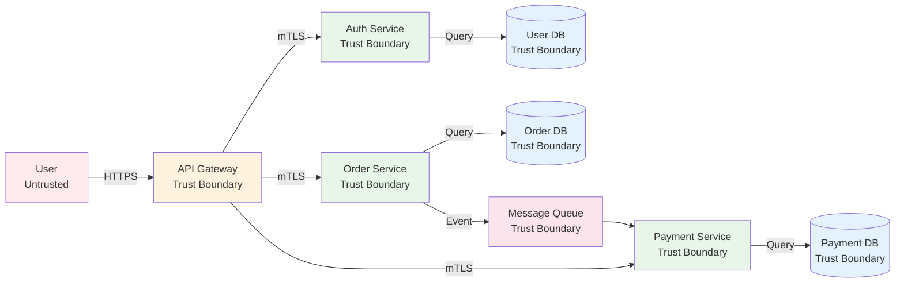
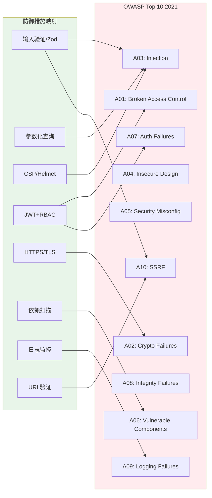

# 安全设计：纵深防御与零信任

## 引言

软件系统的安全性不是功能特性的附属品，而是贯穿架构全生命周期的基础性要求。将安全视为"上线前的检查清单"或"运维团队的职责"是一种危险的认识——历史反复证明，事后修补的安全漏洞往往代价高昂，且无法根除系统性风险。安全设计（Security by Design）的核心主张是：**安全性必须在系统设计的最早阶段就被纳入考量，并作为架构决策的一等约束条件**。

纵深防御（Defense in Depth）与零信任（Zero Trust）是当代安全架构的两大支柱原则。纵深防御借鉴军事防御思想，通过多层、异构的安全控制构建冗余保护体系，确保单层防线被突破时系统仍具备抵御能力。零信任则颠覆了传统的"内网可信、外网不可信"边界模型，主张在网络空间的每一个访问决策点都执行严格的身份验证与授权检查。

本文从安全设计的形式化原则出发，深入探讨威胁建模方法论、零信任架构的理论基础，并在TypeScript/JavaScript工程实践中展示HTTPS/TLS、CSP、JWT/OAuth、输入验证、依赖安全与Service Mesh的具体实现路径。

## 理论严格表述

### 安全设计的原则体系

安全设计原则为架构决策提供了伦理与工程层面的指导框架。以下是经过时间检验的核心原则：

**最小权限原则（Principle of Least Privilege, PoLP）**：每个进程、用户或组件仅应拥有完成其任务所必需的最小权限集合，且权限应在最短时间内有效。权限的授予应遵循"默认拒绝"（Deny by Default）策略，显式授权而非隐式允许。

**纵深防御（Defense in Depth）**：不依赖单一安全机制，而是通过多层、独立且异构的安全控制构建冗余防御体系。各层防御应具有不同的失效模式，攻击者必须同时突破多层防线才能达成目标。典型层次包括：物理安全、网络安全、主机安全、应用安全与数据安全。

**失败安全（Fail Secure / Fail Safe）**：系统在发生故障时应进入安全状态，而非开放状态。例如，认证服务不可用时，系统应拒绝所有访问请求而非允许匿名访问；防火墙规则解析失败时，应默认阻断流量而非放行。

**经济机制（Economy of Mechanism）**：安全机制应尽可能简单。复杂的系统拥有更多的攻击面与更难以验证的正确性。KISS原则（Keep It Simple, Stupid）在安全领域尤为关键。

**开放设计（Open Design）**：系统的安全性不应依赖于设计的保密性（即"隐匿即安全"Security Through Obscurity）。Kerckhoffs原则指出，密码系统的安全性应仅依赖于密钥的保密，而非算法的保密。这一原则推广到软件架构，意味着安全机制应经得起公开审视。

**最小公共面（Minimize Attack Surface）**：减少系统暴露给潜在攻击者的接口、功能与资源的数量。每个开放的端口、每个公开的API端点、每个接受的输入字段都是潜在的攻击向量。

**完全仲裁（Complete Mediation）**：系统应对每一次访问请求执行权限检查，而非依赖缓存的权限决策。检查机制应是不可绕过的（Non-bypassable）。

**职责分离（Separation of Duties）**：关键操作应要求多个独立主体的协作完成，防止单点权限滥用。例如，生产环境部署需要开发者提交与运维审批的双重授权。

### 威胁建模：STRIDE与DREAD

威胁建模（Threat Modeling）是系统化的安全分析方法，旨在识别、评估并缓解系统面临的潜在威胁。它是安全设计从原则到实践的关键桥梁。

**STRIDE**是由Microsoft提出的威胁分类框架，将威胁分为六类：

| 威胁类别 | 描述 | 对应的安全属性 |
|---------|------|--------------|
| **S**poofing（伪装） | 冒充其他用户、系统或身份 | 认证（Authentication） |
| **T**ampering（篡改） | 未经授权修改数据或代码 | 完整性（Integrity） |
| **R**epudiation（抵赖） | 否认已执行的操作 | 不可否认性（Non-repudiation） |
| **I**nformation Disclosure（信息泄露） | 向未授权主体暴露信息 | 机密性（Confidentiality） |
| **D**enial of Service（拒绝服务） | 耗尽资源使服务不可用 | 可用性（Availability） |
| **E**levation of Privilege（权限提升） | 获取超出授权级别的权限 | 授权（Authorization） |

STRIDE的分析过程通常以数据流图（Data Flow Diagram, DFD）为基础，识别系统中的信任边界（Trust Boundary），并对跨越边界的每个数据流、数据存储与进程应用STRIDE分类。

**DREAD**是威胁风险评估模型，从五个维度对威胁进行评分（1-10分）：

- **D**amage Potential（损害潜力）：成功利用后的破坏程度
- **R**eproducibility（可复现性）：攻击复现的难易程度
- **E**xploitability（可利用性）：攻击者利用该漏洞所需的技术水平与资源
- **A**ffected Users（影响用户）：受影响的用户数量或系统范围
- **D**iscoverability（可发现性）：攻击者发现该漏洞的难易程度

DREAD总分 = (D + R + E + A + D) / 5，通常以高（7-10）、中（4-6）、低（1-3）三级划分优先级。

### 零信任架构的形式化

零信任（Zero Trust）安全模型由Forrester Research的John Kindervag于2010年提出，其核心理念可概括为"**Never Trust, Always Verify**"（永不信任，始终验证）。NIST在SP 800-207中给出了零信任架构（Zero Trust Architecture, ZTA）的标准化定义。

零信任的形式化基础包含以下命题：

- **命题1（无隐式信任）**：网络位置（内网/外网）不构成信任的依据。无论请求来自互联网还是数据中心内部，都必须经过同等严格的验证。

- **命题2（最小权限访问）**：访问权限应基于"需要知道"（Need-to-Know）与"需要访问"（Need-to-Access）原则动态授予，且应持续评估而非一次性授权。

- **命题3（假设已突破）**：系统应假设攻击者已经存在于网络内部，安全控制的设计必须考虑内部威胁（Insider Threat）。

零信任架构的三大支柱为：

1. **用户/设备身份验证**：通过强多因素认证（MFA）、设备证书与行为分析验证请求者身份
2. **最小权限授权**：通过动态策略引擎基于上下文（用户身份、设备状态、位置、时间、请求敏感度）实时决策访问权限
3. **持续监控与验证**：对所有访问行为进行日志记录、分析与异常检测，一旦发现风险信号立即调整或撤销访问权限

零信任的网络实现依赖于**软件定义边界**（Software-Defined Perimeter, SDP）与**微隔离**（Micro-segmentation）技术，将传统的网络边界分解为围绕每个资源或服务的细粒度访问控制点。

### 安全边界理论

安全边界（Security Boundary）是系统中信任属性发生变化的边界线。跨越安全边界的数据流必须接受严格的安全控制。

**信任边界（Trust Boundary）**：区分受信任组件与不受信任组件的边界。例如，应用程序代码与外部用户输入之间的边界、内部微服务与第三方API之间的边界。

**数据边界（Data Boundary）**：区分不同敏感度级别数据的边界。例如，公开数据、内部数据、机密数据与受限数据应存储在不同的存储系统中，并应用不同的加密与访问控制策略。

**控制边界（Control Boundary）**：区分不同管理权限的边界。例如，开发环境、测试环境与生产环境应处于完全隔离的控制边界内，防止配置漂移与权限扩散。

### OWASP Top 10的风险模型

OWASP（Open Web Application Security Project）Top 10是Web应用安全风险的最权威清单，每三年更新一次。2021版的风险模型如下：

1. **A01:2021 - Broken Access Control**：访问控制策略配置错误或实现缺陷，允许用户访问未经授权的功能或数据。典型表现包括：通过修改URL参数访问他人资源、目录遍历、CORS配置错误、权限提升。

2. **A02:2021 - Cryptographic Failures**：敏感数据保护不足，包括明文传输、弱加密算法、硬编码密钥、不安全的密钥管理。

3. **A03:2021 - Injection**：不可信数据被发送到解释器作为命令或查询的一部分。SQL注入、NoSQL注入、命令注入、LDAP注入均属此类。

4. **A04:2021 - Insecure Design**：由于缺乏安全设计模式与威胁建模导致的系统性安全缺陷。与实现漏洞不同，设计缺陷无法通过简单修补解决。

5. **A05:2021 - Security Misconfiguration**：不安全的默认配置、不完整的临时配置、开放云存储、错误配置的HTTP头、冗余功能暴露。

6. **A06:2021 - Vulnerable and Outdated Components**：使用已知漏洞的组件（库、框架、模块），缺乏依赖管理与漏洞扫描机制。

7. **A07:2021 - Identification and Authentication Failures**：身份认证机制缺陷，包括弱密码策略、会话管理漏洞、凭证填充攻击、多因素认证缺失。

8. **A08:2021 - Software and Data Integrity Failures**：软件更新与关键数据缺乏完整性验证，依赖不安全的反序列化、不签名CI/CD管道。

9. **A09:2021 - Security Logging and Monitoring Failures**：日志记录不足、监控缺失、告警机制失效，导致攻击行为无法被及时发现与响应。

10. **A10:2021 - Server-Side Request Forgery (SSRF)**：服务器在未经适当验证的情况下向客户端提供的URL发起请求，可能被利用访问内部服务或外部恶意站点。

## 工程实践映射

### Web应用的安全层

Web应用的安全防御从传输层延伸至应用层，形成多层次的防护体系。

**HTTPS/TLS**：传输层安全是所有Web安全的基础。TLS 1.3是当前推荐的标准，它消除了TLS 1.2中的多个漏洞并减少了握手延迟。

```typescript
// Node.js中启用TLS 1.3与严格安全配置
import https from 'https';
import fs from 'fs';

const tlsOptions = {
  key: fs.readFileSync('server.key'),
  cert: fs.readFileSync('server.crt'),
  // 禁用旧版TLS与弱密码套件
  minVersion: 'TLSv1.3',
  maxVersion: 'TLSv1.3',
  // 如果使用TLS 1.2，配置安全的密码套件列表
  cipherSuites: 'TLS_AES_256_GCM_SHA384:TLS_CHACHA20_POLY1305_SHA256:TLS_AES_128_GCM_SHA256',
  // 启用HSTS预加载列表
  hsts: {
    maxAge: 31536000,
    includeSubDomains: true,
    preload: true
  }
};

https.createServer(tlsOptions, app).listen(443);
```

**内容安全策略（Content Security Policy, CSP）**：CSP通过HTTP头部告诉浏览器哪些动态资源可以加载与执行，是缓解XSS攻击的最有效机制。

```typescript
// Express中配置严格CSP
import helmet from 'helmet';

app.use(helmet.contentSecurityPolicy({
  directives: {
    defaultSrc: ["'self'"],
    scriptSrc: ["'self'", "'nonce-{random}'", "https://trusted-cdn.com"],
    styleSrc: ["'self'", "'unsafe-inline'"], // 尽量避免unsafe-inline
    imgSrc: ["'self'", "data:", "https:"],
    connectSrc: ["'self'", "https://api.example.com"],
    fontSrc: ["'self'"],
    objectSrc: ["'none'"],
    mediaSrc: ["'self'"],
    frameSrc: ["'none'"],
    upgradeInsecureRequests: []
  }
}));

// 为每个请求生成唯一nonce
app.use((req, res, next) => {
  res.locals.cspNonce = crypto.randomBytes(16).toString('base64');
  next();
});
```

**CORS（跨域资源共享）**：CORS配置应遵循最小权限原则，明确指定允许的源而非使用通配符。

```typescript
import cors from 'cors';

const allowedOrigins = [
  'https://app.example.com',
  'https://admin.example.com'
];

app.use(cors({
  origin: (origin, callback) => {
    // 允许无Origin头的请求（如移动App、curl）
    if (!origin) return callback(null, true);
    if (allowedOrigins.includes(origin)) {
      return callback(null, true);
    }
    callback(new Error('Not allowed by CORS'));
  },
  methods: ['GET', 'POST', 'PUT', 'DELETE'],
  allowedHeaders: ['Content-Type', 'Authorization'],
  credentials: true, // 允许携带cookie
  maxAge: 86400 // 预检请求缓存24小时
}));
```

**CSRF（跨站请求伪造）防护**：对于状态改变操作，应使用CSRF Token或SameSite Cookie策略。

```typescript
import csrf from 'csurf';

const csrfProtection = csrf({
  cookie: {
    httpOnly: true,
    secure: true,
    sameSite: 'strict'
  }
});

// 为路由启用CSRF保护
app.use('/api/*', csrfProtection);

// 向客户端提供CSRF Token
app.get('/api/csrf-token', csrfProtection, (req, res) => {
  res.json({ csrfToken: req.csrfToken() });
});
```

**XSS（跨站脚本）防护**：除CSP外，应在输出编码与输入验证两个层面防御XSS。

```typescript
// 使用DOMPurify净化HTML输入（服务端渲染场景）
import DOMPurify from 'isomorphic-dompurify';

function sanitizeHtml(input: string): string {
  return DOMPurify.sanitize(input, {
    ALLOWED_TAGS: ['b', 'i', 'em', 'strong', 'a'],
    ALLOWED_ATTR: ['href']
  });
}

// Express中全局转义输出
import escapeHtml from 'escape-html';

app.use((req, res, next) => {
  const originalJson = res.json;
  res.json = function(data) {
    // 递归转义字符串值（仅示例，生产环境应使用专用序列化库）
    const escaped = deepEscapeStrings(data);
    return originalJson.call(this, escaped);
  };
  next();
});
```

### JWT/OAuth 2.0/OpenID Connect的实现

身份认证与授权是现代Web应用安全的核心环节。JWT（JSON Web Token）、OAuth 2.0与OpenID Connect构成了现代身份协议栈。

**JWT的安全实现**：JWT由Header、Payload与Signature三部分组成，通过HMAC或RSA/ECDSA签名保证完整性。

```typescript
import jwt from 'jsonwebtoken';
import { createPublicKey, createPrivateKey } from 'crypto';

// 使用RS256（非对称算法）而非HS256（对称算法）
// 优势：认证服务持有私钥签名，资源服务仅需公钥验证，降低密钥泄露影响面

interface TokenPayload {
  sub: string;        // 用户ID
  iss: string;        // 签发者
  aud: string;        // 受众
  iat: number;        // 签发时间
  exp: number;        // 过期时间
  scope: string;      // 权限范围
  jti: string;        // 唯一标识（用于Token黑名单）
}

class TokenService {
  private privateKey: string;
  private publicKey: string;
  private readonly ACCESS_TOKEN_TTL = 900; // 15分钟
  private readonly REFRESH_TOKEN_TTL = 604800; // 7天

  constructor(privateKeyPem: string, publicKeyPem: string) {
    this.privateKey = privateKeyPem;
    this.publicKey = publicKeyPem;
  }

  generateAccessToken(userId: string, scope: string): string {
    const now = Math.floor(Date.now() / 1000);
    const payload: TokenPayload = {
      sub: userId,
      iss: 'auth.example.com',
      aud: 'api.example.com',
      iat: now,
      exp: now + this.ACCESS_TOKEN_TTL,
      scope,
      jti: crypto.randomUUID()
    };

    return jwt.sign(payload, this.privateKey, { algorithm: 'RS256' });
  }

  verifyToken(token: string): TokenPayload {
    try {
      return jwt.verify(token, this.publicKey, {
        algorithms: ['RS256'],
        issuer: 'auth.example.com',
        audience: 'api.example.com',
        complete: false
      }) as TokenPayload;
    } catch (err) {
      throw new Error('Invalid or expired token');
    }
  }
}

// Express认证中间件
function authenticateToken(tokenService: TokenService) {
  return (req: Request, res: Response, next: NextFunction) => {
    const authHeader = req.headers.authorization;
    const token = authHeader?.split(' ')[1]; // Bearer TOKEN

    if (!token) {
      return res.status(401).json({ error: 'Access token required' });
    }

    try {
      const payload = tokenService.verifyToken(token);
      req.user = payload;
      next();
    } catch {
      return res.status(403).json({ error: 'Invalid or expired token' });
    }
  };
}
```

**OAuth 2.0授权码流程（Authorization Code Flow with PKCE）**：这是浏览器端应用最安全的OAuth流程，PKCE（Proof Key for Code Exchange）防止授权码拦截攻击。

```typescript
// 服务端：OAuth 2.0 Token端点实现（简化版）
import { generateCodeVerifier, generateCodeChallenge } from 'oauth2-pkce';

// 客户端：生成PKCE参数
const codeVerifier = generateCodeVerifier();
const codeChallenge = generateCodeChallenge(codeVerifier);

// 重定向到授权端点
const authUrl = new URL('https://auth.example.com/oauth/authorize');
authUrl.searchParams.set('response_type', 'code');
authUrl.searchParams.set('client_id', CLIENT_ID);
authUrl.searchParams.set('redirect_uri', REDIRECT_URI);
authUrl.searchParams.set('scope', 'read write');
authUrl.searchParams.set('state', generateState()); // CSRF防护
authUrl.searchParams.set('code_challenge', codeChallenge);
authUrl.searchParams.set('code_challenge_method', 'S256');

// 服务端：Token端点验证PKCE
app.post('/oauth/token', async (req, res) => {
  const { grant_type, code, redirect_uri, client_id, code_verifier } = req.body;

  if (grant_type !== 'authorization_code') {
    return res.status(400).json({ error: 'unsupported_grant_type' });
  }

  // 1. 验证授权码
  const authCode = await validateAuthorizationCode(code);
  if (!authCode || authCode.expiresAt < new Date()) {
    return res.status(400).json({ error: 'invalid_grant' });
  }

  // 2. 验证PKCE（关键安全步骤）
  const expectedChallenge = generateCodeChallenge(code_verifier);
  if (authCode.codeChallenge !== expectedChallenge) {
    return res.status(400).json({ error: 'invalid_grant' });
  }

  // 3. 验证client_id与redirect_uri
  if (authCode.clientId !== client_id || authCode.redirectUri !== redirect_uri) {
    return res.status(400).json({ error: 'invalid_grant' });
  }

  // 4. 发放Token
  const tokens = await generateTokens(authCode.userId, authCode.scope);

  // 5. 使授权码失效（一次性使用）
  await revokeAuthorizationCode(code);

  res.json(tokens);
});
```

### Node.js的安全实践

Node.js应用的攻击面包括HTTP层、依赖层、运行时层与数据层。以下展示关键安全控制的具体实现。

**Helmet中间件**：Helmet通过设置一系列HTTP安全头，显著降低多种常见攻击的风险。

```typescript
import helmet from 'helmet';

app.use(helmet({
  // 内容安全策略
  contentSecurityPolicy: {
    directives: {
      defaultSrc: ["'self'"],
      scriptSrc: ["'self'", "'unsafe-inline'"],
      styleSrc: ["'self'", "'unsafe-inline'"],
      imgSrc: ["'self'", "data:", "https:"]
    }
  },
  // 强制HTTPS（HSTS）
  hsts: {
    maxAge: 31536000,
    includeSubDomains: true,
    preload: true
  },
  // 禁用X-Powered-By头（信息泄露）
  hidePoweredBy: true,
  // X-Frame-Options：防止点击劫持
  frameguard: { action: 'deny' },
  // X-Content-Type-Options：防止MIME类型嗅探
  noSniff: true,
  // X-XSS-Protection（现代浏览器已由CSP取代，但保留作为纵深防御）
  xssFilter: true,
  // Referrer-Policy
  referrerPolicy: { policy: 'strict-origin-when-cross-origin' },
  // Permissions-Policy（原Feature-Policy）
  permissionsPolicy: {
    features: {
      camera: ["'none'"],
      microphone: ["'none'"],
      geolocation: ["'none'"]
    }
  }
}));
```

**速率限制（Rate Limiting）**：防止暴力破解、DDoS与资源耗尽攻击。

```typescript
import rateLimit from 'express-rate-limit';
import RedisStore from 'rate-limit-redis';
import { Redis } from 'ioredis';

const redis = new Redis(process.env.REDIS_URL);

// 通用API限流：每IP每分钟100请求
const generalLimiter = rateLimit({
  store: new RedisStore({ sendCommand: (...args) => redis.call(...args) }),
  windowMs: 60 * 1000,
  max: 100,
  standardHeaders: true,
  legacyHeaders: false,
  message: { error: 'Too many requests, please try again later.' },
  // 跳过已认证用户的限流（或设置更高阈值）
  skip: (req) => !!req.user
});

// 认证端点严格限流：每IP每15分钟5次登录尝试
const authLimiter = rateLimit({
  store: new RedisStore({ sendCommand: (...args) => redis.call(...args) }),
  windowMs: 15 * 60 * 1000,
  max: 5,
  skipSuccessfulRequests: true, // 成功登录不计入限流
  message: { error: 'Too many login attempts. Please try again after 15 minutes.' }
});

app.use('/api/', generalLimiter);
app.use('/api/auth/login', authLimiter);
```

**输入验证**：所有外部输入（请求体、查询参数、路径参数、Header）必须经过严格的类型校验与业务规则验证。Zod是TypeScript生态中最流行的Schema验证库。

```typescript
import { z } from 'zod';
import { fromZodError } from 'zod-validation-error';

// 定义严格的输入Schema
const createUserSchema = z.object({
  email: z.string()
    .min(5)
    .max(254)
    .email('Invalid email format')
    .transform(val => val.toLowerCase().trim()),
  password: z.string()
    .min(12, 'Password must be at least 12 characters')
    .max(128)
    .regex(/[A-Z]/, 'Must contain uppercase letter')
    .regex(/[a-z]/, 'Must contain lowercase letter')
    .regex(/[0-9]/, 'Must contain digit')
    .regex(/[^A-Za-z0-9]/, 'Must contain special character'),
  username: z.string()
    .min(3)
    .max(30)
    .regex(/^[a-zA-Z0-9_-]+$/, 'Only alphanumeric, underscore, and hyphen allowed')
});

type CreateUserDto = z.infer<typeof createUserSchema>;

// 验证中间件
function validateBody(schema: z.ZodSchema) {
  return (req: Request, res: Response, next: NextFunction) => {
    const result = schema.safeParse(req.body);
    if (!result.success) {
      const error = fromZodError(result.error);
      return res.status(400).json({
        error: 'Validation failed',
        details: error.details
      });
    }
    req.body = result.data;
    next();
  };
}

app.post('/api/users', validateBody(createUserSchema), async (req, res) => {
  const dto: CreateUserDto = req.body;
  // dto已通过类型安全验证，可直接使用
  const user = await userService.create(dto);
  res.status(201).json(user);
});
```

**SQL注入防护**：使用参数化查询（Prepared Statements）是防御SQL注入的根本措施。Prisma、TypeORM等ORM默认使用参数化查询。

```typescript
// 绝对禁止：字符串拼接SQL
// const query = `SELECT * FROM users WHERE email = '${email}'`; // 危险！

// 正确做法：参数化查询（Prisma）
const user = await prisma.user.findUnique({
  where: { email: dto.email }
});

// 正确做法：参数化查询（pg原生）
const result = await pool.query(
  'SELECT * FROM users WHERE email = $1 AND active = $2',
  [email, true]
);
```

### 前端安全

前端安全不仅关乎用户体验，也直接影响后端安全。恶意脚本一旦在前端执行，可以窃取Token、伪造请求、劫持用户会话。

**DOM-based XSS防护**：现代前端框架（React、Vue、Angular）通过自动转义插值表达式中的HTML，默认防御了大部分反射型XSS。但危险在于`v-html`（Vue）或`dangerouslySetInnerHTML`（React）等API。

```vue
<!-- Vue 3: 安全实践 -->
<template>
  <div>
    <!-- 安全：自动转义 -->
    <p>{{ userInput }}</p>

    <!-- 危险：仅对完全可信的内容使用 -->
    <div v-html="sanitizedContent"></div>
  </div>
</template>

<script setup lang="ts">
import { computed } from 'vue';
import DOMPurify from 'dompurify';

const props = defineProps<{
  userInput: string;
  richContent: string;
}>();

// 即使使用v-html，也先经过DOMPurify净化
const sanitizedContent = computed(() =>
  DOMPurify.sanitize(props.richContent, {
    USE_PROFILES: { html: true }
  })
);
</script>
```

**Trusted Types**：Trusted Types API强制要求所有DOM XSS敏感API仅接受经过特定策略处理的对象，而非原始字符串。

```typescript
// 配置Trusted Types策略
if (window.trustedTypes && window.trustedTypes.createPolicy) {
  window.trustedTypes.createPolicy('default', {
    createHTML: (input: string) => DOMPurify.sanitize(input),
    createScriptURL: (input: string) => {
      if (!input.startsWith('https://trusted-cdn.com/')) {
        throw new Error('Untrusted script URL');
      }
      return input;
    }
  });
}

// 在CSP中启用Trusted Types
// Content-Security-Policy: require-trusted-types-for 'script'; trusted-types default;
```

### 依赖安全

现代JavaScript应用的依赖树可能包含数千个包，任何一个包的漏洞都可能被利用。依赖安全管理是纵深防御的关键层次。

**npm audit**：npm内置的漏洞扫描工具，基于GitHub Advisory Database检测已知漏洞。

```bash
# 扫描项目依赖漏洞
npm audit

# 自动修复非破坏性更新
npm audit fix

# 仅生产依赖扫描
npm audit --production

# 以JSON格式输出（用于CI集成）
npm audit --json
```

**Snyk**：专业的依赖安全平台，提供更全面的漏洞数据库与修复建议。

```bash
# 安装Snyk CLI
npm install -g snyk

# 认证与扫描
snyk auth
snyk test

# 监控项目（持续监控新漏洞）
snyk monitor

# 修复漏洞
snyk fix
```

**Dependabot**：GitHub提供的自动化依赖更新服务，可配置为自动创建Pull Request修复漏洞。

```yaml
# .github/dependabot.yml
version: 2
updates:
  - package-ecosystem: "npm"
    directory: "/"
    schedule:
      interval: "daily"
    open-pull-requests-limit: 10
    allow:
      - dependency-type: "production"
    # 自动合并补丁版本的安全更新
    auto-merge: true
```

**pnpm overrides/ npm overrides**：强制覆盖依赖树中的特定版本，消除传递依赖中的已知漏洞。

```json
// package.json
{
  "overrides": {
    "lodash": "^4.17.21",
    "minimatch": "^9.0.0",
    "semver": "^7.5.2"
  }
}
```

**Lockfile完整性**：确保`package-lock.json`、`yarn.lock`或`pnpm-lock.yaml`被版本控制，并在CI中验证lockfile未被篡改。

```bash
# CI中验证lockfile一致性
npm ci --audit

# 或pnpm
pnpm install --frozen-lockfile
```

### Secret管理

凭证、API密钥、加密密钥等Secret不应硬编码在源代码中，也不应以明文形式存储在环境变量中。

**HashiCorp Vault**：企业级Secret管理解决方案，支持动态凭证、自动轮换与细粒度访问控制。

```typescript
import { VaultClient } from '@hashicorp/vault-client';

const vault = new VaultClient({
  address: 'https://vault.example.com',
  token: process.env.VAULT_TOKEN // 仅初始认证使用
});

// 动态数据库凭证
async function getDatabaseCredentials(): Promise<{ username: string; password: string }> {
  const response = await vault.read('database/creds/app-role');
  return {
    username: response.data.username,
    password: response.data.password // 自动轮换的临时凭证
  };
}

// 获取API密钥
async function getApiKey(service: string): Promise<string> {
  const response = await vault.read(`secret/data/api-keys/${service}`);
  return response.data.data.key;
}
```

**AWS Secrets Manager / Azure Key Vault**：云原生Secret管理服务，与IAM体系深度集成。

```typescript
// AWS Secrets Manager (via AWS SDK v3)
import { SecretsManagerClient, GetSecretValueCommand } from '@aws-sdk/client-secrets-manager';

const secretsClient = new SecretsManagerClient({ region: 'us-east-1' });

async function getJwtSecret(): Promise<string> {
  const response = await secretsClient.send(
    new GetSecretValueCommand({ SecretId: 'prod/jwt-secret' })
  );
  return response.SecretString!;
}
```

**环境变量加密**：在无法使用专用Secret管理服务的场景下，可使用 sealed secrets 或 sops 加密环境变量文件。

```bash
# 使用Mozilla SOPS加密.env文件
sops --encrypt --in-place .env.production

# 在运行时解密（需要AWS KMS/GCP KMS/Azure Key Vault密钥）
sops --decrypt .env.production > .env
```

### 零信任在微服务中的实现

在微服务架构中实施零信任，意味着服务间的每一次通信都必须经过身份验证、授权与加密。

**mTLS（双向TLS）**：服务间通信不仅客户端验证服务器证书，服务器也验证客户端证书，实现双向身份认证。

```typescript
// Node.js中启用mTLS（基于grpc-js）
import * as grpc from '@grpc/grpc-js';
import * as fs from 'fs';

const serverCredentials = grpc.ServerCredentials.createSsl(
  fs.readFileSync('ca.crt'), // CA证书用于验证客户端
  [
    {
      cert_chain: fs.readFileSync('server.crt'),
      private_key: fs.readFileSync('server.key')
    }
  ],
  true // 要求客户端证书
);

const clientCredentials = grpc.credentials.createSsl(
  fs.readFileSync('ca.crt'),
  fs.readFileSync('client.key'),
  fs.readFileSync('client.crt')
);
```

**Service Mesh**：Istio、Linkerd等Service Mesh通过在Pod中注入Sidecar代理，自动实现服务间的mTLS、授权策略、流量监控与可观测性，无需修改应用代码。

```yaml
# Istio AuthorizationPolicy：零信任访问控制
apiVersion: security.istio.io/v1beta1
kind: AuthorizationPolicy
metadata:
  name: order-service-policy
  namespace: production
spec:
  selector:
    matchLabels:
      app: order-service
  action: ALLOW
  rules:
    - from:
        - source:
            principals: ["cluster.local/ns/production/sa/api-gateway"]
      to:
        - operation:
            methods: ["GET", "POST"]
            paths: ["/api/orders/*"]
      when:
        - key: request.auth.claims[scope]
          values: ["orders:read", "orders:write"]
```

**SPIFFE/SPIRE**：标准化的工作负载身份框架，为每个服务实例颁发短期X.509证书（SVID），实现细粒度的服务身份管理。

## Mermaid 图表

### 图表1：纵深防御层次模型



### 图表2：零信任架构中的访问决策流程



### 图表3：威胁建模数据流图（STRIDE分析）



### 图表4：OWASP Top 10风险矩阵与防御映射



## 理论要点总结

1. **安全设计不是功能附加，而是架构约束**。最小权限、纵深防御、失败安全、经济机制、开放设计与最小公共面六大原则应在每一个架构决策中被主动考量，而非事后检查。

2. **威胁建模是安全设计从原则到实践的关键桥梁**。STRIDE分类框架帮助系统性地识别六类威胁，DREAD评估模型帮助量化风险优先级。威胁建模应在系统设计初期进行，并随着系统演化持续更新。

3. **零信任颠覆了传统的网络边界信任模型**。**Never Trust, Always Verify**意味着身份验证与授权发生在每一次访问请求时，而非仅在网络边界处。软件定义边界、微隔离与持续监控是零信任的技术实现支柱。

4. **OWASP Top 10是Web应用安全风险的基准参考**，但不应被视为唯一的安全检查清单。A04"Insecure Design"特别强调了系统性设计缺陷的风险，这些缺陷无法通过简单的代码修补解决，必须从架构层面预防。

5. **HTTPS/TLS、CSP、CORS、CSRF与XSS防护构成了Web应用的安全基线**。Helmet中间件在Express生态中提供了一站式的HTTP安全头配置，但开发者仍需理解每个头背后的安全语义，避免盲目复制配置。

6. **JWT的安全使用依赖于算法选择（优先RS256/ES256）、短期有效期、安全存储与传输**。OAuth 2.0授权码流程配合PKCE是当前浏览器端应用最安全的认证流程。Token刷新机制与黑名单机制需要在安全性与用户体验之间取得平衡。

7. **依赖安全是纵深防御中不可忽视的层次**。npm audit、Snyk与Dependabot提供了自动化的漏洞检测与修复能力，但开发团队仍需建立依赖审查流程，避免引入未经审计的依赖。

8. **零信任在微服务中的实现依赖于mTLS、Service Mesh与工作负载身份（SPIFFE/SPIRE）**。服务间通信的默认假设应是"所有流量都可能被窃听或篡改"，加密与双向认证不是可选项而是必选项。

## 参考资源

1. OWASP Foundation. *OWASP Top 10:2021*. [https://owasp.org/Top10/](https://owasp.org/Top10/)

2. NIST. *Zero Trust Architecture (SP 800-207)*. National Institute of Standards and Technology, 2020. [https://csrc.nist.gov/publications/detail/sp/800-207/final](https://csrc.nist.gov/publications/detail/sp/800-207/final)

3. Shostack, Adam. *Threat Modeling: Designing for Security*. Wiley, 2014.

4. OWASP Foundation. *OWASP Cheat Sheet Series*. [https://cheatsheetseries.owasp.org/](https://cheatsheetseries.owasp.org/)

5. Kindervag, John. *No More Chewy Centers: Introducing The Zero Trust Model Of Information Security*. Forrester Research, 2010.

6. Mozilla. *Web Security Guidelines*. MDN Web Docs. [https://developer.mozilla.org/en-US/docs/Web/Security](https://developer.mozilla.org/en-US/docs/Web/Security)

7. Helmet.js. *Helmet Documentation: Secure Express Apps*. [https://helmetjs.github.io/](https://helmetjs.github.io/)

8. IETF. *OAuth 2.0 Security Best Current Practice (draft-ietf-oauth-security-topics)*. [https://datatracker.ietf.org/doc/html/draft-ietf-oauth-security-topics](https://datatracker.ietf.org/doc/html/draft-ietf-oauth-security-topics)
