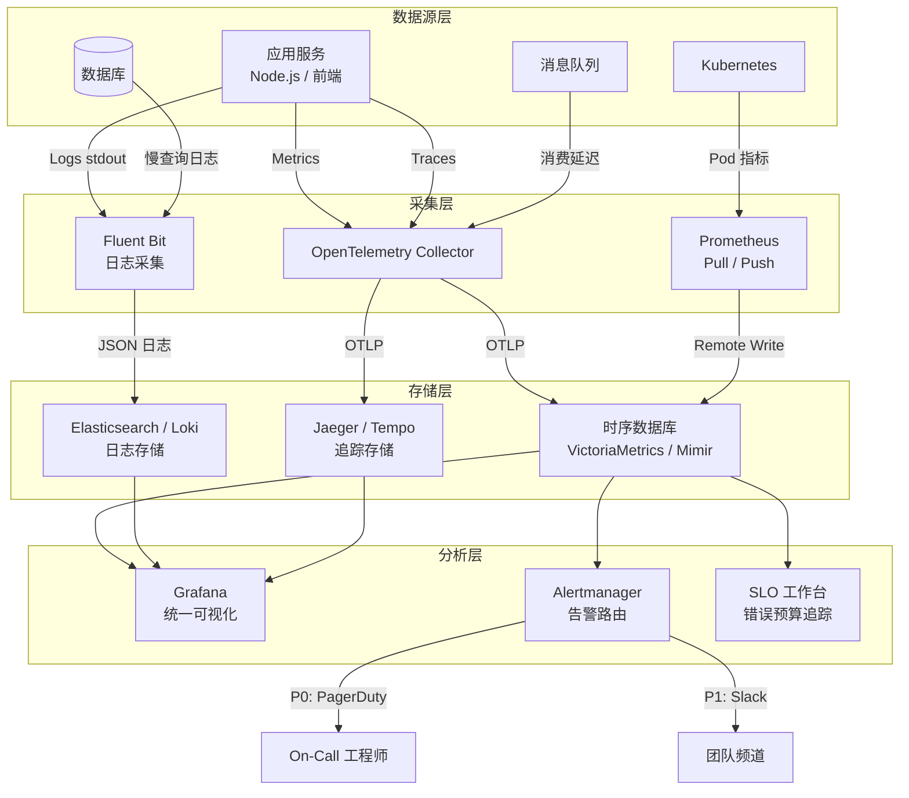
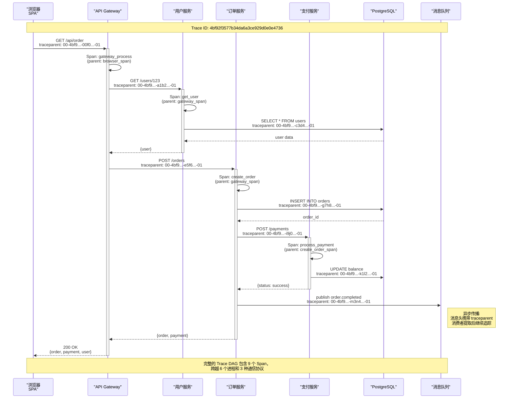
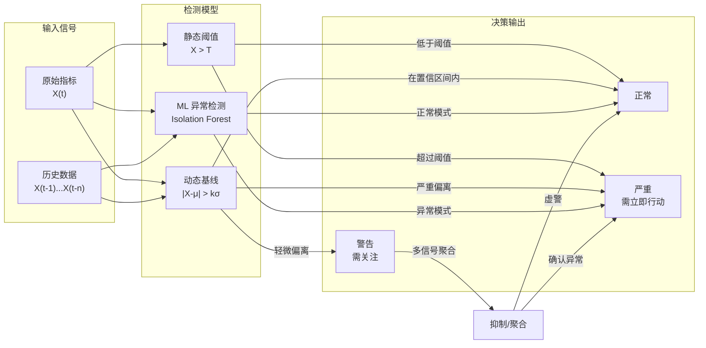

# 可观测性设计：Metrics/Logs/Traces

## 引言

在现代分布式系统中，服务的数量、调用链路的复杂度以及部署环境的动态性已达到前所未有的程度。当生产环境出现故障时，传统的调试手段——登录服务器查看日志、在本地复现问题——往往变得不切实际甚至完全不可能。系统内部的运行状态如同一个黑箱，开发者只能看到输入和输出，却无法理解中间发生了什么。**可观测性（Observability）** 正是为了解决这个问题而诞生的工程学科。

可观测性的概念并非软件工程独有，它根植于**控制理论（Control Theory）**。在控制理论中，可观测性描述的是：能否仅通过系统的输出信号，在有限时间内推断出其内部状态。这一数学概念被巧妙地映射到软件系统中，形成了我们今天熟知的"可观测性三大支柱"——Metrics（指标）、Logs（日志）和 Traces（追踪）。然而，仅有数据收集是不够的。如何将原始信号转化为可操作的洞察？如何定义服务的可靠性目标？如何在海量告警中避免"告警疲劳"？这些问题需要更严格的理论框架和经过验证的工程实践。

本文采用**双轨并行**的叙述方式：首先，从控制理论、形式化方法和统计学的角度，严格阐述可观测性的理论基础；随后，将这些理论映射到 JavaScript/TypeScript 生态的具体技术栈中，展示如何在 Node.js 后端和前端浏览器环境中构建生产级的可观测性体系。

---

## 理论严格表述

### 控制理论中的可观测性

在控制理论中，一个线性时不变系统可以用状态空间方程描述：

```
ẋ(t) = A·x(t) + B·u(t)
y(t) = C·x(t) + D·u(t)
```

其中，`x(t)` 是系统的内部状态向量，`u(t)` 是输入向量，`y(t)` 是输出向量。矩阵 `A`、`B`、`C`、`D` 分别描述状态转移、输入影响、输出映射和直接传递关系。**可观测性（Observability）** 的严格定义是：如果在任意初始时刻 `t₀`，存在有限时间 `t₁ > t₀`，使得通过观测输出 `y(t)` 在区间 `[t₀, t₁]` 上的值，能够唯一确定初始状态 `x(t₀)`，则称该系统是完全可观测的。

判定可观测性的经典判据是**可观测性矩阵（Observability Matrix）** `O` 的秩条件：

```
O = [C; CA; CA²; ...; CA^(n-1)]
```

若 `rank(O) = n`（状态维度），则系统完全可观测。这一数学条件告诉我们：**可观测性不是观测工具的属性，而是系统本身的结构属性**。如果一个系统的设计使得内部状态无法通过输出推断，那么无论投入多少监控工具，都无法获得真正的可观测性。

将这一概念映射到软件系统：

- **系统状态 `x(t)`**：服务的内部变量、连接池状态、内存分布、缓存命中率等。
- **输入 `u(t)`**：传入的 HTTP 请求、消息队列的消费事件、定时任务的触发信号。
- **输出 `y(t)`**：响应状态码、响应延迟、错误日志、业务指标计数。

软件系统的可观测性设计，本质上是在**系统设计层面**确保 `C` 矩阵（输出映射）能够覆盖足够的状态维度。这意味着我们需要在关键路径上主动暴露内部状态，而不是故障发生后才事后补救。

### 可观测性三大支柱的形式化

在软件工程领域，可观测性通常被归纳为三大支柱。尽管这一分类法在实际应用中存在争议（有些学者主张统一模型而非三大支柱），但它仍然是理解可观测性数据类型的有效框架。

#### Metrics（指标）：时间序列聚合信号

Metrics 是对系统行为的**聚合统计量**，以时间序列的形式存储。其形式化表示为：

```
M = {(t₁, v₁), (t₂, v₂), ..., (tₙ, vₙ)}
```

其中 `tᵢ` 是时间戳，`vᵢ` 是在该时间窗口内聚合的数值。Metrics 的核心操作包括：

- **聚合（Aggregation）**：`SUM`、`COUNT`、`AVG`、`PERCENTILE` 等。
- **降采样（Downsampling）**：将高频率原始数据聚合为低频率存储，降低存储成本。
- **标签维度化（Dimensional Labeling）**：通过键值对标签（如 `method=GET`, `status=200`, `endpoint=/api/users`）将一维时间序列扩展为高维数据立方体。

Metrics 的数学本质是一个**离散时间随机过程**的采样。Prometheus 等系统使用多维数据模型，一个时间序列由指标名称和一组标签唯一确定：

```
TS = {metric_name, label₁=v₁, label₂=v₂, ...}
```

#### Logs（日志）：离散事件记录

Logs 是系统运行过程中产生的**离散事件流**，每个日志条目通常包含时间戳、日志级别、消息内容和上下文元数据。形式化地，一条结构化日志可以表示为：

```
Lᵢ = (timestamp, severity, message, context)
```

其中 `context` 是一个键值对集合，包含 `trace_id`、`span_id`、`user_id`、`request_id` 等上下文信息。Logs 的核心价值在于**保留事件的原始细节**，这是 Metrics 在聚合过程中丢失的信息。

从信息论的角度，Logs 是系统的**最大熵输出**。它们包含了最丰富的上下文信息，但也带来了最高的存储和处理成本。因此，日志策略需要在**详细程度**和**经济可行性**之间做出权衡。

#### Traces（追踪）：因果关系的因果图

Traces 描述请求在分布式系统中的**完整传播路径**。一个 Trace 是由一组 Spans 构成的**有向无环图（DAG）**，其中边表示因果或父子关系。

形式化定义：

- **Span（跨度）**：`S = (span_id, trace_id, parent_id, operation_name, start_time, duration, tags, logs)`
- **Trace（追踪）**：`T = (S, R)`，其中 `S` 是 Span 集合，`R ⊆ S × S` 是表示父子关系的有序对集合。
- **Context Propagation（上下文传播）**：在进程间和线程间传递 `trace_id` 和 `span_id` 的机制，确保跨服务调用的因果关系得以保留。

Traces 的数学模型本质上是一个**因果图（Causal Graph）**。Jaeger 和 Zipkin 等系统实现了这一模型，并通过 `traceparent` 和 `tracestate` HTTP 头在请求链中传播上下文。

### 分布式追踪的形式化模型

分布式追踪的核心挑战是**在无共享状态的分布式系统中重建因果关系**。这需要一个全局唯一的 Trace ID 和层次化的 Span 模型。

#### Span 的生命周期模型

一个 Span 的生命周期可以用状态机描述：

```
[STARTED] → {annotate, log} → [STARTED]
[STARTED] → finish → [FINISHED]
```

在 `STARTED` 状态中，Span 可以接收 annotations（标签键值对）和 logs（结构化事件）。当操作完成时，Span 被标记为 `FINISHED`，其持续时间 `duration = end_time - start_time` 被计算并上报。

#### Context Propagation 的形式化

上下文传播需要解决两个层面的问题：

1. **进程内传播（In-Process Propagation）**：在同一线程或异步回调链中传递当前 Span 上下文。
2. **进程间传播（Inter-Process Propagation）**：通过标准化的传输格式在 HTTP/gRPC/消息队列等通道中传递上下文。

OpenTelemetry 定义了标准化的传播格式，基于 W3C Trace Context 标准：

- `traceparent` 头：`00-{trace_id}-{parent_span_id}-{trace_flags}`
- `tracestate` 头：键值对列表，用于携带供应商特定的上下文。

形式化地，传播函数 `propagate: Context × Carrier → Carrier` 将跟踪上下文注入到载体（如 HTTP 请求头）中；提取函数 `extract: Carrier → Context` 则从载体中恢复上下文。这两个函数必须满足**幂等性**和**单调性**：多次注入不应改变结果，提取后的上下文应包含至少与注入前相同的信息。

### SLI/SLO/SLA 的理论基础

Google SRE 方法论引入了服务可靠性管理的三层概念体系，这一体系建立在概率论和统计决策理论之上。

#### 服务水平指标（SLI）：可观测的随机变量

**SLI（Service Level Indicator）** 是服务某个可观测属性的**量化指标**。从统计学角度，SLI 是一个**随机变量** `X`，其取值随请求到达时间、系统负载、外部环境等因素变化。常见的 SLI 包括：

- 请求延迟：`X_latency = response_time`，通常关注其分布的分位数（p50, p95, p99）。
- 可用性：`X_availability = 1` 如果请求成功，`0` 如果失败。
- 错误率：`X_error_rate = failed_requests / total_requests`。

SLI 的选择必须满足**SMART 原则**：具体（Specific）、可衡量（Measurable）、可实现（Achievable）、相关（Relevant）、有时限（Time-bound）。

#### 服务水平目标（SLO）：概率约束

**SLO（Service Level Objective）** 是对 SLI 的**概率约束**，通常表示为：

```
P(X ≤ threshold) ≥ target_ratio
```

例如："99% 的请求延迟在 200ms 以内" 形式化为 `P(X_latency ≤ 200ms) ≥ 0.99`。这里的 `target_ratio` 称为**合规窗口（Compliance Window）**，通常以月度或季度为评估周期。

SLO 的本质是一个**统计假设检验**。在评估周期结束时，我们检验观测到的指标是否满足预设的概率约束。如果满足，服务被认为是"合规的"；否则需要触发根因分析和改进措施。

#### 服务水平协议（SLA）：合同化的 SLO

**SLA（Service Level Agreement）** 是将 SLO **合同化** 的结果，通常包含未达目标时的**经济处罚条款**。从博弈论的角度，SLA 是服务提供方和消费方之间的**契约均衡**，其设计需要在服务成本、客户满意度和商业风险之间取得平衡。

SRE 的一个核心洞见是：**错误预算（Error Budget） = 1 - SLO**。如果 SLO 要求 99.9% 的可用性，那么年错误预算为 `0.1% × 365 × 24 × 60 = 525.6 分钟`。错误预算的消耗速率决定了发布节奏：如果错误预算充足，可以加快发布；如果接近耗尽，则应暂停变更，优先稳定性。

### 告警设计的统计学原理

告警系统的设计需要平衡两个统计错误：

- **第一类错误（False Positive）**：系统正常但触发告警（虚警）。
- **第二类错误（False Negative）**：系统异常但未触发告警（漏警）。

#### 静态阈值模型的局限

最简单的告警模型是静态阈值：当指标 `X > threshold` 时触发。其决策规则为：

```
Alarm = I(X > threshold)
```

其中 `I(·)` 是指示函数。这种模型的问题在于：

1. **忽略基线波动**：系统的正常行为本身具有随机性，静态阈值无法适应流量高峰和低谷。
2. **维度灾难**：在多维指标空间中，为每个时间序列手动设置阈值不可扩展。
3. **滞后效应**：阈值过高导致漏警，阈值过低导致虚警。

#### 动态基线与异常检测

更高级的告警模型使用**动态基线（Dynamic Baseline）** 和**异常检测（Anomaly Detection）**：

1. **移动平均基线**：计算历史同期（如前一周同一时间）的移动平均值 `μ(t)` 和标准差 `σ(t)`，当 `|X(t) - μ(t)| > k·σ(t)` 时触发告警（`k` 通常为 2 或 3，对应 95% 或 99.7% 的置信区间）。
2. **指数加权移动平均（EWMA）**：`S_t = α·X_t + (1-α)·S_{t-1}`，对近期数据赋予更高权重。
3. **霍尔特-温特斯法（Holt-Winters）**：同时建模趋势和季节性，适用于具有周期性模式的指标。
4. **机器学习异常检测**：使用孤立森林（Isolation Forest）、变分自编码器（VAE）或 LSTM 自编码器学习正常行为模式，识别偏离模式的异常点。

从统计学的角度，动态基线方法本质上是**假设检验**的应用：原假设为"当前指标来自正常分布"，当观测值落入拒绝域时触发告警。告警的**敏感性（Sensitivity）** 和 **特异性（Specificity）** 需要通过 ROC 曲线进行权衡。

#### 告警疲劳的数学解释

告警疲劳（Alert Fatigue）是运维团队面临的核心挑战之一。其数学本质是**条件概率的误用**。设 `A` 为告警事件，`F` 为真实故障事件，则：

```
P(F|A) = P(A|F)·P(F) / P(A)
```

即使 `P(A|F)`（检测率）很高，如果 `P(F)`（基础故障率）很低且 `P(A)`（总告警率）很高，那么 **P(F|A)**（告警的真实性）可能极低。例如，若故障率 `P(F) = 0.001`，检测率 `P(A|F) = 0.99`，但虚警率 `P(A|¬F) = 0.1`，则：

```
P(A) = P(A|F)·P(F) + P(A|¬F)·P(¬F) = 0.99×0.001 + 0.1×0.999 ≈ 0.1009
P(F|A) = 0.99 × 0.001 / 0.1009 ≈ 0.0098
```

这意味着 **98% 以上的告警是虚警**。解决告警疲劳的关键在于：**提高告警的精确率（Precision = P(F|A)）**，而非仅仅提高召回率（Recall = P(A|F)）。SRE 的最佳实践包括：

- 仅对**可操作的（Actionable）** 症状告警，而非原因告警。
- 使用**多信号聚合**，单一指标的异常不足以触发告警。
- 实施**告警分级（Severity Levels）**，区分 P0（立即处理）和 P3（工作日处理）。

---

## 工程实践映射

### Node.js 可观测性技术栈

Node.js 运行时的异步、单线程事件循环模型为可观测性带来了独特的挑战。传统的线程级监控工具（如 Java JMX）无法直接适用，需要采用专门的技术栈。

#### Metrics：Prometheus + Grafana

**Prometheus** 已成为云原生 Metrics 的事实标准。其架构基于"拉取（Pull）"模型：Prometheus 服务器定期从被监控目标的 `/metrics` HTTP 端点抓取指标数据。

在 Node.js 应用中，使用 `prom-client` 库暴露指标：

```javascript
const client = require('prom-client');
const express = require('express');

// 创建计数器（单调递增的累计值）
const httpRequestsTotal = new client.Counter({
  name: 'http_requests_total',
  help: 'Total number of HTTP requests',
  labelNames: ['method', 'status_code', 'route']
});

// 创建直方图（观测值分布）
const httpRequestDuration = new client.Histogram({
  name: 'http_request_duration_seconds',
  help: 'Duration of HTTP requests in seconds',
  labelNames: ['method', 'route'],
  buckets: [0.01, 0.05, 0.1, 0.5, 1, 2, 5]
});

const app = express();

app.use((req, res, next) => {
  const end = httpRequestDuration.startTimer();
  res.on('finish', () => {
    end({ method: req.method, route: req.route?.path || 'unknown' });
    httpRequestsTotal.inc({
      method: req.method,
      status_code: res.statusCode,
      route: req.route?.path || 'unknown'
    });
  });
  next();
});

app.get('/metrics', async (req, res) => {
  res.set('Content-Type', client.register.contentType);
  res.end(await client.register.metrics());
});
```

**关键陷阱**：在 Express 中间件中访问 `req.route.path` 时，需要在路由处理之后（即 `res.on('finish')` 中）才能获取正确的路由模板，否则会得到 `undefined`。如果直接对原始 URL 进行标签化，会导致**指标基数爆炸（Cardinality Explosion）**：每个唯一的路径参数（如 `/users/123`、`/users/456`）都会生成新的时间序列，迅速耗尽 Prometheus 的存储和查询资源。

**Grafana** 作为可视化层，支持 PromQL 查询语言。典型的延迟 SLO 监控面板使用 `histogram_quantile` 函数：

```promql
histogram_quantile(0.99,
  sum(rate(http_request_duration_seconds_bucket[5m])) by (le, route)
)
```

#### Logs：ELK/EFK 与结构化日志

Node.js 的日志传统上通过 `console.log` 输出到 stdout，由外部日志收集器（如 Filebeat、Fluentd）转发到集中式存储。**结构化日志（Structured Logging）** 是现代最佳实践，要求日志以机器可解析的格式（通常为 JSON）输出：

```javascript
const winston = require('winston');

const logger = winston.createLogger({
  level: process.env.LOG_LEVEL || 'info',
  format: winston.format.combine(
    winston.format.timestamp(),
    winston.format.errors({ stack: true }),
    winston.format.json() // 输出 JSON 格式
  ),
  defaultMeta: { service: 'user-service', version: '1.2.3' },
  transports: [new winston.transports.Console()]
});

// 在请求上下文中关联日志
function createRequestLogger(req) {
  return logger.child({
    request_id: req.headers['x-request-id'] || generateUUID(),
    trace_id: req.headers['traceparent']?.split('-')[1],
    user_id: req.user?.id,
    method: req.method,
    path: req.path
  });
}
```

**日志级别设计**需要遵循语义约定：

- `DEBUG`：详细的调试信息，仅在开发环境启用。
- `INFO`：正常操作事件，如请求完成、定时任务触发。
- `WARN`：潜在问题，如降级服务、重试操作、速率限制触发。
- `ERROR`：影响请求处理的操作失败，如数据库连接超时、下游服务 5xx。
- `FATAL`：导致进程退出的严重错误。

**ELK Stack**（Elasticsearch + Logstash + Kibana）和 **EFK Stack**（Elasticsearch + Fluentd/Fluent Bit + Kibana）是经典的日志解决方案。在 Kubernetes 环境中，**Fluent Bit** 作为轻量级日志转发器，从容器 stdout 采集日志并推送到 Elasticsearch 或云托管服务（如 AWS OpenSearch、Datadog）。

#### Traces：Jaeger/Zipkin 与 OpenTelemetry

分布式追踪在微服务架构中至关重要。在 Node.js 生态中，**OpenTelemetry** 已逐渐成为标准化方案，取代了过去 Jaeger 和 Zipkin 各自为政的局面。

OpenTelemetry Node.js SDK 的配置示例：

```javascript
const { NodeSDK } = require('@opentelemetry/sdk-node');
const { getNodeAutoInstrumentations } = require('@opentelemetry/auto-instrumentations-node');
const { OTLPTraceExporter } = require('@opentelemetry/exporter-trace-otlp-http');
const { Resource } = require('@opentelemetry/resources');
const { SemanticResourceAttributes } = require('@opentelemetry/semantic-conventions');

const sdk = new NodeSDK({
  resource: new Resource({
    [SemanticResourceAttributes.SERVICE_NAME]: 'api-gateway',
    [SemanticResourceAttributes.SERVICE_VERSION]: '1.0.0',
    [SemanticResourceAttributes.DEPLOYMENT_ENVIRONMENT]: 'production'
  }),
  traceExporter: new OTLPTraceExporter({
    url: 'http://otel-collector:4318/v1/traces'
  }),
  instrumentations: [getNodeAutoInstrumentations()]
});

sdk.start();
```

`@opentelemetry/auto-instrumentations-node` 自动为常见的 Node.js 库（`http`、`express`、`mongodb`、`ioredis`、`pg` 等）注入追踪逻辑，无需手动修改业务代码。这通过**猴子补丁（Monkey Patching）** 实现：在模块加载时替换原始函数，包装为生成 Span 的代理函数。

对于手动追踪的自定义操作，使用 Tracer API：

```javascript
const { trace, SpanStatusCode } = require('@opentelemetry/api');

const tracer = trace.getTracer('my-service', '1.0.0');

async function processPayment(orderId, amount) {
  return tracer.startActiveSpan('process_payment', async (span) => {
    try {
      span.setAttribute('order.id', orderId);
      span.setAttribute('payment.amount', amount);

      // 子 Span：验证订单
      await tracer.startActiveSpan('validate_order', async (childSpan) => {
        childSpan.setAttribute('order.id', orderId);
        const order = await orderService.validate(orderId);
        childSpan.setStatus({ code: SpanStatusCode.OK });
        childSpan.end();
        return order;
      });

      // 子 Span：扣款
      const result = await tracer.startActiveSpan('charge_customer', async (childSpan) => {
        const paymentResult = await paymentGateway.charge(amount);
        childSpan.setAttribute('payment.transaction_id', paymentResult.id);
        childSpan.end();
        return paymentResult;
      });

      span.setStatus({ code: SpanStatusCode.OK });
      return result;
    } catch (error) {
      span.recordException(error);
      span.setStatus({
        code: SpanStatusCode.ERROR,
        message: error.message
      });
      throw error;
    } finally {
      span.end();
    }
  });
}
```

### 前端可观测性

前端可观测性传统上被忽视，但随着单页应用（SPA）复杂度的提升和用户体验对商业指标的直接影响，**Real User Monitoring（RUM）** 已成为必备能力。

#### Real User Monitoring（RUM）

RUM 通过收集真实用户的浏览器性能数据和交互数据，提供用户视角的可观测性。核心指标基于 Google 的 **Core Web Vitals**：

1. **LCP（Largest Contentful Paint）**：最大内容绘制时间，衡量加载性能。目标：`≤ 2.5s`。
2. **FID（First Input Delay）/ INP（Interaction to Next Paint）**：首次输入延迟 / 交互到下一次绘制，衡量交互响应性。目标：`≤ 200ms`。
3. **CLS（Cumulative Layout Shift）**：累积布局偏移，衡量视觉稳定性。目标：`≤ 0.1`。

这些指标通过 **Performance API** 和 **PerformanceObserver** 采集：

```javascript
// 观测 LCP
new PerformanceObserver((list) => {
  const entries = list.getEntries();
  const lastEntry = entries[entries.length - 1];
  reportMetric('LCP', lastEntry.startTime, {
    element: lastEntry.element?.tagName,
    url: lastEntry.url
  });
}).observe({ entryTypes: ['largest-contentful-paint'] });

// 观测 CLS
let clsValue = 0;
new PerformanceObserver((list) => {
  for (const entry of list.getEntries()) {
    if (!entry.hadRecentInput) {
      clsValue += entry.value;
    }
  }
  reportMetric('CLS', clsValue);
}).observe({ entryTypes: ['layout-shift'] });

// 观测 Long Tasks（阻塞主线程的任务）
new PerformanceObserver((list) => {
  for (const entry of list.getEntries()) {
    reportMetric('LongTask', entry.duration, {
      startTime: entry.startTime,
      attribution: entry.attribution?.map(a => a.containerSrc || a.containerName)
    });
  }
}).observe({ entryTypes: ['longtask'] });
```

#### Error Tracking

前端错误追踪需要捕获多种错误源：

```javascript
// 全局 JavaScript 错误
window.addEventListener('error', (event) => {
  reportError({
    type: 'javascript',
    message: event.message,
    filename: event.filename,
    lineno: event.lineno,
    colno: event.colno,
    stack: event.error?.stack,
    // 关联追踪上下文
    trace_id: getCurrentTraceId(),
    release: process.env.RELEASE_VERSION
  });
});

// 未处理的 Promise 拒绝
window.addEventListener('unhandledrejection', (event) => {
  reportError({
    type: 'promise_rejection',
    message: event.reason?.message || String(event.reason),
    stack: event.reason?.stack,
    trace_id: getCurrentTraceId()
  });
});

// Vue 3 错误处理器
app.config.errorHandler = (err, instance, info) => {
  reportError({
    type: 'vue',
    message: err.message,
    stack: err.stack,
    component: instance?.$options?.name || 'anonymous',
    lifecycle_hook: info,
    trace_id: getCurrentTraceId()
  });
};
```

**关键陷阱**：在 Vue 3 中，`errorHandler` 接收的 `info` 参数是一个字符串，如 `"render function"`、`"mounted hook"` 等。注意这里的 `info` 是字符串类型，不需要用尖括号包裹。但是如果在文档中提及 Vue 的 `<template>`、`<script>` 或 `<style>` 标签时，必须将其放在代码块中或用反引号包裹，否则 VitePress 会尝试将其解析为 Vue 组件。

#### 前端分布式追踪

前端追踪需要将浏览器端的 Span 与后端服务的 Span 关联到同一个 Trace 中。这通过 OpenTelemetry Web SDK 实现：

```javascript
import { WebTracerProvider } from '@opentelemetry/sdk-trace-web';
import { BatchSpanProcessor } from '@opentelemetry/sdk-trace-base';
import { OTLPTraceExporter } from '@opentelemetry/exporter-trace-otlp-http';
import { DocumentLoadInstrumentation } from '@opentelemetry/instrumentation-document-load';
import { FetchInstrumentation } from '@opentelemetry/instrumentation-fetch';
import { registerInstrumentations } from '@opentelemetry/instrumentation';
import { W3CTraceContextPropagator } from '@opentelemetry/core';

const provider = new WebTracerProvider();
provider.addSpanProcessor(new BatchSpanProcessor(new OTLPTraceExporter({
  url: '/v1/traces' // 通过同域代理转发到 OTLP 收集器
})));
provider.register({
  propagator: new W3CTraceContextPropagator()
});

registerInstrumentations({
  instrumentations: [
    new DocumentLoadInstrumentation(),
    new FetchInstrumentation({
      propagateTraceHeaderCorsUrls: [/.+/] // 向所有域名传播追踪头
    })
  ]
});
```

`FetchInstrumentation` 会自动为所有 `fetch` 请求注入 `traceparent` 头，确保前端发起的 API 调用能够生成 Span 并将上下文传播到后端服务。

### 分布式追踪在微服务中的实现

在微服务架构中，一个请求可能穿越数十个服务。追踪系统需要解决跨进程、跨协议、跨语言的上下文传播问题。

#### HTTP 传播：`traceparent` 与 `tracestate`

W3C Trace Context 标准定义了以下 HTTP 头：

```
traceparent: 00-4bf92f3577b34da6a3ce929d0e0e4736-00f067aa0ba902b7-01
tracestate: vendor1=value1,vendor2=value2
```

`traceparent` 的格式为：`{version}-{trace_id}-{parent_span_id}-{flags}`

- `version`：当前版本 `00`。
- `trace_id`：32 字符十六进制字符串，全局唯一标识整个追踪。
- `parent_span_id`：16 字符十六进制字符串，标识当前调用方的 Span。
- `flags`：8 位标志，最低位表示是否采样（`01` 表示采样，`00` 表示未采样）。

`tracestate` 用于携带供应商特定的扩展信息，遵循逗号分隔的键值对格式。多个供应商的键值对按优先级排序，键必须是唯一的小写字符串。

#### Baggage：携带业务上下文

**Baggage** 是 OpenTelemetry 中用于在追踪上下文中传递**业务属性**的机制。与 Span 属性不同，Baggage 会**传播到所有下游服务**。

```javascript
const { propagation, context } = require('@opentelemetry/api');

// 在当前上下文中设置 Baggage
const currentContext = context.active();
const baggage = propagation.createBaggage({
  'user.tier': { value: 'premium' },
  'tenant.id': { value: 'acme-corp' }
});
const newContext = propagation.setBaggage(currentContext, baggage);

// 在下游服务中读取 Baggage
const receivedBaggage = propagation.getBaggage(context.active());
const userTier = receivedBaggage.getEntry('user.tier')?.value;
```

Baggage 的典型应用场景包括：

- **多租户路由**：在网关层识别租户 ID，通过 Baggage 传递到所有下游服务，用于数据库分片或缓存隔离。
- **A/B 测试**：将实验组标识通过 Baggage 传递，确保同一用户的请求始终路由到相同的后端版本。
- **用户画像**：传递用户等级、区域等信息，用于下游服务的差异化处理。

**性能注意事项**：Baggage 会附加到每个出站请求中，因此不应包含大量数据或敏感信息（如 PII）。建议仅传递小型、非敏感的键值对。

#### 消息队列中的追踪传播

在异步消息架构中，追踪上下文需要通过消息元数据传播：

```javascript
const { context, propagation, trace } = require('@opentelemetry/api');

// 生产者：注入追踪上下文到消息头
async function publishOrderCreated(order) {
  const span = trace.getActiveSpan();
  const headers = {};
  propagation.inject(context.active(), headers, {
    set: (carrier, key, value) => { carrier[key] = value; }
  });

  await messageQueue.publish('order.created', {
    body: order,
    headers: {
      ...headers,
      'x-event-type': 'order.created',
      'x-event-version': '1.0'
    }
  });
}

// 消费者：提取追踪上下文
async function consumeOrderCreated(message) {
  const parentContext = propagation.extract(context.active(), message.headers, {
    get: (carrier, key) => carrier[key],
    keys: (carrier) => Object.keys(carrier)
  });

  const tracer = trace.getTracer('order-service');
  await tracer.startActiveSpan('consume_order_created', {
    kind: SpanKind.CONSUMER,
    links: [{ context: trace.getSpanContext(parentContext) }]
  }, parentContext, async (span) => {
    span.setAttribute('messaging.system', 'rabbitmq');
    span.setAttribute('messaging.destination', 'order.created');

    await processOrder(message.body);
    span.end();
  });
}
```

### 告警疲劳与 SRE 最佳实践

告警系统的终极目标是**减少平均恢复时间（MTTR）**，而非增加告警数量。Google SRE 团队提出了"少即是多"的告警哲学。

#### 可操作的告警原则

每条告警都必须回答三个问题：

1. **发生了什么？**（症状描述）
2. **影响了谁？**（影响范围）
3. **该怎么做？**（行动指引或运行手册链接）

如果一条告警无法提供明确的行动指引，它就应该被重新设计或删除。

#### 基于 SLO 的告警

传统的基于故障阈值的告警（如"CPU > 80%"）往往与用户体验脱节。SRE 推荐**基于 SLO 的告警**：当错误预算的消耗速率超过预期时触发告警。

例如，若月度 SLO 为 99.9%，则月度错误预算为 `0.001 × 30 × 24 × 60 = 43.2 分钟`。如果在前 6 天内已经消耗了 30 分钟的错误预算，则按此速率月度总消耗将达到 `30 × (30/6) = 150 分钟`，远超预算。此时应触发告警："错误预算消耗过快，预计将在 X 天内耗尽"。

PromQL 实现示例：

```promql
# 计算 5 分钟窗口内的错误率
(
  sum(rate(http_requests_total{status_code=~"5.."}[5m]))
  /
  sum(rate(http_requests_total[5m]))
) > 0.001 # 超过错误预算的等效速率
```

#### 告警抑制与聚合

使用 Alertmanager（Prometheus 生态）的告警路由功能实现抑制和聚合：

```yaml
route:
  group_by: ['alertname', 'cluster', 'service']
  group_wait: 30s
  group_interval: 5m
  repeat_interval: 12h
  receiver: 'default'
  routes:
    - match:
        severity: critical
      receiver: 'pagerduty'
      continue: true
    - match:
        severity: warning
      receiver: 'slack'

inhibit_rules:
  # 如果节点宕机，抑制该节点上所有 Pod 的告警
  - source_match:
      alertname: 'NodeDown'
    target_match_re:
      alertname: 'PodCrashLooping|HighPodRestartRate'
    equal: ['node']
```

---

## Mermaid 图表

### 可观测性三大支柱的数据流架构



### 分布式追踪的 Span 关系与传播



### 告警决策的统计模型



---

## 理论要点总结

1. **可观测性是系统的结构属性**：如同控制理论中的可观测性矩阵判据，软件系统的可观测性取决于其在设计阶段是否暴露了足够的内部状态信号。工具只能收集已有的信号，无法创造不存在的可观测性。

2. **三大支柱各有其数学本质**：Metrics 是随机过程的聚合采样，Logs 是最大熵的离散事件流，Traces 是有向无环图表示的因果关系。三者互补，不可替代。

3. **SLI/SLO 体系将可靠性工程从定性描述转化为定量约束**：SLO 的本质是概率不等式 `P(X ≤ T) ≥ p`，错误预算是其时间维度上的自然推论。这一框架使可靠性决策具有数学严谨性。

4. **告警设计是统计决策问题**：需要在虚警率（第一类错误）和漏警率（第二类错误）之间进行权衡。动态基线、多信号聚合和基于 SLO 的告警是提高精确率（Precision）的关键手段。

5. **Context Propagation 的形式化要求幂等性和单调性**：分布式追踪的可靠性依赖于传播机制的正确实现。W3C Trace Context 标准为 HTTP 传播提供了互操作性基础，而 Baggage 机制扩展了业务上下文的传播能力。

---

## 参考资源

1. **Beyer, B., Jones, C., Petoff, J., & Murphy, N. R. (2016).** *Site Reliability Engineering: How Google Runs Production Systems.* O'Reilly Media. <https://sre.google/sre-book/table-of-contents/>
   - Google SRE 团队的开创性著作，系统阐述了 SLO、错误预算、告警设计等核心概念。书中的 "Monitoring Distributed Systems" 和 "Eliminating Toil" 章节是可观测性设计的必读经典。

2. **Friedrich, C., & Heidemann, J. (2023).** *Observability Engineering: Achieving Production Excellence.* O'Reilly Media.
   - 全面覆盖了可观测性的工程实践，深入讨论了从传统监控向可观测性范式的转变，以及 OpenTelemetry 标准化的技术细节。

3. **OpenTelemetry Project. (2024).** *OpenTelemetry Specification.* <https://opentelemetry.io/docs/specs/otel/>
   - 分布式追踪和可观测性的开放标准。规范中关于 Span 数据模型、Context Propagation、Baggage 和采样策略的定义是跨语言实现的事实标准。

4. **Sigelman, B. H., Barroso, L. A., Burrows, M., Stephenson, P., Plakal, M., Beaver, D., Jaspan, S., & Shanbhag, C. (2010).** *Dapper, a Large-Scale Distributed Systems Tracing Infrastructure.* Google Technical Report.
   - Google Dapper 论文是分布式追踪领域的奠基之作。论文首次系统阐述了基于采样率的低开销追踪设计，以及跨服务边界传播追踪上下文的核心思想。

5. **Burns, B., Grant, B., Oppenheimer, D., Brewer, E., & Wilkes, J. (2016).** *Borg, Omega, and Kubernetes.* *Communications of the ACM*, 59(5), 50-57.
   - 虽然主要讨论容器编排，但文中关于集群监控和自动恢复的设计理念对现代可观测性架构有深远影响，特别是在 Metrics 的维度化和告警的自动化方面。

---

> **工程箴言**：在构建可观测性系统时，永远记住——"你无法监控你不理解的东西"。在添加下一个 Dashboard 或告警规则之前，先问自己：这个指标与用户体验有什么关系？如果这条告警触发，我会做什么？如果答案不明确，那它可能不值得被监控。
