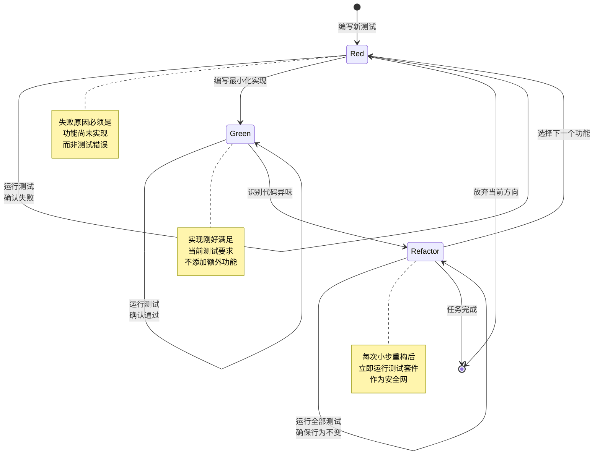
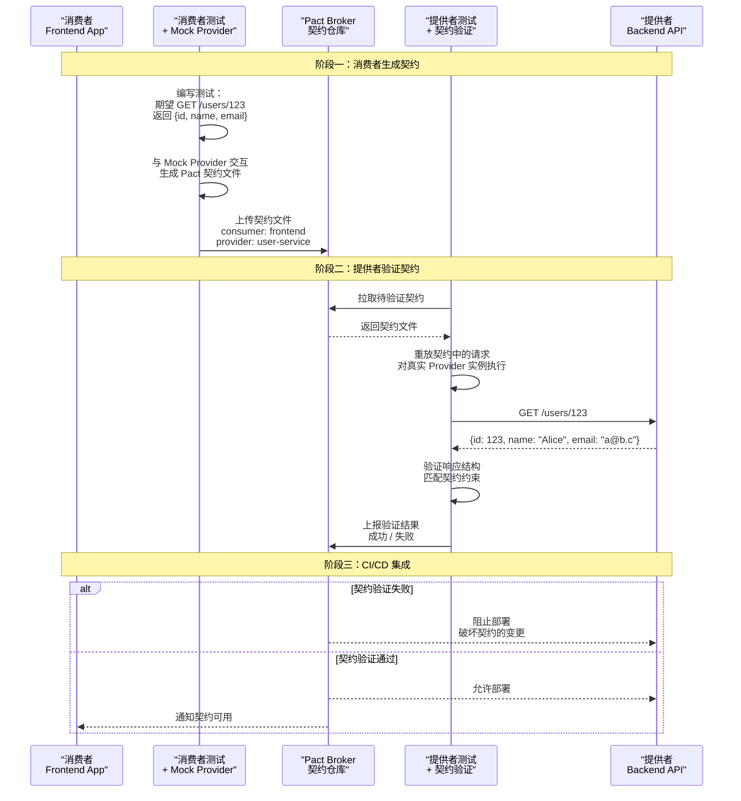

# 可测试性设计：TDD与测试金字塔

## 引言

软件测试从来都不是一个单纯的"验证阶段"，而是贯穿整个软件生命周期的系统性工程活动。然而，许多团队在实践中遭遇的困境是：测试代码比生产代码更难维护、运行一次完整的测试套件需要数小时、修改一个简单功能却导致数十个测试失败——这些问题的根源往往不在于测试本身，而在于**系统设计的可测试性（Testability）** 不足。

可测试性是一个被严重低估的软件质量属性。它与耦合度、内聚性、模块化等架构属性紧密相连，却常常在架构评审中被忽视。一个可测试性差的系统，其测试代码会充斥着复杂的 setup 逻辑、脆弱的断言和对内部实现的深层依赖。反之，一个为可测试性而设计的系统，其测试代码会如同系统行为的"可执行规格说明"，清晰、稳定且富有表达力。

本文首先回到理论的根基，从**软件测试的形式化定义**出发，探讨可控性、可观测性和隔离性的严格含义；随后深入**测试金字塔**的经济学原理，分析单元测试、集成测试和端到端测试的成本-收益权衡；进而阐述 **TDD 的红-绿-重构循环** 的理论基础、**契约测试** 的形式化模型、**属性测试** 的生成-验证范式和 **变异测试** 的充分性判据。最后，将这些理论全面映射到 JavaScript/TypeScript 生态的测试框架、工具和最佳实践中。

---

## 理论严格表述

### 可测试性的形式化定义

在软件测试理论中，可测试性（Testability）的经典定义来源于 **Voas 和 Miller** 的工作，后被 IEEE 标准采纳。一个软件组件的可测试性可以分解为三个正交维度：

#### 可控性（Controllability）

**可控性** 描述的是：测试者能否将系统驱动到特定的状态，并施加特定的输入以触发目标行为。形式化地，设系统状态空间为 `S`，输入空间为 `I`，转移函数为 `δ: S × I → S`，则可控性量化为：

```
Controllability = |Reachable_States| / |S|
```

其中 `Reachable_States` 是通过有限输入序列能够从初始状态到达的状态子集。理想情况下，可控性为 1，即所有状态都是可达的。但在实践中，高耦合的系统往往具有大量不可达状态——例如，由于硬编码的依赖关系或全局状态，测试者无法在不修改源代码的情况下将系统设置到期望的初始状态。

**设计启示**：依赖注入（Dependency Injection）是提升可控性的核心模式。通过将依赖作为参数传入（而非在内部硬编码实例化），测试代码可以注入可控的测试替身（Test Doubles），从而精确控制系统在测试中的行为。

#### 可观测性（Observability）

软件测试中的可观测性与控制理论中的概念同构：能否通过系统的**外部输出**推断其**内部状态**。设输出空间为 `O`，输出函数为 `λ: S → O`，则可观测性量化为：

```
Observability = |Distinguishable_States| / |S|
```

其中 `Distinguishable_States` 是具有不同输出的状态集合。如果两个不同状态产生完全相同的输出，则它们对测试者而言是不可区分的。

**设计启示**：纯函数（Pure Functions）具有天然的高可观测性——输出完全由输入决定，无需关心内部状态。而带有副作用（修改全局变量、写入数据库、调用外部 API）的函数，其可观测性取决于副作用的可追踪程度。返回值模式（Return Value Pattern）优于副作用模式，正是因为它提升了可观测性。

#### 隔离性（Isolation）

**隔离性** 描述的是：测试一个组件时，其他组件的状态变化不会对其产生不可预测的影响。形式化地，设待测组件为 `C`，环境组件集合为 `E = {E₁, E₂, ..., Eₙ}`，则隔离性要求：

```
∀e ∈ Tests(C), ∀Eᵢ ∈ E: State(Eᵢ) 在 e 执行前后保持不变
```

隔离性的破坏是测试不稳定（Flaky Tests）的主要来源。全局状态、共享数据库、文件系统、网络依赖、随机数生成器——这些因素都会降低隔离性，导致测试在相同条件下产生不同结果。

**设计启示**：函数式编程的不可变性（Immutability）、数据库事务的回滚、内存数据库（In-Memory Database）的使用、以及对外部系统调用的 Mock，都是提升隔离性的工程手段。

### 测试金字塔的理论基础

**测试金字塔（Test Pyramid）** 由 Mike Cohn 在其著作 *Succeeding with Agile* 中提出，是测试策略设计的经典框架。金字塔的形状暗示了不同测试类型的**理想数量比例**：底层单元测试数量最多，中层集成测试次之，顶层端到端（E2E）测试最少。

#### 成本-收益模型的数学表述

测试金字塔的形状可以用**成本-收益模型**严格解释。设某种测试类型的成本为 `C`，收益为 `B`，则其"测试效率"为 `E = B / C`。各类型的成本结构如下：

| 测试类型 | 编写成本 `C_write` | 执行成本 `C_exec` | 维护成本 `C_maint` | 定位精度 `B_precision` | 信心水平 `B_confidence` |
|---------|-------------------|-------------------|--------------------|-----------------------|------------------------|
| 单元测试 | 低 | 极低（毫秒级） | 低 | 极高（精确到函数） | 低（仅验证单个单元） |
| 集成测试 | 中 | 中（秒级） | 中 | 中（定位到模块交互） | 中（验证模块协作） |
| E2E 测试 | 高 | 高（分钟级） | 高 | 低（仅知系统某处故障） | 高（验证用户场景） |

测试的总成本是凹函数，而总收益是凸函数。根据**边际效用递减**原理，当某种测试的投入超过拐点后，额外投入带来的收益急剧下降。因此，最优测试策略是在预算约束下最大化总收益：

```
maximize Σ Eᵢ · Nᵢ
subject to Σ Cᵢ · Nᵢ ≤ Budget
```

其中 `Nᵢ` 是第 `i` 类测试的数量。求解这一优化问题，得到的解自然呈现金字塔形状：单元测试的 `E` 最高，因此 `N` 最大；E2E 测试的 `E` 最低，因此 `N` 最小。

#### 测试债务与反模式

违反测试金字塔原则会产生**测试债务（Test Debt）**。两种常见的反模式是：

1. **冰淇淋筒（Ice Cream Cone）**：E2E 测试数量远超单元测试。这通常发生在缺乏单元测试文化的团队中，导致测试套件运行缓慢、反馈周期极长、定位困难的"整体失败"。
2. **沙漏（Hourglass）**：单元测试和 E2E 测试很多，但集成测试很少。这导致系统各模块单独工作正常、用户场景也能通过，但模块间的接口契约存在隐蔽的错配。

### TDD 的红-绿-重构循环理论

**测试驱动开发（Test-Driven Development, TDD）** 由 Kent Beck 在极限编程（Extreme Programming）中系统化推广，其核心是一个短周期的三阶段循环：

#### 红阶段（Red）：失败即规格

编写一个**最小化的测试**，该测试描述待实现功能的一个具体方面，并预期其失败。从形式化验证的角度，这个失败的测试实际上是一个**可执行的规格说明（Executable Specification）**。它定义了系统行为的边界条件：在什么输入下，系统应该产生什么输出。

红阶段的关键约束是：**测试失败的原因必须是被测功能缺失，而非测试代码错误**。这意味着开发者需要确保测试代码本身的正确性——通常通过临时修改断言为明显错误的值，验证测试框架能够正确报告失败。

#### 绿阶段（Green）：最小化实现

编写**最小化的生产代码**，使得刚刚编写的测试通过。这里的"最小化"是一个刻意的设计约束：不允许编写超出当前测试所需范围的代码。这一约束防止了**推测性通用化（Speculative Generality）**——为尚未出现的需求过度设计抽象。

从心理学的角度，绿阶段提供了**即时反馈**和**成就感**，这是维持开发节奏的关键。TDD 的短周期（通常 5-10 分钟）利用了操作性条件反射原理：频繁的"测试通过"信号强化编码行为。

#### 重构阶段（Refactor）：保持行为不变

在测试通过（绿灯）的保护下，改进代码的结构而不改变其行为。**重构的安全性由测试套件保证**——如果重构破坏了行为，测试会立即失败。这实际上是**回归测试（Regression Testing）** 的持续应用。

形式化地，重构是程序空间中的一个**保持语义等价性的变换（Semantics-Preserving Transformation）**。Martin Fowler 在《重构》一书中编目了数十种经过验证的重构手法，每种手法都有明确的"安全条件"——在什么前置条件下应用该重构是安全的。

#### TDD 作为归纳证明

从更理论化的视角，TDD 可以被视为一种**归纳构造（Inductive Construction）** 过程：

- **基例（Base Case）**：最简单的输入，对应最简单的实现。
- **归纳步骤（Inductive Step）**：每个新的失败测试引入一个更复杂的输入场景，迫使实现进行归纳扩展。
- **归纳假设（Inductive Hypothesis）**：已通过的测试集合构成了"迄今为止所有场景均正确"的不变式。

这种视角揭示了 TDD 的一个深刻洞见：**测试驱动的是设计，而非验证**。TDD 的最大价值不在于"测试覆盖率"，而在于它强迫开发者从**消费者视角**（即调用者希望 API 如何工作）出发设计接口，从而自然产生高内聚、低耦合、可测试的设计。

### 契约测试的形式化：Consumer-Driven Contracts

在微服务架构中，服务间的依赖关系形成了复杂的调用图。**契约测试（Contract Testing）** 的目的是验证服务消费者（Consumer）和服务提供者（Provider）之间接口契约的一致性，而无需同时部署双方。

#### 契约的形式化定义

**契约（Contract）** 是服务接口的**结构化规格说明**，包含两个部分：

1. **请求契约（Request Contract）**：消费者发送的请求必须满足的约束。包括 HTTP 方法、URL 路径、请求头、查询参数、请求体结构等。
2. **响应契约（Response Contract）**：提供者承诺的响应必须满足的约束。包括状态码、响应头、响应体结构、字段类型、可空约束等。

形式化地，契约可以表示为请求-响应对的集合：

```
Contract = {(Requestᵢ, ResponseConstraintᵢ) | i ∈ Interactions}
```

其中每个 `Requestᵢ` 是一个具体的请求示例（或请求模式），`ResponseConstraintᵢ` 是对该请求对应响应的约束断言。

**消费者驱动契约（Consumer-Driven Contract, CDC）** 的核心理念是：**契约由消费者定义，提供者负责满足**。这与传统的"提供者发布 API 文档，消费者适配"的模式相反。CDC 的优势在于：

- 消费者的需求被显式编码，避免提供者实现无用功能。
- 当提供者需要变更接口时，可以立即识别哪些消费者的契约会被破坏。
- 测试可以在消费者和提供者的 CI 管道中独立运行，无需端到端环境。

#### Pact 的数学模型

Pact 是 CDC 最流行的实现框架。其工作流程可以形式化为：

1. **消费者端生成契约（Pact Generation）**：

   ```
   Consumer_Test: State × Mock_Provider → Pact_File
   ```

   消费者测试与 Mock 提供者交互，生成包含预期交互的 JSON 契约文件。

2. **提供者端验证契约（Pact Verification）**：

   ```
   Provider_Test: Pact_File × Provider_Instance → {Pass, Fail}
   ```

   提供者测试加载契约文件，对实际的提供者实例重放请求，验证响应是否满足契约约束。

Pact 契约文件本质上是一个**有限状态自动机**的规格说明：每个交互是一个状态转移，请求是输入，响应约束是输出条件。

### 属性测试的理论：QuickCheck

传统的单元测试基于**示例（Example-Based Testing）**：开发者手动选择若干输入示例，验证在这些示例上输出是否正确。这种模式的局限在于：**示例的选择是主观的，无法保证覆盖所有边界情况**。

**属性测试（Property-Based Testing）** 由 Claessen 和 Hughes 在 Haskell 库 QuickCheck 中首创，其核心思想是：**不测试具体示例，而是测试普遍性质（Properties）**。测试框架自动生成大量随机输入，验证被测函数是否始终满足给定性质。

#### 性质的形式化

**性质（Property）** 是一个谓词（Predicate），对于所有满足前置条件的输入，断言输出满足后置条件：

```
∀x ∈ Domain: Precondition(x) ⇒ Postcondition(f(x), x)
```

例如，对于数组排序函数 `sort`，可以声明以下性质：

1. **输出有序性**：`∀arr: isSorted(sort(arr))`
2. **长度不变性**：`∀arr: length(sort(arr)) = length(arr)`
3. **元素守恒性**：`∀arr: multiset(sort(arr)) = multiset(arr)`
4. **幂等性**：`∀arr: sort(sort(arr)) = sort(arr)`

#### 生成器与收缩

属性测试的核心机制是：

1. **随机生成器（Generator）**：从输入域 `Domain` 中按某种分布采样随机值。生成器可以是原语类型（整数、字符串、布尔值）的组合（数组、对象、函数）。
2. **性质验证（Property Verification）**：对生成的每个输入 `x`，验证 `Property(f(x))` 是否成立。
3. **反例收缩（Shrinking）**：当发现反例时，框架尝试找到该反例的"最小化"版本。例如，如果长度为 100 的数组触发失败，收缩算法会尝试删除元素，找到仍能触发失败的最短数组。这使得调试更加高效——最小反例通常揭示了问题的本质。

从逻辑学的角度，属性测试是一种**有限域上的模型检验（Model Checking）**：它无法证明性质在所有可能输入上成立（因为域通常是无限的），但可以通过大量随机采样提供**统计置信度**。当生成 10000 个随机输入均通过验证时，我们对性质成立具有高度信心——尽管不是绝对证明。

### 变异测试的充分性标准

**代码覆盖率（Code Coverage）** 是最常用的测试质量指标，但它存在一个根本缺陷：**覆盖率度量的是"测试执行了哪些代码"，而非"测试是否验证了这些代码的正确性"**。一个测试可以执行某行代码，但对该行的输出完全不进行断言——这样的测试对覆盖率有贡献，但对缺陷检测毫无价值。

**变异测试（Mutation Testing）** 正是为了解决这个问题而诞生的。其理论源于 **DeMillo、Lipton 和 Sayward** 在 1978 年的经典论文。

#### 变异算子与充分性

变异测试的核心流程是：

1. **变异算子（Mutation Operator）**：对源代码进行微小的语法变换，生成**变异体（Mutant）**。常见的变异算子包括：
   - 算术运算符替换：`+ → -`、`* → /`
   - 关系运算符替换：`> → >=`、`=== → !==`
   - 逻辑运算符替换：`&& → ||`
   - 语句删除：删除一个函数调用或赋值语句
   - 返回值修改：修改返回值为常量

2. **变异体执行**：对每个变异体运行测试套件。
3. **变异得分（Mutation Score）**：

   ```
   Mutation_Score = Killed_Mutants / Total_Mutants
   ```

   如果某个变异体导致至少一个测试失败，则称该变异体被"杀死（Killed）"。如果所有测试在变异体上仍然通过，则称该变异体"存活（Survived）"——这通常意味着测试对该代码区域的验证不足。

4. **等价变异体（Equivalent Mutants）**：某些变异体在语义上与原程序等价（例如 `a + 0` 变异为 `a - 0`），无法被任何测试杀死。识别等价变异体是不可判定问题（等价于停机问题），因此在实践中需要人工审查。

#### 变异测试的充分性假设

变异测试建立在**耦合效应（Coupling Effect）** 假设之上：**如果一个测试能够检测出简单缺陷（单点变异），那么它也能够检测出由多个简单缺陷组合而成的复杂缺陷**。这一假设经过实证研究验证：在实践中，能够杀死所有一阶变异体的测试套件，对真实缺陷的检测能力显著高于仅追求高覆盖率的测试套件。

从统计学的角度，变异得分是比覆盖率更强的**测试充分性（Test Adequacy）** 指标。研究表明，变异得分与真实缺陷检测率之间的相关性（通常 `r > 0.7`）远高于覆盖率与缺陷检测率之间的相关性（通常 `r < 0.4`）。

---

## 工程实践映射

### JS/TS 测试框架生态

JavaScript/TypeScript 生态拥有丰富而成熟的测试工具链。理解各工具的适用场景和权衡是构建高效测试策略的前提。

#### 单元测试框架：Jest 与 Vitest

**Jest** 长期以来是 Node.js 生态的默认测试框架，由 Meta（原 Facebook）维护。其特点包括：

- 零配置开箱即用
- 内置 Mock、Spy、覆盖率报告
- 快照测试（Snapshot Testing）
- 并行测试执行

```javascript
// Jest 示例：测试一个简单的工具函数
import { calculateDiscount } from './pricing';

describe('calculateDiscount', () => {
  it('应返回 0 当原价为负数', () => {
    expect(calculateDiscount(-100, 0.1)).toBe(0);
  });

  it('应正确计算折扣金额', () => {
    expect(calculateDiscount(1000, 0.15)).toBe(150);
  });

  it('折扣率不应超过 100%', () => {
    expect(calculateDiscount(1000, 1.5)).toBe(1000);
  });
});
```

**Vitest** 是 Vite 生态系统原生的测试框架，与 Vite 共享相同的配置和插件体系。对于使用 Vite 构建的项目（如 Vue 3、Svelte、现代 React 项目），Vitest 提供了显著的优势：

- 与 Vite 配置一致，无需维护单独的测试配置
- 基于 esbuild 的极速冷启动和热更新
- 与 TypeScript 的原生支持（无需 ts-jest 的复杂配置）
- 与 Vite 的模块解析逻辑完全一致

```typescript
// Vitest 示例：使用 TypeScript 和内置的 Mock 类型
import { describe, it, expect, vi } from 'vitest';
import { UserService } from './user-service';
import type { DatabaseClient } from './types';

describe('UserService', () => {
  it('应通过 email 查找用户', async () => {
    const mockDb: DatabaseClient = {
      query: vi.fn().mockResolvedValue({ rows: [{ id: 1, email: 'alice@example.com' }] })
    };

    const service = new UserService(mockDb);
    const user = await service.findByEmail('alice@example.com');

    expect(mockDb.query).toHaveBeenCalledWith(
      'SELECT * FROM users WHERE email = $1',
      ['alice@example.com']
    );
    expect(user).toEqual({ id: 1, email: 'alice@example.com' });
  });
});
```

#### E2E 测试框架：Playwright 与 Cypress

**Playwright** 由 Microsoft 开发，是现代 E2E 测试的首选框架。其核心优势包括：

- **多浏览器支持**：Chromium、Firefox、WebKit 的统一 API
- **自动等待（Auto-Waiting）**：元素操作自动等待元素就绪，消除脆弱的固定等待
- **网络拦截（Network Interception）**：可以 Mock API 响应、模拟网络故障
- **并行执行**：同一测试的多浏览器实例可以在多个 worker 中并行运行
- **Trace Viewer**：可视化重放测试执行的每一步，包含 DOM 快照、网络请求和控制台日志

**Cypress** 是另一流行的 E2E 框架，采用独特的架构：测试代码在浏览器内运行（而非通过 WebDriver 远程控制），从而提供对 DOM 和网络层的深度访问。Cypress 的实时重载和时光穿梭调试（Time Travel Debugging）体验极佳，但受限于单标签页和缺乏原生多标签/多域名支持。

对于现代项目，Playwright 因其更广泛的浏览器覆盖、更好的 CI/CD 集成和更强大的并行能力，逐渐成为更主流的选择。

### TDD 在 TypeScript 项目中的实践

TDD 在 TypeScript 项目中尤为强大，因为 TypeScript 的类型系统为"失败即规格"提供了额外的安全网。以下是一个完整的 Red-Green-Refactor 循环示例。

#### 场景：实现一个带验证的密码强度检查器

**Red 阶段：编写失败的测试**

```typescript
import { describe, it, expect } from 'vitest';
import { validatePassword } from './password-validator';

describe('validatePassword', () => {
  it('应拒绝少于 8 个字符的密码', () => {
    const result = validatePassword('Ab1!');
    expect(result.isValid).toBe(false);
    expect(result.errors).toContain('密码长度至少为 8 个字符');
  });

  it('应拒绝不含大写字母的密码', () => {
    const result = validatePassword('abcdefg1!');
    expect(result.isValid).toBe(false);
    expect(result.errors).toContain('密码必须包含至少一个大写字母');
  });

  it('应接受符合所有规则的密码', () => {
    const result = validatePassword('SecurePass123!');
    expect(result.isValid).toBe(true);
    expect(result.errors).toHaveLength(0);
  });
});
```

此时运行测试，所有三个测试都会失败，因为 `validatePassword` 函数尚未定义。

**Green 阶段：最小化实现**

```typescript
interface ValidationResult {
  isValid: boolean;
  errors: string[];
}

export function validatePassword(password: string): ValidationResult {
  const errors: string[] = [];

  if (password.length < 8) {
    errors.push('密码长度至少为 8 个字符');
  }
  if (!/[A-Z]/.test(password)) {
    errors.push('密码必须包含至少一个大写字母');
  }

  return {
    isValid: errors.length === 0,
    errors
  };
}
```

测试通过。此时我们刻意只实现了测试所要求的功能——即使我们知道还缺少"小写字母"、"数字"、"特殊字符"等规则。

**Refactor 阶段：改善结构**

在添加更多规则之前，我们先重构现有代码，消除重复并提高可扩展性：

```typescript
interface Rule {
  name: string;
  test: (password: string) => boolean;
  message: string;
}

const rules: Rule[] = [
  { name: 'minLength', test: (p) => p.length >= 8, message: '密码长度至少为 8 个字符' },
  { name: 'uppercase', test: (p) => /[A-Z]/.test(p), message: '密码必须包含至少一个大写字母' }
];

export function validatePassword(password: string): ValidationResult {
  const errors = rules
    .filter(rule => !rule.test(password))
    .map(rule => rule.message);

  return {
    isValid: errors.length === 0,
    errors
  };
}
```

重构后运行测试，确保行为未变。现在添加新规则只需扩展 `rules` 数组，无需修改核心逻辑。

**下一个 Red 阶段：添加新规则**

```typescript
it('应拒绝不含数字的密码', () => {
  const result = validatePassword('Abcdefgh!');
  expect(result.isValid).toBe(false);
  expect(result.errors).toContain('密码必须包含至少一个数字');
});
```

测试失败。将新规则添加到数组中，测试通过。TDD 的节奏由此延续。

### 测试替身的使用策略

在单元测试中，测试替身（Test Doubles）用于隔离被测单元与外部依赖。Gerard Meszaros 在《xUnit Test Patterns》中区分了五种类型：

#### Dummy（哑元）

仅用于填充参数列表，从未被实际使用。通常用于满足类型系统的非空约束。

```typescript
// Dummy 示例：在测试不关心 logger 时使用
class OrderProcessor {
  constructor(
    private paymentService: PaymentService,
    private inventoryService: InventoryService,
    private logger: Logger // 测试中传入 Dummy
  ) {}
}

const dummyLogger: Logger = {
  info: () => {},
  error: () => {},
  warn: () => {}
};

const processor = new OrderProcessor(mockPayment, mockInventory, dummyLogger);
```

#### Fake（伪造实现）

具有工作实现，但采用更简单的机制。Fake 与真正的依赖具有相同的行为契约，但适用于测试环境。

```typescript
// Fake 示例：内存数据库替代真实 PostgreSQL
class FakeUserRepository implements UserRepository {
  private users: User[] = [];

  async findById(id: string): Promise<User | null> {
    return this.users.find(u => u.id === id) || null;
  }

  async save(user: User): Promise<void> {
    const existing = this.users.findIndex(u => u.id === user.id);
    if (existing >= 0) this.users[existing] = user;
    else this.users.push(user);
  }

  // 测试辅助方法
  clear(): void { this.users = []; }
  seed(users: User[]): void { this.users = users; }
}
```

#### Stub（桩）

对特定调用返回预设的响应。Stub 不关注调用次数或参数细节，仅提供"硬编码"的返回值。

```typescript
// Stub 示例：总是返回固定汇率
const exchangeRateStub: ExchangeRateService = {
  getRate: async () => ({ from: 'USD', to: 'EUR', rate: 0.85 })
};
```

#### Spy（间谍）

记录被调用的信息（参数、次数、顺序），供测试后续断言。Spy 可以包装真实对象或完全模拟。

```typescript
// Spy 示例：使用 Vitest 的 vi.fn()
const sendEmailSpy = vi.fn().mockResolvedValue(undefined);

const notificationService = new NotificationService(sendEmailSpy);
await notificationService.notifyUser('user-123', '订单已发货');

expect(sendEmailSpy).toHaveBeenCalledTimes(1);
expect(sendEmailSpy).toHaveBeenCalledWith({
  to: 'user-123',
  subject: '订单已发货',
  template: 'order_shipped'
});
```

#### Mock（模拟对象）

预设了期望调用序列的对象。如果实际调用与期望不符，Mock 会立即抛出错误。Mock 是"行为验证"的工具。

```typescript
// Mock 示例：严格验证调用顺序
const paymentGatewayMock = {
  authorize: vi.fn().mockResolvedValue({ transactionId: 'txn-123', status: 'authorized' }),
  capture: vi.fn().mockResolvedValue({ transactionId: 'txn-123', status: 'captured' })
};

const orderService = new OrderService(paymentGatewayMock);
await orderService.checkout(order);

// 验证 authorize 必须在 capture 之前调用
expect(paymentGatewayMock.authorize).toHaveBeenCalledBefore(paymentGatewayMock.capture);
```

**选择策略**：遵循 **London School TDD**（行为验证）时倾向于使用 Mock 和 Spy；遵循 **Detroit School TDD**（状态验证）时倾向于使用 Fake 和 Stub。实践中，Fake 通常比 Mock 更稳定——当重构内部实现但不改变外部行为时，基于 Fake 的测试往往不需要修改，而基于 Mock 的测试可能因为调用顺序变化而失败。

### 前端组件测试

前端测试的特殊性在于：被测单元（UI 组件）与用户交互模型紧密耦合，且高度依赖浏览器环境。

#### React Testing Library

**React Testing Library (RTL)** 的核心理念是：**测试方式应模拟用户与界面的交互方式**，而非测试组件的内部实现细节。这一理念基于一个深刻洞见：用户对组件内部状态或 props 一无所知，他们只能通过可见的 DOM 元素和可触发的交互来感知系统行为。

```typescript
import { render, screen, fireEvent, waitFor } from '@testing-library/react';
import userEvent from '@testing-library/user-event';
import { SearchForm } from './SearchForm';

describe('SearchForm', () => {
  it('应在用户输入后触发搜索', async () => {
    const onSearch = vi.fn();
    render(<SearchForm onSearch={onSearch} />);

    // 查询元素的方式应与用户感知一致
    const input = screen.getByPlaceholderText('搜索产品...');
    const button = screen.getByRole('button', { name: /搜索/i });

    // 模拟用户输入（优于直接修改 input.value）
    await userEvent.type(input, 'TypeScript');
    await userEvent.click(button);

    await waitFor(() => {
      expect(onSearch).toHaveBeenCalledWith('TypeScript');
    });
  });

  it('应在输入为空时禁用搜索按钮', () => {
    render(<SearchForm onSearch={vi.fn()} />);
    const button = screen.getByRole('button', { name: /搜索/i });
    expect(button).toBeDisabled();
  });
});
```

**RTL 的查询优先级**反映了"用户如何找到元素"的层次：

1. `getByRole`：用户通过语义角色（按钮、输入框、链接）感知元素。
2. `getByLabelText`：用户通过关联的标签找到表单控件。
3. `getByPlaceholderText` / `getByText`：用户通过可见文本找到元素。
4. `getByTestId`：最后的手段，当以上方式均不可行时使用。

使用 `data-testid` 是 RTL 推荐的最后选择，而非首选。这与 Enzyme（RTL 的前身）的哲学相反——Enzyme 鼓励通过组件内部结构（如 `.find('.button-primary')`）进行查询，导致测试与实现高度耦合。

#### Vue Test Utils

**Vue Test Utils (VTU)** 是 Vue 官方提供的组件测试工具集。对于 Vue 3 + Composition API 的项目，测试策略需要适应响应式系统的特性。

```typescript
import { describe, it, expect, vi } from 'vitest';
import { mount, flushPromises } from '@vue/test-utils';
import { createPinia, setActivePinia } from 'pinia';
import UserProfile from './UserProfile.vue';

describe('UserProfile', () => {
  it('应在加载完成后显示用户信息', async () => {
    setActivePinia(createPinia());

    const wrapper = mount(UserProfile, {
      props: { userId: '123' },
      global: {
        mocks: {
          $router: { push: vi.fn() }
        }
      }
    });

    // 等待所有异步操作完成（包括 onMounted 中的数据获取）
    await flushPromises();

    // 通过文本内容断言，而非选择器
    expect(wrapper.text()).toContain('Alice Johnson');
    expect(wrapper.text()).toContain('alice@example.com');
  });
});
```

**关键陷阱**：在 Vue 3 的文档或测试代码中，经常需要引用内置组件或特殊标签。注意在 Markdown 中提及 `<template>`、`<script setup>`、`<Suspense>`、`<Teleport>` 等时，必须将其放在代码块中或用反引号包裹。例如：

```typescript
// 正确：在代码块中提及 Vue 的 template 标签
const templateContent = `<template><div>Hello</div></template>`;
```

如果直接在正文中写 `template` 或 `script setup` 而不加反引号，虽然这些特定词汇不一定会被 VitePress 解析为组件，但为了安全起见，任何看起来像 HTML 标签的文本都应当使用反引号包裹或放入代码块。

### API 契约测试：Pact

在微前端或前后端分离架构中，API 契约测试确保消费者（前端）和提供者（后端）的接口假设一致。

#### 消费者端测试

```typescript
import { PactV3 } from '@pact-foundation/pact';
import { MatchersV3 } from '@pact-foundation/pact';
import { API } from './api-client';

const provider = new PactV3({
  consumer: 'frontend-web',
  provider: 'user-service'
});

describe('User API Contract', () => {
  it('应返回用户详情', async () => {
    await provider
      .given('用户 alice 存在')
      .uponReceiving('获取用户 alice 的请求')
      .withRequest({
        method: 'GET',
        path: '/users/alice',
        headers: { Accept: 'application/json' }
      })
      .willRespondWith({
        status: 200,
        headers: { 'Content-Type': 'application/json' },
        body: MatchersV3.like({
          id: MatchersV3.uuid(),
          username: 'alice',
          email: MatchersV3.email(),
          createdAt: MatchersV3.datetime({ format: 'yyyy-MM-dd HH:mm:ss' })
        })
      });

    await provider.executeTest(async (mockserver) => {
      const api = new API(mockserver.url);
      const user = await api.getUser('alice');

      expect(user.username).toBe('alice');
      expect(user.email).toMatch(/^[^\s@]+@[^\s@]+\.[^\s@]+$/);
    });
  });
});
```

#### 提供者端验证

提供者端验证通常在 CI 管道中运行，通过 Pact Broker 获取消费者发布的契约文件：

```javascript
// pact-verifier.js
const { Verifier } = require('@pact-foundation/pact');

const verifier = new Verifier({
  provider: 'user-service',
  providerBaseUrl: 'http://localhost:3001',
  pactBrokerUrl: 'https://pact-broker.example.com',
  pactBrokerToken: process.env.PACT_TOKEN,
  publishVerificationResult: true,
  providerVersion: process.env.GIT_COMMIT_SHA,
  stateHandlers: {
    '用户 alice 存在': async () => {
      await seedUser({ id: 'uuid-123', username: 'alice', email: 'alice@example.com' });
    }
  }
});

verifier.verifyProvider().then(() => {
  console.log('Pact 验证通过');
});
```

**契约测试 vs. E2E 测试**：契约测试验证"请求和响应结构是否匹配"，不验证业务逻辑的正确性；E2E 测试验证"整个用户场景是否端到端工作"。契约测试运行快速（毫秒级），E2E 测试运行缓慢（秒级或分钟级）。两者互补，不可互相替代。

### E2E 测试的最佳实践：Page Object Model

E2E 测试最大的维护挑战是：**当 UI 结构变化时，大量的测试用例需要同步修改**。Page Object Model（POM）是解决这个问题的主流设计模式。

#### POM 的核心思想

将每个页面的**元素定位逻辑**和**交互操作**封装到独立的"页面对象"中。测试用例通过调用页面对象的方法与 UI 交互，而非直接使用选择器。

```typescript
// pages/LoginPage.ts
import { Page, Locator } from '@playwright/test';

export class LoginPage {
  readonly usernameInput: Locator;
  readonly passwordInput: Locator;
  readonly submitButton: Locator;
  readonly errorMessage: Locator;

  constructor(private page: Page) {
    this.usernameInput = page.getByTestId('login-username');
    this.passwordInput = page.getByTestId('login-password');
    this.submitButton = page.getByRole('button', { name: '登录' });
    this.errorMessage = page.getByTestId('login-error');
  }

  async goto() {
    await this.page.goto('/login');
  }

  async login(username: string, password: string) {
    await this.usernameInput.fill(username);
    await this.passwordInput.fill(password);
    await this.submitButton.click();
  }

  async expectError(message: string) {
    await expect(this.errorMessage).toHaveText(message);
  }
}

// tests/login.spec.ts
import { test, expect } from '@playwright/test';
import { LoginPage } from '../pages/LoginPage';
import { DashboardPage } from '../pages/DashboardPage';

test('用户应能通过有效凭据登录', async ({ page }) => {
  const loginPage = new LoginPage(page);
  await loginPage.goto();
  await loginPage.login('alice@example.com', 'correct-password');

  const dashboardPage = new DashboardPage(page);
  await expect(dashboardPage.welcomeHeading).toContainText('欢迎, Alice');
});

test('用户应看到无效凭据的错误提示', async ({ page }) => {
  const loginPage = new LoginPage(page);
  await loginPage.goto();
  await loginPage.login('alice@example.com', 'wrong-password');
  await loginPage.expectError('用户名或密码错误');
});
```

当登录页面的 DOM 结构发生变化时，只需修改 `LoginPage` 类中的定位器，所有使用该页面对象的测试用例自动适应。**选择器的集中管理**是 POM 的核心价值。

#### Fixture 模式：Playwright 的进阶抽象

Playwright 的 Test Fixture 机制允许在 POM 基础上进一步抽象，为每个测试自动初始化页面对象：

```typescript
// fixtures.ts
import { test as base } from '@playwright/test';
import { LoginPage } from './pages/LoginPage';
import { DashboardPage } from './pages/DashboardPage';

type MyFixtures = {
  loginPage: LoginPage;
  dashboardPage: DashboardPage;
};

export const test = base.extend<MyFixtures>({
  loginPage: async ({ page }, use) => {
    await use(new LoginPage(page));
  },
  dashboardPage: async ({ page }, use) => {
    await use(new DashboardPage(page));
  }
});

// tests/login.spec.ts
import { test, expect } from '../fixtures';

test('用户应能通过有效凭据登录', async ({ loginPage, dashboardPage }) => {
  await loginPage.goto();
  await loginPage.login('alice@example.com', 'correct-password');
  await expect(dashboardPage.welcomeHeading).toContainText('欢迎, Alice');
});
```

### 测试覆盖率的目标与陷阱

代码覆盖率（Code Coverage）是最常用的测试质量指标，但它必须被正确理解，否则会成为危险的数字游戏。

#### 覆盖率的类型

| 覆盖率类型 | 定义 | 局限性 |
|-----------|------|--------|
| 语句覆盖（Statement） | 执行到的语句比例 | 忽略逻辑分支的组合 |
| 分支覆盖（Branch） | 执行到的条件分支比例 | 不验证分支内的断言 |
| 函数覆盖（Function） | 执行到的函数比例 | 函数被调用≠函数被验证 |
| 行覆盖（Line） | 执行到的代码行比例 | 单行多语句时失真 |

#### 覆盖率的合理目标

Google 的工程实践建议：

- **单元测试**：追求 80% 以上的分支覆盖率，核心业务逻辑模块应达到 90% 以上。
- **集成测试**：覆盖率目标较低（60-70%），重点覆盖关键用户路径和模块交互。
- **E2E 测试**：不关注代码覆盖率，而关注**用户场景覆盖率**（User Journey Coverage）。

**关键洞见**：覆盖率的绝对数值不如其**变化趋势**重要。如果覆盖率从 85% 下降到 75%，这通常意味着新代码缺乏测试——这是一个需要立即关注的信号。

#### 覆盖率的陷阱

1. **为覆盖率而测试**：开发者为了达到覆盖率目标，编写没有断言的"空测试"。例如：

   ```typescript
   it('应该覆盖某行代码', () => {
     const result = someFunction();
     // 没有断言！覆盖率增加，但缺陷检测能力为零
   });
   ```

2. **忽略边界条件**：100% 的行覆盖率不代表所有边界条件都被测试。例如，一个对数组排序的函数可能被调用一次就达到 100% 行覆盖，但空数组、单元素数组、重复元素、逆序数组等边界条件均未被验证。

3. **将覆盖率作为硬性门槛**：强制要求 100% 覆盖率会鼓励开发者编写脆弱的测试、避免重构（因为重构可能降低覆盖率），甚至在无法测试的代码（如纯数据定义）上浪费时间。

#### 变异测试的实践

在 JavaScript 生态中，**Stryker** 是最成熟的变异测试框架：

```bash
# 安装 Stryker
npm install --save-dev @stryker-mutator/core @stryker-mutator/vitest-runner

# 初始化配置
npx stryker init
```

```javascript
// stryker.config.mjs
export default {
  testRunner: 'vitest',
  reporters: ['progress', 'clear-text', 'html'],
  mutate: ['src/**/*.ts', '!src/**/*.spec.ts'],
  vitest: {
    configFile: 'vitest.config.ts'
  }
};
```

Stryker 会生成数千个变异体（如将 `>` 改为 `>=`、`&&` 改为 `||`、删除函数调用等），运行测试套件，并报告哪些变异体存活。存活变异体指示测试验证的薄弱环节。

实践中，变异测试的运行成本较高（可能为正常测试的 10-100 倍），因此通常不作为 CI 的每次提交检查，而是作为**定期的质量审计**（如每周一次）或**关键模块的专项评估**运行。

---

## Mermaid 图表

### 测试金字塔与成本-收益模型

```mermaid
graph TB
    subgraph "测试金字塔"
        direction TB

        subgraph "E2E 测试"
            E2E1["用户注册流程"]
            E2E2["下单-支付-发货流程"]
            E2E3["管理员审核流程"]
            style E2E1 fill:#ff9999
            style E2E2 fill:#ff9999
            style E2E3 fill:#ff9999
        end

        subgraph "集成测试"
            INT1["API 路由 + 控制器 + 服务"]
            INT2["服务 + 数据库"]
            INT3["服务 + 消息队列"]
            INT4["前端组件 + API Mock"]
            style INT1 fill:#ffcc99
            style INT2 fill:#ffcc99
            style INT3 fill:#ffcc99
            style INT4 fill:#ffcc99
        end

        subgraph "单元测试"
            UNIT1["验证密码强度"]
            UNIT2["计算购物车总价"]
            UNIT3["日期格式化工具"]
            UNIT4["排序算法"]
            UNIT5["权限检查"]
            UNIT6["邮件模板渲染"]
            UNIT7["汇率转换"]
            UNIT8["输入校验器"]
            style UNIT1 fill:#99ff99
            style UNIT2 fill:#99ff99
            style UNIT3 fill:#99ff99
            style UNIT4 fill:#99ff99
            style UNIT5 fill:#99ff99
            style UNIT6 fill:#99ff99
            style UNIT7 fill:#99ff99
            style UNIT8 fill:#99ff99
        end
    end

    subgraph "成本-收益分析"
        direction LR

        COST["<b>成本维度</b><br/>编写时间: 低 → 高<br/>执行时间: 毫秒 → 分钟<br/>维护成本: 低 → 高<br/>调试难度: 低 → 高"]

        BENEFIT["<b>收益维度</b><br/>定位精度: 高 → 低<br/>信心水平: 低 → 高<br/>用户场景覆盖: 低 → 高<br/>架构验证: 局部 → 全局"]

        EFFICIENCY["<b>测试效率 = 收益 / 成本</b><br/>单元测试: ★★★★★<br/>集成测试: ★★★☆☆<br/>E2E 测试: ★★☆☆☆"]
    end

    E2E1 --> COST
    UNIT1 --> BENEFIT
    INT2 --> EFFICIENCY
```



### TDD 红-绿-重构循环的状态机



### 契约测试的交互模型



---

## 理论要点总结

1. **可测试性是系统的结构属性**：可控性、可观测性和隔离性是可测试性的三个正交维度。依赖注入提升可控性，纯函数和返回值模式提升可观测性，不可变性和测试替身提升隔离性。这些设计决策在架构阶段做出，远早于测试代码的编写。

2. **测试金字塔是成本-收益优化的结果**：单元测试的高效率（高定位精度、低执行成本）决定了其数量应最多；E2E 测试的高成本决定了其数量应最少。最优测试策略是在预算约束下最大化总测试效率。

3. **TDD 的核心价值在于驱动设计，而非验证正确性**：红-绿-重构循环强迫开发者从消费者视角设计接口，自然产生高内聚、低耦合的模块。TDD 可以被视为归纳构造过程：每个测试用例是归纳步骤，已通过的测试集合构成不变式。

4. **契约测试形式化了服务间接口的一致性验证**：消费者驱动契约（CDC）将 API 假设编码为可自动验证的规格。Pact 的工作流程（生成契约 → 验证契约 → 部署把关）实现了微服务间的"接口兼容性 CI"。

5. **属性测试和变异测试超越了传统覆盖率的局限**：属性测试通过随机生成和反例收缩验证普遍性质；变异测试通过注入人工缺陷评估测试的缺陷检测能力。两者共同构成了比代码覆盖率更严格的测试充分性标准。

---

## 参考资源

1. **Beck, K. (2002).** *Test-Driven Development: By Example.* Addison-Wesley Professional.
   - TDD 的奠基之作。书中通过两个完整的示例项目（多币种货币计算和 Python 测试框架 xUnit 本身），展示了 Red-Green-Refactor 循环的节奏和力量。Kent Beck 强调的"测试驱动设计"而非"测试驱动验证"的洞见至今仍是理解 TDD 的关键。

2. **Fowler, M. (2018).** *Unit Testing: Principles, Practices, and Patterns.* Manning Publications.
   - Martin Fowler 系统阐述了单元测试的原则、模式和反模式。书中关于"London School vs. Detroit School TDD"的对比分析，以及状态验证与行为验证的权衡讨论，对测试策略的选择具有深刻指导意义。

3. **Meszaros, G. (2007).** *xUnit Test Patterns: Refactoring Test Code.* Addison-Wesley Professional.
   - 测试模式领域的百科全书式著作。Meszaros 对 Dummy、Fake、Stub、Spy、Mock 五种测试替身的严格区分，以及关于测试 smells 和重构手法的系统编目，是编写可维护测试代码的必备参考。

4. **Claessen, K., & Hughes, J. (2000).** *QuickCheck: A Lightweight Tool for Random Testing of Haskell Programs.* In *ACM SIGPLAN Notices*, 35(9), 268-279.
   - 属性测试的奠基论文。Claessen 和 Hughes 提出的"测试普遍性质而非具体示例"的思想，以及生成器组合子和反例收缩算法，奠定了现代属性测试工具（如 fast-check、JSCheck）的理论基础。

5. **DeMillo, R. A., Lipton, R. J., & Sayward, F. G. (1978).** *Hints on Test Data Selection: Help for the Practicing Programmer.* *Computer*, 11(4), 34-41.
   - 变异测试的开创性论文。作者首次提出了"通过人工注入缺陷来评估测试套件有效性"的思想，以及"耦合效应"假设——检测简单缺陷的能力暗示检测复杂缺陷的能力。这一思想经过四十余年的发展，已成为现代变异测试工具（如 Stryker）的理论基石。

---

> **工程箴言**：测试代码是生产代码的第一批用户。如果测试代码难以编写，那正是生产代码 API 设计存在问题的信号。将测试视为设计的反馈机制，而非事后的验证步骤，是写出可测试、可维护系统的核心心法。
