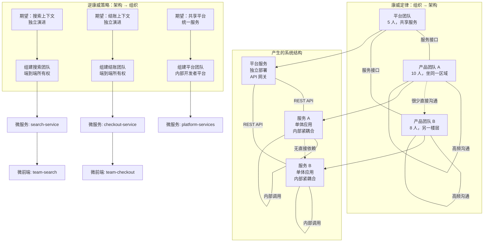
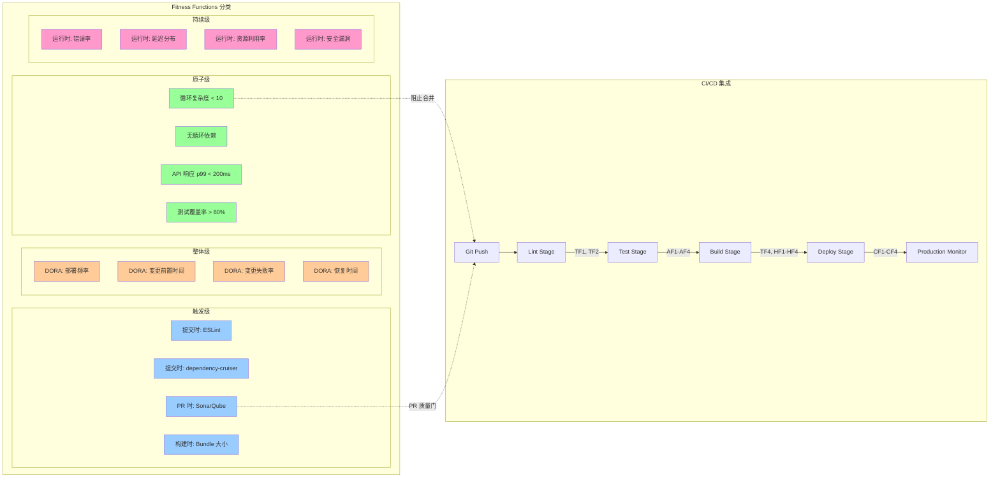
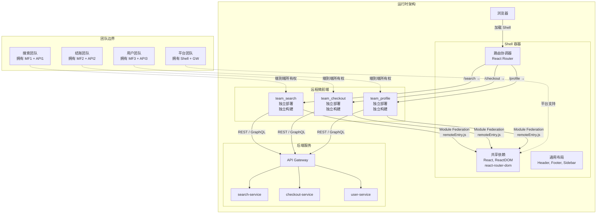

# 演进式架构：康威定律与逆康威

## 引言

软件架构面临一个根本性的悖论：我们必须在信息最不充分的时刻（项目初期）做出影响最为深远的决策（架构选择）。
传统的"大爆炸式架构设计"试图在项目启动时预测未来所有需求，绘制出完美的架构蓝图，然后按部就班地实现。
然而，这种范式在快速变化的市场环境中几乎注定失败——需求会变化、技术会演进、团队会调整，而当初精心设计的架构图在六个月后就可能成为束缚创新的枷锁。

**演进式架构（Evolutionary Architecture）** 正是为了解决这一悖论而生。
它借鉴了生物进化论的核心思想：不是设计一个完美的最终形态，而是建立一套**允许架构在压力下持续适应和优化的机制**。
进化论中的"自然选择"对应架构中的"fitness functions"（适应度函数）；
生物的"基因突变"对应软件的"增量变更"；物种的"适应性"对应系统的"可演进性"。

然而，演进式架构并非无方向的混乱生长。正如生物进化受到环境压力的引导，软件架构的演进也受到**组织结构和沟通模式**的深刻约束。
这一约束的严格表述就是**康威定律（Conway's Law）**——软件系统的结构不可避免地镜像其创建组织的沟通结构。
理解这一定律，并学会运用**逆康威策略（Inverse Conway Maneuver）** 主动塑造组织以支持期望的架构，是架构师必须掌握的核心能力。

本文从康威定律的理论根基出发，阐述演进式架构的形式化特征和治理机制，并将这些理论全面映射到 JavaScript/TypeScript 生态的工程实践中——从微前端的团队边界对齐，到 Monorepo 中的自动化架构守卫，再到技术债务的量化管理。

---

## 理论严格表述

### 康威定律：组织沟通结构决定系统结构

**Melvin Conway** 在 1968 年发表于 *Datamation* 杂志的论文 *How Do Committees Invent?* 中首次提出了后来被 Fred Brooks 命名为"康威定律"的洞见。Conway 的原始表述是：

> "Organizations which design systems are constrained to produce designs which are copies of the communication structures of these organizations."
> （设计系统的组织，其产生的设计等同于组织之间的沟通结构。）

#### 康威定律的数学直觉

康威定律可以用**信息论**和**网络理论**的语言形式化。设组织为图 `G_org = (V_org, E_org)`，其中顶点 `V_org` 是团队或个人，边 `E_org` 是沟通渠道（会议、文档、即时消息、代码审查）。设软件系统为图 `G_sys = (V_sys, E_sys)`，其中顶点 `V_sys` 是模块或组件，边 `E_sys` 是依赖关系或接口。

康威定律断言存在一个**同态映射（Homomorphic Mapping）** `φ: G_org → G_sys`，使得：

```
∀(u, v) ∈ E_org: 若 u 和 v 频繁沟通，则 φ(u) 和 φ(v) 在 G_sys 中存在强耦合
∀(u, v) ∉ E_org: 若 u 和 v 不直接沟通，则 φ(u) 和 φ(v) 之间存在明确的接口边界
```

这一定律之所以成立，其根本原因在于**信息传递成本**。
当两个团队需要协作开发紧耦合的模块时，跨团队沟通的成本远高于团队内部沟通。
为了最小化协调成本，系统会自然演化出与组织结构同构的边界——同一团队内部的模块可以随意共享内部状态（因为沟通成本低），而不同团队的模块必须通过严格定义的接口交互（因为沟通成本高）。

#### 康威定律的推论

康威定律产生了若干深刻推论：

1. **分布式团队产生分布式系统**：如果一个系统的开发团队分布在五个时区，那么系统本身会自然演化为五个相对独立的子系统，通过异步消息或 API 交互——因为同步沟通在时区差异下成本过高。

2. **单体系统对应单体组织**：如果一个组织的所有开发者都在同一个开放式办公空间、共享同一个待办列表、由同一个经理管理，那么系统会自然趋向单体架构——因为任何模块边界的引入都会增加不必要的沟通成本。

3. **外包边界成为系统裂缝**：如果将系统的某一部分外包给第三方公司，那么外包边界会成为系统中最脆弱的接缝——因为跨组织的沟通成本最高，接口设计往往不够充分，集成问题会在项目后期集中爆发。

### 逆康威策略：用架构驱动组织变革

如果说康威定律描述的是"组织决定架构"的被动局面，那么**逆康威策略（Inverse Conway Maneuver）** 则是主动运用这一规律：**先设计期望的系统架构，然后调整组织结构以匹配该架构**。

这一策略由 ThoughtWorks 的顾问们系统化阐述，其核心洞见是：**组织变革比技术变革更难，但也更有效**。如果你期望系统具有特定的模块化结构，那么最有效的方法不是编写架构文档来"规范"开发者的行为，而是直接组建与之对应的团队——因为开发者会自然地围绕团队边界构建系统。

#### 逆康威策略的实施步骤

1. **识别期望的系统边界**：基于业务领域（如 DDD 的限界上下文）或技术关注点（如前端/后端/数据），定义目标架构中的模块边界。

2. **映射到团队边界**：为每个期望的模块创建一个拥有端到端所有权（End-to-End Ownership）的团队。这个团队应该具备独立交付该模块所需的全部技能（设计、前端、后端、测试、运维）。

3. **建立团队间契约**：定义团队之间的接口契约（API 规范、事件格式、数据共享协议），并投资于使这些契约易于遵守的基础设施（如共享的 API 网关、Schema Registry、自动化契约测试）。

4. **度量并调整**：监控跨团队依赖的频率和成本。如果两个团队仍然需要频繁同步协作，那可能是模块边界划分不当的信号。

#### 逆康威策略与团队拓扑

Matthew Skelton 和 Manuel Pais 在《Team Topologies》中进一步将逆康威策略细化为四种团队类型：

- **Stream-Aligned Team（流对齐团队）**：对应业务价值流，拥有端到端的交付能力，是组织的主要工作单元。
- **Platform Team（平台团队）**：提供内部开发者平台，减少流对齐团队的认知负荷。
- **Complicated Subsystem Team（复杂子系统团队）**：负责需要深度专业知识的组件（如视频编解码器、机器学习模型），以服务的形式提供给其他团队。
- **Enabling Team（赋能团队）**：临时嵌入流对齐团队，传授新技术或最佳实践，完成后退出。

这四种团队类型的组合，构成了逆康威策略在复杂组织中的实施框架。

### 演进式架构的特征

Neal Ford、Rebecca Parsons 和 Patrick Kua 在《Building Evolutionary Architectures》中将演进式架构定义为：**"支持跨多个维度的引导性增量变更的架构"**。这个定义包含三个核心特征：

#### 增量变更（Incremental Change）

增量变更是演进式架构的基础能力。它要求系统能够以**小批量、低风险、快速反馈**的方式进行修改和部署。形式化地，设系统的架构维度集合为 `D = {d₁, d₂, ..., dₙ}`（如技术栈、数据模型、部署拓扑、安全策略），则增量变更要求：

```
∀d ∈ D, ∀s₁, s₂ ∈ States(d): 存在变更路径 P(s₁ → s₂)，使得 Cost(P) 可接受
```

也就是说，在任何架构维度上，从当前状态迁移到目标状态的成本必须可控。这要求系统避免**不可逆的架构决策**——那些一旦做出就无法低成本撤销的选择（如选择特定厂商的专有协议、设计无法迁移的数据模型）。

#### Fitness Functions（适应度函数）

**Fitness Functions** 是演进式架构的核心创新概念，借用了遗传算法中的术语。在遗传算法中，适应度函数评估一个候选解的质量，决定其是否被保留到下一代。在架构中，fitness functions 是**自动评估架构特性的可执行约束**。

形式化地，一个 fitness function 是一个函数：

```
f: Architecture_State × Context → [0, 1]
```

它接收当前架构状态和运行上下文，返回一个 0 到 1 之间的分数。分数越高，表示架构在该维度上的"健康度"越好。

Fitness functions 可以分为几类：

1. **原子 fitness functions**：评估单个架构维度，如：
   - 循环复杂度不超过 10
   - 模块间的依赖方向遵循设定的层次规则
   - API 响应延迟的 p99 不超过 200ms

2. **整体 fitness functions**：评估多个维度的综合效应，如：
   - 部署频率与变更失败率的比率（DORA 指标）
   - 安全漏洞扫描的通过率

3. **触发式 fitness functions**：在特定事件时运行，如：
   - 代码提交时运行的静态分析
   - 部署前运行的架构合规检查

4. **持续式 fitness functions**：持续监控的运行时指标，如：
   - 服务间的调用延迟分布
   - 错误率的时间序列

Fitness functions 的关键价值在于：**它们将架构原则从文档中的静态声明转化为代码中的动态守卫**。当某个变更违反了架构原则时，fitness function 会在 CI/CD 管道中失败，阻止不合规的代码进入主干。

#### 适当耦合（Appropriate Coupling）

演进式架构不追求"零耦合"（这在实践中既不现实也不经济），而是追求**适当耦合（Appropriate Coupling）**。耦合的"适当性"取决于变更的共现频率：

```
如果模块 A 和 B 经常在同一变更中修改，则它们应该紧密耦合（同模块/同服务）
如果模块 A 和 B 很少在同一变更中修改，则它们应该松散耦合（通过稳定接口交互）
```

这一原则被称为 **Common Closure Principle（共同封闭原则）**——一起变化的组件应该放在一起。它来自 Robert C. Martin 的组件设计原则，与 Single Responsibility Principle 形成互补：SRP 关注"一个组件为什么变化"，CCP 关注"哪些组件一起变化"。

### 架构决策记录（ADR）的理论

演进式架构的一个关键挑战是：**架构知识存在于人的头脑中，而非代码中**。当最初的架构师离开项目后，后续的开发者会不断做出与原始设计意图相矛盾的决策，导致架构的"悄然腐化"。

**架构决策记录（Architecture Decision Records, ADR）** 是解决这一问题的轻量级文档实践。Michael Nygard 在 2011 年首次提出 ADR 格式，其核心思想是：**每个重要的架构决策都应该被记录为一个独立的、可版本控制的文档**。

#### ADR 的形式化结构

一个标准的 ADR 包含以下字段：

1. **标题（Title）**：决策的简短描述。
2. **状态（Status）**：`proposed` / `accepted` / `deprecated` / `superseded by ADR-XXX`
3. **背景（Context）**：促使该决策的需求、约束和假设。这是 ADR 中最重要的部分——它解释了"为什么"，而非仅仅"是什么"。
4. **决策（Decision）**：做出的具体选择。
5. **后果（Consequences）**：该决策带来的正面和负面影响。坦诚记录负面影响是 ADR 可信度的重要来源。

ADR 的形式化价值在于：它创建了一个**决策的因果链**。当需要重新审视某个决策时，开发者可以追溯到当时的背景和约束，判断这些约束是否已经变化。如果一个 ADR 的前提假设已经不再成立，那么该 ADR 就应该被标记为 `deprecated` 或 `superseded`，并指向替代决策。

#### ADR 与架构演化

ADR 不仅仅是文档，它是**架构治理的基础设施**。在演进式架构中，ADR 的数量和状态分布可以作为组织健康状况的指标：

- ADR 数量过少：可能意味着架构决策缺乏透明度，知识集中在少数人手中。
- ADR 中 `proposed` 比例过高：可能意味着决策流程存在瓶颈，架构委员会成为瓶颈。
- ADR 很少被 `superseded`：可能意味着架构缺乏演进，或者团队害怕承认过去的决策需要被推翻。

### 技术雷达与架构治理

**ThoughtWorks Technology Radar** 是业界最具影响力的技术趋势评估工具之一。它将技术项目分为四个象限（Techniques、Tools、Platforms、Languages & Frameworks）和四个环（Adopt、Trial、Assess、Hold），为组织的架构决策提供了外部视角的参考框架。

#### 技术雷达作为架构治理工具

技术雷达不仅是"看什么技术热门"的八卦工具，更是**架构治理的决策支持系统**：

1. **Adopt 环**：经过验证、应在适当场景中优先选择的技术。组织应将这些技术纳入标准技术栈，并提供内部支持和培训。
2. **Trial 环**：值得在低风险项目中尝试的技术。组织应鼓励团队进行可控实验，收集反馈。
3. **Assess 环**：值得关注但尚未成熟的技术。组织应分配少量资源进行跟踪和研究，但不应用于生产环境。
4. **Hold 环**：建议谨慎使用或避免的技术。通常是已被更好替代方案取代的旧技术，或存在已知重大风险的新技术。

组织可以基于 ThoughtWorks Radar 构建自己的**内部技术雷达**，反映特定业务领域的技术选择。这种定制化的雷达比通用的行业雷达更具指导意义，因为它考虑了组织现有的技术债务、团队技能结构和业务约束。

---

## 工程实践映射

### 微前端：逆康威策略的前端实现

在前端工程的历史中，"前端团队"通常是一个单一的组织单元，对应一个庞大的单页应用（SPA）代码库。随着前端复杂度的爆炸式增长，这种"前端单体"面临着与后端单体相同的困境：构建时间以小时计、任何小修改都需要部署整个应用、团队之间在代码合并时冲突不断。

**微前端（Micro-Frontends）** 是将逆康威策略应用于前端领域的架构模式：**让团队边界成为前端部署单元的边界**。每个团队拥有独立的代码库、独立的构建流程、独立的部署流水线，但所有团队的产出在运行时组合为一个统一的用户界面。

#### 微前端的集成策略

微前端的实现有多种技术策略，各有其适用场景：

1. **构建时集成（Build-Time Integration）**：
   通过 npm 包或 Monorepo 的工具链（如 Nx、Turborepo）在构建阶段将各团队的模块打包为单一应用。优点是运行时开销低、组件间通信简单；缺点是丧失了独立部署的能力，回归了某种程度的耦合。

2. **运行时集成 - 服务端组合（Server-Side Composition）**：
   在服务器端（通常是边缘节点或应用服务器）将各团队的 HTML 片段组合为完整页面。例如，使用 Tailor（Zalando 开源）或 Podium（FINN.no 开源）等工具，在服务端解析模板并将各微前端的内容注入到指定插槽中。

3. **运行时集成 - 客户端组合（Client-Side Composition）**：
   在浏览器中动态加载和渲染各微前端。最常见的实现方式包括：
   - **iframe**：隔离性最强，但用户体验受限（弹窗、路由、样式隔离等问题）。
   - **Web Components**：使用 Custom Elements 封装各微前端，通过 Shadow DOM 实现样式隔离。
   - **Module Federation**：Webpack 5 引入的模块联邦机制，允许一个应用在运行时动态加载另一个应用暴露的模块。

#### Module Federation 的实践

Module Federation 是目前最主流的微前端运行时集成方案：

```typescript
// 容器应用（Container / Shell）的 webpack.config.js
const { ModuleFederationPlugin } = require('webpack').container;

module.exports = {
  plugins: [
    new ModuleFederationPlugin({
      name: 'shell',
      remotes: {
        // 映射远程微前端的入口
        team_search: 'team_search@https://search.example.com/remoteEntry.js',
        team_checkout: 'team_checkout@https://checkout.example.com/remoteEntry.js',
        team_userprofile: 'team_userprofile@https://profile.example.com/remoteEntry.js'
      },
      shared: {
        // 共享依赖——避免重复加载
        react: { singleton: true, requiredVersion: '^18.0.0' },
        'react-dom': { singleton: true, requiredVersion: '^18.0.0' },
        'react-router-dom': { singleton: true }
      }
    })
  ]
};
```

```typescript
// 容器应用中动态加载远程组件
import React, { lazy, Suspense } from 'react';

// 使用 React.lazy 配合动态 import 加载联邦模块
const SearchPage = lazy(() => import('team_search/SearchPage'));
const CheckoutPage = lazy(() => import('team_checkout/CheckoutPage'));

function App() {
  return (
    <Router>
      <Layout>
        <Suspense fallback={<LoadingSpinner />}>
          <Routes>
            <Route path="/search/*" element={<SearchPage />} />
            <Route path="/checkout/*" element={<CheckoutPage />} />
          </Routes>
        </Suspense>
      </Layout>
    </Router>
  );
}
```

```typescript
// 远程微前端（如 team_search）的 webpack.config.js
const { ModuleFederationPlugin } = require('webpack').container;

module.exports = {
  plugins: [
    new ModuleFederationPlugin({
      name: 'team_search',
      filename: 'remoteEntry.js',
      exposes: {
        './SearchPage': './src/SearchPage',
        './SearchWidget': './src/components/SearchWidget'
      },
      shared: {
        react: { singleton: true, requiredVersion: '^18.0.0' },
        'react-dom': { singleton: true }
      }
    })
  ]
};
```

**关键陷阱**：在使用 Vue 3 开发微前端时，如果子应用使用 `defineCustomElement` 将 Vue 组件封装为 Web Component，需要注意 Vue 的 `<teleport>` 组件在 Shadow DOM 中的行为可能与常规 DOM 不同。这里的 `teleport` 需要用反引号包裹以避免 VitePress 解析。另外，当在 Markdown 中提及 Module Federation 的 `shared` 配置中的依赖版本控制时，注意 `requiredVersion` 的版本匹配逻辑——如果容器和远程的 React 版本不兼容，可能导致运行时错误。

#### 微前端与康威定律

微前端的根本价值不在于技术本身，而在于**组织对齐**。当团队 A 负责搜索功能、团队 B 负责结账流程、团队 C 负责用户画像时，微前端让这三个团队能够：

- 独立开发和部署，不受其他团队发布周期的约束。
- 自主选择技术栈（在共享依赖的约束范围内）。
- 拥有端到端的用户场景所有权（从数据库到 UI）。

这正是逆康威策略在前端的具体体现：**先定义期望的团队边界（基于业务领域），然后通过微前端的技术手段使系统结构匹配这些边界**。

### 模块边界与团队边界对齐

逆康威策略的成功依赖于**模块边界与团队边界的精确对齐**。这一对齐通常遵循以下路径：

#### DDD 限界上下文 → 微服务 → 团队

**领域驱动设计（Domain-Driven Design, DDD）** 提供了识别业务边界的系统方法。**限界上下文（Bounded Context）** 是 DDD 的核心概念，它定义了一个语义一致性边界：在同一限界上下文内，领域术语具有唯一的、无歧义的含义；跨越限界上下文时，相同的词汇可能具有不同的含义。

例如，在电商平台中：

- **商品上下文（Product Context）**："商品"是上架销售的实体，有 SKU、价格、库存、描述。
- **物流上下文（Shipping Context）**："商品"是需要被运输的包裹内容，有重量、尺寸、易碎性标识。
- **营销上下文（Marketing Context）**："商品"是推广活动的载体，有标签、推荐分数、活动价。

这三个上下文中的"商品"概念虽然名字相同，但属性和行为完全不同。如果强行用一个统一的"商品"模型来服务所有三个上下文，会导致模型臃肿、修改冲突频繁、团队沟通成本激增。

正确的对齐方式是：

```
限界上下文（Product Context）→ 微服务（product-service）→ 团队（产品团队）
限界上下文（Shipping Context）→ 微服务（shipping-service）→ 团队（物流团队）
限界上下文（Marketing Context）→ 微服务（marketing-service）→ 团队（营销团队）
```

每个团队拥有自己的代码库、数据库 schema、API 契约和部署流水线。团队之间的交互通过定义良好的 API 或事件进行，而非直接访问对方的数据库或内部代码。

#### 前端领域的对齐：功能切片 vs. 分层切片

在前端架构中，模块边界有两种常见的划分方式：

1. **分层切片（Layer Slicing）**：按技术层级划分，如 `components/`、`hooks/`、`services/`、`utils/`。这种结构在小型项目中工作良好，但在大型团队中会导致**纵向耦合**——修改一个功能需要同时修改多个目录中的文件，引发大量的合并冲突。

2. **功能切片（Feature Slicing）**：按业务功能划分，如 `features/search/`、`features/checkout/`、`features/profile/`。每个功能目录内部包含该功能所需的全部代码（组件、状态管理、API 调用、测试、样式）。这种结构天然支持团队的纵向分工——每个团队负责一个或几个功能目录，对其他目录的依赖最小化。

功能切片是逆康威策略在前端代码结构中的直接体现。

### 架构 Fitness Functions 的自动化

将 fitness functions 从理论概念转化为工程实践，需要可自动运行的工具。在 JavaScript/TypeScript 生态中，有几种关键工具可以实现架构规则的自动化验证。

#### dependency-cruiser：依赖关系的 fitness function

**dependency-cruiser** 是一个分析模块依赖关系的工具，可以用于定义和验证架构规则：

```javascript
// .dependency-cruiser.js
module.exports = {
  forbidden: [
    // 规则 1：领域层不应依赖基础设施层
    {
      name: 'domain-should-not-depend-on-infra',
      comment: '领域层必须保持纯净，不依赖任何框架或外部库',
      severity: 'error',
      from: { path: '^src/domain/' },
      to: { path: '^src/infrastructure/' }
    },
    // 规则 2：功能模块之间不应循环依赖
    {
      name: 'no-circular-dependency',
      comment: '模块间不允许存在循环依赖',
      severity: 'error',
      from: {},
      to: { circular: true }
    },
    // 规则 3：UI 层不应直接访问数据库
    {
      name: 'ui-should-not-access-db',
      comment: 'UI 层必须通过应用服务层访问数据',
      severity: 'error',
      from: { path: '^src/ui/' },
      to: { path: '^src/infrastructure/database/' }
    },
    // 规则 4：限制第三方依赖的使用范围
    {
      name: 'limit-lodash-usage',
      comment: 'lodash 只允许在工具层使用，业务逻辑应使用原生方法',
      severity: 'warn',
      from: { path: '^src/(domain|application)/' },
      to: { dependencyTypes: ['npm'], path: 'lodash' }
    }
  ],
  options: {
    doNotFollow: { path: 'node_modules' },
    tsConfig: { fileName: 'tsconfig.json' }
  }
};
```

将 dependency-cruiser 集成到 CI 管道中：

```json
// package.json
{
  "scripts": {
    "test:architecture": "depcruise src --config .dependency-cruiser.js",
    "test:architecture:graph": "depcruise src --config .dependency-cruiser.js --output-type dot | dot -T svg > dependency-graph.svg"
  }
}
```

```yaml
# .github/workflows/ci.yml
- name: Architecture Fitness Check
  run: npm run test:architecture
```

当开发者试图从 `domain/` 目录导入 `infrastructure/` 的模块时，CI 会立即失败，阻止违反架构原则的代码合并。

#### Nx 模块边界规则

在 Monorepo 环境中，**Nx** 提供了更强大的架构约束能力。Nx 的 `module-boundaries` ESLint 规则允许在 `project.json` 或 `eslint` 配置中定义项目间的允许依赖关系：

```json
// eslint.config.js (或 .eslintrc.json)
{
  "rules": {
    "@nx/enforce-module-boundaries": [
      "error",
      {
        "enforceBuildableLibDependency": true,
        "allow": [],
        "depConstraints": [
          {
            "sourceTag": "type:ui",
            "onlyDependOnLibsWithTags": ["type:feature", "type:util"]
          },
          {
            "sourceTag": "type:feature",
            "onlyDependOnLibsWithTags": ["type:data-access", "type:util", "type:domain"]
          },
          {
            "sourceTag": "type:data-access",
            "onlyDependOnLibsWithTags": ["type:util", "type:domain"]
          },
          {
            "sourceTag": "type:domain",
            "onlyDependOnLibsWithTags": ["type:util"]
          },
          {
            "sourceTag": "scope:checkout",
            "onlyDependOnLibsWithTags": ["scope:shared", "scope:checkout"]
          },
          {
            "sourceTag": "scope:search",
            "onlyDependOnLibsWithTags": ["scope:shared", "scope:search"]
          }
        ]
      }
    ]
  }
}
```

```json
// libs/checkout/feature-payment/project.json
{
  "name": "checkout-feature-payment",
  "tags": ["type:feature", "scope:checkout"]
}

// libs/shared/ui-components/project.json
{
  "name": "shared-ui-components",
  "tags": ["type:ui", "scope:shared"]
}
```

在这个配置中：

- `type:ui` 项目只能依赖 `type:feature` 和 `type:util` 项目——确保 UI 组件不直接访问数据层。
- `type:domain` 项目只能依赖 `type:util`——确保领域模型的纯净性。
- `scope:checkout` 项目只能依赖 `scope:shared` 和自身——确保团队边界的隔离。

Nx 的这些规则在 Lint 阶段执行，开发者可以在 IDE 中即时获得反馈，在提交前修正违规依赖。

#### 架构测试：ArchUnit 思想的 JS 实现

**ArchUnit** 是 Java 生态中著名的架构测试框架，允许开发者用代码描述架构规则并作为测试运行。虽然 JavaScript 生态中没有直接等同于 ArchUnit 的工具，但可以基于现有工具实现类似效果：

```typescript
// tests/architecture/layer-dependencies.spec.ts
import { describe, it, expect } from 'vitest';
import * as fs from 'fs';
import * as path from 'path';

describe('架构约束: 层依赖规则', () => {
  const srcDir = path.resolve(__dirname, '../../src');

  it('domain 层不应导入 infrastructure 层', () => {
    const domainFiles = globSync('domain/**/*.ts', { cwd: srcDir });
    const violations: string[] = [];

    for (const file of domainFiles) {
      const content = fs.readFileSync(path.join(srcDir, file), 'utf-8');
      const imports = extractImports(content);

      for (const imp of imports) {
        if (imp.includes('/infrastructure/') || imp.includes('infrastructure/')) {
          violations.push(`${file} 导入 ${imp}`);
        }
      }
    }

    expect(violations).toEqual([]);
  });

  it('UI 层不应直接导入数据库模块', () => {
    const uiFiles = globSync('ui/**/*.ts', { cwd: srcDir });
    const violations: string[] = [];

    for (const file of uiFiles) {
      const content = fs.readFileSync(path.join(srcDir, file), 'utf-8');
      const imports = extractImports(content);

      for (const imp of imports) {
        if (imp.includes('database') || imp.includes('prisma')) {
          violations.push(`${file} 导入 ${imp}`);
        }
      }
    }

    expect(violations).toEqual([]);
  });
});
```

这些架构测试作为普通单元测试运行，可以被任何测试框架执行，并在 CI 中提供与业务逻辑测试相同的反馈循环。

### Monorepo 中的架构演进

Monorepo（单一代码仓库）是支持演进式架构的强大工具。与多仓库（Polyrepo）相比，Monorepo 提供了原子化重构的能力——当需要跨模块修改接口时，可以在一个提交中完成所有变更，确保一致性。

#### Nx 的计算缓存与 affected 命令

Nx 的核心能力之一是**计算缓存（Computation Caching）** 和 **affected 分析**。当开发者修改一个模块时，Nx 可以精确计算出哪些其他模块依赖于被修改的模块，只运行这些受影响模块的构建和测试：

```bash
# 只运行受当前分支修改影响的测试
npx nx affected:test --base=main --head=HEAD

# 只构建受影响的应用
npx nx affected:build --base=main --head=HEAD
```

这使得在拥有数百个模块的 Monorepo 中，CI 仍然可以在几分钟内完成，提供与小型项目相当的反馈速度。

#### 模块版本策略与演进

Monorepo 中的模块有两种版本策略：

1. **独立版本（Independent Versioning）**：每个模块有自己的版本号，独立发布到 npm。适用于需要被外部项目消费的公共库。
2. **固定版本（Fixed Versioning）**：所有模块共享同一个版本号，一起发布。适用于内部业务模块，简化依赖管理。

在演进式架构的视角下，版本策略本身就是一种架构决策。当模块之间的耦合度较高、变更经常需要同步修改多个模块时，固定版本更为合适；当模块已经充分解耦、拥有稳定的公共 API 时，独立版本提供了更大的灵活性。

### 技术债务的量化与管理

技术债务是演进式架构必须面对的现实。与金融债务类似，技术债务本身并非坏事——它是换取开发速度的合理手段。但未经管理的技术债务会复利增长，最终吞噬团队的全部生产力。

#### 技术债务的量化指标

**SonarQube** 是最广泛使用的代码质量平台之一，它通过静态分析计算多维度的技术债务指标：

| 指标 | 定义 | 健康阈值 |
|------|------|---------|
| 代码异味（Code Smells） | 不违反功能但降低可维护性的模式 | 逐步减少 |
| 技术债务比率（Debt Ratio） | 修复所有问题所需时间 / 当前代码量 | < 5% |
| 认知复杂度（Cognitive Complexity） | 代码的理解难度 | 方法级 < 15 |
| 重复率（Duplication） | 重复代码块的比例 | < 3% |
| 覆盖率（Coverage） | 被测试覆盖的代码比例 | > 80% |

**CodeClimate** 提供了类似的分析，并引入了**变更复杂度热点（Churn vs. Complexity）** 的概念：频繁修改且复杂度高的文件是重构的优先目标。这一洞察基于一个简单但强大的假设：如果一个文件既复杂又经常被修改，那么它产生缺陷的概率最高，投入重构的 ROI 也最高。

#### 技术债务的管理策略

1. **债务预算（Debt Budget）**：类比错误预算，团队可以设定每周允许引入的"新债务点数"。当预算耗尽时，必须优先偿还现有债务才能继续开发新功能。

2. **男孩 scout 规则**："离开营地时，让它比你发现时更干净。"每个开发者在修改某个模块时，顺便修复该模块中的一个代码异味或增加一个测试。这种持续的微重构防止了债务的集中爆发。

3. **重构冲刺（Refactoring Sprints）**：在功能开发的间隙（如重大版本发布后），安排专门的重构迭代。在此期间，团队不开发新功能，专注于偿还积累的高优先级债务。

4. **架构看板（Architecture Kanban）**：将技术债务项作为一等公民纳入项目管理。每个债务项应该有明确的业务影响评估、 estimated 修复成本和优先级评分。

#### SonarQube 在 JS/TS 项目中的配置

```yaml
# sonar-project.properties
sonar.projectKey=my-org_frontend-app
sonar.sources=src
sonar.tests=src
sonar.test.inclusions=**/*.spec.ts,**/*.test.ts
sonar.typescript.lcov.reportPaths=coverage/lcov.info
sonar.exclusions=node_modules/**,dist/**,coverage/**

# 自定义规则：禁止直接使用 console.log
sonar.issue.ignore.multicriteria=e1
e1.ruleKey=typescript:S106
e1.resourceKey=src/**/*.ts
```

```yaml
# .github/workflows/quality-gate.yml
- name: SonarQube Scan
  uses: SonarSource/sonarqube-scan-action@master
  env:
    SONAR_TOKEN: ${{ secrets.SONAR_TOKEN }}
    SONAR_HOST_URL: ${{ secrets.SONAR_HOST_URL }}

- name: Check Quality Gate
  uses: SonarSource/sonarqube-quality-gate-action@master
  timeout-minutes: 5
```

当 SonarQube 的质量门（Quality Gate）失败时（例如，新代码的覆盖率低于 80% 或引入了 blocker 级别的问题），PR 会被阻止合并。

### 从前端到全栈的架构演进路径

许多 JavaScript/TypeScript 项目从前端应用开始，随着业务复杂度的增长，逐步演进为全栈应用。这一演进路径需要谨慎管理，以避免架构的断裂。

#### 演进阶段

1. **纯静态前端**：`HTML + CSS + JS`，部署到 CDN。无状态，所有数据来自第三方 API。

2. **BFF 模式（Backend for Frontend）**：前端团队开发一个轻量级的 Node.js 后端层，负责聚合多个下游 API、处理认证、进行服务端渲染。BFF 与前端紧密耦合，通常由同一团队维护。

3. **全栈应用框架**：使用 Next.js、Nuxt 或 SvelteKit 等框架，将前端页面、API 路由和数据访问层整合在同一项目中。框架处理路由、渲染和数据获取的协调。

4. **微服务化后端**：当业务逻辑足够复杂时，将 BFF 中的领域逻辑抽取为独立的微服务。前端通过 GraphQL 网关或 API 网关与微服务交互。

5. **平台化**：将通用的基础设施（认证、日志、监控、部署流水线）抽取为内部平台，由平台团队维护。业务团队专注于领域逻辑。

在每个阶段转换时，康威定律都发挥着作用。例如，从阶段 2 到阶段 3 的演进，通常需要前端团队扩充后端技能，或者与后端团队进行更紧密的整合——如果组织结构不随之调整，技术演进会受到阻碍。

---

## Mermaid 图表

### 康威定律与逆康威策略的映射关系



### 演进式架构的 Fitness Functions 体系



### 微前端与模块联邦的架构



---

## 理论要点总结

1. **康威定律是软件架构的基本约束律**：软件系统的结构不可避免地镜像其创建组织的沟通结构。这一定律不是建议，而是如同重力一样的约束条件。忽视它的架构设计注定会在实施中变形。

2. **逆康威策略是主动利用康威定律的架构手段**：与其被动接受组织结构对架构的塑造，不如先定义期望的架构边界，然后调整组织结构以匹配这些边界。微前端、微服务和 DDD 限界上下文都是逆康威策略的具体实现。

3. **演进式架构通过 fitness functions 实现引导性增量变更**：Fitness functions 将架构原则从静态文档转化为动态代码守卫。原子 fitness functions 验证单一维度（如依赖方向），整体 fitness functions 评估系统级健康度（如 DORA 指标），触发式和持续式 fitness functions 分别在 CI 和运行时提供反馈。

4. **适当耦合优于最小耦合**：模块的耦合度应与变更的共现频率匹配。经常一起变化的模块应该紧密耦合（放在同一团队、同一服务甚至同一模块），很少一起变化的模块应该通过稳定接口松散耦合。这是 Common Closure Principle 在演进式架构中的体现。

5. **ADR 和技术雷达是架构治理的基础设施**：ADR 记录了架构决策的因果关系链，使未来的开发者能够理解"为什么"；技术雷达提供了技术选择的评估框架，帮助组织在"采用新技术"和"管理技术债务"之间做出平衡决策。

---

## 参考资源

1. **Conway, M. E. (1968).** *How Do Committees Invent?* *Datamation*, 14(5), 28-31.
   - 康威定律的原始论文。虽然篇幅简短，但 Conway 对组织沟通结构与系统设计之间关系的洞察极为深刻。这篇 1968 年的文章在微服务和 DevOps 时代重新获得了关注，其洞见在半个世纪后仍然完全适用。

2. **Forsgren, N., Humble, J., & Kim, G. (2018).** *Accelerate: The Science of Lean Software and DevOps: Building and Scaling High Performing Technology Organizations.* IT Revolution Press.
   - 基于 DORA（DevOps Research and Assessment）项目的大规模实证研究，量化了软件交付绩效与组织绩效之间的关系。书中提出的四个关键指标（部署频率、变更前置时间、变更失败率、恢复时间）已成为评估演进式架构健康状况的标准 fitness functions。

3. **Ford, N., Parsons, R., & Kua, P. (2017).** *Building Evolutionary Architectures: Support Constant Change.* O'Reilly Media.
   - 演进式架构的系统化阐述。Ford 等人提出的 fitness functions 概念为"如何让架构在变化中保持健康"提供了可操作的方法论。书中关于"适当耦合"、"增量变更"和"架构维度"的讨论，是设计可演进系统的必读内容。

4. **ThoughtWorks. (持续更新).** *Technology Radar.* <https://www.thoughtworks.com/radar>
   - ThoughtWorks 每半年发布一次的技术雷达，是业界最具影响力的技术趋势评估工具。四个环（Adopt、Trial、Assess、Hold）的框架为组织的技术决策提供了清晰的风险-收益评估模型。

5. **Skelton, M., & Pais, M. (2019).** *Team Topologies: Organizing Business and Technology Teams for Fast Flow.* IT Revolution Press.
   - 将逆康威策略从抽象概念转化为可操作的组织设计框架。书中定义的四种团队类型（Stream-Aligned、Platform、Complicated Subsystem、Enabling）和三种交互模式（Collaboration、X-as-a-Service、Facilitating），为组织对齐架构提供了具体的设计语言。

---

> **工程箴言**：架构不是一次性的设计活动，而是持续的社会技术过程。最好的架构图不是挂在墙上的精美图表，而是存在于团队成员日常决策中的共享心智模型。演进式架构的本质，是建立一套机制，让系统在变化的压力下不断自我修正，而不是在变化面前逐渐僵化。
