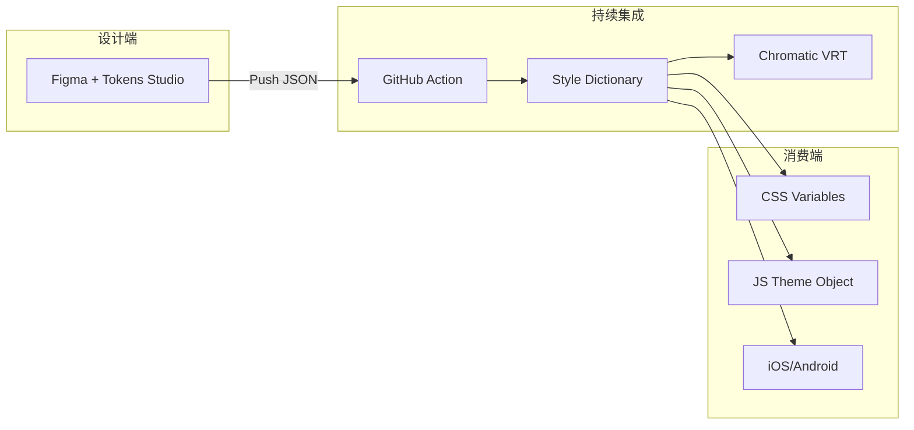
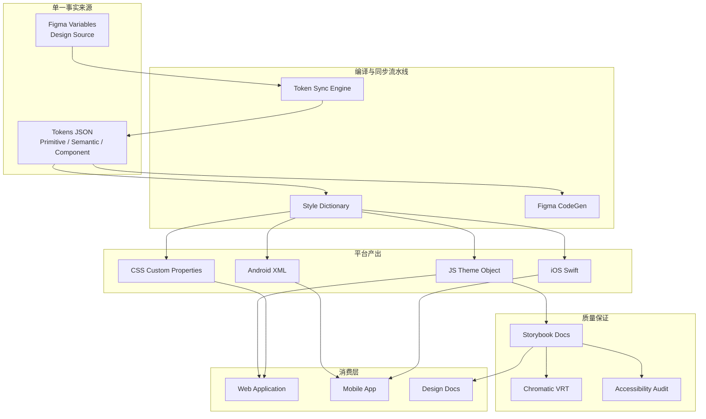
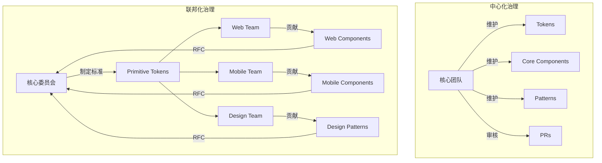

# 设计系统工程化：从Figma到代码

## 引言

在现代前端工程实践中，设计系统（Design System）已从「可选的资产集合」演变为「产品交付的基础设施」。当团队规模跨越数十人、产品矩阵覆盖多个平台时，视觉一致性与开发效率之间的矛盾日益尖锐：设计师在Figma中维护的规范与开发者在代码库中实现的组件之间，始终存在一条难以弥合的语义鸿沟。本章以「双轨并行」的视角，从**形式化理论**层面建立设计系统的严格定义与治理模型，同时从**工程实践**层面剖析从设计工具到生产代码的完整流水线，为大规模前端工程提供可落地的系统化方案。

## 理论严格表述

### 设计系统的形式化定义

设计系统可被形式化地定义为一个四元组 **DS = ⟨C, T, P, D⟩**，其中：

- **C（Component Library）**：可复用UI组件的集合，每个组件 `c ∈ C` 具有接口规范 `I(c)`、视觉规范 `V(c)` 与行为规范 `B(c)`。组件库需满足**组合封闭性**（Compositional Closure）：任意两个组件 `c₁, c₂ ∈ C` 的组合 `c₁ ∘ c₂` 仍属于设计系统的语义空间。
- **T（Design Tokens）**：设计决策的抽象表示，构成从语义层到平台层的映射函数 `φ: Semantic → Platform`。Tokens 是设计系统的「原子单位」，将颜色、字体、间距、动画等视觉属性从具体实现中解耦。
- **P（Pattern Library）**：超越单个组件的交互模式与页面级结构模板，定义了组件在特定上下文中的组合规则与使用约束。
- **D（Documentation）**：形式化与非形式化规范的集合，包括API文档、使用指南、设计原理与贡献规范，确保设计系统作为**共享心智模型**（Shared Mental Model）在组织内传播。

Alla Kholmatova 在《Design Systems》中指出，设计系统的核心目标并非生成一份完美文档，而是建立跨职能团队之间的**共享语言**（Shared Language）——这一观点将设计系统从「资产库」提升为「组织协作协议」。

### 设计Tokens的理论架构

设计Tokens的理论基础建立在**命名空间（Namespace）**与**语义层级（Semantic Layering）**之上。一个严格的Token系统应包含三个逻辑层级：

1. **原始值层（Primitive/Raw Values）**：直接对应平台实现的最小不可分单位，如十六进制颜色 `#1890FF`、字体族 `'Inter, sans-serif'`、间距值 `8px`。此层不应直接暴露给组件消费。

2. **语义层（Semantic Tokens）**：将原始值映射到功能语义，如 `color-background-primary`、`color-text-danger`、`spacing-md`。语义层实现了「意图」与「实现」的解耦：当品牌色变更时，只需调整语义Token到底层原始值的映射，而无需修改组件代码。

3. **组件层（Component Tokens）**：针对特定组件的上下文化Tokens，如 `button-background-primary`、`input-border-focus`。组件Token继承自语义Token，允许在不破坏全局语义体系的前提下对单个组件进行微调。

这一层级结构可形式化为有向无环图（DAG）：原始值作为叶节点，语义Token作为中间节点，组件Token作为根节点。任何Token的变更仅影响其下游依赖，保证了系统的**局部可修改性**（Local Modifiability）。

平台层（Platform Layer）则是Tokens的**目标代码生成平面**。同一套Token源可被编译为CSS自定义属性、iOS的Swift常量、Android的XML资源或JavaScript对象。这一跨平台一致性是设计Token区别于传统Sass/LESS变量的根本特征。

### 组件库的版本化与兼容性

组件库作为设计系统的核心交付物，必须遵循严格的版本化策略。语义化版本控制（SemVer）在此场景下具有特殊含义：

- **Major（主版本）**：任何 `I(c)`（组件接口）、`V(c)`（视觉规范）或 `B(c)`（行为规范）的**非向后兼容变更**。例如，将 `<Button>` 组件的 `onClick` 回调签名从 `(event: MouseEvent) => void` 改为 `(event: MouseEvent, meta: ClickMeta) => void` 即构成Major变更。视觉规范的Breaking Change同样重要：若按钮的默认高度从 `32px` 变为 `36px`，且该变更未通过Token化控制，则属于Major升级。

- **Minor（次版本）**：新增组件或新增可选属性，完全向后兼容。例如为 `<Button>` 增加 `loading` 属性，默认值为 `false`。

- **Patch（补丁版本）**：Bug修复，不改变任何规范语义。例如修复 `<Button>` 在禁用状态下的焦点环显示问题。

Breaking Changes的策略直接影响组织内的**采用率曲线**。激进的Major升级会导致下游团队的迁移成本激增；过度保守则使技术债务累积。最佳实践包括：**弃用周期（Deprecation Cycle）**——在Major升级前至少提供一个Minor版本的弃用警告；**Codemod自动化迁移**——为常见Breaking Change提供AST转换脚本；以及**Canary发布通道**——允许早期采用者在隔离环境中验证新版本。

### 设计-开发工作流的形式化

设计到开发的完整工作流可形式化为一条四阶段流水线：

```
Design → Spec → Code → Test
  ↑_________________________↓
```

1. **Design阶段**：设计师在Figma/Sketch中创建或修改组件，输出视觉规范与交互原型。此阶段的产出是「意图」而非「实现」。

2. **Spec阶段**：将设计意图转化为形式化规范。理想情况下，此阶段通过Figma插件自动生成Token变更集与组件接口草案。Spec阶段是设计与开发之间的「编译器」，负责消除自然语言的歧义性。

3. **Code阶段**：开发者根据Spec实现或更新组件代码。在成熟的工程体系中，Code阶段应消费前一阶段自动生成的Tokens与类型定义，而非手动翻译设计稿。

4. **Test阶段**：包含功能测试（单元测试、集成测试）、视觉回归测试（Visual Regression Testing）与可访问性测试（Accessibility Audit）。测试结果反馈至Design阶段，形成闭环。

这一流水线的关键瓶颈在于 **Design→Spec** 与 **Spec→Code** 的转换。传统工作流中，这两个转换依赖人工翻译（设计师写文档、开发者读文档），误差率极高。工程化的目标是将这两个转换尽可能地自动化。

### 设计系统的治理模型

设计系统的治理（Governance）决定了Token与组件的决策权归属。业界存在两种主要模型：

**中心化治理（Centralized）**：由专职的「设计系统团队」拥有全部决策权。优势在于一致性与迭代速度，劣势在于难以覆盖所有业务场景，容易成为瓶颈。Salesforce的Lightning Design System采用此模型，其专职团队维护了超过500个组件与数千个Tokens。

**联邦化治理（Federated）**：由分布式的「贡献者联盟」共同维护。核心团队制定基础规范（Primitive Tokens、核心组件），业务团队在此之上扩展领域特定组件。优势在于可扩展性与业务适配性，劣势在于一致性风险与合并冲突。Material Design的团队采用联邦化模型，允许各产品团队（Android、Flutter、Web）在共享核心规范的前提下独立演进。

两种模型并非互斥。成熟组织通常采用**混合治理**：核心Tokens与基础组件中心化维护，领域组件联邦化贡献。治理模型的选择取决于组织规模、产品同质性与技术成熟度。

## 工程实践映射

### 设计Token的实现：Style Dictionary与Tokens Studio

在工程层面，设计Token的源文件通常以JSON或YAML格式维护，作为跨平台的「单一事实来源」（Single Source of Truth）。**Style Dictionary**（由Amazon开源）是目前最成熟的Token编译工具链，其工作流程如下：

```
tokens/
├── base/
│   ├── color.json      # 原始颜色值
│   ├── font.json       # 字体族与字号
│   └── spacing.json    # 间距刻度
├── semantic/
│   ├── light.json      # 浅色模式语义映射
│   └── dark.json       # 深色模式语义映射
└── component/
    └── button.json     # 按钮组件Token
```

Style Dictionary通过配置文件定义「平台」与「格式」：

```json
{
  "platforms": {
    "web": {
      "transformGroup": "css",
      "files": [{
        "format": "css/variables",
        "destination": "variables.css"
      }]
    },
    "js": {
      "transformGroup": "js",
      "files": [{
        "format": "javascript/es6",
        "destination": "tokens.js"
      }]
    }
  }
}
```

Style Dictionary内置的Transform pipeline负责处理命名转换（如 camelCase → kebab-case）、值计算（如 rem 转换）与引用解析（Token A 引用 Token B 的值）。开发者可通过自定义Transform扩展这一流程，例如为Tailwind CSS生成 `theme.extend` 配置对象。

**Tokens Studio**（原Figma Tokens）则是设计端的Token管理工具。它作为Figma插件运行，允许设计师在Figma界面中直接编辑JSON格式的Tokens，并将变更推送至Git仓库。Tokens Studio与Style Dictionary的组合构成了「设计→代码」的完整Token流水线：设计师在Figma中调整Token → 通过GitHub Action触发Style Dictionary编译 → 生成各平台的Token文件 → 开发者通过npm包消费最新Token。



### 组件库的开发：Storybook与Chromatic

**Storybook**已成为组件库开发的事实标准。它不仅是一个文档站点生成器，更是一个组件的「隔离开发环境」（Isolated Development Environment）。在Storybook中，每个组件以「Story」的形式呈现——Story是组件在特定状态下的渲染实例：

```javascript
// Button.stories.js
export const Primary = {
  args: {
    variant: 'primary',
    children: 'Click me',
  },
};

export const Disabled = {
  args: {
    variant: 'primary',
    disabled: true,
    children: 'Disabled',
  },
};
```

Storybook的生态系统提供了丰富的Addon：

- **@storybook/addon-a11y**：自动运行Axe可访问性审计，标记对比度不足、缺失ARIA标签等问题。
- **@storybook/addon-interactions**：基于Testing Library的交互测试，验证组件在用户操作后的状态变更。
- **@storybook/addon-design**：将Figma设计稿直接嵌入Story文档，实现设计与代码的并置对比。

**Chromatic**（由Storybook团队维护）是视觉回归测试的托管服务。其工作原理是：在CI流程中捕获每个Story的截图，与基线版本进行像素级比对（Pixel Diff）。任何视觉变更（即使仅为1px的偏移）都会被标记为差异，等待人工审核。Chromatic的核心价值在于**防止无意识的视觉退化**：当开发者修改了一个全局Token或基础组件时，Chromatic会自动检测所有受影响Story的视觉变化，并生成差异报告。

视觉回归测试的阈值策略值得深思。严格的「零像素差异」策略会导致高误报率（字体渲染差异、抗锯齿波动）；过度宽松则漏检真正的回归。实践中通常采用**区域加权策略**：对关键区域（文本、图标）使用严格阈值，对渐变与阴影区域使用宽松阈值。

### Figma到代码的桥梁：API、CodeGen与Token同步

Figma作为设计工具的事实标准，提供了强大的REST API与Plugin API，为「设计→代码」自动化奠定了基础。

**Figma REST API**允许程序化的设计文件访问。通过API，开发者可以：

- 提取设计文件的图层树结构，映射为组件的DOM层级；
- 读取图层的填充、描边、圆角等属性，转换为CSS样式；
- 获取设计Tokens（通过Figma Variables功能），导出为JSON。

**Figma CodeGen**是Figma于2023年推出的代码生成框架。它允许开发者为特定组件编写「代码生成插件」，当设计师在Figma中选中一个图层时，右侧面板自动生成对应的React/Vue代码。CodeGen的核心优势在于**可定制性**：不同于通用的「Figma转代码」工具（往往生成冗长且不可维护的代码），CodeGen允许团队定义自己的组件映射规则与代码模板。

例如，团队可以定义规则：当Figma中某个图层的name匹配 `Button/Primary` 时，生成代码：

```jsx
<Button variant="primary">
  {textContent}
</Button>
```

而非生成底层的 `<div>` 与 `<span>` 堆叠。

**Token同步**是设计-开发一致性的命脉。双向同步策略包括：

- **设计→代码单向同步**：Tokens Studio将Token JSON推送至Git，Style Dictionary编译为代码。此模式简单可靠，是大多数团队的首选。
- **代码→设计单向同步**：开发者修改Token JSON后，通过脚本更新Figma Variables。适用于以代码为单一事实来源的团队。
- **双向同步**：通过Webhook与定时任务实现设计端与代码端的Token双向合并。需要处理冲突消解策略，复杂度较高。

### CSS-in-JS与Design Tokens的结合

设计Tokens在前端代码中的消费方式经历了三代演进：

**第一代：Sass/LESS变量**

```scss
$color-primary: #1890FF;
.button {
  background: $color-primary;
}
```

局限在于变量仅在编译期有效，无法在运行时响应主题切换（如深色模式）。

**第二代：CSS-in-JS（Styled Components / Emotion）**

```javascript
import { theme } from './tokens';
const Button = styled.button`
  background: ${theme.color.primary};
`;
```

CSS-in-JS将Tokens作为JavaScript对象注入，支持运行时主题切换与动态样式计算。代价是运行时性能开销与包体积增加。在大型应用中，Styled Components的样式序列化可能成为性能瓶颈。

**第三代：原子CSS与Token生成（Panda CSS / Tailwind CSS v4）**

```jsx
// Panda CSS
<button className={css({ bg: 'primary.500', px: '4' })}>
  Click me
</button>
```

Panda CSS等工具将Tokens编译为原子CSS类，在构建时生成静态CSS文件，消除了运行时开销。同时保留TypeScript类型安全：`bg: 'primary.500'` 会被类型检查器验证为有效的Token引用。这一方案融合了CSS-in-JS的开发者体验与传统CSS的运行时性能。

### Monorepo中的设计系统

设计系统天然适合Monorepo架构：Tokens、组件库、文档站点、视觉回归测试共享同一仓库，保证了变更的原子性。`@scope/button` 的修改与对应Story的更新可在同一PR中完成。

**Turborepo**是管理Monorepo设计系统的首选工具。其Pipeline配置可精确建模设计系统的依赖图：

```json
{
  "pipeline": {
    "build:tokens": {
      "outputs": ["dist/tokens/**"]
    },
    "build:components": {
      "dependsOn": ["build:tokens"],
      "outputs": ["dist/**"]
    },
    "test:vrt": {
      "dependsOn": ["build:components"]
    }
  }
}
```

Turborepo的Remote Cache功能使CI构建时间从分钟级降至秒级：当开发者仅修改了文档站点的Markdown时，组件库的构建结果可直接从缓存恢复。

**Changesets**是Monorepo版本管理的事实标准。它与语义化版本控制深度集成：

1. 开发者在修改组件时运行 `changeset add`，选择变更的包与SemVer级别（patch/minor/major），并撰写变更摘要。
2. Changesets在 `.changeset/` 目录下生成Markdown文件，描述本次变更。
3. 在发布流程中，Changesets聚合所有未发布的changeset文件，自动计算各包的版本号、生成CHANGELOG、并执行npm publish。

这一流程的优雅之处在于**版本决策的分布化**：每个PR的开发者为其变更选择SemVer级别，而非由发布管理员集中判断。Changesets还自动生成「Version Packages」PR，汇总所有待发布的变更，供团队审核。

### 设计系统的度量

「无法度量则无法管理」。设计系统的成功需要定量指标支撑：

**采用率（Adoption Rate）**：衡量设计系统组件替换自定义实现的程度。计算方法为：

```
采用率 = (设计系统组件实例数) / (总组件实例数) × 100%
```

通过AST分析或运行时标记收集数据。采用率低于60%通常意味着设计系统未满足业务需求（缺失组件、体验不佳）或推广策略失效。

**一致性指数（Consistency Index）**：衡量跨产品/页面的视觉差异。可通过Chromatic的跨项目截图比对实现：若同一组件在不同产品中的渲染差异超过阈值，则一致性指数下降。

**Token覆盖率**：衡量样式属性通过Token消费的比例。理想情况下，所有颜色、间距、字体均应来自Token而非硬编码。通过CSS AST分析可计算：

```
Token覆盖率 = (Token引用数) / (总样式属性数) × 100%
```

**开发效率指标**：包括「创建新页面所需的平均时间」、「设计到开发的交付周期（Lead Time）」、「视觉回归缺陷的逃逸率」。这些指标需要与未采用设计系统的基线进行对比。

## Mermaid 图表

### 图表1：设计系统架构与数据流



### 图表2：组件版本化与发布流程

```mermaid
flowchart LR
    subgraph Dev["开发阶段"]
        A[Feature Branch]
        B[Changeset Added]
    end

    subgraph Review["审核阶段"]
        C[PR Review]
        D[Chromatic VRT]
        E[CI Test]
    end

    subgraph Release["发布阶段"]
        F[Merge to Main]
        G[Version Packages PR]
        H[Publish to npm]
    end

    subgraph Consume["消费阶段"]
        I[Install @latest]
        J[Codemod Migration]
        K[Deprecate Old]
    end

    A --> B
    B --> C
    C --> D
    D --> E
    E --> F
    F --> G
    G --> H
    H --> I
    I --> J
    J --> K
```



### 图表3：治理模型对比



## 理论要点总结

1. **设计系统是四元组**：组件库、设计Tokens、模式库与文档的协同体，其本质是组织内的共享语言与协作协议。

2. **Tokens的三层架构**：原始值层提供平台无关的常量，语义层实现意图与实现的解耦，组件层支持上下文化定制。层级间的DAG依赖关系保证了局部可修改性。

3. **版本化即契约**：SemVer在组件库中具有特殊含义——视觉规范的Breaking Change与API签名变更同等重要。弃用周期、Codemod与Canary通道是平滑升级的关键策略。

4. **自动化是核心**：设计系统工程化的终极目标是将「设计→Spec→Code→Test」流水线中的翻译环节最小化。Style Dictionary、Figma CodeGen与Chromatic分别自动化了Token编译、代码生成与视觉验证。

5. **治理决定上限**：中心化治理保证一致性但可能成为瓶颈，联邦化治理提升扩展性但需防范碎片化。混合模型是大多数成熟组织的最终选择。

6. **度量驱动演进**：采用率、一致性指数、Token覆盖率与开发效率指标共同构成设计系统的健康度仪表盘。数据驱动的决策优于主观判断。

## 参考资源

- **Alla Kholmatova** — *Design Systems*（2017）：设计系统领域的奠基之作，系统阐述了共享语言、模式库与组织协作的理论框架。
- **Brad Frost** — *Atomic Design*（2016）：提出原子设计方法论，为组件库的层级化组织提供了理论模型。
- **Salesforce Lightning Design System** — [https://www.lightningdesignsystem.com](https://www.lightningdesignsystem.com)：企业级设计系统的标杆实践，展示了中心化治理模型在超大规模组织中的应用。
- **Google Material Design** — [https://m3.material.io](https://m3.material.io)：跨平台设计系统的典范，其Token系统（Material Tokens）与动态色彩算法为行业树立了标准。
- **Style Dictionary Documentation** — [https://amzn.github.io/style-dictionary](https://amzn.github.io/style-dictionary)：设计Token工程化的权威工具链文档，涵盖Transform、Format与Platform扩展的完整API。
- **Chromatic Documentation** — [https://www.chromatic.com/docs](https://www.chromatic.com/docs)：视觉回归测试的完整实践指南，包括CI集成、阈值配置与跨浏览器测试策略。
