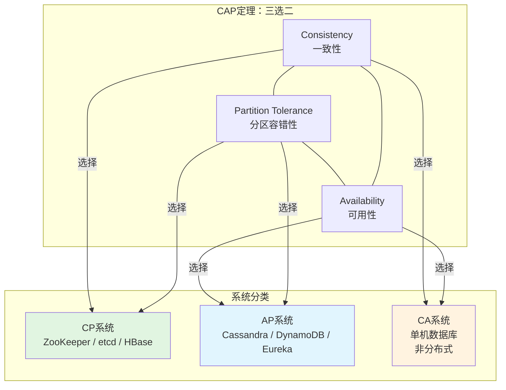
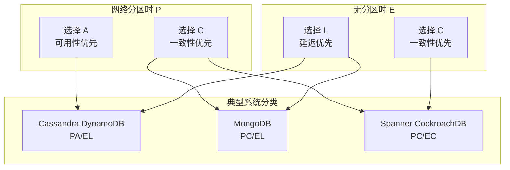
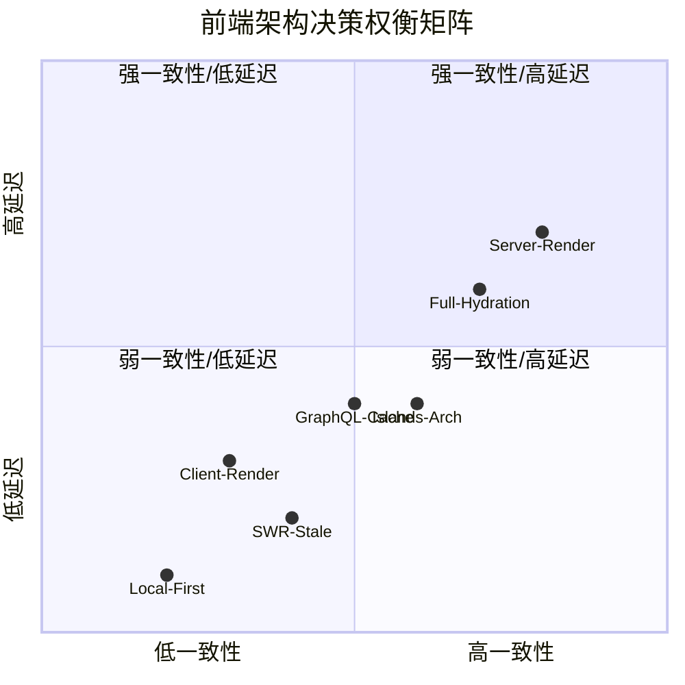
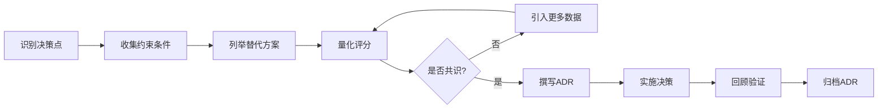

# 权衡分析框架：CAP/PACELC/取舍

## 引言

软件工程的本质是「在约束条件下的最优化决策」。当计算资源无限、网络永远可靠、团队规模恒定时，架构设计将退化为纯粹的算法选择；然而现实恰恰相反——预算有限、网络分区不可避免、需求持续演化。在这样的背景下，**权衡（Trade-off）** 不是可选项，而是架构设计的核心方法论。

本章从分布式系统的经典理论出发，建立CAP/PACELC定理的严格表述，并将其扩展至前端工程、数据库选型、API设计与组织管理的全栈场景。通过形式化的分析框架与工程实践的对照映射，读者将掌握一套可复用的决策工具：不仅知道「选择了什么」，更清楚「放弃了什么」以及「代价是什么」。

## 理论严格表述

### CAP定理：一致性与可用性的不可能三角

CAP定理由Eric Brewer于2000年提出，2012年由Gilbert与Lynch完成形式化证明。定理陈述如下：

> 在一个分布式数据存储系统中，**一致性（Consistency）**、**可用性（Availability）** 与 **分区容错性（Partition Tolerance）** 三者不可兼得，系统最多同时满足其中两项。

三个属性的严格定义：

- **Consistency（一致性）**：所有节点在同一时刻看到的数据相同。形式化地，若写入操作 `W` 在节点 `N₁` 完成后，任何后续读取操作 `R` 在任何节点 `Nᵢ` 上执行，都必须返回 `W` 写入的值或更晚的值。这等价于线性一致性（Linearizability）。

- **Availability（可用性）**：每个请求都能在有限时间内获得非错误的响应，但不保证响应包含最新写入的数据。形式化地，系统中非故障节点必须在收到请求后的有限时间内返回结果。

- **Partition Tolerance（分区容错性）**：即使网络发生分区（部分节点之间的消息丢失），系统仍能继续运行。由于网络分区在物理网络中不可避免（交换机故障、海底光缆断裂、BGP路由错误），分区容错性通常被视为**必选项**而非可选项。

由此推论，实际的分布式系统只能在**CP**（Consistency + Partition Tolerance）与**AP**（Availability + Partition Tolerance）之间选择：

- **CP系统**：在网络分区时拒绝服务，保证数据一致性。例如ZooKeeper、etcd、HBase。适用于金融交易、库存扣减等强一致性场景。
- **AP系统**：在网络分区时继续服务，但可能返回陈旧数据。例如Cassandra、DynamoDB、Eureka。适用于社交网络 feed、商品推荐等可容忍最终一致性的场景。

值得注意的是，CAP定理描述的是**极端情况**（网络分区期间的瞬时行为），而非系统的常态。大多数生产系统在99.9%的时间里同时满足C与A，仅在分区发生的瞬间进行取舍。

### PACELC定理：延迟与一致性的常态权衡

CAP定理的局限在于仅关注「分区发生时」的权衡，而忽略了「无分区时」的决策空间。Daniel J. Abadi于2012年提出PACELC定理，将权衡框架扩展至正常网络条件下：

> **PACELC**：如果存在分区（**P**artition），则系统必须在可用性（**A**vailability）与一致性（**C**onsistency）之间取舍；**E**lse（无分区时），系统必须在延迟（**L**atency）与一致性（**C**onsistency）之间取舍。

PACELC揭示了被CAP忽视的维度：**延迟（Latency）**。在无分区的情况下，强一致性通常需要节点间的协调（如两阶段提交、Raft日志复制），这引入了网络往返延迟。反之，若选择最终一致性，写入可在本地节点确认后立即返回，延迟显著降低。

PACELC将系统分为四类：

| 类型 | 分区时 | 无分区时 | 典型系统 |
|------|--------|----------|----------|
| PA/EL | 可用性优先 | 延迟优先 | Cassandra、DynamoDB |
| PA/EC | 可用性优先 | 一致性优先 | 无典型系统 |
| PC/EL | 一致性优先 | 延迟优先 | MongoDB（默认配置） |
| PC/EC | 一致性优先 | 一致性优先 | Spanner、CockroachDB |

Google Spanner通过**TrueTime API**（基于原子钟与GPS的时钟同步）实现了看似矛盾的PC/EC目标：通过精确的时间戳保证外部一致性（External Consistency），同时通过乐观并发控制降低协调延迟。然而，这一方案的经济成本极高（专用硬件、原子钟），印证了「没有免费午餐」的权衡本质。

### 性能-可用性-一致性三角

在CAP与PACELC之上，工程实践中常面临更宏观的三角权衡：**性能（Performance）**、**可用性（Availability）** 与 **一致性（Consistency）**。这一框架将CAP从「数据存储系统」推广至「任意分布式系统」：

- **性能 vs 一致性**：缓存是这一权衡的典型体现。引入缓存提升读取性能，但缓存与数据库之间的同步延迟导致了数据不一致。缓存策略的选择（Cache-Aside、Read-Through、Write-Through、Write-Behind）本质上是在性能与一致性光谱上的不同落点。

- **性能 vs 可用性**：为提升性能而引入的复杂度（如异步消息队列、批处理）可能降低系统的可用性——消息队列故障会导致整个请求链路中断。反之，为提升可用性而引入的冗余（多活架构、副本同步）会增加协调开销，降低峰值性能。

- **可用性 vs 一致性**：这是CAP定理的核心，已在上一节详述。

Martin Kleppmann在《Designing Data-Intensive Applications》中指出，这一三角并非静态的「三选二」，而是连续的决策空间。现代系统通过**可调一致性（Tunable Consistency）**允许操作级别的一致性选择：同一份数据，用户评论的写入采用最终一致性（高可用），支付状态的写入采用强一致性（高可靠）。

### 软件架构中的通用权衡框架

质量属性之间的冲突可形式化为**冲突矩阵（Conflict Matrix）**。Bass等人在《Software Architecture in Practice》中提出，软件架构的决策本质上是多个质量属性（Quality Attributes）之间的加权优化：

| 质量属性 | 性能 | 安全性 | 可修改性 | 可用性 | 可测试性 |
|----------|------|--------|----------|--------|----------|
| 性能 | — | ↓ | ↓ | ↓ | ↓ |
| 安全性 | ↓ | — | ↓ | ↓ | ↓ |
| 可修改性 | ↓ | ↓ | — | ↑ | ↑ |
| 可用性 | ↓ | ↓ | ↑ | — | ↑ |
| 可测试性 | ↓ | ↓ | ↑ | ↑ | — |

（↑ 表示协同，↓ 表示冲突）

例如，**安全性**与**性能**通常冲突：加密/解密、访问控制审计、入侵检测都会增加计算开销。**可修改性**与**可用性**通常协同：模块化的架构既易于修改，也便于通过组件冗余提升可用性。

架构师的核心能力在于：**识别当前阶段的主导质量属性，并量化其他属性的牺牲阈值**。初创公司的主导属性是「上市时间」（可修改性的子集），愿意牺牲安全性与性能；金融科技公司的主导属性是「安全性」，愿意牺牲开发速度与硬件成本。

### 成本-收益分析在架构决策中的应用

权衡决策若停留在定性层面（「A更好」或「B更差」），容易陷入主观争论。形式化的**成本-收益分析（Cost-Benefit Analysis, CBA）** 要求将每个选项量化为可比较的指标：

1. **直接成本**：开发人力、基础设施费用、许可费用、培训成本。
2. **间接成本**：技术债务利息（维护旧系统的额外开销）、机会成本（因选择A而放弃B的潜在收益）。
3. **风险成本**：方案失败的概率 × 失败的损失。高风险方案即使期望收益高，也可能因尾部风险被否决。
4. **收益量化**：性能提升带来的用户体验改善（转化为留存率/转化率）、开发效率提升（转化为上市时间缩短）、运维成本降低。

架构决策记录（Architecture Decision Record, ADR）是承载CBA的文档载体。一份完整的ADR不仅记录「选择了什么」，更记录「考虑过哪些替代方案」、「每个方案的量化评分」以及「最终决策的加权依据」。

## 工程实践映射

### 前端架构中的权衡

前端领域虽然通常不涉及传统意义上的「分布式数据存储」，但CAP/PACELC的思维框架依然适用——前端系统同样面临一致性、可用性与延迟的取舍。

**Bundle大小 vs 功能丰富度**

前端应用的核心资源约束是网络带宽与解析时间。一个包含全量图表库、国际化数据、图标集的Bundle可能在gzip后仍达到500KB以上，在3G网络下首次加载时间超过3秒。权衡策略包括：

- **代码分割（Code Splitting）**：按路由或组件动态加载，将首屏Bundle降至临界值以下。代价是后续的交互延迟（需要加载额外Chunk）。
- **Tree Shaking**：依赖ESM的静态分析消除死代码。代价是要求所有依赖库提供ESM版本，且对副作用（Side Effects）的分析存在边界情况。
- **功能降级**：核心功能同步加载，高级功能（富文本编辑器、数据可视化）异步按需加载。代价是功能发现率降低与交互复杂度的增加。

**SSR vs CSR的性能权衡**

服务端渲染（SSR）与客户端渲染（CSR）的争论是前端架构的经典权衡：

| 维度 | SSR | CSR |
|------|-----|-----|
| 首屏时间（FCP） | 快（直接返回HTML） | 慢（需下载JS并执行） |
| 交互时间（TTI） | 慢（需Hydration） | 快（JS已加载） |
| 服务器成本 | 高（每请求CPU计算） | 低（静态文件CDN） |
| SEO | 优（完整HTML） | 差（需预渲染方案） |
| 开发复杂度 | 高（同构逻辑、状态同步） | 低（纯客户端逻辑） |

现代框架（Next.js、Nuxt、SvelteKit）提供了混合策略：**渐进式Hydration**（优先Hydration可见区域）、**流式SSR**（先返回HTML骨架，再流式注入数据）、**岛屿架构**（仅对交互区域进行Hydration）。这些方案试图在SSR与CSR之间寻找帕累托最优。

**类型安全 vs 开发速度**

TypeScript的普及使「类型安全」成为前端工程的基础假设，但严格的类型约束同样带来成本：

- **any的合理使用**：在原型验证阶段或第三方库类型缺失时，适度使用 `any` 可加速开发。但 `any` 的滥用会侵蚀类型系统的完整性，导致「类型债务」。
- **泛型复杂度**：为追求API的完全类型安全，过度使用泛型与高阶类型（Conditional Types、Mapped Types）会使代码难以维护。团队协作中，「下一个开发者能否在10分钟内理解这段类型」是更重要的质量标准。
- **zod/yup验证**：在运行时与编译时之间建立桥梁。代价是Bundle体积增加（zod约10KB gzip）与运行时验证开销。

### 数据库选型权衡

数据库选型是CAP定理最直接的应用场景。前端工程师虽不直接管理数据库，但在BFF（Backend-for-Frontend）层与Serverless函数中 increasingly 面临这一决策。

**SQL vs NoSQL**

| 维度 | SQL（PostgreSQL） | NoSQL（MongoDB） |
|------|-------------------|-----------------|
| 数据模型 | 严格Schema，关系型 | 灵活Schema，文档型 |
| 一致性 | ACID强一致性 | 最终一致性（可配置） |
| 查询能力 | 复杂JOIN、窗口函数 | 简单查询、聚合管道 |
| 扩展性 | 垂直扩展为主，分片复杂 | 水平扩展原生支持 |
| 适用场景 | 财务数据、复杂报表 | 内容管理、用户画像 |

**NewSQL**（CockroachDB、TiDB、 YugabyteDB）试图打破这一二分法：提供SQL接口与ACID保证，同时具备NoSQL的水平扩展能力。代价是更高的运维复杂度与硬件要求（通常需要SSD与高速网络）。

**一致性级别选择**

即使在同一数据库内，一致性也是可调的：

- **读己之写（Read Your Writes）**：保证用户总能看到自己刚刚提交的数据。社交平台的发帖功能需要这一保证。
- **单调读（Monotonic Reads）**：保证用户不会看到数据回退。例如，用户刷新页面后不应看到旧版本的评论列表。
- **因果一致性（Causal Consistency）**：保证因果关系的事件按顺序可见。若评论B是对评论A的回复，则任何看到B的节点必须先看到A。

前端状态管理（Redux、Zustand、TanStack Query）中同样存在一致性级别的选择。TanStack Query的 `staleTime` 与 `cacheTime` 配置本质上是在「数据新鲜度」与「请求数量」之间进行PACELC式的延迟-一致性权衡。

### API设计权衡

**REST vs GraphQL vs gRPC**

| 维度 | REST | GraphQL | gRPC |
|------|------|---------|------|
| 协议 | HTTP/1.1 | HTTP/1.1或HTTP/2 | HTTP/2 |
| 数据格式 | JSON | JSON | Protocol Buffers（二进制） |
| 请求模型 | 多端点，固定结构 | 单端点，客户端驱动查询 | 多端点，强类型契约 |
| 过度获取（Over-fetching） | 常见 | 消除 | 消除 |
| 类型系统 | 弱（OpenAPI补充） | 强（Schema定义） | 强（.proto定义） |
| 浏览器支持 | 原生 | 原生 | 需gRPC-Web代理 |
| 适用场景 | 公共API、简单CRUD | 复杂数据图、聚合查询 | 微服务间通信 |

REST的简单性使其成为公共API的首选，但N+1查询问题与版本管理（URL版本 `/v1/` vs Header版本）长期困扰开发者。GraphQL通过客户端驱动的查询消除了过度获取，但引入了查询复杂度攻击（Complexity Attack）与缓存策略的复杂性。gRPC在微服务内部通信中性能卓越，但浏览器端的gRPC-Web需要Envoy或类似代理，增加了基础设施复杂度。

前端工程中的API层通常采用**BFF模式**（Backend-for-Frontend）进行折中：为每个客户端（Web、iOS、Android）维护独立的BFF服务，将通用GraphQL/gRPC接口转换为客户端优化的REST接口。代价是BFF层的维护成本与「分布式单体」的风险。

### 团队规模与架构复杂度的权衡

Conway定律指出：「设计系统的架构受制于产生这些设计的组织的沟通结构」。团队规模直接决定了架构复杂度的合理上限。

**小团队（< 10人）**：应优先选择**单体架构**与**全栈框架**（Next.js、Nuxt、Django）。微服务架构的拆分 overhead（服务发现、分布式追踪、DevOps）对小团队是致命的。此时「可修改性」与「开发速度」是主导质量属性。

**中团队（10-50人）**：可引入**模块化单体**（Modular Monolith）或**有限微服务**（核心服务拆分，边缘功能保留单体）。前端层面可采用Monorepo管理多个应用，共享组件库与工具链。

**大团队（> 50人）**：微服务架构的价值开始显现。但微服务不是「银弹」——如果服务边界划分不清晰，会退化为「分布式单体」，同时承受微服务的运维复杂度与单体的耦合债务。领域驱动设计（DDD）的限界上下文（Bounded Context）是划分服务边界的理论依据。

**认知负荷（Cognitive Load）**是常被忽视的约束。一个开发者能同时理解的系统复杂度有限（通常认为一个模块的依赖数不应超过7±2）。架构拆分的目标不仅是技术解耦，更是**认知解耦**——让单个开发者能在不理解全系统的情况下交付价值。

### 技术债务与交付速度的权衡

技术债务（Technical Debt）是Ward Cunningham提出的隐喻：为快速交付而采取的次优工程决策，如同借债——短期内获得现金流（上市时间），长期需支付利息（维护成本）。

技术债务可分为四类：

1. **谨慎债务（Prudent Debt）**：有意识地借款，且知道如何偿还。例如，为抢占市场而使用已知有缺陷的库，同时记录替换计划。
2. **鲁莽债务（Reckless Debt）**：无意识地借款，甚至不知道自己在借款。例如，复制粘贴代码而不理解其副作用。
3. **有计划债务（Deliberate Debt）**：明确记录并在路线图中有偿还计划。
4. **无意债务（Inadvertent Debt）**：因知识不足或经验缺乏而产生的债务，通常在事后才被发现。

技术债务的管理不是「零容忍」，而是「可控杠杆」。成熟的团队会建立**技术债务登记册（Technical Debt Register）**，记录每项债务的位置、影响、估算偿还成本与优先级。在迭代规划中，固定分配20%的带宽用于债务偿还，防止利息滚雪球。

前端工程中的典型技术债务包括：

- **框架锁定**：使用某个UI框架的私有API，导致升级困难。
- **全局状态滥用**：将所有状态放入Redux，导致组件复用性降低。
- **CSS特异性战争**：过度使用 `!important` 与嵌套选择器，导致样式难以覆盖。
- **测试缺口**：为赶工期跳过集成测试，导致回归缺陷频发。

### 建立架构决策记录（ADR）的流程

ADR是承载权衡分析的标准化文档。Michael Nygard提出的ADR格式已成为业界共识：

```markdown
# ADR-042: 采用GraphQL作为BFF层API协议

## 状态
Accepted

## 背景
当前REST API存在严重的过度获取问题。移动端首页需要发起7个请求才能组装完整数据，导致首屏时间超过3秒。

## 决策
采用Apollo Server构建GraphQL BFF层，聚合下游微服务的数据。

## 后果
### 正向
- 移动端首页请求数从7降至1
- 客户端可精确选择所需字段

### 负向
- 团队需学习GraphQL Schema设计与Resolver优化
- 需引入DataLoader解决N+1查询问题
- CDN缓存策略需从URL-based改为Persisted Query-based

## 替代方案
| 方案 | 优点 | 缺点 | 评分(1-5) |
|------|------|------|-----------|
| REST + 聚合端点 | 简单，团队熟悉 | 端点爆炸，版本管理困难 | 3 |
| gRPC + gRPC-Web | 高性能，强类型 | 浏览器支持复杂，需代理 | 2 |
| GraphQL | 灵活，精确查询 | 学习曲线，缓存复杂 | 5 |
```

ADR的积累形成**架构知识库**，新成员可通过阅读ADR快速理解系统的历史决策与约束上下文。ADR不应是「终身判决」——当技术环境变化时（如新框架成熟、团队规模扩大），应发起新的ADR修订旧决策。

## Mermaid 图表

### 图表1：CAP定理的决策空间



### 图表2：PACELC定理的扩展决策空间



### 图表3：前端架构权衡矩阵



### 图表4：架构决策流程



## 理论要点总结

1. **CAP是分布式系统的基石定理**：一致性、可用性与分区容错性不可兼得。由于分区容错性在物理网络中不可避免，实际决策简化为CP vs AP的选择。但CAP仅描述极端情况，常态下的系统可同时满足C与A。

2. **PACELC扩展了常态权衡**：无分区时，延迟与一致性构成新的取舍维度。PACELC将系统分为PA/EL、PC/EL、PC/EC等类型，更精确地刻画了现代分布式数据库的行为特征。

3. **质量属性冲突矩阵是通用框架**：性能、安全性、可修改性、可用性、可测试性之间存在系统性的协同与冲突。架构师的核心任务是识别主导质量属性并量化牺牲阈值。

4. **成本-收益分析需要形式化**：定性讨论「A更好」容易陷入主观。ADR通过直接成本、间接成本、风险成本与收益量化的四维度评分，使决策可追溯、可复现。

5. **权衡无处不在**：前端Bundle大小与功能丰富度、SSR与CSR的渲染策略、REST与GraphQL的协议选择、团队规模与架构复杂度、技术债务与交付速度——每一个工程决策都是多目标优化问题。

6. **ADR是组织知识的基础设施**：架构决策记录不仅服务当前团队，更是新成员理解系统约束、未来团队修订决策的历史上下文。没有ADR的组织注定重复犯错。

## 参考资源

- **Eric Brewer** — "Towards Robust Distributed Systems"（PODC 2000, Keynote）：CAP定理的原始提出，阐述了一致性、可用性与分区容错性的不可能三角。
- **Seth Gilbert & Nancy Lynch** — "Brewer's Conjecture and the Feasibility of Consistent, Available, Partition-Tolerant Web Services"（ACM SIGACT News, 2002）：CAP定理的形式化证明。
- **Daniel J. Abadi** — "Consistency Tradeoffs in Modern Distributed Database System Design"（IEEE Computer, 2012）：PACELC定理的提出，扩展了CAP框架至延迟维度。
- **Martin Kleppmann** — *Designing Data-Intensive Applications*（O'Reilly, 2017）：数据系统设计的权威指南，第7-9章深入探讨一致性模型、分布式事务与权衡决策。
- **Len Bass, Paul Clements, Rick Kazman** — *Software Architecture in Practice*（4th ed., Addison-Wesley, 2021）：软件架构的经典教材，系统阐述了质量属性、架构权衡分析方法（ATAM）与架构决策记录。
- **Michael Nygard** — "Documenting Architecture Decisions"（2011）：ADR格式的提出，定义了架构决策记录的标准结构（Context / Decision / Consequences）。
