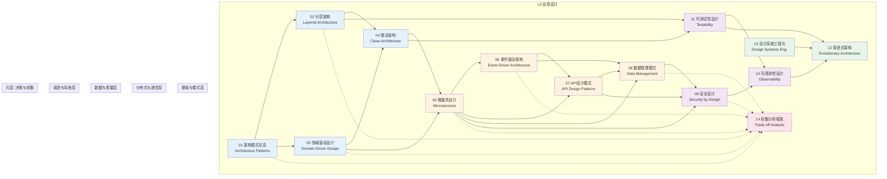

# 应用设计

## 专题概述

**应用设计**位于理论层次模型的 **L5 层次**，是连接底层技术原理（L0-L4）与上层用户体验（L6 UI原理）的关键桥梁。如果说编程范式（L3）回答的是"如何组织代码"，框架架构（L4）回答的是"如何构建组件"，那么应用设计（L5）回答的则是"如何构建完整的、可演进的、可维护的软件系统"。在 JavaScript/TypeScript 生态中，从单个 `Node.js` 服务到大型微服务集群，从简单的 `React` SPA 到复杂的企业级中台，应用设计的决策直接决定了系统的生命周期成本、团队开发效率与最终的产品质量。

本专题系统性地覆盖了 **14 个核心子主题**：

1. **架构模式总览** — 理解分层、微内核、管道-过滤器、CQRS、事件溯源等经典模式的适用场景
2. **分层架构** — 从经典三层架构到端口-适配器模式，掌握关注点分离的艺术
3. **领域驱动设计 (DDD)** — 通过统一语言、限界上下文、聚合根与实体值对象建模复杂业务领域
4. **整洁架构 (Clean Architecture)** — 以依赖规则为核心，构建框架无关、可测试、独立的业务核心
5. **微服务设计** — 服务拆分策略、分布式数据管理、服务间通信与分布式事务协调
6. **事件驱动架构 (EDA)** — 基于事件的解耦、事件溯源、CQRS 与 saga 模式的深度解析
7. **API 设计模式** — RESTful、GraphQL、gRPC、RPC 风格与版本化策略的理论与实践
8. **数据管理模式** — 关系型、文档型、图数据库、缓存、搜索与数据一致性的架构决策
9. **安全设计** — 纵深防御、零信任架构、OWASP Top 10 与隐私 by design 原则
10. **可观测性设计** — 日志、指标、追踪三大支柱与结构化可观测性平台的构建
11. **可测试性设计** — 测试金字塔、契约测试、混沌工程与测试驱动架构
12. **演进式架构** — 适应度函数、架构量子、增量式重构与反脆弱系统构建
13. **设计系统工程化** — 设计系统不仅是设计资产，更是工程化交付的代码产物与基础设施
14. **权衡分析框架** — CAP 定理、PACELC 定理、一致性谱系与架构决策记录（ADR）方法论

在 `TypeScript` 全栈开发的语境下，应用设计的挑战尤为突出：同一门语言既运行在浏览器端（受 UI 原理约束），又运行在服务器端（受分布式系统原理约束），还需要通过 API 契约进行跨边界通信。这种"同构"特性既是效率的源泉，也是复杂性的温床——开发者需要在单一语言中驾驭从内存管理到网络分区、从组件状态到分布式事务的完整复杂度谱系。

> "架构是那些重要的东西……无论它是什么。" — Ralph Johnson

---

## 核心内容导航

本专题包含 **14 篇深度文章** 与本首页，构成完整的应用设计知识体系。

### 01. 架构模式总览

**文件**: [01-architecture-patterns-overview.md](./01-architecture-patterns-overview.md)

任何软件系统都可以被看作是一组架构决策的累积结果。本文提供架构模式的"全景地图"，系统分类并对比主流架构风格：

- **分层架构 (Layered Architecture)**: 表现层、业务逻辑层、数据访问层的经典分离
- **管道-过滤器 (Pipes and Filters)**: 数据流处理系统的组合模式，适用于编译器、音视频处理
- **微内核/插件架构 (Microkernel/Plugin)**: `VS Code` 扩展系统、浏览器内核的设计哲学
- **微服务架构 (Microservices)**: 围绕业务能力组织服务，独立部署与扩展
- **事件驱动架构 (Event-Driven)**: 通过异步事件解耦生产者与消费者
- **CQRS (Command Query Responsibility Segregation)**: 读写分离的极致形式
- **事件溯源 (Event Sourcing)**: 以事件流为唯一事实来源的状态重建模式
- **空间架构 (Space-Based Architecture)**: 基于数据网格的高可用、可扩展系统

文章为每种模式提供决策矩阵（复杂度、团队规模、性能需求、一致性要求、演进速度），帮助读者在 JavaScript/TypeScript 项目初期做出 informed 的架构选择。

> **关键概念**: 架构风格、决策矩阵、CQRS、事件溯源、微内核、管道-过滤器

---

### 02. 分层架构

**文件**: [02-layered-architecture.md](./02-layered-architecture.md)

分层是最古老也最有效的架构组织原则。本文从经典的三层架构（表现层、业务层、数据层）出发，逐步深入到更现代的分层变体：

- **六边形架构 / 端口-适配器 (Hexagonal/Ports & Adapters)**: Alistair Cockburn 提出的以领域为核心的分层方式，将应用程序视为中心，外部依赖通过"端口"接入
- **洋葱架构 (Onion Architecture)**: Jeffrey Palermo 的同心圆分层，强调依赖向内指向领域核心
- **整洁架构 (Clean Architecture)**: Robert C. Martin 的综合体系，以依赖规则（Dependency Rule）为唯一约束
- **垂直切片架构 (Vertical Slice Architecture)**: Jimmy Bogard 提出的按功能而非技术分层的方式，减少跨层耦合

文章详细讲解在 `Node.js` / `TypeScript` 项目中实现分层架构的工程实践：目录结构约定、依赖注入容器（`TSyringe`、 `InversifyJS`、 `NestJS` 内置容器）、模块边界强制（`Nx` 的 module boundaries、ESLint 的 `restrict-imports`）、以及分层架构与 monorepo 工作区的协同。

> **关键概念**: 六边形架构、端口-适配器、洋葱架构、依赖规则、垂直切片、依赖注入

---

### 03. 领域驱动设计

**文件**: [03-domain-driven-design.md](./03-domain-driven-design.md)

领域驱动设计（Domain-Driven Design, DDD）由 Eric Evans 在 2003 年系统阐述，是应对复杂业务领域的核心方法论。本文从战略设计与战术设计两个维度深入解析：

**战略设计**: 统一语言（Ubiquitous Language）、限界上下文（Bounded Context）、上下文映射（Context Mapping）模式（共享内核、客户-供应商、跟随者、防腐层 ACL、开放主机服务 OHS、发布语言 PL）、大泥球（Big Ball of Mud）的识别与分解策略。

**战术设计**: 实体（Entity）、值对象（Value Object）、聚合（Aggregate）与聚合根（Aggregate Root）、领域服务（Domain Service）、仓储（Repository）、工厂（Factory）、领域事件（Domain Event）的模式定义与实现指南。

文章提供在 `TypeScript` 中实现 DDD 战术模式的完整代码示例，包括：使用 branded types 实现值对象的不可变性与相等性判断、利用 `zod` 或 `io-ts` 进行领域层输入验证、通过事件总线实现领域事件的发布-订阅、以及如何在 `NestJS` 或纯 `Express` 项目中组织 DDD 目录结构。

> **关键概念**: 统一语言、限界上下文、上下文映射、聚合根、领域事件、防腐层、值对象

---

### 04. 整洁架构

**文件**: [04-clean-architecture.md](./04-clean-architecture.md)

Robert C. Martin（Uncle Bob）提出的整洁架构是分层架构思想的集大成者。本文深入剖析整洁架构的核心——**依赖规则**：源代码依赖关系必须只指向内部，指向更高层级的策略。外层（框架、驱动、UI、数据库）依赖内层（用例、领域实体），反之不可。

内容涵盖：

- **四个同心圆层**: 实体（Entities）、用例（Use Cases）、接口适配器（Interface Adapters）、框架与驱动（Frameworks & Drivers）
- **跨层数据流**: 请求从控制器进入，经用例 orchestrate，通过 presenter/formatter 返回响应的完整流程
- **用例驱动设计**: 以用户场景为中心组织代码，每个用例对应一个 interactor/service
- **框架无关性**: 核心业务逻辑不依赖任何外部框架，便于替换 `Express` 为 `Fastify`、 `TypeORM` 为 `Prisma`

文章提供完整的 `TypeScript` 整洁架构项目模板，展示如何在 `Node.js` 后端中实现零框架依赖的领域层，以及前端领域（如将整洁架构应用于复杂的 `React` 业务逻辑层）。

> **关键概念**: 依赖规则、实体、用例、接口适配器、框架无关性、用例驱动

---

### 05. 微服务设计

**文件**: [05-microservices-design.md](./05-microservices-design.md)

微服务不是银弹，而是一系列权衡后的架构决策。本文基于 Sam Newman 的系统性方法论，全面讲解微服务设计的核心议题：

- **服务拆分策略**: 按业务能力拆分（领域驱动设计）、按子域拆分（bounded context）、按事务边界拆分、按团队组织拆分（康威定律）
- **服务间通信**: 同步通信（REST、GraphQL、gRPC）与异步通信（消息队列、事件总线、pub/sub）的选型矩阵
- **分布式数据管理**: 数据库 per service 原则、Saga 模式（编排式 vs 协同式）处理分布式事务、事件溯源与 CQRS 在微服务中的应用
- **服务发现与注册**: Consul、Eureka、Kubernetes DNS、服务网格（Istio、Linkerd）
- **容错设计**: 熔断器（Circuit Breaker）、舱壁（Bulkhead）、重试与退避（Retry & Backoff）、超时策略
- **API 网关**: 边缘网关、Backend for Frontend (BFF) 模式、GraphQL 联邦（Federation）

文章特别关注 JavaScript/TypeScript 生态中的微服务实践：`NestJS` 的微服务模块、 `Moleculer` 框架、 `pm2` 集群模式、以及基于 `Bull`/`BullMQ` 的 Redis 队列实现 Saga 模式。

> **关键概念**: 服务拆分、Saga模式、熔断器、API网关、BFF、服务网格、康威定律

---

### 06. 事件驱动架构

**文件**: [06-event-driven-architecture.md](./06-event-driven-architecture.md)

事件驱动架构（EDA）是现代分布式系统的核心组织方式。本文从事件的本质定义出发，系统讲解：

- **事件类型谱系**: 领域事件（Domain Event，如 `OrderPlaced`）、集成事件（Integration Event，跨服务边界）、通知事件（Event Notification）、携带状态转移的事件（Event-Carried State Transfer, ECST）
- **事件溯源 (Event Sourcing)**: 以追加-only 事件流替代状态存储，支持任意时间点的状态重建、审计追踪与复杂分析
- **CQRS 深度解析**: 命令端与查询端的彻底分离，读写模型的独立优化，投影（Projection）与物化视图（Materialized View）的构建
- **事件总线模式**: 本地事件总线（进程内 pub/sub）与分布式事件总线（Kafka、RabbitMQ、NATS、AWS EventBridge）
- **消费者设计**: 幂等消费者、至少一次投递、消息排序保证、死信队列（DLQ）

文章提供 `TypeScript` 中的完整 EDA 实现：使用 `EventEmitter3` 构建本地事件总线、使用 `KafkaJS` 或 `amqplib` 连接分布式消息系统、使用 `MongoDB` change streams 或 PostgreSQL `LISTEN/NOTIFY` 实现轻量级事件分发，以及 `NestJS` 的 `@EventPattern` 装饰器体系。

> **关键概念**: 领域事件、事件溯源、CQRS、事件总线、幂等性、死信队列、物化视图

---

### 07. API 设计模式

**文件**: [07-api-design-patterns.md](./07-api-design-patterns.md)

API 是系统之间的契约，也是团队之间的契约。本文系统对比主流 API 风格并深入每种模式的最佳实践：

- **RESTful API**: Richardson 成熟度模型（Level 0-3）、HATEOAS、资源命名规范、HTTP 状态码语义化、分页策略（offset vs cursor）、过滤/排序/字段选择（`?filter`, `?sort`, `?fields`）
- **GraphQL**: 类型系统与 Schema 设计、Resolver 模式、N+1 问题与 DataLoader、订阅（Subscription）实现、联邦架构（Apollo Federation）与 Schema Stitching
- **gRPC**: Protocol Buffers 与强类型契约、四种服务类型（Unary/Server Streaming/Client Streaming/Bidirectional）、拦截器、健康检查、与 HTTP/2 的协同
- **RPC 风格**: tRPC 的端到端类型安全、`Next.js` Server Actions、`Remix` 的 loader/action 模式
- **WebSocket**: 实时双向通信、Socket.IO 的房间与命名空间、与 HTTP API 的共存策略
- **API 版本化**: URL 版本、Header 版本、Schema 版本、弃用策略与兼容性保证
- **API 文档**: OpenAPI/Swagger、GraphQL Introspection、自动化文档生成

文章提供 `TypeScript` 中实现每种 API 风格的完整示例，并分析 `Zod`/`Valibot` 在运行时 API 契约验证中的价值。

> **关键概念**: REST成熟度、GraphQL Schema、gRPC、tRPC、API版本化、OpenAPI、DataLoader

---

### 08. 数据管理模式

**文件**: [08-data-management-patterns.md](./08-data-management-patterns.md)

数据是应用系统的核心资产，数据管理模式的选型直接影响系统性能、一致性与可演进性。本文涵盖：

- **持久化策略**: 关系型数据库（PostgreSQL、MySQL）的 ACID 保证、文档数据库（MongoDB）的灵活模式、图数据库（Neo4j）的关系遍历优势、时序数据库（TimescaleDB、InfluxDB）的写优化、列存储（ClickHouse）的分析优势
- **ORM 与查询构建器**: `Prisma`（类型安全、迁移系统、查询引擎）、`TypeORM`（装饰器驱动、Active Record/Data Mapper）、`Drizzle`（SQL-like、轻量）、`Kysely`（类型安全查询构建器）的对比与选型
- **缓存策略**: 缓存模式（Cache-Aside、Read-Through、Write-Through、Write-Behind）、缓存失效策略（TTL、LRU、LFU）、分布式缓存（Redis、Memcached）、缓存穿透/击穿/雪崩的防护
- **搜索与索引**: Elasticsearch/OpenSearch 的全文搜索、PostgreSQL 的 `tsvector`/`GIN` 索引、Meilisearch 的轻量搜索
- **数据一致性**: 强一致性 vs 最终一致性、分布式事务（2PC、3PC、Saga）、BASE 理论、CRDTs 在协同编辑中的应用

文章特别关注 `TypeScript` 全栈项目中的数据层架构：如何设计 Prisma Schema 以支持 DDD 聚合、如何使用 Redis 缓存与数据库的同步策略、以及 Serverless 环境（Vercel、AWS Lambda）中的数据库连接池管理。

> **关键概念**: ORM选型、缓存模式、分布式事务、最终一致性、CRDT、连接池、数据迁移

---

### 09. 安全设计

**文件**: [09-security-by-design.md](./09-security-by-design.md)

安全不是补丁，而是设计原则。本文从"纵深防御"（Defense in Depth）与"零信任架构"（Zero Trust Architecture）两大核心理念出发，系统讲解应用安全设计的完整框架：

- **身份与访问管理**: OAuth 2.0 / OpenID Connect 流程、JWT 的安全使用与常见漏洞（none algorithm、弱密钥）、Refresh Token 轮换、PKCE 扩展、多因素认证（MFA）
- **传输与存储安全**: TLS 1.3、证书固定（Certificate Pinning）、密码哈希（bcrypt、Argon2、PBKDF2）、敏感数据加密（AES-256-GCM、信封加密）
- **输入验证与输出编码**: 防范 SQL 注入（参数化查询）、XSS（内容安全策略 CSP、输出编码）、CSRF（SameSite Cookie、CSRF Token）、命令注入、路径遍历
- **OWASP Top 10 2021**: broken access control、cryptographic failures、injection、insecure design、security misconfiguration、vulnerable components、identification failures、software data integrity failures、security logging failures、server-side request forgery (SSRF)
- **安全 Headers**: HSTS、X-Frame-Options、X-Content-Type-Options、Referrer-Policy、Permissions-Policy
- **隐私设计**: GDPR/CCPA 合规、数据最小化、目的限制、存储限制、Privacy by Design

文章提供 `TypeScript`/`Node.js` 安全实践：使用 `Helmet` 设置安全 headers、`express-rate-limit` 限流、`argon2` 密码哈希、`express-validator`/`zod` 输入验证、`Passport.js` 或 `NextAuth.js` 认证集成、以及 `Snyk`/`Dependabot` 依赖漏洞扫描。

> **关键概念**: 纵深防御、零信任、OAuth2、JWT安全、CSP、OWASP、Privacy by Design、Argon2

---

### 10. 可观测性设计

**文件**: [10-observability-design.md](./10-observability-design.md)

可观测性（Observability）是分布式系统的"第六感"——通过系统的外部输出推断其内部状态的能力。本文基于 Google SRE 实践与 OpenTelemetry 标准，系统讲解：

- **三大支柱**: 日志（Logs）、指标（Metrics）、追踪（Traces）的定义、采集与分析
- **结构化日志**: JSON 格式、关联 ID（correlation ID/trace ID）、日志级别策略、集中式日志（ELK Stack、Loki、Datadog）
- **指标体系**: RED 方法（Rate、Errors、Duration）、USE 方法（Utilization、Saturation、Errors）、业务指标与系统指标、Histogram 与 Summary 的区别、Prometheus/Grafana 生态
- **分布式追踪**: Trace、Span、Context Propagation、采样策略（头部采样、尾部采样）、Jaeger/Zipkin/OpenTelemetry Collector
- **健康检查**: 存活探针（liveness）、就绪探针（readiness）、启动探针（startup）的设计
- **告警设计**: 告警疲劳的避免、多级别告警（page vs ticket）、Runbook 关联、SLO/SLI/SLA 的定义

文章提供 `TypeScript`/`Node.js` 中的可观测性实现：`Pino`/`Winston` 结构化日志、 `Prometheus` client 暴露指标、 `OpenTelemetry` JS SDK 自动 instrument `Express`/`NestJS`/`Prisma`、以及将可观测性数据关联到前端用户体验（Real User Monitoring, RUM）。

> **关键概念**: 可观测性、OpenTelemetry、分布式追踪、结构化日志、RED方法、SLO/SLI、关联ID

---

### 11. 可测试性设计

**文件**: [11-testability-design.md](./11-testability-design.md)

可测试性是软件质量的内建属性，而非后期附加的验证活动。本文从测试金字塔（Test Pyramid）出发，讲解如何在架构层面保障系统的可测试性：

- **测试层次**: 单元测试（Jest/Vitest）、集成测试（Supertest/Testcontainers）、契约测试（Pact）、端到端测试（Playwright/Cypress）的定位与比例
- **测试驱动设计**: TDD（测试驱动开发）与 ATDD（验收测试驱动开发）对架构的影响、测试作为可执行文档
- **依赖注入与测试替身**: Mock、Stub、Fake、Spy 的区分与使用场景、 `vitest` 的 mocking 能力、 `msw`（Mock Service Worker）模拟 API
- **测试数据管理**: 工厂模式（`factory.ts`、`faker-js`）、数据库事务回滚策略、Testcontainers 提供真实依赖
- **契约测试**: 消费者驱动契约（CDC）、Pact 的 pact-broker、服务间的兼容性验证
- **混沌工程**: 故障注入、Chaos Monkey、Gremlin、Netflix 的 Simian Army、系统韧性验证
- **前端测试策略**: `React Testing Library` 的测试哲学（测试行为而非实现）、 `Vue Test Utils`、组件快照测试的利弊

文章提供完整的 `TypeScript` 测试架构方案：如何在 monorepo 中组织测试套件、如何为 DDD 分层架构的每一层设计对应的测试策略、以及如何在 CI/CD 流水线中实现测试并行化与覆盖率门禁。

> **关键概念**: 测试金字塔、契约测试、混沌工程、测试替身、Pact、Testcontainers、行为测试

---

### 12. 演进式架构

**文件**: [12-evolutionary-architecture.md](./12-evolutionary-architecture.md)

软件架构不是一次性的蓝图，而是持续演化的有机体。本文基于 Neal Ford、Rebecca Parsons 与 Patrick Kua 的系统性研究，讲解如何构建支持演进的架构：

- **适应度函数 (Fitness Functions)**: 将架构约束编码为可自动验证的测试，包括代码度量（循环复杂度、耦合度）、性能基准（响应时间、吞吐量）、安全扫描（依赖漏洞、密钥泄露）、架构约束（循环依赖检测、分层违规检查）
- **架构量子 (Architectural Quantum)**: 最小可独立部署的架构单元，指导微服务拆分粒度
- **增量式重构**: Strangler Fig 模式（绞杀者模式）、Branch by Abstraction、特性开关（Feature Flags/Toggles）在演进中的应用
- **反脆弱系统**: 从 N. Taleb 的反脆弱理论中汲取灵感，构建在压力下变得更强的系统（混沌工程、自动恢复、熔断降级）
- **技术债务管理**: 技术债务的四象限分类（鲁莽/谨慎 × 有意/无意）、债务可视化管理、SaaS 化技术债务工具（SonarQube、CodeClimate、Snyk）
- **架构决策记录 (ADR)**: Michael Nygard 的 ADR 格式、决策日志的维护、决策撤销与重访机制

文章探讨如何在 JavaScript/TypeScript 项目中实施演进式架构：使用 `Nx` 的 affected 测试实现增量验证、使用 `dependency-cruiser` 强制执行模块依赖规则、以及通过 `unimported`/`depcheck` 检测死代码与未使用依赖。

> **关键概念**: 适应度函数、架构量子、绞杀者模式、特性开关、反脆弱、ADR、技术债务

---

### 13. 设计系统工程化

**文件**: [13-design-systems-engineering.md](./13-design-systems-engineering.md)

设计系统（Design System）是设计与工程之间的桥梁，但其成功不仅取决于设计质量，更取决于工程化交付能力。本文从工程视角解析设计系统的完整生命周期：

- **组件架构**: Headless UI 模式（Radix UI、Headless UI、React Aria）与样式解耦策略、复合组件模式（Compound Components）、受控与非受控组件设计
- **设计令牌管道**: 从 Figma Variables/Tokens Studio 到代码的自动化同步（Style Dictionary、Token Studio、Cobalt）
- **多平台交付**: 基于 Web Components（Lit、Stencil）的跨框架组件、 `React`/`Vue`/`Angular` 的适配层
- **文档与测试**: Storybook 的交互测试与视觉回归测试（Chromatic、Loki）、组件驱动的开发流程
- **版本与发布**: 语义化版本、 breaking change 管理、codemod 自动化迁移、changesets 工作流
- **Monorepo 管理**: `Turborepo`/`Nx` 的 pipeline 缓存、跨包依赖管理、独立版本与固定版本策略
- **性能优化**: 树摇（Tree Shaking）友好设计、CSS-in-JS 的权衡（`styled-components` vs `emotion` vs CSS Modules vs `Tailwind`）、按需加载与代码分割

文章提供构建企业级 `TypeScript` 设计系统的完整工程方案，涵盖从 Figma 到生产代码的端到端工作流。

> **关键概念**: Headless UI、设计令牌、Style Dictionary、Web Components、Storybook、Changesets、Codemod

---

### 14. 权衡分析框架

**文件**: [14-trade-off-analysis-framework.md](./14-trade-off-analysis-framework.md)

架构的本质是权衡。本文提供一套系统化的权衡分析框架，帮助团队在复杂约束下做出理性的架构决策：

- **CAP 定理**: 一致性（Consistency）、可用性（Availability）、分区容错性（Partition Tolerance）的不可能三角，以及 PACELC 定理对延迟与一致性的扩展分析
- **一致性谱系**: 强一致性 → 顺序一致性 → 因果一致性 → 会话一致性 → 单调读/写 → 最终一致性，各层级的适用场景
- **性能权衡**: 延迟 vs 吞吐量、内存 vs CPU、空间 vs 时间、预计算 vs 实时计算
- **架构决策记录 (ADR)**: 结构化记录决策背景、选项评估、决策结果与后果，形成组织的决策记忆
- **决策矩阵**: 加权评分模型、SWOT 分析、力场分析在架构选型中的应用
- **风险分析**: 风险矩阵（可能性 × 影响）、风险缓解策略、技术原型（Spike）验证高风险假设

文章提供多个 JavaScript/TypeScript 生态中的真实权衡案例：MongoDB vs PostgreSQL 的选型、REST vs GraphQL 的决策、单体 vs 微服务的演进路径、以及 Serverless vs 容器编排的平台选择。

> **关键概念**: CAP定理、PACELC、一致性谱系、ADR、决策矩阵、风险分析、技术原型

---

## 知识关联图谱

以下 Mermaid 图展示了本专题 14 篇文章之间的知识关联与层次结构：

### 层次结构说明

| 层级 | 文章 | 定位说明 |
|------|------|----------|
| **基础与模式层** | 01-04 | 架构模式、分层架构、DDD 与整洁架构构成应用设计的理论基石，是所有后续架构决策的概念基础 |
| **分布式与通信层** | 05-07 | 在单体架构基础上扩展至分布式系统：微服务拆分、事件驱动通信与 API 契约设计 |
| **数据与质量层** | 08-11 | 关注具体实现层面的质量属性：数据管理策略、安全纵深防御、可观测性三大支柱与可测试性设计 |
| **演进与系统层** | 12-13 | 超越静态架构，关注系统的长期演化能力、技术债务管理与设计系统的工程化交付 |
| **元层** | 14 | 权衡分析框架作为"架构的架构"，为所有前述主题提供决策方法论与评价标准 |

---

## 学习路径建议

### 路径：初级 → 中级 → 高级 → 架构师

#### 阶段 1：初级开发者（Junior Developer）

**目标**: 理解基本的分层思想，能够参与现有系统的功能开发

**核心阅读**:

- [02 分层架构](./02-layered-architecture.md) — 掌握 MVC、三层架构的基本概念
- [07 API 设计模式](./07-api-design-patterns.md) — 学习 RESTful API 的基本规范与实现
- [11 可测试性设计](./11-testability-design.md) — 建立单元测试与集成测试的基本能力

**实践建议**:

- 在现有 `Express`/`NestJS` 项目中识别各层职责
- 为业务功能编写单元测试（Jest/Vitest）
- 使用 `Prisma` 或 `TypeORM` 完成基本的 CRUD API

#### 阶段 2：中级开发者（Mid-Level Developer）

**目标**: 能够独立设计模块级架构，理解 DDD 与整洁架构的核心概念

**核心阅读**:

- [03 领域驱动设计](./03-domain-driven-design.md) — 掌握实体、值对象、聚合根与仓储模式
- [04 整洁架构](./04-clean-architecture.md) — 理解依赖规则与框架无关性设计
- [08 数据管理模式](./08-data-management-patterns.md) — 掌握 ORM、缓存与数据一致性策略
- [09 安全设计](./09-security-by-design.md) — 将 OWASP 安全实践融入日常开发

**实践建议**:

- 使用 DDD 战术模式重构一个复杂业务模块
- 实施依赖注入与接口隔离
- 集成 `Helmet`、输入验证与 JWT 认证

#### 阶段 3：高级开发者（Senior Developer）

**目标**: 能够设计子系统级架构，处理分布式系统的核心挑战

**核心阅读**:

- [01 架构模式总览](./01-architecture-patterns-overview.md) — 建立架构模式的完整知识地图
- [05 微服务设计](./05-microservices-design.md) — 掌握服务拆分、通信与容错策略
- [06 事件驱动架构](./06-event-driven-architecture.md) — 实现事件溯源与 CQRS
- [10 可观测性设计](./10-observability-design.md) — 构建生产环境的监控与告警体系

**实践建议**:

- 设计并实现一个微服务原型（`NestJS` + `Kafka`/`RabbitMQ`）
- 使用 `OpenTelemetry` 实现分布式追踪
- 实施 Saga 模式处理分布式事务

#### 阶段 4：架构师（Architect）

**目标**: 能够做出系统级架构决策，平衡业务需求与技术约束

**核心阅读**:

- [12 演进式架构](./12-evolutionary-architecture.md) — 建立架构演进的长期视角
- [13 设计系统工程化](./13-design-systems-engineering.md) — 构建跨团队的设计基础设施
- [14 权衡分析框架](./14-trade-off-analysis-framework.md) — 掌握系统化的架构决策方法论

**实践建议**:

- 建立适应度函数体系与架构门禁
- 撰写并维护 ADR（架构决策记录）
- 领导技术债务清偿计划与架构重构项目

---

## 与相关专题的交叉引用

### 与理论层次总论的关联

- **/theoretical-hierarchy/**: 应用设计在 [L0-L6 理论层次模型](../theoretical-hierarchy/index.md) 中被定位为 L5 层次。推荐阅读 [05-framework-to-application.md](../theoretical-hierarchy/05-framework-to-application.md) 了解 L4 框架架构如何映射到 L5 应用设计，以及 [07-evolution-pathways.md](../theoretical-hierarchy/07-evolution-pathways.md) 理解各层次之间的演化规律。
- [08-decision-framework.md](../theoretical-hierarchy/08-decision-framework.md) 提供了基于理论层次的架构决策框架，与本专题的 [14 权衡分析框架](./14-trade-off-analysis-framework.md) 形成理论与实践的互补。

### 与框架架构模型的关联

- **/framework-models/**: 框架架构专题（L4）探讨了 `React`、 `Vue`、 `Angular`、 `Svelte` 等框架的内部机制。应用设计（L5）则在这些框架之上组织完整的应用系统。例如，框架架构中的状态管理模型（`Redux`、 `Vuex`、 `Pinia`）直接影响应用设计中的 [08 数据管理模式](./08-data-management-patterns.md) 决策；框架的组件模型则影响 [13 设计系统工程化](./13-design-systems-engineering.md) 的实现策略。

### 与对比矩阵的关联

- **/comparison-matrices/**: 对比矩阵专题提供了技术选型的结构化对比（如 ORM 对比、状态管理库对比、CSS 方案对比）。这些对比与本专题的 [14 权衡分析框架](./14-trade-off-analysis-framework.md) 直接相关——对比矩阵提供数据，权衡框架提供决策方法论。

### 与 UI 原理的关联

- **/ui-principles/**: L6 UI 原理专题中的 [05 设计系统理论](../ui-principles/05-design-systems-theory.md) 与本专题的 [13 设计系统工程化](./13-design-systems-engineering.md) 形成设计与工程的双向闭环。UI 原理中的 [08 可访问性理论](../ui-principles/08-accessibility-theory.md) 也与本专题的 [09 安全设计](./09-security-by-design.md) 在"包容性安全"维度上深度交叉。

---

## 权威引用与参考文献

本专题的理论基础建立在以下权威学者、标准与著作之上：

### 领域驱动设计与软件架构

- **Eric Evans** — 《领域驱动设计：软件核心复杂性应对之道》（*Domain-Driven Design: Tackling Complexity in the Heart of Software*）：DDD 的奠基之作
- **Vaughn Vernon** — 《实现领域驱动设计》（*Implementing Domain-Driven Design*）：DDD 战术模式的实践指南
- **Robert C. Martin (Uncle Bob)** — 《整洁架构》（*Clean Architecture*）：依赖规则与框架无关性设计
- **Alistair Cockburn** — 六边形架构（Hexagonal Architecture）：端口与适配器模式
- **Jeffrey Palermo** — 洋葱架构（Onion Architecture）

### 微服务与分布式系统

- **Sam Newman** — 《微服务设计》（*Building Microservices*）与《从单体到微服务》（*Monolith to Microservices*）
- **Chris Richardson** — 《微服务架构设计模式》（*Microservices Patterns*）：Saga、CQRS、API Gateway 等模式的系统性阐述
- **Martin Fowler** — 微服务架构定义、绞杀者模式（Strangler Fig Pattern）、分布式系统系列文章
- **Gregor Hohpe** & **Bobby Woolf** — 《企业集成模式》（*Enterprise Integration Patterns*）

### 事件驱动与数据管理

- **Martin Kleppmann** — 《数据密集型应用系统设计》（*Designing Data-Intensive Applications*）：现代数据系统的权威参考
- **Neal Ford** & **Mark Richards** — 《软件架构：架构模式、特征及实践指南》（*Software Architecture: The Hard Parts*）
- **Chris Richardson** — 事件溯源与 CQRS 模式的系统性讲解

### 演进式架构

- **Neal Ford, Rebecca Parsons, Patrick Kua** — 《演进式架构》（*Building Evolutionary Architectures*）：适应度函数与架构量子
- **Michael Nygard** — 《发布！软件的设计与部署》（*Release It!*）：熔断器、舱壁等稳定性模式
- **Martin Fowler** — 重构系列、技术债务四象限

### 安全与可观测性

- **OWASP Foundation** — OWASP Top 10 项目与 ASVS（Application Security Verification Standard）
- **Google SRE Team** — 《Site Reliability Engineering》：可观测性、SLO/SLI/SLA 定义
- **Cindy Sridharan** — 《分布式系统可观测性》（*Distributed Systems Observability*）
- **Charity Majors, Liz Fong-Jones, George Miranda** — 《可观测性工程》（*Observability Engineering*）

### API 设计

- **Roy Fielding** — REST 架构风格的博士论文（*Architectural Styles and the Design of Network-based Software Architectures*）
- **Leonard Richardson** — Richardson 成熟度模型
- **GraphQL 规范** — Facebook/GraphQL Foundation 的开放规范

---

## 实践资源与工具推荐

| 类别 | 工具/资源 | 用途 |
|------|-----------|------|
| 后端框架 | NestJS, Express, Fastify, Hono | `TypeScript` 服务端应用开发 |
| ORM/查询 | Prisma, Drizzle, TypeORM, Kysely | 类型安全的数据库访问 |
| 消息队列 | Bull/BullMQ, KafkaJS, amqplib, NATS | 异步事件处理与分布式通信 |
| API 工具 | tRPC, GraphQL Yoga, Apollo Server, Swagger | 类型安全与文档化的 API 开发 |
| 测试框架 | Vitest, Jest, Playwright, Supertest, Pact | 全层次测试覆盖 |
| 安全工具 | Helmet, express-rate-limit, argon2, Snyk | 安全 headers、认证与漏洞扫描 |
| 可观测性 | OpenTelemetry JS, Pino, Prometheus, Jaeger | 日志、指标与分布式追踪 |
| 架构治理 | Nx, dependency-cruiser, unimported | 模块边界、依赖分析与死代码检测 |
| 容器化 | Docker, Docker Compose, Kubernetes | 应用容器化与编排 |
| 设计系统 | Storybook, Style Dictionary, Chromatic | 组件文档、设计令牌与视觉回归 |

---

## 持续演进

应用设计领域正在经历快速的范式变迁。Serverless 架构、边缘计算（Edge Computing）、AI 辅助开发（GitHub Copilot、AI Agent）、WebAssembly 的崛起以及平台工程（Platform Engineering）的成熟，都在重新定义"应用"的边界与设计方法。本专题将持续跟踪这些趋势，并在以下方向深化内容：

- **AI 原生应用设计**: LLM 集成架构、RAG 模式、Agent 编排与多模态交互
- **边缘架构**: Cloudflare Workers、Vercel Edge Functions、Deno Deploy 的架构模式
- **平台工程**: 内部开发者平台（IDP）、自服务基础设施与 Golden Path 设计
- **FinOps 与绿色软件**: 云成本优化架构、碳感知设计与可持续软件工程

> "软件架构是一系列决策的集合，其中最重要的决策是那些允许你推迟其他决策的决策。" — Martin Fowler

---

*最后更新: 2026-05-01 | 分类: theoretical-foundations | 层次: L5 应用设计*
