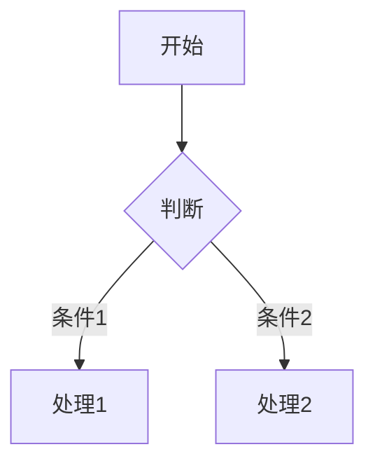
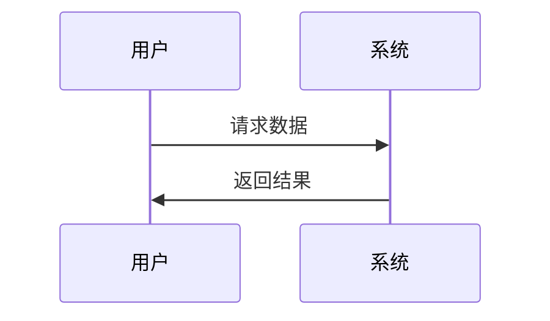
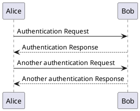

> 数据可视化是 JavaScript 生态中最成熟、最丰富的领域之一。从底层图形引擎到高层图表库，从2D到3D，从通用到专业领域，都有优秀解决方案。

---

## 📊 分类概览

| 类别 | 代表库 | 适用场景 |
|------|--------|----------|
| 底层可视化引擎 | D3.js, Observable Plot, Vega | 高度自定义、复杂交互 |
| 图表库 | ECharts, Chart.js, Recharts, uPlot, ApexCharts | 快速开发、常见图表 |
| React 图表库 | Recharts, Nivo, Victory, Visx | React 生态专属 |
| 3D 可视化 | Three.js, Babylon.js, Cesium | 3D图形、游戏、地理空间 |
| 2D 渲染引擎 | PixiJS, Fabric.js, Konva | 游戏、交互式图形、编辑器 |
| 地图可视化 | Leaflet, Mapbox, Deck.gl | GIS、位置数据 |
| 专用可视化 | Mermaid, PlantUML, Dagre, Cytoscape.js, Sigma.js | 流程图、UML、图论分析 |
| 特定领域 | visx, react-flow | 专业场景、流程图 |

---

## 1. 底层可视化引擎

> 提供最大灵活性，适合构建高度自定义的可视化组件

### D3.js ⭐112k

**数据驱动文档 (Data-Driven Documents)** - 灵活性最高的可视化库

| 属性 | 详情 |
|------|------|
| **Stars** | 112k+ |
| **TypeScript** | ✅ @types/d3 完善 |
| **维护状态** | 活跃 (v7.x) |
| **GitHub** | [d3/d3](https://github.com/d3/d3) |
| **官网** | [d3js.org](https://d3js.org/) |
| **NPM 下载** | 190万+/周 |

**核心模块体系**

```
d3
├── d3-selection      # DOM 选择与数据绑定 ⭐核心
├── d3-scale          # 数据到视觉属性的映射 (线性/序数/时间等)
├── d3-shape          # 图形生成器 (线、面积、弧、饼等)
├── d3-transition     # 动画过渡
├── d3-axis           # 坐标轴
├── d3-zoom           # 缩放与平移
├── d3-drag           # 拖拽交互
├── d3-geo            # 地理投影
├── d3-hierarchy      # 层级布局 (树、打包、分区等)
├── d3-force          # 物理仿真 (力导向图)
├── d3-time/d3-time-format  # 时间处理
├── d3-fetch          # 数据加载 (CSV, JSON等)
└── d3-array          # 数组工具 (统计、分箱等)
```

**D3 v7 重要特性**

- **原生 ES Modules**: 更好的 Tree-shaking 支持
- **Promise 化**: `d3.csv()` 等返回 Promise，支持 async/await
- **改进的 d3-selection**: 性能优化
- **d3.group/d3.rollup**: 更强大的数据聚合
- **现代 JS 语法**: 内部使用更现代的 JavaScript

**与 React/Vue 集成方案**

| 方案 | 说明 | 推荐度 |
|------|------|--------|
| **useD3 hook** | 在 useEffect 中使用 D3 操作 DOM | ⭐⭐⭐ |
| **react-d3-library** | 包装 D3 组件 | ⭐⭐ |
| **D3 计算 + React 渲染** | D3 负责 scale/ shape，React 负责 DOM | ⭐⭐⭐⭐⭐ |
| **visx** | Airbnb 的 D3 + React 封装 | ⭐⭐⭐⭐⭐ |

```tsx
// 推荐：D3 计算 + React 渲染
import { scaleLinear, line } from 'd3';

function LineChart({ data }) {
  const xScale = scaleLinear().domain([0, 100]).range([0, 500]);
  const yScale = scaleLinear().domain([0, 100]).range([300, 0]);
  const lineGenerator = line().x(d => xScale(d.x)).y(d => yScale(d.y));
  
  return <path d={lineGenerator(data)} fill="none" stroke="steelblue" />;
}
```

**最佳适用场景**
- 高度自定义的数据可视化
- 复杂交互需求（缩放、拖拽、刷选）
- 实时数据流可视化
- 创新的可视化形式

**学习曲线**: 🔴🔴🔴🔴🔴 (陡峭，但回报巨大)

---

### Observable Plot ⭐5k

**D3 团队官方高层 API** - 声明式、约定优于配置

| 属性 | 详情 |
|------|------|
| **Stars** | 5k+ |
| **TypeScript** | ✅ 原生支持 |
| **维护状态** | 活跃 (D3 团队官方) |
| **GitHub** | [observablehq/plot](https://github.com/observablehq/plot) |
| **官网** | [observablehq.com/plot](https://observablehq.com/plot/) |

**核心特性**
- 基于 D3，但隐藏复杂性
- 自动推断 scale、axes、legends
- 内置统计变换 (bin, group, regression等)
- 与 Observable Notebook 原生集成

```js
import * as Plot from "@observablehq/plot";

Plot.plot({
  marks: [
    Plot.dot(data, {x: "weight", y: "height", fill: "sex"})
  ]
});
```

**最佳适用场景**
- 快速探索性数据分析
- 标准统计图表
- Observable Notebook 用户

**学习曲线**: 🟡🟡⚪⚪⚪ (中等)

---

### Vega / Vega-Lite ⭐12k

**声明式可视化语法** - JSON 定义可视化

| 属性 | 详情 |
|------|------|
| **Stars** | 12k+ (vega/vega-lite) |
| **TypeScript** | ✅ vega-typings |
| **维护状态** | 活跃 (UW 数据实验室) |
| **GitHub** | [vega/vega](https://github.com/vega/vega) |
| **官网** | [vega.github.io](https://vega.github.io/) |

**架构层次**

```
Vega-Lite (高层)     → 简洁 JSON，快速开发
    ↓ 编译
Vega (完整语法)      → 复杂交互，完全控制
    ↓ 渲染
D3 + Canvas/SVG      → 最终输出
```

**Vega-Lite 示例**

```json
{
  "data": {"url": "data/cars.json"},
  "mark": "point",
  "encoding": {
    "x": {"field": "Horsepower", "type": "quantitative"},
    "y": {"field": "Miles_per_Gallon", "type": "quantitative"},
    "color": {"field": "Origin", "type": "nominal"}
  }
}
```

**生态系统**
- **Vega-Embed**: 在网页中嵌入 Vega/Vega-Lite
- **Altair**: Python 绑定（极流行）
- **Voyager**: 可视化推荐工具

**最佳适用场景**
- 跨语言可视化（JSON 规范）
- 需要序列化/存储图表定义
- 数据 journalists
- 统计可视化

**学习曲线**: 🟡🟡🟡⚪⚪ (中高)

---

## 2. 图表库 (高易用性)

> 开箱即用，适合常见图表场景

### Apache ECharts ⭐62k

**百度开源 → Apache 基金会** - 中文生态最完善的企业级图表库

| 属性 | 详情 |
|------|------|
| **Stars** | 62k+ |
| **TypeScript** | ✅ 原生支持 |
| **维护状态** | 活跃 (Apache 基金会，v6.0 发布) |
| **GitHub** | [apache/echarts](https://github.com/apache/echarts) |
| **官网** | [echarts.apache.org](https://echarts.apache.org/zh/index.html) |
| **NPM 下载** | 230万+/周 |

**核心特性**

| 特性 | 说明 |
|------|------|
| **渲染模式** | Canvas (默认) / SVG 可切换 |
| **图表类型** | 30+ 种内置图表 |
| **性能** | 千万级数据渲染 (借助 DataZoom) |
| **坐标系** | 笛卡尔、极坐标、地理、雷达等 |
| **扩展** | GL 扩展 (WebGL 3D)、词云、水球图 |

**常用图表类型**

```javascript
// 基础图表
bar, line, pie, scatter, radar, funnel, gauge

// 高级图表
tree, treemap, sunburst, sankey, graph (关系图)
heatmap, candlestick (K线), map (地图)

// 3D 图表 (GL 扩展)
bar3D, line3D, surface, scatter3D
```

**ECharts 6 新特性 (2025)**
- 全新默认主题
- 动态主题切换 / 暗黑模式支持
- 新图表类型：Chord Chart, Beeswarm Chart, Scatter Jittering
- 矩阵坐标系 (Matrix Coordinate System)
- 自定义系列注册

**React/Vue 集成**
- **echarts-for-react** ⭐5k
- **vue-echarts** ⭐9k

```tsx
import ReactECharts from 'echarts-for-react';

const option = {
  xAxis: { type: 'category', data: ['Mon', 'Tue', 'Wed'] },
  yAxis: { type: 'value' },
  series: [{ data: [120, 200, 150], type: 'bar' }]
};

<ReactECharts option={option} style={{ height: 400 }} />
```

**最佳适用场景**
- 企业级后台管理系统
- 大屏数据可视化
- 需要丰富中文文档支持
- 复杂交互图表（数据缩放、刷选）

**学习曲线**: 🟡🟡⚪⚪⚪ (中等，文档友好)

---

### Chart.js ⭐65k

**简单易用** - Canvas 渲染的开源图表库

| 属性 | 详情 |
|------|------|
| **Stars** | 65k+ |
| **TypeScript** | ✅ @types/chart.js / chartjs-typescript |
| **维护状态** | 活跃 (v4.x) |
| **GitHub** | [chartjs/Chart.js](https://github.com/chartjs/Chart.js) |
| **官网** | [chartjs.org](https://www.chartjs.org/) |
| **NPM 下载** | 240万+/周 |

**核心特性**
- 简洁的 API 设计
- 响应式，自动调整大小
- 8种内置图表类型
- 插件生态系统

**图表类型**

```javascript
bar, line, area, pie, doughnut, radar, polarArea, bubble, scatter
```

```javascript
const ctx = document.getElementById('myChart');
new Chart(ctx, {
  type: 'bar',
  data: {
    labels: ['Red', 'Blue', 'Yellow'],
    datasets: [{
      label: '# of Votes',
      data: [12, 19, 3],
      backgroundColor: ['red', 'blue', 'yellow']
    }]
  }
});
```

**最佳适用场景**
- 简单图表需求
- 快速原型开发
- 移动端优先项目
- 对包大小敏感

**学习曲线**: 🟢⚪⚪⚪⚪ (简单)

---

### uPlot ⭐11k

**极速折线图** - 小巧快速的时间序列图表

| 属性 | 详情 |
|------|------|
| **Stars** | 11k+ |
| **TypeScript** | ✅ 原生支持 |
| **维护状态** | 活跃 |
| **GitHub** | [leeoniya/uPlot](https://github.com/leeoniya/uPlot) |
| **包大小** | ~50KB min |
| **许可证** | MIT |

**核心特性**
- **极致性能**: 25ms 内渲染 166,650 数据点，~100,000 pts/ms
- **内存高效**: 3600 点 @ 60fps 仅使用 10% CPU / 12.3MB RAM
- **Canvas 2D**: 无需 WebGL/WASM，启动更快
- **实时流数据**: 支持 60fps 实时更新
- **多系列/多Y轴**: 支持复杂时间序列

**性能对比** (更新 3600 点 @ 60fps)

| 库 | CPU | RAM | 大小 |
|----|-----|-----|------|
| uPlot | 10% | 12.3MB | 47.9KB |
| Chart.js | 40% | 77MB | 254KB |
| ECharts | 70% | 85MB | 1000KB |

**最佳适用场景**
- 高性能时间序列数据
- 实时数据监控
- 金融行情图表
- 物联网传感器数据

**学习曲线**: 🟡🟡⚪⚪⚪ (中等)

---

### ApexCharts ⭐15k

**现代交互图表** - 美观的 SVG 图表库

| 属性 | 详情 |
|------|------|
| **Stars** | 14.9k+ |
| **TypeScript** | ✅ 原生支持 |
| **维护状态** | 活跃 (v4.x) |
| **GitHub** | [apexcharts/apexcharts.js](https://github.com/apexcharts/apexcharts.js) |
| **官网** | [apexcharts.com](https://apexcharts.com/) |

**核心特性**
- 15+ 图表类型，美观默认样式
- 交互式工具提示、钻取、导出
- 响应式设计和流畅动画
- 实时数据更新支持
- 混合图表（多种类型组合）
- Vue/React/Angular 官方封装

```javascript
import ApexCharts from 'apexcharts';

var options = {
  chart: { type: 'line' },
  series: [{ name: 'sales', data: [30, 40, 35, 50, 49, 60, 70] }],
  xaxis: { categories: ['Jan', 'Feb', 'Mar', 'Apr', 'May', 'Jun', 'Jul'] }
};

var chart = new ApexCharts(document.querySelector("#chart"), options);
chart.render();
```

**最佳适用场景**
- 追求美观的仪表板
- 需要丰富交互功能
- 快速原型开发
- 现代 UI 设计项目

**学习曲线**: 🟡⚪⚪⚪⚪ (简单到中等)

---

## 3. React 图表库

> 专为 React 生态设计的图表解决方案

### Recharts ⭐25k

**React 专属** - 声明式图表组件

| 属性 | 详情 |
|------|------|
| **Stars** | 24.8k+ |
| **TypeScript** | ✅ 原生支持 |
| **维护状态** | 活跃 (React 19 支持) |
| **GitHub** | [recharts/recharts](https://github.com/recharts/recharts) |
| **官网** | [recharts.org](https://recharts.org/) |
| **NPM 下载** | 360万+/周 |

**核心特性**
- 纯 React 组件，声明式 API
- 基于 D3 计算，React 渲染
- SVG 支持
- 可组合性强
- 25+ 图表类型

```tsx
import { LineChart, Line, XAxis, YAxis, Tooltip } from 'recharts';

const data = [{name: 'A', value: 400}, {name: 'B', value: 300}];

<LineChart width={600} height={300} data={data}>
  <XAxis dataKey="name" />
  <YAxis />
  <Tooltip />
  <Line type="monotone" dataKey="value" stroke="#8884d8" />
</LineChart>
```

**最佳适用场景**
- React 项目
- 需要与 React 生命周期深度集成
- 自定义组件样式

**学习曲线**: 🟡⚪⚪⚪⚪ (简单到中等)

---

### Nivo ⭐14k

**React + D3** - 基于 D3 的现代 React 组件库

| 属性 | 详情 |
|------|------|
| **Stars** | 13.5k+ / 14k |
| **TypeScript** | ✅ 原生支持 |
| **维护状态** | 活跃 |
| **GitHub** | [plouc/nivo](https://github.com/plouc/nivo) |
| **官网** | [nivo.rocks](https://nivo.rocks/) |
| **NPM 下载** | 66万+/周 |

**核心特性**
- 20+ 图表类型
- 服务端渲染 (SSR) 支持 - Next.js 首选
- 三种渲染模式：SVG / Canvas / HTML
- 主题系统
- 响应式设计
- 动画由 React Motion 驱动

**图表分类**
```
Bar, Line, Area, Pie
Tree, Sankey, Sunburst, Treemap
Calendar, Radar, Scatter
Network, Heatmap, Bullet
```

```tsx
import { ResponsivePie } from '@nivo/pie';

<ResponsivePie
  data={[{ id: 'lisp', value: 500 }, { id: 'js', value: 900 }]}
  margin={{ top: 40, right: 80 }}
  innerRadius={0.5}
  padAngle={0.7}
/>
```

**最佳适用场景**
- React + D3 结合需求
- Next.js SSR 项目
- 现代化设计需求
- 服务端渲染图表（邮件/PDF/社交图片）

**学习曲线**: 🟡🟡⚪⚪⚪ (中等)

---

### Victory ⭐11k

**React 专属** - 跨平台动画图表库

| 属性 | 详情 |
|------|------|
| **Stars** | 11.1k+ |
| **TypeScript** | ✅ 原生支持 |
| **维护状态** | 活跃 (Nearform) |
| **GitHub** | [FormidableLabs/victory](https://github.com/FormidableLabs/victory) |
| **官网** | [commerce.nearform.com/open-source/victory](https://commerce.nearform.com/open-source/victory/) |
| **NPM 下载** | 27万+/周 |

**核心特性**
- 跨平台 (Web + React Native)
- 强大的动画系统
- 声明式风格
- 完整的可访问性 (ARIA) 支持
- 几乎一致的 API 覆盖 Web 和 Native

```tsx
import { VictoryPie, VictoryChart, VictoryBar } from 'victory';

<VictoryPie
  data={[
    { x: "Cats", y: 35 },
    { x: "Dogs", y: 40 },
    { x: "Birds", y: 55 }
  ]}
/>
```

**最佳适用场景**
- React Native 图表需求
- 需要丰富动画效果
- 跨平台应用

**学习曲线**: 🟡🟡⚪⚪⚪ (中等)

---

### visx ⭐20k

**Airbnb 可视化** - 低层可视化组件集合

| 属性 | 详情 |
|------|------|
| **Stars** | 19.9k+ |
| **TypeScript** | ✅ 原生支持 |
| **维护状态** | 活跃 (Airbnb) |
| **GitHub** | [airbnb/visx](https://github.com/airbnb/visx) |
| **官网** | [airbnb.io/visx](https://airbnb.io/visx/) |
| **NPM 下载** | 220万+/周 (@visx/shape) |

**设计理念**
- "Un-opinionated" - 不强制样式
- D3 计算 + React 渲染
- 可组合的底层组件
- 类似构建块，自由组合
- 与 CSS-in-JS (styled-components/Emotion) 兼容

**包结构**

```
@visx/xychart      # 高级图表组件
@visx/shape        # 图形 (Bar, Line, Area, Pie)
@visx/scale        # D3 scale 封装
@visx/axis         # 坐标轴
@visx/tooltip      # 提示框
@visx/legend       # 图例
@visx/annotation   # 注释
@visx/grid         # 网格
@visx/responsive   # 响应式
@visx/sankey       # 桑基图
```

```tsx
import { scaleLinear, scaleBand } from '@visx/scale';
import { Bar } from '@visx/shape';
import { Group } from '@visx/group';

// visx 提供基础组件，样式完全自定义
<Group>
  {data.map(d => (
    <Bar
      key={d.label}
      x={xScale(d.label)}
      y={yScale(d.value)}
      width={xScale.bandwidth()}
      height={height - yScale(d.value)}
      fill="#fc2e1c"
    />
  ))}
</Group>
```

**最佳适用场景**
- 需要完全控制样式的项目
- 设计系统团队
- 企业级图表组件库建设
- 追求 D3 灵活性但使用 React

**学习曲线**: 🟡🟡🟡⚪⚪ (中高)

---

## 4. 3D 可视化

> WebGL 驱动的三维图形渲染

### Three.js ⭐105k

**WebGL 3D 图形之王** - 最广泛使用的 3D 库

| 属性 | 详情 |
|------|------|
| **Stars** | 105k+ (最高达 151k) |
| **TypeScript** | ✅ @types/three 完善 |
| **维护状态** | 活跃 |
| **GitHub** | [mrdoob/three.js](https://github.com/mrdoob/three.js) |
| **官网** | [threejs.org](https://threejs.org/) |

**核心模块**

```javascript
three
├── Core (Scene, Camera, Renderer)
├── Geometries (Box, Sphere, Plane, Custom)
├── Materials (MeshBasic, MeshPhong, ShaderMaterial)
├── Lights (Ambient, Directional, Point, Spot)
├── Loaders (GLTF, OBJ, FBX, Texture)
├── Controls (OrbitControls, FlyControls)
└── Post-Processing (Bloom, DOF, FXAA)
```

**渲染器对比**

| 渲染器 | 用途 | 性能 |
|--------|------|------|
| WebGLRenderer | 标准 3D 渲染 | 高 |
| WebGL1Renderer | 兼容旧设备 | 中 |
| CSS3DRenderer | DOM 元素的 3D 变换 | 视内容而定 |
| SVGRenderer | 矢量 3D 输出 | 低 |

**现代工作流 (Three.js Journey 推荐)**

```javascript
import * as THREE from 'three';
import { OrbitControls } from 'three/addons/controls/OrbitControls.js';
import { GLTFLoader } from 'three/addons/loaders/GLTFLoader.js';

// 场景设置
const scene = new THREE.Scene();
const camera = new THREE.PerspectiveCamera(75, width / height, 0.1, 1000);
const renderer = new THREE.WebGLRenderer({ antialias: true });

// 几何体 + 材质 = 网格
const geometry = new THREE.BoxGeometry(1, 1, 1);
const material = new THREE.MeshStandardMaterial({ color: 0x00ff00 });
const cube = new THREE.Mesh(geometry, material);
scene.add(cube);

// 光照
const light = new THREE.DirectionalLight(0xffffff, 1);
light.position.set(1, 1, 1);
scene.add(light);

// 动画循环
function animate() {
  requestAnimationFrame(animate);
  cube.rotation.x += 0.01;
  renderer.render(scene, camera);
}
animate();
```

**React/Vue 集成**

| 方案 | 说明 | GitHub |
|------|------|--------|
| **React Three Fiber** ⭐30k | React 的 Three.js 渲染器 | pmndrs/react-three-fiber |
| **Vue Three** | Vue 3 + Three.js 组合式 API | - |
| **TresJS** ⭐4k | Vue 的 Three.js 解决方案 | tresjs/tres |

```tsx
// React Three Fiber
import { Canvas } from '@react-three/fiber';

<Canvas>
  <mesh>
    <boxGeometry />
    <meshStandardMaterial color="hotpink" />
  </mesh>
  <ambientLight intensity={0.5} />
</Canvas>
```

**最佳适用场景**
- 3D 数据可视化
- 产品展示/配置器
- 游戏开发
- 艺术与创意编程
- 建筑可视化

**学习曲线**: 🔴🔴🔴🔴⚪ (较陡峭)

---

### Babylon.js ⭐24k

**游戏引擎级 3D** - 功能最完整的 WebGL 引擎

| 属性 | 详情 |
|------|------|
| **Stars** | 23k+ / 24k |
| **TypeScript** | ✅ 原生支持 |
| **维护状态** | 活跃 (v9.0 刚发布) |
| **GitHub** | [BabylonJS/Babylon.js](https://github.com/BabylonJS/Babylon.js) |
| **官网** | [babylonjs.com](https://www.babylonjs.com/) |

**核心特性**
- 完整的游戏引擎功能
- 物理引擎集成 (Cannon.js, Ammo.js)
- 粒子系统 + 新 NPE (Node Particle Editor)
- GUI 系统
- WebXR 支持
- Playground 在线编辑器
- 体积光照、聚类光照、动画重定向

**vs Three.js**

| 特性 | Babylon.js | Three.js |
|------|------------|----------|
| 定位 | 游戏引擎 | 3D 图形库 |
| 上手难度 | 较高 | 中等 |
| 内置功能 | 丰富 | 精简 |
| 社区资源 | 活跃 | 更大 |
| 包体积 | 较大 | 较小 |

**Babylon.js 9.0 新特性 (2025)**
- 聚类光照 (Clustered Lighting)
- 纹理区域光照
- 节点粒子编辑器
- 体积光照
- 帧图 (Frame Graph v1)
- WebGPU 性能优化

**最佳适用场景**
- 3D 游戏开发
- 复杂交互 3D 应用
- 需要内置物理引擎
- WebXR/VR 应用

**学习曲线**: 🔴🔴🔴🔴⚪ (较陡峭)

---

### Cesium ⭐13k

**地理空间 3D** - 全球 3D 地图引擎

| 属性 | 详情 |
|------|------|
| **Stars** | 13k+ |
| **TypeScript** | ✅ 原生支持 |
| **维护状态** | 活跃 |
| **GitHub** | [CesiumGS/cesium](https://github.com/CesiumGS/cesium) |
| **官网** | [cesium.com](https://cesium.com/) |

**核心特性**
- 全球地形和影像
- 3D Tiles 标准
- 时间动态可视化
- KML/GeoJSON/CZML 支持

**最佳适用场景**
- 数字孪生城市
- 航空航天可视化
- 地理空间分析
- 卫星数据可视化

**学习曲线**: 🔴🔴🔴🔴⚪ (较陡峭)

---

## 5. 2D 渲染引擎

> 高性能 2D 图形渲染，适合游戏和交互式应用

### PixiJS ⭐47k

**超快 2D 渲染引擎** - WebGL/HTML5 创建引擎

| 属性 | 详情 |
|------|------|
| **Stars** | 46.8k+ / 45k |
| **TypeScript** | ✅ 原生支持 |
| **维护状态** | 活跃 (v8.x 发布) |
| **GitHub** | [pixijs/pixijs](https://github.com/pixijs/pixijs) |
| **官网** | [pixijs.com](https://pixijs.com/) |

**核心特性**
- WebGL & WebGPU 渲染器
- 极速性能和轻量级
- 完整的鼠标和多点触控支持
- 灵活文本渲染
- 滤镜、遮罩、混合模式
- 支持 Canvas 降级

**PixiJS v8 新特性 (2024)**
- 全新的渲染组概念 (isRenderGroup)
- 混合模式和色调继承
- Photoshop 级滤镜（20+ 种混合模式）
- 抗锯齿纹理渲染简化
- gl2D 文件格式（开发中）

```javascript
import { Application, Assets, Sprite } from 'pixi.js';

const app = new Application();
await app.init({ background: '#1099bb', resizeTo: window });
document.body.appendChild(app.canvas);

const texture = await Assets.load('https://pixijs.com/assets/bunny.png');
const bunny = new Sprite(texture);
bunny.anchor.set(0.5);
bunny.x = app.screen.width / 2;
bunny.y = app.screen.height / 2;
app.stage.addChild(bunny);

app.ticker.add((time) => {
  bunny.rotation += 0.1 * time.deltaTime;
});
```

**最佳适用场景**
- 2D 游戏开发
- 高性能 2D 交互应用
- 富媒体广告
- 数据可视化（粒子效果）

**学习曲线**: 🟡🟡⚪⚪⚪ (中等)

---

### Fabric.js ⭐29k

**Canvas 交互库** - 强大的 2D 画布交互

| 属性 | 详情 |
|------|------|
| **Stars** | 28k+ / 29k |
| **TypeScript** | ✅ 原生支持 |
| **维护状态** | 活跃 (v6.x) |
| **GitHub** | [fabricjs/fabric.js](https://github.com/fabricjs/fabric.js) |
| **官网** | [fabricjs.com](https://fabricjs.com/) |

**核心特性**
- 开箱即用的交互（缩放、移动、旋转、倾斜、组合）
- 内置形状、控件、动画、图像滤镜
- 支持 JPG、PNG、JSON、SVG 导入导出
- 渐变、图案、画笔
- 类型化和模块化

```javascript
const canvas = new fabric.Canvas('c');
const rect = new fabric.Rect({
  left: 100,
  top: 100,
  fill: 'red',
  width: 50,
  height: 50
});
canvas.add(rect);
```

**最佳适用场景**
- 图片编辑器
- 在线设计工具
- 白板/协作画布
- 流程图编辑器
- 自定义产品配置器

**学习曲线**: 🟡🟡⚪⚪⚪ (中等)

---

### Konva ⭐11k

**2D Canvas 框架** - 交互式 Canvas 应用

| 属性 | 详情 |
|------|------|
| **Stars** | 11k+ |
| **TypeScript** | ✅ 原生支持 |
| **维护状态** | 活跃 (v10.x) |
| **GitHub** | [konvajs/konva](https://github.com/konvajs/konva) |
| **官网** | [konvajs.org](https://konvajs.org/) |

**核心特性**
- Stage → Layer → Shape 层级结构
- 高性能动画和过渡
- 拖拽、缩放、旋转支持
- 节点嵌套和分组
- 滤镜和缓存
- 官方支持 React, Vue, Svelte, Angular

**vs Fabric.js / PixiJS**

| 库 | 最佳用途 | 特点 |
|----|---------|------|
| **Konva** | 交互式 2D 应用、设计编辑器 | 最佳框架集成 |
| **Fabric.js** | 图片编辑、复杂 SVG | 功能丰富 |
| **PixiJS** | 2D 游戏、高性能渲染 | WebGL 加速 |

```javascript
const stage = new Konva.Stage({
  container: 'container',
  width: window.innerWidth,
  height: window.innerHeight
});

const layer = new Konva.Layer();
stage.add(layer);

const rect = new Konva.Rect({
  x: 50, y: 50, width: 100, height: 50,
  fill: '#00D2FF', stroke: 'black', strokeWidth: 4,
  draggable: true
});
layer.add(rect);
```

**最佳适用场景**
- 交互式 2D 应用
- 设计编辑器/白板
- 注释工具
- 交互式地图
- 教育应用

**学习曲线**: 🟡⚪⚪⚪⚪ (简单到中等)

---

## 6. 地图可视化

> 地理位置数据的可视化表达

### Leaflet ⭐41k

**轻量地图库** - 最流行的开源交互式地图

| 属性 | 详情 |
|------|------|
| **Stars** | 41k+ |
| **TypeScript** | ✅ @types/leaflet |
| **维护状态** | 活跃 (v1.9+) |
| **GitHub** | [Leaflet/Leaflet](https://github.com/Leaflet/Leaflet) |
| **官网** | [leafletjs.com](https://leafletjs.com/) |

**核心特性**
- 极简 API 设计
- 38KB 完整包
- 丰富的插件生态
- 移动端友好

```javascript
const map = L.map('map').setView([51.505, -0.09], 13);

L.tileLayer('https://{s}.tile.openstreetmap.org/{z}/{x}/{y}.png', {
  attribution: '© OpenStreetMap'
}).addTo(map);

L.marker([51.5, -0.09]).addTo(map)
  .bindPopup('A pretty CSS popup.')
  .openPopup();
```

**常用插件**

| 插件 | 用途 |
|------|------|
| Leaflet.markercluster | 标记聚合 |
| Leaflet.draw | 绘制工具 |
| Leaflet.heat | 热力图 |
| Leaflet-routing-machine | 路线规划 |

**最佳适用场景**
- 简单地图展示
- 标记点/区域展示
- 移动优先的地图应用
- 快速原型开发

**学习曲线**: 🟢⚪⚪⚪⚪ (简单)

---

### Mapbox GL JS ⭐11k

**矢量地图** - 高性能矢量切片地图

| 属性 | 详情 |
|------|------|
| **Stars** | 11k+ |
| **TypeScript** | ✅ mapbox-gl-types |
| **维护状态** | 活跃 (Mapbox 公司) |
| **GitHub** | [mapbox/mapbox-gl-js](https://github.com/mapbox/mapbox-gl-js) |
| **官网** | [docs.mapbox.com](https://docs.mapbox.com/mapbox-gl-js/) |

**核心特性**
- 矢量切片渲染
- 流畅的缩放/旋转
- 自定义地图样式 (Mapbox Studio)
- WebGL 加速

**⚠️ 许可变更**: v2.0+ 需要 Mapbox 账号和 token

**开源替代**: **MapLibre GL JS** (Mapbox v1.x 分支)

**最佳适用场景**
- 自定义地图样式
- 高性能矢量地图
- 3D 地形可视化

**学习曲线**: 🟡🟡⚪⚪⚪ (中等)

---

### Deck.gl ⭐12k

**大规模数据可视化** - Uber 开源的 WebGL 图层框架

| 属性 | 详情 |
|------|------|
| **Stars** | 12k+ |
| **TypeScript** | ✅ 原生支持 |
| **维护状态** | 活跃 |
| **GitHub** | [visgl/deck.gl](https://github.com/visgl/deck.gl) |
| **官网** | [deck.gl](https://deck.gl/) |

**核心特性**
- 百万级数据点渲染
- 多层叠加架构
- 与 Mapbox/Google Maps 集成
- GPU 驱动的可视化

**图层类型**

```javascript
// 核心图层
ScatterplotLayer, LineLayer, PolygonLayer
ArcLayer, HeatmapLayer, HexagonLayer, GridLayer

// 高级图层
GeoJsonLayer, TextLayer, IconLayer
TerrainLayer, Tile3DLayer
```

```javascript
import { Deck } from '@deck.gl/core';
import { ScatterplotLayer } from '@deck.gl/layers';

new Deck({
  initialViewState: { longitude: -122.4, latitude: 37.8, zoom: 10 },
  controller: true,
  layers: [
    new ScatterplotLayer({
      data: [{ position: [-122.4, 37.8], color: [255, 0, 0], radius: 100 }],
      getPosition: d => d.position,
      getFillColor: d => d.color,
      getRadius: d => d.radius
    })
  ]
});
```

**React 集成**

```tsx
import DeckGL from '@deck.gl/react';
import { ScatterplotLayer } from '@deck.gl/layers';

<DeckGL
  initialViewState={{ longitude: -122.4, latitude: 37.8, zoom: 10 }}
  controller={true}
  layers={[new ScatterplotLayer({ data, getPosition: d => d.position })]}
/>
```

**最佳适用场景**
- 大规模地理数据可视化
- 时空数据分析
- 与 React 深度集成
- 需要高性能 GPU 渲染

**学习曲线**: 🔴🔴🔴⚪⚪ (中高)

---

### kepler.gl ⭐10k

**地理空间分析工具** - Uber 开源的地理数据可视化平台

| 属性 | 详情 |
|------|------|
| **Stars** | 10k+ |
| **TypeScript** | ⚠️ 部分支持 |
| **维护状态** | 活跃 |
| **GitHub** | [keplergl/kepler.gl](https://github.com/keplergl/kepler.gl) |
| **官网** | [kepler.gl](https://kepler.gl/) |

**核心特性**
- 零代码可视化配置
- 支持 CSV/JSON/GeoJSON
- 时间轴动画
- 多层可视化
- 可导出为 React 组件

**最佳适用场景**
- 地理数据探索
- 数据分析师
- 快速生成可视化原型

**学习曲线**: 🟢⚪⚪⚪⚪ (简单，主要为 UI 操作)

---

## 7. 专用可视化

> 针对特定场景的专用可视化方案

### Mermaid ⭐85k

**文本生成图表** - 类似 Markdown 的图表语法

| 属性 | 详情 |
|------|------|
| **Stars** | 82k+ / 85k+ |
| **TypeScript** | ✅ 原生支持 |
| **维护状态** | 活跃 |
| **GitHub** | [mermaid-js/mermaid](https://github.com/mermaid-js/mermaid) |
| **官网** | [mermaid.js.org](https://mermaid.js.org/) |

**图表类型**

```markdown

```

```markdown

```

**支持图表**
- Flowchart (流程图)
- Sequence Diagram (时序图)
- Class Diagram (类图)
- State Diagram (状态图)
- Entity Relationship (ER图)
- User Journey (用户旅程)
- Gantt (甘特图)
- Pie Chart (饼图)
- Git Graph (Git 图)
- Mindmap (思维导图)
- Timeline (时间线)
- Sankey (桑基图)

**集成**
- GitHub/GitLab 原生支持
- Notion、Obsidian 等工具内置
- Markdown 渲染器插件

**最佳适用场景**
- 文档中的图表
- 版本控制友好的图表
- 技术文档写作
- 快速原型沟通

**学习曲线**: 🟢⚪⚪⚪⚪ (简单)

---

### PlantUML ⭐10k

**UML 图表** - 文本生成 UML 图

| 属性 | 详情 |
|------|------|
| **Stars** | 10k+ |
| **TypeScript** | ⚠️ 社区支持 |
| **维护状态** | 活跃 |
| **官网** | [plantuml.com](https://plantuml.com/) |

**核心特性**
- 丰富的 UML 图表支持
- 时序图、用例图、类图、组件图
- 网络图、甘特图、思维导图
- 支持多种输出格式 (PNG, SVG, PDF)



**最佳适用场景**
- 技术架构文档
- UML 建模
- 软件设计文档

**学习曲线**: 🟡🟡⚪⚪⚪ (中等)

---

### Dagre ⭐6k

**有向图布局** - 自动图布局算法

| 属性 | 详情 |
|------|------|
| **Stars** | 5.6k+ |
| **TypeScript** | ✅ 原生支持 |
| **维护状态** | 活跃 (dagrejs 组织) |
| **GitHub** | [dagrejs/dagre](https://github.com/dagrejs/dagre) |

**核心特性**
- 网络单纯形排名算法
- 质心排序启发式
- Brandes-Köpf 坐标分配
- 复合图支持
- 边标签自动定位

**算法流程**
1. 循环移除 - 临时反转边创建 DAG
2. 排名分配 - 网络单纯形
3. 排序 - 最小化边交叉
4. 坐标分配 - 水平位置

**使用示例**

```javascript
import dagre from '@dagrejs/dagre';

const g = new dagre.graphlib.Graph();
g.setGraph({ rankdir: 'TB', nodesep: 50, ranksep: 50 });
g.setDefaultEdgeLabel(() => ({}));

g.setNode('a', { width: 100, height: 50 });
g.setNode('b', { width: 100, height: 50 });
g.setEdge('a', 'b');

dagre.layout(g);
```

**相关项目**
- **dagre-d3**: D3 渲染器
- **graphlib**: 图数据结构

**最佳适用场景**
- 自动图布局
- 流程图/有向无环图
- 与 React Flow 集成

**学习曲线**: 🟡🟡🟡⚪⚪ (中高)

---

### Cytoscape.js ⭐10k

**图论分析** - 交互式网络图可视化

| 属性 | 详情 |
|------|------|
| **Stars** | 10k+ |
| **TypeScript** | ✅ @types/cytoscape |
| **维护状态** | 活跃 |
| **GitHub** | [cytoscape/cytoscape.js](https://github.com/cytoscape/cytoscape.js) |
| **官网** | [js.cytoscape.org](https://js.cytoscape.org/) |

**核心特性**
- 图论算法内置（路径查找、聚类等）
- 交互式操作（选择、平移、缩放）
- 多种布局算法
- 手势支持
- 高性能渲染

**内置布局**
- null, random, grid, circle
- concentric, breadthfirst
- cose (Compound Spring Embedder)
- dagre, klay, spread, springy (扩展)

```javascript
var cy = cytoscape({
  container: document.getElementById('cy'),
  elements: [
    { data: { id: 'a' } },
    { data: { id: 'b' } },
    { data: { id: 'ab', source: 'a', target: 'b' } }
  ],
  layout: { name: 'grid' }
});
```

**最佳适用场景**
- 社交网络分析
- 生物网络可视化
- 系统拓扑图
- 知识图谱

**学习曲线**: 🟡🟡🟡⚪⚪ (中高)

---

### Sigma.js ⭐11k

**大图可视化** - 大规模图网络可视化

| 属性 | 详情 |
|------|------|
| **Stars** | 11k+ |
| **TypeScript** | ✅ 原生支持 |
| **维护状态** | 活跃 (v3.x) |
| **GitHub** | [jacomyal/sigma.js](https://github.com/jacomyal/sigma.js) |
| **官网** | [sigmajs.org](https://sigmajs.org/) |

**核心特性**
- WebGL 渲染（百万级节点/边）
- 流畅的缩放和平移
- 可定制的渲染管线
- 专注于大图性能

**Sigma.js v2+ 架构**
- 核心库精简
- 渲染器插件化
- 与 Graphology 图库集成

```javascript
import Sigma from 'sigma';
import Graph from 'graphology';

const graph = new Graph();
graph.addNode('A', { x: 0, y: 0, size: 10 });
graph.addNode('B', { x: 1, y: 1, size: 10 });
graph.addEdge('A', 'B');

const sigma = new Sigma(graph, document.getElementById('container'));
```

**最佳适用场景**
- 大规模网络图（> 10k 节点）
- 社交网络可视化
- 复杂关系图
- 需要流畅交互的大图

**学习曲线**: 🟡🟡🟡⚪⚪ (中高)

---

### LumaGL

**WebGL2 框架** - Uber 开源的底层 WebGL 封装

| 属性 | 详情 |
|------|------|
| **GitHub** | [visgl/luma.gl](https://github.com/visgl/luma.gl) |
| **TypeScript** | ✅ 原生支持 |
| **Stars** | ~4k |

**定位**
- deck.gl 的底层依赖
- 高性能 GPU 计算
- 现代 WebGL2 特性
- WebGPU 支持

**核心特性**
- 高级着色器系统
- GPU 计算
- 多上下文支持
- 与 deck.gl 紧密集成

**最佳适用场景**
- 自定义 WebGL 应用
- 构建可视化框架
- 高性能 GPU 计算

**学习曲线**: 🔴🔴🔴🔴⚪ (较陡峭)

---

## 8. 特定领域可视化

> 专业场景的专用可视化方案

### react-flow ⭐24k

**节点图/流程图** - 交互式节点编辑器

| 属性 | 详情 |
|------|------|
| **Stars** | 24k+ |
| **TypeScript** | ✅ 原生支持 |
| **维护状态** | 活跃 |
| **GitHub** | [xyflow/xyflow](https://github.com/xyflow/xyflow) |
| **官网** | [reactflow.dev](https://reactflow.dev/) |

**核心特性**
- 拖拽节点
- 连接边
- 缩放/平移
- 小地图
- 背景网格
- 可自定义节点样式

```tsx
import ReactFlow, { Controls, Background } from 'reactflow';

const nodes = [
  { id: '1', position: { x: 0, y: 0 }, data: { label: '开始' } },
  { id: '2', position: { x: 100, y: 100 }, data: { label: '处理' } }
];

const edges = [{ id: 'e1-2', source: '1', target: '2' }];

<ReactFlow nodes={nodes} edges={edges}>
  <Controls />
  <Background />
</ReactFlow>
```

**最佳适用场景**
- 工作流编辑器
- 流程图设计器
- 低代码平台
- 数据管道可视化
- 机器学习工作流

**学习曲线**: 🟡🟡⚪⚪⚪ (中等)

---

### GoJS

**商业流程图** - 企业级图表库

| 属性 | 详情 |
|------|------|
| **许可** | 商业软件 (免费试用) |
| **TypeScript** | ✅ 支持 |
| **官网** | [gojs.net](https://gojs.net/) |

**核心特性**
- 丰富的内置功能
- 商业支持
- 成熟稳定

**vs 开源替代**

| 特性 | GoJS | react-flow |
|------|------|------------|
| 成本 | 付费 | 免费 |
| 功能丰富度 | ⭐⭐⭐⭐⭐ | ⭐⭐⭐ |
| 社区 | 小 | 大 |
| 定制灵活性 | 高 | 高 |

**最佳适用场景**
- 企业预算充足
- 需要高级功能和专业支持
- BPM/工作流系统

---

## 📈 选型决策树

```
需要 3D 效果？
├── 是 → 地理/地图场景？
│       ├── 是 → Cesium (全球3D) / Deck.gl (大规模数据)
│       └── 否 → Three.js (通用) / Babylon.js (游戏)
│
└── 否 → 需要高度自定义？
        ├── 是 → React 项目？
        │       ├── 是 → visx / 自定义 D3 + React
        │       └── 否 → D3.js
        │
        └── 否 → 图表类型？
                ├── 流程图/节点图 → react-flow / Mermaid
                ├── 地图 → Leaflet (简单) / Mapbox (矢量)
                ├── 大图网络 → Sigma.js / Cytoscape.js
                ├── UML/文本图表 → Mermaid / PlantUML
                ├── 实时时间序列 → uPlot
                ├── React 项目 → Recharts / Nivo
                ├── 中文文档优先 → ECharts
                └── 简单快速 → Chart.js
```

---

## 📊 综合对比表

| 库 | Stars | TS | 包大小 | 学习曲线 | 最佳场景 |
|---|-------|----|--------|----------|----------|
| **D3.js** | 112k | ✅ | 300KB+ | 🔴🔴🔴🔴🔴 | 高度自定义 |
| **ECharts** | 62k | ✅ | 300KB+ | 🟡🟡⚪⚪⚪ | 企业级图表 |
| **Chart.js** | 65k | ✅ | 60KB | 🟢⚪⚪⚪⚪ | 简单快速 |
| **uPlot** | 11k | ✅ | 50KB | 🟡🟡⚪⚪⚪ | 实时时间序列 |
| **ApexCharts** | 15k | ✅ | 500KB+ | 🟡⚪⚪⚪⚪ | 现代交互图表 |
| **Recharts** | 25k | ✅ | 400KB | 🟡⚪⚪⚪⚪ | React 项目 |
| **Nivo** | 14k | ✅ | 500KB+ | 🟡🟡⚪⚪⚪ | React + D3 |
| **Victory** | 11k | ✅ | 400KB+ | 🟡🟡⚪⚪⚪ | React Native |
| **Visx** | 20k | ✅ | 按需 | 🟡🟡🟡⚪⚪ | 自定义组件库 |
| **Three.js** | 105k | ✅ | 600KB+ | 🔴🔴🔴🔴⚪ | 3D 可视化 |
| **Babylon.js** | 24k | ✅ | 1MB+ | 🔴🔴🔴🔴⚪ | 3D 游戏 |
| **PixiJS** | 47k | ✅ | 300KB+ | 🟡🟡⚪⚪⚪ | 2D 游戏/渲染 |
| **Fabric.js** | 29k | ✅ | 300KB+ | 🟡🟡⚪⚪⚪ | Canvas 编辑器 |
| **Konva** | 11k | ✅ | 200KB+ | 🟡⚪⚪⚪⚪ | 2D 交互应用 |
| **Leaflet** | 41k | ✅ | 38KB | 🟢⚪⚪⚪⚪ | 简单地图 |
| **Deck.gl** | 12k | ✅ | 500KB+ | 🔴🔴🔴⚪⚪ | 大规模地理数据 |
| **Mermaid** | 85k | ✅ | 100KB+ | 🟢⚪⚪⚪⚪ | 文档图表 |
| **Cytoscape.js** | 10k | ✅ | 300KB+ | 🟡🟡🟡⚪⚪ | 图论分析 |
| **Sigma.js** | 11k | ✅ | 200KB+ | 🟡🟡🟡⚪⚪ | 大图可视化 |
| **react-flow** | 24k | ✅ | 200KB | 🟡🟡⚪⚪⚪ | 流程编辑器 |

---

## 📚 推荐学习资源

### D3.js
- **官方**: [d3js.org](https://d3js.org/) + [Observable](https://observablehq.com/@d3)
- **书籍**: 《D3.js 数据可视化实战手册》
- **课程**: D3.js 大师课 (Frontend Masters)
- **社区**: D3 Slack, Observable 社区

### Three.js
- **官方**: [threejs-journey.com](https://threejs-journey.com/) (Bruno Simon)
- **文档**: [threejs.org/docs](https://threejs.org/docs/)
- **示例**: [threejs.org/examples](https://threejs.org/examples/)

### ECharts
- **官方文档**: [echarts.apache.org/zh/option.html](https://echarts.apache.org/zh/option.html)
- **示例库**: [echarts.apache.org/examples/zh/index.html](https://echarts.apache.org/examples/zh/index.html)

### React Three Fiber
- **官方**: [docs.pmnd.rs/react-three-fiber](https://docs.pmnd.rs/react-three-fiber)
- **示例**: [r3f.docs.pmnd.rs](https://docs.pmnd.rs/react-three-fiber/getting-started/examples)

### Mermaid
- **官方文档**: [mermaid.js.org](https://mermaid.js.org/)
- **Live Editor**: [mermaid.live](https://mermaid.live/)
- **GitHub 集成**: 原生支持 Markdown

---

## 🔮 趋势与展望

1. **WebGPU 革命**: Three.js、Babylon.js 已支持 WebGPU，性能将大幅提升
2. **AI 辅助可视化**: GPT 生成 D3/Mermaid 代码成为常态
3. **数据故事化**: Observable 引领的交互式叙事
4. **XR 可视化**: VR/AR 中的数据展示需求增长
5. **流数据处理**: 实时数据可视化框架需求
6. **2D/3D 融合**: gl2D 等新标准推动 2D 场景描述格式统一

---

*最后更新: 2026-04-04*
