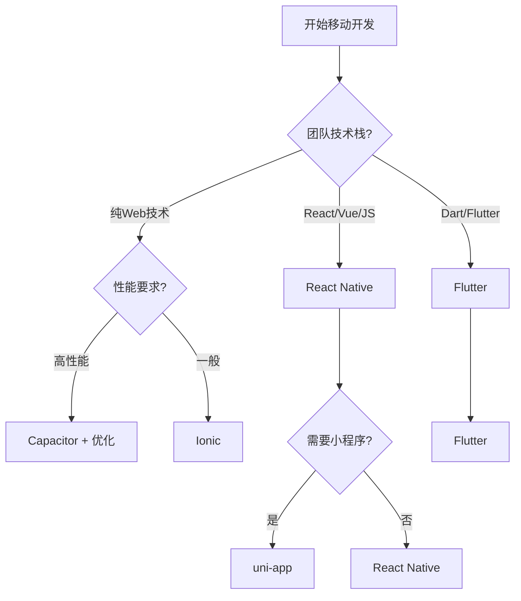

## 🧪 关联代码实验室

> **1** 个关联模块 · 平均成熟度：**🌿**

| 模块 | 成熟度 | 实现文件 | 测试文件 |
|------|--------|----------|----------|
| [37-pwa](../../jsts-code-lab/37-pwa/) | 🌿 | 3 | 1 |

> 跨平台移动应用开发框架与工具汇总

---

## 目录

- [React Native 生态](#react-native-生态)
- [Flutter 生态](#flutter-生态)
- [混合方案](#混合方案)
- [跨平台框架](#跨平台框架)
- [桌面端混合](#桌面端混合)
- [框架对比](#框架对比)

---

## React Native 生态

### react-native

| 属性 | 详情 |
|------|------|
| **Stars** | 120k+ ⭐ |
| **GitHub** | [facebook/react-native](https://github.com/facebook/react-native) |
| **官网** | [reactnative.dev](https://reactnative.dev/) |
| **TS支持** | ✅ 完全支持 |
| **创建时间** | 2015年1月 |
| **维护者** | Meta (Facebook) |

**描述**: 使用 React 构建原生应用的框架，支持 iOS 和 Android 平台。采用原生组件渲染，提供接近原生的性能和用户体验。

**特点**:

- 🎯 使用 JavaScript/TypeScript 和 React 开发
- 🎨 原生组件渲染，平台特定外观
- ♻️ 代码复用率 80-90%
- 🔥 热重载支持
- 📱 新架构 (Fabric/TurboModules) 提升性能
- 🌐 社区支持 Windows、macOS、Web 等平台

**适用场景**: 需要原生性能、已有 React 团队、需与 Web 共享代码的项目

---

### expo

| 属性 | 详情 |
|------|------|
| **Stars** | 36k+ ⭐ |
| **GitHub** | [expo/expo](https://github.com/expo/expo) |
| **官网** | [expo.dev](https://expo.dev/) |
| **TS支持** | ✅ 完全支持 |
| **创建时间** | 2016年8月 |
| **维护者** | Expo 团队 |

**描述**: React Native 的通用开发平台，提供完整的开发工具链、托管服务和丰富的原生模块库。

**特点**:

- 🚀 零配置快速开始
- 📦 内置 100+ 原生模块
- ☁️ Expo Application Services (EAS) 云服务
- 🔄 Over-the-Air (OTA) 更新
- 🛠️ 开发客户端实时预览
- 📱 支持 iOS、Android、Web

**适用场景**: 快速原型开发、小型到中型应用、无需原生代码的纯 JS 项目

---

### react-navigation

| 属性 | 详情 |
|------|------|
| **Stars** | 23k+ ⭐ |
| **GitHub** | [react-navigation/react-navigation](https://github.com/react-navigation/react-navigation) |
| **官网** | [reactnavigation.org](https://reactnavigation.org/) |
| **TS支持** | ✅ 完全支持 |

**描述**: React Native 的事实标准导航解决方案，提供栈导航、标签导航、抽屉导航等多种导航模式。

**特点**:

- 🧭 声明式导航配置
- 🎨 深度自定义主题和过渡动画
- 🔗 深度链接支持
- 📱 原生手势处理
- 🧩 模块化设计，按需使用
- 🔒 与 react-native-screens 集成提升性能

---

### react-native-elements

| 属性 | 详情 |
|------|------|
| **Stars** | 24k+ ⭐ |
| **GitHub** | [react-native-elements/react-native-elements](https://github.com/react-native-elements/react-native-elements) |
| **官网** | [reactnativeelements.com](https://reactnativeelements.com/) |
| **TS支持** | ✅ 完全支持 |

**描述**: 跨平台的 React Native UI 组件库，提供一致的设计语言和丰富的可定制组件。

**特点**:

- 🎨 平台一致的 UI 组件
- 🌙 内置深色模式支持
- 🔧 高度可定制主题系统
- 📦 包含 Button、Card、Input、ListItem 等常用组件
- ♿ 可访问性支持

---

### react-native-paper

| 属性 | 详情 |
|------|------|
| **Stars** | 13k+ ⭐ |
| **GitHub** | [callstack/react-native-paper](https://github.com/callstack/react-native-paper) |
| **官网** | [reactnativepaper.com](https://reactnativepaper.com/) |
| **TS支持** | ✅ 完全支持 |
| **维护者** | Callstack |

**描述**: 遵循 Material Design 规范的 React Native 组件库，提供高质量的 UI 组件和主题支持。

**特点**:

- 📐 遵循 Google Material Design 3
- 🎭 动态主题色彩支持
- 🔄 支持 Material You 动态配色
- 📱 内置底部导航、FAB、卡片、对话框等组件
- ♿ RTL 和可访问性完整支持

---

### react-native-reanimated

| 属性 | 详情 |
|------|------|
| **Stars** | 9k+ ⭐ |
| **GitHub** | [software-mansion/react-native-reanimated](https://github.com/software-mansion/react-native-reanimated) |
| **官网** | [docs.swmansion.com/react-native-reanimated](https://docs.swmansion.com/react-native-reanimated/) |
| **TS支持** | ✅ 完全支持 |
| **维护者** | Software Mansion |

**描述**: React Native 的高性能动画库，重新实现了 Animated API，支持复杂手势驱动的动画。

**特点**:

- ⚡ 工作在 UI 线程，流畅 60-120 FPS
- 🤲 与 react-native-gesture-handler 完美配合
- 📝 声明式 API，支持共享值
- 🎨 布局动画、进入/退出动画
- 🔄 Reanimated 4 支持新架构
- 📱 Shared Element Transitions 支持

---

## Flutter 生态

### flutter

| 属性 | 详情 |
|------|------|
| **Stars** | 166k+ ⭐ |
| **GitHub** | [flutter/flutter](https://github.com/flutter/flutter) |
| **官网** | [flutter.dev](https://flutter.dev/) |
| **语言** | Dart |
| **创建时间** | 2017年 |
| **维护者** | Google |

**描述**: Google 的 UI 工具包，用于从单一代码库构建精美的移动、Web 和桌面应用。使用 Dart 语言和自渲染引擎。

**特点**:

- 🎨 自渲染引擎 (Skia/Impeller)，UI 高度一致
- ⚡ 接近原生性能，AOT 编译
- ♻️ 100% 代码复用率
- 🎯 丰富的内置 Widget 库
- 🔥 热重载支持
- 📱 支持 iOS、Android、Web、Windows、macOS、Linux
- 🎬 强大的动画支持

**适用场景**: 高度定制化 UI、复杂动画、多平台统一体验的项目

**注意**: Flutter 使用 Dart 语言而非 JavaScript，但与 JS 生态密切相关，是跨平台开发的重要选择。

---

## 混合方案

### ionic

| 属性 | 详情 |
|------|------|
| **Stars** | 51k+ ⭐ |
| **GitHub** | [ionic-team/ionic-framework](https://github.com/ionic-team/ionic-framework) |
| **官网** | [ionicframework.com](https://ionicframework.com/) |
| **TS支持** | ✅ 完全支持 |
| **创建时间** | 2013年 |

**描述**: 基于 Web 技术（HTML、CSS、JavaScript）的跨平台移动应用开发框架，使用 WebView 渲染。

**特点**:

- 🌐 基于标准 Web 技术
- 🎨 丰富的 UI 组件库
- 📱 支持 iOS、Android、PWA
- 🔌 与 Capacitor 或 Cordova 集成访问原生功能
- 🅰️ 支持 Angular、React、Vue
- ☁️ Ionic Appflow 云服务

**适用场景**: Web 开发者转型移动开发、需要快速开发 PWA 和移动应用

---

### capacitor

| 属性 | 详情 |
|------|------|
| **Stars** | 12k+ ⭐ |
| **GitHub** | [ionic-team/capacitor](https://github.com/ionic-team/capacitor) |
| **官网** | [capacitorjs.com](https://capacitorjs.com/) |
| **TS支持** | ✅ 完全支持 |

**描述**: 现代的原生 WebView 容器，将 Web 应用打包为原生应用，是 Cordova 的现代替代品。

**特点**:

- 🚀 现代化架构，TypeScript 优先
- 📦 原生 API 访问通过插件系统
- 🔒 更好的安全模型
- 🎯 原生项目作为一等公民
- 📱 支持 iOS、Android、PWA
- 🔄 实时重新加载开发模式

---

### cordova

| 属性 | 详情 |
|------|------|
| **Stars** | 3k+ ⭐ |
| **GitHub** | [apache/cordova](https://github.com/apache/cordova) |
| **官网** | [cordova.apache.org](https://cordova.apache.org/) |
| **TS支持** | ✅ 支持 |
| **维护者** | Apache 软件基金会 |

**描述**: Apache Cordova 是历史悠久的移动应用开发框架，允许使用 Web 技术构建应用。

**特点**:

- 🌐 最早的 Web-to-Mobile 框架之一
- 🔌 丰富的插件生态系统
- 📱 支持多平台
- ⚠️ 目前主要维护模式，推荐使用 Capacitor 替代

---

## 跨平台框架

### nativescript

| 属性 | 详情 |
|------|------|
| **Stars** | 24k+ ⭐ |
| **GitHub** | [NativeScript/NativeScript](https://github.com/NativeScript/NativeScript) |
| **官网** | [nativescript.org](https://nativescript.org/) |
| **TS支持** | ✅ 完全支持 |

**描述**: 使用 JavaScript/TypeScript 构建真正的原生移动应用，直接调用原生 API，无需 WebView。

**特点**:

- 📱 直接访问 100% 原生平台 API
- ⚡ 原生性能，无 WebView 开销
- 🅰️ 支持 Angular、Vue、React、Svelte
- 🎨 CSS 样式支持
- 🔌 丰富的插件市场
- ♻️ 代码共享 Web 和移动端

---

### weex

| 属性 | 详情 |
|------|------|
| **Stars** | 13k+ ⭐ |
| **GitHub** | [apache/incubator-weex](https://github.com/apache/incubator-weex) |
| **官网** | [weex.apache.org](https://weex.apache.org/) |
| **TS支持** | ✅ 支持 |
| **维护者** | Apache 基金会 (孵化中) |

**描述**: 阿里巴巴开源的跨平台移动开发框架，支持 Vue 语法，生成原生渲染的应用。

**特点**:

- 🌐 使用 Vue.js 语法
- 📱 原生渲染，非 WebView
- ♻️ 一次编写，三端运行 (Web、iOS、Android)
- ⚠️ 目前处于 Apache 孵化器状态，活跃度降低

---

### uni-app

| 属性 | 详情 |
|------|------|
| **Stars** | 41k+ ⭐ |
| **GitHub** | [dcloudio/uni-app](https://github.com/dcloudio/uni-app) |
| **官网** | [uniapp.dcloud.net.cn](https://uniapp.dcloud.net.cn/) |
| **TS支持** | ✅ 完全支持 |
| **维护者** | DCloud |

**描述**: 基于 Vue.js 的跨平台开发框架，支持编译到 iOS、Android、H5、以及各种小程序平台。

**特点**:

- 🌐 基于 Vue.js 2/3
- 📱 一次开发，多端发布
- 🔄 支持微信小程序、支付宝小程序、百度小程序等
- 💰 丰富的插件市场和云服务
- 🛠️ HBuilderX IDE 深度集成
- 🇨🇳 国内生态丰富

---

## 桌面端混合

### electron

| 属性 | 详情 |
|------|------|
| **Stars** | 113k+ ⭐ |
| **GitHub** | [electron/electron](https://github.com/electron/electron) |
| **官网** | [electronjs.org](https://www.electronjs.org/) |
| **TS支持** | ✅ 完全支持 |
| **创建时间** | 2013年 |
| **维护者** | GitHub |

**描述**: 使用 Web 技术构建跨平台桌面应用的框架，捆绑 Chromium 和 Node.js。

**特点**:

- 🌐 完整的 Web 技术栈支持
- 💻 支持 Windows、macOS、Linux
- 🔌 完整的 Node.js API 访问
- 🎨 丰富的应用案例 (VS Code、Slack、Discord)
- 📦 electron-builder 打包工具
- ⚠️ 应用体积较大 (80-150MB)，内存占用较高

**适用场景**: 复杂桌面应用、已有 Web 代码需要桌面化、功能丰富的 IDE 类应用

---

### tauri

| 属性 | 详情 |
|------|------|
| **Stars** | 89k+ ⭐ |
| **GitHub** | [tauri-apps/tauri](https://github.com/tauri-apps/tauri) |
| **官网** | [tauri.app](https://tauri.app/) |
| **TS支持** | ✅ 完全支持 (前端) |
| **创建时间** | 2019年7月 |
| **语言** | Rust (后端) |

**描述**: 使用 Web 前端和 Rust 后端构建小巧、快速、安全的桌面应用框架。

**特点**:

- 📦 极小的应用体积 (2-10MB)
- ⚡ 低内存占用 (30-50MB)
- 🔒 安全的架构设计
- 🦀 Rust 后端，类型安全
- 🌐 使用系统原生 WebView
- 📱 支持 Windows、macOS、Linux、iOS、Android
- 🚀 快速启动 (< 500ms)

**适用场景**: 对应用体积和性能敏感、需要现代安全架构、愿意学习 Rust

---

### react-native-windows

| 属性 | 详情 |
|------|------|
| **GitHub** | [microsoft/react-native-windows](https://github.com/microsoft/react-native-windows) |
| **官网** | [microsoft.github.io/react-native-windows](https://microsoft.github.io/react-native-windows/) |
| **TS支持** | ✅ 完全支持 |
| **维护者** | Microsoft |

**描述**: 将 React Native 带到 Windows 平台的官方实现，支持 Windows 10+ 和 Xbox。

**特点**:

- 🪟 原生 Windows 组件支持
- 🎮 Xbox 支持
- 🔧 与 WinUI 2/3 集成
- ⚡ 原生性能
- 📱 与 React Native 代码共享

---

### react-native-macos

| 属性 | 详情 |
|------|------|
| **GitHub** | [microsoft/react-native-macos](https://github.com/microsoft/react-native-macos) |
| **官网** | [microsoft.github.io/react-native-windows](https://microsoft.github.io/react-native-windows/) |
| **TS支持** | ✅ 完全支持 |
| **维护者** | Microsoft |

**描述**: 将 React Native 带到 macOS 平台的官方实现。

**特点**:

- 🍎 原生 macOS 组件支持
- 🎨 遵循 macOS 设计规范
- 🔧 与 Cocoa 集成
- ⚡ 原生性能
- 📱 与 iOS React Native 代码高度共享

---

## 框架对比

### 移动端跨平台框架对比

| 框架 | 语言 | 渲染方式 | 性能 | 生态 | 适用场景 |
|------|------|----------|------|------|----------|
| **React Native** | JS/TS | 原生组件 | ⭐⭐⭐⭐ | ⭐⭐⭐⭐⭐ | 已有 JS 团队、需原生体验 |
| **Flutter** | Dart | 自渲染引擎 | ⭐⭐⭐⭐⭐ | ⭐⭐⭐⭐ | 高度定制 UI、复杂动画 |
| **Ionic** | JS/TS | WebView | ⭐⭐⭐ | ⭐⭐⭐⭐ | Web 开发者、快速原型 |
| **NativeScript** | JS/TS | 原生组件 | ⭐⭐⭐⭐ | ⭐⭐⭐ | 需直接访问原生 API |
| **uni-app** | Vue | WebView/原生 | ⭐⭐⭐ | ⭐⭐⭐⭐ | 小程序+App 多端发布 |

### 桌面端框架对比

| 框架 | 前端技术 | 后端技术 | 包体积 | 内存占用 | 适用场景 |
|------|----------|----------|--------|----------|----------|
| **Electron** | Web | Node.js | 80-150MB | 150-300MB | 功能丰富的大型应用 |
| **Tauri** | Web | Rust | 2-10MB | 30-50MB | 轻量级、性能敏感应用 |
| **React Native Windows/macOS** | React Native | Native | 中等 | 中等 | 移动端扩展到桌面 |

---

## 选择建议

### 移动端开发选型

### 桌面端开发选型

- **Electron**: 适合功能复杂、开发周期短、对体积不敏感的应用
- **Tauri**: 适合追求小体积、高性能、高安全性的应用
- **React Native Windows/macOS**: 适合已有 React Native 移动应用扩展到桌面

---

## 相关资源

### 官方文档

- [React Native 官方文档](https://reactnative.dev/)
- [Flutter 官方文档](https://docs.flutter.dev/)
- [Expo 文档](https://docs.expo.dev/)
- [Ionic 文档](https://ionicframework.com/docs)
- [Tauri 文档](https://tauri.app/v1/guides/)

### 社区资源

- [React Native 周刊](https://reactnative.cc/)
- [Flutter 中文社区](https://flutter.cn/)
- [NativeScript 中文文档](https://docs.nativescript.org/)

---

*最后更新: 2025年4月*
