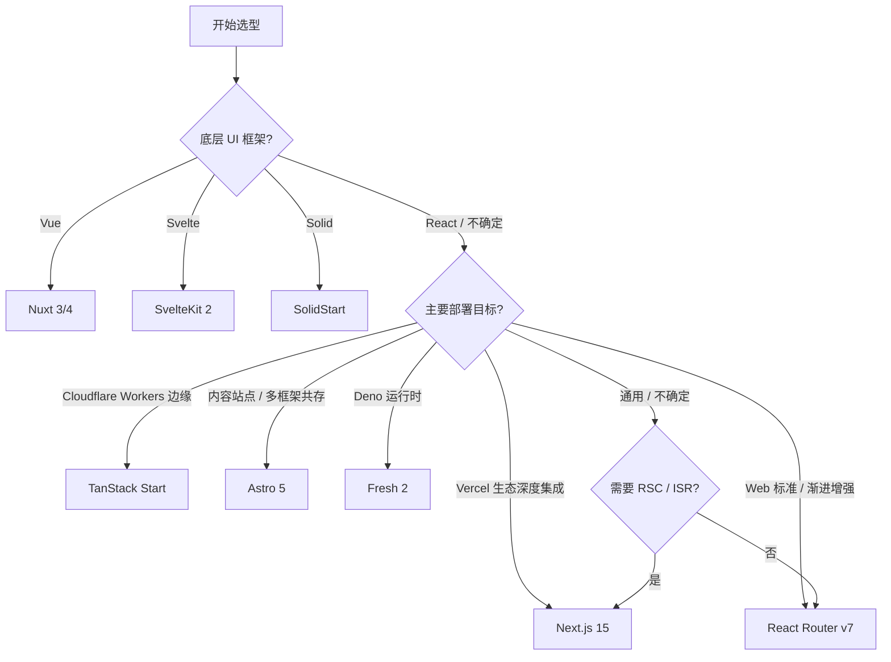

## 🧪 关联代码实验室

> **2** 个关联模块 · 平均成熟度：**🌳**

| 模块 | 成熟度 | 实现文件 | 测试文件 |
|------|--------|----------|----------|
| [09-real-world-examples](../../jsts-code-lab/09-real-world-examples/) | 🌳 | 7 | 7 |
| [59-fullstack-patterns](../../jsts-code-lab/59-fullstack-patterns/) | 🌿 | 1 | 1 |
| [88-tanstack-start-cloudflare](../../jsts-code-lab/88-tanstack-start-cloudflare/) | 🌳 | 8 | 0 |


> 基于主流前端框架构建的全栈开发框架，提供服务端渲染 (SSR)、静态站点生成 (SSG)、增量静态再生 (ISR)、API 路由、边缘渲染等能力。本文档覆盖 2025-2026 年主流 SSR 元框架的深度对比与选型指南。

---

## 📊 生态概览

| 框架 | Stars | 版本 | 底层 UI | 渲染策略 | TS 支持 | 趋势 |
|------|-------|------|---------|----------|---------|------|
| **Next.js** | 127k+ ⭐ | 15.x | React | SSR / SSG / ISR / RSC | ⭐⭐⭐⭐⭐ | 🔥 统治级 |
| **Nuxt** | 55k+ ⭐ | 3.12+ / 4 预览 | Vue | SSR / SSG / ISR / Hybrid | ⭐⭐⭐⭐⭐ | ⭐ 稳健增长 |
| **Astro** | 45k+ ⭐ | 5.x | 多框架 (岛) | SSG / SSR / 零 JS | ⭐⭐⭐⭐⭐ | 🚀 快速崛起 |
| **Remix** | 28k+ ⭐ | 2.x → React Router v7 | React | SSR 为主 | ⭐⭐⭐⭐⭐ | ⚠️ 战略合并 |
| **SvelteKit** | 18k+ ⭐ | 2.x | Svelte | SSR / CSR / Prerender | ⭐⭐⭐⭐⭐ | ⭐ 稳步发展 |
| **TanStack Start** | 4k+ ⭐ | 1.154.0+ (RC) | React | SSR / CSR / 边缘 | ⭐⭐⭐⭐⭐ | 🚀 新兴热门 |
| **SolidStart** | 4k+ ⭐ | 1.x | SolidJS | SSR / CSR / 流式 | ⭐⭐⭐⭐⭐ | 🌱 生态早期 |
| **Fresh** | 12k+ ⭐ | 2.0 (Deno) | Preact | SSR / 岛屿 | ⭐⭐⭐⭐ | 🌱 Deno 专属 |

> 📅 数据基准：2026 年 4-5 月 · Stars 数据来自 GitHub 公开仓库

---

## 1. React 生态元框架

### 1.1 Next.js 15 (App Router)

| 属性 | 详情 |
|------|------|
| **名称** | Next.js |
| **Stars** | ⭐ 127,000+ |
| **当前版本** | 15.3.x (App Router 稳定，Pages Router 维护中) |
| **GitHub** | [vercel/next.js](https://github.com/vercel/next.js) |
| **官网** | [nextjs.org](https://nextjs.org) |
| **维护方** | Vercel |
| **TS 支持** | ⭐⭐⭐⭐⭐ 原生 TypeScript，类型定义完善 |

**一句话描述**：React 生态最成熟的全栈元框架，App Router 基于 React Server Components 构建，Vercel 平台原生最优。

**核心特性**：

- **App Router (app/)**：基于 React Server Components (RSC) 的嵌套路由，支持 Server Actions、`async/await` 组件、并行路由 (`@folder`)、拦截路由 (`(.)folder`)
- **Pages Router (pages/)**：传统 SSR/SSG 路由，成熟稳定，大量存量项目使用
- **渲染策略全覆盖**：SSR (`'force-dynamic'`)、SSG (`generateStaticParams`)、ISR (`revalidate`)、Streaming SSR (`loading.js`)
- **Server Actions**：表单提交、数据变更无需手写 API 端点，函数级服务端调用
- **Turbopack**：Rust 编写的增量打包器，替代 Webpack，开发启动速度提升 10 倍+
- **内置优化**：`<Image>` 自动优化、`<Script>` 加载策略、字体优化 (`next/font`)
- **中间件 (Middleware)**：基于 Edge Runtime 的请求拦截、A/B 测试、地理路由

**部署目标**：

| 平台 | 支持度 | 说明 |
|------|--------|------|
| Vercel | ⭐⭐⭐⭐⭐ 最优 | ISR、Edge、Analytics 原生集成 |
| Node.js | ⭐⭐⭐⭐⭐ | `next start` 标准部署 |
| Docker | ⭐⭐⭐⭐ | `standalone` 输出模式 |
| Cloudflare Workers | ⚠️ 有限 | Edge Runtime 不支持 Node API，功能受限 |

**适用场景**：

- 大型 React 应用 / 电商平台 / 内容站点
- 需要 ISR 增量再生的高流量页面
- 已深度使用 Vercel 生态的团队

---

### 1.2 Remix → React Router v7

| 属性 | 详情 |
|------|------|
| **名称** | Remix (已合并为 React Router v7) |
| **Stars** | ⭐ 28,000+ (remix-run/remix) |
| **当前版本** | Remix 2.x 维护中 / React Router v7 全栈模式 |
| **GitHub** | [remix-run/remix](https://github.com/remix-run/remix) / [remix-run/react-router](https://github.com/remix-run/react-router) |
| **官网** | [remix.run](https://remix.run) |
| **维护方** | Shopify (原) → 开源社区 |
| **TS 支持** | ⭐⭐⭐⭐⭐ 原生 TypeScript |

**一句话描述**：以 Web 标准为核心的全栈框架，2024 年底宣布与 React Router 合并为 v7，强调渐进增强和原生表单行为。

**核心特性**：

- **Web 标准优先**：基于原生 `<form>`、`<a>`、Fetch API，不引入额外的数据传输协议
- **嵌套路由 (Nested Routing)**：路由层级与组件层级同构，URL 即状态
- **Loader + Action 模式**：`loader` 负责数据获取，`action` 负责数据变更，边界清晰
- **渐进增强 (Progressive Enhancement)**：无 JavaScript 也能提交表单，SEO 与可访问性优先
- **Remix → React Router v7**：2024 年 12 月，Remix 团队宣布 Remix 作为独立框架将逐渐淡出，核心能力并入 React Router v7 的「框架模式」(Framework Mode)

**部署目标**：

| 平台 | 支持度 | 说明 |
|------|--------|------|
| Node.js | ⭐⭐⭐⭐⭐ | 原生支持 |
| Vercel | ⭐⭐⭐⭐ | 适配器支持 |
| Cloudflare Workers | ⭐⭐⭐ | `@remix-run/cloudflare` 适配器 |
| Netlify | ⭐⭐⭐⭐ | 适配器支持 |

**适用场景**：

- 坚守 Web 标准、重视渐进增强的团队
- 已有 React Router 项目，希望渐进式升级为全栈
- 对平台锁定敏感、追求框架agnostic 的开发者

> ⚠️ **战略合并说明**：Remix 原团队（Shopify）已将重心转向 React Router v7 的框架模式。新项目建议直接评估 React Router v7 框架模式或 Next.js。

---

## 2. Vue 生态元框架

### 2.1 Nuxt 3.12+

| 属性 | 详情 |
|------|------|
| **名称** | Nuxt |
| **Stars** | ⭐ 55,000+ |
| **当前版本** | 3.12.x (稳定) / 4.0 预览中 |
| **GitHub** | [nuxt/nuxt](https://github.com/nuxt/nuxt) |
| **官网** | [nuxt.com](https://nuxt.com) |
| **维护方** | Nuxt Labs / Vue 生态 |
| **TS 支持** | ⭐⭐⭐⭐⭐ 原生 TypeScript，Nuxt Typed Router |

**一句话描述**：Vue 生态最成熟的全栈框架，基于 Nitro 引擎，支持多种渲染模式的无缝切换。

**核心特性**：

- **Nitro 引擎**：通用服务端引擎，自动代码分割，支持 20+ 部署预设 (Node、Cloudflare、Vercel、Netlify、Deno、Bun 等)
- **渲染模式切换**：`ssr: true/false`、`nitro.prerender`、`routeRules` 可按路由配置渲染策略
- **自动导入 (Auto Imports)**：`composables/`、`utils/`、`components/` 自动注册，零样板代码
- **Server API**：`~/server/api/` 文件自动路由、`~/server/middleware/` 中间件、`~/server/plugins/` 插件
- **Nuxt DevTools**：内置浏览器开发者工具，可视化页面、组件、状态、服务器路由
- **Nuxt Modules**：200+ 官方与社区模块，一键集成 Prisma、Tailwind、i18n、Auth 等
- **Nuxt 3.12+ 新特性**：改进的 HMR、实验性 View Transitions、增强的 `useFetch` 缓存策略

**部署目标**：

| 平台 | 支持度 | 说明 |
|------|--------|------|
| Node.js | ⭐⭐⭐⭐⭐ | `node-server` 预设 |
| Cloudflare Workers / Pages | ⭐⭐⭐⭐⭐ | `cloudflare-module` / `cloudflare-pages` 预设 |
| Vercel | ⭐⭐⭐⭐⭐ | `vercel` 预设 |
| Netlify | ⭐⭐⭐⭐⭐ | `netlify` 预设 |
| Deno / Bun | ⭐⭐⭐⭐ | `deno-server` / `bun` 预设 |

**适用场景**：

- Vue 技术栈的全栈项目
- 需要极高部署灵活性的项目（多平台切换）
- 追求开箱即用、低配置成本的团队

---

### 2.2 Nuxt 4 预览

| 属性 | 详情 |
|------|------|
| **版本状态** | 4.0 预览 / 预计 2026 年 Q2-Q3 正式发布 |
| **兼容性** | Nuxt 3 项目可通过 `compatibilityVersion: 4` 渐进升级 |

**核心变化预览**：

- **目录结构简化**：`app/` 目录成为默认，减少顶层目录混乱
- **Nitro 3**：服务端引擎升级，性能提升，配置更统一
- **改进的 TypeScript**：更快的类型推断，更准确的 `useFetch` 返回类型
- **实验性 Reactivity Transform 清理**：全面拥抱 Vue 3.4+ 的 `defineModel`、`watchEffect` 等新 API

> 📌 来源：[Nuxt 官方路线图](https://nuxt.com/docs/community/roadmap) · GitHub nuxt/nuxt Milestones

---

## 3. 其他主流元框架

### 3.1 SvelteKit 2

| 属性 | 详情 |
|------|------|
| **名称** | SvelteKit |
| **Stars** | ⭐ 18,000+ |
| **当前版本** | 2.x (Svelte 5 Runes 适配中) |
| **GitHub** | [sveltejs/kit](https://github.com/sveltejs/kit) |
| **官网** | [kit.svelte.dev](https://kit.svelte.dev) |
| **TS 支持** | ⭐⭐⭐⭐⭐ 原生 TypeScript |

**一句话描述**：Svelte 的官方全栈框架，编译时优化带来极小包体积，适配器模式支持多平台部署。

**核心特性**：

- **基于文件系统的路由**：`+page.svelte` (页面)、`+layout.svelte` (布局)、`+server.js` (API 端点)、`+page.server.js` (服务端数据)
- **统一 load 函数**：`+page.js` / `+page.server.js` 中的 `load` 函数统一处理服务端与客户端数据获取
- **Form Actions**：原生表单 action 处理，渐进增强，无需 JavaScript 即可提交
- **适配器模式 (Adapters)**：`adapter-node`、`adapter-vercel`、`adapter-netlify`、`adapter-cloudflare-workers` 等
- **Svelte 5 Runes 支持**：`$state`、`$derived`、`$effect` 新响应式系统，编译时依赖追踪

**部署目标**：

| 平台 | 支持度 | 说明 |
|------|--------|------|
| Node.js | ⭐⭐⭐⭐⭐ | `adapter-node` |
| Vercel | ⭐⭐⭐⭐⭐ | `adapter-vercel` |
| Cloudflare Workers | ⭐⭐⭐⭐⭐ | `adapter-cloudflare-workers` |
| Netlify | ⭐⭐⭐⭐⭐ | `adapter-netlify` |

**适用场景**：

- 追求极致轻量包体积的应用
- Svelte 技术栈团队
- 边缘部署且对冷启动敏感的项目

---

### 3.2 SolidStart

| 属性 | 详情 |
|------|------|
| **名称** | SolidStart |
| **Stars** | ⭐ 4,000+ |
| **当前版本** | 1.x (稳定) |
| **GitHub** | [solidjs/solid-start](https://github.com/solidjs/solid-start) |
| **官网** | [start.solidjs.com](https://start.solidjs.com) |
| **TS 支持** | ⭐⭐⭐⭐⭐ 原生 TypeScript |

**一句话描述**：SolidJS 的全栈框架，细粒度响应式 + 最小运行时，性能基准测试领先。

**核心特性**：

- **细粒度响应式 SSR**：SolidJS 的信号 (Signals) 机制直接应用于服务端渲染，无 Virtual DOM 开销
- **文件系统路由**：`routes/` 目录约定，支持动态参数、布局、错误边界
- **多种渲染模式**：SPA、SSR、SSG、Streaming SSR 可按路由配置
- **服务端/客户端同构**：`createAsync` 统一数据获取，`server$` 标记服务端专属代码
- **Vite 原生构建**：开发服务器基于 Vite，HMR 速度快

**部署目标**：

| 平台 | 支持度 | 说明 |
|------|--------|------|
| Node.js | ⭐⭐⭐⭐⭐ | 原生支持 |
| Vercel | ⭐⭐⭐⭐ | 适配器支持 |
| Netlify | ⭐⭐⭐⭐ | 适配器支持 |

**适用场景**：

- 性能敏感型应用（实时数据可视化、高频交互）
- SolidJS 生态用户
- 对响应式粒度有极致要求的项目

---

### 3.3 Astro 5

| 属性 | 详情 |
|------|------|
| **名称** | Astro |
| **Stars** | ⭐ 45,000+ |
| **当前版本** | 5.x |
| **GitHub** | [withastro/astro](https://github.com/withastro/astro) |
| **官网** | [astro.build](https://astro.build) |
| **TS 支持** | ⭐⭐⭐⭐⭐ 原生 TypeScript |

**一句话描述**：内容驱动的元框架，群岛架构 (Islands Architecture) 默认零 JavaScript，支持 React/Vue/Svelte/Solid 等多框架组件混写。

**核心特性**：

- **群岛架构 (Islands)**：页面默认纯 HTML，仅交互区域按需加载 JS (`client:load`、`client:visible`、`client:idle`)
- **内容集合 (Content Collections)**：基于 Zod 的类型安全内容管理，完美适配 Markdown/MDX 内容站点
- **多框架支持**：同一页面可同时使用 React、Vue、Svelte、Solid、Preact、Alpine.js 组件
- **Astro DB**：内置 libSQL 数据库（基于 Turso），边缘优先的内容存储
- **View Transitions API**：原生浏览器页面过渡动画，无需额外库
- **Server Islands (实验性)**：服务端渲染的群岛，进一步减少客户端 JS

**部署目标**：

| 平台 | 支持度 | 说明 |
|------|--------|------|
| 静态托管 (Vercel/Netlify/CF Pages) | ⭐⭐⭐⭐⭐ | SSG 为默认，最优 |
| Node.js | ⭐⭐⭐⭐ | `astro build` + Node adapter |
| Vercel Edge | ⭐⭐⭐⭐ | `astro build` + Vercel adapter |
| Cloudflare Workers | ⭐⭐⭐⭐ | `@astrojs/cloudflare` |

**适用场景**：

- 内容型网站 / 博客 / 文档站点 / 营销页面
- 多技术栈团队（设计师用 React、开发者用 Vue 可在同一项目共存）
- 追求 Core Web Vitals 极致分数的 SEO 项目

---

### 3.4 Fresh (Deno)

| 属性 | 详情 |
|------|------|
| **名称** | Fresh |
| **Stars** | ⭐ 12,000+ |
| **当前版本** | 2.0 (Deno 运行时) |
| **GitHub** | [denoland/fresh](https://github.com/denoland/fresh) |
| **官网** | [fresh.deno.dev](https://fresh.deno.dev) |
| **TS 支持** | ⭐⭐⭐⭐⭐ Deno 原生 TypeScript |

**一句话描述**：Deno 官方推出的全栈框架，基于 Preact 和 Islands 架构，零构建步骤，直接运行 TS/TSX。

**核心特性**：

- **零构建步骤**：开发时直接运行 TS/TSX，无 Webpack/Vite 构建等待
- **Islands 架构**：与 Astro 类似，静态区域无 JS，交互区域按需水合
- **Deno 原生**：内置权限模型、标准库、TypeScript 支持，无需 `tsconfig.json`
- **Just-in-Time 渲染**：页面在请求时渲染，结合边缘缓存实现高性能
- **Fresh 2.0**：引入插件系统、改进的路由、更好的 Deno Deploy 集成

**部署目标**：

| 平台 | 支持度 | 说明 |
|------|--------|------|
| Deno Deploy | ⭐⭐⭐⭐⭐ 最优 | 边缘原生，全球低延迟 |
| 自托管 (Deno) | ⭐⭐⭐⭐ | `deno run` 直接启动 |
| Node.js | ❌ 不支持 | Deno 运行时专属 |

**适用场景**：

- Deno 技术栈团队
- 需要极简构建流程的项目
- Deno Deploy 边缘部署

---

### 3.5 TanStack Start

| 属性 | 详情 |
|------|------|
| **名称** | TanStack Start |
| **Stars** | ⭐ 4,000+ (@tanstack/router 仓库聚合) |
| **当前版本** | 1.154.0+ (RC，接近稳定) |
| **GitHub** | [TanStack/router](https://github.com/TanStack/router) |
| **官网** | [tanstack.com/start](https://tanstack.com/start) |
| **TS 支持** | ⭐⭐⭐⭐⭐ 类型安全路由为核心卖点 |

**一句话描述**：基于 TanStack Router 的全栈 React 框架，类型安全路由 + Server Function + 原生 Cloudflare Workers 支持。

**核心特性**：

- **类型安全路由 (Type-Safe Routing)**：路径参数、查询参数、导航操作全部在 TypeScript 层面校验
- **Server Function**：`createServerFn` 零样板代码的 RPC 风格服务端函数，客户端直接调用
- **原生 Cloudflare 支持**：与 Cloudflare 官方合作，`@cloudflare/vite-plugin` 一等公民集成
- **SSR Streaming**：内置流式渲染，`renderToReadableStream` + Suspense 渐进交付
- **Vite 构建**：自 v1.121.0 从 Vinxi 迁移至纯 Vite，构建链路更透明

**部署目标**：

| 平台 | 支持度 | 说明 |
|------|--------|------|
| Cloudflare Workers | ⭐⭐⭐⭐⭐ 首选 | D1/KV/R2 Bindings 原生访问 |
| Node.js | ⭐⭐⭐⭐ | `node-server` 预设 |
| Vercel | ⭐⭐⭐ | 需自定义适配 |
| Docker | ⭐⭐⭐⭐ | 标准输出 |

**适用场景**：

- Cloudflare Workers 边缘优先部署
- 对 URL 状态管理（Search Params 作为一等状态）有强需求
- 追求零平台锁定、构建流程完全可控的团队

> 📖 详细部署指南：[TanStack Start + Cloudflare Workers 部署完全指南](../guide/tanstack-start-cloudflare-deployment.md)

---

## 4. App Router vs Pages Router 深度对比

Next.js 的双路由系统是当前 React 生态最大的架构分歧点。

| 维度 | App Router | Pages Router |
|------|------------|--------------|
| **架构模型** | React Server Components (RSC) 优先 | 传统 SSR/SSG，组件全客户端水合 |
| **数据获取** | Server Components 内直接 `async/await` + `fetch` | `getServerSideProps` / `getStaticProps` |
| **数据变更** | Server Actions (`'use server'`) | API Routes (`pages/api`) + 手动 fetch |
| **布局系统** | `layout.js` 嵌套继承，支持并行/拦截路由 | `_app.js` + `_document.js` 全局布局 |
| **加载状态** | `loading.js` 自动 Streaming Suspense 边界 | 需手动实现 Suspense |
| **中间件** | 支持 (`middleware.js`) | 支持 (`middleware.js`) |
| **生态兼容性** | ⚠️ 部分库需 RSC 适配 (React Query 需 `hydrate` 特殊处理) | ⭐⭐⭐⭐⭐ 生态完全兼容 |
| **学习曲线** | 较陡 (RSC 心智模型、缓存策略复杂) | 平缓 |
| **成熟度** | 2023 年推出，持续迭代中 | 2016 年推出，极度成熟 |
| **推荐新项目** | ✅ 是 (官方默认) | ⚠️ 仅维护存量项目 |

### 关键差异详解

**1. Server Components vs Client Components**

```jsx
// App Router: 默认 Server Component，可直接访问数据库
export default async function Page() {
  const data = await db.query('SELECT * FROM posts'); // 服务端直接执行
  return <PostList posts={data} />;
}

// Pages Router: 需要 getServerSideProps 或 API Route
export async function getServerSideProps() {
  const data = await db.query('SELECT * FROM posts');
  return { props: { data } };
}
```

**2. 缓存策略复杂度**

App Router 引入了多层缓存：`fetch` 缓存、Route Segment Config (`revalidate`)、Router Cache (客户端)。开发者需要理解 `cache`、`no-store`、`revalidate`、`unstable_cache` 的交互关系，调试成本较高。

**3. 何时仍选择 Pages Router？**

- 大型存量项目，迁移成本过高
- 重度依赖尚未 RSC 适配的第三方库
- 团队对 RSC 心智模型尚未准备好

> 📌 来源：[Next.js 官方文档 - App Router](https://nextjs.org/docs/app) · [Next.js 15 发布说明](https://nextjs.org/blog/next-15)

---

## 5. Server Components / Streaming / Edge 支持对比

| 框架 | React Server Components | Streaming SSR | Edge Runtime | 说明 |
|------|------------------------|---------------|--------------|------|
| **Next.js (App)** | ✅ 原生支持 | ✅ `loading.js` + Suspense | ⚠️ Edge Runtime 有限 | RSC + Streaming 最成熟，Edge 不支持 Node API |
| **Nuxt 3** | ❌ 不适用 (Vue) | ✅ `NuxtLoadingIndicator` + 流式 | ✅ Nitro Edge 预设 | Vue 生态无 RSC 概念，但 Streaming 完善 |
| **SvelteKit** | ❌ 不适用 (Svelte) | ✅ 流式 SSR | ✅ Adapters | `streaming` 配置开启 |
| **Remix** | ❌ 不支持 | ✅ `defer` + Streaming | ⚠️ 部分支持 | 坚持传统 SSR + Streaming，不跟进 RSC |
| **TanStack Start** | ⚠️ 计划中 (React 19) | ✅ 内置 Streaming | ✅ 原生 Cloudflare Workers | 为 React 19 RSC 设计，当前 Streaming 已成熟 |
| **Astro** | ❌ 不适用 | ⚠️ 部分 (Server Islands) | ✅ 适配器支持 | 群岛架构替代方案，非传统 Streaming SSR |
| **SolidStart** | ❌ 不适用 (Solid) | ✅ 流式 | ⚠️ 有限 | Solid 的 Signals 实现高效 Streaming |
| **Fresh** | ❌ 不适用 (Preact) | ✅ Islands 渐进水合 | ✅ Deno Deploy 边缘 | Preact Islands 架构 |

### Server Components 现状

- **React 唯一**：目前仅 React 生态有 Server Components 概念，Next.js App Router 是最大规模落地场景
- **生态分裂**：React Query、Zustand、Tailwind 等库均需适配 RSC (`'use client'` 边界)，增加了使用复杂度
- **Vue 的回应**：Vue 团队表示短期内不会引入 RSC 模式，而是通过 `ServerPrefetch` + `useAsyncData` 满足类似需求

### Streaming SSR 实现差异

| 框架 | 实现机制 | 开发者体验 |
|------|----------|------------|
| Next.js App Router | `ReactDOMServer.renderToReadableStream` + `loading.js` | 自动，几乎无感知 |
| Nuxt | `renderToString` + `NuxtLoadingIndicator` | 配置 `experimental.renderJsonPayloads` |
| SvelteKit | `render` 流式输出 | `stream: { body: true }` 开启 |
| TanStack Start | `renderToReadableStream` + Suspense 边界 | 默认开启，框架管理 |

---

## 6. 选型决策树

### 6.1 按项目类型推荐



### 6.2 场景化推荐矩阵

| 场景 | 首选 | 次选 | 核心理由 |
|------|------|------|----------|
| **个人博客 / 内容站点** | **Astro 5** | Nuxt / SvelteKit | 零 JS 默认、内容集合、Core Web Vitals 最优 |
| **电商 / 高流量内容** | **Next.js 15** | Nuxt | ISR 增量再生、RSC 细粒度控制、Vercel 一键部署 |
| **企业级后台 / SaaS** | **Nuxt 3** | Next.js / TanStack Start | 模块生态丰富、部署灵活、团队学习成本低 |
| **SaaS (边缘优先)** | **TanStack Start** | SvelteKit | Cloudflare Workers 原生、D1/KV/R2 直接访问 |
| **SEO 营销页面** | **Astro 5** | Fresh | 群岛架构、首屏无 JS、View Transitions |
| **实时交互 / 数据可视化** | **SolidStart** | Next.js | 细粒度响应式、最小运行时、性能领先 |
| **存量 React Router 升级** | **React Router v7** | Next.js | 渐进升级、保留现有路由投资、Web 标准 |
| **Vue 全栈项目** | **Nuxt 3/4** | — | 官方框架、生态完整、Nitro 极度灵活 |
| **Deno 生态项目** | **Fresh 2** | — | 零构建、Deno Deploy 原生、权限安全模型 |

### 6.3 团队背景考量

| 团队背景 | 推荐框架 | 理由 |
|----------|----------|------|
| 前端新手 / 快速原型 | **Nuxt** / **Astro** | 约定优于配置、文档丰富、DevTools 完善 |
| 资深 React 团队 | **Next.js** / **TanStack Start** | 深度控制、生态丰富 |
| 全栈 TypeScript 极客 | **TanStack Start** / **SvelteKit** | 类型安全、构建流程透明 |
| 后端转前端 (Java/Python) | **Nuxt** / **Astro** | 渐进式学习、低心智负担 |
| 独立开发者 / 副业项目 | **Astro** / **Nuxt** | 模块一键集成、模板丰富 |

---

## 7. 2026 年趋势与格局演变

### 7.1 Next.js 统治力下降

- **缓存门 (Cache Gate)** 事件：2024-2025 年 Next.js 的默认缓存策略引发社区大量争议，开发者抱怨调试困难
- **React 19 延迟**：React Server Components 的成熟速度慢于预期，部分团队回流 Pages Router 或转向 Remix
- **生态疲劳**：App Router 的复杂度让中小团队不堪重负，"Vercel 锁定" 批评声增加
- **数据表现**：虽然 Stars 仍领先，但 State of JS 2024 显示 "Next.js 满意度" 首次出现下滑趋势

### 7.2 Remix 合并与 React Router v7

- 2024 年 12 月，Remix 团队宣布 Remix 框架将逐渐淡出，核心能力合并入 React Router v7
- **影响**：Remix 作为独立品牌的消亡，意味着 React 生态的全栈框架正式形成 "Next.js vs React Router v7" 双雄格局
- **Shopify 战略**：Shopify 将重心转向 Hydrogen (基于 Remix 的电商框架)，开源框架本身减少投入

### 7.3 Astro 崛起

- **Stars 增速**：Astro 是 2024-2025 年增长最快的元框架之一，内容站点市场份额快速扩大
- **多框架策略成功**：Astro 的 "使用你喜欢的 UI 框架" 策略吸引了大量设计系统、文档站点迁移
- **Astro DB + Server Islands**：从静态站点生成器向边缘优先全栈框架进化，直接竞争 Next.js 的 SSG 场景
- **State of JS 2024**：Astro 在 "满意度" 和 "关注度" 两项指标均排名元框架第一

### 7.4 TanStack Start 边缘突破

- Cloudflare 官方合作框架，2025 年发布 1.0 RC 后快速获得边缘原生开发者青睐
- **差异化定位**：不追求 "全能"，而是专注 "类型安全路由 + Cloudflare 边缘" 的极致体验
- **威胁对象**：直接威胁 Next.js 在边缘部署场景的份额，尤其是中小型 SaaS 项目

### 7.5 Vue / Nuxt 稳健增长

- Nuxt 3 的 Nitro 架构被公认为 "部署灵活性最佳"，在多云战略企业中受欢迎
- Vue 生态在亚洲市场持续强势，Nuxt 成为大量出海团队的默认选择
- Nuxt 4 的发布将进一步巩固 Vue 全栈的领先地位

### 7.6 运行时多元化

- **Deno / Fresh**：虽仍小众，但在安全敏感型项目 (Fresh 的权限模型) 中获得认可
- **Bun / Elysia**：运行时层面的竞争间接影响元框架选择，Nuxt/Nitro 对 Bun 的早期支持获得好评

---

## 8. 数据标注来源

| 数据项 | 来源 | 更新时间 |
|--------|------|----------|
| GitHub Stars | [GitHub 公开 API](https://api.github.com) / 仓库页面 | 2026-04 |
| 版本信息 | 各框架官方文档 / npm registry | 2026-04 |
| Next.js 15 特性 | [Next.js Blog](https://nextjs.org/blog) | 2024-10 ~ 2026-04 |
| Nuxt 路线图 | [nuxt.com/docs/community/roadmap](https://nuxt.com/docs/community/roadmap) | 2026-04 |
| Remix 合并声明 | [Remix Blog - Merger](https://remix.run/blog/merging-remix-and-react-router) | 2024-12 |
| Astro 5 特性 | [astro.build/blog](https://astro.build/blog/) | 2025-12 |
| TanStack Start 版本 | [tanstack.com/start/latest](https://tanstack.com/start/latest) | 2026-04 |
| State of JS 趋势 | [stateofjs.com](https://stateofjs.com) | 2024 年度报告 |
| JavaScript Rising Stars | [risingstars.js.org/2025/en](https://risingstars.js.org/2025/en) | 2025-01 |
| Cloudflare 部署指南 | [developers.cloudflare.com](https://developers.cloudflare.com/workers/framework-guides/web-apps/tanstack-start/) | 2026-04 |

---

## 9. 相关资源

- [SSR 元框架对比矩阵](../comparison-matrices/ssr-metaframeworks-compare.md) — 核心指标与架构矩阵速查
- [TanStack Start + Cloudflare Workers 部署完全指南](../guide/tanstack-start-cloudflare-deployment.md) — 边缘部署实战
- [⚡ Svelte 5 Signals 编译器生态专题](/svelte-signals-stack/) — SvelteKit 全栈开发深度指南（路由、Form Actions、Edge 部署）
- [前端框架生态库](./frontend-frameworks.md) — React / Vue / Svelte 等底层 UI 框架
- [后端框架生态](./backend-frameworks.md) — Express / Fastify / Nest / Hono 等后端框架
- [部署与托管](./deployment-hosting.md) — Vercel / Cloudflare / Netlify 等平台对比

---

> 📅 本文档最后更新：2026 年 5 月
>
> 💡 提示：Stars 数据会随时间变化，建议查看 GitHub 获取最新数据。框架版本迭代快速，关键决策前请参考官方文档确认最新特性。
