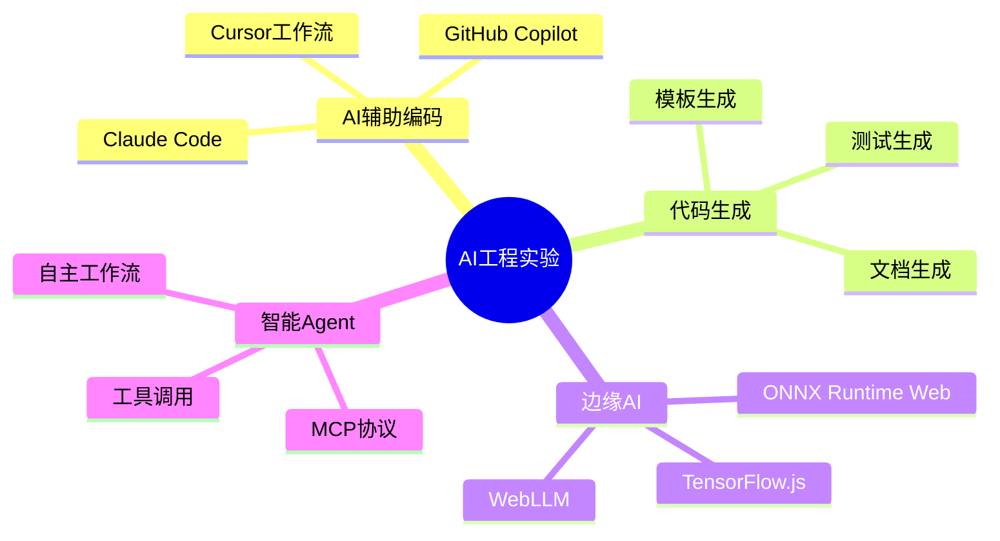

# AI 与前沿 (33, 55-56, 82, 94)

> AI 正在重塑软件开发的每一个环节。本实验室覆盖从 AI 辅助编码到智能 Agent 的完整技术栈，通过动手实验掌握 LLM 在工程实践中的应用。

## 技术全景



## 实验模块

| 编号 | 模块 | 实验数 | 核心内容 |
|------|------|--------|----------|
| **55** | ai-testing | 6 | AI 驱动的测试生成与优化 |
| **56** | code-generation | 5 | 基于 LLM 的代码生成工作流 |
| **82** | edge-ai | 9 | 浏览器端 AI 推理与优化 |
| **33** | ai-integration | 1 | AI SDK 集成基础 |
| **94** | ai-agent-lab | 3 | 智能 Agent 架构与实现 |

## 关键实验

### AI 辅助编码工作流

```typescript
// 实验：构建 AI 辅助代码审查工具
import OpenAI from 'openai';

const openai = new OpenAI(&#123; apiKey: process.env.OPENAI_API_KEY &#125;);

async function reviewCode(code: string): Promise&lt;string&gt; &#123;
  const response = await openai.chat.completions.create(&#123;
    model: 'gpt-4',
    messages: [
      &#123;
        role: 'system',
        content: '你是一位资深代码审查专家。请审查以下代码，指出潜在问题、安全风险和优化建议。'
      &#125;,
      &#123; role: 'user', content: code &#125;
    ],
  &#125;);
  return response.choices[0].message.content ?? '';
&#125;
```

### 边缘 AI 推理

```typescript
// 实验：浏览器端图像分类
import * as ort from 'onnxruntime-web';

async function classifyImage(imageData: ImageData) &#123;
  const session = await ort.InferenceSession.create('/model.onnx');
  const tensor = new ort.Tensor('float32', preprocess(imageData), [1, 3, 224, 224]);
  const results = await session.run(&#123; input: tensor &#125;);
  return postprocess(results);
&#125;
```

### MCP 工具集成

```typescript
// 实验：构建 MCP 工具服务器
import &#123; Server &#125; from '@modelcontextprotocol/sdk/server/index.js';

const server = new Server(&#123;
  name: 'weather-server',
  version: '1.0.0',
&#125;, &#123;
  capabilities: &#123; tools: &#123;&#125; &#125;
&#125;);

server.setRequestHandler(ListToolsRequestSchema, async () => &#123;
  return &#123;
    tools: [&#123;
      name: 'get_weather',
      description: '获取指定城市的天气',
      inputSchema: &#123;
        type: 'object',
        properties: &#123; city: &#123; type: 'string' &#125; &#125;,
        required: ['city'],
      &#125;,
    &#125;]
  &#125;;
&#125;);
```

## AI 工程化挑战

| 挑战 | 描述 | 解决方案 |
|------|------|----------|
| 上下文窗口限制 | LLM 有 token 上限 | RAG、滑动窗口、摘要 |
| 幻觉问题 | 生成虚假代码或信息 | 单元测试验证、人类审查 |
| 延迟敏感 | 实时应用需要低延迟 | 边缘推理、流式响应 |
| 成本控制 | API 调用费用累积 | 缓存、本地模型、批处理 |
| 安全合规 | 代码泄露给第三方 | 本地部署、数据脱敏 |

## LLM 选型参考

| 场景 | 推荐模型 | 上下文 | 特点 |
|------|----------|--------|------|
| 代码补全 | Claude 3.5 Sonnet, GPT-4o | 200K | 理解力强 |
| 代码审查 | Claude 3.5 Sonnet | 200K | 分析细致 |
| 边缘推理 | Llama 3.1 8B, Gemma 2B | 8K | 本地运行 |
| 测试生成 | GPT-4o-mini | 128K | 成本低 |
| Agent 推理 | Claude 3 Opus, GPT-4o | 200K | 推理能力强 |

## 参考资源

- [AI Agent 示例](/examples/ai-agent/) — Agent 架构与 MCP 集成实战
- [AI/ML 推理示例](/examples/ai-ml-inference/) — ONNX Runtime Web 浏览器端推理
- [AI 编码工作流](/ai-coding-workflow/) — Cursor、Copilot、Claude Code 深度指南
- [AI SDK 指南](/guide/ai-sdk-guide) — Vercel AI SDK 与 Mastra 开发

---

 [← 返回代码实验室首页](./)
