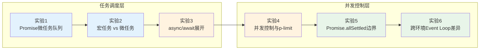
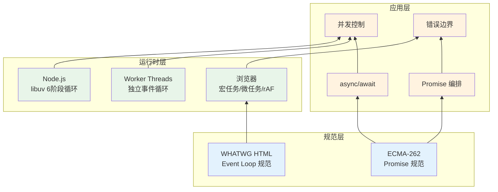

# 异步与并发实验室：Event Loop、Promise、Async/Await的微观实验

> **实验场宣言**：JavaScript 的异步模型不是「回调的语法糖」，而是**基于事件循环（Event Loop）的任务调度系统**，其核心由宏任务队列（Macrotask Queue）、微任务队列（Microtask Queue）和渲染管线（Rendering Pipeline）三者协同构成。本实验室通过可控的微观实验，将 WHATWG HTML 规范中的事件循环算法映射为可观测、可复现的时序行为。

---

## 实验室导航图



| 实验编号 | 主题 | 核心规范引用 | 难度 |
|----------|------|--------------|------|
| 实验 1 | Promise 微任务队列的微观观测 | ECMA-262 §27.2, WHATWG §8.1.4.2 | ⭐⭐⭐ |
| 实验 2 | 宏任务 vs 微任务的时序博弈 | WHATWG §8.1.4.1, §8.1.4.2 | ⭐⭐⭐⭐ |
| 实验 3 | async/await 的语法糖展开 | ECMA-262 §15.8.4, §27.2 | ⭐⭐⭐ |
| 实验 4 | 并发控制与 p-limit 原理 | WHATWG §8.1.4, Node.js Worker Threads | ⭐⭐⭐⭐ |
| 实验 5 | Promise.allSettled 的错误边界 | ECMA-262 §27.2.4.2 | ⭐⭐⭐ |
| 实验 6 | Event Loop 的跨环境差异 | WHATWG §8.1.4, Node.js Event Loop | ⭐⭐⭐⭐ |

---

## 实验 1：Promise 微任务队列的微观观测

### 理论背景

ECMA-262 §27.2 定义了 Promise 的规范语义。Promise 的解决（resolution）和拒绝（rejection）操作通过 **HostEnqueuePromiseJob** 将回调放入微任务队列。微任务队列的核心特性是：**在当前宏任务完成后、下一个宏任务开始前，引擎会排空整个微任务队列**。

这意味着 `Promise.then` 回调的触发时机不是「立即」，而是「当前同步代码执行完毕后的最早时机」。这一语义细节对于理解 `Promise` 的时序行为至关重要。

### 实验代码

```javascript
// === 阶段 A：Promise 解决的时序基础 ===
console.log('A: script start');

const p1 = new Promise((resolve) => {
  console.log('B: executor runs synchronously');
  resolve('resolved value');
});

p1.then((value) => {
  console.log('E: then callback:', value);
});

console.log('C: script end');

// 预期执行顺序：A → B → C → E

// === 阶段 B：链式调用的微任务排队 ===
Promise.resolve(1)
  .then(v => { console.log('chain 1:', v); return v + 1; })
  .then(v => { console.log('chain 2:', v); return v + 1; })
  .then(v => { console.log('chain 3:', v); });

console.log('D: after chain setup');

// === 阶段 C：Promise 内部的微任务 vs 同步解决 ===
const p2 = Promise.resolve('immediate');
p2.then(v => console.log('F:', v));
console.log('G: after immediate resolve');

// === 阶段 D：嵌套 Promise 的微任务层级 ===
Promise.resolve()
  .then(() => {
    console.log('H: outer then');
    return Promise.resolve()
      .then(() => console.log('I: inner then'));
  })
  .then(() => console.log('J: after nested'));

// === 阶段 E：Promise 构造函数中的异常 ===
const p3 = new Promise(() => {
  throw new Error('constructor error');
});
p3.catch(e => console.log('K:', e.message));

// === 阶段 F：同时添加多个 then ===
const p4 = Promise.resolve('shared');
p4.then(v => console.log('L1:', v));
p4.then(v => console.log('L2:', v));
p4.then(v => console.log('L3:', v));
// 所有 then 回调按注册顺序在微任务队列中执行
```

### 预期结果

```
A: script start
B: executor runs synchronously
C: script end
D: after chain setup
G: after immediate resolve
E: then callback: resolved value
chain 1: 1
chain 2: 2
chain 3: 3
F: immediate
H: outer then
L1: shared
L2: shared
L3: shared
I: inner then
J: after nested
K: constructor error
```

### 变体探索

**变体 1-1**：`Promise.resolve(thenable)` 对 thenable 的展开

```javascript
const thenable = {
  then(resolve, reject) {
    console.log('thenable called');
    resolve(42);
  }
};

Promise.resolve(thenable).then(v => console.log('thenable result:', v));
// thenable called
// thenable result: 42
// 注意：thenable 的 then 方法被同步调用，但结果仍通过微任务传递
```

**变体 1-2**：`Promise.prototype.finally` 的语义保证

```javascript
Promise.resolve('ok')
  .finally(() => console.log('finally runs'))
  .then(v => console.log('value preserved:', v)); // 'ok'

Promise.reject('error')
  .finally(() => console.log('finally on reject'))
  .catch(e => console.log('error preserved:', e)); // 'error'

// finally 不会修改 Promise 的值或原因，除非抛出异常
```

---

## 实验 2：宏任务 vs 微任务的时序博弈

### 理论背景

WHATWG HTML 规范 §8.1.4 定义了浏览器事件循环的完整算法。一个事件循环迭代（event loop iteration）包含以下步骤：

1. 从宏任务队列中取出最老的任务并执行
2. 执行所有可用的微任务（直到微任务队列为空）
3. 执行渲染步骤（如有必要）

宏任务来源包括：`setTimeout`/`setInterval`、I/O 回调、`setImmediate`（Node.js）、UI 事件等。微任务来源包括：`Promise.then`、`MutationObserver`、`queueMicrotask`。

这一差异导致了经典的面试题模式：理解 `setTimeout(..., 0)` 与 `Promise.resolve().then(...)` 的执行顺序。

### 实验代码

```javascript
// === 阶段 A：基础时序对比 ===
console.log('1: script start');

setTimeout(() => console.log('2: setTimeout 0'), 0);

Promise.resolve().then(() => console.log('3: promise microtask'));

console.log('4: script end');

// 预期：1 → 4 → 3 → 2

// === 阶段 B：多层嵌套的宏任务与微任务 ===
setTimeout(() => {
  console.log('A: timeout 1');
  Promise.resolve().then(() => console.log('B: microtask inside timeout'));
}, 0);

setTimeout(() => {
  console.log('C: timeout 2');
}, 0);

Promise.resolve().then(() => {
  console.log('D: microtask 1');
  setTimeout(() => console.log('E: timeout inside microtask'), 0);
});

Promise.resolve().then(() => console.log('F: microtask 2'));

// === 阶段 C：queueMicrotask 的显式使用 ===
queueMicrotask(() => console.log('G: queueMicrotask'));
Promise.resolve().then(() => console.log('H: promise then'));

// queueMicrotask 和 Promise.then 共享同一个微任务队列

// === 阶段 D：微任务队列的排空语义 ===
let counter = 0;

function drainDemo() {
  if (counter < 3) {
    counter++;
    console.log(`I${counter}: microtask iteration`);
    Promise.resolve().then(drainDemo); // 递归添加微任务
  }
}

Promise.resolve().then(drainDemo);
console.log('J: after drain setup');

// 所有微任务（包括递归添加的）会在当前阶段排空

// === 阶段 E：setTimeout 的最小延迟约束 ===
setTimeout(() => console.log('K: timeout with 0'), 0);
setTimeout(() => console.log('L: timeout with 1'), 1);

// HTML5 规范要求最小延迟为 4ms（嵌套层级超过 5 时）
// 但在大多数现代浏览器中，0ms 和 1ms 实际延迟差异极小

// === 阶段 F：requestAnimationFrame 与任务队列的关系 ===
// 在浏览器环境中：
// requestAnimationFrame(() => console.log('rAF'));
// setTimeout(() => console.log('timeout'), 0);
// Promise.resolve().then(() => console.log('promise'));
// 执行顺序：promise → rAF（在渲染阶段之前）→ timeout
```

### 预期结果

```
1: script start
4: script end
3: promise microtask
G: queueMicrotask
H: promise then
D: microtask 1
F: microtask 2
J: after drain setup
I1: microtask iteration
I2: microtask iteration
I3: microtask iteration
A: timeout 1
B: microtask inside timeout
C: timeout 2
K: timeout with 0
L: timeout with 1
E: timeout inside microtask
```

### 变体探索

**变体 2-1**：`setTimeout` 与 `setImmediate`（Node.js）

```javascript
// Node.js 环境下：
setTimeout(() => console.log('timeout'), 0);
setImmediate(() => console.log('immediate'));

// 若在主模块中：timeout 和 immediate 的顺序不确定
// 若在 I/O 回调中：immediate 总是先于 timeout
```

**变体 2-2**：微任务导致的 starvation 风险

```javascript
// 危险：递归微任务可阻塞渲染和 I/O
function starve() {
  Promise.resolve().then(() => {
    console.log('starving...');
    starve();
  });
}
// starve(); // 取消注释将导致事件循环被微任务完全占据

// 安全做法：将递归拆分为宏任务
function safeLoop() {
  console.log('safe iteration');
  setTimeout(safeLoop, 0); // 让出事件循环
}
```

---

## 实验 3：async/await 的语法糖展开

### 理论背景

ECMA-262 §15.8.4 将 `async function` 定义为返回 Promise 的函数，其内部通过 `[[AsyncFunctionBody]]` 语义进行执行。`await` 表达式的核心语义等价于：

```javascript
// await x 的语义近似：
Promise.resolve(x).then(resume);
```

其中 `resume` 是恢复异步函数执行的内部操作。这意味着：

1. `await` 总是创建至少一个微任务（即使操作数已是 resolved Promise）
2. `await` 会暂停当前异步函数的执行，但**不会阻塞事件循环**
3. 多个连续的 `await` 语句是串行执行的

### 实验代码

```javascript
// === 阶段 A：async 函数的基本展开 ===
async function basicAsync() {
  console.log('A: inside async, before await');
  const result = await Promise.resolve(42);
  console.log('B: after await:', result);
  return result * 2;
}

console.log('C: before call');
basicAsync().then(v => console.log('D: resolved:', v));
console.log('E: after call');

// 语义展开（概念上）：
// function basicAsyncExpanded() {
//   return new Promise((resolve) => {
//     console.log('A: inside async, before await');
//     Promise.resolve(42).then(result => {
//       console.log('B: after await:', result);
//       resolve(result * 2);
//     });
//   });
// }

// === 阶段 B：await 同步值的微任务开销 ===
async function awaitSync() {
  console.log('1');
  await 1; // 即使不是 Promise，也会创建一个微任务
  console.log('2');
  await 2;
  console.log('3');
}

awaitSync();
console.log('4');

// 输出：1 → 4 → 2 → 3
// await 1 暂停执行，打印 4，然后微任务恢复执行打印 2

// === 阶段 C：并行 await 与串行 await 的差异 ===
async function sequentialAwait() {
  const start = Date.now();
  const a = await new Promise(r => setTimeout(() => r(1), 100));
  const b = await new Promise(r => setTimeout(() => r(2), 100));
  const c = await new Promise(r => setTimeout(() => r(3), 100));
  console.log('sequential:', Date.now() - start, 'ms'); // ~300ms
  return a + b + c;
}

async function parallelAwait() {
  const start = Date.now();
  const [a, b, c] = await Promise.all([
    new Promise(r => setTimeout(() => r(1), 100)),
    new Promise(r => setTimeout(() => r(2), 100)),
    new Promise(r => setTimeout(() => r(3), 100))
  ]);
  console.log('parallel:', Date.now() - start, 'ms'); // ~100ms
  return a + b + c;
}

sequentialAwait();
parallelAwait();

// === 阶段 D：try/catch 与 async/await 的错误处理 ===
async function errorHandling() {
  try {
    const result = await Promise.reject(new Error('async error'));
    console.log('never reached:', result);
  } catch (e) {
    console.log('caught:', e.message);
    return 'recovered';
  }
}

errorHandling().then(v => console.log('F:', v));

// === 阶段 E：async 函数中的同步异常 ===
async function syncException() {
  console.log('G: before throw');
  throw new Error('sync throw');
  console.log('H: never reached');
}

syncException().catch(e => console.log('I:', e.message));

// === 阶段 F：顶层 await 的模块语义（ES2022）===
// 在 ES Module 中：
// const data = await fetch('/api/data'); // 模块导出等待此 Promise 解决
// export { data };
// 模块本身被视为一个异步上下文
```

### 预期结果

```
C: before call
A: inside async, before await
E: after call
B: after await: 42
D: resolved: 84
1
4
2
3
caught: async error
F: recovered
G: before throw
I: sync throw
（约 300ms 后）sequential: ~300 ms
（约 100ms 后）parallel: ~100 ms
```

### 变体探索

**变体 3-1**：`for await...of` 的异步迭代语义

```javascript
async function* asyncGenerator() {
  yield await Promise.resolve(1);
  yield await Promise.resolve(2);
  yield await Promise.resolve(3);
}

(async () => {
  for await (const value of asyncGenerator()) {
    console.log('for await:', value);
  }
})();
// for await: 1
// for await: 2
// for await: 3
```

**变体 3-2**：`Promise.all` 与 `async` 函数结合的错误处理陷阱

```javascript
async function riskyTask(id) {
  if (id === 2) throw new Error(`task ${id} failed`);
  return `task ${id} result`;
}

async function allOrNothing() {
  try {
    const results = await Promise.all([
      riskyTask(1),
      riskyTask(2),
      riskyTask(3)
    ]);
    console.log(results);
  } catch (e) {
    console.log('all failed:', e.message);
    // task 1 和 task 3 的成功结果丢失！
  }
}

allOrNothing();
```

---

## 实验 4：并发控制与 p-limit 原理

### 理论背景

JavaScript 的单线程事件循环模型并不意味着无法处理并发。实际上，JavaScript 的并发体现在**宏观层面的任务交错执行**（通过异步 I/O）和**微观层面的 Promise 编排**。当需要限制同时进行的异步操作数量（例如控制对 API 的并发请求）时，需要显式的并发控制机制。

`p-limit` 是一个经典的并发限制模式，其核心是一个信号量（Semaphore）：维护一个运行中的任务计数器和一个等待队列，当运行任务数达到上限时，新任务进入队列等待。

### 实验代码

```javascript
// === 阶段 A：手写 p-limit 的核心逻辑 ===
function pLimit(concurrency) {
  const queue = [];
  let activeCount = 0;

  const next = () => {
    activeCount--;
    if (queue.length > 0) {
      queue.shift()();
    }
  };

  const run = async (fn, resolve, args) => {
    activeCount++;
    const result = (async () => fn(...args))();
    resolve(result);
    try {
      await result;
    } catch {}
    next();
  };

  const enqueue = (fn, resolve, args) => {
    queue.push(run.bind(null, fn, resolve, args));
    (async () => {
      await Promise.resolve();
      if (activeCount < concurrency && queue.length > 0) {
        queue.shift()();
      }
    })();
  };

  return (fn, ...args) =>
    new Promise(resolve => {
      enqueue(fn, resolve, args);
    });
}

// === 阶段 B：并发限制的实际验证 ===
const limit = pLimit(2);

async function delayedTask(id, delay) {
  console.log(`[${new Date().toISOString().slice(11,19)}] Task ${id} started`);
  await new Promise(r => setTimeout(r, delay));
  console.log(`[${new Date().toISOString().slice(11,19)}] Task ${id} completed`);
  return `result-${id}`;
}

(async () => {
  const tasks = [
    limit(delayedTask, 1, 300),
    limit(delayedTask, 2, 100),
    limit(delayedTask, 3, 200),
    limit(delayedTask, 4, 150),
    limit(delayedTask, 5, 100)
  ];

  const results = await Promise.all(tasks);
  console.log('All results:', results);
})();

// === 阶段 C：无限制并发 vs 有限制并发的对比 ===
async function unboundedFetch(urls) {
  const start = Date.now();
  const results = await Promise.all(
    urls.map(url => fetch(url).then(r => r.json()))
  );
  console.log('Unbounded:', Date.now() - start, 'ms');
  return results;
}

async function boundedFetch(urls, concurrency) {
  const limit = pLimit(concurrency);
  const start = Date.now();
  const results = await Promise.all(
    urls.map(url => limit(() => fetch(url).then(r => r.json())))
  );
  console.log('Bounded:', Date.now() - start, 'ms');
  return results;
}

// === 阶段 D：并发控制中的错误传播 ===
const errorLimit = pLimit(2);

async function flakyTask(id) {
  if (id === 2) throw new Error(`Task ${id} crashed`);
  return `Task ${id} OK`;
}

(async () => {
  const tasks = [1, 2, 3, 4].map(id =>
    errorLimit(flakyTask, id).catch(e => `Error: ${e.message}`)
  );
  const results = await Promise.all(tasks);
  console.log('Error results:', results);
  // 错误被捕获，不影响其他任务的并发执行
})();

// === 阶段 E：基于 AbortController 的可取消任务 ===
async function cancellableTask(signal, id, delay) {
  return new Promise((resolve, reject) => {
    const timeout = setTimeout(() => {
      console.log(`Task ${id} completed`);
      resolve(`result-${id}`);
    }, delay);

    signal.addEventListener('abort', () => {
      clearTimeout(timeout);
      reject(new Error(`Task ${id} aborted`));
    });
  });
}

const controller = new AbortController();
const cancelLimit = pLimit(2);

// 启动任务
const cancelTasks = [1, 2, 3].map(id =>
  cancelLimit(cancellableTask, controller.signal, id, 500)
    .catch(e => e.message)
);

// 100ms 后取消所有任务
setTimeout(() => controller.abort(), 100);

Promise.all(cancelTasks).then(results => {
  console.log('Cancel results:', results);
});

// === 阶段 F：背压（Backpressure）模式 ===
async function* backpressureProducer(limit) {
  let count = 0;
  while (count < 10) {
    if (count < limit) {
      yield count++;
    } else {
      await new Promise(r => setTimeout(r, 50));
    }
  }
}

(async () => {
  for await (const item of backpressureProducer(3)) {
    console.log('Processing:', item);
    await new Promise(r => setTimeout(r, 100)); // 模拟处理
  }
})();
```

### 预期结果

```
[HH:MM:SS] Task 1 started
[HH:MM:SS] Task 2 started
[HH:MM:SS] Task 2 completed
[HH:MM:SS] Task 3 started
[HH:MM:SS] Task 1 completed
[HH:MM:SS] Task 4 started
[HH:MM:SS] Task 3 completed
[HH:MM:SS] Task 5 started
[HH:MM:SS] Task 4 completed
[HH:MM:SS] Task 5 completed
All results: ['result-1', 'result-2', 'result-3', 'result-4', 'result-5']

Error results: ['Task 1 OK', 'Error: Task 2 crashed', 'Task 3 OK', 'Task 4 OK']

（100ms 后）
Cancel results: ['Error: Task 1 aborted', 'Error: Task 2 aborted', 'Error: Task 3 aborted']

Processing: 0
Processing: 1
Processing: 2
...
```

### 变体探索

**变体 4-1**：基于 Worker Pool 的 CPU 密集型任务并发

```javascript
// 在 Node.js 中：
const { Worker, isMainThread, parentPort, workerData } = require('worker_threads');

function createWorkerPool(size, workerScript) {
  const workers = Array.from({ length: size }, () => new Worker(workerScript));
  let index = 0;

  return {
    execute(data) {
      const worker = workers[index++ % size];
      return new Promise((resolve, reject) => {
        worker.once('message', resolve);
        worker.once('error', reject);
        worker.postMessage(data);
      });
    },
    terminate() {
      workers.forEach(w => w.terminate());
    }
  };
}
```

**变体 4-2**：RxJS 中的并发控制操作符

```javascript
import { from, mergeMap } from 'rxjs';

const urls = ['url1', 'url2', 'url3', 'url4'];

from(urls).pipe(
  mergeMap(
    url => fetch(url),
    2 // 最大并发数：2
  )
).subscribe(response => console.log(response));
```

---

## 实验 5：Promise.allSettled 的错误边界

### 理论背景

ECMA-262 §27.2.4.2 定义了 `Promise.allSettled`，它等待所有输入 Promise 完成（无论 fulfilled 或 rejected），返回一个描述每个 Promise 结果的数组。与 `Promise.all` 的「快速失败」语义不同，`allSettled` 提供了**完整的错误边界**。

在工程实践中，`allSettled` 是构建健壮异步管道的关键工具：它确保即使部分任务失败，其他任务的结果仍被保留，便于实现部分成功/部分失败的处理策略。

### 实验代码

```javascript
// === 阶段 A：allSettled 与 all 的语义对比 ===
const mixedPromises = [
  Promise.resolve('success 1'),
  Promise.reject(new Error('failure 1')),
  Promise.resolve('success 2'),
  Promise.reject(new Error('failure 2'))
];

Promise.all(mixedPromises)
  .then(results => console.log('all:', results))
  .catch(e => console.log('all error:', e.message));
// 输出: all error: failure 1（第一个失败即终止，丢失后续结果）

Promise.allSettled(mixedPromises)
  .then(results => console.log('allSettled:', results));
// 输出完整结果数组，包含成功和失败

// === 阶段 B：结果解析与分区 ===
Promise.allSettled(mixedPromises).then(results => {
  const fulfilled = results
    .filter(r => r.status === 'fulfilled')
    .map(r => r.value);

  const rejected = results
    .filter(r => r.status === 'rejected')
    .map(r => r.reason.message);

  console.log('Fulfilled:', fulfilled);
  console.log('Rejected:', rejected);
});

// === 阶段 C：部分重试模式 ===
async function fetchWithRetry(urls, retries = 3) {
  let currentUrls = urls;

  for (let attempt = 1; attempt <= retries; attempt++) {
    const results = await Promise.allSettled(
      currentUrls.map(url => fetch(url).then(r => r.json()))
    );

    const successful = results
      .filter(r => r.status === 'fulfilled')
      .map(r => r.value);

    const failedUrls = results
      .map((r, i) => ({ result: r, url: currentUrls[i] }))
      .filter(item => item.result.status === 'rejected')
      .map(item => item.url);

    console.log(`Attempt ${attempt}: ${successful.length} success, ${failedUrls.length} failed`);

    if (failedUrls.length === 0) return successful;
    currentUrls = failedUrls;

    if (attempt < retries) {
      await new Promise(r => setTimeout(r, 1000 * attempt)); // 指数退避
    }
  }

  throw new Error(`Failed after ${retries} retries`);
}

// === 阶段 D：带超时的 allSettled ===
function withTimeout(promise, ms, label) {
  const timeout = new Promise((_, reject) =>
    setTimeout(() => reject(new Error(`${label} timed out after ${ms}ms`)), ms)
  );
  return Promise.race([promise, timeout]);
}

const tasks = [
  withTimeout(new Promise(r => setTimeout(() => r('slow'), 2000)), 1000, 'slow'),
  Promise.resolve('fast'),
  Promise.reject(new Error('immediate fail'))
];

Promise.allSettled(tasks).then(results => {
  console.log('With timeout results:');
  results.forEach((r, i) => {
    console.log(`  Task ${i}:`, r.status === 'fulfilled' ? r.value : r.reason.message);
  });
});

// === 阶段 E：allSettled 与类型安全（TypeScript）===
// type SettledResult<T> =
//   | { status: 'fulfilled'; value: T }
//   | { status: 'rejected'; reason: unknown };
//
// async function typedAllSettled<T>(promises: Promise<T>[]): Promise<SettledResult<T>[]> {
//   return Promise.allSettled(promises);
// }

// === 阶段 F：优雅降级模式 ===
async function gracefulDegradation(primaryTasks, fallbackTasks) {
  const primaryResults = await Promise.allSettled(primaryTasks);

  const needsFallback = primaryResults
    .map((r, i) => ({ result: r, index: i }))
    .filter(item => item.result.status === 'rejected');

  if (needsFallback.length === 0) {
    return primaryResults.map(r => r.value);
  }

  console.log(`${needsFallback.length} primary tasks failed, running fallbacks...`);

  const fallbackResults = await Promise.allSettled(
    needsFallback.map(item => fallbackTasks[item.index])
  );

  return primaryResults.map((r, i) => {
    if (r.status === 'fulfilled') return r.value;
    const fallbackIndex = needsFallback.findIndex(n => n.index === i);
    const fallback = fallbackResults[fallbackIndex];
    return fallback.status === 'fulfilled' ? fallback.value : null;
  });
}
```

### 预期结果

```
all error: failure 1
allSettled: [
  { status: 'fulfilled', value: 'success 1' },
  { status: 'rejected', reason: Error: failure 1 },
  { status: 'fulfilled', value: 'success 2' },
  { status: 'rejected', reason: Error: failure 2 }
]
Fulfilled: ['success 1', 'success 2']
Rejected: ['failure 1', 'failure 2']

With timeout results:
  Task 0: slow timed out after 1000ms
  Task 1: fast
  Task 2: immediate fail
```

### 变体探索

**变体 5-1**：`Promise.any` 的「首个成功」语义

```javascript
const racers = [
  new Promise((_, reject) => setTimeout(reject, 100, new Error('A'))),
  new Promise(resolve => setTimeout(resolve, 200, 'B')),
  new Promise(resolve => setTimeout(resolve, 300, 'C'))
];

Promise.any(racers)
  .then(winner => console.log('First success:', winner)) // 'B'
  .catch(e => console.log('All failed:', e.errors));
```

**变体 5-2**：自定义的 `allSettled` 实现（兼容旧环境）

```javascript
function allSettledPolyfill(promises) {
  return Promise.all(
    promises.map(p =>
      Promise.resolve(p).then(
        value => ({ status: 'fulfilled', value }),
        reason => ({ status: 'rejected', reason })
      )
    )
  );
}
```

---

## 实验 6：Event Loop 的跨环境差异

### 理论背景

虽然 WHATWG 规范定义了浏览器事件循环的标准算法，但 Node.js 的 `libuv` 实现了略有不同的模型。Node.js 的事件循环分为 6 个阶段：

1. **timers**：执行 `setTimeout`/`setInterval` 回调
2. **pending callbacks**：执行系统操作的回调（如 TCP 错误）
3. **idle/prepare**：内部使用
4. **poll**：检索新的 I/O 事件；执行 I/O 回调
5. **check**：执行 `setImmediate` 回调
6. **close callbacks**：执行 `close` 事件回调

Node.js 的微任务队列在**每个阶段之间**都会清空，而不仅仅是每个宏任务之后。这导致了浏览器与 Node.js 在特定时序上的差异。

### 实验代码

```javascript
// === 阶段 A：浏览器 vs Node.js 的 timer 行为 ===
// 浏览器环境：
setTimeout(() => console.log('timeout'), 0);
Promise.resolve().then(() => console.log('microtask'));
// 输出: microtask → timeout

// Node.js 环境：
// 若直接在主模块执行，timeout 和 check 阶段的顺序可能不同

// === 阶段 B：Node.js process.nextTick 的特殊性 ===
// Node.js 独有：
// process.nextTick(() => console.log('nextTick'));
// Promise.resolve().then(() => console.log('promise'));
// setTimeout(() => console.log('timeout'), 0);
// 输出: nextTick → promise → timeout
// nextTick 的优先级高于所有微任务，且可 starve 事件循环

// === 阶段 C：I/O 回调中的 setImmediate vs setTimeout ===
const fs = require('fs');

// Node.js 中：
fs.readFile(__filename, () => {
  setTimeout(() => console.log('timeout in I/O'), 0);
  setImmediate(() => console.log('immediate in I/O'));
  Promise.resolve().then(() => console.log('promise in I/O'));
});
// 在 I/O 回调中：promise → immediate → timeout

// === 阶段 D：MutationObserver 的微任务语义（浏览器）===
// 浏览器环境：
// const observer = new MutationObserver(() => {
//   console.log('MutationObserver');
// });
// const node = document.createTextNode('');
// observer.observe(node, { characterData: true });
// node.data = 'changed';
// Promise.resolve().then(() => console.log('promise'));
// 输出: promise → MutationObserver（按注册顺序）

// === 阶段 E：跨环境统一调度器 ===
function createScheduler() {
  const queue = [];
  let scheduled = false;

  function flush() {
    scheduled = false;
    for (const task of queue.splice(0)) {
      task();
    }
  }

  function schedule(task) {
    queue.push(task);
    if (!scheduled) {
      scheduled = true;
      if (typeof queueMicrotask === 'function') {
        queueMicrotask(flush);
      } else if (typeof process !== 'undefined' && process.nextTick) {
        process.nextTick(flush);
      } else {
        setTimeout(flush, 0);
      }
    }
  }

  return { schedule };
}

const scheduler = createScheduler();
scheduler.schedule(() => console.log('scheduled A'));
scheduler.schedule(() => console.log('scheduled B'));
console.log('sync end');
// sync end → scheduled A → scheduled B

// === 阶段 F：Worker 线程的事件循环独立性 ===
// 在浏览器中：
// const worker = new Worker('worker.js');
// worker.postMessage('start');
// console.log('main thread');
// // main thread 和 worker 有各自独立的事件循环

// 在 Node.js 中：
// const { Worker } = require('worker_threads');
// const worker = new Worker(`
//   const { parentPort } = require('worker_threads');
//   parentPort.once('message', () => {
//     console.log('worker thread');
//   });
// `, { eval: true });
// worker.postMessage('start');
// console.log('main thread');
```

### 预期结果

```
（浏览器环境）
microtask
timeout

（Node.js 主模块）
（顺序可能不同）

（Node.js I/O 回调中）
promise in I/O
immediate in I/O
timeout in I/O

（跨环境调度器）
sync end
scheduled A
scheduled B
```

### 变体探索

**变体 6-1**：`Atomics.wait` 与 `Atomics.notify` 的同步阻塞

```javascript
// SharedArrayBuffer 场景中的同步原语
const buffer = new SharedArrayBuffer(4);
const view = new Int32Array(buffer);

// 在 Worker 中：
// Atomics.wait(view, 0, 0); // 阻塞直到索引 0 的值不再是 0

// 在主线程中：
// Atomics.store(view, 0, 1);
// Atomics.notify(view, 0, 1); // 唤醒等待的 Worker
```

**变体 6-2**：`MessageChannel` 的零延迟任务排队

```javascript
const { port1, port2 } = new MessageChannel();
port1.onmessage = () => console.log('MessageChannel');
port2.postMessage(null);
Promise.resolve().then(() => console.log('Promise'));
// 在大多数浏览器中：Promise → MessageChannel
// MessageChannel 常用于需要比 setTimeout(fn, 0) 更快触发的场景
```

---

## 总结

本实验室通过 6 个微观实验，系统揭示了 JavaScript 异步执行模型的时序机制：

1. **Promise 微任务队列**：`Promise.then` 回调通过 `HostEnqueuePromiseJob` 进入微任务队列，在当前同步代码结束后立即执行。链式调用创建的是级联微任务，而非同步执行。

2. **宏任务 vs 微任务**：事件循环的每个迭代先执行一个宏任务，然后排空整个微任务队列。这一机制解释了为何 `setTimeout(..., 0)` 总是慢于 `Promise.resolve().then(...)`。

3. **async/await 展开**：`await` 表达式本质上是 `Promise.resolve(x).then(resume)` 的语法糖，它总是产生至少一个微任务，并暂停当前异步函数的执行而不阻塞事件循环。

4. **并发控制**：基于信号量的 `p-limit` 模式通过维护运行计数和等待队列，实现了对异步操作并发度的精确控制。结合 `AbortController` 可实现可取消的任务管道。

5. **Promise.allSettled**：提供了完整的错误边界，确保部分失败不会导致全部结果丢失。它是构建健壮异步管道（如部分重试、优雅降级）的核心工具。

6. **跨环境差异**：浏览器与 Node.js 在事件循环阶段划分上存在差异，尤其是 `process.nextTick` 的优先级和 `setImmediate` 的语义。理解这些差异对于编写跨平台异步代码至关重要。



---

## 参考文献与延伸阅读

1. **WHATWG HTML Living Standard** — *§8.1.4 Event loops*（<https://html.spec.whatwg.org/multipage/webappapis.html#event-loops）。浏览器事件循环的权威规范，详细定义了宏任务、微任务和渲染管线的交互算法。>

2. **ECMA-262, 15th Edition** — *§27.2 Promise Objects*。Promise 的完整规范语义，包括 `Promise.all`、`Promise.race`、`Promise.allSettled` 和 `Promise.any` 的形式化定义。

3. **Node.js Documentation** — *The Node.js Event Loop, Timers, and `process.nextTick()`*（<https://nodejs.org/en/docs/guides/event-loop-timers-and-nexttick/）。Node.js> 官方对 `libuv` 事件循环 6 个阶段的详细解释，是理解 Node.js 异步行为差异的必读文档。

4. **Jake Archibald** — *Tasks, microtasks, queues and schedules*（<https://jakearchibald.com/2015/tasks-microtasks-queues-and-schedules/）。Google> Chrome 工程师撰写的关于浏览器事件循环时序的经典文章，包含大量交互式可视化示例。

5. **Sindre Sorhus** — *p-limit*（<https://github.com/sindresorhus/p-limit）。并发限制模式的高质量开源实现，其源码是理解信号量模式在> JavaScript 中应用的优秀参考。

---

*最后更新: 2026-05-01 | 分类: code-lab | 规范版本: ECMA-262 15th Edition, WHATWG HTML Living Standard*
