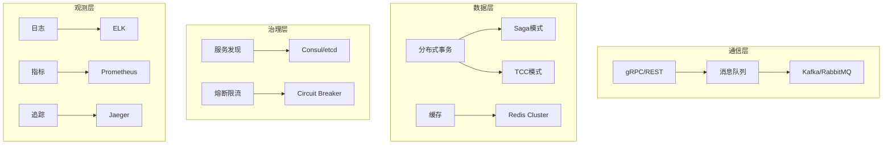

# 分布式与企业 (59, 61-75)

> 本实验室覆盖企业级应用开发的核心挑战：分布式系统架构、数据一致性、服务治理和可观测性。通过动手实验，掌握构建可靠大规模系统的关键技术。

## 技术栈全景



## 实验模块

| 编号 | 模块 | 实验数 | 核心内容 |
|------|------|--------|----------|
| **59** | distributed-systems | 5 | CAP定理、一致性协议 |
| **61** | microservices | 6 | 服务拆分、通信、治理 |
| **62** | message-queue | 4 | Kafka、RabbitMQ 实践 |
| **63** | distributed-transaction | 3 | Saga、TCC、2PC |
| **64** | caching | 4 | Redis、缓存策略 |
| **65** | observability | 5 | 日志、指标、追踪 |
| **66** | security | 4 | OAuth、JWT、mTLS |
| **67** | ci-cd | 5 | 流水线、GitOps |
| **68** | container-orchestration | 4 | Docker、K8s |
| **69** | service-mesh | 3 | Istio、Envoy |
| **70** | data-pipeline | 3 | ETL、流处理 |
| **71** | graphql-enterprise | 3 | 联邦网关、权限 |
| **72** | realtime-systems | 3 | WebSocket、SSE |
| **73** | fullstack-frameworks | 4 | Next.js、Remix |
| **74** | serverless | 3 | Lambda、Workers |
| **75** | edge-computing | 3 | CDN、边缘函数 |

## 核心实验

### Saga 分布式事务

```typescript
// 实验：实现 Saga 编排器
type SagaStep = &#123;
  name: string;
  execute: () => Promise&lt;void&gt;;
  compensate: () => Promise&lt;void&gt;;
&#125;;

class SagaOrchestrator &#123;
  private steps: SagaStep[] = [];
  private completed: SagaStep[] = [];

  addStep(step: SagaStep) &#123;
    this.steps.push(step);
  &#125;

  async execute() &#123;
    for (const step of this.steps) &#123;
      try &#123;
        await step.execute();
        this.completed.push(step);
      &#125; catch (error) &#123;
        // 执行补偿操作
        for (const completed of this.completed.reverse()) &#123;
          await completed.compensate();
        &#125;
        throw error;
      &#125;
    &#125;
  &#125;
&#125;

// 使用示例：订单创建 Saga
const saga = new SagaOrchestrator();
saga.addStep(&#123;
  name: 'create-order',
  execute: () => orderService.create(order),
  compensate: () => orderService.cancel(order.id),
&#125;);
saga.addStep(&#123;
  name: 'deduct-inventory',
  execute: () => inventoryService.deduct(items),
  compensate: () => inventoryService.restore(items),
&#125;);
saga.addStep(&#123;
  name: 'process-payment',
  execute: () => paymentService.charge(amount),
  compensate: () => paymentService.refund(amount),
&#125;);
```

### 熔断器模式

```typescript
// 实验：实现 Circuit Breaker
enum CircuitState &#123; CLOSED, OPEN, HALF_OPEN &#125;

class CircuitBreaker &#123;
  private state = CircuitState.CLOSED;
  private failures = 0;
  private lastFailureTime?: number;

  constructor(
    private threshold = 5,
    private timeout = 60000,
  ) &#123;&#125;

  async execute&lt;T&gt;(fn: () => Promise&lt;T&gt;): Promise&lt;T&gt; &#123;
    if (this.state === CircuitState.OPEN) &#123;
      if (Date.now() - (this.lastFailureTime ?? 0) &gt; this.timeout) &#123;
        this.state = CircuitState.HALF_OPEN;
      &#125; else &#123;
        throw new Error('Circuit is OPEN');
      &#125;
    &#125;

    try &#123;
      const result = await fn();
      this.onSuccess();
      return result;
    &#125; catch (error) &#123;
      this.onFailure();
      throw error;
    &#125;
  &#125;

  private onSuccess() &#123;
    this.failures = 0;
    this.state = CircuitState.CLOSED;
  &#125;

  private onFailure() &#123;
    this.failures++;
    this.lastFailureTime = Date.now();
    if (this.failures &gt;= this.threshold) &#123;
      this.state = CircuitState.OPEN;
    &#125;
  &#125;
&#125;
```

## 参考资源

- [微服务示例](/examples/microservices/) — gRPC、服务网格通信
- [DevOps 示例](/examples/devops/) — CI/CD 流水线设计
- [GraphQL 生产示例](/examples/graphql-production/) — 联邦网关架构

---

 [← 返回代码实验室首页](./)
