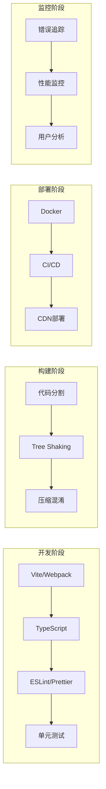

# 工程与生态 (10-39)

> 本实验室覆盖现代前端工程化的完整工具链。从代码构建到生产部署，从状态管理到性能监控，掌握构建可靠、可维护、高性能应用的工程技术。

## 工程化全景



## 实验模块

| 编号 | 模块 | 实验数 | 核心内容 |
|------|------|--------|----------|
| **10** | build-tools | 5 | Vite、Webpack、esbuild、Rollup |
| **11** | state-management | 5 | Redux、Zustand、Jotai、Signals |
| **12** | ui-frameworks | 5 | React、Vue、Svelte、Solid |
| **13** | styling | 4 | CSS-in-JS、Tailwind、CSS Modules |
| **14** | routing | 3 | React Router、Vue Router、文件路由 |
| **15** | form-handling | 3 | React Hook Form、Formik、Zod |
| **16** | data-fetching | 4 | TanStack Query、SWR、GraphQL |
| **17** | animation | 3 | Framer Motion、GSAP、CSS动画 |
| **18** | testing | 5 | Vitest、Playwright、Storybook |
| **19** | i18n | 3 | react-i18n、FormatJS、Lingui |
| **20-39** | ecosystem-deep-dive | 各3-5 | 各技术栈深度实验 |

## 核心实验

### 构建工具对比

```typescript
// 实验：配置 Vite 多页面应用
// vite.config.ts
import &#123; defineConfig &#125; from 'vite';
import react from '@vitejs/plugin-react';

export default defineConfig(&#123;
  plugins: [react()],
  build: &#123;
    rollupOptions: &#123;
      input: &#123;
        main: './index.html',
        admin: './admin.html',
      &#125;,
      output: &#123;
        manualChunks: &#123;
          vendor: ['react', 'react-dom'],
          ui: ['@radix-ui/react-dialog', '@radix-ui/react-select'],
        &#125;,
      &#125;,
    &#125;,
  &#125;,
&#125;);
```

### 状态管理演变

```typescript
// 实验：从 Redux 到 Signals

// Redux（样板代码多）
const counterReducer = (state = 0, action) => &#123;
  switch (action.type) &#123;
    case 'INCREMENT': return state + 1;
    default: return state;
  &#125;
&#125;;

// Zustand（简洁）
const useStore = create((set) => (&#123;
  count: 0,
  increment: () => set((s) => (&#123; count: s.count + 1 &#125;)),
&#125;));

// Signals（极致性能）
const count = signal(0);
const doubled = computed(() => count.value * 2);
// 仅订阅的组件会重新渲染
```

### 性能优化实验

```typescript
// 实验：React 渲染优化
import &#123; memo, useMemo, useCallback &#125; from 'react';

// 1. memo 避免不必要的重渲染
const ExpensiveComponent = memo(function ExpensiveComponent(&#123; data &#125;) &#123;
  return &lt;div&gt;&#123;heavyComputation(data)&#125;&lt;/div&gt;;
&#125;);

// 2. useMemo 缓存计算结果
const processedData = useMemo(() =>
  data.map(transform).filter(filter),
  [data]
);

// 3. useCallback 缓存函数引用
const handleClick = useCallback(() => &#123;
  onSelect(item.id);
&#125;, [item.id, onSelect]);
```

## 参考资源

- [前端模式示例](/examples/frontend-patterns/) — 组件组合与状态管理
- [性能示例](/examples/performance/) — Web Vitals 优化实战
- [测试示例](/examples/testing/) — Vitest 与 Playwright
- [状态管理专题](/state-management/) — 完整的状态管理知识体系

---

 [← 返回代码实验室首页](./)
