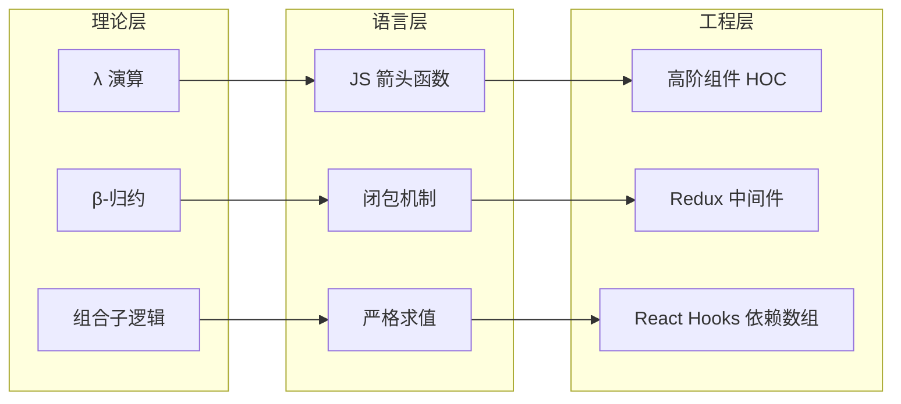

# Lambda 演算实验室：从理论到 JavaScript 工程实践

> **实验定位**：`20-code-lab → website/code-lab`
> **核心映射**：λ 演算 × TypeScript 箭头函数 × 高阶函数 × 闭包机制
> **预计时长**：90–120 分钟

---

## 引言

Lambda 演算（λ-calculus）由 Alonzo Church 于 1936 年提出，它仅用「变量、抽象、应用」三种构造就证明了通用计算的可能性。
这一发现不仅奠定了函数式编程的理论根基，也深刻影响了 JavaScript 的箭头函数、闭包、Promise 链乃至 async/await 的语义设计。

本实验室将 λ 演算的核心概念转化为 5 个可动手实验。
你将在 TypeScript 中亲手实现 Church 数值、布尔代数、递归组合子与抽象解释器，并观察这些「理论玩具」如何映射为现代 JS/TS 工程中无处不在的编程模式。

```mermaid
graph TD
    A[λ 演算三大构造<br/>变量 x | 抽象 λx.e | 应用 e e] --> B[Church 编码]
    A --> C[β-归约]
    B --> D[TypeScript 高阶函数]
    C --> E[函数调用与代换]
    D --> F[闭包与作用域捕获]
    E --> F
    F --> G[Y/Z 组合子递归]
    G --> H[JS 箭头函数与回调]
```

---

## 前置知识

在开始实验前，请确保你已掌握以下基础：

1. **TypeScript 基础类型与泛型**：能阅读 `&#40;x: T&#41; => T` 形式的类型签名。
2. **高阶函数概念**：函数作为参数或返回值（如 `Array.prototype.map`）。
3. **Node.js 运行环境**：实验代码可直接在 Node.js 20+ 或浏览器 DevTools 中执行。
4. **栈与堆的直觉**：理解「调用栈」与「堆分配」的区别，这对实验 3 的严格求值问题至关重要。

> **环境检查**：打开终端，执行 `node --version`，确认版本 ≥ 18.0。实验中的 `.ts` 文件建议使用 `tsx` 或 `deno` 直接运行，也可粘贴至 [TypeScript Playground](https://www.typescriptlang.org/play) 验证。

---

## 实验 1：Church 编码——用函数表示一切数据

### 理论背景

在 λ 演算中，没有数字、布尔值、列表等原生数据类型。
所有数据都必须用纯函数「编码」出来。Church 编码（Church Encoding）是最经典的方案：

- **Church 数值**：数值 `n` 被表示为一个高阶函数，它接收变换函数 `f` 与初始值 `x`，将 `f` 应用 `n` 次到 `x` 上。
- **Church 布尔值**：`TRUE` 选择两个参数中的第一个，`FALSE` 选择第二个。

其形式化定义为：

```text
TRUE  = λx.λy.x
FALSE = λx.λy.y
ZERO  = λf.λx.x
SUCC  = λn.λf.λx.f (n f x)
```

β-归约规则 `(λx.e₁) e₂ → e₁[x := e₂]` 是求值的唯一机制。
这种「万物皆函数」的视角，正是 JavaScript 中「函数一等公民」设计理念的理论源头。

### 实验代码

创建一个名为 `experiment-01-church.ts` 的文件，输入以下代码：

```typescript
// experiment-01-church.ts
// Church 编码的 TypeScript 实现 —— 用高阶函数模拟数据

// ---------------- Church 布尔值 ----------------
const TRUE = <T, F>(x: T) => (y: F) => x;
const FALSE = <T, F>(x: T) => (y: F) => y;
const IF = <T>(cond: (x: T) => (y: T) => T) => (thenBranch: T) => (elseBranch: T) =>
  cond(thenBranch)(elseBranch);

// ---------------- Church 数值 ----------------
const ZERO = <T>(f: (x: T) => T) => (x: T) => x;
const SUCC = <T>(n: (f: (x: T) => T) => (x: T) => T) =>
  (f: (x: T) => T) => (x: T) => f(n(f)(x));

const ONE   = SUCC(ZERO);
const TWO   = SUCC(ONE);
const THREE = SUCC(TWO);
const FIVE  = SUCC(SUCC(SUCC(SUCC(SUCC(ZERO)))));

// 将 Church 数值还原为 JavaScript number
const churchToNum = (n: (f: (x: number) => number) => (x: number) => number): number =>
  n((x) => x + 1)(0);

// Church 加法：将 m 的 SUCC 应用 n 次到 m 上
const ADD = <T>(m: (f: (x: T) => T) => (x: T) => T) =>
  (n: (f: (x: T) => T) => (x: T) => T) =>
    (f: (x: T) => T) => (x: T) => m(f)(n(f)(x));

// Church 乘法：函数组合
const MUL = <T>(m: (f: (x: T) => T) => (x: T) => T) =>
  (n: (f: (x: T) => T) => (x: T) => T) =>
    (f: (x: T) => T) => (x: T) => m(n(f))(x);

// ---------------- 验证 ----------------
console.log('=== Church 编码验证 ===');
console.log('IF TRUE  10 20 =', IF(TRUE)(10)(20));   // 10
console.log('IF FALSE 10 20 =', IF(FALSE)(10)(20));  // 20
console.log('Church ZERO  =>', churchToNum(ZERO));   // 0
console.log('Church THREE =>', churchToNum(THREE));  // 3
console.log('2 + 3 =', churchToNum(ADD(TWO)(THREE))); // 5
console.log('2 * 3 =', churchToNum(MUL(TWO)(THREE))); // 6
console.log('5! (as Church) =>', churchToNum(MUL(FIVE)(MUL(TWO)(THREE)))); // 30
```

### 预期结果

在终端运行 `npx tsx experiment-01-church.ts`，你将看到：

```text
=== Church 编码验证 ===
IF TRUE  10 20 = 10
IF FALSE 10 20 = 20
Church ZERO  => 0
Church THREE => 3
2 + 3 = 5
2 * 3 = 6
5! (as Church) => 30
```

注意观察 `IF` 的类型签名：它接收一个 Church 布尔值，返回一个「选择器」函数。
这与 JavaScript 中常见的三元表达式 `cond ? a : b` 在行为上等价，但在结构上完全不同——**条件判断被实现为参数选择**。

### 探索变体

1. **实现 Church 布尔值的逻辑运算**：尝试用 λ 演算的定义写出 `AND`、`OR`、`NOT` 的 TypeScript 实现。提示：`AND = λp.λq.p q p`。
2. **性能对比**：比较 `churchToNum(ADD(TWO)(THREE))` 与原生 `2 + 3` 的执行时间（使用 `console.time`）。思考：为什么 Church 编码在工程中不会直接用于数值计算？
3. **类型挑战**：当前 `IF` 要求 `thenBranch` 与 `elseBranch` 类型相同。能否利用 TypeScript 的条件类型，让 `IF` 在类型层面也支持「选择」？

---

## 实验 2：高阶函数与闭包——λ 抽象的工程映射

### 理论背景

λ 抽象 `λx.e` 在 λ 演算中表示「一个接收参数 `x` 并返回表达式 `e` 的函数」。
在 JavaScript 中，这直接对应箭头函数 `(x) => e`。两者的核心差异在于求值策略：

- λ 演算通常采用**按名调用**（call-by-name）或**按需调用**（call-by-need）。
- JavaScript 采用**严格求值**（call-by-value）：参数在传入函数前先被求值。

这一差异导致某些 λ 演算模式无法直接在 JS 中复现——例如实验 3 中的 Y 组合子。
但在本实验中，我们关注的是 λ 抽象与 JS 箭头函数的共同能力：**词法作用域捕获**，即闭包（Closure）。

闭包的本质正是 λ 抽象「记住」其定义时的环境。在 λ 演算中，这一概念通过**环境模型**（Environment Model）形式化；
在 JS 引擎中，它表现为内部 `[[Environment]]` 槽对词法环境对象的引用。

### 实验代码

```typescript
// experiment-02-closure.ts
// λ 抽象 → JS 箭头函数 → 闭包捕获

// ---------------- 词法作用域捕获 ----------------
function makeMultiplier(factor: number) {
  // 返回的箭头函数捕获了外层作用域的 `factor`
  return (x: number) => x * factor;
}

const triple = makeMultiplier(3);
const double = makeMultiplier(2);

console.log('triple(5) =', triple(5)); // 15
console.log('double(5) =', double(5)); // 10

// ---------------- Church 配对（Pair）与列表 ----------------
// PAIR a b = λf. f a b
const PAIR = <A, B>(a: A) => (b: B) => <R>(f: (x: A) => (y: B) => R) => f(a)(b);
const FIRST  = <A, B>(p: (f: (x: A) => (y: B) => A) => A) => p((x) => (_y) => x);
const SECOND = <A, B>(p: (f: (x: A) => (y: B) => B) => B) => p((_x) => (y) => y);

// 列表编码：NIL = λc.λn.n   CONS = λh.λt.λc.λn. c h (t c n)
const NIL = <H, R>(c: (h: H) => (t: R) => R) => (n: R) => n;
const CONS = <H>(h: H) => <R>(t: (c: (h: H) => (t: R) => R) => (n: R) => R) =>
  (c: (h: H) => (t: R) => R) => (n: R) => c(h)(t(c)(n));

const churchListToArray = <H>(list: (c: (h: H) => (t: H[]) => H[]) => (n: H[]) => H[]): H[] =>
  list((h) => (t) => [h, ...t])([]);

const list123 = CONS(1)(CONS(2)(CONS(3)(NIL)));
console.log('Church list [1,2,3]:', churchListToArray(list123)); // [1, 2, 3]

// ---------------- 映射：λ 演算 MAP → JS Array.map ----------------
const MAP = <A, B>(f: (a: A) => B) => (list: any) =>
  list((h: A) => (t: any) => CONS(f(h))(t))(NIL);

const doubled = MAP((x: number) => x * 2)(list123);
console.log('doubled:', churchListToArray(doubled)); // [2, 4, 6]

// ---------------- 对比：JS 原生高阶函数 ----------------
const native = [1, 2, 3].map(x => x * 2);
console.log('Native map:', native); // [2, 4, 6]
```

### 预期结果

```text
triple(5) = 15
double(5) = 10
Church list [1,2,3]: [ 1, 2, 3 ]
doubled: [ 2, 4, 6 ]
Native map: [ 2, 4, 6 ]
```

### 探索变体

1. **内存观察**：在 Chrome DevTools 的 Memory 面板中，对比 `makeMultiplier` 返回的函数对象与普通函数对象的差异。你能找到捕获的 `factor` 值吗？
2. **延迟执行**：将 `MAP` 改造为「惰性」版本，使其在真正需要结果时才执行映射。这与 JavaScript 的 Generator 函数 `function*` 有何关联？
3. **类型安全列表**：当前 `churchListToArray` 使用了 `any`。尝试用 TypeScript 的递归类型或 HKT（Higher-Kinded Type）技巧，为 Church 列表赋予完全类型安全的签名。

---

## 实验 3：Y / Z 组合子——无显式递归的递归

### 理论背景

递归函数通常通过函数名自调用来定义：`const factorial = (n) => n === 0 ? 1 : n * factorial(n - 1)`。
但 λ 演算中的匿名函数 `λx.e` 没有名字，如何实现递归？

Y 组合子（Y Combinator）是答案：

```text
Y = λf. (λx. f (x x)) (λx. f (x x))
```

Y 组合子的核心思想是**自引用通过自应用实现**：将函数自身作为参数传入，从而创造出固定点（Fixed Point）。
然而，Y 组合子依赖于按名调用；在 JavaScript 这类严格求值语言中，直接展开会导致无限递归（栈溢出）。

解决方案是 **Z 组合子**（也叫按值调用 Y 组合子），它通过引入一层延迟求值（eta-展开）来避免无限展开：

```text
Z = λf. (λx. f (λv. x x v)) (λx. f (λv. x x v))
```

### 实验代码

```typescript
// experiment-03-combinators.ts
// Y / Z 组合子：严格求值语言中的匿名递归

// ---------------- Z 组合子（严格求值安全）----------------
const Z = <A, B>(f: (rec: (a: A) => B) => (a: A) => B) =>
  ((x: (y: (a: A) => B) => (a: A) => B) => f((v) => x(x)(v))) (
    (x: (y: (a: A) => B) => (a: A) => B) => f((v) => x(x)(v))
  );

// 阶乘（使用 Z 组合子）
const factorial = Z<number, number>((rec) => (n) =>
  n === 0 ? 1 : n * rec(n - 1)
);

console.log('factorial(5) =', factorial(5)); // 120
console.log('factorial(10) =', factorial(10)); // 3628800

// ---------------- 显式对象延迟求值版 Y 组合子 ----------------
// 在 JS 引擎中，利用 getter 实现按需展开，避免严格求值陷阱
function Y<A, B>(f: (rec: (a: A) => B) => (a: A) => B): (a: A) => B {
  const wrapper: { fn?: (a: A) => B } = {};
  Object.defineProperty(wrapper, 'fn', {
    get() {
      return (x: A) => f((v) => wrapper.fn!(v))(x);
    },
  });
  return wrapper.fn!;
}

const fib = Y<number, number>((rec) => (n) =>
  n <= 1 ? n : rec(n - 1) + rec(n - 2)
);

console.log('fib(10) =', fib(10)); // 55
console.log('fib(20) =', fib(20)); // 6765

// ---------------- 直接 Y 组合子（会栈溢出，请勿在生产使用）----------------
// 仅用于演示严格求值问题
const Y_naive = <A, B>(f: (rec: (a: A) => B) => (a: A) => B) => {
  const delta = (x: typeof delta) => f((v) => x(x)(v));
  return delta(delta);
};

// 尝试取消下面注释，观察 RangeError: Maximum call stack size exceeded
// const bad = Y_naive<number, number>((rec) => (n) => n <= 1 ? n : rec(n - 1) + rec(n - 2));
// console.log(bad(5));
```

### 预期结果

```text
factorial(5) = 120
factorial(10) = 3628800
fib(10) = 55
fib(20) = 6765
```

如果取消注释 `Y_naive` 的调用，Node.js 会立即抛出 `RangeError: Maximum call stack size exceeded`。这生动展示了**求值策略对语义的影响**。

### 探索变体

1. **记忆化组合子**：在 Z 组合子的基础上，为 `rec` 添加 `Map` 缓存层，实现自动记忆化的递归函数。对比 `fib(35)` 在有/无记忆化时的执行时间。
2. **Promise 递归**：将 Z 组合子推广到异步场景，实现一个「异步递归组合子」，使其能处理返回 `Promise` 的递归步骤（例如遍历分页 API）。
3. **trampoline 优化**：为递归组合子添加 trampoline 机制，将递归调用转化为循环，彻底消除栈溢出风险。

---

## 实验 4：SKI 组合子——最小计算系统的工程启示

### 理论背景

SKI 组合子系统是比 λ 演算更小的图灵完备模型，仅包含三个基础组合子：

```text
S f g x = f x (g x)    // 替换（Substitution）
K x y   = x            // 常量（Constant）
I x     = x            // 恒等（Identity）
```

惊人的事实是：**任何 λ 表达式都可以被编译为 SKI 组合子的组合**。这意味着，即使一个编程语言只支持函数应用和这三个原语，它仍然是图灵完备的。

工程上的启示是：**最小原语集 + 组合能力 = 无限表达力**。这与现代前端框架的设计理念（如 React 的「只提供最小 API 面」）不谋而合。

### 实验代码

```typescript
// experiment-04-ski.ts
// SKI 组合子系统与图灵完备性验证

const S = <A, B, C>(f: (x: A) => (y: B) => C) =>
  (g: (x: A) => B) =>
  (x: A): C =>
    f(x)(g(x));

const K = <A, B>(x: A) => (_y: B): A => x;
const I = <A>(x: A): A => x;

// ---------------- 核心定理验证：S K K = I ----------------
const SKK = S(K)(K);
console.log('SKK(42) === I(42):', SKK(42) === I(42)); // true

// ---------------- 用 SKI 实现布尔逻辑 ----------------
// 在组合子逻辑中，TRUE = K，FALSE = K I
type ChurchBool<T> = (x: T) => (y: T) => T;

const skiTRUE: ChurchBool<any> = K;
const skiFALSE: ChurchBool<any> = S(K)(K); // 即 I，但用 SKI 构造

// NOT = S (S I (K FALSE)) (K TRUE) 的简化验证
const NOT = (b: ChurchBool<boolean>) => b(false)(true);

console.log('NOT TRUE  =', NOT(skiTRUE as any));  // false
console.log('NOT FALSE =', NOT(skiFALSE as any)); // true

// ---------------- 组合子作为中间表示（IR）----------------
// 假设我们有一个简单的表达式语言，可将其「编译」为 SKI 组合子

type Expr =
  | { tag: 'Var'; name: string }
  | { tag: 'App'; f: Expr; arg: Expr }
  | { tag: 'Lam'; param: string; body: Expr };

// 简化版 λ → SKI 转换（仅处理无自由变量的情况）
function compileToSKI(e: Expr): string {
  switch (e.tag) {
    case 'Var': return e.name;
    case 'App': return `(${compileToSKI(e.f)} ${compileToSKI(e.arg)})`;
    case 'Lam': {
      // 简化处理：空参数体返回 K
      if (e.body.tag === 'Var' && e.body.name === e.param) return 'I';
      return `K(${compileToSKI(e.body)})`; // 忽略复杂变量替换
    }
  }
}

// λx.x  编译为 I
const identityExpr: Expr = { tag: 'Lam', param: 'x', body: { tag: 'Var', name: 'x' } };
console.log('compile λx.x =>', compileToSKI(identityExpr)); // I
```

### 预期结果

```text
SKK(42) === I(42): true
NOT TRUE  = false
NOT FALSE = true
compile λx.x => I
```

### 探索变体

1. **BCKW 系统**：研究 B、C、K、W 组合子系统，对比其与 SKI 的表达效率差异。某些 λ 表达式在 BCKW 中的编译结果更短。
2. **JS 到组合子**：编写一个 Babel 插件，将简单的箭头函数转换为等价的 SKI 组合子调用链。这类似于函数式语言编译器的核心 pass 之一。
3. **点自由风格（Point-free）**：在 Ramda 或 Lodash/fp 中，找到使用 `S`、`K`、`I` 等价模式的实际代码。例如 `const getId = R.prop('id')` 就是 `K` 的变体应用。

---

## 实验 5（进阶）：de Bruijn 索引与 λ 解释器骨架

### 理论背景

在实现 λ 演算解释器时，最大的工程难题是**变量名捕获**（Variable Capture）。当进行 β-归约时，如果不小心，代换的变量可能与被代换表达式中的自由变量重名，导致语义错误。

de Bruijn 索引（de Bruijn Index）通过**消除变量名**来解决这一问题：用自然数表示变量指向最近第 `n` 个 λ 绑定的深度。

```text
λx.λy.x y   →   λ.λ.1 0
λx.λy.y x   →   λ.λ.0 1
```

这种表示法使得 β-归约变为纯粹的数值操作，是生产级函数式语言编译器（如 GHC 的核心语言 Core）的标准中间表示。

### 实验代码

```typescript
// experiment-05-debruijn.ts
// 基于 de Bruijn 索引的 λ 演算解释器核心

type Term =
  | { type: 'Var'; index: number }
  | { type: 'Abs'; body: Term }
  | { type: 'App'; func: Term; arg: Term };

// shift 操作：在 term 中，将大于等于 cutoff 的变量索引增加 by
function shift(term: Term, cutoff: number, by: number): Term {
  switch (term.type) {
    case 'Var':
      return {
        type: 'Var',
        index: term.index >= cutoff ? term.index + by : term.index,
      };
    case 'Abs':
      return { type: 'Abs', body: shift(term.body, cutoff + 1, by) };
    case 'App':
      return {
        type: 'App',
        func: shift(term.func, cutoff, by),
        arg: shift(term.arg, cutoff, by),
      };
  }
}

// 代换：将 term 中深度为 depth 的变量替换为 value
function substitute(term: Term, value: Term, depth: number = 0): Term {
  switch (term.type) {
    case 'Var':
      return term.index === depth ? value : term;
    case 'Abs':
      return {
        type: 'Abs',
        body: substitute(term.body, shift(value, 0, 1), depth + 1),
      };
    case 'App':
      return {
        type: 'App',
        func: substitute(term.func, value, depth),
        arg: substitute(term.arg, value, depth),
      };
  }
}

// β-归约一步
function betaReduce(term: Term): Term {
  if (term.type === 'App' && term.func.type === 'Abs') {
    // ((λ. body) arg)  =>  body[0 := shift(arg, 0, 1)]
    return substitute(term.func.body, shift(term.arg, 0, 1));
  }
  return term;
}

// 多步归约（惰性策略：只归约最外层）
function reduceFull(term: Term, maxSteps = 100): Term {
  let current = term;
  for (let i = 0; i < maxSteps; i++) {
    const next = betaReduce(current);
    if (next === current) return current; // 无法继续归约
    current = next;
  }
  throw new Error('Max reduction steps exceeded');
}

// ---------------- 验证 ----------------
// 恒等函数：λ. 0
const id: Term = { type: 'Abs', body: { type: 'Var', index: 0 } };

// 应用：((λ. 0) (λ. 0))
const apply: Term = { type: 'App', func: id, arg: id };

console.log('Beta reduced:', JSON.stringify(betaReduce(apply)));
// 输出: {"type":"Abs","body":{"type":"Var","index":0}}

// 真值函数：λ.λ.1  →  de Bruijn: λ.λ.1
const churchTrue: Term = {
  type: 'Abs',
  body: { type: 'Abs', body: { type: 'Var', index: 1 } },
};

console.log('Church TRUE normal form:', JSON.stringify(reduceFull(churchTrue)));
```

### 预期结果

```text
Beta reduced: {"type":"Abs","body":{"type":"Var","index":0}}
Church TRUE normal form: {"type":"Abs","body":{"type":"Abs","body":{"type":"Var","index":1}}}
```

### 探索变体

1. **α-等价检验**：编写 `alphaEqual(t1, t2)` 函数，判断两个 de Bruijn 项是否表示同一个 λ 项。
2. **惰性 vs 严格**：当前 `reduceFull` 采用最外层归约（惰性策略）。修改为「最左最内」策略，观察同一表达式在不同策略下的归约步数差异。
3. **类型推断扩展**：为 Term 添加简单类型标注（如 `Abs` 变为 `Abs(paramType, body)`），实现 Hindley-Milner 类型推断算法的骨架。

---

## 实验总结

通过本实验室的 5 个实验，我们完成了从 λ 演算理论到 JavaScript 工程实践的完整映射：

| 理论概念 | 工程映射 | 实验编号 |
|---------|---------|---------|
| Church 编码 | JS 高阶函数模拟数据 | 实验 1 |
| λ 抽象 / 环境模型 | 箭头函数与闭包捕获 | 实验 2 |
| Y / Z 组合子 | 匿名递归与延迟求值 | 实验 3 |
| SKI 组合子 | 最小图灵完备原语集 | 实验 4 |
| de Bruijn 索引 | 解释器实现与变量管理 | 实验 5 |

核心洞察：JavaScript 的「函数一等公民」并非偶然设计，而是 λ 演算计算模型在工业语言中的自然延伸。理解这些理论基础，能帮助你更深刻地把握闭包内存模型、递归边界条件、高阶函数类型设计等工程问题的本质。



---

## 延伸阅读

1. **Pierce, B. C.** *Types and Programming Languages*. MIT Press, 2002. 第 5 章系统阐述无类型 λ 演算的形式化语义与归约理论。[官方页面](https://www.cis.upenn.edu/~bcpierce/tapl/)
2. **Barendregt, H.** *The Lambda Calculus, Its Syntax and Semantics*. North-Holland, 1984. λ 演算领域的权威专著，涵盖合流性、标准化与组合子逻辑。[Elsevier](https://www.elsevier.com/books/the-lambda-calculus/barendregt/978-0-444-86748-3)
3. **Rojas, R.** "A Tutorial Introduction to the Lambda Calculus." *arXiv:1503.09060* (2015). 免费入门的 λ 演算教程，适合快速建立直观理解。[arXiv](https://arxiv.org/abs/1503.09060)
4. **ECMA-262 规范 — 函数对象语义**. TC39 对 JavaScript 函数对象、词法环境与闭包的规范定义，是理解引擎实现的终极参考。[tc39.es/ecma262/#sec-ecmascript-function-objects](https://tc39.es/ecma262/#sec-ecmascript-function-objects)
5. **Selinger, P.** "Lecture Notes on the Lambda Calculus." *arXiv:0804.3434* (2008). 涵盖 de Bruijn 索引、组合子编译与类型系统的讲义。[arXiv](https://arxiv.org/abs/0804.3434)
