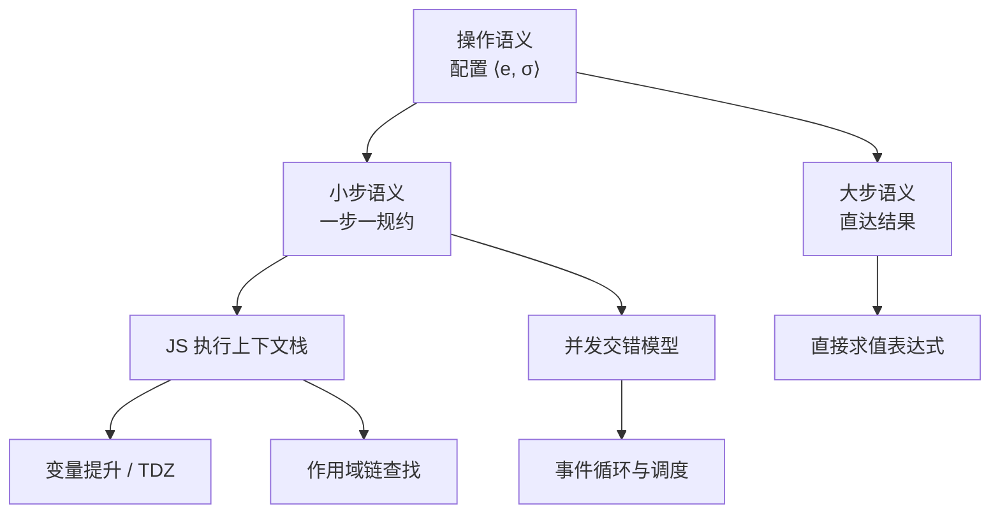
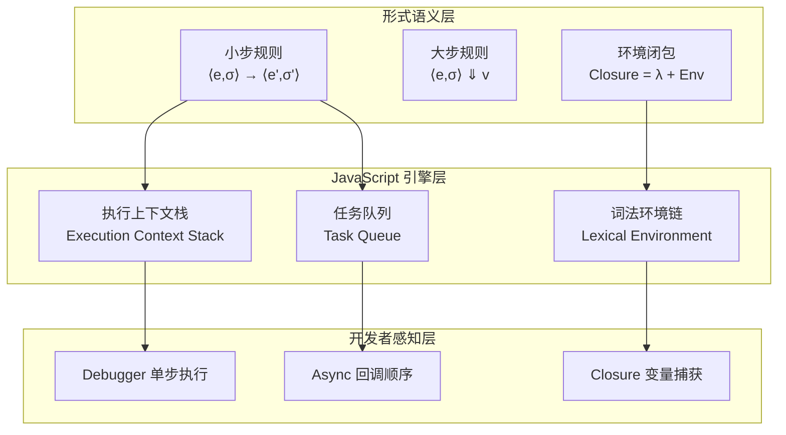

# 操作语义实验室：小步与大步求值的工程映射

> **实验定位**：`20-code-lab → website/code-lab`
> **核心映射**：小步语义 × 大步语义 × JS 执行上下文 × 变量提升 × 作用域链
> **预计时长**：100–130 分钟

---

## 引言

当你写下 `let x = 1; x = x + 2;` 时，JavaScript 引擎究竟执行了什么？
自然语言规范（如 ECMA-262 的段落描述）虽然详尽，却难以避免歧义。
操作语义（Operational Semantics）通过数学化的**配置转换规则** `⟨e, σ⟩ → ⟨e', σ'⟩`，精确刻画了「表达式 `e` 在存储 `σ` 下一步步演化」的行为。

本实验室围绕操作语义的核心范式——**小步语义**（Small-step，逐次规约）与**大步语义**（Big-step，直接推导结果）——设计 5 个可动手实验。
你将用 TypeScript 实现完整解释器，并观察这些形式化规则如何映射为 JavaScript 的执行上下文、变量提升、作用域链乃至并发交错模型。



---

## 前置知识

1. **TypeScript 类型系统**：熟悉 discriminated union（如 `{ tag: 'Num'; n: number } | { tag: 'Add'; ... }`）。
2. **基础数据结构**：Map、递归函数、BFS/DFS 遍历。
3. **JavaScript 执行模型**：对执行上下文（Execution Context）、词法环境（Lexical Environment）有初步概念。
4. **Node.js 环境**：实验代码可直接用 `tsx` 运行，或粘贴至 Playground。

---

## 实验 1：小步语义解释器——While 语言的精密齿轮

### 理论背景

小步语义将程序执行建模为**配置之间的原子转换**。
对于命令式语言，配置通常是 `⟨语句, 存储⟩` 对。每一步只执行「最小可感知的动作」：

- 表达式求值从左到右逐层下沉，直到化为数值。
- 语句执行一次只完成一个赋值、一个条件判断或一次循环展开。
- 存储（Store）`σ` 是变量到值的映射，每一步可能产生新的存储版本。

形式化规则示例（加法左规约）：

```text
      ⟨e₁, σ⟩ → ⟨e₁', σ'⟩
─────────────────────────────────
⟨e₁ + e₂, σ⟩ → ⟨e₁' + e₂, σ'⟩
```

这种「一步一停」的精确性，使小步语义成为分析**并发程序**和**非确定性行为**的首选工具。

### 实验代码

```typescript
// experiment-01-small-step.ts
// While 语言子集的小步操作语义解释器

type Expr =
  | { tag: 'Num'; n: number }
  | { tag: 'Var'; x: string }
  | { tag: 'Add'; left: Expr; right: Expr }
  | { tag: 'Lt'; left: Expr; right: Expr };

type Stmt =
  | { tag: 'Skip' }
  | { tag: 'Assign'; x: string; e: Expr }
  | { tag: 'Seq'; s1: Stmt; s2: Stmt }
  | { tag: 'If'; cond: Expr; thenBranch: Stmt; elseBranch: Stmt }
  | { tag: 'While'; cond: Expr; body: Stmt };

type Store = Map<string, number>;

function isValue(e: Expr): boolean {
  return e.tag === 'Num';
}

// ---------------- 表达式小步求值 ----------------
function stepExpr(e: Expr, σ: Store): { e: Expr; σ: Store } {
  switch (e.tag) {
    case 'Num':
      return { e, σ };
    case 'Var': {
      const v = σ.get(e.x);
      if (v === undefined) throw new Error(`Unbound variable: ${e.x}`);
      return { e: { tag: 'Num', n: v }, σ };
    }
    case 'Add': {
      if (!isValue(e.left)) {
        const r = stepExpr(e.left, σ);
        return { e: { tag: 'Add', left: r.e, right: e.right }, σ: r.σ };
      }
      if (!isValue(e.right)) {
        const r = stepExpr(e.right, σ);
        return { e: { tag: 'Add', left: e.left, right: r.e }, σ: r.σ };
      }
      const ln = (e.left as Extract<Expr, { tag: 'Num' }>).n;
      const rn = (e.right as Extract<Expr, { tag: 'Num' }>).n;
      return { e: { tag: 'Num', n: ln + rn }, σ };
    }
    case 'Lt': {
      if (!isValue(e.left)) {
        const r = stepExpr(e.left, σ);
        return { e: { tag: 'Lt', left: r.e, right: e.right }, σ: r.σ };
      }
      if (!isValue(e.right)) {
        const r = stepExpr(e.right, σ);
        return { e: { tag: 'Lt', left: e.left, right: r.e }, σ: r.σ };
      }
      const ln = (e.left as Extract<Expr, { tag: 'Num' }>).n;
      const rn = (e.right as Extract<Expr, { tag: 'Num' }>).n;
      return { e: { tag: 'Num', n: ln < rn ? 1 : 0 }, σ };
    }
  }
}

// ---------------- 语句小步求值 ----------------
function stepStmt(s: Stmt, σ: Store): { s: Stmt; σ: Store } {
  switch (s.tag) {
    case 'Skip':
      return { s, σ };
    case 'Assign': {
      const r = stepExpr(s.e, σ);
      if (isValue(r.e)) {
        const n = (r.e as Extract<Expr, { tag: 'Num' }>).n;
        const newStore = new Map(r.σ);
        newStore.set(s.x, n);
        return { s: { tag: 'Skip' }, σ: newStore };
      }
      return { s: { tag: 'Assign', x: s.x, e: r.e }, σ: r.σ };
    }
    case 'Seq': {
      if (s.s1.tag === 'Skip') return { s: s.s2, σ };
      const r = stepStmt(s.s1, σ);
      return { s: { tag: 'Seq', s1: r.s, s2: s.s2 }, σ: r.σ };
    }
    case 'If': {
      const r = stepExpr(s.cond, σ);
      if (isValue(r.e)) {
        const n = (r.e as Extract<Expr, { tag: 'Num' }>).n;
        return { s: n !== 0 ? s.thenBranch : s.elseBranch, σ: r.σ };
      }
      return { s: { tag: 'If', cond: r.e, thenBranch: s.thenBranch, elseBranch: s.elseBranch }, σ: r.σ };
    }
    case 'While':
      // While 展开为 If：while(c) b  =>  if(c) { b; while(c) b } else Skip
      return {
        s: {
          tag: 'If',
          cond: s.cond,
          thenBranch: { tag: 'Seq', s1: s.body, s2: s },
          elseBranch: { tag: 'Skip' },
        },
        σ,
      };
  }
}

// ---------------- 执行追踪 ----------------
const program: Stmt = {
  tag: 'While',
  cond: { tag: 'Lt', left: { tag: 'Var', x: 'x' }, right: { tag: 'Num', n: 3 } },
  body: { tag: 'Assign', x: 'x', e: { tag: 'Add', left: { tag: 'Var', x: 'x' }, right: { tag: 'Num', n: 1 } } },
};

let state: { s: Stmt; σ: Store } = { s: program, σ: new Map([['x', 0]]) };
console.log('=== Small-step trace ===');
let stepCount = 0;
while (state.s.tag !== 'Skip') {
  console.log(`Step ${stepCount++}: store =`, Object.fromEntries(state.σ));
  state = stepStmt(state.s, state.σ);
}
console.log('Final store:', Object.fromEntries(state.σ)); // { x: 3 }
console.log('Total steps:', stepCount);
```

### 预期结果

```text
=== Small-step trace ===
Step 0: store = { x: 0 }
Step 1: store = { x: 0 }
Step 2: store = { x: 1 }
Step 3: store = { x: 1 }
Step 4: store = { x: 2 }
Step 5: store = { x: 2 }
Step 6: store = { x: 3 }
Step 7: store = { x: 3 }
Final store: { x: 3 }
Total steps: 8
```

### 探索变体

1. **添加乘法和除法**：扩展 `Expr` 的 `Mul` 与 `Div` 分支，注意除零异常的处理方式。对比 JS 中 `1 / 0` 的行为与你的解释器设计。
2. **惰性求值**：当前 `Add` 总是先求左再求右。尝试修改规则，允许「按需」求值顺序，观察对副作用表达式（如带打印的 `Expr`）的影响。
3. **执行轨迹可视化**：将每一步的 `Store` 输出为 Mermaid 状态图序列，生成「程序执行动画」的文本表示。

---

## 实验 2：大步语义——直达结果的推理风格

### 理论背景

大步语义（又称自然语义，Natural Semantics）不关注中间步骤，而是直接建立「表达式/语句」与「最终结果」之间的推导关系：

```text
⟨e₁, σ⟩ ⇓ n₁    ⟨e₂, σ⟩ ⇓ n₂
─────────────────────────────────
    ⟨e₁ + e₂, σ⟩ ⇓ n₁ + n₂
```

大步语义的优势在于**简洁直观**，特别适合进行程序正确性证明（如霍尔逻辑的前置/后置条件推导）。缺点也很明显：**隐藏了所有中间状态**，因此无法刻画并发交错或运行时错误的确切发生点。

### 实验代码

```typescript
// experiment-02-big-step.ts
// While 语言的大步语义实现

// 复用实验 1 的 Expr / Stmt / Store 定义
// 为简洁，此处内联类型（实际项目中应从共享模块导入）

type Expr2 =
  | { tag: 'Num'; n: number }
  | { tag: 'Var'; x: string }
  | { tag: 'Add'; left: Expr2; right: Expr2 }
  | { tag: 'Lt'; left: Expr2; right: Expr2 };

type Stmt2 =
  | { tag: 'Skip' }
  | { tag: 'Assign'; x: string; e: Expr2 }
  | { tag: 'Seq'; s1: Stmt2; s2: Stmt2 }
  | { tag: 'If'; cond: Expr2; thenBranch: Stmt2; elseBranch: Stmt2 }
  | { tag: 'While'; cond: Expr2; body: Stmt2 };

type Store2 = Map<string, number>;

// ---------------- 大步表达式求值 ----------------
function bigStepExpr(e: Expr2, σ: Store2): number {
  switch (e.tag) {
    case 'Num': return e.n;
    case 'Var': return σ.get(e.x) ?? 0;
    case 'Add': return bigStepExpr(e.left, σ) + bigStepExpr(e.right, σ);
    case 'Lt': return bigStepExpr(e.left, σ) < bigStepExpr(e.right, σ) ? 1 : 0;
  }
}

// ---------------- 大步语句求值 ----------------
function bigStepStmt(s: Stmt2, σ: Store2): Store2 {
  switch (s.tag) {
    case 'Skip':
      return σ;
    case 'Assign': {
      const v = bigStepExpr(s.e, σ);
      const newStore = new Map(σ);
      newStore.set(s.x, v);
      return newStore;
    }
    case 'Seq': {
      const σ1 = bigStepStmt(s.s1, σ);
      return bigStepStmt(s.s2, σ1);
    }
    case 'If': {
      const v = bigStepExpr(s.cond, σ);
      return v !== 0 ? bigStepStmt(s.thenBranch, σ) : bigStepStmt(s.elseBranch, σ);
    }
    case 'While': {
      const v = bigStepExpr(s.cond, σ);
      if (v === 0) return σ;
      const σ1 = bigStepStmt(s.body, σ);
      return bigStepStmt(s, σ1); // 递归继续循环
    }
  }
}

// ---------------- 对比 ----------------
const prog: Stmt2 = {
  tag: 'While',
  cond: { tag: 'Lt', left: { tag: 'Var', x: 'x' }, right: { tag: 'Num', n: 3 } },
  body: { tag: 'Assign', x: 'x', e: { tag: 'Add', left: { tag: 'Var', x: 'x' }, right: { tag: 'Num', n: 1 } } },
};

console.log('Big-step result:', Object.fromEntries(bigStepStmt(prog, new Map([['x', 0]]))));
// Big-step result: { x: 3 }

// ---------------- JS 执行上下文的映射 ----------------
// 在 JavaScript 中，"大步"类似于直接调用一个纯函数并观察返回值，
// 而"小步"则对应于在 debugger 中单步执行，观察每一行的状态变化。
```

### 预期结果

```text
Big-step result: { x: 3 }
```

### 探索变体

1. **非终止检测**：当前 `While` 的递归实现若遇到非终止程序会导致 JS 栈溢出。添加「最大递归深度」参数，模拟「资源耗尽」的语义边界。
2. **证明骨架**：为 `bigStepStmt` 编写一个「推导树」生成器，记录每一步使用的规则名称，输出类似逻辑证明的文本树。
3. **语义等价性**：构造一个程序，使其在小步语义中某一步抛出异常，但在大步语义中「看起来」能正常结束（提示：涉及短路求值）。

---

## 实验 3：环境模型与闭包——λ 演算的小步语义

### 理论背景

在实验 1 和 2 中，存储 `σ` 是全局的扁平映射。但真实的 JavaScript 拥有**词法作用域**和**闭包**：函数可以「记住」其定义时的环境，即使在外层函数返回后依然访问外层变量。

操作语义通过**环境模型**（Environment Model）形式化这一行为：

- 配置扩展为 `⟨表达式, 环境⟩`，环境 `Env` 是变量到**值**的映射。
- 值不再是简单的数字，而是**闭包**（Closure）：`λ` 抽象与其定义环境的配对。
- 函数应用时，在闭包的环境中扩展参数绑定，而非修改全局存储。

这正是 JavaScript 引擎中 `[[Environment]]` 内部槽的数学化描述。

### 实验代码

```typescript
// experiment-03-environment.ts
// 带环境与闭包的 λ 演算小步语义

type Term =
  | { tag: 'Var'; name: string }
  | { tag: 'Lam'; param: string; body: Term }
  | { tag: 'App'; func: Term; arg: Term }
  | { tag: 'Num'; n: number }
  | { tag: 'Add'; left: Term; right: Term };

interface Closure {
  tag: 'Closure';
  param: string;
  body: Term;
  env: Env;
}

type Value = Closure | { tag: 'VNum'; n: number };
type Env = Map<string, Value>;

function isValue(t: Term | Value): t is Value {
  return t.tag === 'Closure' || t.tag === 'VNum';
}

// ---------------- 小步求值（带环境）----------------
function step(t: Term, env: Env): { term: Term | Value; env: Env } {
  switch (t.tag) {
    case 'Var': {
      const v = env.get(t.name);
      if (!v) throw new Error(`Unbound variable: ${t.name}`);
      return { term: v, env };
    }
    case 'Lam':
      // λx.e 在环境 env 下求值为闭包
      return { term: { tag: 'Closure', param: t.param, body: t.body, env }, env };
    case 'App': {
      if (!isValue(t.func)) {
        const r = step(t.func, env);
        return { term: { tag: 'App', func: r.term as Term, arg: t.arg }, env: r.env };
      }
      if (t.func.tag !== 'Closure') throw new Error('Applying non-function');
      if (!isValue(t.arg)) {
        const r = step(t.arg, env);
        return { term: { tag: 'App', func: t.func, arg: r.term as Term }, env: r.env };
      }
      // β 归约：在闭包环境中扩展参数绑定
      const newEnv = new Map(t.func.env);
      newEnv.set(t.func.param, t.arg as Value);
      return { term: t.func.body, env: newEnv };
    }
    case 'Num':
      return { term: { tag: 'VNum', n: t.n }, env };
    case 'Add': {
      if (!isValue(t.left)) {
        const r = step(t.left, env);
        return { term: { tag: 'Add', left: r.term as Term, right: t.right }, env: r.env };
      }
      if (!isValue(t.right)) {
        const r = step(t.right, env);
        return { term: { tag: 'Add', left: t.left, right: r.term as Term }, env: r.env };
      }
      if (t.left.tag !== 'VNum' || t.right.tag !== 'VNum') throw new Error('Adding non-numbers');
      return { term: { tag: 'VNum', n: t.left.n + t.right.n }, env };
    }
  }
}

function evalFull(t: Term, env: Env): Value {
  let current: Term | Value = t;
  let currentEnv = env;
  while (!isValue(current)) {
    const r = step(current, currentEnv);
    current = r.term;
    currentEnv = r.env;
  }
  return current;
}

// ---------------- 演示：((λx.λy.x+y) 1) 2 ----------------
const addExpr: Term = {
  tag: 'App',
  func: {
    tag: 'App',
    func: {
      tag: 'Lam', param: 'x',
      body: {
        tag: 'Lam', param: 'y',
        body: {
          tag: 'Add',
          left: { tag: 'Var', name: 'x' },
          right: { tag: 'Var', name: 'y' },
        },
      },
    },
    arg: { tag: 'Num', n: 1 },
  },
  arg: { tag: 'Num', n: 2 },
};

console.log('((λx.λy.x+y) 1) 2 =>', evalFull(addExpr, new Map()));
// { tag: 'VNum', n: 3 }

// ---------------- 闭包捕获演示 ----------------
const makeAdder: Term = {
  tag: 'Lam', param: 'n',
  body: {
    tag: 'Lam', param: 'm',
    body: {
      tag: 'Add',
      left: { tag: 'Var', name: 'n' },
      right: { tag: 'Var', name: 'm' },
    },
  },
};

// (makeAdder 5) 返回一个闭包，其环境中 n = VNum(5)
const add5 = evalFull({ tag: 'App', func: makeAdder, arg: { tag: 'Num', n: 5 } }, new Map());
console.log('Closure add5:', add5);

// (add5 3) => 8
const result = evalFull({ tag: 'App', func: add5 as unknown as Term, arg: { tag: 'Num', n: 3 } }, new Map());
console.log('(add5 3) =>', result);
```

### 预期结果

```text
((λx.λy.x+y) 1) 2 => { tag: 'VNum', n: 3 }
Closure add5: { tag: 'Closure', param: 'm', body: { ... }, env: Map(1) { 'n' => { tag: 'VNum', n: 5 } } }
(add5 3) => { tag: 'VNum', n: 8 }
```

### 探索变体

1. **作用域链可视化**：修改 `evalFull`，在每一步打印当前环境的键集合。观察多层嵌套函数调用时环境如何「层叠」。
2. **变量提升模拟**：在环境模型中引入「声明阶段」与「初始化阶段」，模拟 JavaScript 的 `var` 提升与 `let` TDZ（Temporal Dead Zone）。
3. **垃圾回收直觉**：当闭包不再被引用时，其捕获的环境理论上可被回收。在解释器中实现引用计数，观察哪些环境条目最先被释放。

---

## 实验 4：异常处理的操作语义——控制流的断裂与恢复

### 理论背景

JavaScript 的 `try / catch / finally` 并非魔法，而是可以被形式化为操作语义规则的「控制流操作」。关键洞察是：**异常改变了配置的维度**。

基础配置是 `⟨语句, 存储⟩`，而带异常的配置变为 `⟨语句, 存储, 异常值 | null⟩`。当异常值为 `null` 时，程序正常执行；当异常值非 `null` 时，语句被「短路」，直到遇到 `TryCatch` 捕获点。

这与 JavaScript 引擎内部将异常标记为「未捕获异常」并在执行上下文栈中向上冒泡的过程完全一致。

### 实验代码

```typescript
// experiment-04-exceptions.ts
// 扩展 While 语言：throw / try-catch 的操作语义

type Expr4 =
  | { tag: 'Num'; n: number }
  | { tag: 'Var'; x: string }
  | { tag: 'Add'; left: Expr4; right: Expr4 }
  | { tag: 'Lt'; left: Expr4; right: Expr4 };

type Stmt4 =
  | { tag: 'Skip' }
  | { tag: 'Assign'; x: string; e: Expr4 }
  | { tag: 'Seq'; s1: Stmt4; s2: Stmt4 }
  | { tag: 'If'; cond: Expr4; thenBranch: Stmt4; elseBranch: Stmt4 }
  | { tag: 'While'; cond: Expr4; body: Stmt4 }
  | { tag: 'Throw'; e: Expr4 }
  | { tag: 'TryCatch'; body: Stmt4; catchVar: string; handler: Stmt4 };

type Store4 = Map<string, number>;

interface Config {
  s: Stmt4;
  σ: Store4;
  exn: { tag: 'Num'; n: number } | null;
}

function isValue4(e: Expr4): boolean {
  return e.tag === 'Num';
}

function stepExpr4(e: Expr4, σ: Store4): { e: Expr4; σ: Store4 } {
  // 简化版：仅处理 Num / Var / Add
  switch (e.tag) {
    case 'Num': return { e, σ };
    case 'Var': {
      const v = σ.get(e.x);
      if (v === undefined) throw new Error(`Unbound: ${e.x}`);
      return { e: { tag: 'Num', n: v }, σ };
    }
    case 'Add': {
      if (!isValue4(e.left)) {
        const r = stepExpr4(e.left, σ);
        return { e: { tag: 'Add', left: r.e, right: e.right }, σ: r.σ };
      }
      if (!isValue4(e.right)) {
        const r = stepExpr4(e.right, σ);
        return { e: { tag: 'Add', left: e.left, right: r.e }, σ: r.σ };
      }
      return { e: { tag: 'Num', n: (e.left as any).n + (e.right as any).n }, σ };
    }
    default: return { e, σ };
  }
}

function stepStmtExt(c: Config): Config {
  const { s, σ, exn } = c;
  if (exn !== null) {
    // 异常传播模式
    if (s.tag === 'Seq') {
      return { s: s.s2, σ, exn }; // 简化：跳过 s2，继续向上
    }
    if (s.tag === 'TryCatch') {
      const newStore = new Map(σ);
      newStore.set(s.catchVar, exn.n);
      return { s: s.handler, σ: newStore, exn: null };
    }
    return c; // 最外层未捕获
  }

  switch (s.tag) {
    case 'Skip': return c;
    case 'Assign': {
      const r = stepExpr4(s.e, σ);
      if (isValue4(r.e)) {
        const newStore = new Map(r.σ);
        newStore.set(s.x, (r.e as any).n);
        return { s: { tag: 'Skip' }, σ: newStore, exn: null };
      }
      return { s: { tag: 'Assign', x: s.x, e: r.e }, σ: r.σ, exn: null };
    }
    case 'Seq': {
      if (s.s1.tag === 'Skip') return { s: s.s2, σ, exn: null };
      const r = stepStmtExt({ s: s.s1, σ, exn: null });
      return { s: { tag: 'Seq', s1: r.s, s2: s.s2 }, σ: r.σ, exn: r.exn };
    }
    case 'Throw': {
      const r = stepExpr4(s.e, σ);
      if (isValue4(r.e)) {
        return { s: { tag: 'Skip' }, σ: r.σ, exn: r.e as any };
      }
      return { s: { tag: 'Throw', e: r.e }, σ: r.σ, exn: null };
    }
    case 'TryCatch': {
      const r = stepStmtExt({ s: s.body, σ, exn: null });
      if (r.exn !== null && r.s.tag === 'Skip') {
        const newStore = new Map(r.σ);
        newStore.set(s.catchVar, r.exn.n);
        return { s: s.handler, σ: newStore, exn: null };
      }
      if (r.s.tag === 'Skip' && r.exn === null) {
        return { s: { tag: 'Skip' }, σ: r.σ, exn: null };
      }
      return { s: { tag: 'TryCatch', body: r.s, catchVar: s.catchVar, handler: s.handler }, σ: r.σ, exn: r.exn };
    }
    default: return c;
  }
}

// ---------------- 演示：try { throw 42 } catch e { x = e } ----------------
const exnProgram: Stmt4 = {
  tag: 'TryCatch',
  body: { tag: 'Throw', e: { tag: 'Num', n: 42 } },
  catchVar: 'e',
  handler: { tag: 'Assign', x: 'x', e: { tag: 'Var', x: 'e' } },
};

let exnState: Config = { s: exnProgram, σ: new Map(), exn: null };
while (exnState.s.tag !== 'Skip' || exnState.exn !== null) {
  exnState = stepStmtExt(exnState);
}
console.log('After catch, x =', exnState.σ.get('x')); // 42
```

### 预期结果

```text
After catch, x = 42
```

### 探索变体

1. **finally 语义**：扩展配置以支持 `TryFinally`。注意 `finally` 块无论是否抛出异常都必须执行，且其内部异常会覆盖之前的异常。
2. **异常类层次**：将异常值从纯数字扩展为对象（如 `{ tag: 'TypeError'; msg: string }`），实现类似 JavaScript `instanceof Error` 的捕获匹配。
3. **栈追踪模拟**：在 `Config` 中维护「调用栈」列表，异常发生时输出完整的语义栈追踪。

---

## 实验 5：并发交错语义——事件循环的理论原型

### 理论背景

小步语义的真正威力在并发场景中得以体现。大步语义直接推导最终结果，因此**完全丢失了并发执行的交错细节**。而小步语义允许我们在每一步「选择」下一个要执行的线程，从而精确刻画所有可能的执行路径。

本实验实现一个极简的**交错语义**（Interleaving Semantics）模型：

- 配置 = `⟨线程列表, 共享存储, 已完成线程 ID⟩`
- 每一步非确定性地选择一个可运行的线程，执行其下一条指令。
- 两个线程竞争写入同一变量时，不同的交错顺序会导致不同的最终结果。

这正是 JavaScript 单线程事件循环的「多线程类比」——虽然 JS 引擎本身不交错执行，但异步任务的回调调度顺序会产生类似的非确定性。

### 实验代码

```typescript
// experiment-05-concurrency.ts
// 交错语义：两个线程竞争写入共享存储

type Action =
  | { tag: 'Read'; var: string }
  | { tag: 'Write'; var: string; value: number }
  | { tag: 'Fork'; child: Thread };

interface Thread {
  id: number;
  pc: number;
  actions: Action[];
}

interface ConcurrentConfig {
  threads: Thread[];
  store: Map<string, number>;
  done: number[];
}

// 非确定性地选择一个可运行的线程
function stepConcurrent(c: ConcurrentConfig): ConcurrentConfig[] {
  const results: ConcurrentConfig[] = [];
  for (let i = 0; i < c.threads.length; i++) {
    const t = c.threads[i];
    if (c.done.includes(t.id)) continue;
    const action = t.actions[t.pc];
    if (!action) continue;

    const newThreads = c.threads.map((th, idx) =>
      idx === i ? { ...th, pc: th.pc + 1 } : th
    );
    const newStore = new Map(c.store);
    const newDone = [...c.done];

    switch (action.tag) {
      case 'Read':
        results.push({ threads: newThreads, store: newStore, done: newDone });
        break;
      case 'Write':
        newStore.set(action.var, action.value);
        results.push({ threads: newThreads, store: newStore, done: newDone });
        break;
      case 'Fork':
        newThreads.push({ ...action.child, id: newThreads.length });
        results.push({ threads: newThreads, store: newStore, done: newDone });
        break;
    }
  }
  for (const t of c.threads) {
    if (t.pc >= t.actions.length && !c.done.includes(t.id)) {
      c.done.push(t.id);
    }
  }
  return results;
}

// BFS 探索所有可能的交错路径
function exploreConcurrent(initial: ConcurrentConfig, maxDepth = 6): Map<string, number>[] {
  const finals: Map<string, number>[] = [];
  const queue: { c: ConcurrentConfig; depth: number }[] = [{ c: initial, depth: 0 }];
  while (queue.length) {
    const { c, depth } = queue.shift()!;
    if (depth >= maxDepth) {
      finals.push(c.store);
      continue;
    }
    const nexts = stepConcurrent(c);
    if (nexts.length === 0) {
      finals.push(c.store);
    } else {
      for (const n of nexts) queue.push({ c: n, depth: depth + 1 });
    }
  }
  return finals;
}

// ---------------- 演示：两个线程竞争写入 x ----------------
const threadA: Thread = {
  id: 0, pc: 0,
  actions: [
    { tag: 'Write', var: 'x', value: 1 },
    { tag: 'Read', var: 'x' },
  ],
};
const threadB: Thread = {
  id: 1, pc: 0,
  actions: [
    { tag: 'Write', var: 'x', value: 2 },
    { tag: 'Read', var: 'x' },
  ],
};

const initial: ConcurrentConfig = { threads: [threadA, threadB], store: new Map(), done: [] };
const finals = exploreConcurrent(initial);
console.log('Possible final stores:', finals.map(s => Object.fromEntries(s)));
// 可能结果：{ x: 1 } 或 { x: 2 }，取决于最后写入的是谁
```

### 预期结果

```text
Possible final stores: [ { x: 1 }, { x: 2 } ]
```

### 探索变体

1. **数据竞争检测**：扩展 `exploreConcurrent`，当检测到「读取一个即将被另一线程覆盖的变量」时标记为潜在数据竞争。这类似于 ThreadSanitizer 的核心算法。
2. **Promise 语义映射**：将 `Thread` 映射为 JavaScript 的 Promise 链，`Read` 映射为 `await`，`Write` 映射为变量赋值。观察你的交错语义模型如何解释 `Promise.race` 的行为。
3. **顺序一致性 vs 弱内存模型**：当前模型是「顺序一致」的（所有线程看到相同的存储视图）。尝试引入「每个线程有独立缓存」的弱内存模型，观察 `x` 的最终结果集如何扩大。

---

## 实验总结

本实验室通过 5 个递进实验，构建了从原子规约规则到并发交错语义的完整操作语义认知体系：

| 实验 | 语义范式 | 工程映射 | 核心洞察 |
|------|---------|---------|---------|
| 实验 1 | 小步语义 | JS 单步调试 / 表达式逐层求值 | 每一步都是配置转换 |
| 实验 2 | 大步语义 | 纯函数直接求值 / 结果推导 | 简洁但丢失中间态 |
| 实验 3 | 环境模型 | 闭包 / 词法作用域链 | 函数 = 代码 + 环境 |
| 实验 4 | 异常扩展 | try/catch / 执行上下文冒泡 | 异常是配置的额外维度 |
| 实验 5 | 交错语义 | 异步回调调度 / 事件循环 | 非确定性 = 多条规约路径 |



---

## 延伸阅读

1. **Plotkin, G. D.** "A Structural Approach to Operational Semantics." *Journal of Logic and Algebraic Programming*, 2004. 小步语义（SOS）的奠基论文，定义了现代操作语义的标准写法。[PDF](https://homepages.inf.ed.ac.uk/gdp/publications/sos_jlap.pdf)
2. **Winskel, G.** *The Formal Semantics of Programming Languages*. MIT Press, 1993. 经典教材，第 2–4 章涵盖小步、大步与指称语义的系统对比。[MIT Press](https://mitpress.mit.edu/9780262731033/)
3. **Nielson, F. & Nielson, H. R.** *Semantics with Applications*. Springer, 1992. 免费教材，从操作语义出发讲解程序分析与验证。[在线版](https://www.cs.ru.nl/~herman/semanticswithapplications.pdf)
4. **ECMA-262 Specification — Algorithm Conventions**. TC39 规范中的伪代码本质上是一种大步语义与实现算法的混合体，理解形式语义后再读规范将事半功倍。[tc39.es/ecma262/#sec-algorithm-conventions](https://tc39.es/ecma262/#sec-algorithm-conventions)
5. **K Framework**. 一个基于重写逻辑的可执行语义框架，允许你直接用操作语义规则定义语言并自动生成解释器与模型检验器。[kframework.org](https://kframework.org/)
