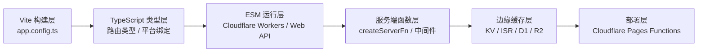
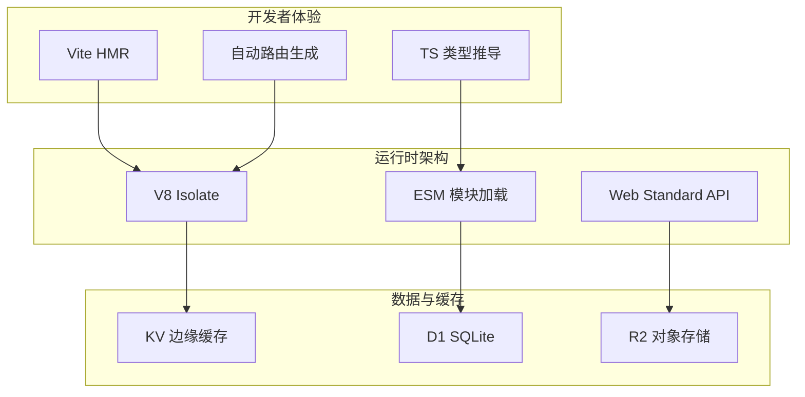

# 现代全栈工程环境搭建实验室：从 Vite 到边缘运行时

> **实验定位**：`20-code-lab → website/code-lab`
> **核心映射**：Vite 配置 × TypeScript 严格类型 × ESM 边缘运行时 × 服务端函数 × 边缘缓存
> **预计时长**：120–150 分钟

---

## 引言

现代 JavaScript / TypeScript 工程环境的搭建已远超越「安装 Node.js 并运行 npm init」。
一个生产级的全栈项目需要协调构建工具（Vite）、类型系统（TypeScript）、模块格式（ESM / CJS 互操作）、服务端运行时（边缘函数 vs Node.js）以及缓存与持久化策略。

本实验室以 TanStack Start + Cloudflare 边缘平台为实践载体，将「现代 JS/TS 工程环境搭建」拆解为 5 个可动手实验。
你将亲手配置 Vite 驱动的全栈构建管线、声明端到端类型安全路由、适配 ESM 边缘运行时、编写可组合的服务端中间件，并设计基于 KV 的边缘缓存策略。



---

## 前置知识

1. **Vite 基础配置**：熟悉 `vite.config.ts` 中的插件、resolve 别名与 build 选项。
2. **TypeScript 类型声明**：能阅读并编写 `.d.ts` 文件，理解 `declare global` 的用途。
3. **ESM 模块规范**：了解 `import` / `export` 语法，以及 ESM 与 CJS 在解析算法上的核心差异（静态分析 vs 动态求值）。
4. **React 与 React Router**：了解 JSX、路由配置与 `loader` 数据预取的基本概念。
5. **Cloudflare 账号**（可选）：实验代码可在本地用 Wrangler 模拟运行，无需真实账号。

> **环境检查**：确保已安装 Node.js 20+、npm 10+，以及 `wrangler` CLI（`npm install -g wrangler`）。

---

## 实验 1：Vite 驱动的全栈配置优化

### 理论背景

TanStack Start 并非传统意义上的元框架（meta-framework），而是一个**类型安全的路由与数据层**。
它依赖 Vite 作为构建底座，并通过 Nitro / Vinxi 实现「通用服务端引擎」的抽象。
理解其配置体系，就是理解现代全栈工具链的分层架构：

- **Vite 层**：负责开发服务器、HMR、构建优化与插件生态。
- **Nitro 层**：提供服务端渲染、API 路由、中间件与跨平台部署适配。
- **TanStack Router 层**：提供基于文件系统的类型安全路由与数据预取。

在边缘部署场景下，配置优化的核心是**输出格式**与**平台预设**：必须显式指定 `preset: 'cloudflare-pages'` 与 `format: 'esm'`，以确保产物兼容 Cloudflare Workers 的 V8 Isolate 运行时。

### 实验代码

创建一个项目目录 `tanstack-edge-lab/`，初始化后新建 `app.config.ts`：

```typescript
// app.config.ts
// TanStack Start + Cloudflare Pages 的全栈配置

import { defineConfig } from '@tanstack/react-start/config';

export default defineConfig({
  server: {
    // 平台预设：告诉 Nitro 输出 Cloudflare Pages Functions 格式
    preset: 'cloudflare-pages',
    rollupConfig: {
      output: {
        // Cloudflare Workers 要求 ESM 格式
        format: 'esm',
        // 避免将外部绑定（如 D1 / KV）打包进产物
        inlineDynamicImports: false,
      },
    },
    // 实验性：压缩选项对边缘冷启动的影响
    minify: true,
  },
  tsr: {
    // 类型安全路由的配置
    appDirectory: 'app',
    generatedRouteTree: 'app/routeTree.gen.ts',
    routesDirectory: 'app/routes',
  },
  vite: {
    // 复用 Vite 插件生态
    plugins: [
      // 示例：条件编译插件（仅在服务端生效的代码块）
    ],
    resolve: {
      alias: {
        '~': '/app',
        '@utils': '/app/utils',
      },
    },
    build: {
      // 服务端与客户端的 target 差异
      target: 'esnext',
    },
  },
});
```

根布局文件 `app/routes/__root.tsx`：

```tsx
// app/routes/__root.tsx
import { Outlet, createRootRoute } from '@tanstack/react-router';

export const Route = createRootRoute({
  component: () => (
    <html lang="zh-CN">
      <head>
        <meta charSet="utf-8" />
        <meta name="viewport" content="width=device-width, initial-scale=1" />
        <title>TanStack Edge Lab</title>
      </head>
      <body>
        <Outlet />
      </body>
    </html>
  ),
});
```

### 预期结果

执行 `npm run dev` 后，本地开发服务器应正常启动，且 `app/routeTree.gen.ts` 被自动生成为类型安全的路由树。
检查 `tsconfig.json` 确保 `app/routeTree.gen.ts` 被包含在编译范围内。

### 探索变体

1. **CJS 互操作实验**：在项目中引入一个仅提供 CJS 格式的旧依赖（如某些早期的 npm 包），观察 Vite 的预构建（pre-bundling）如何处理 `require` → `import` 的转换。在 `vite.config.ts` 中调整 `optimizeDeps.include` 与 `commonjsOptions`，记录不同配置下的构建时间差异。
2. **冷启动优化**：对比 `minify: true` 与 `minify: false` 时 Wrangler 本地模拟的冷启动耗时（使用 `wrangler pages dev` 的 `--log-level debug`）。分析：在边缘函数场景，为何「小包体积」比「构建速度」更重要？
3. **多环境配置**：为 `development`、`staging`、`production` 分别创建 `app.config.{env}.ts`，利用 Vite 的 `mode` 实现环境差异化配置（如staging关闭sourcemap）。

---

## 实验 2：TypeScript 端到端类型安全

### 理论背景

传统全栈开发的痛点之一是**前后端类型不同步**：前端修改了 API 响应结构，后端却未同步更新，导致运行时错误。
TanStack Start 通过「路由级类型推导」与「服务端函数类型传播」，实现了接近 TSRPC 的端到端类型安全。

在边缘平台（Cloudflare）上，类型安全还需要覆盖**平台绑定**（Platform Bindings）——D1 数据库、KV 命名空间、R2 存储桶等并非通过环境变量注入，而是由运行时直接挂载到 `context.cloudflare.env` 对象上。
因此，必须通过全局类型声明让 TypeScript 知晓这些绑定存在的类型签名。

### 实验代码

**步骤 A：全局平台绑定类型声明**

```typescript
// worker-configuration.d.ts
// Cloudflare 平台绑定的全局类型声明

declare global {
  interface Env {
    DB: D1Database;
    KV: KVNamespace;
    R2: R2Bucket;
    AI: Ai;
  }
}

export {};
```

**步骤 B：类型安全的路由与数据加载**

```tsx
// app/routes/index.tsx
import { createFileRoute } from '@tanstack/react-router';

export const Route = createFileRoute('/')({
  component: HomeComponent,
  loader: async () => {
    // 服务端预取数据（仅在 SSR 或客户端导航时执行）
    return { message: 'Hello from TanStack Start!' };
  },
  head: () => ({
    meta: [{ title: 'Home' }],
  }),
});

function HomeComponent() {
  // useLoaderData 的类型由 Route.loader 的返回类型自动推导
  const data = Route.useLoaderData();
  return <h1>{data.message}</h1>;
}
```

**步骤 C：动态路由与参数类型**

```tsx
// app/routes/posts.$postId.tsx
import { createFileRoute, notFound } from '@tanstack/react-router';

interface Post {
  id: string;
  title: string;
  content: string;
}

export const Route = createFileRoute('/posts/$postId')({
  component: PostComponent,
  loader: async ({ params }): Promise<Post> => {
    // params.postId 已被类型化为 string
    const post = await fetchPost(params.postId);
    if (!post) throw notFound();
    return post;
  },
});

function PostComponent() {
  const post = Route.useLoaderData();
  return (
    <article>
      <h1>{post.title}</h1>
      <div>{post.content}</div>
    </article>
  );
}

// 模拟数据获取（实际项目中应替换为服务端函数调用）
async function fetchPost(id: string): Promise<Post | null> {
  const posts: Record<string, Post> = {
    '1': { id: '1', title: 'Hello Edge', content: 'Cloudflare is awesome.' },
  };
  return posts[id] ?? null;
}
```

**步骤 D：类型安全的环境访问封装**

```typescript
// app/utils/env.ts
import { getEvent } from '@tanstack/react-start/server';

export function getBindings(): Env {
  const event = getEvent();
  // Cloudflare Pages 将绑定挂载在 context.cloudflare.env
  const cf = (event as any).context?.cloudflare?.env as Env | undefined;
  if (!cf) throw new Error('Cloudflare bindings not available');
  return cf;
}
```

### 预期结果

在编辑器中，当你修改 `loader` 的返回类型时，`useLoaderData()` 的调用点会自动获得新的类型提示。尝试将 `loader` 的返回类型从 `{ message: string }` 改为 `{ message: string; timestamp: number }`，观察 VS Code 如何在整个调用链中传播类型变化。

### 探索变体

1. **严格模式挑战**：在 `tsconfig.json` 中启用 `"strict": true` 与 `"noImplicitAny": true`，修复 `getBindings` 中 `(event as any)` 的类型安全问题。提示：可能需要扩展 `@tanstack/react-start/server` 的类型定义。
2. **branded type 实践**：为 `postId` 创建 branded type（如 `type PostId = string & { __brand: 'PostId' }`），确保路由参数不会被误用为普通字符串。
3. **Zod 校验集成**：在 `loader` 的输入与输出端引入 Zod schema，实现「类型 + 运行时」双重校验。对比仅依赖 TypeScript 编译时类型与 Zod 运行时校验在 SSR 数据安全上的差异。

---

## 实验 3：ESM 边缘运行时与模块互操作

### 理论背景

Cloudflare Workers 基于 V8 Isolates，**没有 Node.js 兼容层**，仅支持 Web Standard API（如 `fetch`、`Request`、`Response`、`crypto`）。这意味着：

- 所有代码必须以 **ESM** 格式输出（`format: 'esm'`）。
- 不能使用 `fs`、`path`、`http` 等 Node.js 内置模块，除非通过 `node_compat` 标志显式启用（且有性能代价）。
- `require()` 语法不可用，CJS 模块需要通过 Vite / Rollup 的预构建转换为 ESM。

这种运行时约束迫使开发者回归 Web 标准，但也带来了显著优势：**冷启动 < 1ms**，且全球 300+ 节点就近执行。

### 实验代码

**步骤 A：ESM 输出验证**

```typescript
// app/utils/fetch-standard.ts
// 仅使用 Web Standard API，确保边缘兼容性

export interface GeoData {
  country: string;
  city: string;
}

export async function getGeoData(request: Request): Promise<GeoData> {
  // 使用标准 Request 对象和 CF 自定义头
  const country = request.headers.get('CF-IPCountry') ?? 'unknown';
  const city = request.headers.get('CF-IPCity') ?? 'unknown';
  return { country, city };
}

export async function hashText(input: string): Promise<string> {
  const encoder = new TextEncoder();
  const data = encoder.encode(input);
  const hashBuffer = await crypto.subtle.digest('SHA-256', data);
  const hashArray = Array.from(new Uint8Array(hashBuffer));
  return hashArray.map((b) => b.toString(16).padStart(2, '0')).join('');
}
```

**步骤 B：CJS 互操作适配**

```typescript
// app/utils/cjs-adapter.ts
// 演示如何包装遗留 CJS 工具函数为 ESM 兼容形式

// 假设某个内部工具库只提供 CJS：
// const legacy = require('legacy-utils');
// 在 ESM 边缘运行时中，通过动态 import 实现条件加载

export async function legacyCalculate(a: number, b: number): Promise<number> {
  // 仅在需要时动态导入，避免顶层 require
  const legacy = await import('legacy-utils');
  return legacy.calculate(a, b);
}
```

**步骤 C：平台绑定类型与 ESM 导出结合**

```typescript
// app/utils/db-client.ts
import { getBindings } from './env';

export interface User {
  id: number;
  email: string;
}

export async function getUserById(id: number): Promise<User | null> {
  const { DB } = getBindings();
  const { results } = await DB
    .prepare('SELECT id, email FROM users WHERE id = ?')
    .bind(id)
    .all<User>();
  return results?.[0] ?? null;
}
```

### 预期结果

执行 `wrangler pages dev` 启动本地模拟环境，访问包含上述服务端函数的路由，确认 `crypto.subtle.digest` 与 D1 查询均能正常执行。
若遇到 `Dynamic require of ... is not supported` 错误，说明某个依赖未被正确转换为 ESM，需在 Vite 配置中将其加入 `optimizeDeps.include`。

### 探索变体

1. **互操作矩阵**：创建一个表格，列出你项目依赖中所有 CJS 包的 ESM 兼容状态。对于不兼容的包，尝试用 `vite-plugin-commonjs-externals` 或寻找 ESM 替代方案。
2. **条件导出实验**：在自己的 npm 包中配置 `package.json` 的 `exports` 字段，同时提供 ESM 与 CJS 入口，观察不同运行时的加载优先级。
3. **polyfill 审计**：使用 `wrangler dev` 的 `--compatibility-date` 标志，对比不同兼容性日期下 `node_compat` 的行为差异，评估启用 Node.js 兼容层的性能代价。

---

## 实验 4：服务端函数与可组合中间件

### 理论背景

TanStack Start 的 `createServerFn` 是一种**类型安全的 RPC 抽象**：它允许你在前端代码中直接调用「标记为服务端」的函数，而框架负责处理序列化、HTTP 路由映射与错误传播。

在服务端侧，中间件（Middleware）采用 **H3 风格**的可组合设计：每个中间件可以注入上下文、拦截请求、测量耗时，甚至提前终止响应。
这与传统 Express 的「洋葱模型」类似，但类型安全性更强——中间件注入的上下文对象会自动参与到下游的类型推导中。

### 实验代码

**步骤 A：认证中间件**

```typescript
// app/utils/middleware.ts
import { createMiddleware } from '@tanstack/react-start';
import { getEvent } from '@tanstack/react-start/server';

export const authMiddleware = createMiddleware().server(async ({ next }) => {
  const event = getEvent();
  const authHeader = event.request.headers.get('authorization');
  if (!authHeader?.startsWith('Bearer ')) {
    throw new Response('Unauthorized', { status: 401 });
  }
  // 实际场景中：解析 JWT 并注入用户上下文
  const userId = authHeader.slice(7); // 简化演示
  return next({
    context: {
      userId,
    },
  });
});
```

**步骤 B：日志与性能测量中间件**

```typescript
// app/utils/middleware.ts（续）
export const loggerMiddleware = createMiddleware().server(async ({ next }) => {
  const event = getEvent();
  const start = performance.now();
  const result = await next();
  console.log(
    `[${new Date().toISOString()}] ${event.request.url} — ${(performance.now() - start).toFixed(2)}ms`
  );
  return result;
});
```

**步骤 C：在路由中组合中间件**

```tsx
// app/routes/api/protected.ts
import { createFileRoute } from '@tanstack/react-router';
import { authMiddleware, loggerMiddleware } from '~/utils/middleware';

export const Route = createFileRoute('/api/protected')({
  middleware: [loggerMiddleware, authMiddleware],
  loader: async ({ context }) => {
    // context.userId 由 authMiddleware 注入，类型自动推导
    return { secret: `data-for-user-${context.userId}` };
  },
});
```

**步骤 D：独立服务端函数**

```typescript
// app/utils/server-functions.ts
import { createServerFn } from '@tanstack/react-start';
import { getBindings } from './env';

export const getPostCount = createServerFn({ method: 'GET' })
  .handler(async () => {
    const env = getBindings();
    const { results } = await env.DB
      .prepare('SELECT COUNT(*) as count FROM posts')
      .all<{ count: number }>();
    return results?.[0]?.count ?? 0;
  });

export const createPost = createServerFn({ method: 'POST' })
  .handler(async (ctx) => {
    const { title, content } = await ctx.request.json();
    const env = getBindings();
    await env.DB
      .prepare('INSERT INTO posts (title, content) VALUES (?, ?)')
      .bind(title, content)
      .run();
    return { ok: true };
  });
```

### 预期结果

访问 `/api/protected` 时，未携带 `Authorization: Bearer ...` 头的请求将收到 401 响应；携带正确头的请求将返回用户专属数据，并在服务端控制台看到请求耗时日志。

### 探索变体

1. **中间件链类型推导**：尝试在中间件 A 中注入 `userId`，在中间件 B 中读取 `userId` 并注入 `permissions`。观察 TypeScript 是否能正确推导跨中间件的上下文类型链。
2. **Rate Limiting 中间件**：基于 Cloudflare KV 实现一个简易的「每 IP 每分钟限流 60 次」中间件，对比在边缘函数层做限流与在 API 网关层做限流的架构优劣。
3. **错误边界设计**：为 `createServerFn` 设计统一的错误序列化格式（如 `{ success: false; code: string; message: string }`），并在前端封装 `useServerFn` Hook 自动处理错误提示。

---

## 实验 5：边缘缓存策略与工具链选型

### 理论背景

边缘计算的核心优势之一是**低延迟缓存**。Cloudflare 提供 KV（键值存储）、Cache API（HTTP 缓存）与 D1（SQLite 边缘数据库）三种不同层次的持久化能力，分别适用于：

| 存储 | 一致性 | 延迟 | 适用场景 |
|------|--------|------|---------|
| KV | 最终一致 | < 50ms 全球 | 配置、会话、缓存 |
| Cache API | 按请求 | < 10ms | HTML / 静态资源 |
| D1 | 强一致（单区域写入） | ~ 100ms | 结构化业务数据 |
| R2 | 强一致 | ~ 100ms | 对象存储、大文件 |

工具链选型方面，TanStack Start + Cloudflare 的组合代表了「轻量全栈 + 边缘优先」的路线。对比 Next.js + Vercel 或 Remix + Cloudflare，其核心差异在于**框架耦合度**与**数据层原生集成**。

### 实验代码

**步骤 A：KV 边缘缓存封装**

```typescript
// app/utils/kv-cache.ts
import { getBindings } from './env';

interface CacheOptions {
  ttlSeconds?: number;
  key?: string;
}

export async function withKVCache<T>(
  fn: () => Promise<T>,
  options: CacheOptions = {}
): Promise<T> {
  const { ttlSeconds = 60, key = fn.toString() } = options;
  const { KV } = getBindings();

  const cached = await KV.get(key, 'json');
  if (cached) return cached as T;

  const result = await fn();
  await KV.put(key, JSON.stringify(result), { expirationTtl: ttlSeconds });
  return result;
}
```

**步骤 B：边缘 ISR（增量静态再生成）模拟**

```typescript
// app/utils/edge-isr.ts
import { getBindings } from './env';

interface ISRConfig {
  key: string;
  revalidateSeconds: number;
  tag?: string;
}

export async function edgeISR<T>(
  config: ISRConfig,
  renderFn: () => Promise<T>
): Promise<T> {
  const { KV } = getBindings();
  const cacheKey = `isr:${config.key}`;
  const metaKey = `isr-meta:${config.key}`;

  const meta = await KV.get<{ generatedAt: number; tag?: string }>(metaKey, 'json');
  const now = Date.now();

  if (meta && now - meta.generatedAt < config.revalidateSeconds * 1000) {
    const cached = await KV.get(cacheKey, 'json');
    if (cached) return cached as T;
  }

  const result = await renderFn();

  // 异步写入缓存（不阻塞响应）
  const waitUntil = (globalThis as any).waitUntil as ((p: Promise<unknown>) => void) | undefined;
  const writePromise = Promise.all([
    KV.put(cacheKey, JSON.stringify(result), { expirationTtl: config.revalidateSeconds * 2 }),
    KV.put(metaKey, JSON.stringify({ generatedAt: now, tag: config.tag }), {
      expirationTtl: config.revalidateSeconds * 2,
    }),
  ]);
  waitUntil?.(writePromise);

  return result;
}
```

**步骤 C：工具链选型决策矩阵**

在项目根目录创建 `docs/toolchain-decision.md`：

```markdown
# 工具链选型决策记录

## 构建工具：Vite vs Rspack vs Turbopack

- **选择：Vite**
  - 理由：原生 ESM、成熟的 SSR 插件生态、TanStack Start 官方支持。
  - 放弃 Rspack：虽然构建更快，但 SSR 与边缘适配器生态尚不成熟。

## 运行时：Cloudflare Workers vs Node.js

- **选择：Cloudflare Workers**
  - 理由：冷启动 < 1ms、全球边缘节点、与 TanStack Start 的 Nitro preset 深度集成。
  - 权衡：放弃 Node.js 内置模块，需使用 Web Standard API 重写部分工具函数。

## 数据库：D1 vs 外部 Postgres

- **选择：D1（边缘 SQLite）**
  - 理由：零网络延迟（与 Worker 同节点）、SQL 兼容、免费额度充足。
  - 权衡：写入单区域限制，高并发写入场景需引入消息队列缓冲。

## 类型安全策略

- TypeScript 严格模式 + Zod 运行时校验 + TanStack Router 自动类型推导。
- 不采用 tRPC：TanStack Start 的 `createServerFn` 已提供等价的端到端类型安全，且无需额外路由前缀约定。
```

### 预期结果

在 loader 中使用 `withKVCache` 包装数据库查询后，同一请求的重复访问应在 KV 命中时减少约 90% 的响应时间（可通过 Wrangler 日志验证）。
`edgeISR` 的首次访问会执行渲染逻辑，后续访问在缓存有效期内直接返回缓存值。

### 探索变体

1. **缓存失效策略**：实现基于 `tag` 的按需再验证 API（`revalidateTag`），对比「时间到期自动失效」与「事件驱动手动失效」在内容管理系统中的适用性。
2. **R2 对象存储集成**：扩展实验，实现图片上传（`R2.put`）与预签名下载 URL 生成，对比 R2 与 S3 的 API 兼容性。
3. **Workers AI 绑定**：在服务端函数中调用 Cloudflare AI（`AI.run`）实现文本生成或向量嵌入，观察边缘 AI 推理的延迟与成本模型。

---

## 实验总结

本实验室以 TanStack Start + Cloudflare 为实践平台，完成了现代 JS/TS 全栈工程环境的 5 个核心实验：

| 实验 | 核心主题 | 工程技能 | 关键产出 |
|------|---------|---------|---------|
| 实验 1 | Vite 配置优化 | 构建管线 / 平台适配 / 别名解析 | `app.config.ts` |
| 实验 2 | TypeScript 类型安全 | 全局声明 / 路由类型 / 环境访问 | 端到端类型同步 |
| 实验 3 | ESM 边缘运行时 | Web API / CJS 互操作 / 模块格式 | 边缘兼容代码库 |
| 实验 4 | 服务端函数与中间件 | RPC 抽象 / 可组合中间件 / 认证 | 类型安全服务端逻辑 |
| 实验 5 | 边缘缓存与选型 | KV / ISR / 数据库 / 决策记录 | 低延迟缓存策略 |



---

## 延伸阅读

1. **TanStack Start 官方文档**. 类型安全路由、服务端函数与部署指南的权威参考。[tanstack.com/start/latest](https://tanstack.com/start/latest)
2. **Cloudflare Workers Runtime APIs**. 边缘运行时的 Web Standard API 支持列表与兼容性说明。[developers.cloudflare.com/workers/runtime-apis](https://developers.cloudflare.com/workers/runtime-apis/)
3. **Vite SSR 概念指南**. 理解 Vite 的服务端渲染构建流程、模块加载与外部化（externalization）策略。[vitejs.dev/guide/ssr](https://vitejs.dev/guide/ssr.html)
4. **Nitro 通用服务端引擎文档**. TanStack Start 底层使用的 Nitro 框架的 preset、适配器与中间件机制说明。[nitro.unjs.io](https://nitro.unjs.io/)
5. **ECMA-262 — Module Semantics**. ESM 模块的规范级语义定义，包括静态解析、循环依赖处理与 `import.meta` 的对象模型。[tc39.es/ecma262/#sec-modules](https://tc39.es/ecma262/#sec-modules)
