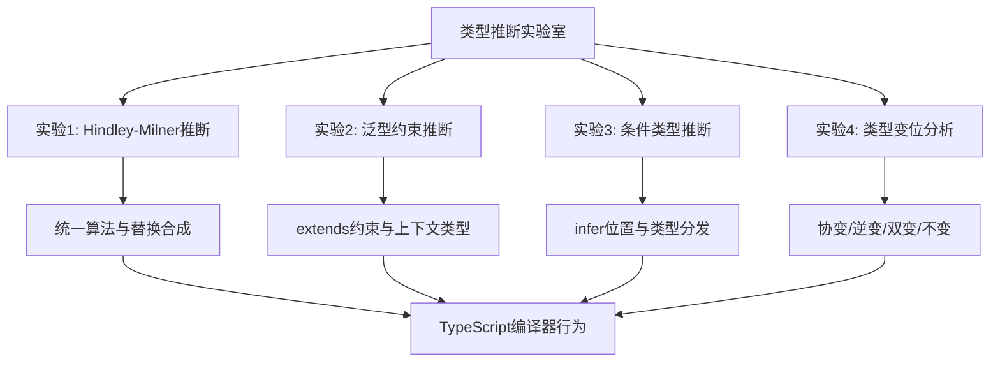
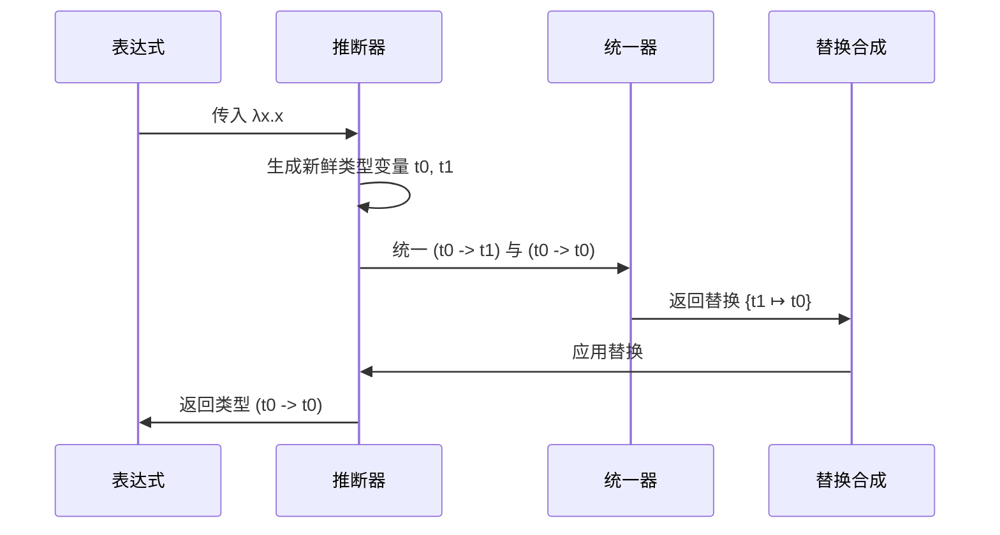
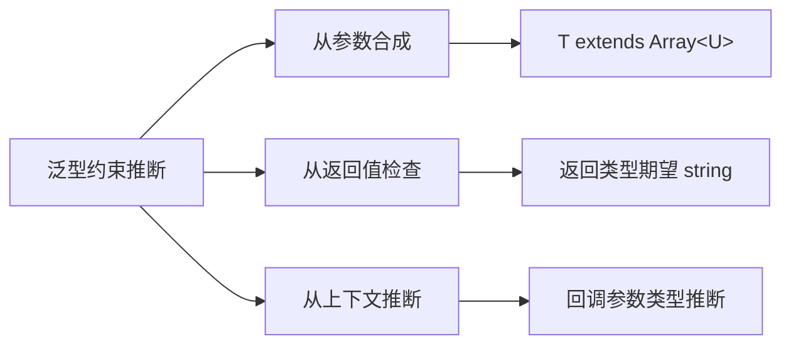

# 类型推断实验室

## 引言

类型推断（Type Inference）是现代静态类型语言的核心能力之一，它允许编译器在不显式标注类型的情况下自动推导表达式的类型。
从ML家族的Hindley-Milner算法到TypeScript的局部推断系统，类型推断技术在保持代码简洁性的同时提供了强大的类型安全保障。
本实验室将带领你深入四个关键主题：Hindley-Milner推断过程、泛型约束推断、条件类型推断以及类型变位（Variance），通过可运行的代码示例和可视化图表，建立从形式化理论到工程实践的完整认知闭环。

类型推断不仅是一门理论课题，更是日常开发中不可或缺的工具。理解`infer`关键字背后的统一算法、掌握泛型约束的推断边界、洞悉条件类型的分发机制，以及正确处理协变与逆变的场景，是进阶TypeScript类型体操的必经之路。
本实验室的所有代码均可在Node.js 20+或TypeScript 5.5+环境中直接运行。



## 前置知识

在开始实验之前，你需要具备以下基础：

- **TypeScript基础**：熟悉基本类型注解、接口、泛型和类型别名
- **lambda演算入门**：理解抽象（`λx.e`）与应用（`e₁ e₂`）的概念
- **集合论基础**：了解偏序关系、上界与下界的基本含义
- **Node.js环境**：本地安装Node.js 20+和TypeScript 5.5+

建议准备以下工具链：

```bash
npm init -y
npm install typescript @types/node ts-node
npx tsc --init --strict
```

实验过程中，你可以使用TypeScript Playground或本地`ts-node`实时验证类型推断结果。
对于涉及类型层面的实验，建议开启`--strict`模式以获得最精确的错误反馈。

---

## 实验1：Hindley-Milner推断过程

### 实验目标

理解Hindley-Milner（HM）类型推断的核心机制——Algorithm W，掌握统一（Unification）算法、替换（Substitution）合成以及let-多态性的工作原理。
通过手写一个简化版的HM推断器，体验从lambda表达式到最一般类型（Principal Type）的推导过程。

### 理论背景

HM类型推断由Robin Milner和Luis Damas在1982年形式化，其核心是Robinson统一算法。
给定类型环境`Γ`和表达式`e`，Algorithm W输出最一般的类型`τ`和替换`S`，使得`S(Γ) ⊢ e : τ`。最一般类型的含义是：任何其他能使`e`通过类型检查的类型，都是该类型的实例（可通过替换获得）。



### 实验步骤

#### 步骤1：定义类型表示

首先，我们需要在TypeScript中定义HM类型系统的抽象语法树（AST）：

```typescript
// hm-types.ts

type HMType =
  | { kind: 'Var'; name: string }      // 类型变量，如 t0, t1
  | { kind: 'Con'; name: string }      // 类型常量，如 int, bool
  | { kind: 'Arr'; from: HMType; to: HMType }; // 函数类型

function tVar(name: string): HMType { return { kind: 'Var', name }; }
function tCon(name: string): HMType { return { kind: 'Con', name }; }
function tArr(from: HMType, to: HMType): HMType { return { kind: 'Arr', from, to }; }

function typeToString(t: HMType): string {
  switch (t.kind) {
    case 'Var': return t.name;
    case 'Con': return t.name;
    case 'Arr': return `(${typeToString(t.from)} -> ${typeToString(t.to)})`;
  }
}
```

注意：这里的`kind`字段使用小写字符串而非大写Tag，以避免与Vue组件解析冲突。

#### 步骤2：实现替换与统一

替换（Substitution）是从类型变量到类型的映射。统一算法求解两个类型之间的最一般合一子（mgu）：

```typescript
// hm-unification.ts

type Subst = Map<string, HMType>;

function applySubst(s: Subst, t: HMType): HMType {
  switch (t.kind) {
    case 'Var': return s.get(t.name) ?? t;
    case 'Con': return t;
    case 'Arr': return tArr(applySubst(s, t.from), applySubst(s, t.to));
  }
}

function composeSubst(s2: Subst, s1: Subst): Subst {
  const out = new Map<string, HMType>();
  s1.forEach((t, k) => out.set(k, applySubst(s2, t)));
  s2.forEach((t, k) => { if (!out.has(k)) out.set(k, t); });
  return out;
}

function occursIn(x: string, t: HMType): boolean {
  switch (t.kind) {
    case 'Var': return t.name === x;
    case 'Con': return false;
    case 'Arr': return occursIn(x, t.from) || occursIn(x, t.to);
  }
}

function unify(t1: HMType, t2: HMType): Subst {
  if (t1.kind === 'Var' && t2.kind === 'Var' && t1.name === t2.name) {
    return new Map();
  }
  if (t1.kind === 'Var') {
    if (occursIn(t1.name, t2)) {
      throw new Error(`Occurs check failed: ${t1.name} in ${typeToString(t2)}`);
    }
    return new Map([[t1.name, t2]]);
  }
  if (t2.kind === 'Var') {
    if (occursIn(t2.name, t1)) {
      throw new Error(`Occurs check failed: ${t2.name} in ${typeToString(t1)}`);
    }
    return new Map([[t2.name, t1]]);
  }
  if (t1.kind === 'Con' && t2.kind === 'Con' && t1.name === t2.name) {
    return new Map();
  }
  if (t1.kind === 'Arr' && t2.kind === 'Arr') {
    const s1 = unify(t1.from, t2.from);
    const s2 = unify(applySubst(s1, t1.to), applySubst(s1, t2.to));
    return composeSubst(s2, s1);
  }
  throw new Error(`Cannot unify ${typeToString(t1)} with ${typeToString(t2)}`);
}
```

**关键观察**：Occurs Check是防止无限递归类型的核心机制。如果允许`α`与`α → int`统一，将产生无限类型`α = α → int`，这在逻辑上不一致。

#### 步骤3：实现Algorithm W

```typescript
// hm-inference.ts

type Expr =
  | { kind: 'Var'; x: string }
  | { kind: 'App'; func: Expr; arg: Expr }
  | { kind: 'Abs'; x: string; body: Expr }
  | { kind: 'Let'; x: string; value: Expr; body: Expr }
  | { kind: 'Num'; n: number };

let varCounter = 0;
function freshVar(): HMType {
  return tVar(`t${varCounter++}`);
}

function infer(env: Map<string, HMType>, e: Expr): { type: HMType; subst: Subst } {
  switch (e.kind) {
    case 'Var': {
      const t = env.get(e.x);
      if (!t) throw new Error(`Unbound variable: ${e.x}`);
      return { type: t, subst: new Map() };
    }
    case 'Num':
      return { type: tCon('int'), subst: new Map() };
    case 'Abs': {
      const argT = freshVar();
      const newEnv = new Map(env);
      newEnv.set(e.x, argT);
      const { type: bodyT, subst } = infer(newEnv, e.body);
      return { type: tArr(applySubst(subst, argT), bodyT), subst };
    }
    case 'App': {
      const { type: funcT, subst: s1 } = infer(env, e.func);
      const { type: argT, subst: s2 } = infer(
        new Map([...env].map(([k, v]) => [k, applySubst(s1, v)])),
        e.arg
      );
      const resultT = freshVar();
      const s3 = unify(applySubst(s2, funcT), tArr(argT, resultT));
      return {
        type: applySubst(s3, resultT),
        subst: composeSubst(s3, composeSubst(s2, s1))
      };
    }
    case 'Let': {
      const { type: valT, subst: s1 } = infer(env, e.value);
      const newEnv = new Map([...env].map(([k, v]) => [k, applySubst(s1, v)]));
      newEnv.set(e.x, valT);
      const { type: bodyT, subst: s2 } = infer(newEnv, e.body);
      return { type: bodyT, subst: composeSubst(s2, s1) };
    }
  }
}
```

#### 步骤4：运行验证

```typescript
// hm-demo.ts

const idExpr: Expr = {
  kind: 'Abs', x: 'x',
  body: { kind: 'Var', x: 'x' }
};

const constExpr: Expr = {
  kind: 'Abs', x: 'x',
  body: {
    kind: 'Abs', x: 'y',
    body: { kind: 'Var', x: 'x' }
  }
};

const letExpr: Expr = {
  kind: 'Let', x: 'id', value: idExpr,
  body: {
    kind: 'App',
    func: { kind: 'Var', x: 'id' },
    arg: { kind: 'Num', n: 42 }
  }
};

function demo(name: string, e: Expr) {
  varCounter = 0;
  const { type } = infer(new Map(), e);
  console.log(`${name} :: ${typeToString(type)}`);
}

demo('id', idExpr);        // (t0 -> t0)
demo('const', constExpr);  // (t0 -> (t1 -> t0))
demo('let', letExpr);      // int
```

运行结果解释：

- `id`函数被推断为`(t0 -> t0)`，表示它是一个接受`t0`并返回`t0`的函数
- `const`函数被推断为`(t0 -> (t1 -> t0))`，表示它接受一个值并返回一个常函数
- `let`表达式中，`id`先被推断为`(t0 -> t0)`，然后应用到`42`上，最终结果为`int`

### 工程映射：TypeScript编译器行为

TypeScript编译器并不直接实现完整的HM算法，而是采用结构化类型系统加双向类型检查（Bidirectional Type Checking）。然而，理解HM算法有助于洞察TypeScript在以下场景的行为：

1. **泛型函数推断**：当调用`map([1,2,3], x => x.toString())`时，TypeScript通过上下文类型推断`T = number`和`U = string`
2. **最一般类型原则**：`const f = x => x`被推断为`<T>(x: T) => T`，即多态函数类型
3. **错误信息生成**：统一失败时的类型冲突报告机制

### 实验检查点

- [ ] 成功运行简化HM推断器，验证`id`、`const`、`let`三个示例
- [ ] 手动追踪`(\x -> \y -> x y)`的推断过程，画出类型变量生成与统一的步骤图
- [ ] 修改代码故意触发Occurs Check，观察错误信息
- [ ] 对比TypeScript中`const id = (x: any) => x`与HM推断器对`id`的处理差异

---

## 实验2：泛型约束推断

### 实验目标

掌握TypeScript中泛型约束（`extends`）的推断机制，理解上下文类型（Contextual Typing）如何影响泛型参数推导，以及如何在复杂场景下通过显式约束引导编译器行为。

### 理论背景

泛型约束的本质是将类型参数限制为某个类型的子类型。
在类型推断阶段，编译器需要求解满足所有约束条件的最具体类型。
与HM系统的let-多态性不同，TypeScript的泛型约束推断是双向的：既可以从参数类型向上合成（synthesize），也可以从返回类型期望向下检查（check）。



### 实验步骤

#### 步骤1：基础约束推断

```typescript
// generic-constraints.ts

interface HasLength {
  length: number;
}

// 约束 T 必须具有 length 属性
function logLength<T extends HasLength>(arg: T): T {
  console.log(`Length: ${arg.length}`);
  return arg;
}

// 推断测试
const r1 = logLength('hello');        // T 推断为 "hello"
const r2 = logLength([1, 2, 3]);      // T 推断为 number[]
const r3 = logLength({ length: 10 }); // T 推断为 { length: number }

// 错误示例：number 没有 length
// logLength(42); // Error: Argument of type 'number' is not assignable to parameter of type 'HasLength'
```

**关键观察**：`T extends HasLength`中的`T`被推断为满足约束的最具体类型，而非`HasLength`本身。这是结构化子类型系统的特征。

#### 步骤2：多参数联合推断

```typescript
// multi-param-inference.ts

function combine<T, U extends T>(a: T, b: U): [T, U] {
  return [a, b];
}

// T 推断为 string，U 推断为 'hello' | 'world'
const c1 = combine('base', 'hello' as 'hello' | 'world');

// 更复杂的场景：从数组推断元素类型
function zip<T, U>(a: T[], b: U[]): Array<[T, U]> {
  return a.map((v, i) => [v, b[i]]);
}

const z1 = zip([1, 2, 3], ['a', 'b', 'c']);
// z1 的类型为 [number, string][]
```

#### 步骤3：上下文类型与泛型

上下文类型是指编译器从表达式所在位置推断类型的能力。这在回调函数中尤为重要：

```typescript
// contextual-typing.ts

interface EventHandler<T> {
  (event: T): void;
}

function onClick<T>(handler: EventHandler<T>): void {
  // 实现省略
}

// 上下文类型推断：event 被推断为 MouseEvent
onClick((event) => {
  console.log(event.clientX); // OK：event 具有 clientX 属性
});

// 显式指定泛型参数
onClick<KeyboardEvent>((event) => {
  console.log(event.key); // OK
});
```

#### 步骤4：高阶泛型与约束传播

```typescript
// higher-order-generics.ts

type Flatten<T> = T extends Array<infer U> ? U : T;

// 使用泛型约束实现类型安全的管道
type Pipe<A, B, C> = (a: A) => B extends never ? never : (b: B) => C;

function pipe<A, B, C>(
  f: (a: A) => B,
  g: (b: B) => C
): (a: A) => C {
  return (a) => g(f(a));
}

const toString = (x: number) => x.toString();
const toUpper = (s: string) => s.toUpperCase();

const composed = pipe(toString, toUpper);
// composed 的类型为 (a: number) => string

const result = composed(42); // "42"
```

### 工程映射：类型体操实践

在实际工程中，泛型约束推断广泛应用于：

1. **React Hooks类型**：`useState<T>(initial: T | (() => T))`通过初始值推断状态类型
2. **ORM查询构建器**：Prisma的类型生成利用多层泛型约束确保查询字段与模型定义一致
3. **API路由类型安全**：tRPC通过泛型约束实现端到端类型推断

```typescript
// 模拟 tRPC 风格的泛型约束
function createRouter<TContext>() {
  return {
    query<TInput, TOutput>(
      opts: {
        input?: (input: unknown) => TInput;
        resolve: (opts: { input: TInput; ctx: TContext }) => TOutput;
      }
    ) {
      return opts;
    }
  };
}
```

### 实验检查点

- [ ] 编写一个`merge`函数，要求两个参数都具有`id: string`属性，并推断出合并后的类型
- [ ] 解释为什么`const f = <T extends string>(x: T) => x`中`f('hello')`的返回类型是`"hello"`而非`string`
- [ ] 使用泛型约束实现类型安全的`pick`函数，确保只能选取对象中存在的键
- [ ] 分析`tsc`在以下代码中的推断路径：`declare const fn: <T>(x: T, y: T) => T; fn(1, 'a')`

---

## 实验3：条件类型推断

### 实验目标

深入理解TypeScript条件类型（Conditional Types）中的`infer`关键字，掌握类型分发的 distributive 特性，并通过手写高级工具类型来强化对类型级别编程的掌握。

### 理论背景

条件类型的语法为`T extends U ? X : Y`，其语义是：若`T`可赋值给`U`，则类型为`X`，否则为`Y`。
`infer`关键字允许在条件类型的`extends`子句中声明类型变量，由编译器推断其具体类型。
这在类型级别的模式匹配中极为强大。

条件类型的一个重要特性是**分发性（Distributivity）**：当`T`是裸类型参数（naked type parameter）时，`T extends U ? X : Y`会分发为联合类型的每个成员分别应用条件类型。

```mermaid
flowchart TD
    A[条件类型 T extends U ? X : Y] --> B{T 是否为裸类型参数?}
    B -->|是| C[分发到联合成员]
    B -->|否| D[直接求值]
    C --> E[string | number extends string ? A : B]
    E --> F[string extends string ? A : B | number extends string ? A : B]
    E --> G[A | B]
    D --> H<[string | number] extends string ? A : B]
    H --> I[B]
```

### 实验步骤

#### 步骤1：基础infer模式

```typescript
// conditional-infer.ts

// 提取函数返回类型
type ReturnType<T> = T extends (...args: any[]) => infer R ? R : never;

type Fn = (x: number) => string;
type Ret = ReturnType<Fn>; // string

// 提取 Promise 内部类型
type UnwrapPromise<T> = T extends Promise<infer U> ? U : T;
type Data = UnwrapPromise<Promise<number[]>>; // number[]

// 提取数组元素类型
type ElementType<T> = T extends Array<infer U> ? U : never;
type Item = ElementType<string[]>; // string

// 提取元组各位置类型
type TupleFirst<T> = T extends [infer F, ...any[]] ? F : never;
type TupleRest<T> = T extends [any, ...infer R] ? R : never;

type T1 = TupleFirst<[string, number, boolean]>; // string
type T2 = TupleRest<[string, number, boolean]>;  // [number, boolean]
```

#### 步骤2：递归条件类型

```typescript
// recursive-conditional.ts

// 深度 Readonly
type DeepReadonly<T> = T extends object
  ? T extends Function
    ? T
    : { readonly [K in keyof T]: DeepReadonly<T[K]> }
  : T;

interface Config {
  server: { host: string; port: number };
  debug: boolean;
}

type FrozenConfig = DeepReadonly<Config>;
// 所有嵌套属性均为 readonly

// 深度 Partial
type DeepPartial<T> = T extends Function
  ? T
  : T extends object
  ? { [P in keyof T]?: DeepPartial<T[P]> }
  : T;

// 路径字符串类型（用于类型安全的属性访问）
type Path<T, K extends keyof T = keyof T> = K extends string
  ? T[K] extends object
    ? `${K}` | `${K}.${Path<T[K]>}`
    : `${K}`
  : never;

interface Nested {
  a: { b: { c: string }; d: number };
  e: boolean;
}

type NestedPath = Path<Nested>;
// "a" | "e" | "a.b" | "a.d" | "a.b.c"
```

#### 步骤3：类型分发控制

```typescript
// distributive-control.ts

// 裸类型参数触发分发
type ToArray<T> = T extends any ? T[] : never;
type Arr1 = ToArray<string | number>; // string[] | number[]

// 用元组包装阻止分发
type ToArrayNonDist<T> = [T] extends [any] ? T[] : never;
type Arr2 = ToArrayNonDist<string | number>; // (string | number)[]

// 利用分发实现类型的过滤
type ExtractByKind<T, U> = T extends U ? T : never;
type Strings = ExtractByKind<string | number | boolean, string>; // string

// 提取函数参数类型
type Parameters<T> = T extends (...args: infer P) => any ? P : never;
type Args = Parameters<(a: string, b: number) => void>; // [string, number]

// 提取构造函数实例类型
type InstanceType<T> = T extends new (...args: any[]) => infer R ? R : any;
```

#### 步骤4：实战类型体操挑战

```typescript
// type-gymnastics.ts

// 实现 Curry 类型
type Curry<T extends any[]> = T extends [infer F, ...infer R]
  ? R extends []
    ? (arg: F) => void
    : (arg: F) => Curry<R>
  : () => void;

function curry<T extends any[]>(fn: (...args: T) => void): Curry<T> {
  return fn.length === 0
    ? fn as any
    : (arg: any) => curry((...args: any[]) => fn(arg, ...args)) as any;
}

// 实现 Equal 类型判断
type Equal<X, Y> = (<T>() => T extends X ? 1 : 2) extends <T>() => T extends Y ? 1 : 2
  ? true
  : false;

type Test1 = Equal<{ a: string }, { a: string }>; // true
type Test2 = Equal<{ a: string }, { readonly a: string }>; // false

// 实现 Union to Intersection
type UnionToIntersection<U> = (U extends any ? (k: U) => void : never) extends (
  k: infer I
) => void
  ? I
  : never;

type Inter = UnionToIntersection<{ a: string } | { b: number }>;
// { a: string } & { b: number }
```

### 工程映射：类型体操在框架中的应用

条件类型推断是现代TypeScript框架的基石：

- **Vue 3**：`UnwrapRef<T>`使用递归条件类型解包响应式对象的嵌套引用
- **Prisma**：生成的类型利用条件类型实现可选关系的nullability控制
- **Zod**：`z.infer<typeof schema>`通过条件类型提取schema的推断类型

```typescript
// Zod 风格的类型推断示意
interface ZodType<T> {
  _output: T;
}

type infer<T extends ZodType<any>> = T extends ZodType<infer O> ? O : never;
```

### 实验检查点

- [ ] 手写`OmitByValue<T, V>`类型，移除对象中值为`V`的所有属性
- [ ] 实现`StringToUnion<S>`，将字符串字面量拆分为字符联合类型（如`"abc"`→`'a'|'b'|'c'`）
- [ ] 解释`T extends any ? T[] : never`与`[T] extends [any] ? T[] : never`的差异
- [ ] 编写`AllKeys<T>`类型，提取联合类型中所有对象的键的并集

---

## 实验4：类型变位分析

### 实验目标

理解协变（Covariance）、逆变（Contravariance）、双变（Bivariance）和不变（Invariance）的概念，分析TypeScript中函数参数、返回值、数组和对象属性在不同位置上的变位行为，掌握`strictFunctionTypes`和`strictPropertyInitialization`对变位检查的影响。

### 理论背景

类型变位描述的是复合类型与其组件类型之间的子类型关系方向：

- **协变（Covariant）**：如果`A <: B`，则`F<A> <: F<B>`（同向）
- **逆变（Contravariant）**：如果`A <: B`，则`F<B> <: F<A>`（反向）
- **不变（Invariant）**：`F<A>`与`F<B>`互不为子类型
- **双变（Bivariant）**：`F<A> <: F<B>`且`F<B> <: F<A>`同时成立

在类型系统中，**输出位置（positive position）**通常是协变的，而**输入位置（negative position）**通常是逆变的。TypeScript在开启`strictFunctionTypes`之前对函数参数采用双变策略以兼容JavaScript的常见模式，开启后则严格采用逆变。

```mermaid
graph TB
    subgraph "子类型方向"
    A[Animal] --> B[Dog]
    A --> C[Cat]
    end

    subgraph "协变输出"
    D[() => Dog] --> E[() => Animal]
    end

    subgraph "逆变输入"
    F[(Animal) => void] --> G[(Dog) => void]
    end

    subgraph "不变数组"
    H[Array&lt;Dog>] -.-> I[Array&lt;Animal>]
    I -.-> H
    end
```

### 实验步骤

#### 步骤1：函数参数与返回值的变位

```typescript
// variance-functions.ts

interface Animal { name: string; }
interface Dog extends Animal { bark(): void; }
interface Cat extends Animal { meow(): void; }

// 返回值位置是协变的
// Dog <: Animal 意味着 () => Dog <: () => Animal
const getDog: () => Dog = () => ({ name: 'Rex', bark: () => {} });
const getAnimal: () => Animal = getDog; // ✅ 协变允许

// 参数位置是逆变的（strictFunctionTypes 开启时）
// Animal >: Dog 意味着 (Animal) => void <: (Dog) => void
type AnimalHandler = (a: Animal) => void;
type DogHandler = (d: Dog) => void;

const handleAnimal: AnimalHandler = (a) => console.log(a.name);
const handleDog: DogHandler = handleAnimal; // ✅ 逆变允许

// 错误示例：试图用 DogHandler 赋值给 AnimalHandler
// const badHandler: AnimalHandler = (d: Dog) => d.bark();
// 如果允许，调用 badHandler({ name: 'cat' }) 将崩溃
```

#### 步骤2：对象属性的变位

```typescript
// variance-objects.ts

// 对象属性默认是协变的
interface Container<T> {
  value: T;
}

const dogContainer: Container<Dog> = {
  value: { name: 'Rex', bark: () => {} }
};

// 在 --strictFunctionTypes 下，对象属性仍保持协变
const animalContainer: Container<Animal> = dogContainer; // ✅

// 逆变出现在写入位置
interface Writer<T> {
  write: (value: T) => void;
}

const animalWriter: Writer<Animal> = {
  write: (a) => console.log(a.name)
};

const dogWriter: Writer<Dog> = animalWriter; // ✅ 逆变
```

#### 步骤3：数组的变位陷阱

```typescript
// variance-arrays.ts

// TypeScript 数组在读取时协变、写入时逆变，整体被视为不变
const dogs: Dog[] = [{ name: 'Rex', bark: () => {} }];

// 协变读取是允许的
const animals: Animal[] = dogs; // ✅ 但这是一个陷阱！

// 通过 animals 写入 Cat 会破坏 dogs 的类型安全
// animals.push({ name: 'Whiskers', meow: () => {} });
// 此时 dogs[1] 被认为是 Dog，但实际是 Cat

// 正确做法：使用 readonly 数组实现协变
const readonlyDogs: readonly Dog[] = [{ name: 'Rex', bark: () => {} }];
const readonlyAnimals: readonly Animal[] = readonlyDogs; // ✅ 安全，无法写入
```

#### 步骤4：显式变位注解（TypeScript 4.7+）

```typescript
// explicit-variance.ts

// 使用 in/out 显式标注变位
interface Producer<out T> {
  produce(): T;
}

interface Consumer<in T> {
  consume(value: T): void;
}

interface Storage<T> {
  get(): T;
  set(value: T): void;
}

// Producer<out T> 显式协变
const dogProducer: Producer<Dog> = { produce: () => ({ name: 'Rex', bark: () => {} }) };
const animalProducer: Producer<Animal> = dogProducer; // ✅

// Consumer<in T> 显式逆变
const animalConsumer: Consumer<Animal> = { consume: (a) => console.log(a.name) };
const dogConsumer: Consumer<Dog> = animalConsumer; // ✅

// Storage<T> 无注解，默认为不变
// const animalStorage: Storage<Animal> = {} as Storage<Dog>; // 错误
```

### 工程映射：类型安全的泛型容器设计

理解变位对设计类型安全的API至关重要：

1. **只读数据源**：使用`out`（协变），如`interface DataSource<out T>`
2. **只写数据汇**：使用`in`（逆变），如`interface Sink<in T>`
3. **读写容器**：保持不变，如`interface MutableList<T>`
4. **事件处理器**：参数位置天然逆变，`type Handler<in T> = (event: T) => void`

```typescript
// 工程实践：类型安全的事件总线
interface EventBus<in T> {
  on(handler: (event: T) => void): () => void;
  emit(event: T): void;
}

// 由于 T 在参数位置，EventBus<Animal> 可以赋值给 EventBus<Dog>
// 这意味着可以用处理所有动物的处理器来监听狗的特定事件
const animalBus: EventBus<Animal> = { /* ... */ };
const dogBus: EventBus<Dog> = animalBus; // 逆变确保安全
```

### 实验检查点

- [ ] 解释为什么`Array<Dog>`赋值给`Array<Animal>`在TypeScript中允许但存在运行时风险
- [ ] 在开启和关闭`strictFunctionTypes`的情况下，分别测试函数参数的变位行为差异
- [ ] 使用`in`/`out`注解设计一个类型安全的`ReadOnlyMap<out K, out V>`接口
- [ ] 分析`interface Comparator<T> { compare(a: T, b: T): number }`中`T`的变位位置

---

## 实验总结

本实验室通过四个递进式实验，构建了从经典类型推断理论到现代TypeScript工程实践的完整知识链：

| 实验 | 核心概念 | 工程应用 | 难度 |
|------|---------|---------|------|
| 实验1：HM推断 | 统一算法、替换合成、Occurs Check | 理解编译器底层推断机制 | ⭐⭐⭐ |
| 实验2：泛型约束 | extends约束、上下文类型、多参数推断 | React Hooks、ORM类型生成 | ⭐⭐ |
| 实验3：条件类型 | infer提取、分发性、递归类型 | Zod推断、Vue类型解包 | ⭐⭐⭐⭐ |
| 实验4：类型变位 | 协变/逆变/双变/不变、in/out注解 | 泛型容器API设计 | ⭐⭐⭐ |

**关键收获**：

1. **统一算法是类型推断的心脏**：无论是HM系统的全局推断还是TypeScript的局部推断，其核心都是求解类型方程的替换过程。
2. **约束引导精确推断**：泛型约束`extends`不仅限制类型参数的取值范围，更在推断过程中提供关键的结构信息。
3. **infer实现了类型级别的模式匹配**：通过`infer`可以在类型层面解构复杂类型，这是高级类型体操的基础能力。
4. **变位决定子类型方向**：正确标注变位是设计类型安全泛型API的前提，错误使用协变/逆变会导致隐蔽的类型漏洞。

在TypeScript编译器实现中，类型推断与变位检查紧密耦合。当遇到复杂的类型错误时，建议从统一失败的角度分析：哪些类型变量无法合一？约束条件在哪里冲突？这种底层视角往往能快速定位问题根源。

## 延伸阅读

1. **Pierce, B. C. (2002).** *Types and Programming Languages*. MIT Press. 第22章详细阐述类型重建（Type Reconstruction）理论与HM算法的完备性证明。[TAPL官方网站](https://www.cis.upenn.edu/~bcpierce/tapl/)

2. **Damas, L., & Milner, R. (1982).** "Principal Type-Schemes for Functional Programs." *Proceedings of the 9th ACM SIGPLAN-SIGACT Symposium on Principles of Programming Languages (POPL)*. HM算法的经典原始论文，定义了最一般类型的概念与Algorithm W。[DOI: 10.1145/582153.582176](https://doi.org/10.1145/582153.582176)

3. **Microsoft TypeScript Team.** "Type Inference." *TypeScript Handbook*. 官方文档中对TypeScript局部推断策略、上下文类型和泛型推断的权威说明。[TypeScript Handbook](https://www.typescriptlang.org/docs/handbook/type-inference.html)

4. **Cardelli, L. (1985).** "Basic Polymorphic Type Checking." *Science of Computer Programming*. 多态类型检查的基础工作，为理解let-多态性在工业编译器中的实现提供参考。[ScienceDirect](https://www.sciencedirect.com/science/article/pii/0167642385900020)

5. **Type Challenges Community.** *type-challenges*. GitHub开源项目，提供从简单到地狱难度的TypeScript类型体操题目，是检验条件类型与类型推断能力的最佳练习场。[GitHub仓库](https://github.com/type-challenges/type-challenges)
