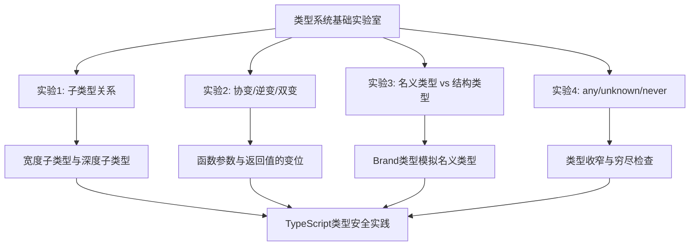
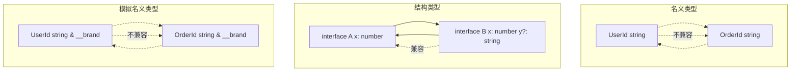
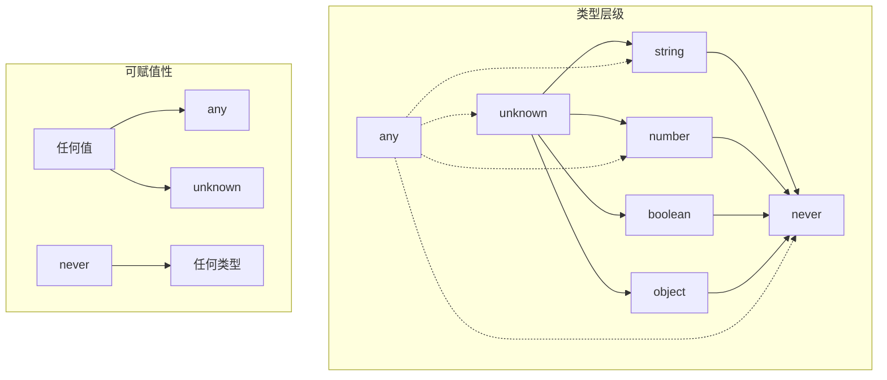

# 类型系统基础实验室

## 引言

类型系统是程序语言的静态护栏，它在编译阶段捕获潜在错误，提升代码的可维护性和可读性。
JavaScript的动态类型赋予开发者极大的灵活性，但也带来了运行时类型错误的隐患。
TypeScript通过在JavaScript之上构建一套结构化的静态类型系统，实现了灵活性与安全性的精妙平衡。

本实验室围绕类型系统的四个核心维度展开深度实验：子类型关系的判定与推导、变位（Variance）的协变/逆变/双变机制、名义类型与结构类型的哲学差异，以及`any`/`unknown`/`never`三剑客的安全使用模式。
这些概念不仅是类型理论的基石，更是日常开发中写出健壮TypeScript代码的必备知识。



## 前置知识

在开始实验之前，请确保你具备以下基础：

- **JavaScript基础类型**：熟悉`string`、`number`、`boolean`、`null`、`undefined`、`symbol`、`bigint`以及引用类型的行为差异
- **TypeScript基本语法**：能够编写接口、类型别名、联合类型和交叉类型
- **Node.js环境**：本地安装Node.js 20+和TypeScript 5.5+，建议开启`strict`模式

实验验证环境配置：

```bash
npm init -y
npm install typescript ts-node @types/node
npx tsc --init --strict --target ES2022
```

推荐在VS Code中安装TypeScript Importer和Error Lens插件，以获得实时的类型反馈。

---

## 实验1：子类型关系

### 实验目标

理解TypeScript结构化类型系统中的子类型（Subtyping）判定规则，掌握宽度子类型（Width Subtyping）、深度子类型（Depth Subtyping）以及函数子类型的判定逻辑。
通过手写类型兼容性检查函数，建立对"可赋值性（Assignability）"的直觉认知。

### 理论背景

在类型理论中，子类型关系`A <: B`（读作"A是B的子类型"）表示任何需要`B`的地方都可以安全地使用`A`。
TypeScript采用**结构化子类型（Structural Subtyping）**：两个类型的关系由其结构（成员）决定，而非由显式声明的继承关系决定。

子类型规则的核心直觉是**Liskov替换原则（LSP）**：如果`A <: B`，那么`A`的实例应当能够在不破坏程序正确性的前提下替换`B`的实例。

```mermaid
graph LR
    A[Animal] --> B[Dog]
    A --> C[Cat]
    D[ Animal ] --> E[ Dog | Cat ]
    B --> F[子类型: 更多属性]
    C --> F
    D --> G[联合类型: 更窄范围]
    E --> G
```

### 实验步骤

#### 步骤1：宽度子类型

宽度子类型规则：如果`A`包含`B`的所有属性（且类型兼容），则`A <: B`。这意味着子类型可以拥有比父类型更多的属性。

```typescript
// width-subtyping.ts

interface Point2D {
  x: number;
  y: number;
}

interface Point3D {
  x: number;
  y: number;
  z: number;
}

// Point3D 结构包含 Point2D 的所有属性
// 因此 Point3D <: Point2D
const p3d: Point3D = { x: 1, y: 2, z: 3 };
const p2d: Point2D = p3d; // ✅ 合法

function printPoint(p: Point2D): void {
  console.log(`(${p.x}, ${p.y})`);
}

printPoint(p3d); // ✅ 可以安全传递 Point3D

// 反向不成立：Point2D 缺少 z 属性
// const p3dAgain: Point3D = { x: 1, y: 2 }; // ❌ 错误
```

**关键观察**：结构化子类型中，"更多属性"意味着"更具体的约束"，因此在输入位置（期望Point2D时给Point3D）是安全的，因为调用方不会访问`z`属性。

#### 步骤2：深度子类型

深度子类型规则：对象属性的类型也遵循子类型关系递归判定。

```typescript
// depth-subtyping.ts

interface Config {
  server: {
    host: string;
    port: number;
  };
  debug: boolean;
}

interface DetailedConfig {
  server: {
    host: string;
    port: number;
    timeout: number; // 嵌套对象也拥有更多属性
  };
  debug: boolean;
  version: string;
}

const detailed: DetailedConfig = {
  server: { host: 'localhost', port: 3000, timeout: 5000 },
  debug: true,
  version: '1.0.0'
};

const base: Config = detailed; // ✅ 深度子类型成立

// 数组的深度子类型
interface AnimalConfig {
  items: Array<{ name: string }>;
}

interface DogConfig {
  items: Array<{ name: string; breed: string }>;
}

const dogCfg: DogConfig = {
  items: [{ name: 'Rex', breed: 'Husky' }]
};

// const animalCfg: AnimalConfig = dogCfg; // ❌ 数组元素类型是逆变的！
```

**陷阱警示**：数组元素的类型在写入位置是逆变的。虽然`{ name: string; breed: string } <: { name: string }`，但`Array<{ name: string; breed: string }>`**不**是`Array<{ name: string }>`的子类型，因为通过父类型数组可以写入缺少`breed`的对象。

#### 步骤3：函数子类型

函数类型的子类型规则由参数类型和返回类型共同决定：

- **返回类型协变**：如果`A <: B`，则`() => A <: () => B`
- **参数类型逆变**：如果`B <: A`，则`(a: A) => void <: (b: B) => void`

```typescript
// function-subtyping.ts

interface Animal { name: string; }
interface Dog extends Animal { bark(): void; }

// 返回值协变
const getDog: () => Dog = () => ({ name: 'Rex', bark: () => {} });
const getAnimal: () => Animal = getDog; // ✅ 返回值协变

// 参数逆变
const handleAnimal: (a: Animal) => void = (a) => console.log(a.name);
const handleDog: (d: Dog) => void = handleAnimal; // ✅ 参数逆变

// 错误示例：参数协变是危险的
// const badHandler: (a: Animal) => void = (d: Dog) => d.bark();
// badHandler({ name: 'Cat' }); // 运行时崩溃：没有 bark 方法
```

#### 步骤4：联合类型与交叉类型的子类型

```typescript
// union-intersection-subtyping.ts

// 联合类型：A | B 可赋值给 T，当且仅当 A <: T 且 B <: T
type AnimalUnion = Dog | Cat;
const animal: Animal = {} as AnimalUnion; // ✅

// 交叉类型：A & B 可赋值给 T，当且仅当 A <: T 或 B <: T
interface Named { name: string; }
interface Aged { age: number; }
type NamedAndAged = Named & Aged;
const named: Named = {} as NamedAndAged; // ✅

// never 是所有类型的子类型
const neverValue: never = [] as never;
const anyNum: number = neverValue; // ✅
const anyStr: string = neverValue; // ✅

// unknown 是所有类型的超类型
const unknownValue: unknown = 42;
// const num: number = unknownValue; // ❌ 需要类型收窄
```

### 工程映射：类型安全实践

理解子类型关系对以下场景至关重要：

1. **API设计**：接受"更宽泛"的类型作为参数，返回"更具体"的类型作为结果
2. **状态管理**：Redux的`Action`联合类型利用子类型关系实现类型安全分发
3. **组件props**：React组件的props接口设计遵循宽度子类型，允许传入额外属性

```typescript
// Redux风格的Action子类型
interface BaseAction { type: string; }
interface AddTodoAction extends BaseAction {
  type: 'ADD_TODO';
  payload: { text: string; id: number };
}

// 所有具体Action都是BaseAction的子类型
const reducer = (state: State, action: BaseAction) => {
  switch (action.type) {
    case 'ADD_TODO':
      // TypeScript自动将action收窄为AddTodoAction
      return [...state, action.payload];
  }
};
```

### 实验检查点

- [ ] 手动判断`{ a: { b: number; c: string }; d: boolean }`是否为`{ a: { b: number }; d: boolean }`的子类型，并用代码验证
- [ ] 解释为什么`Array<Dog>`不能赋值给`Array<Animal>`，但`() => Dog`可以赋值给`() => Animal`
- [ ] 编写一个类型安全的`assign`函数，要求目标对象必须是源对象的子类型（即源包含目标的所有属性）
- [ ] 分析`strictFunctionTypes`编译选项对函数参数变位行为的影响

---

## 实验2：协变、逆变、双变与不变

### 实验目标

深入理解类型变位的四种形态在TypeScript中的具体表现，掌握`strictFunctionTypes`选项的作用，学会识别不同语境下的变位方向，并能够使用显式变位注解（TypeScript 4.7+）设计类型安全的泛型接口。

### 理论背景

类型变位（Variance）描述复合类型`F<T>`随其类型参数`T`的子类型关系变化的规律。这一概念最初由Luca Cardelli在类型理论中形式化，对理解和设计泛型API至关重要。

| 变位类型 | 定义 | TypeScript示例 |
|---------|------|---------------|
| 协变（Covariant） | `A <: B` ⟹ `F<A> <: F<B>` | 返回值、只读属性、`out T` |
| 逆变（Contravariant） | `A <: B` ⟹ `F<B> <: F<A>` | 函数参数、`in T` |
| 双变（Bivariant） | 协变+逆变同时成立 | 旧版函数参数（无strictFunctionTypes） |
| 不变（Invariant） | 无子类型关系 | 可读写数组、`T`无修饰 |

```mermaid
flowchart LR
    subgraph 协变方向
    A[Dog] --> B[Animal]
    C[() => Dog] --> D[() => Animal]
    end
    subgraph 逆变方向
    E[Dog] --> F[Animal]
    G[(Animal) => void] --> H[(Dog) => void]
    end
    subgraph 双变危险区
    I[Dog] --> J[Animal]
    K[(Dog) => void] -.-> L[(Animal) => void]
    L -.-> K
    end
```

### 实验步骤

#### 步骤1：协变的场景

输出位置（函数返回值、只读属性）天然是协变的，因为更具体的返回值总可以替代更宽泛的期望。

```typescript
// covariance.ts

interface Animal { name: string; }
interface Dog extends Animal { bark(): void; }

// 1. 函数返回值协变
const getDog: () => Dog = () => ({ name: 'Rex', bark: () => {} });
const getAnimal: () => Animal = getDog; // ✅

// 2. 只读属性协变
interface ReadonlyContainer<T> {
  readonly value: T;
}
const dogBox: ReadonlyContainer<Dog> = { value: { name: 'Rex', bark: () => {} } };
const animalBox: ReadonlyContainer<Animal> = dogBox; // ✅

// 3. 联合类型协变
function processAnimals(animals: Animal[]): void {
  animals.forEach(a => console.log(a.name));
}
const dogs: Dog[] = [{ name: 'Rex', bark: () => {} }];
// processAnimals(dogs); // 允许但危险（写入问题）
```

#### 步骤2：逆变的场景

输入位置（函数参数）天然是逆变的，因为能接受更宽泛输入的函数，一定能处理更具体的输入。

```typescript
// contravariance.ts

// 逆变：能处理Animal的处理器，一定能处理Dog
type AnimalHandler = (animal: Animal) => void;
type DogHandler = (dog: Dog) => void;

const processAnyAnimal: AnimalHandler = (a) => console.log(a.name);
const processDog: DogHandler = processAnyAnimal; // ✅ 逆变

// 实际应用：事件监听器的类型安全
interface Event<T> {
  data: T;
}

type EventListener<T> = (event: Event<T>) => void;

const animalListener: EventListener<Animal> = (e) => console.log(e.data.name);
const dogListener: EventListener<Dog> = animalListener; // ✅ 逆变

// 反向赋值会暴露问题
// const badListener: EventListener<Animal> = (e: Event<Dog>) => e.data.bark();
// badListener({ data: { name: 'Cat' } }); // 崩溃
```

#### 步骤3：双变的历史包袱

在`strictFunctionTypes`开启之前，TypeScript对函数参数采用双变策略以保持与JavaScript常见模式的兼容性。这虽然方便，但牺牲了类型安全。

```typescript
// bivariance.ts

// 关闭 strictFunctionTypes 时，以下代码通过编译但运行时危险
interface Callback<T> {
  (item: T): void; // 方法声明语法触发双变
}

// 开启 strictFunctionTypes 后，Callback<Animal> 和 Callback<Dog> 严格逆变
// 关闭时，它们互为子类型（双变）

// 典型的双变陷阱：EventEmitter
class EventEmitter<T> {
  private listeners: Array<(item: T) => void> = [];

  on(listener: (item: T) => void): void {
    this.listeners.push(listener);
  }

  emit(item: T): void {
    this.listeners.forEach(l => l(item));
  }
}

// 双变允许以下危险代码通过
const emitter = new EventEmitter<Animal>();
// emitter.on((dog: Dog) => dog.bark()); // strictFunctionTypes 下报错
// emitter.emit({ name: 'Cat' }); // 如果允许上一行，此处崩溃
```

#### 步骤4：显式变位注解

TypeScript 4.7引入`in`和`out`修饰符，允许开发者为接口和类型别名的类型参数显式指定变位。

```typescript
// explicit-variance.ts

// out: 显式协变，T只能出现在输出位置
interface Producer<out T> {
  produce(): T;
  // produce(value: T): void; // ❌ T在输入位置，与out冲突
}

// in: 显式逆变，T只能出现在输入位置
interface Consumer<in T> {
  consume(value: T): void;
  // get(): T; // ❌ T在输出位置，与in冲突
}

// 无修饰：默认不变
interface Storage<T> {
  get(): T;
  set(value: T): void;
}

// 验证
const dogProducer: Producer<Dog> = { produce: () => ({ name: 'Rex', bark: () => {} }) };
const animalProducer: Producer<Animal> = dogProducer; // ✅ out T 允许协变

const animalConsumer: Consumer<Animal> = { consume: (a) => console.log(a.name) };
const dogConsumer: Consumer<Dog> = animalConsumer; // ✅ in T 允许逆变
```

### 工程映射：类型安全的泛型设计

正确运用变位知识可以设计出既灵活又安全的泛型API：

1. **数据流接口**：数据源用`out T`，数据汇用`in T`
2. **比较器**：`Comparator<T>`中`T`在参数位置，天然逆变
3. **回调注册**：事件系统的监听器类型应利用逆变确保类型安全

```typescript
// 类型安全的RxJS风格Observable示意
interface Observable<out T> {
  subscribe(observer: Observer<T>): Subscription;
}

interface Observer<in T> {
  next(value: T): void;
  error(err: any): void;
  complete(): void;
}

// Observable<Dog> 可以赋值给 Observable<Animal>（协变）
// Observer<Animal> 可以赋值给 Observer<Dog>（逆变）
// 这意味着：可以用通用的Animal观察者来监听Dog流
```

### 实验检查点

- [ ] 在开启`strictFunctionTypes`的情况下，验证函数参数是逆变的；关闭后观察双变行为
- [ ] 解释为什么`interface A<T> { f: (x: T) => void }`和`interface B<T> { f(x: T): void }`在变位行为上不同
- [ ] 使用`in`/`out`注解设计一个类型安全的`ReadableStream<out T>`和`WritableStream<in T>`
- [ ] 分析`interface Mapper<T, U> { map(value: T): U }`中`T`和`U`的变位方向

---

## 实验3：名义类型 vs 结构类型

### 实验目标

理解TypeScript默认的结构类型（Structural Typing）与名义类型（Nominal Typing）的本质区别，掌握在TypeScript中模拟名义类型的多种技术（Brand类型、私有字段、交叉类型），并能够根据场景选择合适的类型策略。

### 理论背景

类型系统判定两个类型是否兼容的方式主要分为两种哲学：

- **名义类型（Nominal Typing）**：类型的同一性由其名称/声明位置决定。即使两个类型结构完全相同，只要名称不同就不兼容。Java、C#、Rust采用此策略。
- **结构类型（Structural Typing）**：类型的同一性由其结构（成员）决定。只要两个类型具有相同的成员，它们就是兼容的。TypeScript、Go、OCaml采用此策略。



### 实验步骤

#### 步骤1：体验结构类型的行为

```typescript
// structural-typing.ts

interface Point2D {
  x: number;
  y: number;
}

interface Vector2D {
  x: number;
  y: number;
}

// 尽管名称不同，结构相同意味着兼容
const point: Point2D = { x: 1, y: 2 };
const vector: Vector2D = point; // ✅ 合法

// 甚至匿名对象也兼容
const anonymous = { x: 3, y: 4 };
const p2: Point2D = anonymous; // ✅ 合法

// 宽度子类型：更多属性依然兼容
const enriched = { x: 5, y: 6, label: 'A' };
const p3: Point2D = enriched; // ✅ 合法
```

**结构类型的优势**：灵活、无需显式适配器、与JavaScript的动态特性天然契合。

**结构类型的劣势**：无法区分语义不同但结构相同的类型（如`UserId`和`OrderId`），可能导致混淆性错误。

#### 步骤2：模拟名义类型——Brand类型

Brand类型通过在结构类型中嵌入一个唯一的标记来模拟名义类型的区分性。

```typescript
// brand-types.ts

// 基础Brand类型
type Brand<K, T> = T & { readonly __brand: K };

type UserId = Brand<'UserId', string>;
type OrderId = Brand<'OrderId', string>;

function UserId(id: string): UserId {
  return id as UserId;
}

function OrderId(id: string): OrderId {
  return id as OrderId;
}

const uid = UserId('u-123');
const oid = OrderId('o-456');

function fetchUser(id: UserId): void {
  console.log(`Fetching user ${id}`);
}

fetchUser(uid);   // ✅
// fetchUser(oid); // ❌ 编译错误：OrderId 不能赋值给 UserId

// 基础Brand无法防止同类型的任意string赋值
// const fakeId: UserId = 'fake' as UserId; // 可以强制转换，但Brand提供了类型边界
```

#### 步骤3：使用unique symbol增强Brand

```typescript
// unique-symbol-brand.ts

declare const UserIdBrand: unique symbol;
declare const OrderIdBrand: unique symbol;

type UserId = string & { readonly [UserIdBrand]: true };
type OrderId = string & { readonly [OrderIdBrand]: true };

function UserId(id: string): UserId {
  return id as UserId;
}

function OrderId(id: string): OrderId {
  return id as OrderId;
}

// unique symbol 提供了更强的类型隔离
// 即使两个Brand都是基于string，它们也完全不兼容

interface Database {
  users: Map<UserId, User>;
  orders: Map<OrderId, Order>;
}

function lookupUser(db: Database, id: UserId): User | undefined {
  return db.users.get(id); // 类型安全：不可能传入 OrderId
}
```

#### 步骤4：私有字段与名义类型

ES2022的私有字段（`#field`）由于在不同类之间即使同名也不相同，天然具有名义类型的特征。

```typescript
// private-field-nominal.ts

class UserId {
  readonly #brand!: void; // 永不赋值的私有字段
  constructor(readonly value: string) {}
}

class OrderId {
  readonly #brand!: void;
  constructor(readonly value: string) {}
}

const userId = new UserId('u-123');
const orderId = new OrderId('o-456');

function processUser(id: UserId): void {
  console.log(id.value);
}

processUser(userId);   // ✅
// processUser(orderId); // ❌ 编译错误：类型不兼容

// 优势：无需类型断言，纯运行时构造
// 劣势：引入类实例的开销，不适合高频创建的场景
```

### 工程映射：类型安全实践

在实际工程中，选择结构类型还是名义类型取决于语义区分的需求：

| 场景 | 推荐策略 | 理由 |
|------|---------|------|
| 领域标识符（ID） | `unique symbol` Brand | 防止ID混淆，编译器强制区分 |
| 数据传输对象（DTO） | 结构类型 | 灵活映射，减少转换层 |
| 状态机状态 | 名义类型模拟 | 明确状态转换约束 |
| 物理单位（米/秒） | Brand类型 | 防止单位运算错误 |

```typescript
// 工程案例：类型安全的单位系统
type Meters = Brand<'Meters', number>;
type Seconds = Brand<'Seconds', number>;
type MetersPerSecond = Brand<'MetersPerSecond', number>;

function Meters(n: number): Meters { return n as Meters; }
function Seconds(n: number): Seconds { return n as Seconds; }

function velocity(distance: Meters, time: Seconds): MetersPerSecond {
  return (distance / time) as MetersPerSecond;
}

const d = Meters(100);
const t = Seconds(10);
const v = velocity(d, t); // ✅
// velocity(t, d); // ❌ 编译错误：参数顺序错误
```

### 实验检查点

- [ ] 解释为什么TypeScript选择结构类型而非名义类型作为默认策略
- [ ] 比较`type Brand<K, T> = T & { __brand: K }`与`unique symbol` Brand在类型隔离强度上的差异
- [ ] 设计一个类型安全的`Money<Currency>`类型，确保`Money<'USD'>`与`Money<'EUR'>`不能混用
- [ ] 分析私有字段模拟名义类型的运行时开销，并提出优化方案

---

## 实验4：any、unknown 与 never

### 实验目标

辨析`any`、`unknown`和`never`三个特殊类型的语义差异与安全使用模式，掌握基于`unknown`的类型守卫（Type Guard）技术，理解`never`在穷尽性检查（Exhaustiveness Checking）中的作用，并建立"渐进类型化（Gradual Typing）"的正确观念。

### 理论背景

`any`、`unknown`和`never`构成了TypeScript类型系统的三个极端：

- **`any`**：顶类型（Top Type）的逃逸舱口，禁用所有类型检查。它是渐进类型化的核心机制，允许JavaScript代码逐步迁移到TypeScript。
- **`unknown`**：类型安全的顶类型。所有类型都可赋值给`unknown`，但在使用`unknown`值之前必须进行类型收窄。
- **`never`**：底类型（Bottom Type）。没有任何值属于`never`类型（除了`never`本身），它是空联合类型的自然结果，也是类型不可达性的表达。



### 实验步骤

#### 步骤1：any 的便利与危险

```typescript
// any-dangers.ts

// any 接受任何值
let anything: any = 42;
anything = 'hello';
anything = { nested: { value: true } };

// 危险：any 禁用所有检查
const result = anything.does.not.exist; // 编译通过，运行时崩溃

// any 具有传染性
function processAny(x: any): any {
  return x.map((item: any) => item.toFixed(2));
}

// 传入非数组也不会报错
processAny('not an array'); // 编译通过，运行时崩溃

// 隐式 any 的陷阱（关闭 noImplicitAny 时）
// function add(a, b) { return a + b; } // a, b 隐式推断为 any
```

**使用准则**：仅在以下场景使用`any`：

1. 从JS迁移的过渡代码
2. 第三方库缺少类型定义
3. 需要动态性极高的元编程场景

#### 步骤2：unknown 的安全屏障

```typescript
// unknown-safety.ts

// unknown 接受任何值
let safeValue: unknown = 42;
safeValue = 'hello';
safeValue = [1, 2, 3];

// 但使用 unknown 前必须进行类型收窄
// safeValue.toFixed(2); // ❌ 编译错误

// 类型收窄方式1：typeof
try {
  const parsed: unknown = JSON.parse('{"name": "Alice"}');
  if (typeof parsed === 'object' && parsed !== null && 'name' in parsed) {
    console.log((parsed as { name: string }).name); // ✅
  }
} catch { /* ... */ }

// 类型收窄方式2：自定义类型守卫
interface ApiResponse<T> {
  data: T;
  status: number;
}

function isApiResponse<T>(
  value: unknown,
  validateData: (data: unknown) => data is T
): value is ApiResponse<T> {
  return (
    typeof value === 'object' &&
    value !== null &&
    'data' in value &&
    'status' in value &&
    typeof (value as any).status === 'number' &&
    validateData((value as any).data)
  );
}

// 类型收窄方式3：Zod等运行时验证库
// import { z } from 'zod';
// const schema = z.object({ name: z.string() });
// const result = schema.parse(unknownValue);
```

#### 步骤3：never 的穷尽性检查

```typescript
// never-exhaustiveness.ts

// never 用于确保 switch 穷尽所有分支
type Shape =
  | { kind: 'circle'; radius: number }
  | { kind: 'rectangle'; width: number; height: number }
  | { kind: 'square'; size: number };

function area(shape: Shape): number {
  switch (shape.kind) {
    case 'circle':
      return Math.PI * shape.radius ** 2;
    case 'rectangle':
      return shape.width * shape.height;
    case 'square':
      return shape.size ** 2;
    default:
      // 如果未来添加新的 Shape 变体而忘记处理，此处编译报错
      const _exhaustive: never = shape;
      return _exhaustive;
  }
}

// never 在类型运算中的应用
type RemoveString<T> = T extends string ? never : T;
type NoStrings = RemoveString<string | number | boolean>; // number | boolean

// 利用 never 实现集合差
type Diff<T, U> = T extends U ? never : T;
type Remaining = Diff<'a' | 'b' | 'c', 'a' | 'c'>; // 'b'
```

#### 步骤4：any、unknown、never 的对比实验

```typescript
// comparison-table.ts

// 赋值方向测试
const anyValue: any = 42;
const unknownValue: unknown = 42;
const neverValue: never = 42 as never;

// 向上赋值（给更宽泛的类型）
const a1: unknown = anyValue;   // ✅
const a2: unknown = unknownValue; // ✅
const a3: unknown = neverValue;   // ✅

// 向下赋值（给更具体的类型）
const b1: string = anyValue;      // ✅ any 可以赋值给任何类型
// const b2: string = unknownValue; // ❌ unknown 不能向下赋值
const b3: string = neverValue;    // ✅ never 可以赋值给任何类型

// 成员访问
anyValue.anything.goes();     // ✅ any 允许任意访问
// unknownValue.anything;     // ❌ unknown 禁止访问
// neverValue.anything;       // ✅ never 允许（理论上不可达）

// 函数参数逆变中的 never
// (x: never) => void 是任何函数类型的超类型
const acceptNever: (x: never) => void = (x: string) => {};
// 这意味着可以用处理 never 的函数替代处理具体类型的函数
```

### 工程映射：渐进类型化与类型安全

在实际工程中，正确使用这三个类型对代码质量有决定性影响：

1. **`unknown`替代`any`**：在API边界（JSON解析、HTTP响应、用户输入）使用`unknown`强制进行验证后再使用
2. **`never`保障穷尽性**：在Redux reducer、状态机、AST遍历等场景使用穷尽检查防止遗漏分支
3. **逐步消除`any`**：通过`noExplicitAny`和类型守卫，逐步将遗留代码中的`any`替换为精确类型

```typescript
// 工程最佳实践：API边界类型安全
async function fetchUser(id: string): Promise<unknown> {
  const response = await fetch(`/api/users/${id}`);
  return response.json(); // 返回 unknown，而非 any
}

interface User {
  id: string;
  name: string;
  email: string;
}

function isUser(value: unknown): value is User {
  return (
    typeof value === 'object' &&
    value !== null &&
    'id' in value &&
    'name' in value &&
    'email' in value &&
    typeof (value as any).id === 'string' &&
    typeof (value as any).name === 'string' &&
    typeof (value as any).email === 'string'
  );
}

// 使用
const data = await fetchUser('123');
if (isUser(data)) {
  console.log(data.name); // ✅ 类型收窄为 User
} else {
  console.error('Invalid user data');
}
```

### 实验检查点

- [ ] 将一段使用`any`的代码重构为使用`unknown`+类型守卫的版本
- [ ] 解释为什么`(x: never) => void`是所有函数类型的超类型
- [ ] 编写一个`assertNever`工具函数，用于在开发时捕获未处理的联合类型分支
- [ ] 比较`noImplicitAny`与`strict`编译选项对`any`行为的影响

---

## 实验总结

本实验室从四个维度构建了TypeScript类型系统的核心认知框架：

| 实验 | 核心主题 | 关键技能 | 工程价值 |
|------|---------|---------|---------|
| 实验1：子类型关系 | 宽度/深度子类型、函数子类型 | 类型兼容性判断 | API设计、组件接口 |
| 实验2：变位 | 协变/逆变/双变/不变 | 变位方向识别 | 泛型容器、事件系统 |
| 实验3：名义vs结构 | Brand类型、unique symbol | 语义类型隔离 | ID系统、单位安全 |
| 实验4：any/unknown/never | 类型守卫、穷尽检查 | 渐进类型化实践 | API边界安全 |

**关键收获**：

1. **结构化子类型是TypeScript的灵魂**：理解"结构相同即兼容"的原则，能够避免过度使用类型断言，同时利用Brand技术在需要时模拟名义类型的安全性。
2. **变位决定泛型API的安全边界**：正确标注`in`和`out`不仅提升类型精度，还能在接口设计阶段就预防类型漏洞。
3. **`unknown`是`any`的类型安全替代品**：在一切外部数据入口使用`unknown`，配合类型守卫或Zod等验证库，是实现运行时类型安全的最小可行方案。
4. **`never`是类型系统的哨兵**：它不仅表示不可达代码，更是编译期穷尽性检查的利器，确保代码随需求演进仍保持完整。

类型系统不是束缚，而是契约。掌握这些基础概念后，你将能够设计出既符合JavaScript灵活传统、又具备静态类型安全的现代TypeScript应用架构。

## 延伸阅读

1. **Pierce, B. C. (2002).** *Types and Programming Languages*. MIT Press. 第15章系统阐述子类型关系的理论基础，包括宽度与深度子类型的形式化定义。[TAPL官方网站](https://www.cis.upenn.edu/~bcpierce/tapl/)

2. **Microsoft TypeScript Team.** "Type Compatibility." *TypeScript Handbook*. 官方对TypeScript结构化类型系统与类型兼容性规则的权威文档。[TypeScript Handbook](https://www.typescriptlang.org/docs/handbook/type-compatibility.html)

3. **Mozilla Developer Network.** "JavaScript Data Types and Data Structures." MDN Web Docs. 对JavaScript运行时类型系统的完整参考，是理解TypeScript静态类型底层语义的基础。[MDN文档](https://developer.mozilla.org/en-US/docs/Web/JavaScript/Data_structures)

4. **Axel Rauschmayer.** *Exploring JavaScript: Deep JavaScript*. 深入剖析JavaScript原始类型与对象类型的本质差异，帮助理解`typeof`行为和原型链机制。[ExploringJS](https://exploringjs.com/deep-js/ch_types-values-variables.html)

5. **TC39.** *ECMAScript 2025 Language Specification — ECMAScript Data Types and Values*. ECMAScript标准对语言类型的正式定义，是理解JavaScript类型语义的最权威来源。[ECMA-262](https://tc39.es/ecma262/#sec-ecmascript-data-types-and-values)
