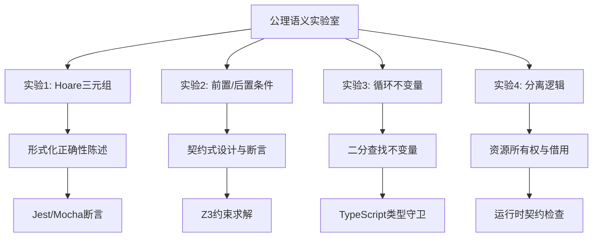
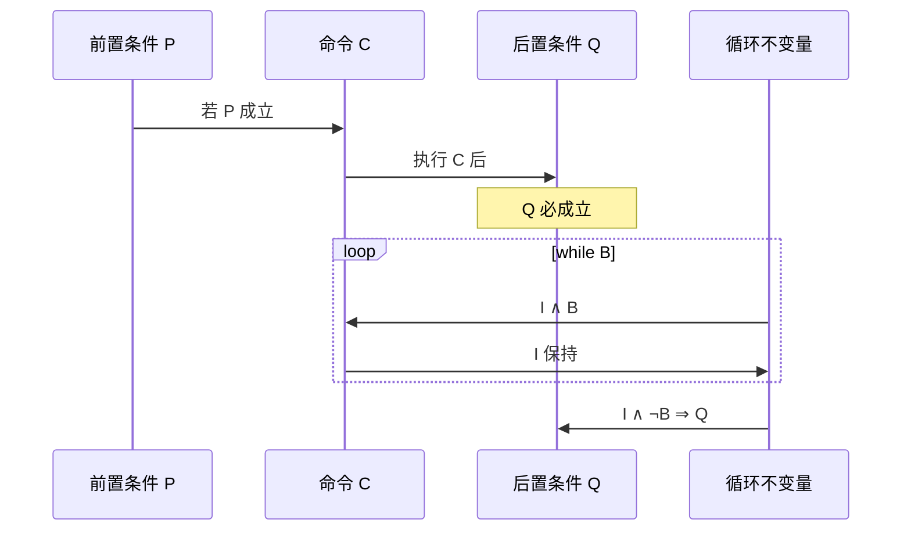
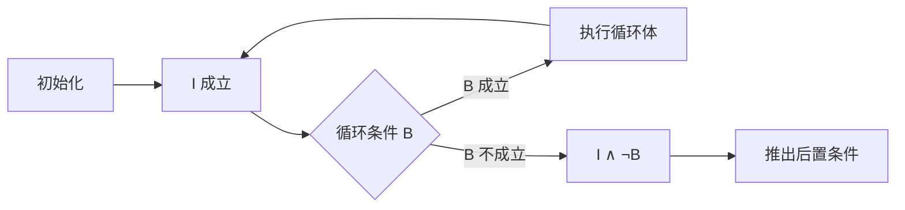
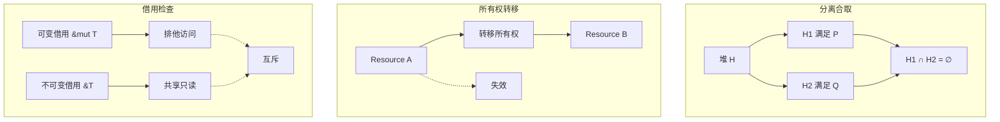

# 公理语义实验室

## 引言

公理语义学（Axiomatic Semantics）是形式语义学的三大支柱之一，它通过逻辑断言精确描述程序的正确性。与自然语言规范相比，公理语义消除了歧义，使程序正确性的数学证明成为可能。从Tony Hoare在1969年提出的Hoare三元组，到Dijkstra的最弱前置条件演算，再到现代分离逻辑（Separation Logic）对堆内存的精确推理，公理语义的思想已渗透到软件工程的方方面面。

本实验室将公理语义的理论转化为四个可动手实践的实验：Hoare三元组的形式化表达、前置条件与后置条件的契约式设计、循环不变量的发现与验证，以及分离逻辑的资源所有权模型。每个实验都将理论与TypeScript/JavaScript工程实践紧密映射，展示如何用Jest/Mocha断言实现运行时契约检查、如何用Z3约束求解器进行自动化验证，以及如何用TypeScript类型守卫表达逻辑前提。



## 前置知识

在开始实验之前，你需要具备以下基础：

- **一阶逻辑基础**：理解全称量词`∀`、存在量词`∃`、逻辑蕴含`⇒`和等价`⇔`
- **TypeScript/TypeScript基础**：能够编写类和接口，理解私有字段和类型守卫
- **单元测试经验**：熟悉Jest或Mocha的基本断言用法
- **Node.js环境**：本地安装Node.js 20+和TypeScript 5.5+

实验环境准备：

```bash
npm init -y
npm install typescript ts-node @types/node jest @types/jest ts-jest
npx tsc --init --strict
```

对于涉及Z3的实验，建议安装Python版的Z3或JavaScript绑定`z3-solver`：

```bash
npm install z3-solver
```

---

## 实验1：Hoare三元组

### 实验目标

理解Hoare三元组`{P} C {Q}`的语义与推理规则，掌握在代码中以注释形式表达形式化规范的方法，并通过运行时断言将逻辑契约转化为可执行的检查。

### 理论背景

Hoare三元组由Tony Hoare于1969年在论文"An Axiomatic Basis for Computer Programming"中提出。其形式为：

```
{P} C {Q}
```

含义是：如果程序状态满足前置条件`P`，执行命令`C`后若程序终止，则终止状态必满足后置条件`Q`。

核心推理规则包括：

| 规则 | 形式 | 含义 |
|------|------|------|
| 赋值公理 | `{Q[E/x]} x := E {Q}` | 赋值后Q成立，当且仅当用E替换x后的Q在赋值前成立 |
| 顺序组合 | `{P} C1 {R}, {R} C2 {Q} ⊢ {P} C1; C2 {Q}` | 中间断言连接两个命令 |
| 条件规则 | `{P∧B} C1 {Q}, {P∧¬B} C2 {Q} ⊢ {P} if B then C1 else C2 {Q}` | 两个分支到达相同后置条件 |
| 循环规则 | `{P∧B} C {P} ⊢ {P} while B do C {P∧¬B}` | 循环不变量P在迭代中保持 |



### 实验步骤

#### 步骤1：基础Hoare风格的代码注释

```typescript
// hoare-style-comments.ts

/**
 * 计算两个整数的最大值
 * { true }                    // 前置：无特殊要求
 * max(a, b)
 * { result >= a ∧ result >= b ∧ (result = a ∨ result = b) }
 */
function max(a: number, b: number): number {
  // { true }
  if (a > b) {
    // { a > b }
    return a;
    // { result = a ∧ a > b ⇒ result >= a ∧ result >= b }
  } else {
    // { a <= b }
    return b;
    // { result = b ∧ a <= b ⇒ result >= a ∧ result >= b }
  }
  // { result >= a ∧ result >= b ∧ (result = a ∨ result = b) }
}

/**
 * 交换两个变量的值（通过返回元组）
 * { x = X ∧ y = Y }
 * swap(x, y)
 * { result[0] = Y ∧ result[1] = X }
 */
function swap<T>(x: T, y: T): [T, T] {
  // { x = X ∧ y = Y }
  const temp = x;
  // { temp = X ∧ y = Y }
  x = y as any; // 在纯函数中通过返回实现
  // { temp = X ∧ x = Y }
  y = temp as any;
  // { x = Y ∧ y = X }
  return [y, x];
  // { result[0] = Y ∧ result[1] = X }
}
```

**关键观察**：Hoare注释不是可执行代码，而是程序逻辑的数学规格说明。它们帮助开发者精确思考代码的契约。

#### 步骤2：运行时Hoare断言

将Hoare三元组转化为运行时检查的契约函数：

```typescript
// runtime-hoare.ts

class ContractError extends Error {
  constructor(
    public readonly kind: 'pre' | 'post' | 'invariant',
    message: string
  ) {
    super(`Contract violation (${kind}): ${message}`);
  }
}

/**
 * 前置条件断言：{ P }
 * 若 predicate 不成立，抛出 ContractError
 */
function requires<T>(
  predicate: (value: T) => boolean,
  message: string
): (value: T) => T {
  return (value) => {
    if (!predicate(value)) {
      throw new ContractError('pre', message);
    }
    return value;
  };
}

/**
 * 后置条件包装器：{ P } C { Q }
 * 对函数 C 的结果进行断言
 */
function ensures<TArgs extends any[], TReturn>(
  fn: (...args: TArgs) => TReturn,
  predicate: (result: TReturn, ...args: TArgs) => boolean,
  message: string
): (...args: TArgs) => TReturn {
  return (...args) => {
    const result = fn(...args);
    if (!predicate(result, ...args)) {
      throw new ContractError('post', message);
    }
    return result;
  };
}

// 应用示例：带契约的除法
/**
 * { divisor ≠ 0 }
 * divide(dividend, divisor)
 * { result * divisor = dividend }
 */
const safeDivide = ensures(
  (dividend: number, divisor: number): number => {
    requires<number>(
      (d) => d !== 0,
      'Divisor must not be zero'
    )(divisor);
    return dividend / divisor;
  },
  (result, dividend, divisor) => Math.abs(result * divisor - dividend) < 1e-10,
  'Division postcondition failed'
);

console.log(safeDivide(10, 2)); // 5
try {
  safeDivide(10, 0); // 触发前置条件失败
} catch (e) {
  console.log((e as Error).message);
}
```

#### 步骤3：Jest/Mocha断言映射

将Hoare契约转化为单元测试断言：

```typescript
// hoare-to-jest.test.ts

import { describe, it, expect } from '@jest/globals';

describe('Hoare-style contract tests', () => {
  /**
   * { arr is sorted ascending }
   * binarySearch(arr, target)
   * { result = -1 ∨ (0 <= result < arr.length ∧ arr[result] = target) }
   */
  function binarySearch(arr: number[], target: number): number {
    let low = 0;
    let high = arr.length - 1;

    while (low <= high) {
      const mid = low + Math.floor((high - low) / 2);
      if (arr[mid] === target) return mid;
      if (arr[mid] < target) low = mid + 1;
      else high = mid - 1;
    }

    return -1;
  }

  // 前置条件验证
  it('requires sorted array', () => {
    const sorted = [1, 3, 5, 7, 9];
    // 测试：前置条件满足时后置条件成立
    expect(binarySearch(sorted, 5)).toBe(2);
    expect(binarySearch(sorted, 1)).toBe(0);
    expect(binarySearch(sorted, 9)).toBe(4);
  });

  // 后置条件验证
  it('returns -1 when target not found', () => {
    const sorted = [1, 3, 5, 7, 9];
    expect(binarySearch(sorted, 4)).toBe(-1);
    expect(binarySearch(sorted, 10)).toBe(-1);
  });

  // 边界条件（前置条件的极限）
  it('handles empty array', () => {
    expect(binarySearch([], 5)).toBe(-1);
  });

  it('handles single element', () => {
    expect(binarySearch([5], 5)).toBe(0);
    expect(binarySearch([5], 3)).toBe(-1);
  });
});
```

### 工程映射：契约式编程

Hoare三元组的思想在现代工程中体现为：

1. **断言库**：Node.js的`assert`模块、Jest的`expect`都是Hoare条件的运行时表达
2. **Design by Contract**：Eiffel语言的理念，在TypeScript中可通过装饰器或高阶函数实现
3. **类型守卫**：TypeScript的类型收窄机制是编译期前置条件的静态验证

```typescript
// TypeScript类型守卫作为编译期契约
type NonEmptyArray<T> = [T, ...T[]];

function isNonEmpty<T>(arr: T[]): arr is NonEmptyArray<T> {
  return arr.length > 0;
}

// { arr is NonEmptyArray<T> }
function first<T>(arr: NonEmptyArray<T>): T {
  return arr[0]; // 安全：编译器保证 arr 至少有一个元素
}

function safeFirst<T>(arr: T[]): T | undefined {
  if (isNonEmpty(arr)) {
    return first(arr); // 类型守卫验证了前置条件
  }
  return undefined;
}
```

### 实验检查点

- [ ] 为`factorial(n)`函数写出完整的Hoare三元组注释（含循环不变量）
- [ ] 使用`requires`和`ensures`为`Array.prototype.pop`实现带契约的包装器
- [ ] 将Hoare契约转化为Jest测试用例，覆盖前置条件、后置条件和边界条件
- [ ] 分析TypeScript类型守卫与运行时断言在契约验证中的互补关系

---

## 实验2：前置条件与后置条件

### 实验目标

掌握前置条件与后置条件的系统化设计方法，理解最弱前置条件（Weakest Precondition, WP）演算的基本思想，并通过TypeScript实现运行时契约检查框架。

### 理论背景

最弱前置条件由Edsger Dijkstra提出，定义为：`wp(C, Q)`是使命令`C`执行后满足`Q`的最弱（最宽泛）前置条件。其核心性质包括：

```
{wp(C, Q)} C {Q}          // wp是最弱的：任何满足wp的前置条件都保证Q
{P} C {Q}  ↔  P ⇒ wp(C, Q) // 等价关系：P是充分条件当且仅当P蕴含wp
```

WP演算将程序验证转化为逻辑推导问题，是自动化程序验证（如Dafny、Why3）的理论基础。

```mermaid
graph TB
    subgraph WP演算
    A[Q: 期望后置条件] --> B[wp(C, Q)]
    B --> C[计算最弱前置条件]
    C --> D[验证 P ⇒ wp(C, Q)]
    D --> E[程序正确]
    end

    subgraph 赋值公理
    F[x := E] --> G[wp(x := E, Q) = Q[E/x]]
    end

    subgraph 顺序组合
    H[C1; C2] --> I[wp(C1; C2, Q) = wp(C1, wp(C2, Q))]
    end
```

### 实验步骤

#### 步骤1：手动推导WP

```typescript
// wp-manual.ts

// 示例：计算 wp(x := x + 1, x > 5)
// 根据赋值公理：Q[E/x] = (x + 1 > 5) = (x > 4)
// 因此 wp(x := x + 1, x > 5) = { x > 4 }

function increment(x: number): number {
  requires<number>((v) => v > 4, 'Precondition: x > 4')(x);
  const result = x + 1;
  ensures(() => result, (r) => r > 5, 'Postcondition: result > 5')();
  return result;
}

// 示例：wp(if x > 0 then y := x else y := -x, y >= 0)
// = (x > 0 ⇒ wp(y := x, y >= 0)) ∧ (x <= 0 ⇒ wp(y := -x, y >= 0))
// = (x > 0 ⇒ x >= 0) ∧ (x <= 0 ⇒ -x >= 0)
// = true
// 因此前置条件为 true（绝对值函数总是非负）

function abs(x: number): number {
  const result = x > 0 ? x : -x;
  // 后置条件：result >= 0
  // 且：result = x ∨ result = -x
  return result;
}
```

#### 步骤2：契约检查框架实现

```typescript
// contract-framework.ts

type Predicate<T> = (value: T) => boolean;

interface Contract<TInput, TOutput> {
  pre: Predicate<TInput>;
  post: (result: TOutput, input: TInput) => boolean;
}

function withContract<TInput, TOutput>(
  contract: Contract<TInput, TOutput>,
  fn: (input: TInput) => TOutput,
  options: { silent?: boolean } = {}
): (input: TInput) => TOutput {
  return (input) => {
    // 验证前置条件
    if (!contract.pre(input)) {
      const err = new ContractError('pre', `Precondition failed for input: ${JSON.stringify(input)}`);
      if (!options.silent) throw err;
    }

    // 执行函数
    const result = fn(input);

    // 验证后置条件
    if (!contract.post(result, input)) {
      const err = new ContractError('post', `Postcondition failed for result: ${JSON.stringify(result)}`);
      if (!options.silent) throw err;
    }

    return result;
  };
}

// 应用：银行账户转账
interface TransferInput {
  fromBalance: number;
  amount: number;
}

interface TransferOutput {
  newBalance: number;
}

const transferContract: Contract<TransferInput, TransferOutput> = {
  pre: ({ fromBalance, amount }) =>
    amount > 0 && amount <= fromBalance,
  post: ({ newBalance }, { fromBalance, amount }) =>
    newBalance === fromBalance - amount
};

const transfer = withContract(
  transferContract,
  ({ fromBalance, amount }) => ({
    newBalance: fromBalance - amount
  })
);

console.log(transfer({ fromBalance: 100, amount: 30 })); // { newBalance: 70 }
try {
  transfer({ fromBalance: 100, amount: 150 }); // 触发前置条件
} catch (e) {
  console.log((e as Error).message);
}
```

#### 步骤3：Z3约束求解器集成

使用Z3对契约条件进行自动化验证：

```typescript
// z3-integration.ts
// 需要安装：npm install z3-solver

import { init } from 'z3-solver';

async function verifyTransfer() {
  const { Context } = await init();
  const Z3 = Context('main');

  // 定义符号变量
  const fromBalance = Z3.Real.const('fromBalance');
  const amount = Z3.Real.const('amount');
  const newBalance = Z3.Real.const('newBalance');

  // 创建求解器
  const solver = new Z3.Solver();

  // 添加约束（前置条件）
  solver.add(Z3.And(amount.gt(0), amount.le(fromBalance)));

  // 添加目标等式（后置条件）
  solver.add(newBalance.eq(fromBalance.sub(amount)));

  // 验证：newBalance 非负
  solver.push();
  solver.add(newBalance.lt(0));
  const result = await solver.check();

  if (result === 'unsat') {
    console.log('✅ Verified: newBalance is never negative under preconditions');
  } else {
    console.log('❌ Counterexample found:', await solver.model());
  }
  solver.pop();
}

// verifyTransfer().catch(console.error);
```

### 工程映射：Jest/Mocha断言与Z3

在工程中，前置条件和后置条件的验证呈现分层架构：

| 层级 | 工具 | 时机 | 作用 |
|------|------|------|------|
| 编译期 | TypeScript类型系统 | 编译时 | 静态验证类型契约 |
| 单元测试 | Jest/Mocha | 开发时 | 验证具体输入输出的契约 |
| 运行时 | 契约检查函数 | 生产时 | 捕获违反契约的异常输入 |
| 形式验证 | Z3/Why3/Dafny | 设计时 | 证明契约在所有输入下成立 |

```typescript
// 分层契约验证示例

// 1. 编译期：类型约束
interface ValidatedEmail {
  readonly __brand: 'ValidatedEmail';
  readonly value: string;
}

// 2. 运行时：契约检查
function ValidatedEmail(email: string): ValidatedEmail {
  requires<string>(
    (e) => /^[^\s@]+@[^\s@]+\.[^\s@]+$/.test(e),
    'Invalid email format'
  )(email);
  return email as ValidatedEmail;
}

// 3. 单元测试：具体用例
describe('ValidatedEmail', () => {
  it('accepts valid emails', () => {
    expect(() => ValidatedEmail('user@example.com')).not.toThrow();
  });

  it('rejects invalid emails', () => {
    expect(() => ValidatedEmail('not-an-email')).toThrow();
  });
});
```

### 实验检查点

- [ ] 为`sqrt(x)`函数推导最弱前置条件（后置条件：`result >= 0 ∧ result² ≈ x`）
- [ ] 使用`withContract`为`Array.prototype.slice`实现完整的契约包装
- [ ] 用Z3验证"在`amount > 0 ∧ amount <= balance`前提下，`balance - amount >= 0`"的正确性
- [ ] 比较运行时契约检查与静态类型检查在性能、安全性和开发体验上的权衡

---

## 实验3：循环不变量

### 实验目标

掌握循环不变量（Loop Invariant）的发现、表达与验证方法，通过二分查找和数组求和等经典算法的手动形式化，建立对迭代程序正确性推理的直觉。

### 理论背景

循环不变量是Hoare逻辑中处理循环的核心机制。一个良好的循环不变量`I`必须满足三个条件：

1. **初始化**：进入循环前`I`成立
2. **保持**：若`I ∧ B`成立（`B`为循环条件），执行循环体后`I`仍成立
3. **终止**：当`I ∧ ¬B`成立时，可推出期望的后置条件



### 实验步骤

#### 步骤1：数组求和的不变量

```typescript
// sum-invariant.ts

/**
 * 计算数组元素之和
 * { arr !== null }
 * sum(arr)
 * { result = Σ arr[i] for i = 0 to arr.length-1 }
 */
function sum(arr: number[]): number {
  // 初始化
  let s = 0;
  let i = 0;

  // 循环不变量：s = Σ arr[k] for k = 0 to i-1
  // 即：s 是 arr[0..i) 的和
  while (i < arr.length) {
    // { s = Σ arr[k] for k = 0 to i-1 ∧ i < arr.length }
    s = s + arr[i];
    i = i + 1;
    // { s = Σ arr[k] for k = 0 to i-1 }
  }

  // { s = Σ arr[k] for k = 0 to i-1 ∧ i = arr.length }
  // ⇒ { s = Σ arr[k] for k = 0 to arr.length-1 }
  return s;
}

// 运行时验证：在关键位置插入断言
function sumWithChecks(arr: number[]): number {
  let s = 0;
  let i = 0;

  // 验证初始化
  console.assert(s === 0, 'Initial sum should be 0');

  while (i < arr.length) {
    // 验证不变量（简化版）
    const expectedSum = arr.slice(0, i).reduce((a, b) => a + b, 0);
    console.assert(s === expectedSum, `Invariant violated at i=${i}`);

    s += arr[i];
    i++;

    // 验证保持
    const newExpectedSum = arr.slice(0, i).reduce((a, b) => a + b, 0);
    console.assert(s === newExpectedSum, `Invariant not preserved at i=${i}`);
  }

  // 验证终止
  console.assert(i === arr.length, 'Loop should terminate at arr.length');
  return s;
}
```

#### 步骤2：二分查找的完整形式化

二分查找是展示循环不变量威力的经典算法。其正确性依赖于两个不变量的同时维护：

```typescript
// binary-search-formal.ts

/**
 * 二分查找
 * { arr is sorted ascending ∧ arr.length >= 0 }
 * binarySearch(arr, target)
 * { result = -1 ⇒ target ∉ arr }
 * { result >= 0 ⇒ arr[result] = target }
 */
function binarySearch(arr: number[], target: number): number {
  let low = 0;
  let high = arr.length - 1;

  // 循环不变量：
  // I1: 0 <= low <= high + 1 <= arr.length
  // I2: target 若存在于原数组，则必在 [low, high] 区间内
  //     形式化：∃k. arr[k] = target ⇒ low <= k <= high

  while (low <= high) {
    // 验证 I1
    console.assert(low >= 0 && low <= high + 1 && high + 1 <= arr.length,
      'Invariant I1 violated');

    const mid = low + Math.floor((high - low) / 2);
    const val = arr[mid];

    if (val === target) {
      // { arr[mid] = target }
      return mid;
      // { result = mid ∧ arr[result] = target }
    } else if (val < target) {
      // { arr[mid] < target }
      low = mid + 1;
      // 保持不变量 I2：target 不在 [low_old, mid]
      // 因此若 target 存在，必在 [mid+1, high] = [low_new, high]
    } else {
      // { arr[mid] > target }
      high = mid - 1;
      // 保持不变量 I2：target 不在 [mid, high_old]
      // 因此若 target 存在，必在 [low, mid-1] = [low, high_new]
    }
  }

  // { low > high ∧ I2 }
  // ⇒ target 不在 [low, high]，结合 I2 的逆否命题
  // ⇒ target ∉ arr
  return -1;
}
```

#### 步骤3：lowerBound的不变量

```typescript
// lower-bound-invariant.ts

/**
 * lowerBound：查找第一个 >= target 的位置
 * { arr is sorted ascending }
 * lowerBound(arr, target)
 * { 0 <= result <= arr.length }
 * { ∀i < result. arr[i] < target }
 * { ∀i >= result. arr[i] >= target }
 */
function lowerBound(arr: number[], target: number): number {
  let low = 0;
  let high = arr.length; // 注意：high 初始为 arr.length

  // 循环不变量：
  // I1: 0 <= low <= high <= arr.length
  // I2: ∀i < low. arr[i] < target
  // I3: ∀i >= high. arr[i] >= target
  // 即：结果（第一个 >= target 的位置）在 [low, high) 中

  while (low < high) {
    const mid = low + Math.floor((high - low) / 2);

    if (arr[mid] < target) {
      // { arr[mid] < target }
      low = mid + 1;
      // I2 保持：∀i < low_new. arr[i] < target
      // 因为 low_new = mid + 1，且 arr[mid] < target
    } else {
      // { arr[mid] >= target }
      high = mid;
      // I3 保持：∀i >= high_new. arr[i] >= target
      // 因为 high_new = mid，且 arr[mid] >= target
    }
  }

  // { low === high }
  // 结合 I2 和 I3：
  // ∀i < low. arr[i] < target ∧ ∀i >= low. arr[i] >= target
  // 这正是 lowerBound 的后置条件
  return low;
}

// 测试验证
const sorted = [1, 3, 5, 7, 9];
console.log(lowerBound(sorted, 5)); // 2（arr[2] = 5）
console.log(lowerBound(sorted, 6)); // 3（第一个 >= 6 的位置）
console.log(lowerBound(sorted, 0)); // 0
console.log(lowerBound(sorted, 10)); // 5
```

### 工程映射：不变量在迭代算法中的应用

循环不变量的思想超越了形式验证，它指导着高效迭代算法的设计：

1. **快速排序的分区**：分区不变量确保枢纽元左侧元素不大于右侧
2. **Dijkstra算法**：距离估计的不变量保证每次提取的都是当前最短路径
3. **并查集**：路径压缩维持秩的不变量确保接近常数时间复杂度

```typescript
// 工程示例：带不变量注释的数组过滤
/**
 * 过滤出所有满足条件的元素
 * { true }
 * filter(arr, predicate)
 * { result.length <= arr.length }
 * { ∀x ∈ result. predicate(x) }
 * { ∀x ∈ arr. predicate(x) ⇒ x ∈ result }
 */
function filterInvariant<T>(arr: T[], predicate: (x: T) => boolean): T[] {
  const result: T[] = [];
  let i = 0;

  // 不变量：result 包含 arr[0..i) 中满足 predicate 的所有元素
  while (i < arr.length) {
    if (predicate(arr[i])) {
      result.push(arr[i]);
    }
    i++;
    // 不变量保持：result 现在包含 arr[0..i) 中满足条件的元素
  }

  // 终止：result 包含 arr[0..arr.length) = arr 中满足条件的所有元素
  return result;
}
```

### 实验检查点

- [ ] 为`maxSubarray`（Kadane算法）找出并验证其循环不变量
- [ ] 证明`lowerBound`在循环终止时`low === high`的必然性
- [ ] 在二分查找中移除`low <= high`条件改为`low < high`，分析对不变量的影响
- [ ] 编写Jest测试，验证循环不变量在每次迭代中的保持性

---

## 实验4：分离逻辑

### 实验目标

理解分离逻辑（Separation Logic）的核心思想——资源所有权与分离合取（Separating Conjunction），通过TypeScript模拟资源所有权转移、借用检查和释放后使用检测，建立对堆内存安全推理的直觉。

### 理论背景

分离逻辑由John Reynolds和Peter O'Hearn等人发展，是对Hoare逻辑的扩展，专门用于推理共享可变数据结构。其核心创新是**分离合取**`P * Q`，表示堆的**不相交**部分分别满足`P`和`Q`。

分离逻辑的关键概念：

| 概念 | 符号 | 含义 |
|------|------|------|
| 分离合取 | `P * Q` | 堆可分割为两部分，分别满足P和Q |
| 空堆断言 | `emp` | 堆为空 |
| 点指向 | `x ↦ v` | 地址x存储值v |
| 帧规则 | `{P} C {Q} ⊢ {P * R} C {Q * R}` | 未触及的资源保持不变 |

分离逻辑是Rust所有权系统、VeriFast验证工具和Facebook Infer静态分析器的理论基础。



### 实验步骤

#### 步骤1：运行时资源所有权检查

```typescript
// ownership-runtime.ts

class OwnershipError extends Error {}

/**
 * 模拟Rust风格的所有权系统
 * 每个资源有唯一的所有者，所有权可转移
 */
class OwnedResource<T> {
  #value: T | null;
  #owner: symbol;
  #freed = false;

  constructor(value: T) {
    this.#value = value;
    this.#owner = Symbol('owner');
  }

  /**
   * 获取当前所有者标识
   * { resource is valid }
   * getOwner()
   * { result = current_owner }
   */
  getOwner(): symbol {
    if (this.#freed) throw new OwnershipError('Use after free');
    return this.#owner;
  }

  /**
   * 不可变借用：获取只读引用
   * { caller === owner ∧ resource is valid }
   * borrow(fn, caller)
   * { fn 执行期间 resource 有效 ∧ resource 不变 }
   */
  borrow<R>(fn: (val: T) => R, caller: symbol): R {
    if (this.#freed) throw new OwnershipError('Use after free');
    if (caller !== this.#owner) throw new OwnershipError('Borrow checker: invalid owner');
    return fn(this.#value!);
  }

  /**
   * 转移所有权
   * { caller === owner ∧ resource is valid }
   * transfer(newOwner)
   * { owner = newOwner ∧ old_owner 失效 }
   */
  transfer(newOwner: symbol): symbol {
    if (this.#freed) throw new OwnershipError('Double free');
    if (newOwner === this.#owner) throw new OwnershipError('Self-transfer');
    const oldOwner = this.#owner;
    (this as any).#owner = newOwner;
    return oldOwner;
  }

  /**
   * 释放资源
   * { caller === owner ∧ resource is valid }
   * free(caller)
   * { resource is freed }
   */
  free(caller: symbol): void {
    if (this.#freed) throw new OwnershipError('Double free');
    if (caller !== this.#owner) throw new OwnershipError('Free by non-owner');
    this.#freed = true;
    this.#value = null;
  }

  /**
   * 检查资源是否有效
   * { true }
   * isValid()
   * { result = (resource not freed) }
   */
  isValid(): boolean {
    return !this.#freed;
  }
}

// 演示所有权生命周期
const ownerA = Symbol('A');
const resource = new OwnedResource({ handle: 'file-1', data: 'content' });

// 合法借用
resource.borrow((v) => console.log(v.handle), ownerA); // ✅

// 转移所有权
const ownerB = Symbol('B');
resource.transfer(ownerB);

// 原所有者失效
try {
  resource.borrow((v) => console.log(v), ownerA);
} catch (e) {
  console.log((e as Error).message); // Borrow checker: invalid owner
}

// 新所有者可以操作
resource.free(ownerB); // ✅

// 重复释放
try {
  resource.free(ownerB);
} catch (e) {
  console.log((e as Error).message); // Double free
}
```

#### 步骤2：分离逻辑的堆隐喻

```typescript
// separation-logic-metaphor.ts

/**
 * 分离逻辑的"堆"隐喻：将内存视为资源映射
 * 分离合取 * 对应不相交的映射合并
 */
interface Heap {
  [address: string]: unknown;
}

class SeparatingHeap {
  private heaps: Map<string, Heap> = new Map();

  /**
   * 分配分离的堆区域
   * { emp }
   * allocate(id)
   * { heap(id) = ∅ }
   */
  allocate(id: string): void {
    if (this.heaps.has(id)) {
      throw new Error(`Heap ${id} already exists`);
    }
    this.heaps.set(id, {});
  }

  /**
   * 在指定堆中存储值
   * { heap(id) = H }
   * store(id, addr, value)
   * { heap(id) = H[addr ↦ value] }
   */
  store<T>(id: string, addr: string, value: T): void {
    const heap = this.heaps.get(id);
    if (!heap) throw new Error(`Heap ${id} not found`);
    heap[addr] = value;
  }

  /**
   * 从指定堆中读取值
   * { heap(id) = H ∧ H[addr] = v }
   * load(id, addr)
   * { result = v ∧ heap(id) = H }
   */
  load<T>(id: string, addr: string): T {
    const heap = this.heaps.get(id);
    if (!heap) throw new Error(`Heap ${id} not found`);
    return heap[addr] as T;
  }

  /**
   * 释放堆区域
   * { heap(id) = H }
   * deallocate(id)
   * { emp }
   */
  deallocate(id: string): void {
    if (!this.heaps.has(id)) {
      throw new Error(`Double free: heap ${id}`);
    }
    this.heaps.delete(id);
  }

  /**
   * 帧规则：若操作只触及堆A，则堆B保持不变
   * { heap(A) = HA ∧ heap(B) = HB }
   * operateOnA(...)
   * { heap(A) = HA' ∧ heap(B) = HB }
   */
  operateOnA(operation: (heap: Heap) => void): void {
    const heapA = this.heaps.get('A');
    if (heapA) operation(heapA);
    // 堆B不受影响
  }
}
```

#### 步骤3：TypeScript类型守卫与资源状态

```typescript
// type-guards-for-resources.ts

/**
 * 使用TypeScript类型系统表达资源状态机
 * 将分离逻辑的部分思想映射到编译期检查
 */

// 资源状态类型
interface ValidResource<T> {
  readonly state: 'valid';
  readonly value: T;
  readonly owner: symbol;
}

interface FreedResource {
  readonly state: 'freed';
}

type Resource<T> = ValidResource<T> | FreedResource;

// 类型守卫
function isValid<T>(resource: Resource<T>): resource is ValidResource<T> {
  return resource.state === 'valid';
}

// 安全操作函数
function safeBorrow<T, R>(
  resource: Resource<T>,
  caller: symbol,
  fn: (val: T) => R
): R {
  if (!isValid(resource)) {
    throw new Error('Use after free');
  }
  if (resource.owner !== caller) {
    throw new Error('Invalid owner');
  }
  return fn(resource.value);
}

function safeTransfer<T>(
  resource: Resource<T>,
  caller: symbol,
  newOwner: symbol
): Resource<T> {
  if (!isValid(resource)) {
    throw new Error('Transfer after free');
  }
  if (resource.owner !== caller) {
    throw new Error('Transfer by non-owner');
  }
  return { state: 'valid', value: resource.value, owner: newOwner };
}

function safeFree<T>(
  resource: Resource<T>,
  caller: symbol
): FreedResource {
  if (!isValid(resource)) {
    throw new Error('Double free');
  }
  if (resource.owner !== caller) {
    throw new Error('Free by non-owner');
  }
  return { state: 'freed' };
}

// 使用
const res: Resource<{ data: string }> = {
  state: 'valid',
  value: { data: 'hello' },
  owner: Symbol('A')
};

// 编译器通过类型守卫确保状态转换的合法性
// safeFree 返回 FreedResource，后续无法再 safeBorrow
```

### 工程映射：Rust所有权与TypeScript安全模式

虽然TypeScript没有Rust的所有权系统，但分离逻辑的思想可以指导我们编写更安全的代码：

1. **Disposable模式**：明确的`dispose()`方法，配合`using`声明（TypeScript 5.2+）
2. **借用检查隐喻**：通过`readonly`和类型守卫限制可变访问
3. **资源池**：数据库连接池、对象池的设计遵循分离逻辑的帧规则

```typescript
// TypeScript 5.2 using 声明
class DatabaseConnection implements Disposable {
  private disposed = false;

  query(sql: string): unknown[] {
    if (this.disposed) throw new Error('Connection already closed');
    // 执行查询
    return [];
  }

  [Symbol.dispose](): void {
    if (this.disposed) throw new Error('Double dispose');
    this.disposed = true;
    // 释放连接
  }
}

// 使用
function fetchUsers(): unknown[] {
  using conn = new DatabaseConnection();
  return conn.query('SELECT * FROM users');
  // conn 自动释放，后续无法使用
}
```

### 实验检查点

- [ ] 扩展`OwnedResource`实现"可变借用"与"不可变借用"的互斥检查
- [ ] 用Jest测试验证分离逻辑的资源所有权规则（转移后原所有者失效）
- [ ] 设计一个`Mutex<T>`类，确保同一时刻只有一个所有者可以修改资源
- [ ] 分析TypeScript的`using`声明与分离逻辑中资源生命周期的对应关系

---

## 实验总结

本实验室从公理语义的视角重新审视了程序正确性，通过四个递进实验建立了从理论到实践的完整链条：

| 实验 | 核心概念 | 工程映射 | 形式化强度 |
|------|---------|---------|-----------|
| 实验1：Hoare三元组 | 形式化正确性陈述、推理规则 | Jest/Mocha断言、类型守卫 | ⭐⭐⭐ |
| 实验2：前置/后置条件 | 最弱前置条件、契约式设计 | Z3求解、运行时契约框架 | ⭐⭐⭐⭐ |
| 实验3：循环不变量 | 初始化-保持-终止 | 迭代算法设计、边界测试 | ⭐⭐⭐ |
| 实验4：分离逻辑 | 资源所有权、分离合取 | Rust借用检查、`using`声明 | ⭐⭐⭐⭐ |

**关键收获**：

1. **Hoare三元组是程序正确性的通用语言**：无论使用自然语言注释、运行时断言还是形式化证明工具，前置条件和后置条件都是表达代码契约的最小公分母。
2. **最弱前置条件连接了实现与规范**：WP演算将"这段代码是否正确"转化为"这个逻辑公式是否成立"的数学问题，为自动化验证铺平了道路。
3. **循环不变量是迭代算法的逻辑锚点**：发现正确的不变量不仅验证算法，更指导算法设计。二分查找、快速分区、Dijkstra算法都依赖于精妙的不变量。
4. **分离逻辑为共享可变状态提供了推理框架**：资源所有权、借用检查和帧规则是现代内存安全语言（Rust、Swift）的理论基石，其思想同样适用于TypeScript中的资源管理设计。

在实际工程中，建议采用分层验证策略：编译期类型系统捕获类型错误，单元测试验证具体场景的前后置条件，运行时断言捕获异常输入，而关键安全模块可进一步引入形式化验证。公理语义不是象牙塔中的理论，而是提升软件可靠性的实用工具箱。

## 延伸阅读

1. **Hoare, C. A. R. (1969).** "An Axiomatic Basis for Computer Programming." *Communications of the ACM*, 12(10). 公理语义学的奠基论文，首次提出Hoare三元组与程序逻辑的公理化方法。[DOI: 10.1145/363235.363259](https://doi.org/10.1145/363235.363259)

2. **Dijkstra, E. W. (1975).** "Guarded Commands, Nondeterminacy and Formal Derivation of Programs." *Communications of the ACM*, 18(8). 最弱前置条件（WP）演算的经典论文，定义了程序推导的形式化方法。[DOI: 10.1145/360933.360975](https://doi.org/10.1145/360933.360975)

3. **Reynolds, J. C. (2002).** "Separation Logic: A Logic for Shared Mutable Data Structures." *Proceedings of the 17th Annual IEEE Symposium on Logic in Computer Science (LICS)*. 分离逻辑的原始论文，提出了分离合取和帧规则的核心概念。[CMU教程](https://www.cs.cmu.edu/~jcr/seplogic.pdf)

4. **Software Foundations Team.** *Software Foundations — Verifiable C / Separation Logic*. 宾夕法尼亚大学开发的交互式形式化验证教材，使用Coq证明助手教授分离逻辑与程序验证。[Software Foundations](https://softwarefoundations.cis.upenn.edu/)

5. **Leino, K. R. M.** "Dafny: A Language and Program Verifier for Functional Correctness." 微软研究院开发的面向工业的程序验证语言，将Hoare逻辑与WP演算集成到现代编程语言中。[Dafny官方](https://dafny.org/)
