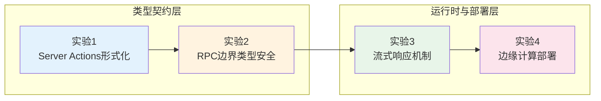

# Server Functions 实验室：从类型安全 RPC 到边缘计算的渐进实验

> **实验场宣言**：Server Functions 不是「远程过程调用的语法糖」，而是**客户端与服务端之间的类型契约系统**。
> 它将 HTTP 边界抽象为类型安全的函数调用，在编译期消除整类网络协议错误，在运行时实现零样板的全栈数据流。
> 本实验室通过 4 个从核心机制到工程部署的渐进实验，将服务端函数从「框架特性」提升为「架构设计工具」。

---

## 实验室导航图



| 实验编号 | 主题 | 核心概念 | 难度 |
|----------|------|----------|------|
| 实验 1 | Server Actions 的形式化语义 | 编译时代码分割、客户端存根生成、类型契约 | ⭐⭐⭐ |
| 实验 2 | RPC 边界的类型安全 | 序列化边界、SuperJSON、端到端类型推断 | ⭐⭐⭐⭐ |
| 实验 3 | 流式响应与 Server-Sent Events | ReadableStream、渐进式传输、背压控制 | ⭐⭐⭐⭐ |
| 实验 4 | 边缘计算与有状态服务端函数 | Cloudflare Workers、Durable Objects、KV 缓存 | ⭐⭐⭐⭐⭐ |

---

## 引言

现代全栈框架（Next.js、Remix、TanStack Start、SvelteKit）普遍引入了 Server Functions（或 Server Actions）机制，允许开发者在同一文件中编写服务端逻辑，并通过类型安全的 RPC 调用在客户端消费。
这一模式改变了传统 REST API 的开发范式：不再需要手动维护路由处理器、请求体解析和响应序列化，类型检查器自动保证客户端调用与服务端实现的一致性。

然而，Server Functions 的「魔法」背后隐藏着深刻的形式化问题：
编译器如何将一个 TypeScript 函数转换为客户端存根和服务端处理器？
类型信息如何在网络边界保持？
流式响应如何与 React 的 Suspense 边界协作？
边缘运行环境的冷启动和状态限制对服务端函数设计有何影响？
本实验室通过可控的微观实验，将这些问题映射为可观测、可验证的代码实践。

---

## 前置知识

在开始实验之前，建议掌握以下核心概念：

- **HTTP 协议基础**：请求方法、状态码、`Content-Type` 头部、请求体编码
- **TypeScript 类型系统**：接口、泛型、条件类型、类型推断
- **React 数据流**：`useTransition`、`useActionState`、Suspense 边界
- **边缘运行时**：Cloudflare Workers、Vercel Edge Functions 的受限环境（无 Node.js API）
- **序列化理论**：JSON 的局限性、`undefined`、`Date`、`Map`、`Set` 的跨边界传输

---

## 实验 1：Server Actions 的形式化语义

### 理论背景

Server Actions 的核心形式化模型可以描述为**类型安全的过程调用抽象（Type-Safe Remote Procedure Call, TS-RPC）**。
给定一个服务端函数 `f: A → B`，编译器在构建阶段执行以下变换：

1. **代码分割**：将 `f` 的服务端体提取到独立的 server bundle 中
2. **客户端存根生成**：在客户端 bundle 中生成一个代理函数 `f̂`，其类型签名与 `f` 相同，但实现为 HTTP POST 请求
3. **类型契约保持**：通过类型检查确保 `f̂` 的输入类型 `A` 和输出类型 `B` 与 `f` 完全一致

形式化地，若 `S` 为服务端环境，`C` 为客户端环境，则存在一个编译时变换 `T` 使得：

```
T(λx:A. f(x): B) = ⟨f̂_C: A → Promise<B>, f_S: A → B⟩
```

其中 `f̂_C` 的实现近似为：

```typescript
const f̂ = async (a: A): Promise<B> => {
  const response = await fetch('/_server', {
    method: 'POST',
    headers: { 'Content-Type': 'application/json' },
    body: JSON.stringify({ actionId: 'f', payload: a })
  });
  return response.json() as B;
};
```

Next.js 的 Server Actions 在此基础上增加了 React 集成：`f̂` 可以直接在 JSX 中作为表单 `action` 属性绑定，由 React 的 `useTransition` 管理挂起状态。

### 实验代码

```typescript
// === 阶段 A：手动实现 Server Action 的核心变换 ===
// 这是框架在编译期自动完成的操作，此处显式展开以理解其机制

// 服务端实现（原始函数）
interface CreateTodoInput {
  text: string;
  priority: 'low' | 'medium' | 'high';
}

interface Todo {
  id: string;
  text: string;
  priority: 'low' | 'medium' | 'high';
  completed: boolean;
  createdAt: Date;
}

// 原始服务端函数（编译前）
async function createTodoOriginal(input: CreateTodoInput): Promise<Todo> {
  const id = crypto.randomUUID();
  return {
    id,
    text: input.text,
    priority: input.priority,
    completed: false,
    createdAt: new Date(),
  };
}

// === 阶段 B：手动构造客户端存根 ===
// 框架自动生成的客户端代理（概念模型）
const SERVER_ACTION_REGISTRY = new Map<string, string>();

function registerServerAction(id: string, endpoint: string) {
  SERVER_ACTION_REGISTRY.set(id, endpoint);
}

function createClientStub<A, B>(actionId: string) {
  return async (input: A): Promise<B> => {
    const endpoint = SERVER_ACTION_REGISTRY.get(actionId);
    if (!endpoint) throw new Error(`Unknown action: ${actionId}`);

    const response = await fetch(endpoint, {
      method: 'POST',
      headers: { 'Content-Type': 'application/json' },
      body: JSON.stringify(input),
    });

    if (!response.ok) {
      const error = await response.text();
      throw new Error(`Server action failed: ${error}`);
    }

    return response.json() as Promise<B>;
  };
}

// 注册并创建存根
registerServerAction('createTodo', '/api/actions/createTodo');
const createTodoClient = createClientStub<CreateTodoInput, Todo>('createTodo');

// === 阶段 C：Next.js Server Actions 的实际语法 ===
// 'use server' 指令标记函数为 Server Action
// 编译器自动完成代码分割和存根生成

// app/actions/todo.ts
// 'use server';
// export async function createTodo(input: CreateTodoInput): Promise<Todo> {
//   // 此代码仅在服务端执行
//   const id = crypto.randomUUID();
//   return { id, text: input.text, priority: input.priority, completed: false, createdAt: new Date() };
// }

// 客户端组件中直接导入调用（类型保持）
// import { createTodo } from './actions/todo';
// const todo = await createTodo({ text: 'Learn Server Actions', priority: 'high' });

// === 阶段 D：表单集成的渐进增强 ===
// Server Action 可直接绑定到 HTML 表单，无需 JavaScript 也能工作

// app/components/TodoForm.tsx
// 'use client';
// import { createTodo } from '../actions/todo';
//
// export function TodoForm() {
//   return (
//     <form action={createTodo}>
//       <input name="text" required />
//       <select name="priority">
//         <option value="low">Low</option>
//         <option value="medium">Medium</option>
//         <option value="high">High</option>
//       </select>
//       <button type="submit">Add Todo</button>
//     </form>
//   );
// }

// === 阶段 E：Action 状态管理与乐观更新 ===
// 'use server';
// import { revalidatePath } from 'next/cache';
//
// export async function toggleTodo(formData: FormData) {
//   const id = formData.get('id') as string;
//   const completed = formData.get('completed') === 'true';
//   // 更新数据库...
//   revalidatePath('/todos'); // 使缓存失效，触发重新渲染
// }

// === 阶段 F：Remix loader/action 的对比模型 ===
// Remix 采用路由级服务端函数而非细粒度 Action

// app/routes/todos.$id.ts
// import type { ActionFunctionArgs } from '@remix-run/node';
//
// export const action = async ({ request, params }: ActionFunctionArgs) => {
//   const formData = await request.formData();
//   const intent = formData.get('intent');
//
//   switch (intent) {
//     case 'delete':
//       await deleteTodo(params.id!);
//       return json({ success: true });
//     case 'update':
//       await updateTodo(params.id!, Object.fromEntries(formData));
//       return json({ success: true });
//     default:
//       throw new Response('Unknown intent', { status: 400 });
//   }
// };
```

### 预期观察

1. **编译时变换**：`createTodoOriginal` 在服务端 bundle 中保留完整实现，在客户端 bundle 中被替换为 `createTodoClient` 存根
2. **类型保持**：客户端调用 `createTodoClient({ text: 'test', priority: 'high' })` 时，TypeScript 仍推断返回类型为 `Promise<Todo>`
3. **渐进增强**：当 JavaScript 禁用时，`<form action={createTodo}>` 仍以传统 POST 形式提交，服务端处理后将用户重定向
4. **状态管理**：`revalidatePath` 触发 Next.js 的增量静态再生（ISR），使客户端缓存与服务器状态同步

### 变体探索

**变体 1-1**：Server Action 的错误边界处理

```typescript
// 'use server';

class ActionError extends Error {
  constructor(
    message: string,
    public code: string,
    public field?: string
  ) {
    super(message);
  }
}

export async function validatedCreateTodo(input: unknown) {
  // 运行时校验（Zod 或手写）
  if (!input || typeof input !== 'object') {
    throw new ActionError('Invalid input', 'INVALID_INPUT');
  }
  const data = input as Record<string, unknown>;
  if (typeof data.text !== 'string' || data.text.length < 1) {
    throw new ActionError('Text is required', 'VALIDATION_ERROR', 'text');
  }
  // ... 创建逻辑
}

// 客户端使用 useActionState 捕获错误
// const [state, formAction, isPending] = useActionState(validatedCreateTodo, null);
```

**变体 1-2**：手动实现框架无关的 Server Function 工厂

```typescript
// framework-agnostic server function pattern

function createServerFn<A, B>(
  handler: (input: A) => Promise<B>
): (input: A) => Promise<B> {
  // 运行时注册（生产环境由构建工具扫描替换）
  const actionId = handler.name || crypto.randomUUID();

  // 返回的函数在客户端表现为 RPC 调用
  const clientStub = async (input: A): Promise<B> => {
    if (typeof window === 'undefined') {
      // 服务端：直接执行
      return handler(input);
    }
    // 客户端：发送 HTTP 请求
    const res = await fetch(`/api/rpc/${actionId}`, {
      method: 'POST',
      body: JSON.stringify(input),
    });
    return res.json();
  };

  return clientStub;
}

const serverAdd = createServerFn(async (a: { x: number; y: number }) => {
  return { result: a.x + a.y };
});
```

---

## 实验 2：RPC 边界的类型安全

### 理论背景

Server Functions 的类型安全不仅体现在调用签名上，更关键的是**序列化边界**的类型保持。HTTP 传输只能携带 JSON 可序列化的数据，但 TypeScript 类型系统包含大量不可直接 JSON 序列化的值：`undefined`、`Date`、`bigint`、`Map`、`Set`、`RegExp`、`Error`、函数引用、循环引用对象等。

SuperJSON 是一种扩展序列化协议，通过在 JSON 中嵌入类型标记（type annotations）来恢复这些值的运行时类型。其形式化模型可以描述为：

```
serialize: T → JSONValue × TypeMeta
deserialize: JSONValue × TypeMeta → T
```

其中 `TypeMeta` 是一个元数据对象，记录每个值在原类型中的构造方式（如 `"Date"`、`"Map"`、`"BigInt"` 等）。

tRPC 采用另一种策略：它在服务端和客户端共享一个类型安全的 router 定义，通过代码生成（或 Zod schema）确保请求体、响应体和错误类型在编译期完全对齐。tRPC 的 `createTRPCProxyClient` 使得客户端调用看起来如同本地函数调用，但底层仍通过 HTTP 传输。

### 实验代码

```typescript
// === 阶段 A：JSON 序列化的局限与类型丢失 ===
interface RichData {
  id: string;
  createdAt: Date;
  metadata: Map<string, unknown>;
  tags: Set<string>;
  amount: bigint;
}

const original: RichData = {
  id: 'order-123',
  createdAt: new Date('2026-05-01T00:00:00Z'),
  metadata: new Map([['key', 'value']]),
  tags: new Set(['urgent', 'paid']),
  amount: 9007199254740993n,
};

// 原生 JSON.stringify 导致类型丢失
const jsonString = JSON.stringify(original);
// {"id":"order-123","createdAt":"2026-05-01T00:00:00.000Z","metadata":{},"tags":{},"amount":"9007199254740993"}

const parsed = JSON.parse(jsonString);
// parsed.createdAt 是 string，不是 Date
// parsed.metadata 是 {}，不是 Map
// parsed.tags 是 {}，不是 Set
// parsed.amount 是 string，不是 bigint

// === 阶段 B：SuperJSON 的类型保持序列化 ===
import SuperJSON from 'superjson';

const serialized = SuperJSON.serialize(original);
// {
//   json: { id: 'order-123', createdAt: '2026-05-01T00:00:00.000Z', metadata: [['key','value']], tags: ['urgent','paid'], amount: '9007199254740993' },
//   meta: { values: { createdAt: ['Date'], metadata: ['Map'], tags: ['Set'], amount: ['bigint'] } }
// }

const restored = SuperJSON.deserialize<RichData>(serialized);
// restored.createdAt instanceof Date === true
// restored.metadata instanceof Map === true
// restored.tags instanceof Set === true
// typeof restored.amount === 'bigint'

// === 阶段 C：tRPC Router 的类型安全边界 ===
import { initTRPC } from '@trpc/server';
import { z } from 'zod';

const t = initTRPC.create();

// 服务端 router 定义（类型契约）
const appRouter = t.router({
  user: t.router({
    getById: t.procedure
      .input(z.object({ id: z.string().uuid() }))
      .output(z.object({ id: z.string(), name: z.string(), email: z.string().email() }))
      .query(async ({ input }) => {
        // 数据库查询
        return { id: input.id, name: 'Alice', email: 'alice@example.com' };
      }),

    update: t.procedure
      .input(z.object({
        id: z.string().uuid(),
        name: z.string().min(1).optional(),
        email: z.string().email().optional(),
      }))
      .mutation(async ({ input }) => {
        // 更新逻辑
        return { success: true, updatedFields: Object.keys(input).filter(k => k !== 'id') };
      }),
  }),
});

export type AppRouter = typeof appRouter;

// 客户端完全类型安全（零运行时开销的类型推断）
// import { createTRPCProxyClient, httpBatchLink } from '@trpc/client';
// const client = createTRPCProxyClient<AppRouter>({ links: [httpBatchLink({ url: '/api/trpc' })] });
// const user = await client.user.getById.query({ id: '550e8400-e29b-41d4-a716-446655440000' });
// user.name 被推断为 string，无需手动声明类型

// === 阶段 D：Zod Schema 与类型联合推导 ===
const TodoSchema = z.object({
  id: z.string().uuid(),
  text: z.string().min(1).max(200),
  completed: z.boolean(),
  priority: z.enum(['low', 'medium', 'high']),
  dueDate: z.date().optional(),
});

type Todo = z.infer<typeof TodoSchema>;

// 服务端函数同时获得运行时校验和编译期类型
async function createTodoWithZod(rawInput: unknown): Promise<Todo> {
  const input = TodoSchema.parse(rawInput); // 运行时校验
  return { ...input, id: crypto.randomUUID() };
}

// === 阶段 E：自定义序列化器的实现 ===
interface Serializer<T> {
  serialize(value: T): unknown;
  deserialize(value: unknown): T;
}

const DateSerializer: Serializer<Date> = {
  serialize: (d) => ({ __type: 'Date', value: d.toISOString() }),
  deserialize: (v) => {
    const obj = v as { __type: string; value: string };
    if (obj.__type !== 'Date') throw new Error('Not a Date');
    return new Date(obj.value);
  },
};

const BigIntSerializer: Serializer<bigint> = {
  serialize: (n) => ({ __type: 'BigInt', value: n.toString() }),
  deserialize: (v) => {
    const obj = v as { __type: string; value: string };
    if (obj.__type !== 'BigInt') throw new Error('Not a BigInt');
    return BigInt(obj.value);
  },
};

// 通用序列化管道
function createTypedSerializer<T>(serializers: Map<string, Serializer<any>>) {
  return {
    serialize(value: T): unknown {
      // 递归遍历对象，应用匹配的序列化器
      return walkAndTransform(value, (v) => {
        for (const [name, serializer] of serializers) {
          if (v instanceof Date && name === 'Date') return serializer.serialize(v);
          if (typeof v === 'bigint' && name === 'BigInt') return serializer.serialize(v);
        }
        return v;
      });
    },
    deserialize(value: unknown): T {
      return walkAndTransform(value, (v) => {
        if (v && typeof v === 'object' && '__type' in v) {
          const type = (v as any).__type;
          const serializer = serializers.get(type);
          if (serializer) return serializer.deserialize(v);
        }
        return v;
      }) as T;
    },
  };
}

// 辅助函数（简化版）
function walkAndTransform(value: unknown, transform: (v: unknown) => unknown): unknown {
  const transformed = transform(value);
  if (Array.isArray(transformed)) {
    return transformed.map(item => walkAndTransform(item, transform));
  }
  if (transformed && typeof transformed === 'object' && !(transformed instanceof Date)) {
    const result: Record<string, unknown> = {};
    for (const [key, val] of Object.entries(transformed)) {
      result[key] = walkAndTransform(val, transform);
    }
    return result;
  }
  return transformed;
}

// === 阶段 F：类型安全的多态错误处理 ===
interface TRPCError {
  code: 'BAD_REQUEST' | 'UNAUTHORIZED' | 'NOT_FOUND' | 'INTERNAL_SERVER_ERROR';
  message: string;
  path?: string;
}

// 客户端区分成功和错误类型
 type SafeResult<T> =
  | { success: true; data: T }
  | { success: false; error: TRPCError };

async function safeCall<T>(
  fn: () => Promise<T>
): Promise<SafeResult<T>> {
  try {
    const data = await fn();
    return { success: true, data };
  } catch (e) {
    const error = e as TRPCError;
    return { success: false, error };
  }
}

// 使用示例
// const result = await safeCall(() => client.user.getById.query({ id: 'invalid' }));
// if (result.success) {
//   console.log(result.data.name);
// } else {
//   console.error(result.error.code);
// }
```

### 预期观察

1. **类型保持**：使用 SuperJSON 后，`Date`、`Map`、`Set`、`bigint` 在序列化-反序列化后恢复原始类型
2. **端到端类型**：tRPC 客户端调用 `client.user.getById.query({ id: '...' })` 的返回类型由服务端 `output` schema 自动推断，无需手动声明
3. **运行时校验**：Zod `parse` 在服务端拒绝不符合 schema 的请求，防止无效数据进入业务逻辑
4. **错误类型**：`TRPCError` 的 `code` 联合类型使得客户端可以 exhaustive switch 处理所有错误情况

### 变体探索

**变体 2-1**：使用 Valibot 替代 Zod（更小的 bundle size）

```typescript
import * as v from 'valibot';

const TodoSchema = v.object({
  id: v.string(),
  text: v.pipe(v.string(), v.minLength(1)),
  completed: v.boolean(),
});

type Todo = v.InferOutput<typeof TodoSchema>;

const result = v.safeParse(TodoSchema, rawInput);
if (result.success) {
  const todo: Todo = result.output;
}
```

**变体 2-2**：TanStack Start 的 `createServerFn` 类型安全模式

```typescript
import { createServerFn } from '@tanstack/react-start';

// 类型安全的 validator + handler 组合
export const createTodo = createServerFn({ method: 'POST' })
  .validator((data: unknown) => {
    if (!data || typeof data !== 'object') throw new Error('Invalid input');
    const d = data as { text?: unknown };
    if (typeof d.text !== 'string' || d.text.length === 0) {
      throw new Error('text is required');
    }
    return { text: d.text };
  })
  .handler(async ({ data }) => {
    // data 类型被推断为 { text: string }
    return { id: crypto.randomUUID(), text: data.text };
  });

// 客户端调用完全类型安全
// const result = await createTodo({ data: { text: 'hello' } });
```

---

## 实验 3：流式响应与 Server-Sent Events

### 理论背景

传统的请求-响应模型要求服务端在发送响应前完成所有计算。对于长时间运行的操作（如 AI 生成、大数据处理、进度报告），这种同步模型导致客户端长时间无反馈。流式响应（Streaming Response）通过 `ReadableStream` 和 `TransformStream` 允许服务端在计算过程中逐步发送数据块。

在 React 生态中，Server Components 的流式 HTML 和 Suspense 边界使得框架可以在服务端渲染未完成时向客户端发送部分 UI。TanStack Start 和 Remix 的 `defer` 工具函数允许 loader 返回一个 Promise 对象，该 Promise 在流中异步解析，客户端在数据到达时自动更新。

Server-Sent Events（SSE）是一种单向的服务端到客户端推送协议，基于 HTTP 的 `text/event-stream` MIME 类型。与 WebSocket 不同，SSE 基于标准 HTTP，自动处理重连和事件 ID，但仅支持服务端单向推送。

### 实验代码

```typescript
// === 阶段 A：基础的 ReadableStream 服务端函数 ===
import { createServerFn } from '@tanstack/react-start';

export const streamText = createServerFn({ method: 'GET' })
  .handler(async () => {
    const encoder = new TextEncoder();
    const stream = new ReadableStream({
      async start(controller) {
        const sentences = [
          'Stream processing ',
          'enables progressive ',
          'data delivery ',
          'without buffering.',
        ];
        for (const chunk of sentences) {
          controller.enqueue(encoder.encode(chunk));
          await new Promise(r => setTimeout(r, 300));
        }
        controller.close();
      },
    });

    return new Response(stream, {
      headers: {
        'Content-Type': 'text/plain; charset=utf-8',
        'Transfer-Encoding': 'chunked',
      },
    });
  });

// === 阶段 B：Server-Sent Events (SSE) 实现 ===
export const streamEvents = createServerFn({ method: 'GET' })
  .handler(async () => {
    const encoder = new TextEncoder();
    let counter = 0;

    const stream = new ReadableStream({
      start(controller) {
        const interval = setInterval(() => {
          counter++;
          const event = `id: ${counter}\nevent: progress\ndata: ${JSON.stringify({ step: counter, total: 5, message: `Processing step ${counter}` })}\n\n`;
          controller.enqueue(encoder.encode(event));

          if (counter >= 5) {
            clearInterval(interval);
            controller.close();
          }
        }, 500);
      },
    });

    return new Response(stream, {
      headers: {
        'Content-Type': 'text/event-stream',
        'Cache-Control': 'no-cache',
        'Connection': 'keep-alive',
      },
    });
  });

// 客户端消费 SSE
// const eventSource = new EventSource('/api/streamEvents');
// eventSource.addEventListener('progress', (e) => {
//   const data = JSON.parse(e.data);
//   console.log(`Step ${data.step}/${data.total}: ${data.message}`);
// });
// eventSource.onerror = () => eventSource.close();

// === 阶段 C：React Suspense 与流式数据（Next.js 模型）===
// app/components/AsyncData.tsx
// import { Suspense } from 'react';
//
// async function fetchSlowData(): Promise<string[]> {
//   await new Promise(r => setTimeout(r, 2000));
//   return ['item1', 'item2', 'item3'];
// }
//
// async function DataList() {
//   const items = await fetchSlowData();
//   return (
//     <ul>
//       {items.map(item => <li key={item}>{item}</li>)}
//     </ul>
//   );
// }
//
// export function AsyncDataWrapper() {
//   return (
//     <Suspense fallback={<p>Loading data stream...</p>}>
//       <DataList />
//     </Suspense>
//   );
// }

// === 阶段 D：Remix defer 的渐进式加载 ===
// app/routes/dashboard.tsx
// import { defer } from '@remix-run/node';
// import { Await, useLoaderData } from '@remix-run/react';
// import { Suspense } from 'react';
//
// export const loader = async () => {
//   const criticalData = await fetchCriticalData(); // 阻塞等待
//   const slowDataPromise = fetchSlowData();        // 延迟流式传输
//
//   return defer({
//     critical: criticalData,
//     slow: slowDataPromise,
//   });
// };
//
// export default function Dashboard() {
//   const { critical, slow } = useLoaderData<typeof loader>();
//   return (
//     <div>
//       <h1>{critical.title}</h1>
//       <Suspense fallback={<p>Loading slow data...</p>}>
//         <Await resolve={slow}>
//           {(data) => <SlowDataView data={data} />}
//         </Await>
//       </Suspense>
//     </div>
//   );
// }

// === 阶段 E：背压感知的流式处理 ===
// 当消费者处理速度慢于生产者时，需要背压控制

export const backpressureStream = createServerFn({ method: 'GET' })
  .handler(async () => {
    const encoder = new TextEncoder();
    const queue: string[] = [];
    let pulling = false;

    const stream = new ReadableStream({
      pull(controller) {
        pulling = true;
        if (queue.length > 0) {
          const item = queue.shift()!;
          controller.enqueue(encoder.encode(item));
        }
        pulling = false;
      },
    });

    // 模拟生产者
    const producer = setInterval(() => {
      queue.push(`data: ${Date.now()}\n\n`);
      // 在实际实现中，ReadableStream 的 pull 机制自动处理背压
    }, 100);

    // 清理
    setTimeout(() => {
      clearInterval(producer);
      // stream.controller.close();
    }, 5000);

    return new Response(stream, {
      headers: { 'Content-Type': 'text/event-stream' },
    });
  });

// === 阶段 F：AI 生成的 token 流式传输 ===
// 模拟 LLM 文本生成的流式响应

interface TokenChunk {
  token: string;
  index: number;
  finishReason: null | 'stop' | 'length';
}

export const generateStream = createServerFn({ method: 'POST' })
  .validator((data: unknown) => {
    if (!data || typeof data !== 'object') throw new Error('Invalid');
    const d = data as { prompt?: unknown };
    if (typeof d.prompt !== 'string') throw new Error('prompt required');
    return { prompt: d.prompt };
  })
  .handler(async ({ data }) => {
    const encoder = new TextEncoder();
    const tokens = data.prompt.split(' ').reverse(); // 模拟生成
    let index = 0;

    const stream = new ReadableStream({
      async pull(controller) {
        if (index >= tokens.length) {
          const doneChunk: TokenChunk = { token: '', index, finishReason: 'stop' };
          controller.enqueue(encoder.encode(`data: ${JSON.stringify(doneChunk)}\n\n`));
          controller.close();
          return;
        }

        const chunk: TokenChunk = {
          token: tokens[index] + ' ',
          index,
          finishReason: null,
        };
        controller.enqueue(encoder.encode(`data: ${JSON.stringify(chunk)}\n\n`));
        index++;
        await new Promise(r => setTimeout(r, 100)); // 模拟生成延迟
      },
    });

    return new Response(stream, {
      headers: {
        'Content-Type': 'text/event-stream',
        'X-Accel-Buffering': 'no', // 禁用 Nginx 缓冲
      },
    });
  });
```

### 预期观察

1. **渐进渲染**：`ReadableStream` 使得服务端可以在生成第一个 token 后立即发送，无需等待完整响应
2. **自动重连**：`EventSource` 在连接断开时自动尝试重连，并发送 `Last-Event-ID` 头部以便服务端恢复
3. **Suspense 集成**：Next.js 的流式 SSR 将 Suspense 边界内的异步组件包装为内联脚本，在数据到达时流式插入 DOM
4. **背压控制**：`ReadableStream` 的 `pull` 语义确保生产者仅在消费者请求时才生成数据，防止内存溢出

### 变体探索

**变体 3-1**：使用 Web Streams API 的 TransformStream 进行数据转换

```typescript
const transformStream = new TransformStream({
  transform(chunk, controller) {
    // 对每个 chunk 进行转换（如加密、压缩、格式转换）
    const transformed = chunk.toUpperCase();
    controller.enqueue(transformed);
  },
});

// readable.pipeThrough(transformStream).pipeTo(writable);
```

**变体 3-2**：Deno / Node.js 18+ 的原生 ReadableStream 支持

```typescript
// Node.js 18+ 和 Deno 原生支持 Web Streams API
// 与浏览器环境共享相同的流处理代码

import { Readable } from 'node:stream';

// 将 Node.js Readable 转换为 Web ReadableStream
function nodeToWebStream(nodeStream: Readable): ReadableStream {
  return new ReadableStream({
    start(controller) {
      nodeStream.on('data', chunk => controller.enqueue(chunk));
      nodeStream.on('end', () => controller.close());
      nodeStream.on('error', err => controller.error(err));
    },
  });
}
```

---

## 实验 4：边缘计算与有状态服务端函数

### 理论背景

传统服务端函数运行在持久化的服务器进程上，可以维护内存状态和长时间连接。边缘计算（Edge Computing）将代码部署到全球分布的 CDN 节点，实现就近执行和低延迟响应，但带来了新的约束：**冷启动优先、无持久化内存、CPU 时间受限、禁止阻塞 I/O**。

Cloudflare Workers 的边缘运行时基于 V8 Isolates，每个请求在一个隔离的 JavaScript 上下文中执行，请求结束后上下文可能被销毁。这意味着全局变量不能用于跨请求状态共享。Durable Objects 是 Cloudflare 提供的解决方案：每个 Durable Object 是一个有状态的 JavaScript 对象，具有持久化存储和单线程执行保证，通过唯一 ID 寻址。

KV（Key-Value）存储提供了低延迟的全局读取能力（通常 < 50ms），但写入具有最终一致性（通常 60 秒内全球同步）。D1 是 Cloudflare 的边缘 SQL 数据库，提供关系型查询能力和强一致性，但写入延迟高于 KV。

### 实验代码

```typescript
// === 阶段 A：边缘 KV 缓存模式 ===
import { createServerFn } from '@tanstack/react-start';

interface Env {
  KV: KVNamespace;
  DB: D1Database;
}

export const getCachedProduct = createServerFn({ method: 'GET' })
  .validator((data: unknown) => {
    if (typeof data !== 'string') throw new Error('Product ID required');
    return data;
  })
  .handler(async ({ data: productId }) => {
    const env = process.env as unknown as Env;
    const cacheKey = `product:${productId}`;

    // 1. 读边缘缓存（低延迟，全球分布）
    const cached = await env.KV.get(cacheKey, { cacheTtl: 60 });
    if (cached) {
      return { source: 'kv', data: JSON.parse(cached) };
    }

    // 2. KV 未命中，回源 D1 数据库
    const { results } = await env.DB.prepare(
      'SELECT id, name, price, category FROM products WHERE id = ?'
    ).bind(productId).all<{ id: string; name: string; price: number; category: string }>();

    const product = results?.[0] ?? null;

    // 3. 异步写入 KV（不阻塞响应）
    if (product) {
      env.KV.put(cacheKey, JSON.stringify(product), { expirationTtl: 300 })
        .catch(err => console.error('KV write failed:', err));
    }

    return { source: 'db', data: product };
  });

// === 阶段 B：Durable Objects 有状态协作 ===
// Durable Object 实现（通常在单独文件中）
export interface CursorPosition {
  userId: string;
  x: number;
  y: number;
  color: string;
}

export class CollaborationRoom implements DurableObject {
  private cursors = new Map<string, CursorPosition>();
  private sessions: WebSocket[] = [];

  constructor(private state: DurableObjectState) {}

  async fetch(request: Request): Promise<Response> {
    const url = new URL(request.url);

    if (url.pathname === '/ws') {
      // WebSocket 升级
      const [client, server] = Object.values(new WebSocketPair());
      this.handleSession(server);
      return new Response(null, { status: 101, webSocket: client });
    }

    if (url.pathname === '/update-cursor') {
      const data = await request.json<CursorPosition>();
      this.cursors.set(data.userId, data);
      await this.state.storage.put('cursors', Array.from(this.cursors.entries()));
      this.broadcast({ type: 'cursors', data: Array.from(this.cursors.values()) });
      return Response.json({ success: true });
    }

    return new Response('Not Found', { status: 404 });
  }

  private handleSession(ws: WebSocket) {
    ws.accept();
    this.sessions.push(ws);
    ws.addEventListener('close', () => {
      this.sessions = this.sessions.filter(s => s !== ws);
    });
  }

  private broadcast(message: unknown) {
    const data = JSON.stringify(message);
    for (const ws of this.sessions) {
      ws.send(data);
    }
  }
}

// 服务端函数路由到 Durable Object
export const updateCursor = createServerFn({ method: 'POST' })
  .validator((data: unknown) => {
    const d = data as CursorPosition;
    if (!d.userId || typeof d.x !== 'number' || typeof d.y !== 'number') {
      throw new Error('Invalid cursor data');
    }
    return d;
  })
  .handler(async ({ data }) => {
    const env = process.env as unknown as Env & { COLLAB: DurableObjectNamespace };
    const id = env.COLLAB.idFromName('doc:123');
    const stub = env.COLLAB.get(id);

    const response = await stub.fetch('http://internal/update-cursor', {
      method: 'POST',
      body: JSON.stringify(data),
    });

    return response.json();
  });

// === 阶段 C：边缘限流与速率控制 ===
// 使用 Durable Object 实现请求限流（每 IP 每窗口）

export class RateLimiter implements DurableObject {
  private requests: number[] = [];

  constructor(private state: DurableObjectState) {}

  async fetch(request: Request): Promise<Response> {
    const now = Date.now();
    const windowMs = 60000; // 1 分钟窗口
    const maxRequests = 100;

    // 加载持久化状态
    const stored = await this.state.storage.get<number[]>('requests');
    this.requests = stored ?? [];

    // 清理过期请求
    this.requests = this.requests.filter(t => now - t < windowMs);

    if (this.requests.length >= maxRequests) {
      return new Response('Rate limit exceeded', {
        status: 429,
        headers: { 'Retry-After': String(Math.ceil(windowMs / 1000)) },
      });
    }

    this.requests.push(now);
    await this.state.storage.put('requests', this.requests);

    return new Response('OK', { status: 200 });
  }
}

// === 阶段 D：边缘函数与节点函数的混合架构 ===
// 读取操作走边缘，写入/复杂操作走节点

interface ReadOperation {
  type: 'read';
  key: string;
}

interface WriteOperation {
  type: 'write';
  key: string;
  value: unknown;
}

type Operation = ReadOperation | WriteOperation;

export const hybridOperation = createServerFn({ method: 'POST' })
  .validator((data: unknown) => {
    if (!data || typeof data !== 'object') throw new Error('Invalid operation');
    return data as Operation;
  })
  .handler(async ({ data }) => {
    const env = process.env as unknown as Env;

    if (data.type === 'read') {
      // 边缘路径：KV 优先，< 50ms
      const cached = await env.KV.get(data.key);
      return { edge: true, data: cached ? JSON.parse(cached) : null };
    }

    // 写入路径：D1 强一致性写入
    await env.DB.prepare('INSERT OR REPLACE INTO store (key, value) VALUES (?, ?)')
      .bind(data.key, JSON.stringify(data.value))
      .run();

    // 异步失效 KV 缓存
    await env.KV.delete(data.key);

    return { edge: false, success: true };
  });

// === 阶段 E：边缘环境下的环境变量安全访问 ===
// Cloudflare Workers 通过 bindings 注入环境变量，非 process.env

interface CloudflareEnv {
  API_KEY: string;
  DATABASE_URL: string;
  SECRET_KEY: string;
}

// 在 Cloudflare Workers 中，env 通过 fetch handler 的第二个参数传入
// export default {
//   async fetch(request: Request, env: CloudflareEnv, ctx: ExecutionContext) {
//     // env.API_KEY 安全访问，不会泄露到客户端
//   }
// };

// TanStack Start 的适配层将 bindings 映射到 process.env
// 因此同一代码在 Node.js 和 Cloudflare 中均可运行

// === 阶段 F：跨平台兼容的 Server Function 工厂 ===
function createPlatformAwareServerFn<A, B>(handler: (input: A, env: Record<string, unknown>) => Promise<B>) {
  return createServerFn({ method: 'POST' })
    .validator((data: unknown) => data as A)
    .handler(async ({ data }) => {
      // 统一的环境变量访问抽象
      const env = typeof process !== 'undefined' ? process.env : {};
      return handler(data, env as Record<string, unknown>);
    });
}

// 平台无关的函数实现
const universalFetch = createPlatformAwareServerFn(
  async (input: { url: string }, env) => {
    const apiKey = env.API_KEY as string;
    const response = await fetch(input.url, {
      headers: { Authorization: `Bearer ${apiKey}` },
    });
    return response.json();
  }
);
```

### 预期观察

1. **缓存层级**：边缘 KV 提供 < 50ms 的全球读取延迟，D1 提供强一致性写入，两者形成互补的存储层级
2. **有状态边缘**：Durable Objects 的单线程执行保证消除了并发控制需求，`state.storage` 提供持久化能力
3. **限流精确性**：基于 Durable Object 的限流器可以精确统计每个 IP 的请求数，不受边缘节点分布影响
4. **混合架构**：读取操作走边缘路径实现低延迟，写入操作回源到中心节点保证一致性
5. **环境隔离**：Cloudflare Workers 的 `env` bindings 确保敏感配置不会意外泄露到客户端 bundle

### 变体探索

**变体 4-1**：Cloudflare Workers 的 Service Binding（内部服务间调用）

```typescript
// wrangler.toml
// [[services]]
// binding = "USER_SERVICE"
// service = "user-api"

// handler.ts
// const userResponse = await env.USER_SERVICE.fetch('http://internal/users/123');
// Service Binding 不经过公共网络，零延迟和安全开销
```

**变体 4-2**：边缘渲染与缓存策略（Cache API）

```typescript
// 在 Cloudflare Workers 中使用 Cache API 缓存渲染结果
async function cachedRender(request: Request) {
  const cache = caches.default;
  const cached = await cache.match(request);
  if (cached) return cached;

  const response = await renderPage(request);
  ctx.waitUntil(cache.put(request, response.clone()));
  return response;
}
```

---

## 实验总结

通过本实验室的 4 个渐进实验，我们系统性地探索了 Server Functions 从类型安全 RPC 到边缘计算部署的完整技术栈：

| 实验 | 核心收获 | 工程应用 |
|------|----------|----------|
| 实验 1 | 理解了编译时代码分割和客户端存根生成的形式化模型 | 在 Next.js / TanStack Start 中正确使用 Server Actions |
| 实验 2 | 掌握了序列化边界的类型保持机制和 SuperJSON / tRPC 的实现原理 | 构建端到端类型安全的 API，避免序列化导致的运行时类型错误 |
| 实验 3 | 实践了 ReadableStream、SSE 和 React Suspense 的流式数据模式 | 实现 AI 生成、大文件处理等需要渐进反馈的场景 |
| 实验 4 | 理解了边缘运行时的约束和 Durable Objects / KV 的互补存储模型 | 设计低延迟、高可用的全球分布式服务端架构 |

**关键陷阱与最佳实践**：

- **陷阱 1**：在 Server Action 中返回不可序列化的对象（如函数、DOM 节点、`Error` 实例）会导致运行时错误或类型丢失
- **陷阱 2**：在边缘函数中使用 Node.js 专属 API（如 `fs`、`path`、`crypto.createHash`）会导致部署失败，应使用 WinterCG 标准 API
- **陷阱 3**：假设边缘函数的内存状态在请求间保持。边缘函数是无状态的，跨请求状态必须使用 KV、D1 或 Durable Objects
- **最佳实践 1**：始终使用 Zod / Valibot 在服务端函数入口进行输入校验，防止无效数据穿透到业务逻辑
- **最佳实践 2**：对读取密集型操作使用 KV 缓存 + D1 回源模式，对一致性敏感的操作直接使用 D1
- **最佳实践 3**：在流式响应中设置 `X-Accel-Buffering: no` 头部以禁用反向代理缓冲

---

## 延伸阅读

### 经典著作与规范

- [TAPL: Chapter 19 — Case Study: Featherweight Java](https://www.cis.upenn.edu/~bcpierce/tapl/) — 子类型与继承的形式化基础
- [ECMA-262 §27.2 — Promise Objects](https://tc39.es/ecma262/#sec-promise-objects) — JavaScript 异步语义规范
- [WHATWG Streams Standard](https://streams.spec.whatwg.org/) — Web Streams API 规范

### 框架官方文档

- [Next.js Server Actions](https://nextjs.org/docs/app/building-your-application/data-fetching/server-actions-and-mutations) — Next.js 官方 Server Actions 文档
- [tRPC Documentation](https://trpc.io/docs) — 端到端类型安全 RPC 框架
- [TanStack Start Server Functions](https://tanstack.com/start/latest/docs/framework/react/server-functions) — TanStack Start 服务端函数
- [Remix Actions & Loaders](https://remix.run/docs/en/main/discussion/data-flow) — Remix 数据流模型

### 边缘计算与运行时

- [Cloudflare Workers Documentation](https://developers.cloudflare.com/workers/) — 边缘运行时平台
- [Cloudflare Durable Objects](https://developers.cloudflare.com/durable-objects/) — 有状态边缘对象
- [Cloudflare D1 Database](https://developers.cloudflare.com/d1/) — 边缘 SQL 数据库
- [WinterCG — Web Standard APIs](https://wintercg.org/) — 跨运行时 Web 标准倡议
- [SuperJSON Documentation](https://github.com/flightcontrolhq/superjson) — 类型保持序列化库

*本实验室遵循 JS/TS 全景知识库的理论-实践闭环原则。*
