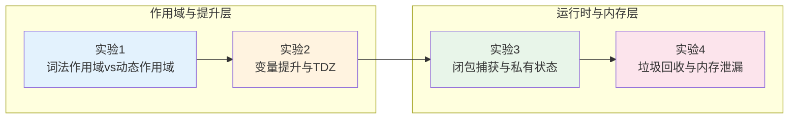

# 变量系统实验室：从作用域规则到闭包与内存管理的深度实验

> **实验场宣言**：JavaScript 的变量系统不是「值的命名容器」，而是**词法环境与执行上下文的绑定系统**。`var`、`let`、`const` 的差异不仅是「能否重新赋值」的语法区别，而是涉及作用域边界、提升语义、暂时性死区和闭包生命周期的根本性设计选择。本实验室通过 4 个从语言语义到运行时行为的渐进实验，将变量从「基础语法」提升为「内存架构设计工具」。

---

## 实验室导航图



| 实验编号 | 主题 | 核心概念 | 难度 |
|----------|------|----------|------|
| 实验 1 | 词法作用域 vs 动态作用域 | 词法环境链、`with`、`eval`、严格模式 | ⭐⭐ |
| 实验 2 | 变量提升与暂时性死区 (TDZ) | Hoisting、`var` vs `let`/`const`、TDZ 语义 | ⭐⭐⭐ |
| 实验 3 | 闭包捕获与私有状态封装 | 词法闭包、模块模式、私有字段、WeakMap | ⭐⭐⭐⭐ |
| 实验 4 | 垃圾回收与内存泄漏检测 | 标记清除、引用计数、WeakRef、DevTools | ⭐⭐⭐⭐ |

---

## 引言

变量是程序状态的基本单元，而 JavaScript 的变量系统因其独特的设计历史而显得格外复杂。ES2015 之前，`var` 是唯一的变量声明方式，其函数作用域和提升机制导致了许多难以调试的 bug。`let` 和 `const` 的引入带来了块级作用域和暂时性死区（Temporal Dead Zone, TDZ），从根本上改善了变量生命周期的可预测性。

然而，理解变量系统不能停留在语法层面。闭包（Closure）——函数与其词法环境的组合——是 JavaScript 最强大的特性之一，它实现了私有状态、模块封装和异步上下文保持。但闭包也是内存泄漏的主要来源：当函数捕获了大型对象而又长期存活时，被捕获的对象无法被垃圾回收。

本实验室通过可控的代码实验，从词法作用域规则出发，逐步深入到闭包捕获机制、内存泄漏模式和现代 JavaScript 提供的弱引用工具（`WeakMap`、`WeakRef`、`FinalizationRegistry`）。

---

## 前置知识

在开始实验之前，建议掌握以下核心概念：

- **执行上下文（Execution Context）**：全局执行上下文、函数执行上下文、`eval` 执行上下文
- **调用栈（Call Stack）**：函数调用的 LIFO 栈结构
- **堆内存（Heap）**：对象和闭包环境的存储区域
- **ES2015 块级作用域**：`if`、`for`、`while`、`try/catch` 等语句块创建的词法作用域
- **V8 垃圾回收基础**：分代回收（新生代/老生代）、标记-清除算法

---

## 实验 1：词法作用域 vs 动态作用域

### 理论背景

作用域（Scope）规定了变量在代码中的可见性和生命周期。JavaScript 采用**词法作用域（Lexical Scoping）**：变量的解析依据其在源代码中的位置（词法结构）决定，而非运行时的调用链。这意味着一个内部函数可以访问其外部（ enclosing ）函数中声明的变量，即使外部函数已经执行完毕。

词法作用域与**动态作用域（Dynamic Scoping）**形成对比。在动态作用域中，变量的解析依据调用栈中的调用链决定——即「谁调用了我，我就能访问谁的变量」。Bash 和早期的 Lisp 方言采用动态作用域。JavaScript 中唯一接近动态作用域的机制是 `with` 语句（已废弃）和 `eval` 的直接调用。

词法环境（Lexical Environment）是 ECMAScript 规范中的核心概念，由**环境记录（Environment Record）**和**对外部环境的引用（Outer Environment Reference）**组成。环境记录存储了该作用域中声明的所有变量绑定，外部引用则形成了作用域链。

### 实验代码

```typescript
// === 阶段 A：词法作用域的基础演示 ===
function outer() {
  const outerVar = 'I am outer';

  function inner() {
    const innerVar = 'I am inner';
    console.log(outerVar); // ✅ 可以访问外部变量
    console.log(innerVar); // ✅ 可以访问自身变量
  }

  inner();
  // console.log(innerVar); // ❌ ReferenceError: innerVar is not defined
}

outer();

// === 阶段 B：作用域链的层级查找 ===
const globalVar = 'global';

function level1() {
  const level1Var = 'level1';

  function level2() {
    const level2Var = 'level2';

    function level3() {
      const level3Var = 'level3';
      console.log(globalVar);  // 在全局环境找到
      console.log(level1Var);  // 在 level1 环境找到
      console.log(level2Var);  // 在 level2 环境找到
      console.log(level3Var);  // 在 level3 环境找到
    }

    level3();
  }

  level2();
}

level1();

// === 阶段 C：函数参数的词法作用域 ===
function createMultiplier(factor: number) {
  return function (value: number) {
    return value * factor; // factor 来自 enclosing scope
  };
}

const double = createMultiplier(2);
const triple = createMultiplier(3);

console.log(double(5)); // 10
console.log(triple(5)); // 15

// 每个 multiplier 都有自己的词法环境，其中 factor 的值不同

// === 阶段 D：块级作用域（let/const）vs 函数作用域（var）===
function scopeDemo() {
  if (true) {
    var varVar = 'function scoped';
    let letVar = 'block scoped';
    const constVar = 'also block scoped';
  }

  console.log(varVar);   // ✅ 'function scoped' — var 穿透 if 块
  // console.log(letVar);   // ❌ ReferenceError
  // console.log(constVar); // ❌ ReferenceError
}

scopeDemo();

// === 阶段 E：try/catch 的块级作用域 ===
try {
  const tryVar = 'inside try';
  throw new Error('test');
} catch (e) {
  // console.log(tryVar); // ❌ ReferenceError: tryVar is not defined
  const catchVar = 'inside catch';
  console.log(e.message); // ✅ catch 参数 e 有块级作用域
}

// console.log(catchVar); // ❌ ReferenceError

// === 阶段 F：动态作用域模拟（`with` 和 `eval`，严格模式禁用）===
// 'use strict' 模式下 with 被禁用，以下仅作历史说明

// 非严格模式下（不推荐）：
// const obj = { x: 10 };
// with (obj) {
//   console.log(x); // 10 — 动态查找 obj.x
// }

// eval 可以动态创建变量（污染当前作用域）
// 非严格模式下：
// function dynamicVar() {
//   eval('var dynamic = 42');
//   console.log(dynamic); // 42
// }
// dynamicVar();

// 严格模式下 eval 有自己的作用域
function strictEval() {
  'use strict';
  eval('var strictDynamic = 42');
  // console.log(strictDynamic); // ❌ ReferenceError
}
strictEval();
```

### 预期观察

1. **词法查找**：`level3` 可以访问所有外层作用域的变量，因为词法环境链在函数定义时就已经确定
2. **闭包独立性**：`double` 和 `triple` 分别捕获了不同的 `factor` 值，证明了每个函数调用创建独立的词法环境
3. **块级隔离**：`let`/`const` 将变量限制在 `if`、`try/catch` 等语句块内，防止意外的变量泄露
4. **严格模式保护**：`'use strict'` 下的 `eval` 拥有独立的作用域，不会污染外部环境的变量绑定

### 变体探索

**变体 1-1**：模块作用域的自然隔离

```typescript
// module-a.ts
const secret = 'module-a-secret';
export function getSecret() { return secret; }

// module-b.ts
// import { getSecret } from './module-a';
// console.log(secret); // ❌ ReferenceError — 模块作用域隔离
// console.log(getSecret()); // ✅ 'module-a-secret'
```

**变体 1-2**：IIFE 模式与现代替代方案

```typescript
// 传统 IIFE 创建私有作用域
const modulePattern = (() => {
  const privateVar = 'hidden';
  return {
    getPrivate() { return privateVar; },
  };
})();

// ES Module 替代（推荐）
// private.ts
// const privateVar = 'hidden';
// export function getPrivate() { return privateVar; }

// 块级作用域替代
{
  const blockScoped = 'only here';
  console.log(blockScoped);
}
// console.log(blockScoped); // ❌ ReferenceError
```

---

## 实验 2：变量提升与暂时性死区 (TDZ)

### 理论背景

变量提升（Hoisting）是 JavaScript 引擎在编译阶段将变量声明移动到其作用域顶部的行为。但 `var`、`let`、`const` 的提升语义存在本质差异：

- **`var`**：声明被提升，并初始化为 `undefined`。在声明语句之前访问变量得到 `undefined`，不会报错
- **`let`/`const`**：声明被提升，但**不初始化**。在声明语句之前访问变量触发 `ReferenceError: Cannot access 'x' before initialization`。从作用域起始到声明语句之间的区域称为**暂时性死区（Temporal Dead Zone, TDZ）**

TDZ 的语义意义在于：防止变量在初始化之前被使用，消除了 `var` 时代常见的「为什么我的变量是 `undefined`」类 bug。从 ECMAScript 规范角度，每个词法环境记录都有一个内部槽 `[[VarNames]]`，而 `let`/`const` 绑定有一个 `initialized` 标志位，在执行到声明语句前该标志为 `false`，访问时抛出错误。

### 实验代码

```typescript
// === 阶段 A：var 的提升行为 ===
function varHoisting() {
  console.log(varVar); // undefined（提升但未初始化）
  var varVar = 10;
  console.log(varVar); // 10
}

varHoisting();

// 等效于：
// function varHoisting() {
//   var varVar;        // 提升：声明移到顶部
//   console.log(varVar); // undefined
//   varVar = 10;
//   console.log(varVar); // 10
// }

// === 阶段 B：let/const 的 TDZ ===
function letTDZ() {
  // console.log(letVar); // ❌ ReferenceError: Cannot access 'letVar' before initialization
  let letVar = 20;
  console.log(letVar); // 20
}

letTDZ();

// === 阶段 C：const 的只读引用语义 ===
function constSemantics() {
  const config = {
    apiUrl: 'https://api.example.com',
    timeout: 5000,
  };

  config.apiUrl = 'https://api.v2.com'; // ✅ 允许：修改的是对象内容，不是引用
  console.log(config.apiUrl);

  // config = {}; // ❌ TypeError: Assignment to constant variable
}

constSemantics();

// === 阶段 D：TDZ 在循环中的典型表现 ===
function loopVariations() {
  console.log('--- for with let ---');
  for (let i = 0; i < 3; i++) {
    setTimeout(() => console.log('let i:', i), 10);
  }
  // 输出: let i: 0, let i: 1, let i: 2
  // 每次迭代创建新的词法环境和独立的 i 绑定

  console.log('--- for with var ---');
  for (var j = 0; j < 3; j++) {
    setTimeout(() => console.log('var j:', j), 10);
  }
  // 输出: var j: 3, var j: 3, var j: 3
  // 同一个 var j 被所有回调共享
}

loopVariations();

// === 阶段 E：函数声明 vs 函数表达式的提升差异 ===
function functionHoisting() {
  // 函数声明：整体提升
  declaredFunc(); // ✅ 'I am declared'

  // 函数表达式：仅变量提升，赋值不提升
  // expressedFunc(); // ❌ TypeError: expressedFunc is not a function

  function declaredFunc() {
    console.log('I am declared');
  }

  var expressedFunc = function () {
    console.log('I am expressed');
  };

  expressedFunc(); // ✅ 'I am expressed'
}

functionHoisting();

// === 阶段 F：TDZ 与 typeof 的陷阱 ===
function typeofTDZ() {
  // typeof 对未声明变量安全返回 'undefined'
  console.log(typeof undeclaredVar); // 'undefined'（无报错）

  // 但对 TDZ 中的 let/const 仍然报错
  // console.log(typeof tdzVar); // ❌ ReferenceError: Cannot access 'tdzVar' before initialization
  let tdzVar = 42;
}

typeofTDZ();

// === 阶段 G：重复声明的差异 ===
function duplicateDeclarations() {
  var x = 1;
  var x = 2; // ✅ var 允许重复声明，后覆盖前
  console.log(x); // 2

  let y = 1;
  // let y = 2; // ❌ SyntaxError: Identifier 'y' has already been declared

  const z = 1;
  // const z = 2; // ❌ SyntaxError
}

duplicateDeclarations();
```

### 预期观察

1. **var 提升**：`var` 声明在编译期提升到作用域顶部，初始化为 `undefined`，导致「先使用后声明」不会报错但值为 `undefined`
2. **TDZ 保护**：`let`/`const` 在声明前访问抛出 `ReferenceError`，强制开发者按正确的时序使用变量
3. **循环绑定**：`for (let i = 0; ...)` 每次迭代创建新的 `i` 绑定，使得异步回调捕获正确的迭代值；`var` 则共享同一个绑定
4. **函数提升**：函数声明整体提升（包括函数体），但函数表达式仅提升变量名，`typeof` 在 TDZ 中不享有特殊豁免
5. **const 语义**：`const` 保证的是**引用不变**，对象和数组的内容仍然可变；真正的不可变性需要 `Object.freeze` 或不可变数据结构库

### 变体探索

**变体 2-1**：使用 IIFE 在 var 时代解决循环绑定问题

```typescript
// ES2015 之前的解决方案
for (var i = 0; i < 3; i++) {
  (function (capturedI) {
    setTimeout(() => console.log('captured:', capturedI), 10);
  })(i);
}
// 输出: captured: 0, captured: 1, captured: 2
```

**变体 2-2**：顶层 await 与模块级 TDZ

```typescript
// module.ts
// const config = await fetchConfig(); // 顶层 await（ES2022+）
// export { config };
// 模块在 config 初始化完成前处于 TDZ，其他模块导入时会自动等待
```

---

## 实验 3：闭包捕获与私有状态封装

### 理论背景

闭包（Closure）在 ECMAScript 规范中的定义是：**由函数及其引用的词法环境组合而成的实体**。当一个函数引用（捕获）了其外部作用域中的变量时，即使外部函数已经执行完毕，这些被捕获的变量仍然存活于内存中，因为闭包保持了对它们的引用。

闭包是 JavaScript 实现**信息隐藏（Information Hiding）**的主要机制。在 ES2022 私有类字段（`#private`）出现之前，闭包是实现真正私有状态的唯一方式。模块系统（ES Modules）提供了文件级的隔离，但在模块内部仍然需要闭包来创建多个独立的私有状态实例。

闭包捕获的是**变量引用**而非值拷贝。这意味着如果闭包捕获的是一个循环变量，而该变量在闭包创建后被修改，那么闭包看到的是修改后的值——这正是 `var` 循环问题的根源。

### 实验代码

```typescript
// === 阶段 A：闭包实现模块化私有状态 ===
function createCounter(initial = 0) {
  let count = initial; // 私有变量，外部无法直接访问

  return {
    increment() {
      return ++count;
    },
    decrement() {
      return --count;
    },
    getValue() {
      return count;
    },
    reset() {
      count = initial;
      return count;
    },
  };
}

const counterA = createCounter(10);
const counterB = createCounter(20);

console.log(counterA.increment()); // 11
console.log(counterA.increment()); // 12
console.log(counterB.increment()); // 21

// count 不可直接访问
// console.log(counterA.count); // undefined

// === 阶段 B：闭包在异步编程中的应用 ===
function fetchWithRetry(url: string, maxRetries = 3) {
  let attempt = 0;

  async function doFetch(): Promise<Response> {
    try {
      const response = await fetch(url);
      if (!response.ok) throw new Error(`HTTP ${response.status}`);
      return response;
    } catch (err) {
      attempt++;
      if (attempt >= maxRetries) throw err;
      const delay = Math.min(1000 * 2 ** attempt, 8000); // 指数退避
      await new Promise(r => setTimeout(r, delay));
      return doFetch(); // 递归重试，闭包保持 attempt 状态
    }
  }

  return doFetch();
}

// === 阶段 C：工厂模式与配置捕获 ===
interface LoggerConfig {
  prefix: string;
  enabled: boolean;
  level: 'debug' | 'info' | 'warn' | 'error';
}

function createLogger(config: LoggerConfig) {
  const levels = { debug: 0, info: 1, warn: 2, error: 3 };

  return {
    log(message: string, level: LoggerConfig['level'] = 'info') {
      if (!config.enabled) return;
      if (levels[level] < levels[config.level]) return;
      console.log(`[${config.prefix}] [${level.toUpperCase()}] ${message}`);
    },
    debug(message: string) { this.log(message, 'debug'); },
    info(message: string) { this.log(message, 'info'); },
    warn(message: string) { this.log(message, 'warn'); },
    error(message: string) { this.log(message, 'error'); },
  };
}

const appLogger = createLogger({ prefix: 'App', enabled: true, level: 'info' });
appLogger.debug('this is hidden'); // 不输出（level < info）
appLogger.info('application started'); // [App] [INFO] application started

// === 阶段 D：ES2022 私有类字段 ===
class SecureBankAccount {
  // 真正私有的字段，外部完全不可访问（ES2022+）
  #balance: number;
  #transactions: Array<{ amount: number; date: Date }> = [];

  constructor(initialBalance: number) {
    this.#balance = initialBalance;
  }

  deposit(amount: number): void {
    if (amount <= 0) throw new Error('Amount must be positive');
    this.#balance += amount;
    this.#transactions.push({ amount, date: new Date() });
  }

  getBalance(): number {
    return this.#balance;
  }

  // 私有方法
  #audit(): boolean {
    return this.#transactions.reduce((sum, t) => sum + t.amount, 0) === this.#balance;
  }

  verify(): boolean {
    return this.#audit();
  }
}

const account = new SecureBankAccount(100);
account.deposit(50);
console.log(account.getBalance()); // 150
// console.log(account.#balance); // ❌ 编译错误：私有字段外部不可访问

// === 阶段 E：WeakMap 实现的私有状态（类外部不可见）===
const _private = new WeakMap<object, Record<string, unknown>>();

class UserWithWeakMap {
  constructor(public name: string, private email: string) {
    _private.set(this, {
      passwordHash: '',
      lastLogin: new Date(),
    });
  }

  setPassword(hash: string) {
    const p = _private.get(this)!;
    p.passwordHash = hash;
  }

  getLastLogin(): Date {
    return _private.get(this)!.lastLogin as Date;
  }
}

const user = new UserWithWeakMap('Alice', 'alice@example.com');
user.setPassword('hashed-secret');
// _private 在 User 实例被垃圾回收后自动释放对应条目

// === 阶段 F：闭包与事件监听器的组合 ===
function createDebouncedHandler<T extends (...args: any[]) => void>(
  fn: T,
  delay: number
): T {
  let timer: ReturnType<typeof setTimeout> | null = null;

  return ((...args: Parameters<T>) => {
    if (timer) clearTimeout(timer);
    timer = setTimeout(() => fn(...args), delay);
  }) as T;
}

const debouncedSearch = createDebouncedHandler((query: string) => {
  console.log('Searching for:', query);
}, 300);

// debouncedSearch('a');
// debouncedSearch('ab');
// debouncedSearch('abc');
// 只有最后一次调用会在 300ms 后执行
```

### 预期观察

1. **私有状态**：`createCounter` 返回的对象方法可以访问 `count`，但外部代码无法直接访问，实现了信息隐藏
2. **状态保持**：`fetchWithRetry` 的 `attempt` 变量在多次 `doFetch` 调用间保持状态，支持指数退避逻辑
3. **配置捕获**：`createLogger` 的闭包捕获了 `config` 对象，后续所有日志操作都基于初始配置
4. **私有字段**：`#balance` 是真正的语言级私有，连 `Object.keys`、`Reflect.ownKeys` 都无法枚举
5. **WeakMap 模式**：`_private` WeakMap 将私有数据与对象实例关联，实例被 GC 后 WeakMap 条目自动清理
6. **实用抽象**：`createDebouncedHandler` 展示了闭包如何封装计时器状态，提供可复用的防抖工具

### 变体探索

**变体 3-1**：使用 Symbol 作为私有属性键

```typescript
const _password = Symbol('password');

class UserWithSymbol {
  [_password]: string = '';

  setPassword(pw: string) {
    this[_password] = pw;
  }
}

// Symbol 属性在常规枚举中不可见，但可通过 Object.getOwnPropertySymbols 访问
// 不如 #private 严格，但兼容性好于 WeakMap 方案
```

**变体 3-2**：惰性初始化与闭包结合

```typescript
function createLazy<T>(factory: () => T): () => T {
  let cached: T | undefined;
  let initialized = false;

  return () => {
    if (!initialized) {
      cached = factory();
      initialized = true;
    }
    return cached!;
  };
}

const getExpensiveData = createLazy(() => {
  console.log('Initializing...');
  return new Array(1_000_000).fill('data');
});

getExpensiveData(); // Initializing...
getExpensiveData(); // 直接返回缓存，无初始化开销
```

---

## 实验 4：垃圾回收与内存泄漏检测

### 理论背景

JavaScript 引擎（如 V8）采用**分代垃圾回收（Generational Garbage Collection）**策略。内存分为**新生代（Young Generation）**和**老生代（Old Generation）**。新生代使用**Scavenge**算法（复制存活对象到空闲区域），老生代使用**标记-清除（Mark-Sweep）**和**标记-整理（Mark-Compact）**算法。

垃圾回收器从一组**根对象（Roots）**出发——包括全局对象、当前执行栈上的局部变量、DOM 树等——递归标记所有可达对象。未被标记的对象被视为垃圾，在适当的时机被回收。

内存泄漏（Memory Leak）是指程序中不再需要的对象仍被意外引用，导致垃圾回收器无法释放它们。JavaScript 中最常见的泄漏模式包括：意外的全局变量、闭包引用 DOM 节点、未清理的定时器/事件监听器、以及 `console.log` 缓存的对象引用。

现代 JavaScript 提供了弱引用工具来缓解这些问题：

- **`WeakMap`**/`**WeakSet`**：键必须是对象，且对键的引用是弱引用。当键对象不再被其他地方引用时，WeakMap 中的条目自动消失
- **`WeakRef`**：允许持有一个对象的弱引用，不阻止该对象被垃圾回收
- **`FinalizationRegistry`**：注册回调函数，当目标对象被垃圾回收时触发通知

### 实验代码

```typescript
// === 阶段 A：意外的全局变量（严格模式防止）===
function accidentalGlobal() {
  // 非严格模式下，未声明的变量会成为全局对象的属性
  // leakedVar = 'I am global'; // 泄漏！

  // 严格模式下抛出 ReferenceError
  'use strict';
  // leakedVar = 'error'; // ❌ ReferenceError
}

accidentalGlobal();

// === 阶段 B：闭包引用 DOM 节点导致的泄漏 ===
// 浏览器环境中：
// function createLeakyHandler() {
//   const hugeData = new Array(1_000_000).fill('x');
//   const element = document.getElementById('button');
//
//   element?.addEventListener('click', () => {
//     console.log(hugeData.length); // hugeData 和 element 被闭包长期引用
//   });
// }
// 问题：即使 element 从 DOM 中移除，事件监听器和闭包仍保持引用

// ✅ 修复：弱引用或及时清理
function createSafeHandler() {
  const hugeData = new Array(1_000_000).fill('x');
  const element = document.getElementById('button');

  const handler = () => {
    console.log(hugeData.length);
  };

  element?.addEventListener('click', handler);

  // 返回清理函数，由调用方在组件卸载时调用
  return () => {
    element?.removeEventListener('click', handler);
  };
}

// === 阶段 C：定时器未清理 ===
function startPolling(callback: () => void) {
  const timer = setInterval(callback, 1000);

  // 返回清理函数，由调用方在组件卸载时调用
  return () => clearInterval(timer);
}

// React 中使用 useEffect 的清理模式
// useEffect(() => {
//   const stop = startPolling(() => fetchData());
//   return () => stop(); // 组件卸载时清理
// }, []);

// === 阶段 D：WeakMap 的内存安全模式 ===
// 使用 WeakMap 关联元数据，不阻止对象被回收

interface DOMElement {
  id: string;
  // ... 其他属性
}

const elementMetadata = new WeakMap<DOMElement, { clickCount: number; lastActive: Date }>();

function trackElement(element: DOMElement) {
  const meta = elementMetadata.get(element);
  if (meta) {
    meta.clickCount++;
    meta.lastActive = new Date();
  } else {
    elementMetadata.set(element, { clickCount: 1, lastActive: new Date() });
  }
}

// 当 element 不再被引用时，WeakMap 中的元数据自动释放
// 无需手动清理

// === 阶段 E：WeakRef 与 FinalizationRegistry ===
// WeakRef：不阻止垃圾回收的对象引用

class ExpensiveResource {
  readonly data = new Array(10_000_000).fill(0);
  constructor(public id: string) {
    console.log(`Resource ${id} created`);
  }
}

const resourceCache = new Map<string, WeakRef<ExpensiveResource>>();
const cleanupRegistry = new FinalizationRegistry<string>((id) => {
  console.log(`Resource ${id} was garbage collected`);
  resourceCache.delete(id);
});

function getResource(id: string): ExpensiveResource {
  const cached = resourceCache.get(id)?.deref();
  if (cached) {
    console.log(`Cache hit for ${id}`);
    return cached;
  }

  const resource = new ExpensiveResource(id);
  resourceCache.set(id, new WeakRef(resource));
  cleanupRegistry.register(resource, id);
  return resource;
}

// 使用示例
// const res1 = getResource('big-data');
// res1 = null; // 解除强引用
// 一段时间后，垃圾回收器可能回收该资源，FinalizationRegistry 回调触发

// === 阶段 F：内存泄漏检测实战 ===
// 使用 Chrome DevTools 的 Memory 面板

// 1. 堆快照比较（Heap Snapshot）
//    - 在操作前拍摄快照 A
//    - 执行疑似泄漏的操作多次
//    - 拍摄快照 B
//    - 比较两个快照，查找持续增长的对象类型

// 2. 时间线记录（Allocation Timeline）
//    - 记录一段时间内的内存分配
//    - 蓝色柱状图表示仍存活的对象，灰色表示已被回收
//    - 蓝色柱状图持续增长表明存在泄漏

// 3. 编程式检测（Node.js）
// import { memoryUsage } from 'node:process';
//
// function logMemory() {
//   const usage = memoryUsage();
//   console.log({
//     rss: `${(usage.rss / 1024 / 1024).toFixed(2)} MB`,
//     heapUsed: `${(usage.heapUsed / 1024 / 1024).toFixed(2)} MB`,
//     external: `${(usage.external / 1024 / 1024).toFixed(2)} MB`,
//   });
// }

// 模拟泄漏场景（用于测试检测工具）
const leakyArray: unknown[] = [];

function simulateLeak() {
  const bigObject = {
    data: new Array(1_000_000).fill('leak'),
    timestamp: Date.now(),
  };
  leakyArray.push(bigObject); // 持续累积，无法回收
}

// 在 DevTools 中运行 simulateLeak() 多次，观察堆内存增长

// === 阶段 G：现代框架中的自动清理模式 ===
// AbortController 模式：统一取消异步操作

function createCancellableTask(signal: AbortSignal) {
  return new Promise((resolve, reject) => {
    const timeout = setTimeout(() => resolve('completed'), 5000);

    signal.addEventListener('abort', () => {
      clearTimeout(timeout);
      reject(new Error('Task aborted'));
    });
  });
}

// React 中的使用
// useEffect(() => {
//   const controller = new AbortController();
//   fetchData(controller.signal);
//   return () => controller.abort(); // 清理时取消进行中的请求
// }, []);
```

### 预期观察

1. **全局泄漏**：非严格模式下未声明的变量成为 `window`/`global` 属性，永远无法被回收；`'use strict'` 杜绝此问题
2. **DOM 泄漏**：闭包引用 DOM 节点时，即使节点从页面移除，JavaScript 引用仍阻止其回收。必须显式移除事件监听器
3. **定时器泄漏**：`setInterval` 创建的定时器在回调函数中可能捕获大量作用域变量，组件/页面卸载时必须清理
4. **WeakMap 自动清理**：`elementMetadata` 使用 WeakMap 后，DOM 元素被移除且不再有其他引用时，关联的元数据自动释放
5. **WeakRef 缓存**：`resourceCache` 使用 WeakRef 持有资源，允许垃圾回收器在内存压力时回收缓存对象，FinalizationRegistry 负责清理缓存索引
6. **DevTools 检测**：堆快照对比是定位泄漏根源的最有效手段，应关注构造函数名和保留路径（Retainers）

### 变体探索

**变体 4-1**：使用 `performance.memory` 进行运行时内存监控（Chrome 限定）

```typescript
// Chrome 浏览器中
if ('memory' in performance) {
  const mem = (performance as any).memory;
  console.log({
    usedJSHeapSize: `${(mem.usedJSHeapSize / 1024 / 1024).toFixed(2)} MB`,
    totalJSHeapSize: `${(mem.totalJSHeapSize / 1024 / 1024).toFixed(2)} MB`,
    jsHeapSizeLimit: `${(mem.jsHeapSizeLimit / 1024 / 1024).toFixed(2)} MB`,
  });
}
```

**变体 4-2**：Node.js 的 `v8` 模块获取详细堆统计

```typescript
// Node.js 环境
// import v8 from 'node:v8';
// const heapStats = v8.getHeapStatistics();
// console.log({
//   totalHeapSize: heapStats.total_heap_size,
//   usedHeapSize: heapStats.used_heap_size,
//   heapSizeLimit: heapStats.heap_size_limit,
// });
```

---

## 实验总结

通过本实验室的 4 个渐进实验，我们系统性地探索了 JavaScript 变量系统从词法作用域到内存管理的完整技术栈：

| 实验 | 核心收获 | 工程应用 |
|------|----------|----------|
| 实验 1 | 理解了词法作用域的静态解析规则和作用域链的层级查找机制 | 正确使用模块作用域和块级作用域进行代码隔离 |
| 实验 2 | 掌握了 `var`、`let`、`const` 的提升语义差异和 TDZ 的保护机制 | 使用 `const` 作为默认声明，利用 `let` 处理循环变量，彻底弃用 `var` |
| 实验 3 | 实践了闭包捕获机制及其在私有状态、异步上下文和工厂模式中的应用 | 使用闭包和私有字段实现信息隐藏，使用 WeakMap 管理对象元数据 |
| 实验 4 | 理解了 V8 垃圾回收原理和常见内存泄漏模式，掌握了弱引用工具 | 使用 WeakMap/WeakRef/FinalizationRegistry 构建内存安全的缓存和元数据系统 |

**关键陷阱与最佳实践**：

- **陷阱 1**：认为 `var` 和 `let` 只是语法差异。实际上 `var` 的函数作用域和提升机制会导致难以调试的时序 bug
- **陷阱 2**：认为 `const` 保证值不可变。`const` 只保证引用不变，对象内容仍然可变；需要不可变性时应使用 `Object.freeze` 或不可变库
- **陷阱 3**：认为 TDZ 只在 `let`/`const` 声明前存在。实际上 TDZ 从作用域起始到声明语句结束始终存在，包括 `typeof` 操作
- **陷阱 4**：认为所有函数都创建闭包。只有引用外部变量的函数才形成闭包；空闭包无内存开销
- **陷阱 5**：忽视事件监听器和定时器的清理。组件卸载时必须移除所有外部引用，防止 DOM 和闭包泄漏
- **最佳实践 1**：默认使用 `const`，需要重新赋值时使用 `let`，永远不要使用 `var`
- **最佳实践 2**：循环中使用 `let` 创建块级绑定，或利用 `forEach`/`map` 的回调参数避免闭包陷阱
- **最佳实践 3**：对象元数据使用 `WeakMap` 而非普通 `Map`，确保对象被垃圾回收时元数据自动释放
- **最佳实践 4**：使用 `AbortController` 统一管理异步操作的取消和清理
- **最佳实践 5**：定期使用 Chrome DevTools Memory 面板进行堆快照分析，特别是在长会话应用（SPA、Node.js 服务）中

---

## 延伸阅读

### ECMAScript 规范与语言基础

- [ECMA-262 §8.1 — Lexical Environments](https://tc39.es/ecma262/#sec-lexical-environments) — 词法环境的规范定义
- [ECMA-262 §13.3.1 — Let and Const Declarations](https://tc39.es/ecma262/#sec-let-and-const-declarations) — let/const 声明语义
- [ECMA-262 §13.3.2 — Variable Statement](https://tc39.es/ecma262/#sec-variable-statement) — var 声明语义

### MDN 权威文档

- [MDN: let](https://developer.mozilla.org/en-US/docs/Web/JavaScript/Reference/Statements/let) — let 声明详解
- [MDN: const](https://developer.mozilla.org/en-US/docs/Web/JavaScript/Reference/Statements/const) — const 声明详解
- [MDN: var](https://developer.mozilla.org/en-US/docs/Web/JavaScript/Reference/Statements/var) — var 声明详解
- [MDN: Closures](https://developer.mozilla.org/en-US/docs/Web/JavaScript/Closures) — 闭包概念与示例
- [MDN: Temporal Dead Zone](https://developer.mozilla.org/en-US/docs/Web/JavaScript/Reference/Statements/let#temporal_dead_zone_tdz) — TDZ 详细说明
- [MDN: WeakMap](https://developer.mozilla.org/en-US/docs/Web/JavaScript/Reference/Global_Objects/WeakMap) — WeakMap API
- [MDN: WeakRef](https://developer.mozilla.org/en-US/docs/Web/JavaScript/Reference/Global_Objects/WeakRef) — 弱引用 API
- [MDN: Private Class Features](https://developer.mozilla.org/en-US/docs/Web/JavaScript/Reference/Classes/Private_class_fields) — 私有类字段

### V8 引擎与内存管理

- [V8 Blog: Trash Talk](https://v8.dev/blog/trash-talk) — 垃圾回收深度解析
- [V8 Blog: Orinoco — Generational Garbage Collector](https://v8.dev/blog/orinoco) — Orinoco 分代垃圾回收器
- [Google Developers: JavaScript Memory Management](https://developer.chrome.com/docs/devtools/memory-problems/) — Chrome DevTools 内存分析指南

### 深度文章与教程

- [JavaScript Info: Variable Scope, Closure](https://javascript.info/closure) — 闭包与作用域的交互式教程
- [JavaScript Info: The old "var"](https://javascript.info/var) — var 的历史与陷阱
- [2ality: Variables and Scoping in ES6](https://2ality.com/2015/02/es6-scoping.html) — ES6 作用域机制深度文章
- [Node.js Docs: Memory Usage](https://nodejs.org/api/process.html#processmemoryusage) — Node.js 内存监控 API

*本实验室遵循 JS/TS 全景知识库的理论-实践闭环原则。*
