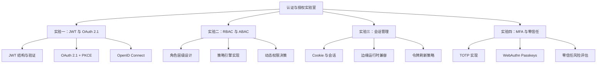

# 认证与授权实验室

## 引言

认证（Authentication）解决"你是谁"的问题，授权（Authorization）解决"你能做什么"的问题。这两个概念虽然紧密相关，却在架构层面属于完全不同的关注点——认证是安全边界的第一道防线，授权是资源访问的精细化控制阀。

Web 认证技术在过去十年经历了从"密码时代"到"Token 时代"、再到"Passkeys 时代"的演进。OAuth 2.0 让第三方登录成为可能，JWT 使无状态认证成为现实，WebAuthn / FIDO2 则通过公钥密码学消除了密码本身的攻击面。与此同时，授权模型也从简单的角色访问控制（RBAC）发展到基于属性的访问控制（ABAC），再到现代零信任架构下的持续风险评估。

本实验室将理论知识与工程实践紧密结合，通过四个递进实验分别探索：

1. **JWT 与 OAuth 2.1 认证流程**——从无状态 Token 到 PKCE 安全授权码
2. **RBAC 与 ABAC 权限模型**——从角色绑定到动态属性决策
3. **会话管理与状态保持**——从 Cookie 会话到边缘兼容的 JWT 存储
4. **多因素认证与零信任架构**——从 TOTP 到持续风险评分的现代安全范式

每个实验均包含可运行的 TypeScript/Node.js 代码、真实库的集成示例，以及安全陷阱的专项警示。



## 前置知识

在深入实验之前，请确保已掌握以下基础：

- **HTTP 协议**：请求/响应模型、Header、Cookie、`Set-Cookie`
- **密码学基础**：哈希函数（SHA-256）、对称加密（AES）、非对称加密（RSA/ECDSA）
- **Node.js / 现代运行时**：`crypto` 模块、`fetch` API、环境变量管理
- **TypeScript 类型系统**：接口、联合类型、类型守卫

建议预先阅读：

- [OWASP Authentication Cheat Sheet](https://cheatsheetseries.owasp.org/cheatsheets/Authentication_Cheat_Sheet.html)
- [OAuth 2.1 草案规范](https://datatracker.ietf.org/doc/html/draft-ietf-oauth-v2-1-10)

## 实验一：JWT 与 OAuth 2.1 认证流程

### 实验目标

理解 JWT（JSON Web Token）的结构与签名验证机制，掌握 OAuth 2.1 的 Authorization Code + PKCE 流程，并实现一个符合安全最佳实践的认证服务端。

### 理论背景

JWT 由三部分组成：Header（算法与类型）、Payload（声明）、Signature（签名），以 Base64Url 编码后用 `.` 连接。其安全性的核心依赖于签名密钥的保密性——HS256 使用共享密钥，RS256/ES256 使用私钥签名、公钥验证。

OAuth 2.1 是 OAuth 2.0 的安全强化版，主要变更包括：

- **PKCE 强制化**：所有公共客户端必须使用 Proof Key for Code Exchange
- **隐式授权淘汰**：不再推荐 `token` 响应类型的隐式流程
- **State 参数强制**：防止 CSRF 攻击

### 实验步骤

#### 步骤 1：JWT 的生成与验证

使用 Node.js `crypto` 模块实现 HS256 JWT（教学用途，生产应使用 `jose` 或 `jsonwebtoken` 库）：

```typescript
import { createHmac, timingSafeEqual } from 'node:crypto';

interface JWTHeader {
  alg: 'HS256';
  typ: 'JWT';
}

interface JWTPayload {
  sub: string;       // 用户标识
  iss: string;       // 签发者
  aud: string;       // 接收者
  iat: number;       // 签发时间
  exp: number;       // 过期时间
  scope?: string;    // 权限范围
}

function base64UrlEncode(data: string | Buffer): string {
  return Buffer.from(data)
    .toString('base64url')
    .replace(/=+$/, '');
}

function base64UrlDecode(str: string): string {
  const padding = '='.repeat((4 - (str.length % 4)) % 4);
  return Buffer.from(str + padding, 'base64url').toString('utf-8');
}

function signJWT(payload: Omit<JWTPayload, 'iat' | 'exp'>, secret: string, ttlSeconds = 3600): string {
  const header: JWTHeader = { alg: 'HS256', typ: 'JWT' };
  const now = Math.floor(Date.now() / 1000);
  const fullPayload: JWTPayload = { ...payload, iat: now, exp: now + ttlSeconds };

  const headerB64 = base64UrlEncode(JSON.stringify(header));
  const payloadB64 = base64UrlEncode(JSON.stringify(fullPayload));
  const signingInput = `${headerB64}.${payloadB64}`;

  const signature = createHmac('sha256', secret).update(signingInput).digest();
  const signatureB64 = base64UrlEncode(signature);

  return `${signingInput}.${signatureB64}`;
}

function verifyJWT(token: string, secret: string): JWTPayload {
  const [headerB64, payloadB64, signatureB64] = token.split('.');
  if (!headerB64 || !payloadB64 || !signatureB64) {
    throw new Error('Invalid JWT format');
  }

  const signingInput = `${headerB64}.${payloadB64}`;
  const expectedSig = createHmac('sha256', secret).update(signingInput).digest();
  const actualSig = Buffer.from(signatureB64, 'base64url');

  if (actualSig.length !== expectedSig.length) {
    throw new Error('Invalid signature length');
  }
  if (!timingSafeEqual(actualSig, expectedSig)) {
    throw new Error('Invalid signature');
  }

  const payload = JSON.parse(base64UrlDecode(payloadB64)) as JWTPayload;
  if (payload.exp && payload.exp < Math.floor(Date.now() / 1000)) {
    throw new Error('Token expired');
  }

  return payload;
}

// 演示
const secret = process.env.JWT_SECRET || 'super-secret-key-change-in-production';
const token = signJWT({ sub: 'user-123', iss: 'my-app', aud: 'my-api', scope: 'read write' }, secret, 300);
console.log('Token:', token);

const decoded = verifyJWT(token, secret);
console.log('Decoded:', decoded);
```

#### 步骤 2：OAuth 2.1 + PKCE 授权码流程

实现 PKCE 授权码流程的服务端与客户端核心逻辑：

```typescript
import { randomBytes, createHash } from 'node:crypto';

interface PKCEChallenge {
  codeVerifier: string;
  codeChallenge: string;
  codeChallengeMethod: 'S256';
}

function generatePKCE(): PKCEChallenge {
  const verifier = randomBytes(32).toString('base64url');
  const challenge = createHash('sha256').update(verifier).digest('base64url');
  return {
    codeVerifier: verifier,
    codeChallenge: challenge,
    codeChallengeMethod: 'S256',
  };
}

// 客户端：构建授权 URL
function buildAuthorizeURL(params: {
  authorizationEndpoint: string;
  clientId: string;
  redirectUri: string;
  scope: string;
  state: string;
  pkce: PKCEChallenge;
}): string {
  const url = new URL(params.authorizationEndpoint);
  url.searchParams.set('response_type', 'code');
  url.searchParams.set('client_id', params.clientId);
  url.searchParams.set('redirect_uri', params.redirectUri);
  url.searchParams.set('scope', params.scope);
  url.searchParams.set('state', params.state);
  url.searchParams.set('code_challenge', params.pkce.codeChallenge);
  url.searchParams.set('code_challenge_method', params.pkce.codeChallengeMethod);
  return url.toString();
}

// 服务端：验证授权码请求
function validateAuthorizeRequest(searchParams: URLSearchParams): {
  clientId: string;
  redirectUri: string;
  scope: string;
  state: string;
  codeChallenge: string;
} {
  if (searchParams.get('response_type') !== 'code') {
    throw new Error('Unsupported response_type');
  }
  const clientId = searchParams.get('client_id');
  const redirectUri = searchParams.get('redirect_uri');
  const scope = searchParams.get('scope');
  const state = searchParams.get('state');
  const codeChallenge = searchParams.get('code_challenge');
  const codeChallengeMethod = searchParams.get('code_challenge_method');

  if (!clientId || !redirectUri || !state) {
    throw new Error('Missing required parameters');
  }
  if (!codeChallenge || codeChallengeMethod !== 'S256') {
    throw new Error('PKCE with S256 is required');
  }

  return { clientId, redirectUri, scope: scope || 'openid', state, codeChallenge };
}

// 服务端：Token 端点验证 code_verifier
function verifyCodeVerifier(verifier: string, expectedChallenge: string): boolean {
  const computed = createHash('sha256').update(verifier).digest('base64url');
  return computed === expectedChallenge;
}
```

#### 步骤 3：OpenID Connect ID Token 验证

OpenID Connect 在 OAuth 2.1 之上增加了身份层，ID Token 是一个包含用户身份信息的 JWT：

```typescript
interface IDTokenPayload extends JWTPayload {
  nonce?: string;         // 防止重放攻击
  auth_time?: number;     // 用户认证时间
  acr?: string;           // 认证上下文类引用
  amr?: string[];         // 认证方法引用
  name?: string;
  email?: string;
  picture?: string;
}

function validateIDToken(
  token: string,
  expectedIssuer: string,
  expectedAudience: string,
  expectedNonce?: string,
  maxAgeSeconds?: number
): IDTokenPayload {
  const payload = verifyJWT(token, 'idp-public-key-or-secret') as IDTokenPayload;

  if (payload.iss !== expectedIssuer) {
    throw new Error(`Issuer mismatch: ${payload.iss}`);
  }
  if (payload.aud !== expectedAudience) {
    throw new Error(`Audience mismatch: ${payload.aud}`);
  }
  if (expectedNonce && payload.nonce !== expectedNonce) {
    throw new Error('Nonce mismatch');
  }
  if (maxAgeSeconds && payload.auth_time) {
    const elapsed = Math.floor(Date.now() / 1000) - payload.auth_time;
    if (elapsed > maxAgeSeconds) {
      throw new Error('Authentication too old');
    }
  }

  return payload;
}
```

### 工程映射

| 工程工具 | 对应模式 | 说明 |
|---------|---------|------|
| Auth.js (NextAuth v5) | OAuth Adapter + JWT 策略 | 开箱支持的 Google/GitHub/Auth0 等 Provider |
| Clerk | 托管 OAuth + 自动会话 | `SignIn` 组件内置 PKCE 流程 |
| `jose` 库 | JWS/JWE/JWT 标准实现 | 支持浏览器、Node.js、Edge Runtime 的零依赖库 |
| Passport.js | Strategy 模式 | 300+ 认证策略的插件生态 |
| `openid-client` | OIDC 标准客户端 | OpenID Foundation 认证的 RP 实现 |

### 常见陷阱

1. **JWT Secret 强度不足**：生产环境必须使用加密安全随机生成的密钥（≥256 位）
2. **None 算法攻击**：必须拒绝 `alg: 'none'` 的 JWT，某些库默认允许此配置
3. **PKCE verifier 泄露**：`code_verifier` 必须仅保存在客户端内存或安全存储中，不可通过 URL 传递

---

## 实验二：RBAC 与 ABAC 权限模型

### 实验目标

理解基于角色的访问控制（RBAC）和基于属性的访问控制（ABAC）的设计差异，实现一个支持角色层级、权限继承和动态策略决策的权限引擎。

### 理论背景

RBAC（Role-Based Access Control）由 NIST 于 1992 年标准化，核心思想是将权限与角色绑定，用户通过分配角色间接获得权限。RBAC 有三个经典层级：

- **RBAC0**：基础角色-权限关联
- **RBAC1**：增加角色层级（继承）
- **RBAC2**：增加约束（互斥、基数）

ABAC（Attribute-Based Access Control）则更为灵活，决策基于主体（Subject）、资源（Resource）、环境（Environment）和操作（Action）的多维属性，通常使用策略语言（如 XACML 或 Cedar）表达。

### 实验步骤

#### 步骤 1：RBAC 核心实现

```typescript
type Permission = string; // 如 "posts:read", "posts:write", "users:delete"
type RoleName = 'guest' | 'user' | 'editor' | 'admin' | 'superadmin';

interface Role {
  name: RoleName;
  permissions: Permission[];
  inherits?: RoleName[]; // RBAC1 层级继承
}

interface User {
  id: string;
  roles: RoleName[];
}

class RBACEngine {
  private roles = new Map<RoleName, Role>();

  defineRole(role: Role): void {
    this.roles.set(role.name, role);
  }

  private resolvePermissions(roleName: RoleName, visited = new Set<RoleName>()): Set<Permission> {
    if (visited.has(roleName)) return new Set(); // 防止循环继承
    visited.add(roleName);

    const role = this.roles.get(roleName);
    if (!role) return new Set();

    const perms = new Set(role.permissions);
    if (role.inherits) {
      for (const parent of role.inherits) {
        for (const p of this.resolvePermissions(parent, new Set(visited))) {
          perms.add(p);
        }
      }
    }
    return perms;
  }

  getUserPermissions(user: User): Set<Permission> {
    const perms = new Set<Permission>();
    for (const roleName of user.roles) {
      for (const p of this.resolvePermissions(roleName)) {
        perms.add(p);
      }
    }
    return perms;
  }

  can(user: User, permission: Permission): boolean {
    return this.getUserPermissions(user).has(permission);
  }
}

// 定义角色体系
const rbac = new RBACEngine();
rbac.defineRole({
  name: 'guest',
  permissions: ['posts:read'],
});
rbac.defineRole({
  name: 'user',
  permissions: ['posts:read', 'posts:write'],
  inherits: ['guest'],
});
rbac.defineRole({
  name: 'editor',
  permissions: ['posts:publish', 'posts:delete'],
  inherits: ['user'],
});
rbac.defineRole({
  name: 'admin',
  permissions: ['users:read', 'users:write', 'users:delete'],
  inherits: ['editor'],
});
rbac.defineRole({
  name: 'superadmin',
  permissions: ['system:config'],
  inherits: ['admin'],
});

// 验证
const user: User = { id: 'u1', roles: ['editor'] };
console.log('Permissions:', [...rbac.getUserPermissions(user)]);
console.log('Can publish?', rbac.can(user, 'posts:publish')); // true（继承 editor）
console.log('Can delete user?', rbac.can(user, 'users:delete')); // false（未继承 admin）
```

#### 步骤 2：ABAC 策略引擎

实现一个简化版的属性策略引擎，支持基于请求上下文的动态决策：

```typescript
interface AccessContext {
  subject: {
    id: string;
    role: RoleName;
    department: string;
    mfaVerified: boolean;
  };
  resource: {
    type: string;
    ownerId: string;
    department: string;
    classification: 'public' | 'internal' | 'confidential' | 'secret';
  };
  action: 'create' | 'read' | 'update' | 'delete';
  environment: {
    timeOfDay: number; // 0–23
    ipAddress: string;
    deviceTrusted: boolean;
  };
}

type PolicyRule = (ctx: AccessContext) => boolean | 'abstain';

class ABACEngine {
  private rules: PolicyRule[] = [];

  addRule(rule: PolicyRule): void {
    this.rules.push(rule);
  }

  evaluate(ctx: AccessContext): { allowed: boolean; reason: string } {
    for (const rule of this.rules) {
      const result = rule(ctx);
      if (result === false) {
        return { allowed: false, reason: 'Explicitly denied by policy' };
      }
      if (result === true) {
        return { allowed: true, reason: 'Explicitly allowed by policy' };
      }
      // 'abstain' 继续下一条规则
    }
    return { allowed: false, reason: 'No policy matched (default deny)' };
  }
}

const abac = new ABACEngine();

// 规则 1：资源所有者拥有完全权限
abac.addRule((ctx) => {
  if (ctx.subject.id === ctx.resource.ownerId) return true;
  return 'abstain';
});

// 规则 2：机密数据需要 MFA
abac.addRule((ctx) => {
  if (ctx.resource.classification === 'confidential' && !ctx.subject.mfaVerified) {
    return false;
  }
  return 'abstain';
});

// 规则 3：非工作时间限制敏感操作
abac.addRule((ctx) => {
  const isWorkHours = ctx.environment.timeOfDay >= 9 && ctx.environment.timeOfDay <= 18;
  if (ctx.resource.classification === 'secret' && !isWorkHours) {
    return false;
  }
  return 'abstain';
});

// 规则 4：跨部门读取需部门主管角色
abac.addRule((ctx) => {
  if (
    ctx.action === 'read' &&
    ctx.subject.department !== ctx.resource.department &&
    !['admin', 'superadmin'].includes(ctx.subject.role)
  ) {
    return false;
  }
  return 'abstain';
});

// 验证
const ctx: AccessContext = {
  subject: { id: 'u1', role: 'user', department: 'engineering', mfaVerified: true },
  resource: { type: 'document', ownerId: 'u2', department: 'engineering', classification: 'confidential' },
  action: 'read',
  environment: { timeOfDay: 14, ipAddress: '10.0.0.1', deviceTrusted: true },
};

console.log(abac.evaluate(ctx)); // allowed: true（MFA 已验证，工作时间，同部门）
```

#### 步骤 3：混合模型（RBAC + ABAC）

现代系统通常采用混合模型：RBAC 处理粗粒度权限，ABAC 处理细粒度条件：

```typescript
class HybridAccessControl {
  constructor(
    private rbac: RBACEngine,
    private abac: ABACEngine,
    private rolePermissions: Record<RoleName, Permission[]>
  ) {}

  check(ctx: AccessContext, requiredPermission: Permission): { allowed: boolean; reason: string } {
    // 阶段 1：RBAC 粗粒度检查
    const user: User = { id: ctx.subject.id, roles: [ctx.subject.role] };
    if (!this.rbac.can(user, requiredPermission)) {
      return { allowed: false, reason: `RBAC: missing permission ${requiredPermission}` };
    }

    // 阶段 2：ABAC 细粒度策略
    return this.abac.evaluate(ctx);
  }
}
```

### 工程映射

| 工程工具 | 对应模式 | 说明 |
|---------|---------|------|
| Clerk `orgRole` | RBAC 内置 | Organizations 功能原生支持 `admin`/`member` 角色 |
| Auth.js `callbacks.authorization` | ABAC 钩子 | 在 session callback 中注入动态权限 |
| Casbin | 策略引擎库 | 支持 RBAC、ABAC、ACL 的通用访问控制框架 |
| Oso | 嵌入型策略引擎 | 使用 Polar 语言声明策略规则 |
| AWS IAM | 行业级 ABAC | 基于标签（tag）的资源级权限控制 |

### 常见陷阱

1. **角色爆炸**：当角色数量随业务维度指数增长时，应考虑引入 ABAC 替代纯 RBAC
2. **权限缓存不一致**：用户角色变更后，已签发的 JWT 中的权限声明不会自动失效
3. **默认允许（Default Allow）**：安全策略必须遵循"默认拒绝"原则，未匹配的规则应拒绝访问

---

## 实验三：会话管理与状态保持

### 实验目标

理解有状态会话（Session）与无状态令牌（JWT）的权衡，掌握会话在边缘运行时（Edge Runtime）中的兼容策略，并实现安全的令牌刷新机制。

### 理论背景

会话管理的核心问题是**状态存储的位置**：

- **服务端 Session**：状态存储在服务端（Redis、数据库、内存），客户端仅持有 Session ID（通常存储在 Cookie 中）。优点是可随时撤销，缺点是增加服务端存储压力和跨服务共享复杂度。
- **客户端 JWT**：状态编码在令牌本身，服务端无需存储。优点是无状态和水平扩展友好，缺点是一旦签发无法提前撤销（除非引入黑名单）。

现代全栈框架（Next.js、Nuxt、SvelteKit）大量运行在边缘运行时（Vercel Edge、Cloudflare Workers），这些环境限制包括：无 Node.js `fs`/`crypto` 模块、无全局可变状态、冷启动频繁。这要求会话方案必须具备边缘兼容性。

### 实验步骤

#### 步骤 1：服务端 Session 实现

使用 HMAC 签名的 Cookie 实现有状态会话：

```typescript
import { createHmac, randomBytes } from 'node:crypto';

interface SessionData {
  userId: string;
  role: string;
  createdAt: number;
}

class SessionManager {
  private sessions = new Map<string, SessionData>(); // 生产环境应使用 Redis
  private secret: string;

  constructor(secret: string) {
    this.secret = secret;
  }

  private signSessionId(sessionId: string): string {
    return createHmac('sha256', this.secret).update(sessionId).digest('hex');
  }

  create(userId: string, role: string): { sessionId: string; cookie: string } {
    const sessionId = randomBytes(16).toString('hex');
    const signature = this.signSessionId(sessionId);
    const cookieValue = `${sessionId}.${signature}`;

    this.sessions.set(sessionId, { userId, role, createdAt: Date.now() });

    const cookie = `session=${cookieValue}; HttpOnly; Secure; SameSite=Lax; Path=/; Max-Age=86400`;
    return { sessionId, cookie };
  }

  validate(cookieValue: string): SessionData | null {
    const [sessionId, signature] = cookieValue.split('.');
    if (!sessionId || !signature) return null;

    const expected = this.signSessionId(sessionId);
    if (!timingSafeEqual(Buffer.from(signature), Buffer.from(expected))) {
      return null;
    }

    return this.sessions.get(sessionId) ?? null;
  }

  revoke(sessionId: string): void {
    this.sessions.delete(sessionId);
  }
}
```

#### 步骤 2：边缘兼容的 JWT 会话

使用 `jose` 库实现可在 Edge Runtime 运行的无状态会话：

```typescript
import { SignJWT, jwtVerify, JWTPayload } from 'jose';

const secret = new TextEncoder().encode(process.env.JWT_SECRET!);

async function createEdgeSession(payload: JWTPayload, ttlSeconds = 3600): Promise<string> {
  return new SignJWT(payload)
    .setProtectedHeader({ alg: 'HS256' })
    .setIssuedAt()
    .setExpirationTime(Math.floor(Date.now() / 1000) + ttlSeconds)
    .setAudience('edge-api')
    .setIssuer('auth-service')
    .sign(secret);
}

async function verifyEdgeSession(token: string): Promise<JWTPayload> {
  const { payload } = await jwtVerify(token, secret, {
    audience: 'edge-api',
    issuer: 'auth-service',
    clockTolerance: 60,
  });
  return payload;
}

// Next.js Middleware 中使用
export async function middleware(request: Request) {
  const token = request.headers.get('authorization')?.replace('Bearer ', '');
  if (!token) {
    return new Response('Unauthorized', { status: 401 });
  }

  try {
    const session = await verifyEdgeSession(token);
    // 将会话信息附加到请求头，供后续处理
    const headers = new Headers(request.headers);
    headers.set('x-user-id', session.sub as string);
    return new Request(request.url, { headers });
  } catch {
    return new Response('Invalid token', { status: 401 });
  }
}
```

#### 步骤 3：令牌刷新与旋转

实现双令牌策略（Access Token + Refresh Token），降低长期令牌泄露风险：

```typescript
interface TokenPair {
  accessToken: string;
  refreshToken: string;
  expiresIn: number;
}

class TokenRotationService {
  private refreshTokens = new Map<string, { userId: string; family: string; expiresAt: number }>();

  async issueTokens(userId: string): Promise<TokenPair> {
    const family = randomBytes(16).toString('hex');
    const accessToken = await createEdgeSession({ sub: userId, type: 'access', scope: 'api' }, 900); // 15 分钟
    const refreshToken = randomBytes(32).toString('hex');

    this.refreshTokens.set(refreshToken, {
      userId,
      family,
      expiresAt: Date.now() + 7 * 24 * 60 * 60 * 1000, // 7 天
    });

    return { accessToken, refreshToken, expiresIn: 900 };
  }

  async rotate(refreshToken: string): Promise<TokenPair> {
    const record = this.refreshTokens.get(refreshToken);
    if (!record || record.expiresAt < Date.now()) {
      throw new Error('Invalid or expired refresh token');
    }

    // 令牌旋转：颁发新对，使旧 refresh token 失效
    this.refreshTokens.delete(refreshToken);
    return this.issueTokens(record.userId);
  }
}
```

### 工程映射

| 工程工具 | 对应模式 | 说明 |
|---------|---------|------|
| Auth.js | Adapter 模式 | 支持 Prisma/Drizzle/Redis 等多种 Session 存储后端 |
| Clerk | 托管 Session | 自动处理 Cookie/Token/Refresh，边缘原生支持 |
| Lucia | 轻量 Session | 框架无关，支持 Cookie 和 Bearer Token 两种策略 |
| Redis / Upstash Redis | Session 存储 | 跨进程共享会话状态，支持 TTL 自动过期 |
| Next.js Middleware | 边缘会话验证 | 在 CDN 边缘节点执行认证逻辑，减少延迟 |

### 常见陷阱

1. **Cookie 未设置 HttpOnly**：导致 XSS 攻击可窃取会话 Cookie
2. **SameSite=None 未配合 Secure**：跨站 Cookie 必须通过 HTTPS 传输
3. **Refresh Token 未旋转**：长期 Refresh Token 泄露后攻击者可永久维持访问
4. **JWT 撤销困难**：无状态 JWT 无法像服务端 Session 那样即时失效，需配合短 TTL 或黑名单

---

## 实验四：多因素认证与零信任架构

### 实验目标

实现基于时间的一次性密码（TOTP）算法，理解 WebAuthn / Passkeys 的注册与认证流程，并构建一个支持动态风险评估的零信任访问控制中间件。

### 理论背景

多因素认证（MFA）要求用户提供至少两种不同类别的凭证：

- **所知（Knowledge）**：密码、PIN
- **所有（Possession）**：手机、硬件密钥、TOTP 生成器
- **所是（Inherence）**：指纹、面部识别

TOTP（RFC 6238）基于 HMAC 和 Unix 时间戳，每 30 秒生成一个 6 位数字验证码。其安全性依赖于共享密钥的保密性和时间同步。

零信任架构（Zero Trust Architecture, NIST SP 800-207）的核心原则是：

- **永不信任，始终验证**：不区分内外网，每次访问都需认证和授权
- **最小权限**：仅授予完成任务所需的最小权限
- **持续评估**：基于设备健康、位置、行为异常等信号动态调整信任等级

### 实验步骤

#### 步骤 1：TOTP 实现

```typescript
import { createHmac } from 'node:crypto';

function base32Decode(secret: string): Buffer {
  const alphabet = 'ABCDEFGHIJKLMNOPQRSTUVWXYZ234567';
  let bits = '';
  for (const char of secret.toUpperCase()) {
    const val = alphabet.indexOf(char);
    if (val === -1) continue; // 跳过填充符
    bits += val.toString(2).padStart(5, '0');
  }
  const bytes = [];
  for (let i = 0; i + 8 <= bits.length; i += 8) {
    bytes.push(parseInt(bits.slice(i, i + 8), 2));
  }
  return Buffer.from(bytes);
}

function generateTOTP(secret: string, timeStep = 30, digits = 6): string {
  const key = base32Decode(secret);
  const counter = Math.floor(Date.now() / 1000 / timeStep);
  const buf = Buffer.alloc(8);
  buf.writeBigUInt64BE(BigInt(counter));

  const hmac = createHmac('sha1', key).update(buf).digest();
  const offset = hmac[hmac.length - 1] & 0x0f;
  const code = ((hmac[offset] & 0x7f) << 24 |
    (hmac[offset + 1] & 0xff) << 16 |
    (hmac[offset + 2] & 0xff) << 8 |
    (hmac[offset + 3] & 0xff)) % 10 ** digits;

  return String(code).padStart(digits, '0');
}

function verifyTOTP(token: string, secret: string, window = 1): boolean {
  for (let i = -window; i <= window; i++) {
    const counter = Math.floor(Date.now() / 1000 / 30) + i;
    const expected = generateTOTP(secret, 30, 6); // 简化：实际应传入 counter
    if (token === expected) return true;
  }
  return false;
}

// 生成 provisioning URI（用于二维码）
function provisioningURI(label: string, issuer: string, secret: string): string {
  const params = new URLSearchParams({ secret, issuer });
  return `otpauth://totp/${encodeURIComponent(label)}?${params.toString()}`;
}

console.log('TOTP:', generateTOTP('JBSWY3DPEHPK3PXP'));
console.log('URI:', provisioningURI('user@example.com', 'MyApp', 'JBSWY3DPEHPK3PXP'));
```

#### 步骤 2：WebAuthn / Passkeys 服务端流程

```typescript
import {
  generateRegistrationOptions,
  verifyRegistrationResponse,
  generateAuthenticationOptions,
  verifyAuthenticationResponse,
} from '@simplewebauthn/server';

const rpName = 'My App';
const rpID = 'localhost'; // 生产环境替换为真实域名
const origin = 'http://localhost:3000';

interface PasskeyRecord {
  credentialID: string;
  credentialPublicKey: Buffer;
  counter: number;
}

// 1. 注册：生成挑战
async function startRegistration(userId: string, userName: string) {
  const options = await generateRegistrationOptions({
    rpName,
    rpID,
    userID: new TextEncoder().encode(userId),
    userName,
    attestationType: 'none',
    authenticatorSelection: {
      residentKey: 'preferred',
      userVerification: 'preferred',
    },
  });
  // 将 options.challenge 存入临时会话
  return { options, challenge: options.challenge };
}

// 2. 注册：验证响应
async function finishRegistration(
  challenge: string,
  response: unknown,
  storage: { save: (record: PasskeyRecord) => Promise<void> }
) {
  const verification = await verifyRegistrationResponse({
    response: response as never,
    expectedChallenge: challenge,
    expectedOrigin: origin,
    expectedRPID: rpID,
  });

  if (verification.verified && verification.registrationInfo) {
    const { credentialID, credentialPublicKey, counter } = verification.registrationInfo;
    await storage.save({
      credentialID: Buffer.from(credentialID).toString('base64url'),
      credentialPublicKey,
      counter,
    });
  }
  return verification.verified;
}

// 3. 认证：生成挑战
async function startAuthentication() {
  const options = await generateAuthenticationOptions({
    rpID,
    allowCredentials: [], // 空数组触发发现凭证（discoverable credential）
    userVerification: 'preferred',
  });
  return { options, challenge: options.challenge };
}

// 4. 认证：验证响应
async function finishAuthentication(
  challenge: string,
  response: unknown,
  storedCredential: PasskeyRecord
) {
  return verifyAuthenticationResponse({
    response: response as never,
    expectedChallenge: challenge,
    expectedOrigin: origin,
    expectedRPID: rpID,
    credential: {
      id: storedCredential.credentialID,
      publicKey: storedCredential.credentialPublicKey,
      counter: storedCredential.counter,
    },
  });
}
```

#### 步骤 3：零信任风险评估中间件

构建一个基于多维度信号的动态访问控制层：

```typescript
interface RiskSignals {
  userAgent: string;
  ipAddress: string;
  geoLocation?: { country: string; city: string };
  timeOfDay: number;
  deviceFingerprint: string;
  recentFailedAttempts: number;
  sessionAgeMinutes: number;
}

interface ZeroTrustPolicy {
  resource: string;
  action: 'read' | 'write' | 'delete';
  requiredRoles: string[];
  requiresMFA?: boolean;
  maxRiskScore?: number;
  allowedCountries?: string[];
  businessHoursOnly?: boolean;
}

class ZeroTrustEngine {
  async calculateRisk(signals: RiskSignals): Promise<number> {
    let score = 0;

    // 异常设备指纹
    const knownDevices = await this.getKnownDevices(/* userId */);
    if (!knownDevices.includes(signals.deviceFingerprint)) {
      score += 25;
    }

    // 地理位置异常
    if (signals.geoLocation) {
      const lastLocation = await this.getLastLocation(/* userId */);
      if (lastLocation && lastLocation.country !== signals.geoLocation.country) {
        score += 30; // 跨国访问风险较高
      }
    }

    // 暴力破解迹象
    score += Math.min(signals.recentFailedAttempts * 10, 50);

    // 非工作时间敏感操作
    if (signals.timeOfDay < 6 || signals.timeOfDay > 23) {
      score += 15;
    }

    // 会话老化
    if (signals.sessionAgeMinutes > 480) {
      score += 10;
    }

    return Math.min(score, 100);
  }

  async evaluateAccess(
    user: { id: string; role: string; mfaVerified: boolean },
    policy: ZeroTrustPolicy,
    signals: RiskSignals
  ): Promise<{ allowed: boolean; reason: string; riskScore: number }> {
    // 1. 身份验证
    if (!policy.requiredRoles.includes(user.role)) {
      return { allowed: false, reason: 'Role not authorized', riskScore: 0 };
    }

    // 2. MFA 检查
    if (policy.requiresMFA && !user.mfaVerified) {
      return { allowed: false, reason: 'MFA required', riskScore: 0 };
    }

    // 3. 地理位置限制
    if (
      policy.allowedCountries &&
      signals.geoLocation &&
      !policy.allowedCountries.includes(signals.geoLocation.country)
    ) {
      return { allowed: false, reason: 'Access not allowed from this region', riskScore: 0 };
    }

    // 4. 业务时间限制
    if (policy.businessHoursOnly && (signals.timeOfDay < 9 || signals.timeOfDay > 18)) {
      return { allowed: false, reason: 'Access restricted to business hours', riskScore: 0 };
    }

    // 5. 动态风险评估
    const riskScore = await this.calculateRisk(signals);
    if (policy.maxRiskScore !== undefined && riskScore > policy.maxRiskScore) {
      return { allowed: false, reason: `Risk score ${riskScore} exceeds threshold ${policy.maxRiskScore}`, riskScore };
    }

    return { allowed: true, reason: 'Access granted', riskScore };
  }

  // 模拟存储方法
  private async getKnownDevices(userId: string): Promise<string[]> {
    return []; // 实际应查询数据库
  }
  private async getLastLocation(userId: string): Promise<{ country: string } | null> {
    return null;
  }
}
```

### 工程映射

| 工程工具 | 对应模式 | 说明 |
|---------|---------|------|
| Clerk | 托管 MFA + Passkeys | 开箱支持 TOTP、SMS、WebAuthn |
| `@simplewebauthn/server` | WebAuthn 服务端 | 处理挑战生成、响应验证、凭证管理 |
| Auth.js | MFA 回调 | 通过 `callbacks.signIn` 注入 MFA 验证步骤 |
| Cloudflare Access | 零信任网关 | 在边缘节点执行身份验证和策略决策 |
| Okta / Azure AD | 企业级 MFA | 支持风险条件访问策略（Conditional Access） |

### 常见陷阱

1. **TOTP 时间窗口过大**：允许 ±3 个时间步以上会显著增加重放攻击风险，建议 ±1
2. **WebAuthn 未验证 origin**：必须在服务端严格验证 `expectedOrigin`，防止中间人攻击
3. **零信任评分误报**：过于激进的评分策略会导致正常用户频繁被拦截，应通过渐进式增强调整阈值
4. **Passkeys 跨平台同步风险**：平台凭证管理器（iCloud Keychain、Google Password Manager）的同步可能绕过企业设备管控

---

## 实验总结

通过本实验室的四个实验，我们系统性地构建了现代 Web 认证与授权的完整知识框架：

| 维度 | 核心收获 |
|------|---------|
| **JWT / OAuth 2.1** | JWT 结构与签名验证的密码学基础；PKCE 强制化对公共客户端的安全意义；OpenID Connect 身份层的标准声明 |
| **RBAC / ABAC** | RBAC 的角色继承与权限解析；ABAC 的动态属性决策；混合模型在大规模系统中的实践路径 |
| **会话管理** | 有状态 Session 与无状态 JWT 的架构权衡；边缘运行时的兼容约束；双令牌旋转策略的安全优势 |
| **MFA / 零信任** | TOTP 的 HMAC-时间戳算法本质；WebAuthn 公钥密码学的防钓鱼能力；持续风险评估的信号维度与阈值设计 |

认证与授权的本质不是"设置一次就永远安全"，而是**持续演进的信任评估过程**。从密码到 Passkeys，从 RBAC 到零信任，安全架构的演进始终围绕一个核心目标：在便利性与安全性之间找到当前技术条件下的最优平衡点。

## 延伸阅读

1. **[RFC 6749: The OAuth 2.0 Authorization Framework](https://datatracker.ietf.org/doc/html/rfc6749)** — OAuth 2.0 的权威规范，定义了授权码、隐式、密码和客户端凭证四种授权类型
2. **[RFC 6238: TOTP: Time-Based One-Time Password Algorithm](https://datatracker.ietf.org/doc/html/rfc6238)** — TOTP 算法的标准定义，详细说明了 HMAC-SHA1 与时间窗口的交互机制
3. **[W3C Web Authentication: An API for accessing Public Key Credentials Level 2](https://www.w3.org/TR/webauthn-2/)** — WebAuthn/Passkeys 的 W3C 推荐标准，涵盖注册、认证和凭证管理的完整 API
4. **[NIST SP 800-207: Zero Trust Architecture](https://csrc.nist.gov/publications/detail/white-paper/800-207/final)** — 美国国家标准与技术研究院发布的零信任架构标准，定义了核心逻辑组件和部署模型
5. **[OWASP Authentication Cheat Sheet](https://cheatsheetseries.owasp.org/cheatsheets/Authentication_Cheat_Sheet.html)** — OWASP 社区维护的认证安全最佳实践汇总，涵盖密码策略、MFA、会话管理和常见攻击防御
