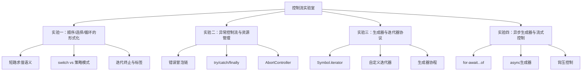

# 控制流实验室

## 引言

程序的本质是**控制流**的组合。无论业务逻辑多么复杂，最终都可拆解为三种基本结构：顺序执行、条件选择和循环迭代。
Dijkstra 在 1968 年发表的《Go To Statement Considered Harmful》奠定了结构化编程的理论基础，证明任何程序都可用这三种结构表达，而无需无约束的跳转语句。

然而，现代 JavaScript/TypeScript 的控制流远比结构化编程时代丰富：短路求值、`switch` 穿透、异常冒泡、`try/finally` 资源清理、迭代器协议、`for-await...of` 异步流控，以及 `AbortController` 信号传播。
这些机制在提升表达能力的同时，也引入了新的认知陷阱——`switch` 的隐式穿透、`||` 与 `??` 的语义差异、异步错误的捕获时机、生成器栈帧的管理等。

本实验室将控制流从"语法记忆"升级为"形式化理解 + 工程实践"。
我们将通过四个递进实验，分别探索：

1. **顺序、选择、循环的形式化语义**——从结构化编程到策略模式
2. **异常控制流与资源管理**——从错误冒泡到显式资源清理
3. **生成器与迭代器协议**——从 `Symbol.iterator` 到自定义数据流
4. **异步生成器与流式控制**——从 `for-await...of` 到背压感知的数据管道

每个实验均包含可运行的 TypeScript 代码、工程映射（真实库中的对应模式）以及常见陷阱警示。



## 前置知识

在深入实验之前，请确保已掌握以下基础：

- **JavaScript 基础语法**：`if/else`、`switch`、`for`、`while`、`try/catch/finally`
- **TypeScript 类型系统**：接口、泛型、联合类型、类型谓词
- **Promise 与 async/await**：异步执行模型、微任务队列
- **ES2015+ 新特性**：`for...of`、解构赋值、箭头函数、`Symbol`

建议预先阅读：

- ECMAScript® 2025 规范中关于 [Statements](https://tc39.es/ecma262/#sec-ecmascript-language-statements-and-declarations) 的正式定义
- MDN 的 [Control flow and error handling](https://developer.mozilla.org/en-US/docs/Web/JavaScript/Guide/Control_flow_and_error_handling) 指南

## 实验一：顺序、选择、循环的形式化

### 实验目标

理解结构化编程三要素（顺序、选择、循环）在 JavaScript 中的具体实现，掌握短路求值的形式化语义，并学会用策略模式（Map/Record）替代复杂 `switch` 语句。

### 理论背景

结构化编程定理（Böhm-Jacopini, 1966）指出：任何可计算函数都可通过**顺序组合**（sequence）、**选择**（selection）和**循环**（iteration）三种控制结构实现，无需 `goto`。JavaScript 的选择结构包括 `if/else`、`switch` 和三元运算符 `? :`；循环结构包括 `for`、`while`、`do...while`、`for...in`、`for...of`。

短路求值（short-circuit evaluation）是逻辑运算符 `&&` 和 `||` 的核心语义：

- `a && b`：若 `a` 为假值，返回 `a`，不计算 `b`；否则返回 `b`
- `a || b`：若 `a` 为真值，返回 `a`，不计算 `b`；否则返回 `b`

空值合并运算符 `??`（ES2020）仅对 `null` 和 `undefined` 触发回退，与 `||` 的"所有假值回退"有本质区别。

### 实验步骤

#### 步骤 1：短路求值的形式化验证

运行以下代码，观察 `||` 与 `??` 在边界值上的差异：

```typescript
function demoShortCircuit() {
  const values = [0, '', false, null, undefined, NaN];

  for (const v of values) {
    const orFallback = v || 'fallback';
    const nullishFallback = v ?? 'fallback';
    console.log(
      `value: ${JSON.stringify(v)} | ||: ${JSON.stringify(orFallback)} | ???: ${JSON.stringify(nullishFallback)}`
    );
  }
}

demoShortCircuit();
```

**预期输出分析**：

- `0 || 'fallback'` → `"fallback"`（`0` 为假值）
- `0 ?? 'fallback'` → `0`（`0` 非 `null/undefined`）
- `'' || 'fallback'` → `"fallback"`（空字符串为假值）
- `'' ?? 'fallback'` → `""`（空字符串非 `null/undefined`）

#### 步骤 2：策略模式替代 switch

将以下 HTTP 状态码处理从 `switch` 重构为策略模式：

```typescript
// 重构前：switch 容易遗漏 break，扩展性差
function getStatusMessageLegacy(status: number): string {
  switch (status) {
    case 200: return 'OK';
    case 201: return 'Created';
    case 400: return 'Bad Request';
    case 401: return 'Unauthorized';
    case 403: return 'Forbidden';
    case 404: return 'Not Found';
    case 500: return 'Internal Server Error';
    case 502: return 'Bad Gateway';
    case 503: return 'Service Unavailable';
    default: return 'Unknown Status';
  }
}

// 重构后：Map + 函数策略，天然防穿透，支持运行时扩展
const statusStrategy = new Map<number, string>([
  [200, 'OK'],
  [201, 'Created'],
  [400, 'Bad Request'],
  [401, 'Unauthorized'],
  [403, 'Forbidden'],
  [404, 'Not Found'],
  [500, 'Internal Server Error'],
  [502, 'Bad Gateway'],
  [503, 'Service Unavailable'],
]);

function getStatusMessageModern(status: number): string {
  return statusStrategy.get(status) ?? 'Unknown Status';
}

// 进阶：带参数的策略函数
interface Order {
  type: 'standard' | 'express' | 'international' | 'same-day';
  weight: number;
  destination: string;
}

const shippingStrategies: Record<
  Order['type'],
  (o: Order) => { cost: number; days: number }
> = {
  standard: (o) => ({ cost: o.weight * 1.0, days: 5 }),
  express: (o) => ({ cost: o.weight * 2.5 + 10, days: 2 }),
  international: (o) => ({ cost: o.weight * 5.0 + 25, days: 14 }),
  'same-day': (o) => ({ cost: o.weight * 8.0 + 50, days: 1 }),
};

function calculateShipping(order: Order) {
  const strategy = shippingStrategies[order.type];
  if (!strategy) {
    throw new Error(`Unsupported order type: ${order.type}`);
  }
  return strategy(order);
}
```

#### 步骤 3：循环控制与提前终止

掌握 `break`、`continue`、`return` 在嵌套循环中的行为，并理解标签语句（label statement）的适用场景：

```typescript
function findDuplicateMatrix(matrix: number[][]): [number, number] | null {
  for (let i = 0; i < matrix.length; i++) {
    for (let j = 0; j < matrix[i].length; j++) {
      for (let k = i + 1; k < matrix.length; k++) {
        for (let l = 0; l < matrix[k].length; l++) {
          if (matrix[i][j] === matrix[k][l]) {
            return [i, j]; // 直接返回，无需标签
          }
        }
      }
    }
  }
  return null;
}

// 标签语句：仅在必须跳出多层且无法直接返回时使用
function findInGrid(grid: string[][], target: string): [number, number] | null {
  outer: for (let i = 0; i < grid.length; i++) {
    for (let j = 0; j < grid[i].length; j++) {
      if (grid[i][j] === target) {
        console.log(`Found at (${i}, ${j})`);
        break outer; // 跳出外层循环
      }
    }
  }
  return null;
}
```

### 工程映射

| 工程场景 | 对应模式 | 说明 |
|---------|---------|------|
| React 条件渲染 | 短路求值 `&&` / 三元运算符 | `&#123;condition && &lt;Component /&gt;&#125;` |
| Redux reducer | switch / 策略模式 | 大型应用推荐 `createSlice` 封装 |
| 配置合并 | `??` 空值合并 | `const port = config.port ?? 3000` |
| 路由匹配 | Map/Record 查找 | Next.js 动态路由、Express 路由表 |

### 常见陷阱

1. **`switch` 穿透**：忘记 `break` 导致多个 `case` 连续执行
2. **`||` 误用**：`0`、`''`、`false`、`NaN` 会被跳过，数值/字符串配置应使用 `??`
3. **`for...in` 遍历数组**：遍历的是可枚举属性（包括原型链上的），数组遍历应使用 `for...of`

---

## 实验二：异常控制流与资源管理

### 实验目标

理解异常作为"非局部控制流转移"的机制，掌握 `try/catch/finally` 的执行语义，学会使用 `AbortController` 实现可取消的异步操作，并了解 ES2023 显式资源管理（`using` 声明）。

### 理论背景

异常处理打破了结构化编程的"单入口单出口"原则，允许错误从发生点沿调用栈向上传播，直到被捕获。这种**非局部退出**（non-local exit）能力使错误处理与业务逻辑解耦，但也引入了控制流的隐式跳转——代码阅读者无法仅从局部判断程序是否会跳转。

ECMAScript 2023 引入了显式资源管理（Explicit Resource Management），通过 `Symbol.dispose` 和 `Symbol.asyncDispose` 以及 `using` 声明，实现了类似 C# `using` 语句和 Python `with` 语句的确定性资源清理。

### 实验步骤

#### 步骤 1：错误分类与结构化传播

建立自定义错误层级，实现语义化的错误处理：

```typescript
class AppError extends Error {
  constructor(
    message: string,
    public code: string,
    public statusCode: number = 500
  ) {
    super(message);
    this.name = this.constructor.name;
    Error.captureStackTrace?.(this, this.constructor);
  }
}

class NetworkError extends AppError {
  constructor(message: string, public retryable: boolean = true) {
    super(message, 'NETWORK_ERROR', 503);
  }
}

class ValidationError extends AppError {
  constructor(message: string, public fields: Record<string, string[]>) {
    super(message, 'VALIDATION_ERROR', 400);
  }
}

class AuthenticationError extends AppError {
  constructor(message: string = 'Unauthorized') {
    super(message, 'AUTH_ERROR', 401);
  }
}

async function robustApiCall<T>(
  fetcher: () => Promise<T>,
  options: { retries?: number; backoffMs?: number } = {}
): Promise<T> {
  const { retries = 3, backoffMs = 1000 } = options;

  for (let attempt = 1; attempt <= retries; attempt++) {
    try {
      return await fetcher();
    } catch (err) {
      const isLastAttempt = attempt === retries;

      if (err instanceof ValidationError) {
        throw err; // 业务错误不重试
      }
      if (err instanceof AuthenticationError) {
        throw err; // 认证错误不重试
      }
      if (err instanceof NetworkError && err.retryable && !isLastAttempt) {
        await new Promise((r) => setTimeout(r, backoffMs * attempt));
        continue;
      }

      throw err; // 未知错误或最后一次尝试
    }
  }

  throw new Error('Unreachable');
}
```

#### 步骤 2：try/catch/finally 与资源清理

`finally` 块保证无论 `try` 中是否发生异常、是否返回，都会执行。这是实现确定性资源清理的关键：

```typescript
async function fetchWithTimeout(
  url: string,
  timeoutMs: number,
  init?: RequestInit
): Promise<Response> {
  const controller = new AbortController();
  const timer = setTimeout(() => controller.abort(), timeoutMs);

  try {
    const response = await fetch(url, {
      ...init,
      signal: controller.signal,
    });
    return response;
  } finally {
    clearTimeout(timer); // 无论成功、失败、超时都清理定时器
  }
}

// ES2023 using 声明（TypeScript 5.2+）
interface DbConnection {
  query(sql: string): Promise<unknown[]>;
  [Symbol.dispose](): void;
}

function createConnection(): DbConnection {
  return {
    query: async (sql) => {
      console.log(`Executing: ${sql}`);
      return [];
    },
    [Symbol.dispose]() {
      console.log('Connection closed');
    },
  };
}

// 使用 using 自动管理资源生命周期
{
  using conn = createConnection();
  await conn.query('SELECT 1');
} // 此处自动调用 conn[Symbol.dispose]()

// Async 资源清理
interface AsyncDbConnection {
  query(sql: string): Promise<unknown[]>;
  [Symbol.asyncDispose](): Promise<void>;
}

async function demoAsyncDispose() {
  await using conn = {
    query: async (sql) => [],
    [Symbol.asyncDispose]: async () => {
      console.log('Async connection closed');
    },
  } as AsyncDbConnection;
  await conn.query('SELECT 2');
}
```

#### 步骤 3：AbortController 与可取消操作

`AbortController` 是 Web 标准提供的信号机制，用于协调多个异步操作的取消：

```typescript
class CancellableTaskPool {
  private controllers = new Map<string, AbortController>();

  run<T>(id: string, task: (signal: AbortSignal) => Promise<T>): Promise<T> {
    this.cancel(id); // 取消同名任务的旧实例
    const controller = new AbortController();
    this.controllers.set(id, controller);

    return task(controller.signal).finally(() => {
      this.controllers.delete(id);
    });
  }

  cancel(id?: string): void {
    if (id) {
      this.controllers.get(id)?.abort();
      this.controllers.delete(id);
    } else {
      for (const [key, ctrl] of this.controllers) {
        ctrl.abort();
      }
      this.controllers.clear();
    }
  }

  getSignal(id: string): AbortSignal | undefined {
    return this.controllers.get(id)?.signal;
  }
}

// 使用示例：取消过期的搜索请求
const searchPool = new CancellableTaskPool();

async function searchProducts(query: string): Promise<unknown[]> {
  return searchPool.run('product-search', async (signal) => {
    const res = await fetch(`/api/products?q=${encodeURIComponent(query)}`, {
      signal,
    });
    if (!res.ok) throw new NetworkError('Search failed');
    return res.json();
  });
}

// 防抖场景：快速输入时自动取消旧请求
let debounceTimer: ReturnType<typeof setTimeout>;
function onSearchInput(query: string) {
  clearTimeout(debounceTimer);
  debounceTimer = setTimeout(() => searchProducts(query), 300);
}
```

### 工程映射

| 工程场景 | 对应模式 | 说明 |
|---------|---------|------|
| React `useEffect` 清理 | `AbortController` | 组件卸载时取消未完成的 `fetch` |
| Node.js `http` 请求超时 | `AbortController` + `setTimeout` | `fetch` 在 Node 18+ 原生支持 |
| 数据库事务 | `try/finally` + `rollback` | 确保事务要么提交要么回滚 |
| 文件句柄管理 | `using` 声明（ES2023） | 自动关闭文件描述符 |
| 测试模拟清理 | `afterEach` + `restoreAllMocks` | Jest/Vitest 的清理模式 |

### 常见陷阱

1. **`catch` 捕获不到异步错误**：异步错误必须在 `await` 之后的 `try/catch` 中捕获，或在 Promise 链上使用 `.catch`
2. **`finally` 中抛出异常**：若 `finally` 块抛出异常，会覆盖 `try` 中的返回值或异常
3. **`AbortController` 多次 `abort`**：对同一控制器多次调用 `abort` 是安全的，但监听器只会触发一次

---

## 实验三：生成器与迭代器协议

### 实验目标

理解 ECMAScript 迭代器协议（`Symbol.iterator` / `Symbol.asyncIterator`），掌握生成器函数（`function*`）的协程语义，并能够构建自定义的可迭代数据结构。

### 理论背景

迭代器协议是 JavaScript 中**惰性求值**（lazy evaluation）的基础。任何对象只要实现了 `next(): IteratorResult<T>` 方法并带有 `Symbol.iterator` 属性，就可以被 `for...of` 遍历。生成器函数是迭代器的语法糖，它通过 `yield` 暂停执行、保存栈帧状态，并在下次调用 `next()` 时恢复——这种**半协程**（semi-coroutine）能力使生成器成为实现惰性序列、状态机和数据管道的理想工具。

### 实验步骤

#### 步骤 1：自定义迭代器

实现一个支持范围迭代和步长的 `Range` 类：

```typescript
class Range implements Iterable<number> {
  constructor(
    private start: number,
    private end: number,
    private step: number = 1
  ) {
    if (step === 0) throw new Error('Step cannot be zero');
  }

  [Symbol.iterator](): Iterator<number> {
    let current = this.start;
    const { end, step } = this;

    return {
      next(): IteratorResult<number> {
        if ((step > 0 && current >= end) || (step < 0 && current <= end)) {
          return { done: true, value: undefined };
        }
        const value = current;
        current += step;
        return { done: false, value };
      },
    };
  }

  // 支持 forEach 风格
  forEach(fn: (value: number) => void): void {
    for (const n of this) fn(n);
  }

  // 惰性 map
  map<U>(fn: (value: number) => U): Iterable<U> {
    const self = this;
    return {
      *[Symbol.iterator]() {
        for (const n of self) yield fn(n);
      },
    };
  }

  // 惰性 filter
  filter(pred: (value: number) => boolean): Iterable<number> {
    const self = this;
    return {
      *[Symbol.iterator]() {
        for (const n of self) if (pred(n)) yield n;
      },
    };
  }
}

// 使用
const range = new Range(1, 10, 2);
console.log([...range]); // [1, 3, 5, 7, 9]
console.log([...range.map((x) => x * x)]); // [1, 9, 25, 49, 81]
console.log([...range.filter((x) => x > 4)]); // [5, 7, 9]
```

#### 步骤 2：生成器实现状态机

生成器的 `yield` 天然适合表达状态转换。以下是一个 TCP 连接状态机的实现：

```typescript
type ConnectionState =
  | { state: 'idle' }
  | { state: 'connecting'; host: string; port: number }
  | { state: 'connected'; socket: unknown }
  | { state: 'error'; reason: string }
  | { state: 'closed' };

function* connectionStateMachine() {
  let current: ConnectionState = { state: 'idle' };
  yield current;

  while (true) {
    const event: { type: string; payload?: unknown } = yield current;

    switch (current.state) {
      case 'idle': {
        if (event.type === 'connect') {
          const { host, port } = event.payload as { host: string; port: number };
          current = { state: 'connecting', host, port };
        }
        break;
      }
      case 'connecting': {
        if (event.type === 'connected') {
          current = { state: 'connected', socket: event.payload };
        } else if (event.type === 'error') {
          current = { state: 'error', reason: String(event.payload) };
        }
        break;
      }
      case 'connected': {
        if (event.type === 'disconnect') {
          current = { state: 'closed' };
        } else if (event.type === 'error') {
          current = { state: 'error', reason: String(event.payload) };
        }
        break;
      }
      case 'error':
      case 'closed': {
        if (event.type === 'reset') {
          current = { state: 'idle' };
        }
        break;
      }
    }
  }
}

// 驱动状态机
const sm = connectionStateMachine();
console.log(sm.next().value); // { state: 'idle' }
console.log(sm.next({ type: 'connect', payload: { host: 'localhost', port: 8080 } }).value); // { state: 'connecting', ... }
console.log(sm.next({ type: 'connected', payload: { id: 1 } }).value); // { state: 'connected', ... }
console.log(sm.next({ type: 'disconnect' }).value); // { state: 'closed' }
```

#### 步骤 3：生成器实现树遍历

利用生成器的惰性特性，实现不依赖递归栈深度的大文件系统树遍历：

```typescript
interface TreeNode {
  name: string;
  children?: TreeNode[];
}

function* traverseDFS(node: TreeNode): Generator<string, void, unknown> {
  yield node.name;
  if (node.children) {
    for (const child of node.children) {
      yield* traverseDFS(child);
    }
  }
}

function* traverseBFS(root: TreeNode): Generator<string, void, unknown> {
  const queue: TreeNode[] = [root];
  while (queue.length > 0) {
    const node = queue.shift()!;
    yield node.name;
    if (node.children) {
      queue.push(...node.children);
    }
  }
}

const fileTree: TreeNode = {
  name: 'src',
  children: [
    {
      name: 'components',
      children: [
        { name: 'Button.tsx' },
        { name: 'Modal.tsx' },
      ],
    },
    { name: 'utils.ts' },
    {
      name: 'hooks',
      children: [{ name: 'useAuth.ts' }],
    },
  ],
};

console.log('DFS:', [...traverseDFS(fileTree)]);
console.log('BFS:', [...traverseBFS(fileTree)]);
```

### 工程映射

| 工程场景 | 对应模式 | 说明 |
|---------|---------|------|
| Redux-Saga | 生成器协程 | `yield take('ACTION')` 实现复杂异步流 |
| Python 风格 range | 自定义迭代器 | 惰性计算避免内存占用 |
| 大文件行读取 | 生成器 + stream | 逐行 `yield` 而不加载全文件 |
| React `useImperativeHandle` | 命令式 API | 与迭代器无关，但同属协议设计 |
| JavaScript 内置对象 | `Map`、`Set`、`Array` | 均实现 `Symbol.iterator` |

### 常见陷阱

1. **生成器只能迭代一次**：生成器对象是一次性消费品，再次遍历需重新调用生成器函数
2. **`yield*` 委托的返回值**：`yield*` 表达式的值是被委托生成器的 `return` 值，非常容易被忽略
3. **向生成器传值的时间点**：`gen.next(value)` 传入的 `value` 会作为**上一个 `yield` 的返回值**，而非当前 `yield` 的产出值

---

## 实验四：异步生成器与流式控制

### 实验目标

掌握 `async function*` 与 `for-await...of` 的语义，理解异步迭代器协议（`Symbol.asyncIterator`），并实现带背压感知的数据管道。

### 理论背景

异步生成器（`async function*`）结合了生成器的惰性求值能力和 Promise 的异步编排能力。它是处理**流式数据**（streaming data）的原语：数据分块产生、分块消费，无需等待全部数据就绪。`for-await...of` 语法则是消费异步可迭代对象的便捷方式，它会自动等待每个 `Promise` 解析后再进入下一次迭代。

背压（backpressure）是流式系统的核心问题：当生产者速度快于消费者时，中间缓冲区会无限增长，导致内存溢出。理想的数据管道应能向上游传播消费者的处理能力限制。

### 实验步骤

#### 步骤 1：异步生成器基础

实现一个带延迟模拟的异步数据生产者：

```typescript
async function* asyncRange(
  start: number,
  end: number,
  delayMs: number = 100
): AsyncGenerator<number, void, unknown> {
  for (let i = start; i < end; i++) {
    await new Promise((r) => setTimeout(r, delayMs));
    yield i;
  }
}

// 消费
async function consumeAsyncRange() {
  for await (const n of asyncRange(1, 5, 200)) {
    console.log(`Received: ${n}`);
  }
}

// 手动驱动（不使用 for-await...of）
async function manualConsume() {
  const gen = asyncRange(1, 5, 100);
  let result = await gen.next();
  while (!result.done) {
    console.log(`Manual: ${result.value}`);
    result = await gen.next();
  }
}
```

#### 步骤 2：流式数据管道与转换

构建一个支持 `map`/`filter`/`take` 的异步流：

```typescript
class AsyncStream<T> implements AsyncIterable<T> {
  constructor(private source: AsyncIterable<T>) {}

  [Symbol.asyncIterator](): AsyncIterator<T> {
    return this.source[Symbol.asyncIterator]();
  }

  map<U>(fn: (value: T) => U | Promise<U>): AsyncStream<U> {
    const self = this;
    return new AsyncStream({
      async *[Symbol.asyncIterator]() {
        for await (const item of self) {
          yield await fn(item);
        }
      },
    });
  }

  filter(pred: (value: T) => boolean | Promise<boolean>): AsyncStream<T> {
    const self = this;
    return new AsyncStream({
      async *[Symbol.asyncIterator]() {
        for await (const item of self) {
          if (await pred(item)) yield item;
        }
      },
    });
  }

  take(count: number): AsyncStream<T> {
    const self = this;
    return new AsyncStream({
      async *[Symbol.asyncIterator]() {
        let taken = 0;
        for await (const item of self) {
          if (taken++ >= count) return;
          yield item;
        }
      },
    });
  }

  async collect(): Promise<T[]> {
    const result: T[] = [];
    for await (const item of this) result.push(item);
    return result;
  }
}

// 使用示例：分页 API 流式拉取
async function* fetchPage(url: string, pageSize: number): AsyncGenerator<{ id: number; name: string }, void, unknown> {
  let page = 1;
  while (true) {
    const res = await fetch(`${url}?page=${page}&size=${pageSize}`);
    const data = (await res.json()) as { items: { id: number; name: string }[]; hasMore: boolean };
    for (const item of data.items) yield item;
    if (!data.hasMore) break;
    page++;
  }
}

async function demoStream() {
  const items = new AsyncStream(fetchPage('/api/users', 10))
    .filter((u) => u.id > 100)
    .map((u) => ({ ...u, name: u.name.toUpperCase() }))
    .take(5)
    .collect();

  console.log(await items);
}
```

#### 步骤 3：背压感知的生产者-消费者

使用 `AbortController` 和信号量模式实现背压控制：

```typescript
async function* backpressureStream<T>(
  source: AsyncIterable<T>,
  signal: AbortSignal,
  maxBuffer: number = 10
): AsyncGenerator<T, void, unknown> {
  const buffer: T[] = [];
  const pending: (() => void)[] = [];
  let done = false;
  let error: Error | null = null;

  const reader = (async () => {
    try {
      for await (const item of source) {
        if (signal.aborted) throw new Error('Aborted');
        while (buffer.length >= maxBuffer) {
          await new Promise<void>((r) => pending.push(r));
        }
        buffer.push(item);
        if (pending.length > 0) pending.shift()!();
      }
    } catch (err) {
      error = err instanceof Error ? err : new Error(String(err));
    } finally {
      done = true;
      while (pending.length > 0) pending.shift()!();
    }
  })();

  while (!done || buffer.length > 0) {
    if (error) throw error;
    if (buffer.length === 0) {
      await new Promise<void>((r) => pending.push(r));
      continue;
    }
    const item = buffer.shift()!;
    if (pending.length > 0) pending.shift()!();
    yield item;
  }

  await reader; // 确保读取器异常被传播
}

// 模拟慢速消费者
async function slowConsumer() {
  const controller = new AbortController();
  const producer = async function* () {
    for (let i = 0; i < 100; i++) {
      yield `item-${i}`;
    }
  };

  for await (const item of backpressureStream(producer(), controller.signal, 5)) {
    console.log(`Consuming: ${item}`);
    await new Promise((r) => setTimeout(r, 50)); // 模拟慢速处理
  }
}
```

### 工程映射

| 工程场景 | 对应模式 | 说明 |
|---------|---------|------|
| Node.js `ReadableStream` | `Symbol.asyncIterator` | `for await (const chunk of stream)` |
| Web Streams API | `ReadableStream` + `WritableStream` | 浏览器原生流式处理 |
| 数据库游标 | 异步生成器 | MongoDB/PostgreSQL 游标逐行读取 |
| Server-Sent Events | `EventSource` + `for-await` | 将 SSE 包装为异步可迭代对象 |
| RxJS `Observable` | 拉模式 vs 推模式 | 异步迭代器是拉模式，Observable 是推模式 |

### 常见陷阱

1. **`for-await...of` 不处理同步可迭代对象**：它会自动包装，但性能略逊于 `for...of`
2. **异步生成器中 `return` 的值**：`for-await...of` 会忽略异步生成器的 `return` 值，需手动调用 `next()` 获取
3. **未处理的 Promise 拒绝**：异步生成器内部抛出的异常会成为 `next()` 返回 Promise 的拒绝原因

---

## 实验总结

通过本实验室的四个实验，我们从形式化语义到工程实践完整走通了 JavaScript/TypeScript 的控制流体系：

| 维度 | 核心收获 |
|------|---------|
| **顺序/选择/循环** | 结构化编程定理在 JS 中的映射；`??` 与 `||` 的语义边界；策略模式替代 `switch` 穿透风险 |
| **异常控制流** | 自定义错误层级实现语义化重试；`finally` 的确定性清理；`AbortController` 的信号传播模式 |
| **生成器/迭代器** | `Symbol.iterator` 协议的惰性求值能力；生成器作为半协程的状态机表达；`yield*` 委托的递归遍历 |
| **异步生成器** | `for-await...of` 的流式消费；异步管道的 `map`/`filter`/`take` 组合；背压缓冲的内存安全 |

控制流的本质不是语法记忆，而是**对程序状态转移的精确控制**。无论是同步的 `yield` 暂停，还是异步的 `await` 挂起，其底层都是执行上下文的保存与恢复。理解这一点，将有助于在更复杂的并发模型（如 Web Workers、WASI、Actor 模型）中做出正确的架构决策。

## 延伸阅读

1. **[ECMAScript® 2025 Language Specification — Statements and Declarations](https://tc39.es/ecma262/#sec-ecmascript-language-statements-and-declarations)** — TC39 官方规范，控制流语句的形式化定义与操作语义
2. **[Dijkstra, E. W. "Go To Statement Considered Harmful." Communications of the ACM, 1968.](https://doi.org/10.1145/362929.362947)** — 结构化编程的奠基论文，单入口单出口原则的提出
3. **[Mozilla MDN: Control flow and error handling](https://developer.mozilla.org/en-US/docs/Web/JavaScript/Guide/Control_flow_and_error_handling)** — MDN 对 JavaScript 控制流语句的权威指南，包含短路求值与异常处理的详细说明
4. **[TC39 Proposal: Explicit Resource Management](https://github.com/tc39/proposal-explicit-resource-management)** — `using` 声明与 `Symbol.dispose` 的设计文档，展示资源确定型清理的标准化进程
5. **[You Don't Know JS Yet: Async & Performance](https://github.com/getify/You-Dont-Know-JS/blob/2nd-ed/async-performance/README.md)** — Kyle Simpson 对异步编程模型（包括生成器与 Promise）的深度解析
