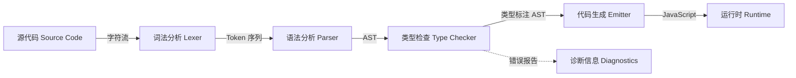

# Mini TypeScript 编译器实验室

## 引言

TypeScript 编译器（`tsc`）是一个超过 10 万行代码的工业级系统，其内部涉及词法分析、语法分析、绑定、类型检查、声明文件生成、代码转换和源代码映射（source map）生成等复杂阶段。
对于学习者而言，直接阅读 `tsc` 源码犹如坠入深渊——宏定义、性能优化、边缘情况处理和向后兼容性代码充斥其间，掩盖了编译器核心机制的简洁之美。

本实验室的目标是**剥离语法糖、模块系统、JSX 和装饰器**，保留类型系统的本质，实现一个可运行的 Mini TypeScript（Mini TS）子集编译器。
通过四个递进实验，你将亲手构建：

1. **词法分析器（Lexer）**——将源代码字符流转换为 Token 序列
2. **语法分析器（Parser）**——将 Token 序列构建为抽象语法树（AST）
3. **类型检查器（Type Checker）**——遍历 AST 推导并验证类型，实现宽度子类型
4. **代码生成器（Code Emitter）**——将类型擦除后的 AST 降译为 JavaScript

每个实验均提供可独立运行的 TypeScript 代码，并在最后映射到真实工程工具（Babel 插件、TypeScript Compiler API、SWC 插件）的对应概念。



## 前置知识

在深入编译器实现之前，请确保已掌握以下基础：

- **形式语言与自动机**：正则语言（词法）、上下文无关文法（语法）
- **TypeScript 类型系统**：基础类型、函数类型、对象类型、联合类型、泛型约束
- **递归下降解析**：自顶向下的语法分析方法
- **树遍历算法**：前序、后序遍历在 AST 处理中的应用

建议预先阅读：

- Robert Nystrom 的 [*Crafting Interpreters*](https://craftinginterpreters.com/)，尤其是 Scanner 与 Parser 章节
- Benjamin C. Pierce 的 [*Types and Programming Languages*](https://www.cis.upenn.edu/~bcpierce/tapl/)（TAPL）第 9–15 章

## 实验一：词法分析（Lexer）

### 实验目标

实现一个能够将 Mini TS 源代码转换为 Token 序列的词法分析器，支持标识符、关键字、数字、字符串、运算符和分隔符的识别。

### 理论背景

词法分析是编译器前端的第一阶段，其任务是**将连续的字符流切分为具有语义的最小单元——Token**。
从形式语言理论看，词法分析等价于识别正则语言：每个 Token 类别对应一个正则表达式，整个词法分析器是一个有限状态自动机（DFA/NFA）的模拟实现。

Mini TS 的词法规则定义如下：

| Token 类别 | 正则表达式 | 示例 |
|-----------|-----------|------|
| 关键字 | `let` \| `if` \| `else` \| `true` \| `false` \| `fn` | `let`, `fn` |
| 标识符 | `[a-zA-Z_][a-zA-Z0-9_]*` | `x`, `fooBar` |
| 数字 | `[0-9]+(\.[0-9]+)?` | `42`, `3.14` |
| 字符串 | `"[^"]*"` | `"hello"` |
| 运算符 | `+` \| `-` \| `*` \| `/` \| `=` \| `==` \| `!=` \| `<` \| `>` \| `:` \| `->` | `+`, `->` |
| 分隔符 | `(` \| `)` \| `{` \| `}` \| `[` \| `]` \| `,` \| `;` | `(`, `}` |

### 实验步骤

#### 步骤 1：定义 Token 类型

```typescript
type TokenType =
  // 关键字
  | 'LET' | 'IF' | 'ELSE' | 'TRUE' | 'FALSE' | 'FN'
  // 标识符与字面量
  | 'IDENT' | 'NUMBER' | 'STRING'
  // 运算符
  | 'PLUS' | 'MINUS' | 'STAR' | 'SLASH'
  | 'ASSIGN' | 'EQ' | 'NOT_EQ' | 'LT' | 'GT' | 'COLON' | 'ARROW'
  // 分隔符
  | 'LPAREN' | 'RPAREN' | 'LBRACE' | 'RBRACE' | 'LBRACKET' | 'RBRACKET'
  | 'COMMA' | 'SEMICOLON'
  // 特殊
  | 'EOF';

interface Token {
  type: TokenType;
  literal: string;
  line: number;
  column: number;
}
```

#### 步骤 2：实现 Scanner

```typescript
class Lexer {
  private pos = 0;
  private line = 1;
  private column = 1;

  constructor(private input: string) {}

  private peek(offset = 0): string {
    const idx = this.pos + offset;
    return idx < this.input.length ? this.input[idx] : '\0';
  }

  private advance(): string {
    const ch = this.input[this.pos++];
    if (ch === '\n') {
      this.line++;
      this.column = 1;
    } else {
      this.column++;
    }
    return ch;
  }

  private skipWhitespace(): void {
    while (' \t\n\r'.includes(this.peek())) this.advance();
  }

  private readNumber(): string {
    let num = '';
    while (/[0-9]/.test(this.peek()) || (this.peek() === '.' && /[0-9]/.test(this.peek(1)))) {
      num += this.advance();
    }
    return num;
  }

  private readString(): string {
    let str = '';
    this.advance(); // 跳过起始 "
    while (this.peek() !== '"' && this.peek() !== '\0') {
      str += this.advance();
    }
    this.advance(); // 跳过结束 "
    return str;
  }

  private readIdentifier(): string {
    let ident = '';
    while (/[a-zA-Z0-9_]/.test(this.peek())) {
      ident += this.advance();
    }
    return ident;
  }

  private lookupIdent(ident: string): TokenType {
    const keywords: Record<string, TokenType> = {
      let: 'LET',
      if: 'IF',
      else: 'ELSE',
      true: 'TRUE',
      false: 'FALSE',
      fn: 'FN',
    };
    return keywords[ident] ?? 'IDENT';
  }

  nextToken(): Token {
    this.skipWhitespace();
    const line = this.line;
    const col = this.column;
    const ch = this.peek();

    const mk = (type: TokenType, literal: string): Token => ({ type, literal, line, column: col });

    switch (ch) {
      case '\0': return this.advance(), mk('EOF', '');
      case '+': return this.advance(), mk('PLUS', '+');
      case '-':
        this.advance();
        if (this.peek() === '>') { this.advance(); return mk('ARROW', '->'); }
        return mk('MINUS', '-');
      case '*': return this.advance(), mk('STAR', '*');
      case '/': return this.advance(), mk('SLASH', '/');
      case '=':
        this.advance();
        if (this.peek() === '=') { this.advance(); return mk('EQ', '=='); }
        return mk('ASSIGN', '=');
      case '!':
        this.advance();
        if (this.peek() === '=') { this.advance(); return mk('NOT_EQ', '!='); }
        throw new Error(`Unexpected character: ! at ${line}:${col}`);
      case '<': return this.advance(), mk('LT', '<');
      case '>': return this.advance(), mk('GT', '>');
      case ':': return this.advance(), mk('COLON', ':');
      case '(': return this.advance(), mk('LPAREN', '(');
      case ')': return this.advance(), mk('RPAREN', ')');
      case '{': return this.advance(), mk('LBRACE', '{');
      case '}': return this.advance(), mk('RBRACE', '}');
      case '[': return this.advance(), mk('LBRACKET', '[');
      case ']': return this.advance(), mk('RBRACKET', ']');
      case ',': return this.advance(), mk('COMMA', ',');
      case ';': return this.advance(), mk('SEMICOLON', ';');
      case '"': return mk('STRING', this.readString());
      default:
        if (/[0-9]/.test(ch)) return mk('NUMBER', this.readNumber());
        if (/[a-zA-Z_]/.test(ch)) {
          const ident = this.readIdentifier();
          return mk(this.lookupIdent(ident), ident);
        }
        throw new Error(`Unexpected character: ${ch} at ${line}:${col}`);
    }
  }

  tokenize(): Token[] {
    const tokens: Token[] = [];
    let tok: Token;
    do {
      tok = this.nextToken();
      tokens.push(tok);
    } while (tok.type !== 'EOF');
    return tokens;
  }
}

// 演示
const source = `
let add = fn(x: number, y: number): number { x + y };
let result = add(1, 2);
`;

const lexer = new Lexer(source);
console.table(lexer.tokenize().map((t) => ({ type: t.type, literal: t.literal })));
```

#### 步骤 3：词法错误处理

在实际编译器中，词法错误不应立即终止整个编译过程，而应收集为诊断信息（Diagnostics）并尝试恢复：

```typescript
interface Diagnostic {
  message: string;
  line: number;
  column: number;
  severity: 'error' | 'warning';
}

class DiagnosticCollector {
  private diagnostics: Diagnostic[] = [];

  report(d: Diagnostic): void {
    this.diagnostics.push(d);
  }

  getDiagnostics(): Diagnostic[] {
    return [...this.diagnostics];
  }

  hasErrors(): boolean {
    return this.diagnostics.some((d) => d.severity === 'error');
  }
}
```

### 工程映射

| 工程工具 | 对应概念 | 说明 |
|---------|---------|------|
| Babel `@babel/parser` | `parse()` 返回 AST | 内置 Scanner，将源码转为 Token 后直接构建 AST |
| TypeScript Compiler API | `ts.createSourceFile()` | 词法分析阶段生成 `SyntaxKind` Token 序列 |
| SWC `@swc/core` | Rust 实现的Lexer | 基于状态机的并行词法分析，性能比 tsc 快 10–20 倍 |
| `acorn` | 轻量 JS Parser | 插件式词法分析，支持自定义 Token 类型 |

---

## 实验二：语法分析（Parser）

### 实验目标

基于实验一的 Token 序列，实现递归下降解析器，构建 Mini TS 的抽象语法树（AST）。支持的语法包括：变量声明、函数声明/表达式、二元运算、条件表达式、调用表达式和块语句。

### 理论背景

语法分析将线性 Token 序列转换为树形 AST，其理论基础是**上下文无关文法（CFG）**。Mini TS 的文法可形式化表示为（简化）：

```
Program     ::= Statement*
Statement   ::= LetStmt | ExprStmt
LetStmt     ::= "let" IDENT "=" Expr ";"
ExprStmt    ::= Expr ";"
Expr        ::= FnExpr | IfExpr | Binary | Primary
FnExpr      ::= "fn" "(" Params ")" ":" Type Block
IfExpr      ::= "if" Expr Block "else" Block
Binary      ::= Primary (Op Primary)*
Primary     ::= NUMBER | STRING | IDENT | "true" | "false" | Call | "(" Expr ")"
Call        ::= IDENT "(" Args ")"
Params      ::= (IDENT ":" Type ("," IDENT ":" Type)*)?
Args        ::= (Expr ("," Expr)*)?
Type        ::= "number" | "string" | "boolean" | "(" Types ")" "->" Type
Types       ::= Type ("," Type)*
Block       ::= "{" Statement* "}"
```

递归下降解析器为每个非终结符编写一个解析函数，通过向前查看（lookahead）Token 决定使用哪条产生式。

### 实验步骤

#### 步骤 1：定义 AST 节点

```typescript
type ASTNode =
  | { kind: 'Program'; body: Statement[] }
  | Statement
  | Expression;

type Statement =
  | { kind: 'Let'; name: string; value: Expression }
  | { kind: 'ExprStmt'; expr: Expression }
  | { kind: 'Block'; statements: Statement[] };

type Expression =
  | { kind: 'NumberLiteral'; value: number }
  | { kind: 'StringLiteral'; value: string }
  | { kind: 'BooleanLiteral'; value: boolean }
  | { kind: 'Identifier'; name: string }
  | { kind: 'Binary'; op: string; left: Expression; right: Expression }
  | { kind: 'Fn'; params: Param[]; returnType: TypeExpr; body: Block }
  | { kind: 'Call'; callee: Expression; args: Expression[] }
  | { kind: 'If'; condition: Expression; consequent: Block; alternate: Block };

type Param = { name: string; type: TypeExpr };
type TypeExpr =
  | { kind: 'PrimitiveType'; name: 'number' | 'string' | 'boolean' }
  | { kind: 'FunctionType'; params: TypeExpr[]; ret: TypeExpr };

type Block = { kind: 'Block'; statements: Statement[] };
```

#### 步骤 2：实现递归下降解析器

```typescript
class Parser {
  private pos = 0;

  constructor(private tokens: Token[]) {}

  private peek(): Token {
    return this.tokens[this.pos] ?? { type: 'EOF', literal: '', line: 0, column: 0 };
  }

  private advance(): Token {
    return this.tokens[this.pos++] ?? this.peek();
  }

  private expect(type: TokenType): Token {
    const tok = this.advance();
    if (tok.type !== type) {
      throw new Error(`Expected ${type}, got ${tok.type} at ${tok.line}:${tok.column}`);
    }
    return tok;
  }

  parse(): { kind: 'Program'; body: Statement[] } {
    const body: Statement[] = [];
    while (this.peek().type !== 'EOF') {
      body.push(this.parseStatement());
    }
    return { kind: 'Program', body };
  }

  private parseStatement(): Statement {
    const tok = this.peek();
    if (tok.type === 'LET') return this.parseLet();
    if (tok.type === 'LBRACE') return this.parseBlock();
    return this.parseExprStmt();
  }

  private parseLet(): Statement {
    this.advance(); // let
    const name = this.expect('IDENT').literal;
    this.expect('ASSIGN');
    const value = this.parseExpression();
    this.expect('SEMICOLON');
    return { kind: 'Let', name, value };
  }

  private parseExprStmt(): Statement {
    const expr = this.parseExpression();
    this.expect('SEMICOLON');
    return { kind: 'ExprStmt', expr };
  }

  private parseBlock(): Block {
    this.expect('LBRACE');
    const statements: Statement[] = [];
    while (this.peek().type !== 'RBRACE' && this.peek().type !== 'EOF') {
      statements.push(this.parseStatement());
    }
    this.expect('RBRACE');
    return { kind: 'Block', statements };
  }

  private parseExpression(): Expression {
    return this.parseIfOrFn();
  }

  private parseIfOrFn(): Expression {
    if (this.peek().type === 'FN') return this.parseFn();
    if (this.peek().type === 'IF') return this.parseIf();
    return this.parseBinary(0);
  }

  private parseFn(): Expression {
    this.advance(); // fn
    this.expect('LPAREN');
    const params: Param[] = [];
    if (this.peek().type !== 'RPAREN') {
      do {
        const name = this.expect('IDENT').literal;
        this.expect('COLON');
        const type = this.parseType();
        params.push({ name, type });
      } while (this.peek().type === 'COMMA' && this.advance());
    }
    this.expect('RPAREN');
    this.expect('COLON');
    const returnType = this.parseType();
    const body = this.parseBlock();
    return { kind: 'Fn', params, returnType, body };
  }

  private parseIf(): Expression {
    this.advance(); // if
    const condition = this.parseExpression();
    const consequent = this.parseBlock();
    this.expect('ELSE');
    const alternate = this.parseBlock();
    return { kind: 'If', condition, consequent, alternate };
  }

  private parseBinary(minPrec: number): Expression {
    let left = this.parsePrimary();

    while (true) {
      const op = this.peek();
      const prec = this.getPrecedence(op.type);
      if (prec < minPrec) break;

      this.advance();
      const right = this.parseBinary(prec + 1);
      left = { kind: 'Binary', op: op.literal, left, right };
    }

    return left;
  }

  private getPrecedence(type: TokenType): number {
    switch (type) {
      case 'EQ': case 'NOT_EQ': return 1;
      case 'LT': case 'GT': return 2;
      case 'PLUS': case 'MINUS': return 3;
      case 'STAR': case 'SLASH': return 4;
      default: return 0;
    }
  }

  private parsePrimary(): Expression {
    const tok = this.peek();
    switch (tok.type) {
      case 'NUMBER':
        this.advance();
        return { kind: 'NumberLiteral', value: parseFloat(tok.literal) };
      case 'STRING':
        this.advance();
        return { kind: 'StringLiteral', value: tok.literal };
      case 'TRUE':
      case 'FALSE':
        this.advance();
        return { kind: 'BooleanLiteral', value: tok.type === 'TRUE' };
      case 'IDENT': {
        this.advance();
        if (this.peek().type === 'LPAREN') {
          return this.parseCall(tok.literal);
        }
        return { kind: 'Identifier', name: tok.literal };
      }
      case 'LPAREN': {
        this.advance();
        const expr = this.parseExpression();
        this.expect('RPAREN');
        return expr;
      }
      default:
        throw new Error(`Unexpected token: ${tok.type} at ${tok.line}:${tok.column}`);
    }
  }

  private parseCall(name: string): Expression {
    this.expect('LPAREN');
    const args: Expression[] = [];
    if (this.peek().type !== 'RPAREN') {
      do {
        args.push(this.parseExpression());
      } while (this.peek().type === 'COMMA' && this.advance());
    }
    this.expect('RPAREN');
    return { kind: 'Call', callee: { kind: 'Identifier', name }, args };
  }

  private parseType(): TypeExpr {
    if (this.peek().type === 'IDENT') {
      const name = this.advance().literal;
      if (name === 'number' || name === 'string' || name === 'boolean') {
        return { kind: 'PrimitiveType', name };
      }
    }
    if (this.peek().type === 'LPAREN') {
      this.advance();
      const params: TypeExpr[] = [];
      if (this.peek().type !== 'RPAREN') {
        do { params.push(this.parseType()); } while (this.peek().type === 'COMMA' && this.advance());
      }
      this.expect('RPAREN');
      this.expect('ARROW');
      const ret = this.parseType();
      return { kind: 'FunctionType', params, ret };
    }
    throw new Error(`Expected type at ${this.peek().line}:${this.peek().column}`);
  }
}

// 演示
const demoSource = `
let add = fn(x: number, y: number): number { x + y };
let max = fn(a: number, b: number): number { if a > b { a } else { b } };
let result = add(max(3, 5), 2);
`;

const tokens = new Lexer(demoSource).tokenize();
const ast = new Parser(tokens).parse();
console.log(JSON.stringify(ast, null, 2));
```

### 工程映射

| 工程工具 | 对应概念 | 说明 |
|---------|---------|------|
| Babel Parser | `@babel/parser` 的 `parseExpression` | 支持插件扩展语法（如 TypeScript、JSX） |
| TypeScript Compiler API | `ts.forEachChild` 遍历 AST | `SourceFile` 即 AST 根节点，节点类型为 `ts.Node` |
| SWC | `@swc/wasm-web` 的 `parseSync` | Rust 实现，输出 ESTree 兼容 AST |
| `acorn` | `parseExpressionAt` | 支持自定义 `ecmaVersion` 和 `sourceType` |

---

## 实验三：类型检查（Type Checker）

### 实验目标

基于实验二的 AST，实现一个支持基础类型、函数类型、对象类型和宽度子类型（width subtyping）的类型检查器。核心算法包括：类型环境（Type Environment）查询、表达式类型推导和子类型关系判定。

### 理论背景

类型检查的形式化基础是**类型规则（typing rules）**，通常表示为 sequent `Γ ⊢ e : T`，意为"在类型环境 `Γ` 下，表达式 `e` 具有类型 `T`"。Mini TS 的类型系统包含：

- **基础类型**：`number`、`string`、`boolean`
- **函数类型**：`(T₁, T₂, ...) → T_ret`
- **对象类型**：`{ l₁: T₁, ..., lₙ: Tₙ }`
- **子类型规则**：宽度子类型（对象可多不可少）+ 函数参数逆变、返回协变

子类型关系 `S <: T` 的判定规则：

- 自反性：`T <: T`
- 宽度子类型：若 `S` 包含 `T` 的所有字段（且字段类型 <:），则 `S <: T`
- 函数子类型：参数逆变、返回协变

### 实验步骤

#### 步骤 1：定义内部类型表示

```typescript
type InternalType =
  | { tag: 'Num' }
  | { tag: 'Str' }
  | { tag: 'Bool' }
  | { tag: 'Void' }
  | { tag: 'Never' }
  | { tag: 'Obj'; fields: Map<string, InternalType> }
  | { tag: 'Func'; params: InternalType[]; ret: InternalType };

const tNum: InternalType = { tag: 'Num' };
const tStr: InternalType = { tag: 'Str' };
const tBool: InternalType = { tag: 'Bool' };
const tVoid: InternalType = { tag: 'Void' };
const tNever: InternalType = { tag: 'Never' };

function typeToString(t: InternalType): string {
  switch (t.tag) {
    case 'Num': return 'number';
    case 'Str': return 'string';
    case 'Bool': return 'boolean';
    case 'Void': return 'void';
    case 'Never': return 'never';
    case 'Obj':
      return `{ ${Array.from(t.fields.entries()).map(([k, v]) => `${k}: ${typeToString(v)}`).join(', ')} }`;
    case 'Func':
      return `(${t.params.map(typeToString).join(', ')}) => ${typeToString(t.ret)}`;
  }
}
```

#### 步骤 2：子类型判定

```typescript
function typeEqual(a: InternalType, b: InternalType): boolean {
  if (a.tag !== b.tag) return false;
  switch (a.tag) {
    case 'Num': case 'Str': case 'Bool': case 'Void': case 'Never': return true;
    case 'Obj': {
      const bf = (b as Extract<InternalType, { tag: 'Obj' }>).fields;
      if (a.fields.size !== bf.size) return false;
      for (const [k, v] of a.fields) {
        const bv = bf.get(k);
        if (!bv || !typeEqual(v, bv)) return false;
      }
      return true;
    }
    case 'Func': {
      const bf = b as Extract<InternalType, { tag: 'Func' }>;
      if (a.params.length !== bf.params.length) return false;
      return a.params.every((p, i) => typeEqual(p, bf.params[i])) && typeEqual(a.ret, bf.ret);
    }
  }
}

function isSubtype(sub: InternalType, sup: InternalType): boolean {
  if (typeEqual(sub, sup)) return true;
  if (sub.tag === 'Never') return true; // never 是任何类型的子类型
  if (sub.tag === 'Obj' && sup.tag === 'Obj') {
    // 宽度子类型：sub 必须包含 sup 的所有字段，且对应字段 <: sup 字段
    for (const [k, vt] of sup.fields) {
      const st = sub.fields.get(k);
      if (!st || !isSubtype(st, vt)) return false;
    }
    return true;
  }
  if (sub.tag === 'Func' && sup.tag === 'Func') {
    // 参数逆变：sup 的参数必须 <: sub 的参数
    if (sub.params.length !== sup.params.length) return false;
    const paramsOk = sup.params.every((p, i) => isSubtype(p, sub.params[i]));
    // 返回协变：sub 的返回必须 <: sup 的返回
    const retOk = isSubtype(sub.ret, sup.ret);
    return paramsOk && retOk;
  }
  return false;
}
```

#### 步骤 3：类型检查器实现

```typescript
class TypeChecker {
  private env = new Map<string, InternalType>();
  private errors: Diagnostic[] = [];

  private report(message: string, line = 0, col = 0): void {
    this.errors.push({ message, line, column: col, severity: 'error' };
  }

  check(ast: ASTNode): InternalType {
    switch (ast.kind) {
      case 'Program': {
        let lastType: InternalType = tVoid;
        for (const stmt of ast.body) {
          lastType = this.checkStatement(stmt);
        }
        return lastType;
      }
      default:
        return this.checkExpression(ast as Expression);
    }
  }

  private checkStatement(stmt: Statement): InternalType {
    switch (stmt.kind) {
      case 'Let': {
        const valueType = this.checkExpression(stmt.value);
        this.env.set(stmt.name, valueType);
        return tVoid;
      }
      case 'ExprStmt': {
        return this.checkExpression(stmt.expr);
      }
      case 'Block': {
        let lastType: InternalType = tVoid;
        for (const s of stmt.statements) {
          lastType = this.checkStatement(s);
        }
        return lastType;
      }
    }
  }

  private checkExpression(expr: Expression): InternalType {
    switch (expr.kind) {
      case 'NumberLiteral': return tNum;
      case 'StringLiteral': return tStr;
      case 'BooleanLiteral': return tBool;
      case 'Identifier': {
        const t = this.env.get(expr.name);
        if (!t) {
          this.report(`Unknown variable: ${expr.name}`);
          return tNever;
        }
        return t;
      }
      case 'Binary': {
        const left = this.checkExpression(expr.left);
        const right = this.checkExpression(expr.right);
        if (expr.op === '+' || expr.op === '-' || expr.op === '*' || expr.op === '/') {
          if (left.tag !== 'Num' || right.tag !== 'Num') {
            this.report(`Arithmetic operator ${expr.op} requires numbers`);
          }
          return tNum;
        }
        if (expr.op === '==' || expr.op === '!=' || expr.op === '<' || expr.op === '>') {
          if (!typeEqual(left, right)) {
            this.report(`Comparison requires compatible types: ${typeToString(left)} vs ${typeToString(right)}`);
          }
          return tBool;
        }
        return tNever;
      }
      case 'Fn': {
        const funcType: InternalType = {
          tag: 'Func',
          params: expr.params.map((p) => this.astTypeToInternal(p.type)),
          ret: this.astTypeToInternal(expr.returnType),
        };
        // 函数体在扩展环境中检查
        const oldEnv = new Map(this.env);
        for (const p of expr.params) {
          this.env.set(p.name, this.astTypeToInternal(p.type));
        }
        const bodyType = this.checkStatement(expr.body);
        this.env = oldEnv;
        if (!isSubtype(bodyType, funcType.ret)) {
          this.report(`Return type mismatch: ${typeToString(bodyType)} <: ${typeToString(funcType.ret)}?`);
        }
        return funcType;
      }
      case 'Call': {
        if (expr.callee.kind !== 'Identifier') {
          this.report('Only identifier calls supported');
          return tNever;
        }
        const funcType = this.env.get(expr.callee.name);
        if (!funcType || funcType.tag !== 'Func') {
          this.report(`Not a function: ${expr.callee.name}`);
          return tNever;
        }
        if (funcType.params.length !== expr.args.length) {
          this.report(`Arity mismatch: expected ${funcType.params.length}, got ${expr.args.length}`);
        }
        for (let i = 0; i < Math.min(funcType.params.length, expr.args.length); i++) {
          const argType = this.checkExpression(expr.args[i]);
          if (!isSubtype(argType, funcType.params[i])) {
            this.report(`Arg ${i} type mismatch: ${typeToString(argType)} <: ${typeToString(funcType.params[i])}`);
          }
        }
        return funcType.ret;
      }
      case 'If': {
        const condType = this.checkExpression(expr.condition);
        if (condType.tag !== 'Bool') {
          this.report(`If condition must be boolean, got ${typeToString(condType)}`);
        }
        const consType = this.checkStatement(expr.consequent);
        const altType = this.checkStatement(expr.alternate);
        // 简化：返回更通用的类型（实际应实现联合类型）
        return isSubtype(consType, altType) ? altType : consType;
      }
    }
  }

  private astTypeToInternal(type: TypeExpr): InternalType {
    switch (type.kind) {
      case 'PrimitiveType':
        if (type.name === 'number') return tNum;
        if (type.name === 'string') return tStr;
        return tBool;
      case 'FunctionType':
        return {
          tag: 'Func',
          params: type.params.map((p) => this.astTypeToInternal(p)),
          ret: this.astTypeToInternal(type.ret),
        };
    }
  }

  getErrors(): Diagnostic[] {
    return [...this.errors];
  }
}

// 演示
const checker = new TypeChecker();
const programType = checker.check(ast);
console.log('Program type:', typeToString(programType));
console.log('Errors:', checker.getErrors());
```

#### 步骤 4：宽度子类型验证

```typescript
// 验证对象宽度子类型
const point3DExpr: Expression = {
  kind: 'Fn',
  params: [{ name: 'p', type: { kind: 'PrimitiveType', name: 'number' } }],
  returnType: { kind: 'PrimitiveType', name: 'number' },
  body: { kind: 'Block', statements: [] },
};

// 手动测试子类型
const point2D: InternalType = {
  tag: 'Obj',
  fields: new Map([
    ['x', tNum],
    ['y', tNum],
  ]),
};

const point3D: InternalType = {
  tag: 'Obj',
  fields: new Map([
    ['x', tNum],
    ['y', tNum],
    ['z', tNum],
  ]),
};

console.log('point3D <: point2D ?', isSubtype(point3D, point2D)); // true（多字段兼容少字段）
console.log('point2D <: point3D ?', isSubtype(point2D, point3D)); // false（缺少 z）
```

### 工程映射

| 工程工具 | 对应概念 | 说明 |
|---------|---------|------|
| TypeScript Compiler API | `ts.TypeChecker` | `getTypeAtLocation`、`isTypeAssignableTo` |
| Babel | `@babel/types` + 插件 | Babel 本身不做类型检查，但可通过 `babel-plugin-tester` 验证 AST |
| SWC | `swc_ecma_transforms` | Rust 实现的类型检查与转换，速度优势显著 |
| ESLint `no-unsafe-*` | 轻量类型推断 | 基于 TypeScript 类型信息的 lint 规则 |

---

## 实验四：代码生成（Emitter）

### 实验目标

实现类型擦除代码生成器，将类型标注后的 AST 降译为纯 JavaScript。支持函数表达式、变量声明、二元运算、条件表达式和调用表达式。

### 理论背景

TypeScript 的编译模型是**擦除式类型**（erased types）：类型仅在编译期存在，运行时被完全擦除。这种设计使 TypeScript 能够零成本地编译为 JavaScript，无需运行时类型信息（RTTI）支持。

代码生成的核心任务是**语法树到目标代码的线性化转换**。对于每个 AST 节点，生成器输出对应的 JavaScript 语法字符串。由于 Mini TS 是 JavaScript 的真子集（仅添加类型标注），代码生成主要是类型擦除和语法映射。

### 实验步骤

#### 步骤 1：实现代码生成器

```typescript
class Emitter {
  private indentLevel = 0;
  private output = '';

  emit(ast: ASTNode): string {
    this.output = '';
    this.emitNode(ast);
    return this.output.trim();
  }

  private write(s: string): void {
    this.output += s;
  }

  private writeln(s: string): void {
    this.write('  '.repeat(this.indentLevel) + s + '\n');
  }

  private indent(): void { this.indentLevel++; }
  private dedent(): void { this.indentLevel--; }

  private emitNode(node: ASTNode): void {
    switch (node.kind) {
      case 'Program':
        for (const stmt of node.body) {
          this.emitNode(stmt);
        }
        break;
      case 'Let':
        this.write(`let ${node.name} = `);
        this.emitNode(node.value);
        this.writeln(';');
        break;
      case 'ExprStmt':
        this.write('  '.repeat(this.indentLevel));
        this.emitNode(node.expr);
        this.writeln(';');
        break;
      case 'Block':
        this.writeln('{');
        this.indent();
        for (const stmt of node.statements) {
          this.emitNode(stmt);
        }
        this.dedent();
        this.writeln('}');
        break;
      case 'NumberLiteral':
        this.write(String(node.value));
        break;
      case 'StringLiteral':
        this.write(`"${node.value}"`);
        break;
      case 'BooleanLiteral':
        this.write(String(node.value));
        break;
      case 'Identifier':
        this.write(node.name);
        break;
      case 'Binary':
        this.write('(');
        this.emitNode(node.left);
        this.write(` ${node.op} `);
        this.emitNode(node.right);
        this.write(')');
        break;
      case 'Fn': {
        this.write('function(');
        this.write(node.params.map((p) => p.name).join(', '));
        this.write(') ');
        // 函数体已经是 Block，但 emitNode(Block) 会额外加花括号
        // 这里直接内联 Block 的内容
        this.writeln('{');
        this.indent();
        for (const stmt of node.body.statements) {
          this.emitNode(stmt);
        }
        this.dedent();
        this.write('  '.repeat(this.indentLevel) + '}');
        break;
      }
      case 'Call':
        this.emitNode(node.callee);
        this.write('(');
        for (let i = 0; i < node.args.length; i++) {
          if (i > 0) this.write(', ');
          this.emitNode(node.args[i]);
        }
        this.write(')');
        break;
      case 'If':
        this.write('((');
        this.emitNode(node.condition);
        this.write(') ? (');
        // 简化：将 Block 转换为 IIFE 或直接展开
        for (const stmt of node.consequent.statements) {
          this.emitNode(stmt);
        }
        this.write(') : (');
        for (const stmt of node.alternate.statements) {
          this.emitNode(stmt);
        }
        this.write('))');
        break;
    }
  }
}

// 演示
const emitter = new Emitter();
const jsCode = emitter.emit(ast);
console.log('=== Generated JavaScript ===');
console.log(jsCode);
```

#### 步骤 2：完整编译流水线集成

将四个阶段串联为完整的编译器：

```typescript
function compile(source: string): { code: string; errors: Diagnostic[] } {
  // 阶段 1：词法分析
  const tokens = new Lexer(source).tokenize();

  // 阶段 2：语法分析
  const ast = new Parser(tokens).parse();

  // 阶段 3：类型检查
  const checker = new TypeChecker();
  checker.check(ast);
  const errors = checker.getErrors();

  // 阶段 4：代码生成（即使存在类型错误也生成，与 tsc 行为一致）
  const code = new Emitter().emit(ast);

  return { code, errors };
}

const testSource = `
let add = fn(x: number, y: number): number { x + y };
let greet = fn(name: string): string { name };
let result = add(greet("world"), 2);
`;

const result = compile(testSource);
console.log('Errors:', result.errors);
console.log('Code:\n', result.code);
```

#### 步骤 3：Source Map 概念（扩展）

虽然 Mini TS 不实现完整的 Source Map 生成，但理解其概念对工程实践至关重要。Source Map 是一个 JSON 文件，建立了生成代码位置与源代码位置的映射关系：

```typescript
interface SourceMapV3 {
  version: 3;
  sources: string[];
  names: string[];
  mappings: string; // VLQ 编码的映射序列
  file: string;
  sourceRoot?: string;
}
```

TypeScript Compiler API 通过 `ts.createSourceMapWriter` 和 `ts.emitFiles` 自动生成 Source Map。Babel 通过 `@babel/generator` 的 `sourceMaps: true` 选项支持。

### 工程映射

| 工程工具 | 对应概念 | 说明 |
|---------|---------|------|
| Babel | `@babel/generator` | AST → JS 代码，支持 `compact`、`minified` 模式 |
| TypeScript Compiler API | `ts.createPrinter()` | 将 `ts.Node` 打印为字符串，保留注释和格式化 |
| SWC | `@swc/core` 的 `transformSync` | Rust 实现的代码生成，内置压缩和 Source Map |
| tsc `--declaration` | `.d.ts` 文件生成 | 从 AST 提取类型签名，生成声明文件 |
| esbuild | `transform` API | Go 实现的极速编译，同时进行解析、转换和生成 |

---

## 实验总结

通过本实验室的四个实验，我们从零构建了一个可运行的 Mini TypeScript 子集编译器，完整走通了编译器前端的核心流水线：

| 阶段 | 核心机制 | 关键算法/数据结构 |
|------|---------|----------------|
| **词法分析** | 正则语言识别 | 有限状态自动机模拟；Token 流；诊断收集器 |
| **语法分析** | 上下文无关文法解析 | 递归下降解析；运算符优先级攀爬；AST 节点定义 |
| **类型检查** | 静态类型推导与验证 | 类型环境（`Map<string, Type>`）；宽度子类型；函数参数逆变/返回协变 |
| **代码生成** | 类型擦除与语法线性化 | 树的后序遍历；缩进管理；表达式优先级括号 |

这套流水线虽然极简，却涵盖了工业级编译器的所有核心概念。理解 Mini TS 的实现后，阅读 Babel 插件、TypeScript Compiler API 或 SWC 源码时将不再迷失于工程细节，而是能够迅速定位到对应的理论概念。

## 延伸阅读

1. **[Microsoft: mini-typescript](https://github.com/microsoft/mini-typescript)** — Microsoft 官方发布的教学型 Mini TypeScript 编译器，与本实验室思路高度一致，代码约 500 行
2. **[Robert Nystrom: Crafting Interpreters](https://craftinginterpreters.com/)** — 编译器实现的最佳入门教材，涵盖 Scanner、Parser、Resolver 和 Interpreter 的完整实现
3. **[Benjamin C. Pierce: Types and Programming Languages](https://www.cis.upenn.edu/~bcpierce/tapl/)** — 类型系统权威教材，第 9 章（Simply Typed Lambda Calculus）和第 15 章（Subtyping）是 Mini TS 的理论基础
4. **[Microsoft TypeScript Compiler Internals](https://github.com/microsoft/TypeScript-Compiler-Notes)** — TypeScript 编译器团队维护的内部笔记，详细解释了 Binder、Checker 和 Emitter 的架构设计
5. **[Featherweight TypeScript: A Verified Type Checker in Dafny](https://doi.org/10.1145/3294031.3294081)** — Microsoft Research 发表的经过形式化验证的 Mini TS 变体，展示了类型检查器的数学正确性证明
