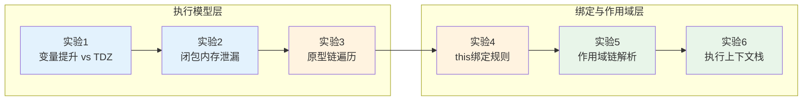
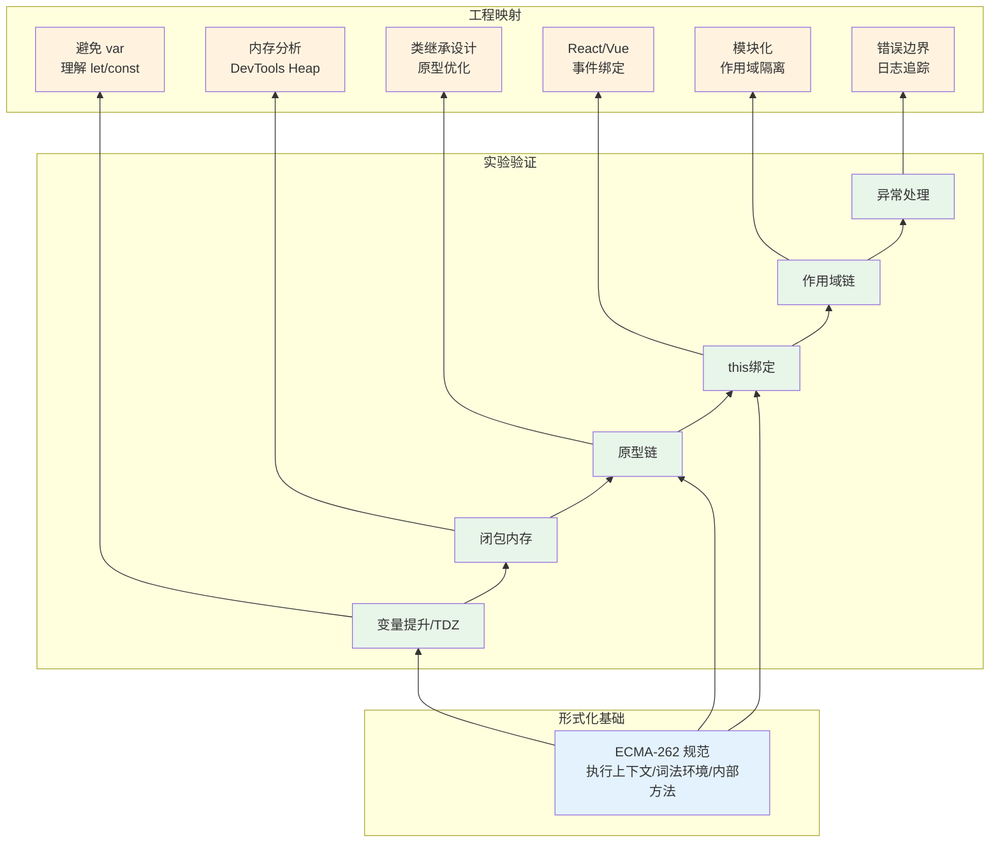

# 语言核心实验室：变量、闭包、原型链的交互实验

> **实验场宣言**：JavaScript 的语言核心不是「语法规则」的静态集合，而是**执行上下文（Execution Contexts）、词法环境（Lexical Environments）与对象内部方法（Internal Methods）**的动态交互系统。本实验室通过可控的代码实验，将 ECMA-262 的抽象规范映射为可观测、可复现、可推导的运行时行为。

---

## 实验室导航图



| 实验编号 | 主题 | 核心规范引用 | 难度 |
|----------|------|--------------|------|
| 实验 1 | 变量提升与暂时性死区（TDZ） | ECMA-262 §8.1.1.3, §13.3.2 | ⭐⭐ |
| 实验 2 | 闭包内存泄漏的检测与修复 | ECMA-262 §8.1, V8 内存管理文档 | ⭐⭐⭐ |
| 实验 3 | 原型链遍历与属性解析算法 | ECMA-262 §6.1.7.3, §9.1.8 | ⭐⭐⭐ |
| 实验 4 | this 绑定规则的系统验证 | ECMA-262 §9.2.2, §9.4.1 | ⭐⭐⭐⭐ |
| 实验 5 | 作用域链与词法环境 | ECMA-262 §8.1 | ⭐⭐⭐ |
| 实验 6 | 执行上下文栈与异常处理 | ECMA-262 §8.3, §8.4 | ⭐⭐⭐⭐ |

---

## 实验 1：变量提升（Hoisting）与暂时性死区（TDZ）

### 理论背景

ECMA-262 将变量声明的创建过程分为三个阶段：**创建（CreateBinding）**、**初始化（InitializeBinding）** 和 **赋值（SetMutableBinding）**。`var` 声明在作用域创建时即完成创建与初始化（绑定为 `undefined`），因此可以在声明前访问；而 `let`/`const` 声明虽然在创建阶段即已绑定，但在执行到初始化语句前处于**未初始化**状态，访问会抛出 `ReferenceError`，这一阶段称为**暂时性死区（Temporal Dead Zone, TDZ）**。

从形式化角度，TDZ 的存在源于 ECMA-262 对**词法环境记录（Lexical Environment Record）**的状态机设计：`let`/`const` 绑定具有 `[[Initialized]]` 内部槽位，在 `InitializeBinding` 被调用前，任何 `GetBindingValue` 操作都会触发 `Throw a ReferenceError`。

### 实验代码

```javascript
// === 阶段 A：var 的提升行为 ===
console.log(hoistedVar); // ?
var hoistedVar = 42;
console.log(hoistedVar); // ?

// === 阶段 B：let 的 TDZ ===
try {
  console.log(tdzLet);
} catch (e) {
  console.log(e.name, ':', e.message);
}
let tdzLet = 99;

// === 阶段 C：const 的 TDZ 与重复声明 ===
const tdzConst = 1;
// const tdzConst = 2; // SyntaxError

// === 阶段 D：函数声明 vs 函数表达式的提升差异 ===
console.log(funcDecl());
// console.log(funcExpr()); // TypeError

function funcDecl() { return 'declared'; }
var funcExpr = function() { return 'expressed'; };

// === 阶段 E：TDZ 的时间窗口——typeof 陷阱 ===
{
  console.log(typeof safeVar); // 'undefined'
  // console.log(typeof unsafeLet); // ReferenceError
  let unsafeLet = 1;
}

// === 阶段 F：参数默认值中的 TDZ ===
function tdzDemo(a = b, b) {
  return a;
}
try {
  console.log(tdzDemo(undefined, 1));
} catch (e) {
  console.log('参数TDZ:', e.name);
}
```

### 预期结果

```
undefined           // var 声明前访问，返回 undefined
42                  // 赋值后的值
ReferenceError : Cannot access 'tdzLet' before initialization
'declared'          // 函数声明完全提升
'undefined'         // typeof 对未声明变量安全
参数TDZ: ReferenceError // 参数默认值存在自己的作用域和TDZ
```

### 变体探索

**变体 1-1**：`let` 声明在 `switch` 语句块中的 TDZ 行为

```javascript
const x = 1;
switch (x) {
  case 1:
    let y = 'inner';
    console.log(y);
    // let y = 'redeclared'; // SyntaxError: Identifier 'y' has already been declared
}
// console.log(y); // ReferenceError
```

ECMA-262 规定 `switch` 语句只创建一个块级作用域，因此所有 `case` 分支共享同一个词法环境。这也是 `let`/`const` 在 `switch` 中需要谨慎使用的原因。

**变体 1-2**：`var` 在函数作用域内的「穿透」效应

```javascript
function scopePenetration() {
  if (true) {
    var penetrated = 'I leak';
  }
  console.log(penetrated); // 'I leak'
}
scopePenetration();
```

`var` 的函数作用域绑定意味着声明被提升到最近的函数顶部，不受块级边界约束。这一行为是 IIFE（Immediately Invoked Function Expression）模式存在的历史原因。

---

## 实验 2：闭包内存泄漏的检测与修复

### 理论背景

闭包（Closure）在 ECMA-262 中的形式化定义是：**由函数及其引用的外部词法环境组合而成的实体**（ECMA-262 §8.1）。当内部函数持有对外部函数词法环境的引用时，即使外部函数已执行完毕，其词法环境（及绑定的变量）也无法被垃圾回收器释放。

V8 引擎使用**标记-清除（Mark-and-Sweep）**与**增量标记（Incremental Marking）**结合的策略进行垃圾回收。闭包相关的内存泄漏通常发生在以下场景：

1. 闭包无意中捕获了大对象或 DOM 引用
2. 事件监听器中的闭包持续持有已失效上下文
3. 定时器中的闭包形成「长寿」引用链

### 实验代码

```javascript
// === 阶段 A：基础闭包的内存观测 ===
function createCounter() {
  let count = 0;
  return {
    increment: () => ++count,
    decrement: () => --count,
    getValue: () => count
  };
}

const counter = createCounter();
console.log(counter.increment()); // 1
console.log(counter.increment()); // 2
console.log(counter.getValue());  // 2

// === 阶段 B：闭包泄漏的经典模式——DOM 引用 ===
function leakyEventHandler() {
  const hugeData = new Array(1_000_000).fill('x').join('');
  const element = document.getElementById('app');

  // 危险：闭包捕获了 hugeData 和 element
  element.addEventListener('click', function onClick() {
    console.log('clicked');
    // 即使从不使用 hugeData，它仍被闭包环境持有
  });
}

// === 阶段 C：修复后的版本——最小捕获原则 ===
function fixedEventHandler() {
  const hugeData = new Array(1_000_000).fill('x').join('');
  const element = document.getElementById('app');

  // 将处理逻辑提取，仅捕获所需的最小上下文
  function handleClick() {
    console.log('clicked');
  }

  element.addEventListener('click', handleClick);

  // 清理时解除引用
  return function cleanup() {
    element.removeEventListener('click', handleClick);
  };
}

// === 阶段 D：WeakRef 与 FinalizationRegistry 的弱引用实验 ===
(function weakReferenceDemo() {
  let target = { data: 'sensitive' };
  const weakRef = new WeakRef(target);

  console.log(weakRef.deref()?.data); // 'sensitive'

  target = null; // 解除强引用

  // 强制触发 GC（仅用于实验环境，如 Node.js --expose-gc）
  if (global.gc) {
    global.gc();
    console.log('After GC:', weakRef.deref()); // null 或 undefined
  }
})();

// === 阶段 E：FinalizationRegistry 的异步清理 ===
const registry = new FinalizationRegistry((heldValue) => {
  console.log('Object cleaned up:', heldValue);
});

(function registerForCleanup() {
  let obj = { id: 42 };
  registry.register(obj, 'resource-42');
  obj = null;
})();

// === 阶段 F：内存占用对比——闭包 vs 原型方法 ===
function ClosureBasedClass() {
  this.value = 0;
  // 每个实例创建新的函数闭包
  this.getValue = () => this.value;
  this.setValue = (v) => { this.value = v; };
}

function PrototypeBasedClass() {}
PrototypeBasedClass.prototype.getValue = function() { return this.value; };
PrototypeBasedClass.prototype.setValue = function(v) { this.value = v; };

// 创建 10000 个实例对比内存
const closures = Array.from({ length: 10000 }, () => new ClosureBasedClass());
const prototypes = Array.from({ length: 10000 }, () => new PrototypeBasedClass());

console.log('Closure instances:', closures.length);
console.log('Prototype instances:', prototypes.length);
// 在 Chrome DevTools Memory 面板中观察，ClosureBasedClass 的每个实例
// 都持有独立的 getValue/setValue 函数对象，内存占用显著更高
```

### 预期结果

```
1
2
2
sensitive
After GC: null 或 undefined（取决于GC时机）
Closure instances: 10000
Prototype instances: 10000
（内存占用差异需在 DevTools 中观测）
```

### 变体探索

**变体 2-1**：循环中的闭包陷阱与修复

```javascript
// 陷阱版本：所有回调共享同一个 i
for (var i = 0; i < 3; i++) {
  setTimeout(() => console.log('var trap:', i), 10);
}
// 输出: var trap: 3 × 3

// 修复 A：使用 let 创建块级绑定
for (let j = 0; j < 3; j++) {
  setTimeout(() => console.log('let fix:', j), 20);
}
// 输出: let fix: 0, 1, 2

// 修复 B：使用 IIFE 创建私有作用域
for (var k = 0; k < 3; k++) {
  (function(capturedK) {
    setTimeout(() => console.log('iife fix:', capturedK), 30);
  })(k);
}
```

**变体 2-2**：闭包在模块模式中的应用

```javascript
const Module = (function() {
  const privateData = new WeakMap();

  class MyClass {
    constructor(secret) {
      privateData.set(this, { secret });
    }
    reveal() {
      return privateData.get(this).secret;
    }
  }

  return { MyClass };
})();

const instance = new Module.MyClass('hidden');
console.log(instance.reveal()); // 'hidden'
// console.log(instance.secret); // undefined
```

---

## 实验 3：原型链遍历与属性解析算法

### 理论背景

ECMA-262 §9.1.8 定义了对象的 **
[[Get]]** 内部方法，它驱动了属性访问的完整流程：

1. 在当前对象的 `[[OwnPropertyKeys]]` 中查找匹配的属性键
2. 若未找到，沿 `[[Prototype]]` 链递归查找
3. 若到达原型链末端（`null`）仍未找到，返回 `undefined`
4. 若找到数据属性，返回其 `[[Value]]`
5. 若找到访问器属性，调用其 `[[Get]]` 并绑定 `this`

原型链的长度直接影响属性访问的时间复杂度。V8 使用 **Inline Caches（ICs）** 优化频繁访问的属性，但原型链的动态修改（如运行时 `Object.setPrototypeOf`）会导致 IC 失效（deopt）。

### 实验代码

```javascript
// === 阶段 A：基础原型链构造 ===
const protoA = {
  name: 'A',
  sharedMethod() { return `from ${this.name}`; }
};

const objB = Object.create(protoA);
objB.name = 'B';

const objC = Object.create(objB);
objC.name = 'C';

console.log(objC.sharedMethod()); // 'from C'
console.log(objC.toString());     // '[object Object]'（来自 Object.prototype）

// === 阶段 B：属性遮蔽（Shadowing）与解析优先级 ===
protoA.color = 'red';
objB.color = 'blue';

console.log(objC.color);  // 'blue' — objB 遮蔽了 protoA
console.log(objB.color);  // 'blue'
console.log(protoA.color); // 'red'

// === 阶段 C：访问器属性的 this 绑定 ===
const tempObj = {
  _temperature: 20,
  get celsius() { return this._temperature; },
  set celsius(v) { this._temperature = v; }
};

const reading = Object.create(tempObj);
console.log(reading.celsius); // 20 — this 绑定到 reading
reading.celsius = 25;
console.log(tempObj._temperature); // 20 — 未改变！
console.log(reading._temperature); // 25 — 在 reading 上创建了自有属性

// === 阶段 D：原型链动态修改的性能影响 ===
function DynamicProto() {
  this.value = Math.random();
}

DynamicProto.prototype.getValue = function() {
  return this.value;
};

const instances = Array.from({ length: 100000 }, () => new DynamicProto());

// 热路径：V8 已优化
let sum1 = 0;
for (const inst of instances) {
  sum1 += inst.getValue();
}

// 动态修改原型链 —— 导致所有 IC 失效
DynamicProto.prototype.getValue = function() {
  return this.value * 2;
};

// 冷路径：需重新建立 IC
let sum2 = 0;
for (const inst of instances) {
  sum2 += inst.getValue();
}

console.log('Sum before mutation:', sum1);
console.log('Sum after mutation:', sum2);

// === 阶段 E：Object.create(null) 与常规对象的区别 ===
const dict1 = {};
const dict2 = Object.create(null);

console.log('toString' in dict1);  // true — 继承自 Object.prototype
console.log('toString' in dict2);  // false — 无原型

// dict1 不适合作为字典/映射的键空间
dict1['toString'] = 'value';
console.log(dict1.toString); // 'value'（遮蔽了继承的方法，但仍有歧义）

// === 阶段 F：class 语法糖的原型链 ===
class Animal {
  constructor(name) {
    this.name = name;
  }
  speak() { return `${this.name} makes a sound`; }
}

class Dog extends Animal {
  speak() { return `${this.name} barks`; }
}

const dog = new Dog('Rex');
console.log(dog.speak());        // 'Rex barks'
console.log(dog.__proto__ === Dog.prototype);              // true
console.log(Dog.prototype.__proto__ === Animal.prototype);  // true
console.log(Dog.__proto__ === Animal);                      // true（静态继承）
```

### 预期结果

```
from C
[object Object]
blue
blue
red
20
20
25
Sum before mutation: [某个浮点数]
Sum after mutation: [约为前者2倍]
true
false
value
Rex barks
true
true
true
```

### 变体探索

**变体 3-1**：使用 `Reflect` 进行元编程级别的属性操作

```javascript
const handler = {
  get(target, prop, receiver) {
    console.log(`Getting ${String(prop)}`);
    return Reflect.get(target, prop, receiver);
  }
};

const proxied = new Proxy({ a: 1, __proto__: { b: 2 } }, handler);
console.log(proxied.a); // Getting a → 1
console.log(proxied.b); // Getting b → 2（原型链访问也会触发 Proxy trap）
```

**变体 3-2**：原型链末端的 `hasOwnProperty` 安全问题

```javascript
const unsafeObj = Object.create(null);
// unsafeObj.hasOwnProperty('key'); // TypeError!

// 安全做法
console.log(Object.prototype.hasOwnProperty.call(unsafeObj, 'key')); // false
console.log(Object.hasOwn(unsafeObj, 'key')); // false（ES2022 推荐）
```

---

## 实验 4：this 绑定规则的系统验证

### 理论背景

ECMA-262 §9.2.2 定义了函数调用的 `[[Call]]` 内部方法，其中 `this` 的绑定逻辑是 JavaScript 中最复杂且最容易出错的语义之一。`this` 的确定遵循**调用点（Call Site）**规则，而非词法作用域：

1. **默认绑定**：独立函数调用，`this` 为 `undefined`（严格模式）或全局对象（非严格模式）
2. **隐式绑定**：方法调用，`this` 为调用上下文对象
3. **显式绑定**：`call`/`apply`/`bind`，`this` 为指定的第一个参数
4. **`new` 绑定**：构造函数调用，`this` 为新创建的实例对象
5. **箭头函数**：词法绑定，继承外层函数的 `this`

### 实验代码

```javascript
'use strict';

// === 阶段 A：默认绑定 ===
function defaultBinding() {
  console.log('default:', this);
}
defaultBinding(); // undefined（严格模式）

// === 阶段 B：隐式绑定与丢失 ===
const obj = {
  name: 'context',
  showThis() {
    console.log('implicit:', this.name);
  }
};

obj.showThis(); // 'context'

const detached = obj.showThis;
detached(); // TypeError: Cannot read property 'name' of undefined

// === 阶段 C：显式绑定的优先级 ===
function explicitBinding() {
  console.log('explicit:', this.name);
}

const ctx1 = { name: 'ctx1' };
const ctx2 = { name: 'ctx2' };

explicitBinding.call(ctx1);       // 'ctx1'
explicitBinding.apply(ctx2);      // 'ctx2'
const bound = explicitBinding.bind(ctx1);
bound.call(ctx2);                 // 'ctx1' — bind 优先级高于 call

// === 阶段 D：new 绑定的最高优先级 ===
function Constructor(name) {
  this.name = name;
}

const boundCtor = Constructor.bind({ name: 'pre-bound' });
const instance = new boundCtor('instance');
console.log('new binding:', instance.name); // 'instance'

// === 阶段 E：箭头函数的词法 this ===
const lexicalObj = {
  name: 'lexical',
  regular: function() {
    setTimeout(function() {
      console.log('regular timeout:', this?.name);
    }, 0);
  },
  arrow: function() {
    setTimeout(() => {
      console.log('arrow timeout:', this.name);
    }, 0);
  }
};

lexicalObj.regular(); // 'regular timeout: undefined'
lexicalObj.arrow();   // 'arrow timeout: lexical'

// === 阶段 F：DOM 回调中的 this ===
// 在浏览器环境中：
// const button = document.querySelector('button');
// button.addEventListener('click', function() {
//   console.log(this === button); // true — 隐式绑定到 DOM 元素
// });
// button.addEventListener('click', () => {
//   console.log(this); // window（词法继承外层 this）
// });

// === 阶段 G：类方法中的 this 绑定 ===
class Button {
  constructor(label) {
    this.label = label;
    // 方案 A：构造函数中绑定
    this.handleClickBound = this.handleClickBound.bind(this);
  }

  handleClickUnbound() {
    console.log('class unbound:', this?.label);
  }

  handleClickBound() {
    console.log('class bound:', this.label);
  }

  // 方案 B：类字段 + 箭头函数（Babel/TypeScript 转译）
  handleClickField = () => {
    console.log('class field:', this.label);
  }
}

const btn = new Button('Submit');
const unboundRef = btn.handleClickUnbound;
const boundRef = btn.handleClickBound;
const fieldRef = btn.handleClickField;

unboundRef(); // 'class unbound: undefined'
boundRef();   // 'class bound: Submit'
fieldRef();   // 'class field: Submit'
```

### 预期结果

```
default: undefined
implicit: context
TypeError: Cannot read property 'name' of undefined
explicit: ctx1
explicit: ctx2
explicit: ctx1
new binding: instance
regular timeout: undefined
arrow timeout: lexical
class unbound: undefined
class bound: Submit
class field: Submit
```

### 变体探索

**变体 4-1**：间接调用中的 `this` 暴露（globalThis 泄露）

```javascript
const obj = {
  value: 42,
  getValue: function() {
    return this.value;
  }
};

// 间接调用导致 this 变为全局对象
const fn = obj.getValue;
console.log(fn());        // undefined（严格模式）
console.log((0, obj.getValue)()); // 同样 undefined — 逗号表达式导致间接调用

// 安全包装
function safeMethod(obj, methodName) {
  return obj[methodName].bind(obj);
}
```

**变体 4-2**：`call`/`apply` 的 `thisArg` 被忽略的情况

```javascript
function test() { console.log(this); }

test.call(null);       // null（严格模式）或 globalThis（非严格）
test.call(undefined);  // undefined 或 globalThis
test.call(42);         // Number {42}（装箱）
test.call('hello');    // String {'hello'}

// Symbol 或 BigInt 同样会被装箱
test.call(Symbol('x')); // TypeError in some engines for primitive thisArg coercion
```

---

## 实验 5：作用域链与词法环境

### 理论背景

ECMA-262 §8.1 将**词法环境（Lexical Environment）**定义为用于定义标识符与变量/函数绑定的关联的规范类型。每个词法环境由**环境记录（Environment Record）**和**外部词法环境引用（Outer Lexical Environment Reference）**组成。

作用域链（Scope Chain）是词法环境通过 `[[OuterEnv]]` 指针形成的单向链表。当解析标识符时，引擎从当前词法环境开始，沿 `[[OuterEnv]]` 链逐层向上查找，直到全局环境或找到匹配绑定。

关键洞察：**作用域链在函数定义时确定（词法作用域），而非调用时**。这意味着函数的作用域链取决于其声明位置，而非调用位置。

### 实验代码

```javascript
// === 阶段 A：词法作用域的静态性 ===
const globalVar = 'global';

function outer() {
  const outerVar = 'outer';

  function inner() {
    const innerVar = 'inner';
    console.log(globalVar, outerVar, innerVar);
  }

  return inner;
}

const innerFunc = outer();
innerFunc(); // 'global outer inner' — outer() 已返回，但词法环境仍存活

// === 阶段 B：with 语句的动态作用域污染（严格模式已禁用） ===
// 'use strict' 下以下代码会报错
// function dynamicScope() {
//   const obj = { a: 'from obj' };
//   const a = 'from local';
//   with (obj) {
//     console.log(a); // 'from obj' — 动态修改了作用域链
//   }
// }

// === 阶段 C：eval 的词法作用域操作 ===
function evalScope() {
  const x = 1;
  eval('const y = x + 1; console.log("eval:", y)'); // 2
  // console.log(y); // ReferenceError — eval 在严格模式下创建局部变量
}
evalScope();

function sloppyEval() {
  const x = 1;
  eval('var z = x + 1'); // 非严格模式下泄漏到函数作用域
  console.log('sloppy z:', z); // 2
}
sloppyEval();

// === 阶段 D：块级作用域与函数作用域的嵌套 ===
function blockNesting() {
  const a = 'function scope';

  if (true) {
    const a = 'block scope';
    console.log('inside block:', a); // 'block scope'

    if (true) {
      const a = 'nested block';
      console.log('nested block:', a); // 'nested block'
    }

    console.log('after nested:', a); // 'block scope'
  }

  console.log('outside block:', a); // 'function scope'
}
blockNesting();

// === 阶段 E：try/catch 的独立作用域 ===
function catchScope() {
  try {
    throw new Error('test');
  } catch (err) {
    const local = 'catch local';
    console.log('catch:', err.message, local);
  }
  // console.log(err); // ReferenceError — catch 参数仅存在于 catch 块
  // console.log(local); // ReferenceError
}
catchScope();

// === 阶段 F：模块作用域 vs 脚本作用域 ===
// 在 ES Module 中：
// const moduleScoped = 'only in this module';
// console.log(window.moduleScoped); // undefined

// 在普通脚本中：
// const scriptScoped = 'leaks in sloppy mode? No, const is block scoped even in scripts'
// var scriptVar = 'this leaks to globalThis'; // globalThis.scriptVar === 'this leaks to globalThis'
```

### 预期结果

```
global outer inner
eval: 2
sloppy z: 2
inside block: block scope
nested block: nested block
after nested: block scope
outside block: function scope
catch: test catch local
```

### 变体探索

**变体 5-1**：`let`/`const` 的块级作用域在 `for` 循环中的 TDZ 交互

```javascript
for (let i = 0; i < 3; i++) {
  setTimeout(() => console.log('for-let:', i), 0);
}
// for-let: 0, 1, 2

for (const key of ['a', 'b', 'c']) {
  setTimeout(() => console.log('for-of-const:', key), 10);
}
// for-of-const: a, b, c

// 每次迭代创建新的词法环境，const 绑定不同的值
```

**变体 5-2**：动态 import() 创建的独立模块作用域

```javascript
// module.js
// export const value = Math.random();

// main.js
// const mod1 = await import('./module.js');
// const mod2 = await import('./module.js');
// console.log(mod1.value === mod2.value); // true（同一模块实例）
// 若使用 ?t=1 查询参数，可能创建不同实例
```

---

## 实验 6：执行上下文栈与异常处理

### 理论背景

ECMA-262 §8.3 定义了**执行上下文栈（Execution Context Stack）**作为跟踪脚本和函数执行后进先出（LIFO）数据结构。每次函数调用都会创建一个新的执行上下文并压入栈顶；函数返回时弹出。

异常处理机制通过**try 语句的完成记录（Completion Record）**实现。当抛出异常时，引擎沿执行上下文栈向上搜索匹配的 `catch` 块。若到达栈底仍未找到，异常变为**未捕获异常（Uncaught Exception）**。

### 实验代码

```javascript
// === 阶段 A：执行上下文栈的深度观测 ===
function deepCall(depth) {
  if (depth <= 0) {
    // 在 Node.js 中：
    // console.log(new Error('stack trace').stack);
    return 'bottom';
  }
  return deepCall(depth - 1);
}

console.log(deepCall(3));

// === 阶段 B：尾调用优化（TCO）的严格模式条件 ===
'use strict';
function factorial(n, acc = 1) {
  if (n <= 1) return acc;
  return factorial(n - 1, n * acc); // 尾调用位置
}

console.log('factorial(5):', factorial(5)); // 120

// 注意：仅 Safari/JavaScriptCore 实现了 ES6 指定的 TCO
// V8 和 SpiderMonkey 未实现 TCO，因此仍会增长调用栈

// === 阶段 C：异常冒泡与执行上下文恢复 ===
function level3() {
  throw new Error('from level 3');
}

function level2() {
  try {
    level3();
  } catch (e) {
    console.log('caught at level 2:', e.message);
    throw new Error('rethrown from level 2');
  }
}

function level1() {
  try {
    level2();
  } catch (e) {
    console.log('caught at level 1:', e.message);
  }
}

level1();

// === 阶段 D：finally 块的控制流覆盖 ===
function finallyFlow(type) {
  try {
    if (type === 'return') return 'try-return';
    if (type === 'throw') throw new Error('try-throw');
    console.log('try completed');
  } catch (e) {
    if (type === 'return-in-catch') return 'catch-return';
    console.log('catch:', e.message);
  } finally {
    console.log('finally always runs');
    if (type === 'finally-override') return 'finally-return'; // 覆盖 try/catch 的 return
  }
}

console.log(finallyFlow('return'));          // 'finally-return'
console.log(finallyFlow('throw'));           // finally runs, then undefined
console.log(finallyFlow('return-in-catch')); // 'finally-return'
console.log(finallyFlow('finally-override')); // 'finally-return'

// === 阶段 E：异步上下文与执行上下文栈 ===
async function asyncContext1() {
  console.log('async start');
  await Promise.resolve();
  console.log('after await'); // 此时原执行上下文已退出，这是新的微任务上下文
}

asyncContext1();
console.log('sync end');
// 输出顺序：async start → sync end → after await

// === 阶段 F：Error 对象的堆栈追踪与 source map ===
class CustomError extends Error {
  constructor(message) {
    super(message);
    this.name = 'CustomError';
    // Error.captureStackTrace 在 V8 中可用
    if (Error.captureStackTrace) {
      Error.captureStackTrace(this, CustomError);
    }
  }
}

function a() { b(); }
function b() { c(); }
function c() { throw new CustomError('trace me'); }

try {
  a();
} catch (e) {
  console.log('Error name:', e.name);
  console.log('Stack includes a, b, c:', e.stack.includes('a') && e.stack.includes('b'));
}
```

### 预期结果

```
bottom
factorial(5): 120
caught at level 2: from level 3
caught at level 1: rethrown from level 2
finally always runs
finally-return
finally always runs
catch: try-throw
finally always runs
finally-return
finally always runs
finally-return
async start
sync end
after await
Error name: CustomError
Stack includes a, b, c: true
```

### 变体探索

**变体 6-1**：`AggregateError` 的多异常收集

```javascript
const promises = [
  Promise.reject(new Error('fail 1')),
  Promise.reject(new Error('fail 2')),
  Promise.resolve('success')
];

Promise.allSettled(promises).then(results => {
  const failures = results
    .filter(r => r.status === 'rejected')
    .map(r => r.reason);

  if (failures.length > 0) {
    throw new AggregateError(failures, 'Multiple failures');
  }
}).catch(e => {
  if (e instanceof AggregateError) {
    console.log('Aggregate:', e.message);
    console.log('Errors count:', e.errors.length);
  }
});
```

**变体 6-2**：`try` 块中使用 `await` 的异步异常处理

```javascript
async function asyncError() {
  try {
    const result = await Promise.reject(new Error('async fail'));
    console.log(result); // 不会执行
  } catch (e) {
    console.log('Async catch:', e.message); // 'async fail'
    return 'recovered';
  }
}

asyncError().then(v => console.log('Resolved to:', v)); // 'Resolved to: recovered'
```

---

## 总结

本实验室通过 6 个递进式实验，系统验证了 JavaScript 语言核心的运行时机制：

1. **变量提升与 TDZ**：`var` 的创建-初始化-赋值三阶段与 `let`/`const` 的暂时性死区是词法环境记录状态机的直接体现。理解这一机制可避免 `typeof` 陷阱和参数默认值中的引用错误。

2. **闭包与内存管理**：闭包是词法环境的运行时残留，其内存占用取决于捕获的变量集合。通过最小捕获原则、WeakRef 和 FinalizationRegistry，可在保持闭包表达能力的同时控制内存泄漏风险。

3. **原型链解析**：`[[Get]]` 内部方法定义的属性解析算法具有线性时间复杂度。原型链的动态修改会导致 Inline Cache 失效，这在性能敏感场景中需要特别注意。

4. **this 绑定**：`this` 的确定遵循调用点规则的五级优先级（默认 < 隐式 < 显式 < `new` < 箭头函数词法），而非词法作用域。类方法中的 `this` 丢失是 React/Vue 组件开发中最常见的陷阱之一。

5. **作用域链**：词法作用域的静态性保证了代码的可预测性，而 `eval` 和 `with`（已废弃）提供了动态作用域的能力，代价是引擎优化的失效。

6. **执行上下文栈**：LIFO 结构的执行上下文栈驱动了函数调用、异常冒泡和异步任务的上下文切换。`finally` 块的控制流覆盖行为常常出人意料，需要谨慎使用。



---

## 参考文献与延伸阅读

1. **ECMA-262, 15th Edition** — *ECMAScript 2024 Language Specification*. 特别是 §8（Execution Contexts）、§9（Ordinary and Exotic Objects Behaviors）和 §13（ECMAScript Language: Statements and Declarations）。在线版本：<https://tc39.es/ecma262/>

2. **MDN Web Docs** — *Closures*（<https://developer.mozilla.org/en-US/docs/Web/JavaScript/Closures）与> *this*（<https://developer.mozilla.org/en-US/docs/Web/JavaScript/Reference/Operators/this）。Mozilla> 开发者网络提供了这些核心概念最全面、最准确的工程映射。

3. **V8 Blog, "Trash talk"** — *Understanding garbage collection in V8*（<https://v8.dev/blog/trash-talk）。V8> 团队的官方博客深入解释了标记-清除、增量标记和写屏障机制，是理解闭包内存行为的权威来源。

4. **Axel Rauschmayer** — *Speaking JavaScript: An In-Depth Guide for Programmers*（O'Reilly, 2014）。第16章「Variables: Scopes, Environments, and Closures」提供了词法环境模型最清晰的教程式解释。

5. **Nicolás Bevacqua** — *JavaScript Application Design: A Build First Approach*（Manning, 2015）。第4章「Dependency Management」中关于模块作用域和闭包模式的工程实践与本实验的「最小捕获原则」形成互补。

---

*最后更新: 2026-05-01 | 分类: code-lab | 规范版本: ECMA-262 15th Edition*
