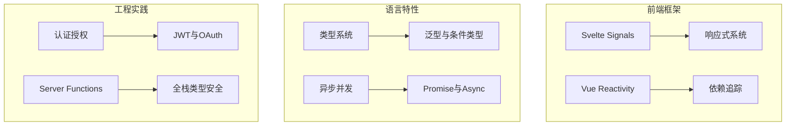

# 实验室专题 (90-96)

> 专题实验室覆盖特定技术栈或工程领域的深度实验。每个专题都聚焦于一个具体的技术方向，提供从理论到实践的完整学习路径。

## 专题列表



## 可用实验

| 专题 | 实验文件 | 难度 | 预计用时 |
|------|----------|------|----------|
| Svelte Signals | [svelte-signals-lab](/code-lab/svelte-signals-lab) | 🌿 中级 | 45min |
| 语言核心 | [language-core-lab](/code-lab/language-core-lab) | 🌱 初级 | 30min |
| 异步并发 | [async-concurrency-lab](/code-lab/async-concurrency-lab) | 🌿 中级 | 45min |
| 类型系统 | [type-system-lab](/code-lab/type-system-lab) | 🍂 高级 | 60min |
| λ Lambda演算 | [lab-00-lambda-calculus](/code-lab/lab-00-lambda-calculus) | 🍂 高级 | 90min |
| 操作语义 | [lab-00-operational-semantics](/code-lab/lab-00-operational-semantics) | 🍂 高级 | 90min |
| 工程环境 | [lab-01-basic-setup](/code-lab/lab-01-basic-setup) | 🌱 初级 | 30min |
| 类型推断 | [lab-01-type-inference](/code-lab/lab-01-type-inference) | 🌿 中级 | 45min |
| 公理语义 | [lab-02-axiomatic-semantics](/code-lab/lab-02-axiomatic-semantics) | 🍂 高级 | 90min |
| Server Functions | [lab-02-server-functions](/code-lab/lab-02-server-functions) | 🌿 中级 | 60min |
| 子类型关系 | [lab-02-subtyping](/code-lab/lab-02-subtyping) | 🌿 中级 | 45min |
| 变量系统 | [lab-02-variables](/code-lab/lab-02-variables) | 🌱 初级 | 30min |
| 认证授权 | [lab-03-auth](/code-lab/lab-03-auth) | 🌿 中级 | 60min |
| 控制流 | [lab-03-control-flow](/code-lab/lab-03-control-flow) | 🌱 初级 | 30min |
| Mini TS编译器 | [lab-03-mini-typescript](/code-lab/lab-03-mini-typescript) | 🍂 高级 | 120min |

## Svelte Signals 实验室（推荐）

Svelte 5 引入了全新的响应式系统 Runes，彻底改变了状态管理的方式：

```svelte
&lt;script&gt;
  let count = $state(0);      // 响应式状态
  let doubled = $derived(count * 2); // 派生状态

  $effect(() => &#123;            // 副作用
    console.log('Count changed:', count);
  &#125;);
&lt;/script&gt;

&lt;button onclick=&#123;() => count++&#125;&gt;
  &#123;count&#125; × 2 = &#123;doubled&#125;
&lt;/button&gt;
```

## 参考资源

- [Svelte Signals 专题](/svelte-signals-stack/) — 完整的响应式系统理论
- [编程原则](/programming-principles/) — λ演算与形式语义
- [TypeScript 类型系统](/typescript-type-system/) — 类型理论深度专题

---

 [← 返回代码实验室首页](./)
