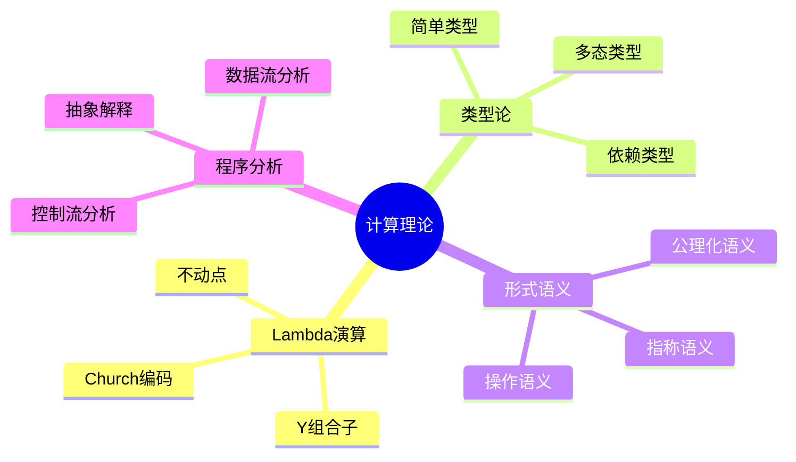

# 理论深度 (40-41, 77-81)

> 本实验室连接计算机科学的理论基础与前端工程实践。通过形式化方法、类型论和程序分析的学习，建立对编程语言本质的深层理解。

## 理论基础图谱



## 实验模块

| 编号 | 模块 | 核心内容 | 理论联系 |
|------|------|----------|----------|
| **40** | computation-theory | λ演算、图灵机、可计算性 | 计算本质 |
| **41** | formal-methods | 规约、验证、模型检测 | 正确性保证 |
| **77** | category-theory | 范畴、函子、自然变换 | 类型系统数学基础 |
| **78** | linear-logic | 线性逻辑、资源敏感 | 内存管理 |
| **79** | proof-assistants | Coq、Agda、依赖类型 | 形式化验证 |
| **80** | program-synthesis | 程序合成、归纳编程 | AI代码生成 |
| **81** | verification | 霍尔逻辑、最弱前置条件 | 静态分析 |

## 核心实验

### λ演算实现

```typescript
// 实验：实现 λ演算解释器
type Term =
  | &#123; type: 'var'; name: string &#125;
  | &#123; type: 'abs'; param: string; body: Term &#125;
  | &#123; type: 'app'; func: Term; arg: Term &#125;;

// 变量替换
function substitute(term: Term, name: string, replacement: Term): Term &#123;
  switch (term.type) &#123;
    case 'var':
      return term.name === name ? replacement : term;
    case 'abs':
      if (term.param === name) return term;
      return &#123; type: 'abs', param: term.param, body: substitute(term.body, name, replacement) &#125;;
    case 'app':
      return &#123;
        type: 'app',
        func: substitute(term.func, name, replacement),
        arg: substitute(term.arg, name, replacement),
      &#125;;
  &#125;
&#125;

// β规约
function betaReduce(term: Term): Term &#123;
  if (term.type === 'app' && term.func.type === 'abs') &#123;
    return substitute(term.func.body, term.func.param, term.arg);
  &#125;
  return term;
&#125;
```

### 抽象解释实验

```typescript
// 实验：常量传播分析
interface AbstractValue &#123;
  kind: 'top' | 'const' | 'bottom';
  value?: number;
&#125;

function join(a: AbstractValue, b: AbstractValue): AbstractValue &#123;
  if (a.kind === 'bottom') return b;
  if (b.kind === 'bottom') return a;
  if (a.kind === 'const' && b.kind === 'const' && a.value === b.value) &#123;
    return a;
  &#125;
  return &#123; kind: 'top' &#125;;
&#125;

// 分析：x = 5; y = x + 3 → x=const(5), y=const(8)
// 分析：if (cond) x = 1 else x = 2 → x=top
```

## 参考资源

- [理论前沿](/theoretical-foundations/) — 36篇理论摘要导航
- [编程原则](/programming-principles/) — 计算思维、λ演算、类型论
- [学术前沿导读](/fundamentals/academic-frontiers) — 守卫域理论、TSGo编译器

---

 [← 返回代码实验室首页](./)
