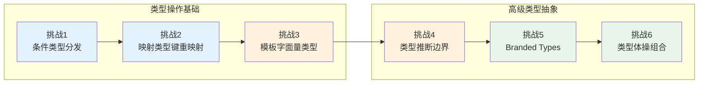
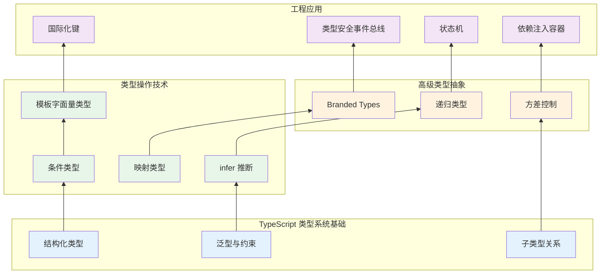

# 类型系统实验室：从基础到体操的渐进挑战

> **实验场宣言**：TypeScript 的类型系统不是「JavaScript 的注解层」，而是一个**图灵完备的结构化类型系统**，其表达能力足以描述任意复杂的静态约束。本实验室通过 6 个从初级到高级的渐进挑战，将类型从「辅助工具」提升为「设计语言」——在编译期捕获错误、表达不变式、甚至驱动代码生成。

---

## 实验室导航图



| 挑战编号 | 主题 | 核心概念 | 难度 |
|----------|------|----------|------|
| 挑战 1 | 条件类型的分发与推断 | Distributive Conditional Types, infer | ⭐⭐ |
| 挑战 2 | 映射类型的键重映射 | Key Remapping, as 子句, 过滤 | ⭐⭐⭐ |
| 挑战 3 | 模板字面量类型的模式匹配 | Template Literal Types, 递归模式匹配 | ⭐⭐⭐ |
| 挑战 4 | 类型推断的边界条件 | 协变/逆变/双变/抗变, 严格函数类型 | ⭐⭐⭐⭐ |
| 挑战 5 | Branded Types 与名义类型 | 相交类型, 唯一标记, 不透明类型 | ⭐⭐⭐ |
| 挑战 6 | 类型体操的组合应用 | 递归类型, 尾递归优化, 实用工具链 | ⭐⭐⭐⭐⭐ |

---

## 挑战 1：条件类型的分发与推断

### 理论背景

TypeScript 的条件类型语法 `T extends U ? X : Y` 不仅是简单的三元表达式，它具有**分发性（Distributivity）**：当 `T` 是裸类型参数（naked type parameter）时，条件类型会自动分发到联合类型的每个成员上。

这一特性是构建高级类型工具的基石。结合 `infer` 关键字，条件类型可以从复合类型中「提取」子类型，实现类型层面的模式匹配和解构。

### 挑战代码

```typescript
// === 阶段 A：条件类型的基础语义 ===
type IsString<T> = T extends string ? true : false;

type A = IsString<'hello'>;    // true
type B = IsString<42>;         // false
type C = IsString<'hi' | 42>;  // boolean — 分发到每个成员后联合

// === 阶段 B：分发行为的控制（裸类型 vs 包装类型）===
// 裸类型参数：分发
type Distributive<T> = T extends string ? 'yes' : 'no';
type D = Distributive<'a' | 1 | true>; // 'yes' | 'no' | 'no'

// 包装后：不再分发
type NonDistributive<T> = [T] extends [string] ? 'yes' : 'no';
type ND = NonDistributive<'a' | 1 | true>; // 'no'

// === 阶段 C：使用 infer 提取类型参数 ===
type ReturnTypeOf<T> = T extends (...args: any[]) => infer R ? R : never;
type Fn1 = () => string;
type Fn2 = (x: number) => Promise<number>;

type R1 = ReturnTypeOf<Fn1>;  // string
type R2 = ReturnTypeOf<Fn2>;  // Promise<number>

// === 阶段 D：从 Promise 中提取嵌套类型 ===
type Awaited<T> = T extends Promise<infer U> ? Awaited<U> : T;

type P1 = Awaited<Promise<string>>;              // string
type P2 = Awaited<Promise<Promise<number>>>;     // number
type P3 = Awaited<string>;                        // string

// === 阶段 E：提取函数参数类型 ===
type ParametersOf<T> = T extends (...args: infer P) => any ? P : never;
type FirstParameter<T> = T extends (first: infer F, ...rest: any[]) => any ? F : never;

function greet(name: string, age: number): void {}
type Params = ParametersOf<typeof greet>;        // [string, number]
type First = FirstParameter<typeof greet>;        // string

// === 阶段 F：条件类型与映射类型的组合 ===
type DeepReadonly<T> = T extends primitive
  ? T
  : T extends (infer U)[]
  ? readonly DeepReadonly<U>[]
  : T extends object
  ? { readonly [K in keyof T]: DeepReadonly<T[K]> }
  : T;

type primitive = string | number | boolean | bigint | symbol | null | undefined;

interface User {
  name: string;
  address: {
    city: string;
    coords: [number, number];
  };
}

type DeepUser = DeepReadonly<User>;
// {
//   readonly name: string;
//   readonly address: {
//     readonly city: string;
//     readonly coords: readonly [number, number];
//   };
// }
```

### 变体探索

**变体 1-1**：实现 `TupleToUnion` 和 `UnionToTuple`

```typescript
// 简单方向：Tuple → Union
type TupleToUnion<T extends readonly unknown[]> = T[number];
type U1 = TupleToUnion<['a', 'b', 'c']>; // 'a' | 'b' | 'c'

// 困难方向：Union → Tuple（需要递归条件类型）
type UnionToIntersection<U> =
  (U extends any ? (x: U) => void : never) extends (x: infer I) => void
    ? I
    : never;

// 注：UnionToTuple 的实现涉及复杂递归，TypeScript 4.8+ 有更好支持
```

**变体 1-2**：实现 `IsEqual` 严格类型相等判断

```typescript
type IsEqual<A, B> =
  (<T>() => T extends A ? 1 : 2) extends
  (<T>() => T extends B ? 1 : 2)
    ? true
    : false;

// 利用泛型类型的延迟评估来比较两个类型的结构相等性
// 可以区分 any 和其他类型，也可以区分联合类型的顺序
```

---

## 挑战 2：映射类型的键重映射

### 理论背景

映射类型（Mapped Types）是 TypeScript 中最强大的类型构造工具之一。TypeScript 4.1 引入的**键重映射（Key Remapping via `as`）**进一步扩展了其能力：允许在映射过程中通过 `as` 子句转换键名，甚至过滤键。

键重映射的语法 `as NewKeyType` 中的 `NewKeyType` 必须是通过 `string | number | symbol` 约束的类型，并且可以通过条件类型过滤产生 `never` 来排除特定键。

### 挑战代码

```typescript
// === 阶段 A：基础键重映射 ===
type Getters<T> = {
  [K in keyof T as `get${Capitalize<string & K>}`]: () => T[K];
};

interface Person {
  name: string;
  age: number;
}

type PersonGetters = Getters<Person>;
// {
//   getName: () => string;
//   getAge: () => number;
// }

// === 阶段 B：过滤特定类型的键 ===
type PickByType<T, U> = {
  [K in keyof T as T[K] extends U ? K : never]: T[K];
};

interface Mixed {
  foo: string;
  bar: number;
  baz: string;
  qux: boolean;
}

type StringKeys = PickByType<Mixed, string>;
// { foo: string; baz: string }

// === 阶段 C：过滤修饰符（只读/可选）===
type MutableKeys<T> = {
  [K in keyof T as T[Extract<K, string>] extends Readonly<Pick<T, K>>[Extract<K, string>] ? never : K]: T[K];
};

// 更简洁的实现
type OptionalKeys<T> = {
  [K in keyof T as {} extends Pick<T, K> ? K : never]: T[K];
};

interface TestInterface {
  required: string;
  optional?: number;
  readonly fixed: boolean;
}

type OptKeys = OptionalKeys<TestInterface>; // { optional?: number }

// === 阶段 D：对象键的驼峰化转换 ===
type CamelCase<S extends string> =
  S extends `${infer P}_${infer Q}`
    ? `${P}${Capitalize<CamelCase<Q>>}`
    : S;

type CamelizeKeys<T> = {
  [K in keyof T as K extends string ? CamelCase<K> : K]: T[K] extends object
    ? CamelizeKeys<T[K]>
    : T[K];
};

interface SnakeCaseAPI {
  user_name: string;
  user_age: number;
  contact_info: {
    phone_number: string;
    email_address: string;
  };
}

type CamelCaseAPI = CamelizeKeys<SnakeCaseAPI>;
// {
//   userName: string;
//   userAge: number;
//   contactInfo: {
//     phoneNumber: string;
//     emailAddress: string;
//   };
// }

// === 阶段 E：事件名称的派生类型 ===
type EventPayload = {
  click: { x: number; y: number };
  hover: { element: string };
  scroll: { top: number; left: number };
  keydown: { key: string; code: string };
};

type EventHandlerMap<T> = {
  [K in keyof T as `on${Capitalize<string & K>}`]: (payload: T[K]) => void;
};

type Handlers = EventHandlerMap<EventPayload>;
// {
//   onClick: (payload: { x: number; y: number }) => void;
//   onHover: (payload: { element: string }) => void;
//   ...
// }

// === 阶段 F：深层路径类型（Dot Notation）===
type Path<T, K extends keyof T = keyof T> =
  K extends string
    ? T[K] extends object
      ? `${K}` | `${K}.${Path<T[K]>}`
      : `${K}`
    : never;

type UserPaths = Path<{ name: string; address: { city: string; zip: number } }>;
// 'name' | 'address' | 'address.city' | 'address.zip'

// 类型安全的 getter
function getValue<T, P extends Path<T>>(obj: T, path: P): any {
  return path.split('.').reduce((o: any, k) => o?.[k], obj);
}
```

### 变体探索

**变体 2-1**：实现 `Flatten` 类型将嵌套对象展平

```typescript
type Flatten<T, Prefix extends string = ''> = {
  [K in keyof T as K extends string
    ? Prefix extends ''
      ? K
      : `${Prefix}.${K}`
    : never]: T[K] extends object
    ? T[K] extends any[]
      ? T[K]
      : Flatten<T[K], Prefix extends '' ? K : `${Prefix}.${K}`>
    : T[K];
};

// Flatten<{ a: { b: { c: number } }; d: string }>
// { 'a.b.c': number; d: string }
```

**变体 2-2**：从接口中移除指定前缀的方法

```typescript
type RemovePrefix<T, Prefix extends string> = {
  [K in keyof T as K extends `${Prefix}${infer Rest}` ? Rest : K]: T[K];
};

interface PrefixedMethods {
  handleClick: () => void;
  handleHover: () => void;
  render: () => void;
}

type HandlersOnly = RemovePrefix<PrefixedMethods, 'handle'>;
// { Click: () => void; Hover: () => void; render: () => void }
```

---

## 挑战 3：模板字面量类型的模式匹配

### 理论背景

TypeScript 4.1 引入的**模板字面量类型（Template Literal Types）**允许通过字符串模板构造和解析类型。结合条件类型的模式匹配能力，模板字面量类型可以在类型层面实现字符串解析、路由参数提取、CSS 属性校验等功能。

模式匹配的核心模式是递归条件类型：通过 `T extends \`${Prefix}${Rest}\` ? ... : ...` 的形式，逐步解构字符串结构，类似于正则表达式的类型级等价物。

### 挑战代码

```typescript
// === 阶段 A：基础模板字面量类型 ===
type Greeting<T extends string> = `Hello, ${T}!`;
type HelloWorld = Greeting<'World'>; // "Hello, World!"

// === 阶段 B：路由参数提取 ===
type ExtractParams<T extends string> =
  T extends `${infer Start}:${infer Param}/${infer Rest}`
    ? { [K in Param]: string } & ExtractParams<Rest>
    : T extends `${infer Start}:${infer Param}`
    ? { [K in Param]: string }
    : {};

type Route1 = ExtractParams<'/users/:id'>;
// { id: string }

type Route2 = ExtractParams<'/users/:userId/posts/:postId'>;
// { userId: string } & { postId: string }

// === 阶段 C：类型安全的路由匹配函数 ===
function matchRoute<T extends string>(
  pattern: T,
  path: string
): ExtractParams<T> | null {
  const regex = new RegExp(
    '^' + pattern.replace(/:([^/]+)/g, '(?<$1>[^/]+)') + '$'
  );
  const match = path.match(regex);
  return match?.groups as any ?? null;
}

const result = matchRoute('/users/:userId/posts/:postId', '/users/42/posts/7');
// result 类型为 { userId: string } & { postId: string } | null

// === 阶段 D：CSS 单位类型校验 ===
type CSSUnit = 'px' | 'em' | 'rem' | '%' | 'vh' | 'vw';
type CSSValue<T extends CSSUnit> = `${number}${T}`;

type Width = CSSValue<'px'> | CSSValue<'%'> | CSSValue<'vw'>;

const validWidth1: Width = '100px';
const validWidth2: Width = '50%';
// const invalidWidth: Width = 'abc'; // Error

// === 阶段 E：字符串解析——JSON 键提取（简化版）===
type TrimLeft<T extends string> = T extends ` ${infer Rest}` ? TrimLeft<Rest> : T;
type TrimRight<T extends string> = T extends `${infer Rest} ` ? TrimRight<Rest> : T;
type Trim<T extends string> = TrimLeft<TrimRight<T>>;

type ParseKeyValue<T extends string> =
  T extends `"${infer Key}":${infer Rest}`
    ? { key: Trim<Key>; rest: Trim<Rest> }
    : never;

type Parsed = ParseKeyValue<'"name": "John"'>;
// { key: 'name'; rest: '"John"' }

// === 阶段 F：类型安全的模板引擎（简化）===
type Interpolation<T extends string> =
  T extends `${infer _}{{${infer Var}}}${infer Rest}`
    ? Var | Interpolation<Rest>
    : never;

type TemplateVars = Interpolation<'Hello {{name}}, you have {{count}} messages'>;
// 'name' | 'count'

function compileTemplate<T extends string>(
  template: T,
  vars: Record<Interpolation<T>, string | number>
): string {
  return template.replace(/\{\{(\w+)\}\}/g, (_, key) => String(vars[key as keyof typeof vars]));
}

const msg = compileTemplate(
  'Hello {{name}}, you have {{count}} messages',
  { name: 'Alice', count: 5 }
);
// Hello Alice, you have 5 messages
```

### 变体探索

**变体 3-1**：实现类型级的 `StringSplit`

```typescript
type StringSplit<
  S extends string,
  Delimiter extends string
> = S extends `${infer Head}${Delimiter}${infer Tail}`
  ? [Head, ...StringSplit<Tail, Delimiter>]
  : [S];

type SplitResult = StringSplit<'a,b,c', ','>; // ['a', 'b', 'c']
```

**变体 3-2**：URL 查询参数的类型级解析

```typescript
type ParseQueryString<T extends string> =
  T extends `${infer K}=${infer V}&${infer Rest}`
    ? { [key in K]: V } & ParseQueryString<Rest>
    : T extends `${infer K}=${infer V}`
    ? { [key in K]: V }
    : {};

type Query = ParseQueryString<'page=1&limit=10&sort=desc'>;
// { page: '1'; limit: '10'; sort: 'desc' }
```

---

## 挑战 4：类型推断的边界条件

### 理论背景

TypeScript 的类型系统基于**结构化子类型（Structural Subtyping）**，但函数参数类型遵循特殊的**双向协变（Bivariance）**规则（在 `strictFunctionTypes` 关闭时）或**严格逆变（Contravariance）**规则（开启时）。理解这些方差规则对于编写类型安全的泛型代码至关重要。

此外，TypeScript 的**上下文类型（Contextual Typing）**和**控制流分析（Control Flow Analysis）**使得类型推断具有局部性和时序性，同一变量在不同位置可能具有不同的推断类型。

### 挑战代码

```typescript
// === 阶段 A：协变与逆变基础 ===
interface Animal { name: string; }
interface Dog extends Animal { bark(): void; }
interface Cat extends Animal { meow(): void; }

// 协变（Covariance）：子类型关系保持方向
type Covariant<T> = T[];
declare let animals: Covariant<Animal>;
declare let dogs: Covariant<Dog>;
// dogs = animals; // Error：Animal[] 不能赋值给 Dog[]
animals = dogs;   // OK：Dog[] 可以赋值给 Animal[]

// 逆变（Contravariance）：子类型关系反转
type Contravariant<T> = (x: T) => void;
declare let animalHandler: Contravariant<Animal>;
declare let dogHandler: Contravariant<Dog>;
// animals = dogs; // Error 在 strictFunctionTypes 下
// dogHandler 期望至少 Dog，但 animalHandler 可能接收 Cat
dogHandler = animalHandler; // OK：能处理 Animal 的一定能处理 Dog

// === 阶段 B：strictFunctionTypes 的影响 ===
// 关闭 strictFunctionTypes 时，函数参数为双向协变
// 开启时，函数参数为严格逆变

class EventEmitter<T> {
  listeners: ((event: T) => void)[] = [];

  addListener(listener: (event: T) => void) {
    this.listeners.push(listener);
  }
}

// 开启 strictFunctionTypes 后以下代码会报错，防止运行时类型错误
// const dogEmitter = new EventEmitter<Dog>();
// dogEmitter.addListener((animal: Animal) => console.log(animal.name));

// === 阶段 C：infer 的位置决定方差 ===
type ReturnTypeStrict<T> = T extends (...args: any[]) => infer R ? R : never;
type ParameterType<T> = T extends (arg: infer P) => any ? P : never;

// ReturnType 是协变的：子类型函数的返回值类型是子类型
type R = ReturnTypeStrict<(x: Dog) => Dog>; // Dog

// ParameterType 是逆变的：子类型函数的参数类型是父类型
type P = ParameterType<(x: Dog) => void>; // Dog

// === 阶段 D：条件类型中的方差标记（TypeScript 4.7+）===
// in 和 out 修饰符（用于 interface 和 type 别名）
interface State<in T> {
  set(value: T): void;
}

interface Getter<out T> {
  get(): T;
}

interface Store<in T, out U> {
  set(value: T): void;
  get(): U;
}

// === 阶段 E：上下文类型推断的边界 ===
const arr = [];
arr.push(1);
arr.push('hello');
// arr 被推断为 (string | number)[]

// 但如果初始有类型注解：
const numArr: number[] = [];
// numArr.push('hello'); // Error

// === 阶段 F：泛型约束的严格性 ===
function merge<T extends object, U extends object>(a: T, b: U): T & U {
  return { ...a, ...b };
}

const merged = merge({ x: 1 }, { y: 2 });
// merged: { x: number } & { y: number }

// 约束 vs 默认类型
type WithDefault<T = string> = { value: T };
type D1 = WithDefault;           // { value: string }
type D2 = WithDefault<number>;   // { value: number }

// 多约束（TypeScript 4.7+ 通过交集类型实现）
function multiConstraint<T extends { id: string } & { createdAt: Date }>(item: T): T {
  return item;
}
```

### 变体探索

**变体 4-1**：实现严格的 `Omit`（修复内置 Omit 的键泄漏问题）

```typescript
// 内置 Omit 允许传递不存在的键
type StrictOmit<T, K extends keyof T> = Omit<T, K>;

// 更严格的版本：仅允许存在的键
// 实际上内置 Omit 在 TypeScript 4.3+ 已要求 K extends string | number | symbol
// 但要约束 K 必须是 T 的键：
type ExactOmit<T, K extends keyof T> = Pick<T, Exclude<keyof T, K>>;

interface User { name: string; age: number; }
type UserWithoutAge = ExactOmit<User, 'age'>;
// type UserWithoutAge = ExactOmit<User, 'invalid'>; // Error
```

**变体 4-2**：实现类型安全的 `curry` 函数类型

```typescript
type Curry<T extends (...args: any[]) => any> =
  Parameters<T> extends [infer First, ...infer Rest]
    ? (arg: First) => Rest extends []
      ? ReturnType<T>
      : Curry<(...args: Rest) => ReturnType<T>>
    : () => ReturnType<T>;

function add(a: number, b: number, c: number): number {
  return a + b + c;
}

type CurriedAdd = Curry<typeof add>;
// (a: number) => (b: number) => (c: number) => number
```

---

## 挑战 5：Branded Types 与名义类型

### 理论背景

TypeScript 的类型系统是结构化的（structural），这意味着两个具有相同结构但不同语义意图的类型会被视为兼容。这在许多场景下是优势，但在表示「具有相同底层表示但不同语义」的值时（如 User ID vs Product ID，两者都是 `string`），结构类型系统会导致类型安全漏洞。

**Branded Types（标记类型）**通过在类型上附加一个不可见的「品牌」标记，在编译期实现名义类型（nominal typing）的效果。常见实现方式包括：

1. 相交类型 `T & { readonly __brand: unique symbol }`
2. 枚举标记 `T & { readonly __brand: 'BrandName' }`
3. 私有类字段（TypeScript 4.3+）

### 挑战代码

```typescript
// === 阶段 A：基础 Branded Type 实现 ===
declare const __brand: unique symbol;
type Brand<B> = { readonly [__brand]: B };
type Branded<T, B> = T & Brand<B>;

// 定义具体的品牌
type UserId = Branded<string, 'UserId'>;
type ProductId = Branded<string, 'ProductId'>;
type OrderId = Branded<number, 'OrderId'>;

function createUserId(id: string): UserId {
  return id as UserId;
}

function createProductId(id: string): ProductId {
  return id as ProductId;
}

const userId = createUserId('user-123');
const productId = createProductId('product-456');

// userId = productId; // Error：不能将 ProductId 赋值给 UserId
// const wrong: UserId = 'plain-string'; // Error

// === 阶段 B：带验证的品牌创建 ===
function createValidatedEmail(email: string): Branded<string, 'ValidEmail'> {
  const emailRegex = /^[^\s@]+@[^\s@]+\.[^\s@]+$/;
  if (!emailRegex.test(email)) {
    throw new Error(`Invalid email: ${email}`);
  }
  return email as Branded<string, 'ValidEmail'>;
}

const validEmail = createValidatedEmail('user@example.com');
// const invalidEmail = createValidatedEmail('not-an-email'); // 运行时错误

function sendEmail(to: Branded<string, 'ValidEmail'>, message: string): void {
  console.log(`Sending to ${to}: ${message}`);
}

sendEmail(validEmail, 'Hello!');
// sendEmail('user@example.com', 'Hello!'); // Error：普通字符串不能传递

// === 阶段 C：不透明的 Branded Type（使用内部类模式）===
type Opaque<T, K> = T & { readonly __opaque__: K };

// 创建只能通过工厂函数访问的不透明类型
interface USD {
  readonly __opaque__: 'USD';
  readonly cents: number;
}

interface EUR {
  readonly __opaque__: 'EUR';
  readonly cents: number;
}

function USD(cents: number): USD {
  return { cents, __opaque__: 'USD' } as USD;
}

function EUR(cents: number): EUR {
  return { cents, __opaque__: 'EUR' } as EUR;
}

// const usd: USD = EUR(100); // Error：结构不同（由于 __opaque__ 标记不同）

function addUSD(a: USD, b: USD): USD {
  return USD(a.cents + b.cents);
}

// === 阶段 D： branded 集合与映射 ===
type BrandedSet<T, B> = Set<Branded<T, B>>;
type BrandedMap<K, V, BK, BV> = Map<Branded<K, BK>, Branded<V, BV>>;

const userIds = new Set<UserId>();
userIds.add(createUserId('u1'));
userIds.add(createUserId('u2'));
// userIds.add('plain'); // Error

// === 阶段 E：从 API 响应中提取品牌类型 ===
interface ApiUser {
  id: string;
  name: string;
}

interface ApiProduct {
  id: string;
  name: string;
  price: number;
}

// 品牌化的 API 实体
type BrandedApiUser = Omit<ApiUser, 'id'> & { id: UserId };
type BrandedApiProduct = Omit<ApiProduct, 'id'> & { id: ProductId };

function brandUser(apiUser: ApiUser): BrandedApiUser {
  return { ...apiUser, id: createUserId(apiUser.id) };
}

function brandProduct(apiProduct: ApiProduct): BrandedApiProduct {
  return { ...apiProduct, id: createProductId(apiProduct.id) };
}

// === 阶段 F：品牌类型与 io-ts / zod 的集成 ===
import { z } from 'zod';

function branded<T extends string>(brand: T) {
  return <S extends z.ZodTypeAny>(schema: S) =>
    schema.transform((val) => val as z.infer<S> & Brand<T>);
}

const UserIdSchema = branded('UserId')(z.string().uuid());
const ProductIdSchema = branded('ProductId')(z.string().uuid());

// const parsed = UserIdSchema.parse('550e8400-e29b-41d4-a716-446655440000');
// parsed 类型为 string & Brand<'UserId'>
```

### 变体探索

**变体 5-1**：使用 Symbol 实现更严格的品牌隔离

```typescript
const UserIdSymbol = Symbol('UserId');
const ProductIdSymbol = Symbol('ProductId');

type SymbolBranded<T, S extends symbol> = T & { readonly [K in S]: true };

type StrictUserId = SymbolBranded<string, typeof UserIdSymbol>;
type StrictProductId = SymbolBranded<string, typeof ProductIdSymbol>;

function createStrictUserId(id: string): StrictUserId {
  return Object.assign(id, { [UserIdSymbol]: true as const });
}

// 运行时也有品牌标记，便于调试
```

**变体 5-2**：Phantom Types（幻影类型）模式

```typescript
// 使用泛型参数作为幻影标记，不占用运行时空间
type Phantom<T, Phantom> = T;

// 在类型层面区分相同底层表示的不同语义
type Meters = Phantom<number, 'Meters'>;
type Seconds = Phantom<number, 'Seconds'>;

function meters(value: number): Meters { return value as Meters; }
function seconds(value: number): Seconds { return value as Seconds; }

function distance(speed: Meters, time: Seconds): number {
  return speed * time; // 编译期保证单位正确
}
```

---

## 挑战 6：类型体操的组合应用

### 理论背景

类型体操（Type Gymnastics）是指利用 TypeScript 类型系统的图灵完备性解决复杂类型问题的技术。关键限制包括：

- TypeScript 对递归类型深度有限制（默认约 50 层）
- TypeScript 4.5+ 引入了**尾递归消除（Tail Recursion Elimination）**，优化了特定模式的递归类型
- 类型运算的复杂度会直接影响 IDE 性能和编译时间

本挑战将前述技术组合起来，构建实用的类型级工具链。

### 挑战代码

```typescript
// === 阶段 A：递归类型的尾递归优化 ===
// 未优化的递归：可能导致深度错误
type DeepFlattenNaive<T> =
  T extends readonly (infer U)[]
    ? DeepFlattenNaive<U>
    : T;

// 尾递归优化版本（TypeScript 4.5+）
type DeepFlatten<T, Acc extends readonly unknown[] = []> =
  T extends readonly [infer First, ...infer Rest]
    ? DeepFlatten<Rest, [...Acc, ...(First extends readonly unknown[] ? DeepFlatten<First> : [First])]>
    : [...Acc, ...(T extends readonly unknown[] ? T : [T])];

type Flattened = DeepFlatten<[1, [2, [3, 4]], 5]>;
// [1, 2, 3, 4, 5]

// === 阶段 B：类型安全的 Event Bus ===
type EventMap = {
  'user:login': { userId: string; timestamp: number };
  'user:logout': { userId: string };
  'message:received': { from: string; content: string };
};

type EventNames<T> = keyof T & string;

type EventPayload<T, K extends keyof T> = T[K];

interface TypedEventBus<T extends Record<string, any>> {
  on<K extends EventNames<T>>(
    event: K,
    handler: (payload: EventPayload<T, K>) => void
  ): () => void;

  emit<K extends EventNames<T>>(
    event: K,
    payload: EventPayload<T, K>
  ): void;
}

function createEventBus<T extends Record<string, any>>(): TypedEventBus<T> {
  const listeners: Record<string, ((payload: any) => void)[]> = {};

  return {
    on(event, handler) {
      (listeners[event] ??= []).push(handler);
      return () => {
        listeners[event] = listeners[event].filter(h => h !== handler);
      };
    },
    emit(event, payload) {
      listeners[event]?.forEach(h => h(payload));
    }
  };
}

const bus = createEventBus<EventMap>();

bus.on('user:login', ({ userId, timestamp }) => {
  console.log(`User ${userId} logged in at ${timestamp}`);
});

// bus.emit('user:login', { userId: '123' }); // Error: 缺少 timestamp
bus.emit('user:login', { userId: '123', timestamp: Date.now() }); // OK

// === 阶段 C：类型安全的依赖注入容器 ===
type ServiceMap = {
  database: { query(sql: string): any[] };
  cache: { get(key: string): string | null; set(key: string, value: string): void };
  logger: { log(message: string): void };
};

type ServiceKey = keyof ServiceMap;

type ServiceRegistry<T> = {
  [K in keyof T]?: T[K];
};

class Container<T extends Record<string, any>> {
  private services: ServiceRegistry<T> = {};
  private factories = new Map<string, (container: this) => any>();

  register<K extends keyof T>(
    key: K,
    factory: (container: Container<T>) => T[K]
  ): this {
    this.factories.set(key as string, factory as any);
    return this;
  }

  resolve<K extends keyof T>(key: K): T[K] {
    if (key in this.services) {
      return this.services[key]!;
    }
    const factory = this.factories.get(key as string);
    if (!factory) {
      throw new Error(`Service ${String(key)} not registered`);
    }
    const instance = factory(this);
    this.services[key] = instance;
    return instance;
  }
}

const container = new Container<ServiceMap>();
container.register('logger', () => ({
  log: (msg: string) => console.log(`[LOG] ${msg}`)
}));

const logger = container.resolve('logger');
logger.log('Container initialized');

// === 阶段 D：类型安全的状态机 ===
type StateMachineConfig<State extends string, Event extends string> = {
  initial: State;
  states: {
    [S in State]: {
      on?: {
        [E in Event]?: State;
      };
      entry?: () => void;
      exit?: () => void;
    };
  };
};

function createStateMachine<
  State extends string,
  Event extends string
>(config: StateMachineConfig<State, Event>) {
  let currentState = config.initial;

  return {
    get state() { return currentState; },
    send(event: Event) {
      const stateConfig = config.states[currentState];
      const nextState = stateConfig.on?.[event];
      if (nextState) {
        stateConfig.exit?.();
        currentState = nextState;
        config.states[currentState].entry?.();
      }
    }
  };
}

const trafficLight = createStateMachine({
  initial: 'green',
  states: {
    green: { on: { TIMER: 'yellow' } },
    yellow: { on: { TIMER: 'red' } },
    red: { on: { TIMER: 'green' } }
  }
} as const);

trafficLight.send('TIMER');
console.log(trafficLight.state); // 'yellow'

// === 阶段 E：类型安全的国际化键 ===
type TranslationKeys =
  | 'hello'
  | 'goodbye'
  | 'user.profile.title'
  | 'user.settings.notifications';

type NestedKeyOf<T extends string> =
  T extends `${infer Parent}.${infer Child}`
    ? { [K in Parent]: NestedKeyOf<Child> }
    : T;

type TranslationStructure = UnionToNestedObject<TranslationKeys>;

// 辅助类型：将联合类型转换为嵌套对象
type UnionToNestedObject<T extends string> =
  T extends any
    ? NestedKeyOf<T>
    : never;

// 实际使用时可以通过路径类型安全地访问：
function t<K extends TranslationKeys>(key: K, params?: Record<string, string>): string {
  // 实际实现省略
  return key;
}

t('hello'); // OK
// t('invalid.key'); // Error

// === 阶段 F：类型安全的 Builder 模式 ===
interface UserBuilder<T = {}> {
  withName(name: string): UserBuilder<T & { name: string }>;
  withAge(age: number): UserBuilder<T & { age: number }>;
  withEmail(email: string): UserBuilder<T & { email: string }>;
  build(): T;
}

function createUserBuilder(): UserBuilder<{}> {
  const state: Record<string, any> = {};

  return {
    withName(name: string) {
      state.name = name;
      return this as UserBuilder<{ name: string }>;
    },
    withAge(age: number) {
      state.age = age;
      return this as UserBuilder<{ age: number }>;
    },
    withEmail(email: string) {
      state.email = email;
      return this as UserBuilder<{ email: string }>;
    },
    build() {
      return state as any;
    }
  };
}

// 类型安全地构建对象
const user = createUserBuilder()
  .withName('Alice')
  .withAge(30)
  .withEmail('alice@example.com')
  .build();

// user 类型为 { name: string; age: number; email: string }
```

### 变体探索

**变体 6-1**：类型安全的 Redis 命令封装

```typescript
type RedisCommands = {
  GET: { key: string; returns: string | null };
  SET: { key: string; value: string; returns: 'OK' };
  DEL: { keys: string[]; returns: number };
  HGET: { key: string; field: string; returns: string | null };
};

type RedisClient = {
  [K in keyof RedisCommands]: (
    args: Omit<RedisCommands[K], 'returns'>
  ) => Promise<RedisCommands[K]['returns']>;
};

// RedisClient['GET'] 的参数类型为 { key: string }
// 返回值类型为 Promise<string | null>
```

**变体 6-2**：类型安全的 SQL 查询构建器（简化版）

```typescript
type TableSchema = {
  users: { id: number; name: string; email: string };
  posts: { id: number; title: string; authorId: number };
};

type SelectQuery<T extends keyof TableSchema, K extends keyof TableSchema[T] = keyof TableSchema[T]> = {
  from: T;
  select: K[];
  where?: Partial<Pick<TableSchema[T], K>>;
};

function query<T extends keyof TableSchema, K extends keyof TableSchema[T]>(
  q: SelectQuery<T, K>
): Promise<Pick<TableSchema[T], K>[]> {
  // 实际实现省略
  return Promise.resolve([] as any);
}

// query({ from: 'users', select: ['name', 'email'] });
// 返回 Promise<{ name: string; email: string }[]>
```

---

## 总结

本实验室通过 6 个渐进式挑战，系统训练了 TypeScript 类型系统的核心能力：

1. **条件类型与推断**：`infer` 关键字实现了类型层面的模式匹配和类型提取。分发性（distributivity）是处理联合类型的关键机制，而通过数组包装 `[T]` 可以控制分发行为。

2. **映射类型与键重映射**：`as` 子句将映射类型从「值的转换」扩展到「键的转换」，结合模板字面量类型可以实现键名风格的自动转换（如蛇形命名 → 驼峰命名）。

3. **模板字面量类型**：类型级的字符串解析能力使得路由参数提取、CSS 单位校验、查询字符串解析等场景可以在编译期获得类型安全。

4. **类型推断边界**：方差（协变/逆变/双变/抗变）决定了泛型参数在类型构造器中的传递方向。`strictFunctionTypes` 的开启是保障函数类型安全的关键配置。

5. **Branded Types**：通过在类型上附加不可见的品牌标记，在结构类型系统中实现了名义类型的效果，有效防止了语义不同但结构相同的类型之间的错误赋值。

6. **类型体操组合**：递归类型、尾递归优化、Builder 模式与依赖注入容器的类型安全实现，展示了类型系统作为「设计语言」的完整能力。



---

## 参考文献与延伸阅读

1. **TypeScript Handbook** — *Advanced Types*（<https://www.typescriptlang.org/docs/handbook/2/types-from-types.html）。官方文档对条件类型、映射类型、模板字面量类型和类型推断的权威讲解，是类型体操的基础教材。>

2. **type-challenges** — *Collection of TypeScript type challenges with online judge*（<https://github.com/type-challenges/type-challenges）。由> Anthony Fu 等人维护的开源项目，包含从初级到地狱难度的类型挑战题，本实验室的多个挑战灵感来源于此。

3. **Marius Schulz** — *TypeScript Evolution*（<https://mariusschulz.com/blog/series/typescript-evolution）。系列博客深入解析了> TypeScript 每个版本的类型系统新特性，包括 `infer`、`as` 子句键重映射和模板字面量类型的设计动机。

4. **Matt Pocock** — *Total TypeScript*（<https://www.totaltypescript.com/）。Matt> Pocock 的 TypeScript 高级教程，特别是关于 branded types 和类型级解析的内容，提供了大量实用的类型模式。

5. **Anders Hejlsberg et al.** — *TypeScript: The Fundamentals*（Microsoft, 2012-2024）。TypeScript 设计团队在各类会议（如 TSConf）上的演讲，深入解释了类型系统的结构化子类型、方差控制和递归类型限制的设计权衡。

---

*最后更新: 2026-05-01 | 分类: code-lab | TypeScript 版本: 5.4+*
